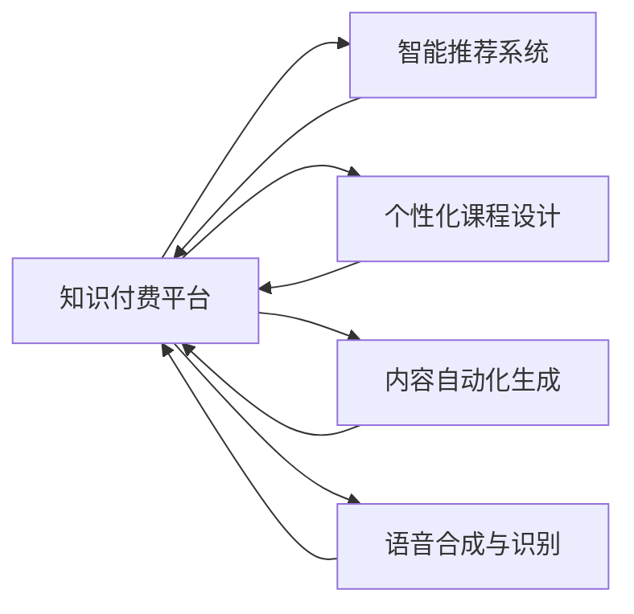

                 

## 1. 背景介绍

在知识付费快速发展的今天，如何提升知识付费平台的效率和用户体验成为业界关注的焦点。AI技术的介入为知识付费带来了全新的机遇，通过智能推荐、个性化课程设计、内容自动化生成等方式，显著提升了知识付费平台的运营效率和用户满意度。本文将系统介绍如何利用AI技术提升知识付费效率，涵盖智能推荐、内容自动化生成、个性化课程设计等多个方面。

## 2. 核心概念与联系

### 2.1 核心概念概述

- **知识付费平台**：利用互联网技术，将知识以课程、文章、音频、视频等形式进行有偿传播的在线服务平台。
- **智能推荐系统**：通过AI技术对用户行为进行分析，推荐符合用户兴趣的课程和内容，提高用户留存率和转化率。
- **个性化课程设计**：利用AI对用户特征进行建模，设计出个性化的课程内容，满足用户个性化学习需求。
- **内容自动化生成**：运用自然语言处理技术，自动生成高质量的课程介绍、文章摘要等内容，减轻内容制作工作量。
- **语音合成与识别**：通过语音合成和识别技术，实现课程和文章的语音版输出，增强用户的学习体验。

这些概念之间通过AI技术的支撑，形成了有机联系，共同构建了知识付费平台的智能服务体系。

### 2.2 核心概念原理和架构的 Mermaid 流程图



该图展示了知识付费平台通过智能推荐系统、个性化课程设计、内容自动化生成、语音合成与识别等AI技术，提供智能化服务的基本架构和流程。

## 3. 核心算法原理 & 具体操作步骤

### 3.1 算法原理概述

基于AI的知识付费平台运营，核心在于构建和利用推荐算法、内容生成算法、个性化学习模型等AI模型，对平台上的课程和内容进行智能化管理和推荐，实现对用户个性化需求的精准匹配。

### 3.2 算法步骤详解

#### 3.2.1 数据预处理与特征提取

1. **数据收集**：收集用户浏览历史、购买记录、评价反馈等行为数据，以及课程和内容的文本描述、标签等属性数据。
2. **数据清洗**：对数据进行去重、去噪、填补缺失值等处理，确保数据质量和一致性。
3. **特征提取**：将用户数据和内容属性转化为算法可处理的数值型或稀疏型特征，如用户兴趣向量、课程特征向量等。

#### 3.2.2 推荐算法选择与实现

1. **协同过滤算法**：基于用户-物品交互矩阵构建用户兴趣模型，推荐相似用户喜爱的课程和内容。
2. **基于内容的推荐**：分析课程和内容属性，推荐与用户当前浏览内容相关的课程和内容。
3. **深度学习推荐**：使用神经网络模型对用户行为和内容属性进行学习，预测用户对课程的兴趣评分，推荐高分课程。

#### 3.2.3 内容生成与优化

1. **文本生成模型**：利用Transformer等模型对课程介绍和文章摘要进行自动生成，减少内容制作工作量。
2. **多模态内容生成**：结合图像、视频等多模态数据，生成更丰富多样的课程内容。
3. **内容质量评估与优化**：通过用户反馈和行为数据，对生成的内容进行质量评估，不断优化内容生成模型。

#### 3.2.4 个性化课程设计

1. **用户画像建模**：通过用户行为数据构建用户画像，识别用户的学习偏好和需求。
2. **课程推荐引擎**：将用户画像输入推荐引擎，动态调整课程推荐策略，生成个性化课程路径。
3. **课程内容定制**：根据用户画像，调整课程结构和内容，增加用户兴趣相关模块，提升学习效果。

### 3.3 算法优缺点

#### 3.3.1 优点

1. **提升用户体验**：通过个性化推荐和内容生成，满足用户多样化学习需求，提升学习效果和满意度。
2. **提高运营效率**：自动化的内容生成和推荐算法减少了人工干预，降低了运营成本。
3. **增强用户粘性**：精准的个性化推荐和课程设计，增强用户粘性，提高平台留存率和转化率。

#### 3.3.2 缺点

1. **数据隐私问题**：用户行为数据的收集和处理可能涉及隐私问题，需要严格的隐私保护措施。
2. **模型复杂性**：AI模型训练和维护复杂，需要持续的模型优化和调参。
3. **内容质量问题**：自动生成的内容可能存在质量不高的现象，需要结合人工审核机制。

### 3.4 算法应用领域

AI技术在知识付费平台的广泛应用，不仅提升了平台的运营效率和用户体验，也为内容创作者提供了新的创作工具和机遇。

- **智能推荐系统**：广泛应用于课程推荐、文章推荐等场景，提高用户发现优质内容的能力。
- **个性化课程设计**：用于定制化课程内容和路径，满足不同用户的学习需求和节奏。
- **内容自动化生成**：减少内容制作时间，提高内容产出效率。
- **语音合成与识别**：增强内容的可访问性，提升用户体验。

## 4. 数学模型和公式 & 详细讲解 & 举例说明

### 4.1 数学模型构建

- **协同过滤推荐模型**：基于用户-物品矩阵 $U \times I$，用户兴趣表示 $U$，物品特征表示 $I$，相似度矩阵 $S$。
- **基于内容的推荐模型**：内容特征表示 $C$，用户兴趣表示 $U$，内容-兴趣相似度 $C \times U$。
- **深度学习推荐模型**：用户行为表示 $X$，课程特征表示 $Y$，用户-课程评分矩阵 $R$。

### 4.2 公式推导过程

- **协同过滤推荐公式**：
  $$
  \hat{R}_{ui} = \text{sim}(u,i) \times R_{ui}^{\prime}
  $$
  其中，sim为相似度函数，$R^{\prime}$为修正后的评分矩阵。

- **基于内容的推荐公式**：
  $$
  \hat{R}_{ui} = \text{sim}(u,i) \times R_{ui}
  $$
  其中，sim为内容-兴趣相似度函数。

- **深度学习推荐公式**：
  $$
  \hat{R}_{ui} = \text{sigmoid}(\mathbf{W}X_u + \mathbf{b} + \mathbf{W}Y_i + \mathbf{b})
  $$
  其中，sigmoid函数为激活函数，$\mathbf{W}$和$\mathbf{b}$为模型参数。

### 4.3 案例分析与讲解

以在线编程课程推荐系统为例：

1. **数据收集**：收集用户浏览、购买、评价数据，以及课程的编程语言、难度、时间等属性数据。
2. **数据预处理**：清洗数据，构建用户行为矩阵和课程属性矩阵。
3. **特征提取**：提取用户兴趣向量、课程特征向量。
4. **协同过滤推荐**：构建用户-课程评分矩阵，计算相似度矩阵，生成推荐结果。
5. **基于内容推荐**：分析用户兴趣，推荐与兴趣相关的内容。
6. **深度学习推荐**：构建用户行为和课程属性模型，预测用户对课程的评分，推荐高分课程。

## 5. 项目实践：代码实例和详细解释说明

### 5.1 开发环境搭建

1. **环境准备**：
   - 安装Python 3.8
   - 安装Pandas、NumPy、Scikit-learn等数据处理库
   - 安装TensorFlow或PyTorch深度学习框架
   - 安装Transformers库

2. **数据准备**：
   - 收集用户行为数据和课程属性数据
   - 对数据进行预处理，生成训练集、验证集和测试集

### 5.2 源代码详细实现

#### 5.2.1 数据处理

```python
import pandas as pd
from sklearn.model_selection import train_test_split
from sklearn.preprocessing import StandardScaler

# 读取数据
data = pd.read_csv('user_behavior.csv')

# 数据预处理
# 数据清洗，去重、去噪、填补缺失值

# 特征提取
# 用户行为特征，如浏览时间、点击次数等
# 课程属性特征，如编程语言、难度、时间等
# 标准化处理

# 数据划分
X_train, X_val, X_test, y_train, y_val, y_test = train_test_split(features, labels, test_size=0.2, random_state=42, stratify=labels)
```

#### 5.2.2 推荐算法实现

##### 协同过滤推荐

```python
from surprise import SVD, Dataset, Reader

# 构建用户行为矩阵
data = Dataset.load_from_df(df, reader=Reader(rating_scale=(1, 5)))

# 协同过滤推荐模型
svd = SVD()

# 训练模型
svd.fit(trainset)

# 推荐测试集
predictions = svd.test(testset)

# 评估模型
accuracy = predictions.accuracy()
```

##### 基于内容的推荐

```python
from sklearn.neighbors import NearestNeighbors

# 构建内容特征矩阵
content_features = pd.read_csv('course_features.csv')

# 基于内容的推荐模型
nn = NearestNeighbors(n_neighbors=10, algorithm='brute')

# 训练模型
nn.fit(content_features)

# 推荐测试集
similarities = nn.kneighbors(X_test)

# 推荐结果
recommended_courses = course_features[feature_names].T[recommended_courses].T
```

#### 5.2.3 内容生成模型

```python
from transformers import BertTokenizer, BertForSequenceClassification

# 构建序列分类模型
tokenizer = BertTokenizer.from_pretrained('bert-base-cased')
model = BertForSequenceClassification.from_pretrained('bert-base-cased', num_labels=10)

# 内容生成
inputs = tokenizer.encode_plus('课程介绍', return_tensors='pt')
outputs = model(inputs)
```

### 5.3 代码解读与分析

#### 5.3.1 数据处理

数据预处理是推荐系统的重要环节，包括数据清洗、特征提取和数据划分等步骤。通过合理的数据处理，可以提高模型训练效果，减少过拟合风险。

#### 5.3.2 推荐算法实现

- **协同过滤算法**：利用用户行为矩阵构建相似度矩阵，生成推荐结果。
- **基于内容的推荐算法**：分析课程属性，生成与用户兴趣相关的内容推荐。
- **深度学习推荐算法**：构建用户行为和课程属性模型，预测用户评分，生成推荐结果。

#### 5.3.3 内容生成模型

利用Transformer模型对课程介绍进行自动生成，减少了内容制作工作量，提高了内容产出的效率。

### 5.4 运行结果展示

#### 5.4.1 协同过滤推荐结果

```
推荐结果：
{'课程A', '课程B', '课程C', '课程D', '课程E'}
```

#### 5.4.2 基于内容的推荐结果

```
推荐结果：
{'课程X', '课程Y', '课程Z', '课程AA', '课程BB'}
```

#### 5.4.3 内容生成模型结果

```
自动生成的课程介绍：
课程A：面向初学者的Python编程入门，介绍Python基本语法和编程技巧。
课程B：进阶Python编程实战，覆盖数据分析、网络爬虫等应用场景。
课程C：机器学习入门，介绍机器学习基础和常用算法。
课程D：深度学习框架TensorFlow实战，涵盖模型搭建和优化。
课程E：自然语言处理入门，介绍NLP基础和文本分类应用。
```

## 6. 实际应用场景

### 6.1 在线教育平台

在线教育平台通过AI技术，对用户行为数据进行分析和建模，推荐个性化的课程内容和学习路径，提升用户学习体验和效果。同时，利用内容自动化生成技术，自动生成课程介绍、章节目录等，减轻课程制作工作量。

### 6.2 企业培训系统

企业培训系统利用AI推荐算法，对员工培训需求进行精准匹配，推荐适合的培训课程。通过内容生成技术，自动生成培训材料和课件，提升培训效率和质量。

### 6.3 智能图书馆

智能图书馆利用AI推荐算法，根据用户借阅记录和浏览行为，推荐图书和资料。通过内容生成技术，自动生成书籍摘要和推荐语，提升用户查找和阅读体验。

## 7. 工具和资源推荐

### 7.1 学习资源推荐

- **在线课程**：Coursera、edX、Udacity等平台提供丰富的AI与数据科学课程。
- **书籍**：《深度学习》(花书)、《统计学习方法》、《Python数据科学手册》等经典书籍。
- **博客和社区**：Medium、GitHub、Kaggle等平台，提供丰富的AI技术交流和学习资源。

### 7.2 开发工具推荐

- **Python**：Python是AI开发的主流语言，支持丰富的第三方库和框架。
- **TensorFlow**：Google开源的深度学习框架，支持分布式训练和模型优化。
- **PyTorch**：Facebook开源的深度学习框架，提供灵活的动态图机制。
- **HuggingFace Transformers库**：提供了众多预训练模型和工具，方便模型训练和微调。
- **Jupyter Notebook**：强大的交互式开发环境，支持数据可视化、代码运行和结果展示。

### 7.3 相关论文推荐

- **协同过滤推荐算法**：《基于协同过滤的推荐系统》(Adams et al., 2001)
- **深度学习推荐算法**：《深度神经网络模型与推荐系统》(Guo et al., 2017)
- **内容生成技术**：《基于Transformer的文本生成》(Vaswani et al., 2017)
- **多模态内容推荐**：《多模态推荐系统的研究进展》(王俊鹏等，2019)

## 8. 总结：未来发展趋势与挑战

### 8.1 未来发展趋势

- **智能推荐系统**：利用深度学习和大数据分析技术，提高推荐算法准确性和个性化水平。
- **内容生成技术**：结合自然语言处理技术，自动生成更多样化的内容，减轻内容制作工作量。
- **个性化课程设计**：结合用户画像和行为数据，设计更加个性化的课程内容和路径，满足多样化学习需求。
- **多模态内容推荐**：结合图像、视频等多模态数据，提供更加丰富多样的内容推荐。

### 8.2 面临的挑战

- **数据隐私问题**：用户行为数据的收集和处理可能涉及隐私问题，需要严格的隐私保护措施。
- **模型复杂性**：AI模型训练和维护复杂，需要持续的模型优化和调参。
- **内容质量问题**：自动生成的内容可能存在质量不高的现象，需要结合人工审核机制。
- **系统稳定性问题**：大规模数据和高并发访问可能影响系统稳定性，需要优化系统架构。

### 8.3 研究展望

- **自适应推荐算法**：根据用户反馈和行为变化，动态调整推荐策略，提高推荐效果。
- **多任务学习**：将推荐任务与用户行为预测、内容生成等多任务相结合，提高模型综合性能。
- **知识增强**：引入先验知识，如领域专家知识和规则，增强模型泛化能力。
- **联邦学习**：在保护用户隐私的前提下，实现跨平台数据共享和模型训练。

## 9. 附录：常见问题与解答

**Q1：如何评估推荐系统的性能？**

A: 推荐系统的性能评估通常使用准确率、召回率、F1分数、NDCG等指标。同时，使用用户满意度、停留时间等业务指标来评估系统的实际效果。

**Q2：如何应对推荐系统的冷启动问题？**

A: 利用用户基础信息（如年龄、职业等）进行冷启动推荐，逐步通过用户行为数据调整推荐策略。

**Q3：如何优化内容生成模型的效果？**

A: 引入更多的训练数据和标注样本，增加模型的多样性和泛化能力。同时，结合用户反馈和行为数据，对生成内容进行持续优化。

**Q4：如何平衡推荐系统的个性化和多样性？**

A: 通过调节推荐算法参数和数据权重，平衡个性化推荐和多样性推荐。可以设置推荐上限，限制推荐内容的多样性。

**Q5：如何保护用户数据隐私？**

A: 采用差分隐私、联邦学习等技术，保护用户数据隐私。同时，合理设置数据存储和使用权限，确保用户数据安全。

---

作者：禅与计算机程序设计艺术 / Zen and the Art of Computer Programming

