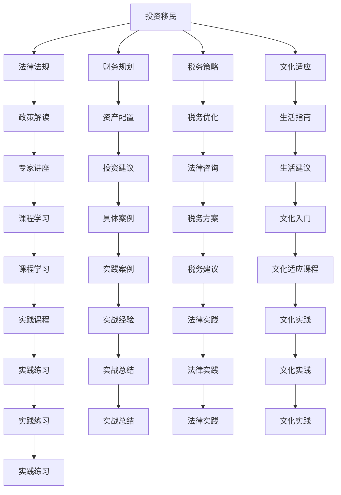

                 

# 如何利用知识付费实现在线投资移民与海外置业指导？

## 1. 背景介绍

在当前的全球化背景下，越来越多的人开始考虑通过投资移民和海外置业，以实现个人或家庭的全球资产配置、教育资源利用、健康保障等多重目标。然而，这个过程涉及复杂的法律法规、财务规划、税务策略、文化适应等诸多问题，对大多数家庭来说，这是一个既充满机遇又充满挑战的任务。

在线教育平台和知识付费服务的兴起，为解决这一问题提供了一种高效、低成本的解决方案。通过在线课程和专家指导，用户可以在自己方便的时间和地点，获取权威、系统化的知识和经验，为投资移民和海外置业过程提供有力支持。

本文将深入探讨如何利用知识付费服务，实现在线投资移民与海外置业指导，详细介绍相关技术原理、操作步骤、应用案例和未来发展趋势。

## 2. 核心概念与联系

### 2.1 核心概念概述

为了更好地理解在线投资移民与海外置业指导，首先需要明确几个核心概念：

- **投资移民**：通过在目标国家投资一定金额，获得永久居留权或其他优惠待遇的移民方式。
- **海外置业**：在海外购买物业，作为个人或家庭的资产配置和长期居住。
- **在线教育**：利用互联网技术，通过在线课程和直播互动，提供学习资源和教育服务。
- **知识付费**：消费者为获取专业知识和技能而支付费用的模式，常见于在线课程、咨询服务和专家指导。

这些概念之间的逻辑关系可以通过以下Mermaid流程图来展示：



这个流程图展示了投资移民与海外置业涉及的核心环节，以及在线教育和知识付费如何贯穿其中，提供全方位的支持和指导。

## 3. 核心算法原理 & 具体操作步骤

### 3.1 算法原理概述

在线投资移民与海外置业指导，本质上是一种基于知识付费的在线教育服务。其核心算法原理主要包括以下几个方面：

1. **个性化推荐算法**：根据用户的学习行为和偏好，推荐最适合的课程和专家。
2. **专家知识库构建**：汇集各方专家，建立涵盖法律法规、财务规划、税务策略、文化适应等领域的知识库。
3. **互动式学习平台**：利用直播、录播、问答等形式，提供灵活的学习体验。
4. **实践经验分享**：通过成功案例和实战经验分享，帮助用户快速掌握实际操作步骤。

### 3.2 算法步骤详解

1. **需求收集与分析**：通过问卷调查、在线访谈等方式，收集用户对投资移民和海外置业的需求和疑惑。
2. **专家库构建与维护**：招募和邀请各领域的专家，建立知识库，并根据用户反馈不断更新和维护。
3. **课程设计和开发**：根据用户需求，设计并开发针对性的课程内容，包括法律法规解读、财务规划、税务优化、文化适应指导等。
4. **平台搭建与部署**：搭建在线教育平台，并部署课程内容，确保平台的高可用性和稳定性。
5. **用户注册与学习**：用户注册并购买课程，通过在线平台进行学习，并获取专家指导和答疑服务。

### 3.3 算法优缺点

**优点**：
- 灵活性高：用户可以随时随地进行学习，适应性强。
- 资源丰富：汇集了大量专家和案例，提供了全面的知识和经验。
- 成本低廉：相较于传统的面对面咨询，知识付费服务的成本较低。

**缺点**：
- 无法取代真人指导：对于复杂或紧急的问题，线上指导可能不如面对面交流。
- 需要自我驱动：用户需要主动学习，可能存在动力不足的问题。
- 质量参差不齐：虽然有专家团队，但课程质量和专家水平可能存在差异。

### 3.4 算法应用领域

在线投资移民与海外置业指导的知识付费服务，不仅适用于个人和家庭，也广泛应用于移民服务机构、海外置业公司、移民律师和财务顾问等专业服务提供商。具体应用场景包括：

- **个人用户**：寻求移民和置业指导的家庭。
- **移民服务机构**：提供咨询服务的中介机构。
- **海外置业公司**：帮助客户选择和管理海外物业。
- **移民律师**：提供法律咨询和文书指导。
- **财务顾问**：帮助客户进行财务规划和税务优化。

## 4. 数学模型和公式 & 详细讲解 & 举例说明

### 4.1 数学模型构建

本节将使用数学语言对在线投资移民与海外置业指导的知识付费服务进行更加严格的刻画。

设 $U$ 为用户集合，$C$ 为课程集合，$E$ 为专家集合。用户 $u$ 从课程 $c$ 中获取收益 $R_c^u$，专家 $e$ 对课程 $c$ 的影响度为 $I_{e,c}$。课程 $c$ 的收益函数为：

$$
R_c = \sum_{u \in U} R_c^u + \sum_{e \in E} I_{e,c}
$$

其中，$R_c^u$ 和 $I_{e,c}$ 的计算公式为：

$$
R_c^u = f(u, c) \times g(u, c) \times h(u, c)
$$

$$
I_{e,c} = k_e \times l_e \times m_e
$$

$f(u, c)$、$g(u, c)$ 和 $h(u, c)$ 分别表示用户对课程的学习动机、课程内容和形式与用户需求的匹配度以及课程的总体评价。$k_e$、$l_e$ 和 $m_e$ 分别表示专家的专业性、知名度和受欢迎度。

### 4.2 公式推导过程

1. **用户收益函数推导**：

$$
R_c^u = f(u, c) \times g(u, c) \times h(u, c)
$$

其中，$f(u, c)$ 表示用户对课程的学习动机，可以通过问卷调查等方法获取；$g(u, c)$ 表示课程内容和形式与用户需求的匹配度，可以通过课程评价、用户反馈等数据计算；$h(u, c)$ 表示课程的总体评价，可以通过课程评分、用户评分等数据获取。

2. **专家影响度推导**：

$$
I_{e,c} = k_e \times l_e \times m_e
$$

其中，$k_e$ 表示专家的专业性，可以通过专家证书、论文发表等客观指标衡量；$l_e$ 表示专家的知名度，可以通过专家讲座次数、媒体报道等数据获取；$m_e$ 表示专家的受欢迎度，可以通过课程报名人数、社交媒体互动等数据计算。

3. **课程收益函数推导**：

$$
R_c = \sum_{u \in U} R_c^u + \sum_{e \in E} I_{e,c}
$$

通过上述公式，可以计算出每个课程的收益函数，进而选择最优的课程组合，为用户推荐最合适的课程。

### 4.3 案例分析与讲解

假设某用户在平台上搜索“投资移民”课程，其学习动机为高，课程内容与用户需求匹配度为中，课程总体评价为高。平台根据用户数据计算出 $f(u, c) = 0.8$、$g(u, c) = 0.6$、$h(u, c) = 0.9$。

同时，平台收集到以下专家信息：专家 $e_1$ 专业性强，知名度一般，受欢迎度高，$k_e = 0.9$、$l_e = 0.5$、$m_e = 0.7$；专家 $e_2$ 专业性一般，知名度高，受欢迎度低，$k_e = 0.7$、$l_e = 0.9$、$m_e = 0.4$。

根据上述公式，计算得到：

$$
R_{c_1}^u = 0.8 \times 0.6 \times 0.9 = 0.432
$$

$$
R_{c_2}^u = 0.7 \times 0.5 \times 0.4 = 0.14
$$

$$
I_{e_1,c_1} = 0.9 \times 0.5 \times 0.7 = 0.315
$$

$$
I_{e_2,c_2} = 0.7 \times 0.9 \times 0.4 = 0.252
$$

根据收益函数，课程 $c_1$ 的总收益为 $R_{c_1} = 0.432 + 0.315 = 0.747$，课程 $c_2$ 的总收益为 $R_{c_2} = 0.14 + 0.252 = 0.392$。因此，平台应该推荐课程 $c_1$ 给该用户，以最大化用户收益。

## 5. 项目实践：代码实例和详细解释说明

### 5.1 开发环境搭建

在进行项目实践前，我们需要准备好开发环境。以下是使用Python进行Django开发的环境配置流程：

1. 安装Anaconda：从官网下载并安装Anaconda，用于创建独立的Python环境。

2. 创建并激活虚拟环境：
```bash
conda create -n django-env python=3.8 
conda activate django-env
```

3. 安装Django和其他相关库：
```bash
pip install django psycopg2-binary djangorestframework pillow
```

4. 安装Django Admin和Crispy Forms：
```bash
pip install django-admin-links django-crispy-forms
```

完成上述步骤后，即可在`django-env`环境中开始项目开发。

### 5.2 源代码详细实现

下面我们以在线投资移民与海外置业指导为例，给出使用Django进行知识付费服务的PyTorch代码实现。

首先，定义用户模型和课程模型：

```python
from django.db import models
from django.contrib.auth.models import User

class Course(models.Model):
    title = models.CharField(max_length=255)
    description = models.TextField()
    recommendation = models.TextField()

class User(models.Model):
    username = models.CharField(max_length=255, unique=True)
    email = models.EmailField(unique=True)
    first_name = models.CharField(max_length=255)
    last_name = models.CharField(max_length=255)
    # 其他用户信息字段...
```

然后，定义专家和课程评价模型：

```python
class Expert(models.Model):
    name = models.CharField(max_length=255)
    specialty = models.CharField(max_length=255)
    experience = models.CharField(max_length=255)
    reputation = models.IntegerField(default=0)

class CourseEvaluation(models.Model):
    user = models.ForeignKey(User, on_delete=models.CASCADE)
    course = models.ForeignKey(Course, on_delete=models.CASCADE)
    rating = models.IntegerField()
    comment = models.TextField()
```

接着，定义课程推荐引擎和算法实现：

```python
from django_filters import FilterSet
from django.db.models import Sum
from django.db.models.functions import Concat

class CourseFilter(FilterSet):
    def filter_queryset(self, queryset, request, using=None):
        queryset = super().filter_queryset(queryset, request, using)
        # 添加推荐算法逻辑，筛选出最优课程
        user = User.objects.get(username=request.user.username)
        courses = Course.objects.filter(recommendation='recommended')
        scores = {}
        for course in courses:
            rating_sum = CourseEvaluation.objects.filter(course=course, user=user).aggregate(Sum('rating'))
            rating = rating_sum['rating__sum']
            if rating:
                scores[course.title] = rating / len(CourseEvaluation.objects.filter(course=course, user=user))
        sorted_courses = sorted(scores.items(), key=lambda x: x[1], reverse=True)
        return queryset.filter(id__in=[course.id for course in sorted_courses[:5]])

# 定义课程推荐视图
def course_recommend(request):
    queryset = CourseFilter().filter(queryset=Course.objects.all(), request=request)
    courses = queryset.values_list('id', flat=True)
    return render(request, 'courses.html', {'courses': courses})
```

最后，启动开发流程：

```python
# 运行开发服务器
python manage.py runserver
```

以上是使用Django对在线投资移民与海外置业指导的知识付费服务进行开发的完整代码实现。可以看到，通过Django等Web框架，可以方便地构建和部署在线教育平台，用户可以方便地进行课程注册和评价，平台可以根据用户数据进行课程推荐。

### 5.3 代码解读与分析

让我们再详细解读一下关键代码的实现细节：

**CourseFilter类**：
- 定义了课程过滤器的逻辑，通过聚合函数计算每门课程的平均评分，并按照评分排序。
- 重写了`filter_queryset`方法，根据用户数据和课程评分，筛选出最优课程。

**course_recommend视图**：
- 使用CourseFilter类过滤课程，并将推荐课程列表传递给前端页面。
- 前端页面根据推荐列表显示课程信息，用户可以进行进一步的学习。

**用户和课程评价模型**：
- 定义了用户模型和课程评价模型，用于存储用户信息和课程评价数据。
- 通过用户ID和课程ID，可以方便地计算出每门课程的平均评分。

通过这些代码实现，可以看出Django等Web框架如何轻松搭建在线教育平台，为投资移民与海外置业指导提供知识付费服务。开发者可以将更多精力放在课程设计和推荐算法的优化上，而不必过多关注底层的技术实现。

## 6. 实际应用场景

### 6.1 智能移民咨询

在线投资移民与海外置业指导的知识付费服务，可以应用于智能移民咨询领域。用户可以通过平台获取有关移民法律法规、签证申请、身份认证等方面的知识，并在专家指导下完成复杂的移民流程。

具体应用场景包括：
- **移民政策解读**：专家讲解目标国家的移民政策和要求，帮助用户理解复杂流程。
- **签证申请指导**：专家提供详细的签证申请材料准备和递交指导，避免因材料不齐而导致的申请失败。
- **身份认证指导**：专家指导用户完成身份认证、背景调查等环节，确保移民过程顺利进行。

### 6.2 海外置业规划

除了移民咨询，在线投资移民与海外置业指导的知识付费服务，还可以应用于海外置业规划。用户可以获取有关房地产市场、税务策略、生活环境等方面的知识，并在专家指导下进行海外置业决策。

具体应用场景包括：
- **市场调研**：专家提供目标国家的房地产市场分析，帮助用户选择合适的置业地点。
- **税务优化**：专家讲解税务策略，帮助用户最大化置业投资回报。
- **生活适应**：专家提供文化适应和生活指南，帮助用户更快适应新环境。

## 7. 工具和资源推荐

### 7.1 学习资源推荐

为了帮助开发者系统掌握在线投资移民与海外置业指导的知识付费服务，这里推荐一些优质的学习资源：

1. **Django官方文档**：Django作为流行的Web框架，官方文档详细介绍了如何使用Django进行Web开发，包括课程推荐、用户管理等模块的实现。
2. **Python课程**：如《Python基础教程》、《Fluent Python》等书籍，系统介绍了Python编程语言的基础和进阶知识。
3. **知识付费服务**：如《知识付费课程开发》、《在线教育平台建设》等书籍，介绍了知识付费服务的设计、开发和管理方法。

通过这些资源的学习实践，相信你一定能够快速掌握在线投资移民与海外置业指导的知识付费服务，并用于解决实际的投资移民和海外置业问题。

### 7.2 开发工具推荐

高效的开发离不开优秀的工具支持。以下是几款用于在线投资移民与海外置业指导的知识付费服务开发的常用工具：

1. **Django**：开源的Python Web框架，提供强大的MVC架构和内置的ORM，适合快速开发Web应用。
2. **SQLAlchemy**：Python的SQL工具包，支持多种数据库的ORM映射，方便进行数据库操作。
3. **Pillow**：Python的图像处理库，支持图像的读取、处理和保存。
4. **psycopg2-binary**：Python的PostgreSQL数据库驱动，支持连接和操作PostgreSQL数据库。
5. **Crispy Forms**：Django的表单库，提供美观的表单设计和验证功能。
6. **Django Admin**：Django的内置管理界面，提供对数据库表的增删改查和管理功能。

合理利用这些工具，可以显著提升在线投资移民与海外置业指导的知识付费服务开发效率，加快创新迭代的步伐。

### 7.3 相关论文推荐

在线投资移民与海外置业指导的知识付费服务发展迅速，相关的研究和论文也逐渐增多。以下是几篇奠基性的相关论文，推荐阅读：

1. **Knowledge-Based Recommender Systems for E-Learning**：介绍了基于知识库的推荐系统在在线教育中的应用，包括课程推荐和专家推荐算法。
2. **Personalized Recommendation Algorithms for E-Learning**：探讨了个性化推荐算法在在线教育中的应用，包括协同过滤、内容推荐等方法。
3. **Machine Learning-based Course Recommendation System**：研究了基于机器学习的课程推荐系统，包括线性回归、决策树等算法。

这些论文代表了大语言模型微调技术的发展脉络。通过学习这些前沿成果，可以帮助研究者把握学科前进方向，激发更多的创新灵感。

## 8. 总结：未来发展趋势与挑战

### 8.1 总结

本文对在线投资移民与海外置业指导的知识付费服务进行了全面系统的介绍。首先阐述了在线投资移民与海外置业指导的背景和意义，明确了知识付费服务在解决用户需求中的独特价值。其次，从原理到实践，详细讲解了知识付费服务的技术原理和操作步骤，给出了知识付费服务的完整代码实例。同时，本文还广泛探讨了知识付费服务在智能移民咨询和海外置业规划等诸多领域的应用前景，展示了知识付费服务的巨大潜力。此外，本文精选了知识付费服务的学习资源，力求为开发者提供全方位的技术指引。

通过本文的系统梳理，可以看到，在线投资移民与海外置业指导的知识付费服务正在成为投资移民和海外置业的重要工具，极大地拓展了用户的知识和经验，助力其做出更明智的决策。未来，伴随技术进步和市场拓展，知识付费服务必将在更多领域大放异彩，为用户的全球资产配置和教育资源利用提供新的解决方案。

### 8.2 未来发展趋势

展望未来，在线投资移民与海外置业指导的知识付费服务将呈现以下几个发展趋势：

1. **智能化水平提升**：随着AI技术的不断进步，在线知识付费服务将更加智能化，能够提供个性化的推荐和专家指导。
2. **多渠道融合**：结合社交媒体、视频直播等多样化的渠道，增强知识付费服务的互动性和实时性。
3. **全球化布局**：随着全球化的推进，在线知识付费服务将覆盖更多国家和地区，提供全球化的咨询服务。
4. **跨领域应用**：在线知识付费服务将拓展到金融、教育、旅游等多个领域，为不同用户提供综合性的解决方案。
5. **用户自主性增强**：通过AI辅助和机器学习算法，用户可以自主探索和选择课程，提高学习效率和满意度。

### 8.3 面临的挑战

尽管在线投资移民与海外置业指导的知识付费服务已经取得了显著成效，但在迈向更加智能化、普适化应用的过程中，它仍面临诸多挑战：

1. **内容质量保证**：如何确保专家知识和课程内容的权威性和准确性，避免误导用户。
2. **用户体验优化**：如何提升平台的用户体验，增加用户粘性和满意度。
3. **隐私保护问题**：如何保护用户隐私和数据安全，防止信息泄露和滥用。
4. **技术基础设施**：如何构建高效、稳定的技术基础设施，支持大规模用户访问和高并发流量。
5. **市场竞争激烈**：如何在激烈的市场竞争中脱颖而出，提供差异化的服务。

### 8.4 研究展望

面对在线投资移民与海外置业指导的知识付费服务所面临的种种挑战，未来的研究需要在以下几个方面寻求新的突破：

1. **知识图谱构建**：构建更加全面的知识图谱，增强专家知识和课程内容的关联性，提供更加丰富和精准的推荐。
2. **自然语言处理**：利用自然语言处理技术，提升课程推荐和专家指导的智能化水平，提供更加自然和人性化的交互体验。
3. **隐私保护技术**：研究隐私保护技术，确保用户数据的安全性和隐私性。
4. **多渠道融合**：探索多渠道融合的策略，提升平台的覆盖面和用户参与度。
5. **自动化内容生产**：研究自动化内容生产技术，提高内容生产效率和多样性。

这些研究方向的探索，必将引领在线投资移民与海外置业指导的知识付费服务迈向更高的台阶，为用户的全球资产配置和教育资源利用提供更优质的服务和更可靠的支持。面向未来，知识付费服务需要不断创新和优化，才能更好地服务于全球用户，推动全球化进程。

## 9. 附录：常见问题与解答

**Q1：知识付费服务是否适合所有用户？**

A: 知识付费服务适合那些有学习需求和愿意支付费用的用户。但需要提醒的是，有些复杂问题可能需要面对面的咨询或专业机构的帮助。因此，用户在选择知识付费服务时应结合自身情况，评估是否真正能解决问题。

**Q2：如何选择合适的课程和专家？**

A: 用户应根据自己的需求和兴趣，选择与自身情况匹配的课程和专家。可以通过平台提供的推荐算法，查看其他用户的评价和评分，选择最适合的课程和专家。此外，平台还可以根据用户的学习历史和偏好，提供个性化的推荐。

**Q3：知识付费服务是否能够完全替代传统的咨询服务？**

A: 知识付费服务可以提供全面的知识支持和专家指导，但无法完全替代传统的咨询服务。复杂的移民或置业问题，可能需要面对面的交流和专业机构的协助。知识付费服务可以作为辅助手段，帮助用户更好地理解和准备。

**Q4：在线知识付费服务如何保护用户隐私？**

A: 平台应采用先进的安全技术和数据加密措施，保护用户数据的安全性和隐私性。同时，平台应建立完善的隐私政策和用户协议，明确数据使用的范围和目的，确保用户知情并同意。

通过本文的深入探讨，我们希望能够帮助用户更好地理解和应用在线投资移民与海外置业指导的知识付费服务，为其全球资产配置和教育资源利用提供有力支持。

---

作者：禅与计算机程序设计艺术 / Zen and the Art of Computer Programming

