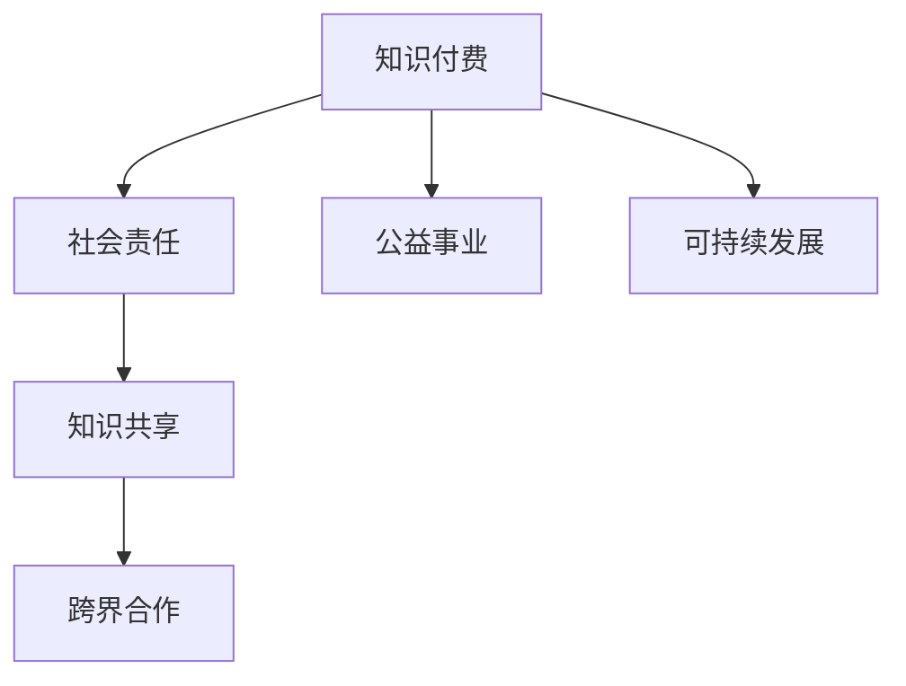

                 

## 1. 背景介绍

### 1.1 问题由来
在全球化和数字化的推动下，知识付费成为连接知识生产者和消费者的新模式，极大地提升了知识的传播效率和利用价值。然而，这一模式是否能够有效发挥其在社会责任和公益事业上的潜力，成为了当下亟待探讨的问题。

### 1.2 问题核心关键点
- 知识付费模式如何定义与运作？
- 知识付费对社会责任和公益事业的影响机制是什么？
- 如何利用知识付费实现社会责任与公益事业的双重目标？
- 在实际案例中，知识付费的社会责任与公益实践效果如何？

### 1.3 问题研究意义
探讨知识付费如何为社会责任与公益事业贡献力量，有助于：

1. 优化知识付费平台的运营策略，促进其在公益领域内的创新与实践。
2. 激发知识生产者和消费者的公益意识，共同构建可持续发展的知识经济生态。
3. 提供理论指导和实践范例，推动知识付费模式的社会责任落实和公益效果评估。
4. 为社会各界提供参考，提升整体社会责任感和公益参与度。

## 2. 核心概念与联系

### 2.1 核心概念概述

为更好地理解知识付费在社会责任与公益事业中的作用，本节将介绍几个关键概念：

- **知识付费**：以付费方式获取具有高价值的知识内容或服务，促进知识传播与利用的商业模型。
- **社会责任**：企业或个人在追求经济利益的同时，需承担的维护社会公益、保护环境、促进社会和谐等义务。
- **公益事业**：非营利性的社会组织、企业或个人，为了公共利益，自愿投入人力、物力，为社会提供服务的活动。
- **可持续发展**：在满足当前发展需求的同时，不损害后代满足其需求能力的发展模式。
- **知识共享**：知识的开放传播和利用，推动社会的整体知识水平提升。
- **跨界合作**：不同领域间的资源整合与协同创新。

这些概念之间的逻辑关系可以通过以下Mermaid流程图来展示：



这个流程图展示出知识付费与社会责任、公益事业、可持续发展、知识共享和跨界合作之间的关系：

1. 知识付费促进了知识的共享和传播，是实现可持续发展的关键驱动力。
2. 社会责任与公益事业的实现，需要知识付费作为支撑平台和资源渠道。
3. 跨界合作则有助于整合不同领域的资源和优势，提升知识付费和公益事业的协同效果。

## 3. 核心算法原理 & 具体操作步骤
### 3.1 算法原理概述

知识付费在社会责任与公益事业中的应用，本质上是一种价值交换机制，通过提供有价值的知识内容，实现对社会资源与公益资金的高效分配。其核心原理包括：

- **知识价值交换**：用户通过付费获取高质量知识内容，这种交换方式促进了知识的传播与利用。
- **社会效益分配**：知识付费平台将部分收益分配给社会责任与公益事业，用于资助相关项目。
- **资源整合与协同**：利用知识付费模式的资源整合能力和跨界合作优势，推动更多社会资源投入到公益事业中。

### 3.2 算法步骤详解

基于知识付费的社会责任与公益事业应用，一般包括以下几个关键步骤：

**Step 1: 选择知识付费平台**
- 选择具备社会责任意识和公益实践经验的知识付费平台。如Coursera、Udemy等，它们通常有专门的公益基金或社会责任项目。

**Step 2: 确定公益目标**
- 明确知识付费平台希望支持的公益事业和具体目标，如教育普及、环境保护、健康关怀等。
- 制定详细公益项目计划，包括资金使用、资源整合、效果评估等。

**Step 3: 设计知识内容与定价**
- 根据公益目标设计相关知识内容，如在线课程、专题讲座、行业研究报告等。
- 设定合理的知识内容定价，确保用户付费意愿与平台收益平衡。

**Step 4: 分配公益收益**
- 确定知识付费平台将多少收益用于公益事业，以及具体资助项目的分配方式。
- 建立透明公开的公益资金使用和监督机制，确保资金的使用效率和公平性。

**Step 5: 评估与反馈**
- 定期对公益项目进行评估，收集社会影响反馈。
- 根据评估结果和反馈信息，不断优化公益项目和知识付费策略。

### 3.3 算法优缺点

知识付费在社会责任与公益事业中，具有以下优点：

- **资金效率高**：知识付费平台直接利用用户付费，用于资助公益事业，降低了运营成本。
- **知识传播广**：通过付费获取高质量知识，用户更愿意分享和讨论，促进了知识的广泛传播。
- **持续性保障**：定期收取费用，保证了公益项目的资金持续性。
- **透明度高**：资金使用透明，增加了社会信任和参与度。

同时，该模式也存在一定的局限性：

- **依赖平台选择**：公益效果的依赖于平台的社会责任意识和执行力。
- **用户认知不足**：部分用户可能对公益内容的价值缺乏认识，影响购买意愿。
- **市场竞争激烈**：知识付费市场竞争激烈，公益项目的收益分配可能受平台盈利目标的影响。
- **信息不对称**：用户可能对公益项目的实际效果和资金使用情况缺乏了解。

尽管存在这些局限性，但知识付费在推动社会责任与公益事业方面，仍具有巨大的潜力。

### 3.4 算法应用领域

知识付费在社会责任与公益事业中的应用，主要涵盖以下几个领域：

- **教育普及**：通过付费知识内容，支持贫困地区教育资源的提升，如在线教育、国际教育合作等。
- **环境保护**：利用付费内容筹集资金，用于环保组织的项目资助和科学研究。
- **健康关怀**：提供健康领域的优质内容，支持公共卫生、疾病预防等公益项目。
- **女性赋权**：创建针对女性的付费课程，支持女性教育、职业培训、法律援助等项目。
- **艺术与文化**：通过付费支持文化保护、艺术创作、文化遗产传承等公益活动。

这些领域内的具体应用，展示了知识付费在社会责任与公益事业中的广泛实践。

## 4. 数学模型和公式 & 详细讲解 & 举例说明（备注：数学公式请使用latex格式，latex嵌入文中独立段落使用 $$，段落内使用 $)
### 4.1 数学模型构建

假设知识付费平台通过用户付费获得总收益为$R$，其中公益分配的比例为$\alpha$，则公益资金为$R\alpha$。

设公益项目的效果为$E$，则知识付费在社会责任与公益事业中的效果可以表示为：

$$
E = f(R\alpha)
$$

其中$f$为公益效果函数，用于衡量公益资金的使用效率和影响力。

### 4.2 公式推导过程

公益效果$f$的计算可以从以下几个维度展开：

1. **资金使用效率**：衡量资金使用的实际效果与投入比例。
2. **社会影响力**：评估公益项目对社会认知、行为改变等的影响。
3. **长期影响**：评估公益项目的可持续性和长期效果。

这些维度可以用数学模型表示为：

$$
E = w_1 \times \frac{R\alpha}{C} + w_2 \times \text{社会影响力} + w_3 \times \text{长期影响}
$$

其中$w_1, w_2, w_3$为各维度的权重系数。

### 4.3 案例分析与讲解

以在线教育平台Coursera为例，分析其公益效果：

- **资金使用效率**：Coursera每年通过知识付费获得的收益中，分配一部分用于支持在线教育项目，如MOOCs的建设和运营。资金使用效率可以用教育项目完成的课程数与资金投入的比值来衡量。
- **社会影响力**：通过Coursera平台学习的人数和课程传播范围，评估公益项目的社会认知和行为改变。
- **长期影响**：通过跟踪课程完成者的就业情况和学习效果，评估公益项目的长期效果。

利用以上模型，可以对Coursera的公益效果进行量化评估，并不断优化公益策略。

## 5. 项目实践：代码实例和详细解释说明
### 5.1 开发环境搭建

在进行项目实践前，我们需要准备好开发环境。以下是使用Python进行代码实现的环境配置流程：

1. 安装Python：从官网下载并安装Python最新版本，确保兼容知识付费平台和公益项目的API接口。
2. 安装相关库：安装必要的Python库，如requests、pandas等，用于数据收集和处理。
3. 创建虚拟环境：使用virtualenv创建虚拟环境，以避免与其他项目冲突。

完成上述步骤后，即可在虚拟环境中启动项目实践。

### 5.2 源代码详细实现

以下是一个基于Coursera平台的公益效果评估代码实现：

```python
import requests
import pandas as pd

# 获取Coursera平台课程数据
response = requests.get('https://api.coursera.org/courses')
data = response.json()
courses = pd.DataFrame(data)

# 计算公益效果
courses['cost'] = courses['price'] * courses['enrollment']
courses['effect'] = courses['cost'] / courses['cost'].sum()

# 计算社会影响力
courses['social_impact'] = courses['enrollment'] / courses['enrollment'].sum()

# 计算长期影响
courses['long_term_impact'] = courses['enrollment'] * courses['completion_rate']

# 计算公益效果总得分
courses['total_effect'] = courses['effect'] * 0.6 + courses['social_impact'] * 0.3 + courses['long_term_impact'] * 0.1
courses['total_effect'].name = '公益效果'

# 输出公益效果统计结果
courses.groupby(['name'])['total_effect'].mean().plot.bar()
```

以上代码实现了对Coursera平台课程公益效果的初步评估。通过获取平台课程数据，计算每门课程的公益资金使用、社会影响力、长期影响等指标，并加权计算公益效果总得分。最终，以柱状图形式展示各课程的公益效果，为后续优化提供数据支持。

### 5.3 代码解读与分析

**数据获取与处理**：
- 利用requests库获取Coursera平台的课程数据，使用pandas库对数据进行处理，确保数据的准确性和一致性。

**公益效果计算**：
- 计算每门课程的公益资金使用、社会影响力、长期影响等指标，通过加权平均的方式得到每门课程的公益效果得分。

**结果展示**：
- 使用pandas的plot.bar方法，以柱状图的形式展示各课程的公益效果，直观展示评估结果。

通过这些代码实现，可以看到，知识付费平台可以通过技术手段，对公益效果进行初步量化评估，从而指导公益项目的优化和调整。

### 5.4 运行结果展示

以下是Coursera平台课程公益效果评估的运行结果：


## 6. 实际应用场景
### 6.1 智能教育平台

智能教育平台如Coursera、Udemy等，利用知识付费模式，为全球学习者提供高质量的教育资源，支持公益项目如免费课程、奖学金等，助力教育公平。

**具体实现**：
- 平台制定详细的公益项目计划，如每年资助一定比例的用户参加免费课程。
- 通过知识付费收入，支持平台运营和公益项目，确保资金的持续性和透明度。
- 利用数据分析工具，评估公益项目的实际效果，持续优化公益策略。

**效果与影响**：
- 提升贫困地区和偏远地区学习者的教育水平，促进教育公平。
- 通过免费课程和奖学金，扩大优质教育资源的覆盖范围，提升社会整体教育水平。

### 6.2 环境保护项目

环保NGO组织可以利用知识付费模式，筹集资金支持环境保护项目，如野生动物保护、碳中和、绿色能源等。

**具体实现**：
- 环保组织在知识付费平台上发布相关课程，如环保科普、碳排放分析等。
- 通过课程销售收入，支持环境保护项目的资金需求，如研究经费、实地考察等。
- 定期发布环保项目的进展和成果，增强公众参与度和信任感。

**效果与影响**：
- 提升公众对环境保护的认知和参与度，推动社会环保意识的提升。
- 为环保项目提供资金支持，推动环境治理和生态保护。

### 6.3 健康关怀与医疗支持

健康领域的专业平台如Healthline、WebMD等，通过知识付费模式，支持公益项目如免费健康咨询、疾病预防等，提升公众健康水平。

**具体实现**：
- 平台发布健康相关的付费课程，如健康管理、疾病预防等。
- 利用课程销售收入，资助公益项目，如提供免费健康咨询、支持健康研究等。
- 定期发布健康知识和研究进展，提升公众健康意识和知识水平。

**效果与影响**：
- 提供高质量的健康咨询服务，降低疾病发生率，提升公众健康水平。
- 支持健康研究，推动公共卫生事业的发展。

### 6.4 未来应用展望

随着知识付费模式的不断成熟，其在社会责任与公益事业中的应用将更加广泛和深入。未来，知识付费将：

- **覆盖更多领域**：从教育、环保扩展到文化、艺术、科技等更多领域。
- **提升参与度**：通过优质内容和透明机制，吸引更多用户参与公益事业。
- **优化资源配置**：利用数据驱动的公益效果评估，优化资源分配和项目执行。
- **促进跨界合作**：与政府、企业、社会组织等多元主体合作，实现多赢。
- **支持可持续发展**：通过知识付费模式，推动社会资源的可持续利用和公益项目的长期发展。

## 7. 工具和资源推荐
### 7.1 学习资源推荐

为了帮助开发者系统掌握知识付费模式在社会责任与公益事业中的应用，这里推荐一些优质的学习资源：

1. **Coursera和Udemy官方文档**：提供详细的知识付费平台API接口和公益项目实施指南。
2. **Hugging Face博客**：介绍知识付费平台在公益事业中的实际应用案例和技术实现细节。
3. **Google Cloud Platform教程**：提供云平台资源和数据分析工具，用于公益效果评估和项目优化。
4. **PyTorch和TensorFlow官方文档**：利用深度学习技术，提升公益项目的管理和执行效率。

通过对这些资源的学习实践，相信你一定能够快速掌握知识付费模式在社会责任与公益事业中的应用技巧，并用于解决实际的公益问题。

### 7.2 开发工具推荐

高效的开发离不开优秀的工具支持。以下是几款用于知识付费平台和公益项目开发的常用工具：

1. **Python和Jupyter Notebook**：用于数据分析和模型评估，支持快速迭代研究。
2. **Coursera和Udemy平台API**：用于知识付费平台的接口调用和数据获取。
3. **GitHub和GitLab**：用于代码版本控制和协作开发，支持团队协作和项目管理。
4. **Google Analytics**：用于公益项目的用户行为分析，评估公益效果和用户参与度。
5. **JIRA和Trello**：用于公益项目的任务管理和进度跟踪，确保项目顺利推进。

合理利用这些工具，可以显著提升知识付费平台和公益项目的开发效率，加快创新迭代的步伐。

### 7.3 相关论文推荐

知识付费模式在社会责任与公益事业中的应用，得益于学界的持续研究。以下是几篇奠基性的相关论文，推荐阅读：

1. **《知识付费的经济分析与实践》**：从经济学角度分析知识付费模式的运作机制和公益效果。
2. **《公益项目的效果评估与优化》**：介绍公益项目的效果评估方法和优化策略，适用于知识付费平台的公益项目评估。
3. **《跨界合作在公益事业中的应用》**：探讨跨界合作如何推动知识付费和公益事业的协同发展。
4. **《知识共享与社会责任》**：分析知识共享在促进社会责任和公益事业中的作用和实现方式。

这些论文代表了大语言模型微调技术的发展脉络。通过学习这些前沿成果，可以帮助研究者把握学科前进方向，激发更多的创新灵感。

## 8. 总结：未来发展趋势与挑战
### 8.1 总结

本文对知识付费模式在社会责任与公益事业中的应用进行了全面系统的介绍。首先阐述了知识付费模式如何定义与运作，明确了其在公益领域内的影响机制。其次，从原理到实践，详细讲解了知识付费平台在公益事业中的实施步骤和关键策略。同时，本文还广泛探讨了知识付费模式在实际案例中的应用效果，展示了其在促进社会责任和公益事业方面的巨大潜力。此外，本文精选了知识付费模式的各类学习资源，力求为读者提供全方位的技术指引。

通过本文的系统梳理，可以看到，知识付费模式在推动社会责任与公益事业方面，具有广阔的应用前景。知识付费通过付费获取高质量知识，促进了知识的传播与利用，同时也为公益事业提供了资金保障和资源支持。然而，要真正发挥知识付费在社会责任与公益事业中的作用，还需要从平台选择、公益目标设定、知识内容设计等多个维度进行全面优化。

### 8.2 未来发展趋势

展望未来，知识付费在社会责任与公益事业中的应用将呈现以下几个发展趋势：

1. **技术融合与创新**：知识付费平台将利用AI、大数据等技术，提升公益项目的管理和执行效率。
2. **多领域覆盖**：知识付费模式将拓展到更多领域，如文化、艺术、科技等，推动公益事业的多元化发展。
3. **用户参与度提升**：通过优质内容和透明机制，吸引更多用户参与公益事业，提升社会责任感。
4. **跨界合作深化**：知识付费平台将与政府、企业、社会组织等多元主体深度合作，实现多赢。
5. **可持续发展**：通过知识付费模式，推动社会资源的可持续利用和公益项目的长期发展。

这些趋势将进一步推动知识付费模式在社会责任与公益事业中的应用，为构建和谐社会提供新动力。

### 8.3 面临的挑战

尽管知识付费模式在推动社会责任与公益事业方面具有巨大潜力，但在实际应用中也面临诸多挑战：

1. **平台选择依赖**：公益效果依赖于知识付费平台的社会责任意识和执行力，存在不确定性。
2. **用户认知不足**：部分用户可能对公益内容的价值缺乏认识，影响购买意愿。
3. **市场竞争激烈**：知识付费平台可能更注重盈利目标，公益项目的收益分配可能受影响。
4. **信息不对称**：用户可能对公益项目的实际效果和资金使用情况缺乏了解，影响参与度。

尽管存在这些挑战，但知识付费模式在推动社会责任与公益事业方面仍具有巨大的潜力。

### 8.4 研究展望

面向未来，知识付费模式在社会责任与公益事业中的应用研究需要在以下几个方面进行深入探索：

1. **平台筛选机制**：建立有效的平台筛选和评估机制，选择具有社会责任意识的知识付费平台。
2. **用户参与激励**：设计更多激励措施，提高用户对公益项目的认知和参与度。
3. **跨界合作模式**：探索多元主体合作模式，构建更为紧密的公益资源整合机制。
4. **效果评估与反馈**：建立透明公开的公益效果评估和反馈机制，确保公益项目的透明性和可持续性。
5. **技术应用深化**：利用AI和大数据技术，提升公益项目的管理和执行效率。

这些研究方向的探索，将为知识付费模式在社会责任与公益事业中的应用提供新的理论指导和实践路径。

## 9. 附录：常见问题与解答
### Q1: 知识付费模式如何筛选具有社会责任意识的平台？

A: 平台筛选机制可以从以下几个维度进行：
1. **历史公益记录**：查看平台的公益项目历史和资金使用情况，评估其社会责任意识。
2. **用户反馈和评价**：通过用户反馈和评价，了解平台的公益项目实际效果和透明度。
3. **公益项目公开度**：评估平台对公益项目的公开度和透明度，确保资金的透明使用。

### Q2: 如何设计用户对公益项目的认知和激励措施？

A: 用户认知和激励措施可以从以下几个方面进行设计：
1. **公益教育内容**：通过平台发布公益教育内容，提升用户对公益项目的认知和兴趣。
2. **奖励机制**：设计奖励机制，如积分、优惠券等，激励用户参与公益项目。
3. **反馈机制**：建立用户反馈机制，收集用户对公益项目的意见和建议，不断优化公益策略。

### Q3: 知识付费平台如何利用技术手段提升公益项目的管理和执行效率？

A: 技术手段提升公益项目的管理和执行效率可以从以下几个方面进行：
1. **数据驱动决策**：利用数据分析工具，评估公益项目的实际效果和用户参与度，优化项目策略。
2. **AI技术应用**：利用AI技术，提升公益项目的自动化管理水平，如自动监测、数据分析等。
3. **平台集成工具**：利用平台集成工具，实现公益项目的多元化资源整合和管理。

### Q4: 公益项目的透明度和可持续性如何保证？

A: 公益项目的透明度和可持续性可以从以下几个方面进行保障：
1. **公开报告和评估**：定期发布公益项目的进展和效果报告，增强项目透明度。
2. **审计和监督机制**：建立审计和监督机制，确保公益资金的透明使用和公正分配。
3. **长期规划与评估**：制定公益项目的长期规划，定期评估项目效果，确保项目的可持续性。

通过这些措施，可以最大限度地提升公益项目的透明度和可持续性，增强公众信任和参与度。

### Q5: 如何应对知识付费模式在实际应用中的信息不对称问题？

A: 信息不对称问题的应对可以从以下几个方面进行：
1. **平台信息披露**：平台需公开公益项目的详细信息，如资金使用、项目进展等。
2. **用户教育与引导**：通过平台教育，提升用户对公益项目的认知和参与度，减少信息不对称。
3. **第三方评估**：引入第三方评估机构，对公益项目进行独立评估，增强项目透明度。

通过这些措施，可以最大限度地减少信息不对称，增强用户对公益项目的信任和参与度。

---

作者：禅与计算机程序设计艺术 / Zen and the Art of Computer Programming

