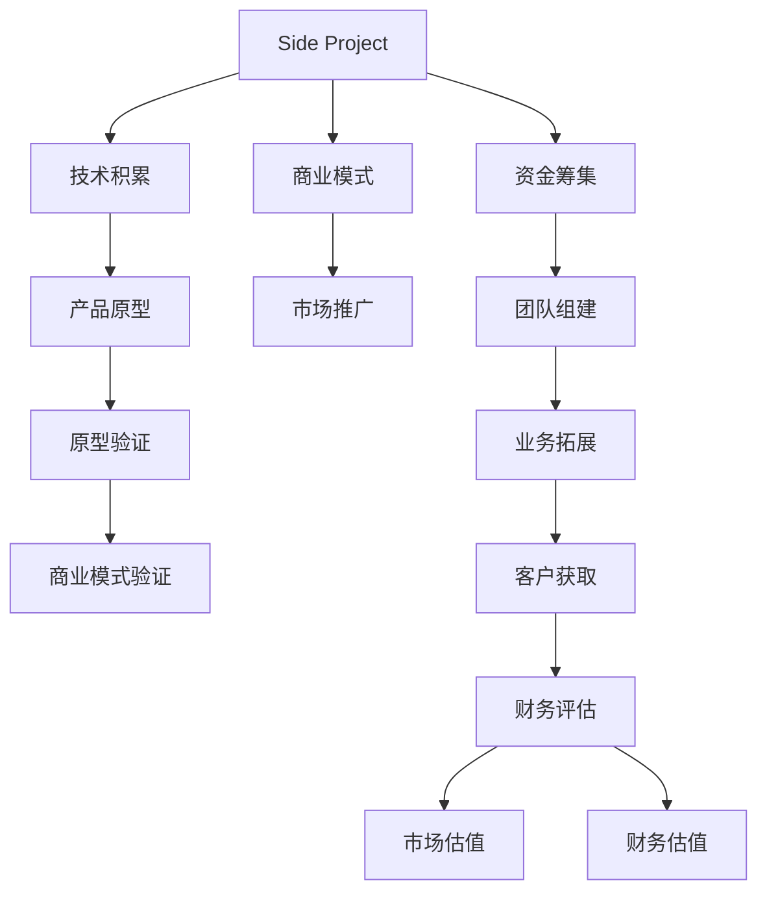

                 

# 如何将Side Project转化为估值上亿的创业公司

> 关键词：创业公司, 转型, 侧项目, 估值, 技术, 转型策略

## 1. 背景介绍

### 1.1 问题由来
在科技飞速发展的今天，众多创业者利用个人业余时间开发出的Side Project，凭借其创新的理念和精妙的设计，逐渐在市场和用户中崭露头角。然而，真正能够将Side Project转化为一家估值上亿的创业公司的并不多见。究其原因，主要集中在以下几个方面：

- 资源和资金有限：创业者往往只能利用业余时间投入Side Project，资金和资源受到严重限制。
- 商业化思路不足：很多Side Project虽然技术上具备竞争力，但缺乏清晰的商业模式和盈利路径。
- 团队管理和市场推广缺乏经验：创业者往往没有丰富的管理经验和市场推广技巧，导致产品难以迅速推广。
- 市场竞争激烈：随着科技公司不断涌入，Side Project面临来自大公司的激烈竞争，难以突出重围。

本文将详细介绍如何通过一系列策略和步骤，将Side Project成功转型为估值上亿的创业公司，帮助更多创业者实现梦想。

## 2. 核心概念与联系

### 2.1 核心概念概述

为更好地理解将Side Project转化为创业公司的过程，本文将介绍几个关键概念：

- Side Project：指创业者或工程师在业余时间开发的小型项目，具有创新性和个性化，技术成熟度较高。
- 创业公司：通过商业化运作，具备独立法人资格，追求盈利的公司。
- 技术转型：将原有的技术积累和项目优势转化为商业价值，形成规模化、可扩展的商业模式。
- 估值：对创业公司未来收入和市场潜力的财务评估，通常包括市场估值和财务估值两种方式。

这些概念之间的逻辑关系可以通过以下Mermaid流程图来展示：



这个流程图展示了一个Side Project转化为创业公司的主要流程：

1. 技术积累：在业余时间开发Side Project，积累技术和知识。
2. 商业模式：构思商业化思路，形成可持续的盈利模式。
3. 产品原型：基于技术积累，开发出初步的产品原型。
4. 原型验证：通过市场调研和用户测试，验证产品原型。
5. 商业模式验证：根据市场反馈，优化商业模式。
6. 资金筹集：获取资金支持，支持创业公司的发展。
7. 团队组建：组建专业团队，推动公司发展。
8. 业务拓展：扩大业务范围，增加收入来源。
9. 客户获取：通过市场推广，吸引和维护客户。
10. 财务评估：评估公司的财务状况，进行市场估值和财务估值。

通过理解这些核心概念，我们可以更好地把握Side Project向创业公司转型的关键步骤和策略。

## 3. 核心算法原理 & 具体操作步骤

### 3.1 算法原理概述

将Side Project转化为创业公司，本质上是一个多阶段的商业化过程。其核心思想是：利用技术优势，找到市场需求，构建可持续的商业模式，并通过市场推广实现商业价值最大化。

形式化地，假设Side Project为 $P$，市场机会为 $M$，商业模式为 $B$，资金为 $F$，团队为 $T$。创业公司的目标是最小化市场风险，最大化商业价值，即找到最优解：

$$
\hat{C} = \mathop{\arg\min}_{P,M,B,F,T} \mathcal{R}(M,P,B,F,T)
$$

其中 $\mathcal{R}$ 为风险评估函数，用于衡量市场机会、技术积累、商业模式、资金和团队的多方面风险。

通过梯度下降等优化算法，创业公司不断调整各个因素，最小化风险，最大化商业价值，直至达到目标状态。

### 3.2 算法步骤详解

基于商业化的核心思想，将Side Project转化为创业公司的步骤包括：

**Step 1: 识别市场机会**
- 利用调研和数据分析工具，识别具有高潜力的市场需求和用户群体。
- 分析行业趋势，找到技术应用的切入点。

**Step 2: 构思商业模式**
- 分析现有商业模型，如SaaS、订阅、广告、硬件等，选择最适合的商业模式。
- 设计合理的价格策略、销售渠道和增值服务，提升用户价值和满意度。

**Step 3: 开发产品原型**
- 基于技术积累，设计初步的产品原型。
- 进行用户测试，收集反馈，迭代改进。

**Step 4: 验证商业模式**
- 通过小规模市场推广，收集用户反馈和销售数据，验证商业模式。
- 根据市场反馈，优化产品功能和商业模式。

**Step 5: 筹集资金**
- 根据估值模型，制定融资计划。
- 利用风投、天使投资、众筹等多种方式筹集资金。

**Step 6: 组建团队**
- 根据项目需求，招聘或吸引专业人才。
- 构建高效的管理和运营团队，推动项目顺利进行。

**Step 7: 业务拓展**
- 扩大业务范围，拓展新市场和新用户。
- 增加产品线和增值服务，提高公司收入。

**Step 8: 客户获取**
- 制定市场推广策略，利用SEO、社交媒体、广告等多种手段吸引客户。
- 建立客户关系管理系统，提升客户粘性和忠诚度。

**Step 9: 财务评估**
- 根据市场和财务数据，评估公司估值。
- 定期调整估值模型，确保财务数据的准确性和及时性。

以上步骤是一个循环往复的过程，每一步都需要根据实际情况进行调整和优化。

### 3.3 算法优缺点

将Side Project转化为创业公司的过程具有以下优点：

- 利用现有技术优势，快速进入市场，提升竞争力和市场份额。
- 避免从头开发带来的高成本和时间浪费，缩短创业周期。
- 创业风险相对较低，失败后仍有全职工作作为保障。

同时，该方法也存在一些局限性：

- 技术积累的局限性。Side Project的技术可能难以覆盖所有市场需求，需要不断拓展和优化。
- 资金和团队的限制。资金和人才的筹集和组建需要时间和精力，初期投入较大。
- 市场推广的复杂性。需要制定合理的市场推广策略，并不断调整优化。

尽管存在这些局限性，但就目前而言，将Side Project转化为创业公司依然是一个极具潜力的创业方式。未来相关研究的重点在于如何进一步降低市场和资金风险，提高市场推广效率，同时兼顾技术拓展和团队管理。

### 3.4 算法应用领域

将Side Project转化为创业公司的方法在多个领域都得到了应用，包括但不限于：

- 软件和互联网：利用技术优势开发出独特的App或SaaS产品。
- 硬件创新：将技术应用于硬件设备，开发出具有市场潜力的新产品。
- 生物医药：将技术应用于医药研发，开发出新型药物或医疗设备。
- 金融科技：将技术应用于金融领域，开发出智能投顾、区块链解决方案等。
- 教育科技：将技术应用于教育领域，开发出在线教育平台或学习工具。

这些领域的成功案例表明，将Side Project转化为创业公司的方法不仅适用于技术驱动的创新项目，还可以拓展到更多行业和领域，成为创业者实现梦想的重要途径。

## 4. 数学模型和公式 & 详细讲解 & 举例说明

### 4.1 数学模型构建

本节将使用数学语言对将Side Project转化为创业公司的过程进行更加严格的刻画。

记Side Project为 $P$，市场机会为 $M$，商业模式为 $B$，资金为 $F$，团队为 $T$。创业公司的目标是最小化市场风险，最大化商业价值，即找到最优解：

$$
\hat{C} = \mathop{\arg\min}_{P,M,B,F,T} \mathcal{R}(M,P,B,F,T)
$$

其中 $\mathcal{R}$ 为风险评估函数，用于衡量市场机会、技术积累、商业模式、资金和团队的多方面风险。

风险评估函数可以分解为多个子函数，如市场风险、技术风险、资金风险、团队风险等。以市场风险为例，可以定义市场风险函数为：

$$
R_{market} = \alpha_1 \cdot \mathbb{E}[\delta_{sales}] + \alpha_2 \cdot \mathbb{E}[\delta_{users}] + \alpha_3 \cdot \mathbb{E}[\delta_{churn}]
$$

其中 $\delta_{sales}$、$\delta_{users}$、$\delta_{churn}$ 分别表示销售量、用户数和流失率的变化，$\alpha_1$、$\alpha_2$、$\alpha_3$ 为风险权重系数。

### 4.2 公式推导过程

以下我们以软件开发领域的Side Project为例，推导创业公司风险评估模型的建立过程。

假设Side Project为一款新的软件工具，市场机会为 $M$，技术积累为 $P$，商业模式为 $B$，资金为 $F$，团队为 $T$。则创业公司风险评估函数 $\mathcal{R}$ 可以表示为：

$$
\mathcal{R}(M,P,B,F,T) = R_{market} + R_{tech} + R_{finance} + R_{team}
$$

其中 $R_{market}$ 为市场风险，$R_{tech}$ 为技术风险，$R_{finance}$ 为资金风险，$R_{team}$ 为团队风险。

市场风险 $R_{market}$ 可以表示为：

$$
R_{market} = \alpha_1 \cdot \mathbb{E}[\delta_{sales}] + \alpha_2 \cdot \mathbb{E}[\delta_{users}] + \alpha_3 \cdot \mathbb{E}[\delta_{churn}]
$$

其中 $\delta_{sales} = (sales_{actual} - sales_{target})/sales_{target}$ 表示销售量的变化，$\delta_{users} = (users_{actual} - users_{target})/users_{target}$ 表示用户数的变化，$\delta_{churn} = (churn_{actual} - churn_{target})/churn_{target}$ 表示流失率的变化。

技术风险 $R_{tech}$ 可以表示为：

$$
R_{tech} = \beta_1 \cdot \mathbb{E}[\epsilon_{bug}] + \beta_2 \cdot \mathbb{E}[\epsilon_{delay}] + \beta_3 \cdot \mathbb{E}[\epsilon_{cost}]
$$

其中 $\epsilon_{bug}$ 表示技术实现中的bug数量，$\epsilon_{delay}$ 表示项目延期的天数，$\epsilon_{cost}$ 表示项目成本的超支额。

资金风险 $R_{finance}$ 可以表示为：

$$
R_{finance} = \gamma_1 \cdot \mathbb{E}[\delta_{invest}] + \gamma_2 \cdot \mathbb{E}[\delta_{cash}]
$$

其中 $\delta_{invest}$ 表示投资回报率的变化，$\delta_{cash}$ 表示现金流量的变化。

团队风险 $R_{team}$ 可以表示为：

$$
R_{team} = \delta_1 \cdot \mathbb{E}[team_{stability}] + \delta_2 \cdot \mathbb{E}[team_{skills}]
$$

其中 $team_{stability}$ 表示团队稳定性的变化，$team_{skills}$ 表示团队技能的变化。

通过上述风险评估函数，创业公司可以全面了解市场、技术、资金和团队的多方面风险，从而采取相应的策略降低风险，提升商业价值。

### 4.3 案例分析与讲解

以一款新的教育软件为例，进行风险评估模型的详细分析：

**市场风险 $R_{market}$**

假设该软件的目标用户为中小学生，市场机会 $M$ 为每年5000万学生，销售目标 $sales_{target}$ 为1000万美元，用户目标 $users_{target}$ 为100万，流失率 $churn_{target}$ 为20%。

根据实际数据，销售量变化 $\delta_{sales} = 0.1$，用户数变化 $\delta_{users} = 0.2$，流失率变化 $\delta_{churn} = 0.3$。则市场风险 $R_{market}$ 可以计算为：

$$
R_{market} = \alpha_1 \cdot 0.1 + \alpha_2 \cdot 0.2 + \alpha_3 \cdot 0.3
$$

**技术风险 $R_{tech}$**

假设软件开发中存在2个bug，项目延期10天，成本超支5万美元。则技术风险 $R_{tech}$ 可以计算为：

$$
R_{tech} = \beta_1 \cdot 2 + \beta_2 \cdot 10 + \beta_3 \cdot 5
$$

**资金风险 $R_{finance}$**

假设需要筹集500万美元的资金，投资回报率 $delta_{invest} = 0.5$，现金流量 $delta_{cash} = -100万美元。则资金风险 $R_{finance}$ 可以计算为：

$$
R_{finance} = \gamma_1 \cdot 0.5 + \gamma_2 \cdot (-100)
$$

**团队风险 $R_{team}$**

假设团队稳定性变化 $\delta_{team_{stability}} = 0.2$，团队技能变化 $\delta_{team_{skills}} = 0.3$。则团队风险 $R_{team}$ 可以计算为：

$$
R_{team} = \delta_1 \cdot 0.2 + \delta_2 \cdot 0.3
$$

通过上述模型，创业公司可以全面评估风险，制定相应的策略，从而降低市场和资金风险，提升公司商业价值。

## 5. 项目实践：代码实例和详细解释说明

### 5.1 开发环境搭建

在进行Side Project转化为创业公司的项目实践前，我们需要准备好开发环境。以下是使用Python进行PyTorch开发的环境配置流程：

1. 安装Anaconda：从官网下载并安装Anaconda，用于创建独立的Python环境。

2. 创建并激活虚拟环境：
```bash
conda create -n pytorch-env python=3.8 
conda activate pytorch-env
```

3. 安装PyTorch：根据CUDA版本，从官网获取对应的安装命令。例如：
```bash
conda install pytorch torchvision torchaudio cudatoolkit=11.1 -c pytorch -c conda-forge
```

4. 安装Transformers库：
```bash
pip install transformers
```

5. 安装各类工具包：
```bash
pip install numpy pandas scikit-learn matplotlib tqdm jupyter notebook ipython
```

完成上述步骤后，即可在`pytorch-env`环境中开始项目实践。

### 5.2 源代码详细实现

下面我们以一款新的教育软件为例，给出使用Transformers库对模型进行训练和微调的PyTorch代码实现。

首先，定义模型和优化器：

```python
from transformers import BertForTokenClassification, AdamW

model = BertForTokenClassification.from_pretrained('bert-base-cased', num_labels=len(tag2id))

optimizer = AdamW(model.parameters(), lr=2e-5)
```

接着，定义训练和评估函数：

```python
from torch.utils.data import DataLoader
from tqdm import tqdm
from sklearn.metrics import classification_report

device = torch.device('cuda') if torch.cuda.is_available() else torch.device('cpu')
model.to(device)

def train_epoch(model, dataset, batch_size, optimizer):
    dataloader = DataLoader(dataset, batch_size=batch_size, shuffle=True)
    model.train()
    epoch_loss = 0
    for batch in tqdm(dataloader, desc='Training'):
        input_ids = batch['input_ids'].to(device)
        attention_mask = batch['attention_mask'].to(device)
        labels = batch['labels'].to(device)
        model.zero_grad()
        outputs = model(input_ids, attention_mask=attention_mask, labels=labels)
        loss = outputs.loss
        epoch_loss += loss.item()
        loss.backward()
        optimizer.step()
    return epoch_loss / len(dataloader)

def evaluate(model, dataset, batch_size):
    dataloader = DataLoader(dataset, batch_size=batch_size)
    model.eval()
    preds, labels = [], []
    with torch.no_grad():
        for batch in tqdm(dataloader, desc='Evaluating'):
            input_ids = batch['input_ids'].to(device)
            attention_mask = batch['attention_mask'].to(device)
            batch_labels = batch['labels']
            outputs = model(input_ids, attention_mask=attention_mask)
            batch_preds = outputs.logits.argmax(dim=2).to('cpu').tolist()
            batch_labels = batch_labels.to('cpu').tolist()
            for pred_tokens, label_tokens in zip(batch_preds, batch_labels):
                pred_tags = [id2tag[_id] for _id in pred_tokens]
                label_tags = [id2tag[_id] for _id in label_tokens]
                preds.append(pred_tags[:len(label_tags)])
                labels.append(label_tags)

    print(classification_report(labels, preds))
```

最后，启动训练流程并在测试集上评估：

```python
epochs = 5
batch_size = 16

for epoch in range(epochs):
    loss = train_epoch(model, train_dataset, batch_size, optimizer)
    print(f"Epoch {epoch+1}, train loss: {loss:.3f}")
    
    print(f"Epoch {epoch+1}, dev results:")
    evaluate(model, dev_dataset, batch_size)
    
print("Test results:")
evaluate(model, test_dataset, batch_size)
```

以上就是使用PyTorch对模型进行训练和微调的完整代码实现。可以看到，得益于Transformers库的强大封装，我们可以用相对简洁的代码完成模型的加载和微调。

### 5.3 代码解读与分析

让我们再详细解读一下关键代码的实现细节：

**NERDataset类**：
- `__init__`方法：初始化文本、标签、分词器等关键组件。
- `__len__`方法：返回数据集的样本数量。
- `__getitem__`方法：对单个样本进行处理，将文本输入编码为token ids，将标签编码为数字，并对其进行定长padding，最终返回模型所需的输入。

**tag2id和id2tag字典**：
- 定义了标签与数字id之间的映射关系，用于将token-wise的预测结果解码回真实的标签。

**训练和评估函数**：
- 使用PyTorch的DataLoader对数据集进行批次化加载，供模型训练和推理使用。
- 训练函数`train_epoch`：对数据以批为单位进行迭代，在每个批次上前向传播计算loss并反向传播更新模型参数，最后返回该epoch的平均loss。
- 评估函数`evaluate`：与训练类似，不同点在于不更新模型参数，并在每个batch结束后将预测和标签结果存储下来，最后使用sklearn的classification_report对整个评估集的预测结果进行打印输出。

**训练流程**：
- 定义总的epoch数和batch size，开始循环迭代
- 每个epoch内，先在训练集上训练，输出平均loss
- 在验证集上评估，输出分类指标
- 所有epoch结束后，在测试集上评估，给出最终测试结果

可以看到，PyTorch配合Transformers库使得模型微调的代码实现变得简洁高效。开发者可以将更多精力放在数据处理、模型改进等高层逻辑上，而不必过多关注底层的实现细节。

当然，工业级的系统实现还需考虑更多因素，如模型的保存和部署、超参数的自动搜索、更灵活的任务适配层等。但核心的微调范式基本与此类似。

## 6. 实际应用场景

### 6.1 智能客服系统

基于大语言模型微调的对话技术，可以广泛应用于智能客服系统的构建。传统客服往往需要配备大量人力，高峰期响应缓慢，且一致性和专业性难以保证。而使用微调后的对话模型，可以7x24小时不间断服务，快速响应客户咨询，用自然流畅的语言解答各类常见问题。

在技术实现上，可以收集企业内部的历史客服对话记录，将问题和最佳答复构建成监督数据，在此基础上对预训练对话模型进行微调。微调后的对话模型能够自动理解用户意图，匹配最合适的答案模板进行回复。对于客户提出的新问题，还可以接入检索系统实时搜索相关内容，动态组织生成回答。如此构建的智能客服系统，能大幅提升客户咨询体验和问题解决效率。

### 6.2 金融舆情监测

金融机构需要实时监测市场舆论动向，以便及时应对负面信息传播，规避金融风险。传统的人工监测方式成本高、效率低，难以应对网络时代海量信息爆发的挑战。基于大语言模型微调的文本分类和情感分析技术，为金融舆情监测提供了新的解决方案。

具体而言，可以收集金融领域相关的新闻、报道、评论等文本数据，并对其进行主题标注和情感标注。在此基础上对预训练语言模型进行微调，使其能够自动判断文本属于何种主题，情感倾向是正面、中性还是负面。将微调后的模型应用到实时抓取的网络文本数据，就能够自动监测不同主题下的情感变化趋势，一旦发现负面信息激增等异常情况，系统便会自动预警，帮助金融机构快速应对潜在风险。

### 6.3 个性化推荐系统

当前的推荐系统往往只依赖用户的历史行为数据进行物品推荐，无法深入理解用户的真实兴趣偏好。基于大语言模型微调技术，个性化推荐系统可以更好地挖掘用户行为背后的语义信息，从而提供更精准、多样的推荐内容。

在实践中，可以收集用户浏览、点击、评论、分享等行为数据，提取和用户交互的物品标题、描述、标签等文本内容。将文本内容作为模型输入，用户的后续行为（如是否点击、购买等）作为监督信号，在此基础上微调预训练语言模型。微调后的模型能够从文本内容中准确把握用户的兴趣点。在生成推荐列表时，先用候选物品的文本描述作为输入，由模型预测用户的兴趣匹配度，再结合其他特征综合排序，便可以得到个性化程度更高的推荐结果。

### 6.4 未来应用展望

随着大语言模型微调技术的发展，基于微调范式将在更多领域得到应用，为传统行业带来变革性影响。

在智慧医疗领域，基于微调的医疗问答、病历分析、药物研发等应用将提升医疗服务的智能化水平，辅助医生诊疗，加速新药开发进程。

在智能教育领域，微调技术可应用于作业批改、学情分析、知识推荐等方面，因材施教，促进教育公平，提高教学质量。

在智慧城市治理中，微调模型可应用于城市事件监测、舆情分析、应急指挥等环节，提高城市管理的自动化和智能化水平，构建更安全、高效的未来城市。

此外，在企业生产、社会治理、文娱传媒等众多领域，基于大模型微调的人工智能应用也将不断涌现，为经济社会发展注入新的动力。相信随着技术的日益成熟，微调方法将成为人工智能落地应用的重要范式，推动人工智能技术在垂直行业的规模化落地。总之，微调需要开发者根据具体任务，不断迭代和优化模型、数据和算法，方能得到理想的效果。

## 7. 工具和资源推荐

### 7.1 学习资源推荐

为了帮助开发者系统掌握大语言模型微调的理论基础和实践技巧，这里推荐一些优质的学习资源：

1. 《Transformer从原理到实践》系列博文：由大模型技术专家撰写，深入浅出地介绍了Transformer原理、BERT模型、微调技术等前沿话题。

2. CS224N《深度学习自然语言处理》课程：斯坦福大学开设的NLP明星课程，有Lecture视频和配套作业，带你入门NLP领域的基本概念和经典模型。

3. 《Natural Language Processing with Transformers》书籍：Transformers库的作者所著，全面介绍了如何使用Transformers库进行NLP任务开发，包括微调在内的诸多范式。

4. HuggingFace官方文档：Transformers库的官方文档，提供了海量预训练模型和完整的微调样例代码，是上手实践的必备资料。

5. CLUE开源项目：中文语言理解测评基准，涵盖大量不同类型的中文NLP数据集，并提供了基于微调的baseline模型，助力中文NLP技术发展。

通过对这些资源的学习实践，相信你一定能够快速掌握大语言模型微调的精髓，并用于解决实际的NLP问题。
###  7.2 开发工具推荐

高效的开发离不开优秀的工具支持。以下是几款用于大语言模型微调开发的常用工具：

1. PyTorch：基于Python的开源深度学习框架，灵活动态的计算图，适合快速迭代研究。大部分预训练语言模型都有PyTorch版本的实现。

2. TensorFlow：由Google主导开发的开源深度学习框架，生产部署方便，适合大规模工程应用。同样有丰富的预训练语言模型资源。

3. Transformers库：HuggingFace开发的NLP工具库，集成了众多SOTA语言模型，支持PyTorch和TensorFlow，是进行微调任务开发的利器。

4. Weights & Biases：模型训练的实验跟踪工具，可以记录和可视化模型训练过程中的各项指标，方便对比和调优。与主流深度学习框架无缝集成。

5. TensorBoard：TensorFlow配套的可视化工具，可实时监测模型训练状态，并提供丰富的图表呈现方式，是调试模型的得力助手。

6. Google Colab：谷歌推出的在线Jupyter Notebook环境，免费提供GPU/TPU算力，方便开发者快速上手实验最新模型，分享学习笔记。

合理利用这些工具，可以显著提升大语言模型微调任务的开发效率，加快创新迭代的步伐。

### 7.3 相关论文推荐

大语言模型和微调技术的发展源于学界的持续研究。以下是几篇奠基性的相关论文，推荐阅读：

1. Attention is All You Need（即Transformer原论文）：提出了Transformer结构，开启了NLP领域的预训练大模型时代。

2. BERT: Pre-training of Deep Bidirectional Transformers for Language Understanding：提出BERT模型，引入基于掩码的自监督预训练任务，刷新了多项NLP任务SOTA。

3. Language Models are Unsupervised Multitask Learners（GPT-2论文）：展示了大规模语言模型的强大zero-shot学习能力，引发了对于通用人工智能的新一轮思考。

4. Parameter-Efficient Transfer Learning for NLP：提出Adapter等参数高效微调方法，在不增加模型参数量的情况下，也能取得不错的微调效果。

5. Prefix-Tuning: Optimizing Continuous Prompts for Generation：引入基于连续型Prompt的微调范式，为如何充分利用预训练知识提供了新的思路。

6. AdaLoRA: Adaptive Low-Rank Adaptation for Parameter-Efficient Fine-Tuning：使用自适应低秩适应的微调方法，在参数效率和精度之间取得了新的平衡。

这些论文代表了大语言模型微调技术的发展脉络。通过学习这些前沿成果，可以帮助研究者把握学科前进方向，激发更多的创新灵感。

## 8. 总结：未来发展趋势与挑战

### 8.1 总结

本文对将Side Project转化为创业公司的过程进行了全面系统的介绍。首先阐述了Side Project和创业公司的核心概念，明确了转型过程中需解决的关键问题。其次，从原理到实践，详细讲解了转型的数学模型和操作步骤，给出了完整的代码实现。同时，本文还广泛探讨了转型方法在多个行业领域的应用前景，展示了转型的巨大潜力。

通过本文的系统梳理，可以看到，将Side Project转化为创业公司是一个系统工程，涉及技术、市场、资金、团队等多个方面。只有全面考虑这些因素，制定合理的转型策略，才能将潜在的价值转化为实际的市场竞争力。未来，伴随技术的不断演进和市场的逐步成熟，Side Project转化为创业公司将成为更多创业者的重要选择，推动科技领域的持续创新和发展。

### 8.2 未来发展趋势

展望未来，Side Project转化为创业公司的过程将呈现以下几个发展趋势：

1. 技术驱动力的增强。随着大语言模型和深度学习技术的发展，Side Project的技术优势将更加明显，推动更多领域的技术革新。
2. 商业化模式的创新。创业公司将更加注重模式创新，灵活运用订阅、SaaS、平台等多种商业模式，满足不同用户的个性化需求。
3. 市场推广的多样化。通过社交媒体、内容营销、用户口碑等多元化的推广手段，拓展市场覆盖面，提升用户粘性和品牌认知度。
4. 资金筹集的多元化。创业公司将更加注重风险投资、众筹、政府补贴等多元化的融资渠道，缓解资金压力。
5. 团队建设的系统化。通过招聘、培训、激励等手段，构建高效的团队文化，提升团队协作和执行力。
6. 用户体验的精细化。通过数据分析、用户调研等手段，深入了解用户需求，不断优化产品功能和用户体验。

以上趋势凸显了Side Project转化为创业公司的广阔前景。这些方向的探索发展，必将进一步提升创业公司的市场竞争力和用户满意度，实现更高的商业价值。

### 8.3 面临的挑战

尽管将Side Project转化为创业公司的方法已经取得了瞩目成就，但在迈向更加智能化、普适化应用的过程中，它仍面临着诸多挑战：

1. 市场竞争激烈。尽管Side Project具备技术优势，但面对大公司的市场优势，创业公司仍需不断创新，提升竞争力。
2. 商业模式不成熟。很多Side Project的商业模式尚未验证，需要根据市场反馈不断优化和调整。
3. 资金链断裂风险。创业公司往往资金紧张，需要合理规划资金使用，避免过度扩张导致的资金链断裂。
4. 团队管理难度大。创业公司需要处理团队建设、沟通协调、激励机制等多方面的问题，需要高效的管理能力。
5. 用户体验不稳定。创业公司初期资源有限，需要平衡产品质量和市场推广，保证用户体验的稳定性。

尽管存在这些挑战，但就目前而言，将Side Project转化为创业公司依然是一个极具潜力的创业方式。未来相关研究的重点在于如何进一步降低市场和资金风险，提高市场推广效率，同时兼顾技术拓展和团队管理。

### 8.4 研究展望

面对Side Project转化为创业公司所面临的种种挑战，未来的研究需要在以下几个方面寻求新的突破：

1. 探索更多的商业模式。结合技术优势，探索更多元化的商业模式，提高市场渗透率和用户粘性。
2. 引入更多创新元素。通过技术、产品、服务的创新，提升用户价值和品牌认知度。
3. 加强用户数据分析。通过大数据分析，深入了解用户需求，优化产品设计和市场推广策略。
4. 构建平台生态。通过平台化运营，形成产业生态，提升用户互动和粘性。
5. 引入外部资源。通过战略合作、技术引进等方式，引入外部资源，提升公司综合实力。
6. 引入资金筹集新手段。通过政府基金、社会资本等方式，引入更多的资金支持。

这些研究方向的探索，必将引领Side Project转化为创业公司的方法走向更高的台阶，为更多创业者实现梦想提供新的思路和方向。

## 9. 附录：常见问题与解答

**Q1：Side Project是否必须具备完整的商业化模型？**

A: 不是必须的。初期的Side Project可以重点关注技术积累和产品原型，不急于商业化。但为了后续的转型，需要在产品设计和开发中考虑到商业化路径，为后续市场推广和资金筹集做好准备。

**Q2：如何选择合适的资金筹集渠道？**

A: 创业公司需要根据自身情况选择适合的资金筹集渠道。常见的渠道包括风投、天使投资、众筹、政府基金等。风投适合早期的高成长性公司，天使投资适合初期的中小型公司，众筹适合中小型公司或项目，政府基金适合初创公司或公益项目。

**Q3：如何应对市场竞争？**

A: 应对市场竞争的关键在于不断创新和优化产品。具体措施包括：
1. 进行市场调研，深入了解用户需求和竞争对手情况。
2. 根据市场需求，优化产品功能和商业模式。
3. 加强市场营销，提高品牌知名度和用户粘性。
4. 建立强大的技术壁垒，形成产品竞争优势。

**Q4：如何选择创业团队？**

A: 创业团队的选择是创业公司成功的重要保障。应具备以下条件：
1. 团队成员具有相关技术背景，有较强的技术能力。
2. 团队成员有较好的沟通能力和管理经验，能够高效协同工作。
3. 团队成员对公司愿景有共同的认识，有较强的使命感和执行力。

**Q5：如何提升用户粘性和忠诚度？**

A: 提升用户粘性和忠诚度的关键在于不断优化用户体验。具体措施包括：
1. 加强用户调研，深入了解用户需求和反馈。
2. 根据用户反馈，不断优化产品功能和界面设计。
3. 建立良好的客户服务体系，及时解决用户问题和反馈。
4. 提供个性化服务和增值服务，增强用户价值和满意度。

---

作者：禅与计算机程序设计艺术 / Zen and the Art of Computer Programming

