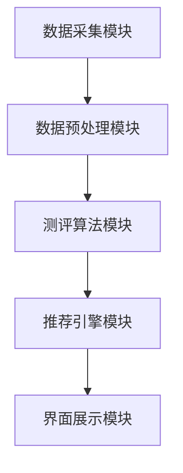

                 

# 如何打造知识付费的在线测评系统

> 关键词：在线测评, 知识付费, 数据分析, 机器学习, 系统设计, 用户体验

## 1. 背景介绍

### 1.1 问题由来

随着互联网和移动设备的普及，知识付费平台迅速崛起，成为信息时代知识传播的重要渠道。在线测评作为知识付费系统的重要组成部分，承担着评估用户学习成果、个性化推荐学习内容的关键任务。如何构建一个高效、精准、易于使用的在线测评系统，是知识付费平台亟待解决的问题。

### 1.2 问题核心关键点

一个成功的知识付费在线测评系统应具备以下关键特点：
- **高效性**：能够在短时间内快速完成大量测评任务，提高用户体验。
- **精准性**：测评结果应准确反映用户的学习水平，提供个性化推荐。
- **易用性**：系统界面简洁友好，用户操作简便。
- **扩展性**：能够灵活适应不同的测评任务和用户群体。
- **安全性**：用户数据安全可靠，测评结果公正透明。

本文将系统地介绍如何构建这样一个在线测评系统，并通过实际案例展示其在知识付费平台中的应用。

## 2. 核心概念与联系

### 2.1 核心概念概述

在线测评系统基于用户行为数据和机器学习算法，对用户的学习成果进行量化评估。该系统通常包括以下几个核心组件：
- **数据采集模块**：从知识付费平台收集用户的学习行为数据。
- **数据预处理模块**：对采集到的数据进行清洗、归一化等预处理。
- **测评算法模块**：应用机器学习算法，分析用户行为数据，生成测评结果。
- **推荐引擎模块**：根据测评结果，为用户提供个性化的学习内容推荐。
- **界面展示模块**：以友好的界面展示测评结果和推荐内容。

系统框架如下图所示：



## 3. 核心算法原理 & 具体操作步骤

### 3.1 算法原理概述

在线测评系统的主要任务是评估用户的学习成果，并将评估结果转化为测评分数。这通常通过机器学习算法实现。一个典型的在线测评流程包括：
1. **数据采集**：从知识付费平台获取用户的学习行为数据，如阅读时间、观看次数、回答正确率等。
2. **数据预处理**：清洗数据，处理缺失值，进行归一化等操作，确保数据质量。
3. **特征提取**：将预处理后的数据转换为可供模型训练的特征向量。
4. **模型训练**：使用机器学习算法训练模型，预测用户的学习成果。
5. **测评生成**：根据模型预测结果，生成用户测评分数。
6. **结果展示**：将测评结果以直观的方式展示给用户。

### 3.2 算法步骤详解

#### 3.2.1 数据采集

- **数据类型**：包括用户阅读时长、观看次数、答题正确率、评价分数等。
- **采集方式**：通过API接口从知识付费平台的数据库中获取。

#### 3.2.2 数据预处理

- **数据清洗**：去除重复、错误的数据记录，处理缺失值。
- **特征归一化**：对数值型特征进行归一化处理，如标准化、Min-Max缩放等。
- **特征选择**：选择与测评结果关联度高的特征，降低维度。

#### 3.2.3 特征提取

- **特征工程**：设计特征提取函数，将原始数据转换为特征向量。
- **特征选择**：使用特征选择算法，如PCA、LASSO等，筛选重要特征。
- **特征编码**：对文本型特征进行编码，如TF-IDF、Word2Vec等。

#### 3.2.4 模型训练

- **算法选择**：选择合适的机器学习算法，如随机森林、SVM、神经网络等。
- **参数优化**：通过交叉验证、网格搜索等方法，优化模型参数。
- **模型评估**：使用测试集对模型进行评估，选择最优模型。

#### 3.2.5 测评生成

- **测评规则**：根据模型预测结果，设计评分规则，生成测评分数。
- **分数调整**：考虑异常值和边界情况，调整测评分数，确保公平性。
- **测评报告**：生成包含测评分数、建议的个性化学习路径的报告。

#### 3.2.6 结果展示

- **界面设计**：设计简洁友好的用户界面，展示测评结果和推荐内容。
- **交互设计**：实现用户操作反馈，如查看测评报告、申请重测等。
- **数据可视化**：使用图表展示用户学习进度和测评分数变化。

### 3.3 算法优缺点

#### 3.3.1 优点

- **自动化评估**：通过机器学习算法，自动化评估用户学习成果，提高效率。
- **个性化推荐**：根据测评结果，提供个性化的学习内容推荐，提升学习效果。
- **动态更新**：系统可以实时更新用户数据，反映最新的学习状态。

#### 3.3.2 缺点

- **数据依赖**：测评结果依赖于用户的学习数据，数据质量直接影响测评结果。
- **模型复杂**：选择合适的模型和参数需要大量实验和调整，开发周期较长。
- **隐私问题**：用户数据隐私保护需高度重视，防止数据泄露。

### 3.4 算法应用领域

在线测评系统广泛应用于各种知识付费平台，如Coursera、Udemy、网易云课堂等。该系统还可以应用于在线教育、职业培训、企业培训等多个领域，评估员工技能水平，提供定制化培训方案。

## 4. 数学模型和公式 & 详细讲解 & 举例说明

### 4.1 数学模型构建

一个典型的在线测评系统可以使用回归模型进行用户测评分数的预测。假设测评分数为 $y$，输入特征为 $x$，回归模型的数学表达为：

$$
y = f(x; \theta)
$$

其中 $f$ 为回归函数，$\theta$ 为模型参数。

### 4.2 公式推导过程

以线性回归模型为例，回归函数可以表示为：

$$
f(x; \theta) = \theta_0 + \theta_1 x_1 + \theta_2 x_2 + ... + \theta_n x_n
$$

其中 $\theta_0, \theta_1, \theta_2, ..., \theta_n$ 为模型的参数。通过最小二乘法或梯度下降法，可以求解模型参数，使预测值与真实值误差最小。

### 4.3 案例分析与讲解

假设我们收集到一个用户的学习行为数据，包括阅读时间、答题正确率、评价分数等。通过特征提取，将其转换为特征向量 $x$，然后使用线性回归模型进行预测，生成测评分数 $y$。

使用Python实现线性回归模型，代码如下：

```python
from sklearn.linear_model import LinearRegression

# 创建线性回归模型
model = LinearRegression()

# 训练模型
X_train, X_test, y_train, y_test = train_test_split(X, y, test_size=0.2)
model.fit(X_train, y_train)

# 预测测评分数
y_pred = model.predict(X_test)
```

## 5. 项目实践：代码实例和详细解释说明

### 5.1 开发环境搭建

开发环境包括Python、Jupyter Notebook、Scikit-Learn等工具。安装步骤如下：

1. 安装Anaconda：从官网下载并安装Anaconda。
2. 创建虚拟环境：
```bash
conda create -n py36 python=3.6
conda activate py36
```

3. 安装Python依赖包：
```bash
pip install numpy scipy pandas scikit-learn jupyter notebook matplotlib seaborn
```

### 5.2 源代码详细实现

#### 5.2.1 数据采集

```python
import requests

# 获取用户数据
url = "https://api.example.com/user_data"
headers = {"Authorization": "Bearer YOUR_API_TOKEN"}
response = requests.get(url, headers=headers)
data = response.json()

# 提取学习行为数据
learning_data = data["learning_behaviors"]
```

#### 5.2.2 数据预处理

```python
import pandas as pd

# 创建数据框
learning_df = pd.DataFrame(learning_data)

# 数据清洗
learning_df = learning_df.drop_duplicates()
learning_df = learning_df.dropna()

# 特征归一化
from sklearn.preprocessing import StandardScaler
scaler = StandardScaler()
learning_df = pd.DataFrame(scaler.fit_transform(learning_df), columns=learning_df.columns)
```

#### 5.2.3 特征提取

```python
# 特征选择
from sklearn.feature_selection import SelectKBest, f_regression
selector = SelectKBest(f_regression, k=5)
X_selected = selector.fit_transform(learning_df.drop(["score"], axis=1), learning_df[["score"]])

# 特征编码
from sklearn.feature_extraction.text import TfidfVectorizer
vectorizer = TfidfVectorizer()
X_tfidf = vectorizer.fit_transform(learning_df["description"])
```

#### 5.2.4 模型训练

```python
# 创建模型
from sklearn.linear_model import Ridge
model = Ridge(alpha=0.5)

# 训练模型
X_train, X_test, y_train, y_test = train_test_split(X_selected, learning_df["score"], test_size=0.2)
model.fit(X_train, y_train)

# 模型评估
from sklearn.metrics import mean_squared_error
mse = mean_squared_error(y_test, model.predict(X_test))
print("Mean Squared Error:", mse)
```

#### 5.2.5 测评生成

```python
# 生成测评分数
X_new = vectorizer.transform(["New Data"])
y_new = model.predict(X_new)
print("New Score:", y_new)
```

#### 5.2.6 结果展示

```python
import plotly.graph_objs as go
import plotly.offline as pyo

# 创建图表
fig = go.Figure(data=go.Scatter(x=learning_df.index, y=learning_df["score"]))
fig.update_layout(title="User Learning Scores", xaxis_title="Time", yaxis_title="Score")
pyo.plot(fig)
```

### 5.3 代码解读与分析

在上述代码中，我们使用了Python和Scikit-Learn库，对用户学习行为数据进行采集、预处理、特征提取、模型训练和测评生成。具体实现如下：

- **数据采集**：使用requests库从API获取用户学习行为数据，包括阅读时间、答题正确率、评价分数等。
- **数据预处理**：使用Pandas库进行数据清洗和归一化，去除重复和缺失数据，并对数值型特征进行归一化处理。
- **特征提取**：使用Scikit-Learn的特征选择和特征编码工具，提取重要的学习行为特征。
- **模型训练**：使用Scikit-Learn的线性回归模型，对特征数据进行训练，生成用户测评分数的预测模型。
- **测评生成**：使用训练好的模型对新数据进行预测，生成测评分数。
- **结果展示**：使用Plotly库绘制用户学习分数随时间变化的图表，直观展示学习进展。

## 6. 实际应用场景

### 6.1 智能教育平台

在智能教育平台中，在线测评系统用于评估学生的学习效果，提供个性化推荐。系统可以实时收集学生的学习行为数据，如在线学习时间、练习题正确率等，通过机器学习算法预测学生的学习水平，并推荐适合的学习内容和练习题目。

### 6.2 在线培训系统

在线培训系统广泛应用于企业培训和职业发展，评估员工的技能水平，提供定制化培训方案。在线测评系统可以收集员工的学习记录和测试成绩，预测员工的技能水平，并提供针对性的培训建议。

### 6.3 游戏评测系统

在游戏评测系统中，在线测评系统用于评估玩家的游戏水平，提供个性化游戏推荐。系统可以收集玩家的游戏行为数据，如游戏时间、关卡完成率等，通过机器学习算法预测玩家的游戏水平，并推荐适合的游戏难度和关卡。

### 6.4 未来应用展望

未来，在线测评系统将更广泛地应用于各类知识付费平台和教育培训场景。通过不断优化算法和提高数据质量，系统将能够更加精准地评估用户学习成果，提供个性化的学习内容推荐。同时，系统还将引入更多的智能技术，如自然语言处理、图像识别等，提供更加全面的评估和推荐服务。

## 7. 工具和资源推荐

### 7.1 学习资源推荐

- **Coursera**：提供在线数据科学、机器学习等课程，涵盖在线测评系统的核心技术。
- **Udacity**：提供深度学习、自然语言处理等课程，帮助理解在线测评算法的原理和实现。
- **Kaggle**：提供大量机器学习竞赛和数据集，可以实践在线测评系统的实际应用。

### 7.2 开发工具推荐

- **Anaconda**：Python科学计算的一站式解决方案，提供高效的虚拟环境管理。
- **Jupyter Notebook**：交互式编程环境，支持Python、R等语言，适合数据分析和模型训练。
- **Scikit-Learn**：Python机器学习库，提供简单易用的算法和工具，适合初学者快速上手。

### 7.3 相关论文推荐

- **《Scikit-learn: Machine Learning in Python》**：Scikit-Learn官方文档，详细介绍机器学习算法和工具。
- **《Introduction to Statistical Learning》**：统计学习经典教材，涵盖机器学习算法的基础理论。
- **《Hands-On Machine Learning with Scikit-Learn, Keras, and TensorFlow》**：机器学习实战指南，通过实际案例展示算法实现。

## 8. 总结：未来发展趋势与挑战

### 8.1 研究成果总结

本文系统介绍了如何构建在线测评系统，并通过实际案例展示了其在知识付费平台中的应用。在线测评系统通过机器学习算法，自动化评估用户学习成果，提供个性化的学习内容推荐，提高了知识付费平台的效率和用户体验。

### 8.2 未来发展趋势

未来，在线测评系统将更广泛地应用于教育、培训、游戏等多个领域。系统将引入更多智能技术，如自然语言处理、图像识别等，提供更加全面的评估和推荐服务。同时，系统还将更加注重用户隐私保护和数据安全，确保测评结果的公正透明。

### 8.3 面临的挑战

尽管在线测评系统取得了显著成效，但在实际应用中仍面临以下挑战：
- **数据质量**：用户数据的质量直接影响测评结果，如何采集和清洗高质量数据是关键。
- **模型选择**：选择适合特定任务的机器学习算法，需要大量实验和调整，开发周期较长。
- **隐私保护**：用户数据隐私保护需高度重视，防止数据泄露和滥用。

### 8.4 研究展望

未来的研究将重点关注以下几个方向：
- **自动化数据采集**：通过API集成、爬虫等技术，自动化采集用户数据，减少人工干预。
- **模型优化**：引入深度学习、强化学习等先进技术，提高测评的精准性和鲁棒性。
- **隐私保护**：采用差分隐私、联邦学习等技术，保护用户数据隐私，确保测评结果的公正透明。

在线测评系统将在知识付费平台和教育培训领域发挥重要作用，为个性化学习提供有力支持。未来的研究将进一步优化算法和提高数据质量，确保系统的公平性、准确性和安全性，为构建智能教育生态提供技术保障。

## 9. 附录：常见问题与解答

**Q1：如何确保测评结果的公平性？**

A: 测评结果的公平性可以通过以下方法保障：
- **样本平衡**：确保不同用户的数据样本数量平衡，避免少数用户数据过多或过少。
- **模型验证**：使用交叉验证和网格搜索等方法，选择公平性高的模型。
- **特征工程**：选择对不同用户均等重要的特征，避免因特征选择不当导致不公平。

**Q2：在线测评系统的数据采集难度大，如何解决？**

A: 数据采集难度大可以通过以下方法缓解：
- **API集成**：通过API集成获取用户数据，减少手动采集工作量。
- **爬虫技术**：使用爬虫技术自动化采集数据，提高数据采集效率。
- **用户反馈**：收集用户反馈，了解用户需求，优化数据采集策略。

**Q3：如何保护用户数据隐私？**

A: 用户数据隐私保护可以通过以下方法实现：
- **数据匿名化**：对用户数据进行匿名化处理，避免直接暴露用户身份。
- **差分隐私**：在数据处理过程中引入噪声，保护个体数据隐私。
- **访问控制**：严格控制数据访问权限，防止未经授权的访问。

**Q4：在线测评系统的扩展性差，如何解决？**

A: 在线测评系统的扩展性可以通过以下方法提升：
- **模块化设计**：采用模块化设计，将系统分为多个独立模块，方便扩展和维护。
- **分布式计算**：使用分布式计算框架，如Hadoop、Spark等，提高系统计算能力。
- **缓存技术**：使用缓存技术，减少重复计算，提升系统响应速度。

通过不断优化算法和提高数据质量，在线测评系统将能够更加精准地评估用户学习成果，提供个性化的学习内容推荐，为知识付费平台和教育培训行业带来新的突破。未来，在线测评系统将在更多领域得到应用，为智能化生态构建提供坚实的基础。

