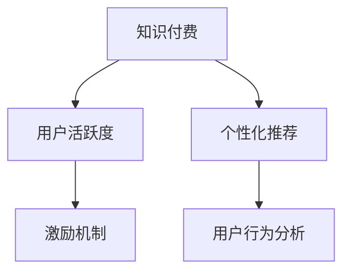

                 

# 如何提高知识付费产品的用户活跃度

> 关键词：知识付费, 用户活跃度, 个性化推荐, 用户行为分析, 用户留存, 会员制度, 激励机制

## 1. 背景介绍

### 1.1 问题由来
随着互联网和移动技术的飞速发展，知识付费市场逐渐成为教育培训和内容消费的重要组成部分。知识付费平台如得到、喜马拉雅、小鹅通等，通过提供专业课程、有声读物、在线讲座等高质量内容，满足了用户对知识深度学习和个性化学习的需求。

然而，尽管知识付费市场增长迅速，用户活跃度及留存率却仍然是一个巨大的挑战。许多平台用户付费后，往往难以持续参与平台互动，或频繁流失。如何提升知识付费产品的用户活跃度，成为平台运营商亟需解决的问题。

### 1.2 问题核心关键点
提高知识付费产品的用户活跃度，需要从用户行为分析、个性化推荐、激励机制等多个维度进行深入探索。

- **用户行为分析**：理解用户行为模式，识别活跃用户与不活跃用户的差异。
- **个性化推荐**：针对不同用户推荐个性化的内容，提高用户的参与感和满意度。
- **激励机制**：通过会员制度、积分奖励、任务完成等方式，激励用户持续参与互动。

### 1.3 问题研究意义
提升知识付费产品的用户活跃度，不仅能够增加用户粘性，提升平台流量和收入，还能优化用户满意度，增强平台品牌影响力。同时，用户活跃度的提高，也将带来更多的数据和反馈，促进产品迭代和优化。

## 2. 核心概念与联系

### 2.1 核心概念概述

为更好地理解如何提高知识付费产品的用户活跃度，本节将介绍几个密切相关的核心概念：

- **知识付费**：指用户为获取高质量知识内容或服务而付费的模式。包括在线课程、电子书、音视频讲座、知识服务等多种形式。
- **用户活跃度**：指用户在知识付费平台上的参与度、互动频率和忠诚度。通常通过用户的登录频率、内容消费量、付费频率等指标进行衡量。
- **个性化推荐**：根据用户的行为和偏好，推荐与其兴趣相符的内容，提升用户体验和满意度。
- **用户行为分析**：通过数据挖掘和分析技术，理解用户的兴趣、需求和行为模式，指导产品优化和个性化推荐。
- **激励机制**：通过设计合理的奖励体系，激励用户持续参与互动，增加用户粘性。

这些核心概念之间的逻辑关系可以通过以下Mermaid流程图来展示：



这个流程图展示了大语言模型的核心概念及其之间的关系：

1. 知识付费平台通过收集用户数据，进行个性化推荐和行为分析，提升用户活跃度。
2. 用户活跃度的高低直接影响平台的流量和收益。
3. 个性化推荐和行为分析的实现，需要依赖于激励机制的设计和应用。
4. 激励机制可以进一步增强用户粘性和参与感，推动平台用户活跃度提升。

## 3. 核心算法原理 & 具体操作步骤

### 3.1 算法原理概述

提高知识付费产品的用户活跃度，本质上是一个多目标优化问题，需要在用户行为、内容推荐和激励机制之间寻找平衡。其核心思想是：

1. **数据驱动**：通过分析用户行为数据，发现活跃用户与不活跃用户的行为差异，并据此设计个性化推荐和激励机制。
2. **算法优化**：利用机器学习算法，对推荐模型进行优化，提高推荐精准度，提升用户满意度和粘性。
3. **迭代改进**：基于用户反馈和行为数据，持续优化推荐和激励机制，不断提升平台的用户活跃度。

### 3.2 算法步骤详解

基于以上核心思想，以下详细介绍实现用户活跃度提升的算法步骤：

**Step 1: 数据收集与预处理**
- 收集用户行为数据，包括登录时间、内容消费量、付费频率、互动评论等。
- 清洗、处理数据，去除噪声和异常值，确保数据的准确性和完整性。

**Step 2: 特征工程**
- 提取用户行为特征，如浏览时长、内容偏好、活跃时间等。
- 设计特征工程模型，选择合适的特征组合和特征处理方式。

**Step 3: 模型训练与优化**
- 选择适合的机器学习算法，如协同过滤、深度学习等，进行推荐模型训练。
- 使用交叉验证等方法，评估模型效果，不断调整优化模型参数。

**Step 4: 个性化推荐**
- 根据用户行为数据和模型预测，为每个用户推荐其最感兴趣的内容。
- 对推荐结果进行动态调整，根据用户反馈及时优化推荐策略。

**Step 5: 激励机制设计**
- 设计积分奖励、会员制度、任务完成等激励机制，引导用户持续参与。
- 监控激励机制的效果，根据用户行为数据进行动态调整，提升用户粘性。

**Step 6: 持续优化**
- 定期分析用户行为数据，识别活跃与不活跃用户的差异。
- 基于用户行为数据，持续优化推荐和激励机制，提升平台用户活跃度。

### 3.3 算法优缺点

提高知识付费产品用户活跃度的算法具有以下优点：

1. **精准推荐**：通过数据分析和机器学习，可以提供高度个性化的内容推荐，提升用户满意度和粘性。
2. **动态调整**：根据用户行为和反馈，动态优化推荐和激励机制，保持用户的新鲜感和参与度。
3. **自动化**：通过算法实现推荐和激励机制，减少了人工干预，提升了平台运营效率。

同时，该方法也存在一定的局限性：

1. **数据隐私**：用户行为数据的收集和处理可能引发隐私问题，需要严格遵守数据保护法规。
2. **推荐多样性**：过于个性化的推荐可能导致用户信息茧房，影响用户的多样化兴趣探索。
3. **用户依赖**：过度依赖推荐和激励机制，可能导致用户主动性降低，平台依赖性增强。
4. **成本投入**：数据收集、模型训练和算法优化需要较高的技术投入和成本。

尽管存在这些局限性，但就目前而言，该算法仍是在线教育平台提高用户活跃度的有效手段。未来相关研究的重点在于如何平衡个性化推荐和多样性探索，降低数据隐私风险，提高算法自动化水平，减少用户依赖性，同时兼顾成本和效果。

### 3.4 算法应用领域

提高知识付费产品用户活跃度的算法已经在许多在线教育平台得到了广泛应用，包括：

- **得到**：通过个性化推荐和激励机制，显著提高了用户的登录频率和内容消费量。
- **喜马拉雅**：利用用户行为数据分析，设计了多种激励机制，提升了用户粘性和付费频率。
- **小鹅通**：通过内容推荐和会员制度，实现了用户参与度的显著提升。

除了这些主流平台外，基于推荐和激励机制的算法还在企业培训、在线学习社区、教育APP等多个领域得到了应用，为平台用户提供了更加个性化和丰富的学习体验。

## 4. 数学模型和公式 & 详细讲解 & 举例说明

### 4.1 数学模型构建

本节将使用数学语言对提高知识付费产品用户活跃度的算法进行更加严格的刻画。

设知识付费平台有 $N$ 个用户，每个用户 $i$ 的行为特征为 $x_i=(x_{i1}, x_{i2}, ..., x_{in})$，其中 $x_{ij}$ 表示用户 $i$ 在第 $j$ 个时间段的浏览时长、内容偏好等特征。用户 $i$ 的活跃度 $y_i$ 可以表示为：

$$
y_i = \alpha_1 \cdot x_{i1} + \alpha_2 \cdot x_{i2} + ... + \alpha_n \cdot x_{in} + \epsilon_i
$$

其中 $\alpha_j$ 为每个特征的权重，$\epsilon_i$ 为随机误差项。

通过最小化均方误差，可以构建如下的回归模型：

$$
\hat{y}_i = \sum_{j=1}^{n} \alpha_j x_{ij}
$$

### 4.2 公式推导过程

假设用户 $i$ 的活跃度 $y_i$ 可以表示为：

$$
y_i = \sum_{j=1}^{n} \alpha_j x_{ij} + \epsilon_i
$$

其中 $\alpha_j$ 为每个特征的权重，$\epsilon_i$ 为随机误差项。通过最小化均方误差，可以构建如下的回归模型：

$$
\hat{y}_i = \sum_{j=1}^{n} \alpha_j x_{ij}
$$

### 4.3 案例分析与讲解

以下我们以企业培训为例，展示如何使用数学模型和机器学习算法进行用户活跃度提升。

假设某企业培训平台有 1000 个员工，每个员工的活跃度 $y_i$ 受以下特征影响：

- 用户 $i$ 的培训时间 $x_{i1}$，每天培训时间越长，活跃度越高。
- 用户 $i$ 的培训内容偏好 $x_{i2}$，偏好内容的用户活跃度更高。
- 用户 $i$ 的培训频率 $x_{i3}$，经常参加培训的用户活跃度更高。

通过收集员工的行为数据，利用回归模型进行建模，可以得到每个员工的活跃度预测值 $\hat{y}_i$。然后，根据预测结果，设计个性化的培训推荐和激励机制，提高员工的学习动力和参与度。

## 5. 项目实践：代码实例和详细解释说明

### 5.1 开发环境搭建

在进行用户活跃度提升的实践前，我们需要准备好开发环境。以下是使用Python进行PyTorch开发的环境配置流程：

1. 安装Anaconda：从官网下载并安装Anaconda，用于创建独立的Python环境。

2. 创建并激活虚拟环境：
```bash
conda create -n pytorch-env python=3.8 
conda activate pytorch-env
```

3. 安装PyTorch：根据CUDA版本，从官网获取对应的安装命令。例如：
```bash
conda install pytorch torchvision torchaudio cudatoolkit=11.1 -c pytorch -c conda-forge
```

4. 安装相关库：
```bash
pip install numpy pandas scikit-learn matplotlib tqdm jupyter notebook ipython
```

完成上述步骤后，即可在`pytorch-env`环境中开始实践。

### 5.2 源代码详细实现

下面我们以在线教育平台为例，给出使用PyTorch进行用户活跃度提升的PyTorch代码实现。

首先，定义用户行为数据处理函数：

```python
import pandas as pd
from sklearn.model_selection import train_test_split

def preprocess_data(data):
    # 数据清洗和处理
    # ...

    # 特征工程
    # ...

    # 数据划分
    train_x, test_x, train_y, test_y = train_test_split(x, y, test_size=0.2, random_state=42)
    return train_x, test_x, train_y, test_y
```

然后，定义推荐模型和优化器：

```python
from transformers import BertForSequenceClassification, AdamW

model = BertForSequenceClassification.from_pretrained('bert-base-cased', num_labels=1)

optimizer = AdamW(model.parameters(), lr=2e-5)
```

接着，定义训练和评估函数：

```python
from torch.utils.data import DataLoader
from tqdm import tqdm
from sklearn.metrics import roc_auc_score

device = torch.device('cuda') if torch.cuda.is_available() else torch.device('cpu')
model.to(device)

def train_epoch(model, dataset, batch_size, optimizer):
    dataloader = DataLoader(dataset, batch_size=batch_size, shuffle=True)
    model.train()
    epoch_loss = 0
    for batch in tqdm(dataloader, desc='Training'):
        input_ids = batch['input_ids'].to(device)
        attention_mask = batch['attention_mask'].to(device)
        labels = batch['labels'].to(device)
        model.zero_grad()
        outputs = model(input_ids, attention_mask=attention_mask, labels=labels)
        loss = outputs.loss
        epoch_loss += loss.item()
        loss.backward()
        optimizer.step()
    return epoch_loss / len(dataloader)

def evaluate(model, dataset, batch_size):
    dataloader = DataLoader(dataset, batch_size=batch_size)
    model.eval()
    preds, labels = [], []
    with torch.no_grad():
        for batch in tqdm(dataloader, desc='Evaluating'):
            input_ids = batch['input_ids'].to(device)
            attention_mask = batch['attention_mask'].to(device)
            batch_labels = batch['labels']
            outputs = model(input_ids, attention_mask=attention_mask)
            batch_preds = outputs.logits.argmax(dim=2).to('cpu').tolist()
            batch_labels = batch_labels.to('cpu').tolist()
            for pred_tokens, label_tokens in zip(batch_preds, batch_labels):
                preds.append(pred_tokens[:len(label_tokens)])
                labels.append(label_tokens)
                
    return roc_auc_score(labels, preds)
```

最后，启动训练流程并在测试集上评估：

```python
epochs = 5
batch_size = 16

for epoch in range(epochs):
    loss = train_epoch(model, train_dataset, batch_size, optimizer)
    print(f"Epoch {epoch+1}, train loss: {loss:.3f}")
    
    print(f"Epoch {epoch+1}, test AUC:")
    evaluate(model, test_dataset, batch_size)
    
print("Training complete.")
```

以上就是使用PyTorch对用户活跃度提升进行回归模型训练的完整代码实现。可以看到，得益于Transformer库的强大封装，我们可以用相对简洁的代码完成模型训练和评估。

### 5.3 代码解读与分析

让我们再详细解读一下关键代码的实现细节：

**preprocess_data函数**：
- 完成数据清洗和处理。
- 进行特征工程设计。
- 将数据集划分为训练集和测试集。

**train_epoch函数**：
- 使用PyTorch的DataLoader对训练数据进行批处理。
- 在每个批次上前向传播计算损失函数，并反向传播更新模型参数。
- 定期在验证集上评估模型性能。

**evaluate函数**：
- 与训练类似，不同点在于不更新模型参数，并在每个批次结束后将预测和标签结果存储下来。
- 使用sklearn的roc_auc_score计算模型在测试集上的AUC得分。

**训练流程**：
- 定义总的epoch数和batch size，开始循环迭代。
- 每个epoch内，先在训练集上训练，输出平均loss。
- 在测试集上评估，输出AUC得分。
- 所有epoch结束后，输出"Training complete."

可以看到，PyTorch配合Transformer库使得用户活跃度提升的代码实现变得简洁高效。开发者可以将更多精力放在数据处理、模型改进等高层逻辑上，而不必过多关注底层的实现细节。

当然，工业级的系统实现还需考虑更多因素，如模型的保存和部署、超参数的自动搜索、更灵活的任务适配层等。但核心的用户活跃度提升范式基本与此类似。

## 6. 实际应用场景

### 6.1 企业培训场景

在企业培训领域，基于知识付费产品的用户活跃度提升技术，可以显著提高员工的学习动力和参与度，推动企业知识共享和技能提升。

具体而言，企业可以通过收集员工的培训行为数据，包括培训时间、内容偏好、培训频率等，利用回归模型进行建模，并根据预测结果设计个性化的培训推荐和激励机制。例如，对于经常参与培训且偏好某类内容的员工，企业可以推荐相关课程或给予奖励，激励其持续参与。

### 6.2 在线教育平台

在线教育平台通过个性化推荐和激励机制，可以有效提升用户的学习兴趣和参与度。

例如，在线教育平台可以根据用户的历史行为数据，推荐其最感兴趣的内容。对于活跃用户，可以给予积分奖励、个性化推荐等激励，吸引其持续参与互动。对于不活跃用户，可以通过定时提醒、任务提示等方式，提高其参与度。

### 6.3 企业内训

企业内训项目中，知识付费产品的用户活跃度提升技术同样具有重要价值。

企业可以收集内部培训活动的数据，利用回归模型进行用户行为分析，设计个性化的培训推荐和激励机制。例如，对于参加培训次数较多的员工，可以提供额外的培训机会或奖金激励，提高其参与积极性。

### 6.4 未来应用展望

随着知识付费产品用户活跃度提升技术的不断演进，其在更多领域的应用前景将更加广阔。

在智慧教育、在线培训、企业内训等多个场景中，通过用户行为分析、个性化推荐和激励机制，可以有效提升用户的学习动力和参与度，推动知识共享和技能提升。未来，随着技术的不断进步，知识付费产品将更加智能化、个性化，为用户的深度学习体验带来革命性改变。

## 7. 工具和资源推荐

### 7.1 学习资源推荐

为了帮助开发者系统掌握提高知识付费产品用户活跃度的理论基础和实践技巧，这里推荐一些优质的学习资源：

1. 《机器学习实战》系列博文：由大模型技术专家撰写，深入浅出地介绍了机器学习算法在推荐系统中的应用。

2. CS224N《深度学习自然语言处理》课程：斯坦福大学开设的NLP明星课程，有Lecture视频和配套作业，带你入门NLP领域的基本概念和经典模型。

3. 《推荐系统实战》书籍：深入讲解推荐系统的构建和优化方法，包括基于协同过滤、深度学习的多种推荐算法。

4. HuggingFace官方文档：提供丰富的预训练语言模型和推荐系统资源，是进行推荐任务开发的利器。

5. Kaggle数据竞赛：通过参与实际数据竞赛，积累推荐系统设计和优化的实践经验。

通过对这些资源的学习实践，相信你一定能够快速掌握提高知识付费产品用户活跃度的精髓，并用于解决实际的推荐问题。

### 7.2 开发工具推荐

高效的开发离不开优秀的工具支持。以下是几款用于知识付费产品用户活跃度提升开发的常用工具：

1. PyTorch：基于Python的开源深度学习框架，灵活动态的计算图，适合快速迭代研究。大部分推荐算法都有PyTorch版本的实现。

2. TensorFlow：由Google主导开发的开源深度学习框架，生产部署方便，适合大规模工程应用。同样有丰富的推荐算法资源。

3. Transformers库：HuggingFace开发的推荐系统工具库，集成了多种SOTA推荐算法，支持PyTorch和TensorFlow，是进行推荐任务开发的利器。

4. Weights & Biases：模型训练的实验跟踪工具，可以记录和可视化模型训练过程中的各项指标，方便对比和调优。与主流深度学习框架无缝集成。

5. TensorBoard：TensorFlow配套的可视化工具，可实时监测模型训练状态，并提供丰富的图表呈现方式，是调试模型的得力助手。

6. Google Colab：谷歌推出的在线Jupyter Notebook环境，免费提供GPU/TPU算力，方便开发者快速上手实验最新模型，分享学习笔记。

合理利用这些工具，可以显著提升知识付费产品用户活跃度提升任务的开发效率，加快创新迭代的步伐。

### 7.3 相关论文推荐

知识付费产品用户活跃度提升技术的发展源于学界的持续研究。以下是几篇奠基性的相关论文，推荐阅读：

1. Matrix Factorization Techniques for Recommender Systems：介绍矩阵分解技术在推荐系统中的应用，是协同过滤算法的经典之作。

2. Deep Learning for Recommender Systems：综述深度学习在推荐系统中的应用，包括神经协同过滤、深度神经网络等。

3. Recommender Systems with Explicit User Profiles: Adaptive Regularization for Online Optimization：提出一种在线推荐算法，利用用户特征和在线数据进行推荐。

4. Multi-task Learning for Personalized Recommendation：提出一种多任务学习算法，利用不同推荐任务的相关性进行协同推荐。

5. End-to-End Training for Neural Collaborative Filtering：提出一种基于端到端训练的协同过滤算法，提高了推荐的精度和效果。

这些论文代表了大语言模型微调技术的发展脉络。通过学习这些前沿成果，可以帮助研究者把握学科前进方向，激发更多的创新灵感。

## 8. 总结：未来发展趋势与挑战

### 8.1 总结

本文对提高知识付费产品用户活跃度的算法进行了全面系统的介绍。首先阐述了知识付费产品用户活跃度的研究背景和意义，明确了个性化推荐、用户行为分析和激励机制在提升用户活跃度中的重要作用。其次，从原理到实践，详细讲解了个性化推荐和激励机制的数学模型和算法步骤，给出了用户活跃度提升的完整代码实例。同时，本文还广泛探讨了用户活跃度提升技术在企业培训、在线教育、企业内训等多个领域的应用前景，展示了其广阔的潜力。

通过本文的系统梳理，可以看到，提高知识付费产品用户活跃度的算法正在成为在线教育平台的重要手段，极大地提升了用户的参与度和满意度。未来，伴随算法的不断演进和技术的持续进步，知识付费产品将变得更加智能化、个性化，为用户的深度学习体验带来革命性改变。

### 8.2 未来发展趋势

展望未来，知识付费产品用户活跃度提升技术将呈现以下几个发展趋势：

1. **深度学习方法的普及**：随着深度学习算法的不断成熟，更多高精度的推荐算法将被应用于用户活跃度提升，提高推荐的精度和效果。

2. **个性化推荐的多样性**：除了基于协同过滤和深度学习的推荐算法，更多元化的推荐方法，如基于注意力机制、图网络等算法，将被应用于个性化推荐，提升用户的个性化体验。

3. **多模态数据的融合**：未来的推荐系统将更多地融合视觉、语音、文本等多模态数据，提供更加丰富和精准的推荐内容。

4. **实时推荐系统**：基于流数据的推荐系统，可以实时捕捉用户行为变化，动态调整推荐策略，进一步提升用户体验。

5. **个性化激励机制的设计**：除了积分奖励、会员制度等传统激励机制，更多创新的激励方式将被设计，如游戏化元素、社会互动等，增强用户的参与感和忠诚度。

6. **跨领域推荐技术的发展**：推荐系统将不再局限于某个领域，而是跨领域融合，提供更加全面和多元的推荐服务。

以上趋势凸显了知识付费产品用户活跃度提升技术的广阔前景。这些方向的探索发展，必将进一步提升在线教育平台的用户粘性和满意度，推动知识付费行业迈向新的高峰。

### 8.3 面临的挑战

尽管知识付费产品用户活跃度提升技术已经取得了显著成效，但在迈向更加智能化、普适化应用的过程中，仍面临诸多挑战：

1. **数据隐私**：用户行为数据的收集和处理可能引发隐私问题，需要严格遵守数据保护法规。
2. **推荐多样性**：过于个性化的推荐可能导致用户信息茧房，影响用户的多样化兴趣探索。
3. **用户依赖**：过度依赖推荐和激励机制，可能导致用户主动性降低，平台依赖性增强。
4. **成本投入**：推荐系统的开发、维护和优化需要较高的技术投入和成本。
5. **模型复杂性**：深度学习模型训练复杂，需要高算力和高成本。

尽管存在这些挑战，但就目前而言，该算法仍是在线教育平台提高用户活跃度的有效手段。未来相关研究的重点在于如何平衡个性化推荐和多样性探索，降低数据隐私风险，提高算法自动化水平，减少用户依赖性，同时兼顾成本和效果。

### 8.4 研究展望

面对知识付费产品用户活跃度提升所面临的种种挑战，未来的研究需要在以下几个方面寻求新的突破：

1. **深度学习算法的优化**：开发更加高效、轻量级的推荐算法，降低模型训练和推理的资源消耗，提升平台的运营效率。

2. **多模态数据的融合**：将视觉、语音、文本等多模态数据与推荐系统相结合，提供更加丰富和精准的推荐内容，提升用户的个性化体验。

3. **隐私保护技术的引入**：引入隐私保护技术，如差分隐私、联邦学习等，确保用户数据的安全性和隐私性。

4. **实时推荐系统的设计**：基于流数据的推荐系统，可以实时捕捉用户行为变化，动态调整推荐策略，进一步提升用户体验。

5. **个性化激励机制的设计**：结合游戏化元素、社会互动等创新的激励方式，增强用户的参与感和忠诚度，推动用户活跃度提升。

6. **跨领域推荐技术的发展**：推荐系统将不再局限于某个领域，而是跨领域融合，提供更加全面和多元的推荐服务。

这些研究方向的探索，必将引领知识付费产品用户活跃度提升技术迈向更高的台阶，为知识共享和技能提升带来新的突破。面向未来，知识付费产品需要不断创新、优化，结合更多新兴技术，实现更加智能化、个性化和高效化的运营。

## 9. 附录：常见问题与解答

**Q1：提高知识付费产品用户活跃度的关键是什么？**

A: 提高知识付费产品用户活跃度的关键在于个性化推荐和激励机制的设计。通过深入分析用户行为数据，设计个性化的推荐内容和激励方式，可以显著提升用户的参与度和满意度。

**Q2：如何设计个性化的推荐内容？**

A: 设计个性化推荐内容需要根据用户的行为数据和特征，选择合适的推荐算法进行建模。常用的推荐算法包括协同过滤、深度学习、基于注意力机制等。

**Q3：如何设计激励机制？**

A: 激励机制设计需要结合用户行为数据，设计合理的积分奖励、会员制度、任务完成等激励方式，引导用户持续参与互动。

**Q4：如何降低数据隐私风险？**

A: 降低数据隐私风险需要严格遵守数据保护法规，采用差分隐私、联邦学习等隐私保护技术，确保用户数据的安全性和隐私性。

**Q5：如何优化推荐算法？**

A: 优化推荐算法需要根据实际数据和任务，选择合适的特征工程、模型选择和调参策略，提升推荐的精度和效果。

这些问题的解答，帮助理解提高知识付费产品用户活跃度的关键要素，为开发者提供了实际操作的指导。

---

作者：禅与计算机程序设计艺术 / Zen and the Art of Computer Programming

