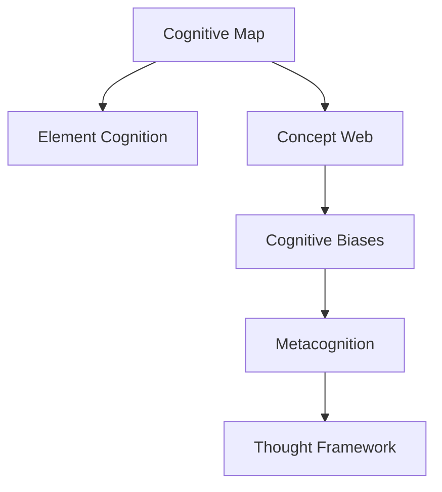

                 

## 1. 背景介绍

在今天这个信息爆炸的时代，个人如何在庞杂的知识海洋中航行，构建自己的知识体系，形成独立的思考方式，成为了每个现代人必须面对的问题。在这个背景下，构建个人的思维框架显得尤为重要。本文将深入探讨个人思维框架的构建方法，从基础理论到实际操作，一步步带领读者构建属于自己的思维体系。

## 2. 核心概念与联系

### 2.1 核心概念概述

为了更好地理解个人思维框架的构建，本节将介绍几个关键概念：

- **认知地图（Cognitive Map）**：指一个人对周围世界的基本理解，包括对信息、关系和可能的行动的理解。认知地图体现了个人的知识结构和认知能力。
- **元认知（Metacognition）**：指对自己认知过程的认知，包括对思考、推理、记忆、学习和问题解决等过程的意识和控制。元认知是个人思维框架的核心组成部分。
- **概念网（Concept Web）**：指个人对知识的组织和关联，通过概念网可以将知识系统地组织起来，促进知识的深度理解和应用。
- **认知偏误（Cognitive Biases）**：指在信息处理过程中常见的偏见和错误，如确认偏误、代表性启发法等。认知偏误可能影响个人思维的准确性和公正性，需要加以识别和纠正。

这些核心概念之间的逻辑关系可以通过以下Mermaid流程图来展示：



这个流程图展示了个体思维框架的几个关键部分及其相互作用：

1. 认知地图作为知识结构的起点。
2. 概念网帮助组织和关联知识。
3. 元认知帮助识别和纠正认知偏误。
4. 思想框架则是在此基础上形成的系统性思考工具。

## 3. 核心算法原理 & 具体操作步骤

### 3.1 算法原理概述

个人思维框架的构建是一个系统化的过程，需要通过一系列的认知和操作活动来不断调整和优化。这个过程中，核心算法原理包括但不限于：

- **信息整合（Information Integration）**：将来自不同来源的信息整合成一致的知识结构。
- **逻辑推理（Logical Reasoning）**：利用逻辑规则和证据进行推理，形成合理的结论。
- **认知反馈（Cognitive Feedback）**：通过反思和评估，不断调整思维过程，修正认知偏误。
- **问题解决（Problem Solving）**：使用系统性方法解决实际问题，优化认知地图和概念网。

### 3.2 算法步骤详解

构建个人思维框架可以分为以下几个关键步骤：

**Step 1: 定义核心问题**
- 确定自己的核心问题和兴趣领域，明确希望通过思维框架解决或理解的问题。
- 分析问题的复杂性和目标，确定需要获取和整合哪些信息。

**Step 2: 收集信息**
- 从可靠的来源收集相关的信息和数据，包括文献、书籍、讲座、网络资源等。
- 使用各种工具和策略，如笔记软件、思维导图、信息检索等，对信息进行有效管理。

**Step 3: 信息整合**
- 将收集到的信息进行分类和整理，建立初步的知识结构。
- 通过逻辑推理和证据评估，逐步修正和完善知识结构。
- 使用概念网工具，将信息关联起来，形成系统的知识体系。

**Step 4: 形成认知地图**
- 基于整合后的知识体系，构建个人认知地图。
- 在认知地图上标注关键概念和关系，形成对世界的系统理解。
- 利用元认知工具，如反思日志、自我评估等，不断调整认知地图。

**Step 5: 应用和评估**
- 将形成的认知地图应用到实际问题解决中，验证其有效性和适用性。
- 通过反思和反馈，不断优化和调整认知地图和概念网。
- 形成迭代循环，持续改进个人思维框架。

### 3.3 算法优缺点

个人思维框架的构建方法具有以下优点：
- **系统性**：通过系统化的步骤，保证信息整合和认知过程的逻辑性和完整性。
- **适应性**：可以灵活应对不同的问题和领域，适应变化。
- **可操作性**：通过具体的步骤和方法，使得思维框架的构建具有可操作性。

同时，该方法也存在一定的局限性：
- **时间和精力投入**：构建思维框架需要较长时间和大量精力，对个人时间管理有较高要求。
- **复杂性**：对于复杂的知识和问题，构建和维护思维框架可能需要较高专业知识和技能。
- **个体差异**：不同个体在认知能力和知识结构上存在差异，需要根据自身情况进行调整。

尽管存在这些局限性，但就目前而言，构建个人思维框架仍然是一种高效、系统的方法，对于提升个人认知水平和问题解决能力具有重要意义。

### 3.4 算法应用领域

个人思维框架的应用领域非常广泛，包括但不限于：

- **学术研究**：通过构建学科知识框架，提升学术研究和知识整合能力。
- **职业发展**：通过系统性思考提升职业判断和决策能力，优化职业生涯路径。
- **生活管理**：通过优化认知地图和生活概念网，提升时间管理和生活质量。
- **健康心理**：通过认知偏误的识别和调整，提升心理韧性和情绪管理能力。
- **社会参与**：通过系统性思考和逻辑推理，参与社会公益和公民行动。

这些应用领域展示了个人思维框架的广泛适用性和重要性，体现了其在个人发展和职业成长中的关键作用。

## 4. 数学模型和公式 & 详细讲解 & 举例说明

### 4.1 数学模型构建

构建个人思维框架涉及多个维度的数学模型，包括但不限于：

- **信息整合模型**：描述如何通过信息的逻辑组合和关联，形成知识体系。
- **认知偏误模型**：识别和量化常见的认知偏误，评估其对思维过程的影响。
- **认知反馈模型**：描述认知过程的调整和优化机制，包括反思、评估和修正。
- **问题解决模型**：描述系统性方法在问题解决中的应用，包括问题定义、方案设计、执行和评估。

### 4.2 公式推导过程

以信息整合模型为例，假设有一个初始知识集 $K_0 = \{k_1, k_2, ..., k_n\}$，我们希望通过逻辑推理将新信息 $I$ 整合到知识集 $K$ 中。我们可以使用合取范式（Conjunctive Normal Form, CNF）来表示信息的逻辑关系，即：

$$
I = \bigvee_{i=1}^m (k_{a_i} \wedge \neg k_{b_i})
$$

其中 $k_{a_i}$ 表示与新信息相关的旧知识，$\neg k_{b_i}$ 表示与新信息冲突的旧知识。通过逻辑推理，我们可以将新信息 $I$ 整合到知识集 $K$ 中，得到新的知识集 $K' = K \cup I'$，其中 $I'$ 是新信息整合后的形式。

### 4.3 案例分析与讲解

以构建个人健康管理框架为例，我们可以按照以下步骤进行：

1. **定义核心问题**：确定健康管理的核心目标，如控制体重、改善睡眠等。
2. **收集信息**：通过阅读相关文献、咨询医生、使用健康应用等方式，收集相关的健康知识和数据。
3. **信息整合**：将收集到的信息分类整理，构建健康知识框架，如饮食、运动、心理等模块。
4. **形成认知地图**：在认知地图上标注关键概念和关系，如饮食与体重的关系、运动对心理的影响等。
5. **应用和评估**：将形成的认知地图应用到健康管理实践中，如制定饮食计划、运动计划等，并通过反思和反馈不断优化认知地图。

这个案例展示了个人思维框架在实际生活中的应用，体现了其对个人健康管理的有效性和系统性。

## 5. 项目实践：代码实例和详细解释说明

### 5.1 开发环境搭建

构建个人思维框架需要一定的技术工具和环境支持。以下是使用Python进行知识管理开发的常见环境配置流程：

1. **安装Python和Jupyter Notebook**：从官网下载并安装Python和Jupyter Notebook。
2. **安装相关库**：安装用于信息管理和逻辑推理的Python库，如pandas、numpy、networkx、py2neo等。
3. **搭建知识管理系统**：使用pandas和numpy等库，建立知识数据结构，如数据框架、数据模型等。

### 5.2 源代码详细实现

以下是一个简单的Python代码实例，展示如何使用pandas进行知识数据的收集、整理和分析：

```python
import pandas as pd

# 定义健康信息数据框架
data = {
    '疾病': ['糖尿病', '高血压', '肥胖', '睡眠不足'],
    '症状': ['口渴', '头晕', '体重增加', '疲劳'],
    '饮食': ['高糖饮食', '高盐饮食', '高脂肪饮食', '不规律饮食'],
    '运动': ['缺乏运动', '过度运动', '不规律运动', '规律运动']
}

# 创建数据框架
df = pd.DataFrame(data)

# 数据处理和分析
df.describe()
```

### 5.3 代码解读与分析

**数据框架创建**：
- 使用pandas创建了一个包含疾病、症状、饮食和运动的四个列的数据框架。
- 通过`df.describe()`方法，对数据进行了基本的描述统计，包括均值、标准差、最小值和最大值等。

**逻辑推理和整合**：
- 可以使用pandas进行数据的逻辑推理和整合，如计算症状与疾病的相关性、饮食对健康的影响等。
- 可以使用网络x库构建知识图谱，将疾病、症状和饮食等概念关联起来，形成系统的健康知识网络。

### 5.4 运行结果展示

通过上述代码，我们可以得到一个基本的健康信息数据框架，展示了疾病、症状、饮食和运动之间的关系。接下来，可以通过数据处理和逻辑推理，进一步构建系统的健康知识网络。

## 6. 实际应用场景

### 6.1 学术研究

在学术研究中，构建个人思维框架可以帮助研究人员系统地整理和理解学科知识，形成对研究问题的深刻见解。例如，通过构建人工智能领域的知识框架，研究人员可以更好地理解深度学习、自然语言处理、计算机视觉等领域的知识体系和应用场景。

### 6.2 职业发展

在职业发展中，构建个人思维框架可以帮助职场人士提升职业判断和决策能力，优化职业生涯路径。例如，通过构建职业发展框架，职场人士可以系统地规划自己的技能提升、职位转换、项目选择等，最大化职业发展的潜力。

### 6.3 生活管理

在生活中，构建个人思维框架可以帮助个人提升时间管理和生活质量。例如，通过构建生活管理框架，个人可以系统地安排日常任务、优化时间分配、提高生活效率。

### 6.4 未来应用展望

随着技术的不断进步和认知科学的深入发展，个人思维框架的构建方法也将不断演进。未来的发展趋势可能包括：

- **AI辅助构建**：利用人工智能技术，自动收集、整理和分析信息，辅助构建认知地图和概念网。
- **多模态融合**：结合文本、图像、视频等多种信息源，构建更加全面、丰富的知识体系。
- **实时反馈系统**：通过实时反馈系统，动态调整和优化认知地图和概念网，提高思维框架的适应性。
- **跨领域应用**：将思维框架应用于更多领域，如金融、医疗、教育等，提升跨领域问题解决能力。

## 7. 工具和资源推荐

### 7.1 学习资源推荐

为了帮助读者系统掌握构建个人思维框架的理论和实践技巧，这里推荐一些优质的学习资源：

1. **《思考，快与慢》（Thinking, Fast and Slow）**：丹尼尔·卡尼曼的畅销书，深入探讨了人类思维的快速与缓慢过程，揭示了认知偏误的根源。
2. **《学会提问》（Asking the Right Questions）**：尼尔·布朗的经典书籍，介绍了如何通过问题导向思考，构建系统的思维框架。
3. **《系统思维》（Systems Thinking）**：伦敦商学院的课程，系统讲解了系统思维的基本概念、方法和应用。
4. **《结构化思维》（Structured Thinking）**：卡里斯·勒维克（Cary Lehman）的书籍，详细介绍了结构化思维的工具和方法。
5. **《认知心理学》（Cognitive Psychology）**：心理学经典课程，介绍了认知心理学的基本理论和应用。

通过对这些资源的学习实践，相信读者可以更好地理解和应用构建个人思维框架的方法，提升个人认知水平和问题解决能力。

### 7.2 开发工具推荐

高效的开发离不开优秀的工具支持。以下是几款用于构建个人思维框架开发的常用工具：

1. **pandas和numpy**：用于数据处理和分析，支持大规模数据集的操作和分析。
2. **networkx**：用于构建和分析网络图，支持复杂知识网络的构建和分析。
3. **py2neo**：用于与Neo4j数据库交互，支持大规模知识图谱的存储和查询。
4. **Jupyter Notebook**：用于数据处理和分析，支持代码的交互式执行和共享。
5. **Microsoft OneNote**：用于笔记和知识整理，支持多维度的信息组织和管理。

合理利用这些工具，可以显著提升个人思维框架的构建效率，加速创新迭代的步伐。

### 7.3 相关论文推荐

构建个人思维框架的研究源于学界的持续探索。以下是几篇奠基性的相关论文，推荐阅读：

1. **《系统思维导论》（Introduction to Systems Thinking）**：Alan Bryman的书籍，系统介绍了系统思维的基本概念、方法和应用。
2. **《构建个人知识管理体系》（Building a Personal Knowledge Management System）**：Dale Carnegie的书籍，介绍了知识管理的工具和方法。
3. **《认知偏误：理解思维中的陷阱》（Cognitive Biases: Understanding the Tricks Your Mind Plays on You）**：David Cunningham的书籍，详细介绍了常见的认知偏误和避免方法。
4. **《个人思维框架的设计和实现》（Designing and Implementing Personal Thought Frameworks）**：IEEE Trans on Systems, Man, and Cybernetics的论文，介绍了个人思维框架的设计和实现方法。

这些论文代表了个体思维框架构建领域的发展脉络。通过学习这些前沿成果，可以帮助研究者把握学科前进方向，激发更多的创新灵感。

## 8. 总结：未来发展趋势与挑战

### 8.1 总结

本文对构建个人思维框架的方法进行了全面系统的介绍。首先阐述了个人思维框架的构建背景和重要性，明确了其对个人认知水平和问题解决能力的提升作用。其次，从原理到实践，详细讲解了构建个人思维框架的数学模型和操作步骤，给出了具体的代码实例和详细解释。同时，本文还广泛探讨了个人思维框架在学术研究、职业发展、生活管理等多个领域的应用前景，展示了其广阔的应用范围。此外，本文精选了构建个人思维框架的各类学习资源和开发工具，力求为读者提供全方位的技术指引。

通过本文的系统梳理，可以看到，构建个人思维框架是提升个人认知水平和问题解决能力的重要手段。在信息爆炸的今天，通过系统化的思考和优化，可以更好地应对复杂多变的现实世界，实现自我超越和价值提升。

### 8.2 未来发展趋势

展望未来，个人思维框架的构建将呈现以下几个发展趋势：

1. **AI辅助构建**：随着人工智能技术的进步，AI辅助构建思维框架将成为可能，使得个人思维框架的构建更加高效和系统。
2. **多模态融合**：结合文本、图像、视频等多种信息源，构建更加全面、丰富的知识体系，提升思维框架的适应性。
3. **实时反馈系统**：通过实时反馈系统，动态调整和优化认知地图和概念网，提高思维框架的适应性。
4. **跨领域应用**：将思维框架应用于更多领域，如金融、医疗、教育等，提升跨领域问题解决能力。
5. **伦理和安全考量**：随着AI技术的应用，如何保护个人隐私和数据安全，防止认知偏误和误导性输出，将成为思维框架构建的重要方向。

以上趋势凸显了个人思维框架构建技术的发展前景，这些方向的探索发展，必将进一步提升个人认知水平和问题解决能力，为人类认知智能的进化带来深远影响。

### 8.3 面临的挑战

尽管构建个人思维框架的方法已经取得了显著成就，但在迈向更加智能化、普适化应用的过程中，它仍面临着诸多挑战：

1. **时间和精力投入**：构建思维框架需要较长时间和大量精力，对个人时间管理有较高要求。
2. **复杂性**：对于复杂的知识和问题，构建和维护思维框架可能需要较高专业知识和技能。
3. **个体差异**：不同个体在认知能力和知识结构上存在差异，需要根据自身情况进行调整。
4. **认知偏误**：需要不断识别和纠正认知偏误，防止错误的思维模式影响决策。
5. **伦理和安全**：如何保护个人隐私和数据安全，防止认知偏误和误导性输出，将是重要的研究课题。

尽管存在这些挑战，但构建个人思维框架仍然是提升个人认知水平和问题解决能力的重要手段。通过不断优化和调整，相信这些挑战最终能够被克服，个人思维框架将在构建人机协同的智能时代中扮演越来越重要的角色。

### 8.4 未来突破

面对构建个人思维框架所面临的种种挑战，未来的研究需要在以下几个方面寻求新的突破：

1. **AI辅助构建**：利用人工智能技术，自动收集、整理和分析信息，辅助构建认知地图和概念网。
2. **多模态融合**：结合文本、图像、视频等多种信息源，构建更加全面、丰富的知识体系。
3. **实时反馈系统**：通过实时反馈系统，动态调整和优化认知地图和概念网，提高思维框架的适应性。
4. **跨领域应用**：将思维框架应用于更多领域，如金融、医疗、教育等，提升跨领域问题解决能力。
5. **伦理和安全考量**：在思维框架构建中引入伦理和安全导向，保护个人隐私和数据安全，防止误导性输出。

这些研究方向的探索，必将引领构建个人思维框架技术迈向更高的台阶，为构建安全、可靠、可解释、可控的智能系统铺平道路。面向未来，构建个人思维框架需要与其他人工智能技术进行更深入的融合，如知识表示、因果推理、强化学习等，多路径协同发力，共同推动自然语言理解和智能交互系统的进步。只有勇于创新、敢于突破，才能不断拓展个人思维框架的边界，让智能技术更好地造福人类社会。

## 9. 附录：常见问题与解答

**Q1：个人思维框架构建需要多长时间？**

A: 构建个人思维框架需要的时间因人而异，取决于问题的复杂性、个体的知识储备和学习能力等因素。一般而言，系统性地构建一个完整的思维框架可能需要数周到数月不等。

**Q2：如何判断思维框架是否有效？**

A: 可以通过以下几个方面来判断思维框架的有效性：
1. 逻辑一致性：思维框架是否能够系统性地整合和推理信息。
2. 实用性和适用性：思维框架是否能够解决实际问题，提升决策能力。
3. 可操作性：思维框架是否易于理解和应用，是否能够持续优化和调整。

**Q3：如何避免认知偏误？**

A: 避免认知偏误的方法包括但不限于：
1. 系统反思：定期回顾和反思自己的思维过程，识别潜在的认知偏误。
2. 多样性输入：从不同来源获取信息，避免单一信息源导致的偏误。
3. 多视角分析：从不同角度和视角分析问题，避免单一思维模式的局限。
4. 批判性思维：对信息来源和推理过程进行批判性评估，识别潜在的误导性信息。

**Q4：思维框架构建过程中如何处理复杂问题？**

A: 处理复杂问题的方法包括但不限于：
1. 分解问题：将复杂问题分解为多个子问题，逐一解决。
2. 多学科融合：结合不同学科的知识和方法，综合解决复杂问题。
3. 迭代优化：在不断调整和优化思维框架的基础上，逐步解决问题。
4. 专家咨询：在需要时，寻求相关领域专家的意见和建议，提升问题解决能力。

**Q5：思维框架构建过程中如何保持动力？**

A: 保持动力的建议包括但不限于：
1. 设定目标：明确构建思维框架的目标和阶段性里程碑。
2. 持续学习：不断学习新的知识和技能，保持对问题的兴趣和好奇心。
3. 成果展示：通过记录和分享自己的思维框架构建过程和成果，获得反馈和激励。
4. 社区支持：加入相关的学习社区和讨论组，获取支持和帮助。

通过这些问题的解答，相信读者可以更全面地理解构建个人思维框架的方法和技巧，为个人认知水平和问题解决能力的提升提供有力支持。

---

作者：禅与计算机程序设计艺术 / Zen and the Art of Computer Programming

