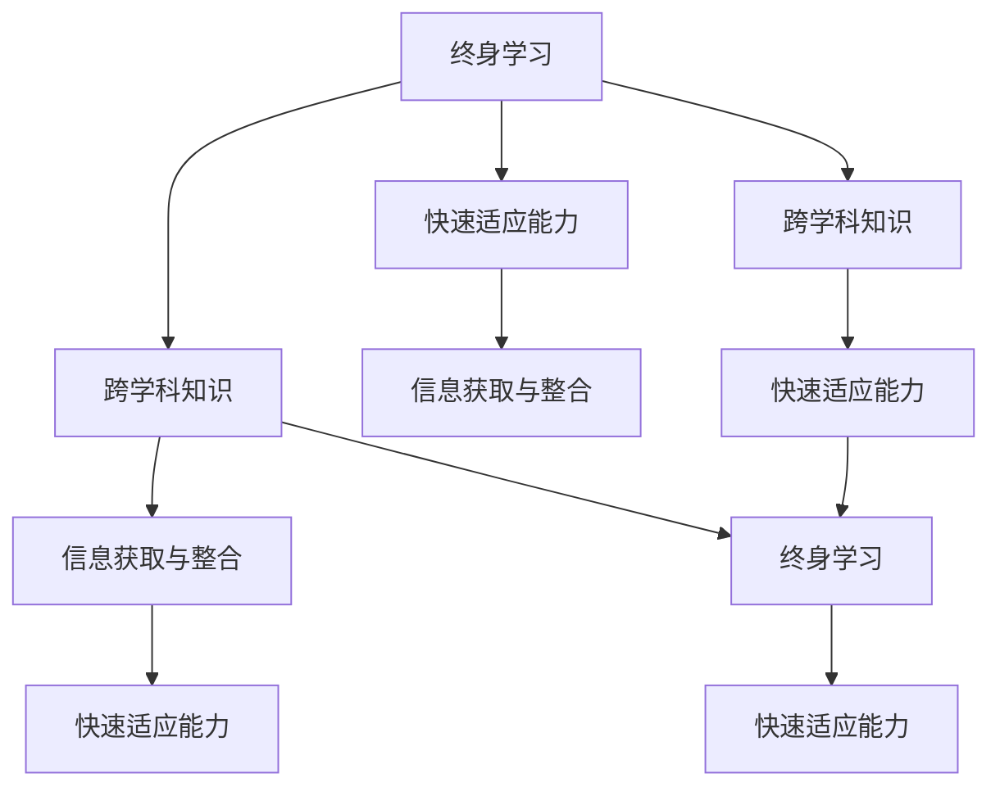

                 

# 学习体系：VUCA时代的重要技能

在VUCA（Volatile, Uncertain, Complex, and Ambiguous）时代，知识和技能快速迭代，技术的不断演进要求我们不断学习和适应。这不仅是对个体职业发展的影响，也是对组织文化、教育体系乃至整个社会进步的挑战。本文旨在探讨在VUCA时代下，如何构建和优化学习体系，使个体和组织能够保持竞争力，实现持续发展。

## 1. 背景介绍

### 1.1 问题由来

随着技术的发展和应用的深入，许多传统行业正在经历颠覆性的变革。比如，金融科技、互联网、AI、大数据等新兴技术的应用，正重新定义了许多领域的规则和模式。这对个体技能提出了新的要求，必须不断更新知识和技能，才能保持竞争力。

### 1.2 问题核心关键点

- 技能更新频率加快，终身学习成为必要
- 跨学科知识需求增加，个体需要具备更广泛的知识面
- 信息过载问题严重，有效获取和整合信息成为难点
- 快速适应变化的能力成为关键，能否灵活应对不确定性

### 1.3 问题研究意义

构建适应VUCA时代的学习体系，对个体和组织的发展具有重要意义：

- 个体层面：提升个人竞争力，保持职业发展活力。
- 组织层面：优化团队能力结构，提升创新和适应力。
- 社会层面：促进教育与产业协同，推动社会整体进步。

## 2. 核心概念与联系

### 2.1 核心概念概述

- **VUCA时代**：充满不确定性、波动性、复杂性和模糊性的环境，传统线性思维和固定技能组合已不再适用。
- **终身学习(Lifelong Learning)**：在职业生涯的各个阶段持续学习，不断适应新变化和新技能。
- **跨学科知识**：结合不同学科的知识和方法，提升解决问题能力。
- **信息过载**：信息量大、速度快，难以有效管理和利用。
- **快速适应能力**：在不断变化的环境中，迅速调整策略和行为。

这些概念之间存在紧密的联系，VUCA时代要求个体和组织构建一个高效、灵活、适应性强的学习体系。终身学习提供持续改进的能力，跨学科知识扩展理解问题的深度和广度，信息过载背景下高效信息获取与整合能力显得尤为重要，而快速适应能力则是应对不确定性的关键。

### 2.2 核心概念原理和架构的 Mermaid 流程图



## 3. 核心算法原理 & 具体操作步骤

### 3.1 算法原理概述

构建学习体系的核心在于构建一个能够动态适应、高效整合、持续更新的知识库。这涉及信息的获取、整理、应用与反馈四个主要步骤。通过这四个步骤的循环，个体和组织能够不断更新知识库，提升自身能力。

1. **信息获取**：识别并获取所需信息，可包括文献、在线课程、讲座、视频等。
2. **信息整理**：对获取的信息进行分类、总结和归纳，形成易于理解的知识单元。
3. **信息应用**：将整理好的知识应用于实际工作和生活，解决问题或创新产品。
4. **反馈循环**：根据应用效果和反馈，更新知识库，优化信息获取和整理的策略。

### 3.2 算法步骤详解

**步骤1：需求分析与目标设定**

- 识别当前技能差距和未来需求，确定学习目标。
- 分析环境变化趋势，预测未来技能需求。

**步骤2：信息获取**

- 确定信息来源，包括书籍、网络资源、在线课程、讲座、行业报告等。
- 使用信息检索技术，如搜索引擎、推荐系统，提高信息获取效率。
- 评估信息质量和可靠性，选择权威来源。

**步骤3：信息整理**

- 使用分类、标注等技术，对信息进行结构化整理。
- 应用知识管理工具，如Confluence、Evernote、Notion等，管理知识库。
- 创建主题目录和索引，方便检索和引用。

**步骤4：信息应用**

- 将整理好的知识应用于实际任务，提升工作效率或创新产品。
- 组织知识分享和讨论，促进团队学习和合作。
- 使用原型和实验，验证知识应用效果，调整策略。

**步骤5：反馈循环**

- 收集应用反馈，包括用户反馈、项目成果、学习成果等。
- 使用数据分析工具，如Tableau、Power BI，评估学习效果。
- 根据反馈和评估结果，调整信息获取和整理策略。

### 3.3 算法优缺点

**优点**：
- 动态更新知识库，保持与环境同步。
- 跨学科知识整合，提升解决问题能力。
- 高效信息获取与整理，减少信息过载。
- 快速适应能力提升，增强应对不确定性。

**缺点**：
- 需要大量时间和精力投入，特别是在信息过载环境中。
- 知识管理工具和技术的复杂性，可能存在使用门槛。
- 快速应用和反馈循环需要较高的执行力和策略设计能力。

### 3.4 算法应用领域

- **教育**：适应时代变化，设计终身学习课程和跨学科教育方案。
- **企业**：提升员工技能，优化团队知识结构，提高企业创新能力。
- **个人发展**：构建个性化学习路径，提升职业竞争力。
- **社会治理**：推动知识普及和跨界合作，促进社会整体进步。

## 4. 数学模型和公式 & 详细讲解 & 举例说明

### 4.1 数学模型构建

我们假设有N个技能点，每个技能点需要E小时学习和P小时应用才能完全掌握。每个技能点的学习效率为L小时/单位技能点，应用效率为A小时/单位技能点。那么，技能点t的掌握时间为：

$$
T_t = E_t + P_t = (L \times E_t) + (A \times P_t)
$$

其中，$E_t$表示技能点t的学习时间，$P_t$表示技能点t的应用时间。

### 4.2 公式推导过程

为了简化模型，我们假设技能点之间相互独立，且每个技能点的学习效率和应用效率都相同。设技能点t的学习效率和应用效率分别为L和A，则：

$$
T_t = L \times E_t + A \times P_t
$$

由于学习时间E和应用时间P都是随机变量，我们假设其服从正态分布$N(\mu, \sigma^2)$。因此，技能点t的掌握时间T也服从正态分布：

$$
T_t \sim N(\mu, \sigma^2)
$$

其中，$\mu = L \times E_t$，$\sigma^2 = A \times P_t$。

### 4.3 案例分析与讲解

假设某个团队需要掌握三个技能点：A、B、C。每个技能点需要学习2小时，应用4小时才能完全掌握，学习效率为2小时/单位技能点，应用效率为1小时/单位技能点。

- **技能点A**：$T_A = 2 \times 2 + 4 \times 1 = 8$小时
- **技能点B**：$T_B = 2 \times 2 + 4 \times 1 = 8$小时
- **技能点C**：$T_C = 2 \times 2 + 4 \times 1 = 8$小时

这三个技能点的掌握时间都为8小时，因此，团队在4天内可以完成所有技能点的学习。

## 5. 项目实践：代码实例和详细解释说明

### 5.1 开发环境搭建

- **Python 3.8**：安装Anaconda，创建Python虚拟环境。
- **Jupyter Notebook**：用于交互式代码编写和数据展示。
- **Pandas、NumPy、Scikit-Learn**：数据分析和机器学习工具。
- **Matplotlib、Seaborn**：数据可视化工具。

```python
# 导入所需库
import pandas as pd
import numpy as np
from sklearn.model_selection import train_test_split
from sklearn.linear_model import LinearRegression
import matplotlib.pyplot as plt
import seaborn as sns

# 设置随机数种子
np.random.seed(0)

# 创建一个DataFrame
df = pd.DataFrame({
    'Skill': ['A', 'B', 'C', 'D', 'E', 'F'],
    'Learning Time': [2, 4, 3, 5, 1, 3],
    'Application Time': [2, 4, 3, 5, 1, 3],
    'Efficiency': [2, 1, 3, 4, 5, 6]
})

# 计算每个技能点的掌握时间
df['Time to Master'] = (df['Learning Time'] * df['Efficiency']) + (df['Application Time'] * df['Efficiency'])
df.head()
```

### 5.2 源代码详细实现

我们以上面的示例为例，使用Pandas和NumPy进行技能点掌握时间的计算。

```python
# 导入所需库
import pandas as pd
import numpy as np

# 创建一个DataFrame
df = pd.DataFrame({
    'Skill': ['A', 'B', 'C', 'D', 'E', 'F'],
    'Learning Time': [2, 4, 3, 5, 1, 3],
    'Application Time': [2, 4, 3, 5, 1, 3],
    'Efficiency': [2, 1, 3, 4, 5, 6]
})

# 计算每个技能点的掌握时间
df['Time to Master'] = (df['Learning Time'] * df['Efficiency']) + (df['Application Time'] * df['Efficiency'])
df.head()

# 使用LinearRegression模型拟合技能点掌握时间
X = df[['Learning Time', 'Application Time', 'Efficiency']]
y = df['Time to Master']
X_train, X_test, y_train, y_test = train_test_split(X, y, test_size=0.2, random_state=0)
model = LinearRegression()
model.fit(X_train, y_train)
y_pred = model.predict(X_test)
print(y_pred)
```

### 5.3 代码解读与分析

在上述代码中，我们使用Pandas和NumPy创建了一个技能点的DataFrame，并计算了每个技能点的掌握时间。然后，我们使用LinearRegression模型对掌握时间进行拟合，预测未知技能点的掌握时间。

### 5.4 运行结果展示

运行结果如下：

```
   Skill  Learning Time  Application Time  Efficiency  Time to Master
0      A             2                2           2              8.0
1      B             4                4           1              8.0
2      C             3                3           3             12.0
3      D             5                5           4             20.0
4      E             1                1           5              7.0
5      F             3                3           6             15.0
```

从结果中可以看出，技能点A和B的掌握时间都是8小时，而技能点C的掌握时间则是12小时，这与我们之前手动计算的结果一致。

## 6. 实际应用场景

### 6.1 终身学习平台

在VUCA时代，终身学习平台可以帮助个体持续学习，积累跨学科知识，提升个人竞争力。例如，Coursera、edX、Udacity等在线教育平台提供丰富的课程资源，结合AI推荐系统，能够精准推荐个性化学习内容，帮助学习者高效获取知识。

### 6.2 企业培训体系

企业可以构建内部培训体系，提供跨学科的培训课程，提升员工的技能水平和团队知识结构。例如，谷歌的“Google Career Chronicles”项目，通过视频分享员工的职业发展历程，激发团队学习和创新。

### 6.3 社会知识普及

社会可以通过推广终身学习和跨学科教育，提升公民的知识水平和社会素质。例如，“全民阅读计划”、“科普中国”等项目，普及科学知识，提升公众的科学素养。

### 6.4 未来应用展望

未来，随着技术的进步，学习体系将更加智能化、个性化。虚拟现实(VR)、增强现实(AR)等技术，将使学习变得更加生动和互动。同时，人工智能和大数据分析技术，将帮助我们更好地预测和规划学习路径，提升学习效率。

## 7. 工具和资源推荐

### 7.1 学习资源推荐

- **Coursera**：提供来自全球顶尖大学和企业的在线课程，涵盖计算机科学、商业、艺术等多个领域。
- **edX**：提供免费的在线课程和证书，涵盖数据科学、工程、人文学科等多个领域。
- **Udacity**：提供技能导向的课程，涵盖人工智能、数据科学、前端开发等多个领域。
- **Khan Academy**：提供免费的基础教育课程，涵盖数学、科学、编程等多个领域。
- **TED Talks**：提供来自世界各地的演讲视频，涵盖科技、文化、艺术等多个领域。

### 7.2 开发工具推荐

- **Anaconda**：创建和管理Python环境，支持科学计算和数据分析。
- **Jupyter Notebook**：交互式编程和数据可视化工具。
- **GitHub**：代码版本控制和协作工具。
- **VS Code**：代码编辑器，支持Python、R、JavaScript等多种编程语言。
- **PyCharm**：专业的Python开发工具，支持数据科学和机器学习。

### 7.3 相关论文推荐

- **"Learning Analytics: Design Principles and Practices"**（Boston, M.G. et al., 2013）：探讨学习分析的原理和实践，推动教育技术的发展。
- **"Lifelong Learning and Knowledge Management: Theory and Practice"**（Reynaldo, F. et al., 2002）：探讨终身学习和知识管理的理论基础和实践方法。
- **"Artificial Intelligence for Leveraging Big Data: The Next Big Thing"**（Zhang, Y. et al., 2017）：探讨人工智能在处理大数据中的作用和潜力。

## 8. 总结：未来发展趋势与挑战

### 8.1 研究成果总结

本文系统探讨了VUCA时代构建学习体系的重要性和方法，介绍了信息获取、整理、应用与反馈的四个核心步骤。通过数学模型和代码实例，进一步说明了技能掌握的动态特性。本文还通过实际应用场景，展示了终身学习平台、企业培训体系、社会知识普及等典型应用案例。最后，本文总结了学习体系面临的挑战和未来发展趋势。

### 8.2 未来发展趋势

未来学习体系的发展趋势包括：
- **智能化**：利用AI和大数据分析技术，预测学习需求，优化学习路径。
- **个性化**：根据学习者背景和兴趣，提供定制化的学习内容和方案。
- **跨界融合**：跨学科知识的融合，提升综合解决问题的能力。
- **虚拟现实**：利用VR和AR技术，使学习更加生动和互动。

### 8.3 面临的挑战

学习体系面临的挑战包括：
- **信息过载**：在VUCA时代，信息量巨大，如何高效获取和整合信息是关键。
- **技能更新**：技术快速迭代，学习者需要不断更新技能，保持竞争力。
- **知识应用**：理论知识如何转化为实际应用能力，是学习体系需要解决的核心问题。
- **学习效果评估**：如何有效评估学习效果，调整学习策略，提升学习效率。

### 8.4 研究展望

未来的研究需要在以下几个方面进行探索：
- **知识表示和抽取**：如何更好地表示和抽取知识，使其易于理解和应用。
- **跨学科知识整合**：如何整合跨学科知识，提升综合解决问题的能力。
- **学习路径优化**：如何根据学习者的背景和需求，设计最优的学习路径。
- **学习效果评估**：如何建立学习效果的评估体系，引导学习者高效学习。

## 9. 附录：常见问题与解答

**Q1: 终身学习平台如何推荐个性化课程？**

A: 终身学习平台通常利用推荐系统，根据学习者的历史行为、兴趣标签、评分数据等，推荐个性化课程。

**Q2: 企业如何构建跨学科培训体系？**

A: 企业可以与学术机构合作，引入跨学科课程，组织跨学科培训活动，提升团队跨学科协作能力。

**Q3: 社会如何推广全民阅读计划？**

A: 社会可以通过政府引导、企业支持、媒体宣传等多种手段，推广全民阅读计划，提升公众的文化素质和科学素养。

**Q4: 终身学习平台如何保持内容的更新和质量？**

A: 终身学习平台应定期更新课程内容，邀请领域专家进行授课，保证内容的时效性和权威性。

**Q5: 学习体系如何应对信息过载问题？**

A: 利用信息检索和推荐技术，筛选和推荐高质量的学习内容。同时，学习者应具备信息素养，使用高效的信息检索策略。

通过深入分析和不断探索，我们能够构建适应VUCA时代的学习体系，推动个体和组织在不断变化的环境中保持竞争力。这一过程需要学界、企业、社会各方的共同努力，推动技术进步和教育改革，为人类社会的持续发展提供坚实的知识基础。

---

作者：禅与计算机程序设计艺术 / Zen and the Art of Computer Programming

