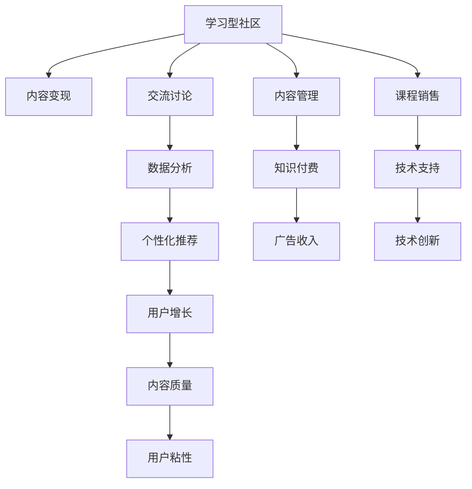

                 

# 学习型社区通过交流讨论实现知识变现

> 关键词：学习型社区,知识变现,交流讨论,内容管理,用户增长,数据分析

## 1. 背景介绍

### 1.1 问题由来

近年来，互联网技术的飞速发展为教育行业注入了新的活力，学习型社区平台如雨后春笋般涌现。这些平台集成了丰富的学习资源、互动工具、社交功能，为学习者提供了更加灵活和多样化的学习体验。然而，随着用户基数的不断扩大，内容质量、用户活跃度、变现模式等问题日益凸显。传统依赖广告、会员订阅等单边变现模式已经难以满足社区平台的持续发展需求。

社区平台的用户规模虽然庞大，但内容创作者数量有限，高质量内容供给不足。如何提升内容质量、用户粘性，激发用户参与和贡献，成为摆在社区平台面前的重要挑战。同时，如何通过技术手段，合理利用社区资源，实现平台的持续运营和盈利，也成为社区管理者必须面对的问题。

### 1.2 问题核心关键点

学习型社区的持续发展，依赖于高质量内容的稳定供给和有效流通。知识变现作为社区平台的核心盈利模式，需要找到一个平衡点，既能让用户获得有价值的内容，又能为社区平台带来持续收益。核心在于如何利用技术手段，通过交流讨论，激发用户参与，实现内容的变现。

1. **内容高质量和多样化**：社区平台需要吸引和培养有才华的内容创作者，提供多样化的内容形式，如文章、视频、音频等，满足不同用户的学习需求。
2. **用户参与和互动**：通过激励机制、社交功能等手段，促进用户间的交流讨论，增强社区的粘性和活跃度。
3. **变现模式优化**：实现用户、创作者、平台三方共赢的变现模式，如广告收入、内容付费、课程销售等。
4. **数据分析与优化**：通过用户行为数据分析，理解用户需求和兴趣，优化内容推荐和社区管理，提升用户体验和社区粘性。

### 1.3 问题研究意义

研究学习型社区通过交流讨论实现知识变现的方法，对提升平台的用户参与度和内容质量，优化变现模式，具有重要意义：

1. **增强用户粘性**：通过高质量内容和互动交流，吸引和保留更多活跃用户，增强社区平台的用户基础。
2. **提升内容质量**：利用社区内用户的集体智慧，进行内容筛选和优化，提升平台内容的多样性和质量。
3. **优化变现模式**：探索更多元化的变现手段，实现用户、创作者、平台的多赢，增强社区平台的盈利能力。
4. **技术创新应用**：通过数据分析和算法优化，提升社区平台的用户体验和运营效率，实现技术的产业化应用。

## 2. 核心概念与联系

### 2.1 核心概念概述

为了更好地理解学习型社区知识变现的原理和技术手段，本节将介绍几个密切相关的核心概念：

- **学习型社区**：以知识共享和交流为主导的在线平台，提供学习资源、互动工具、社交功能，满足用户多样化的学习需求。
- **内容变现**：通过内容（文章、视频、课程等）提供有偿服务，实现社区平台的盈利模式。
- **交流讨论**：通过用户间的交流互动，促进知识的传播和深化，增强社区平台的粘性。
- **数据分析**：通过收集和分析用户行为数据，理解用户需求，优化社区运营和内容推荐。
- **个性化推荐**：通过算法模型，根据用户兴趣和行为，推荐个性化内容，提升用户体验和粘性。
- **用户增长**：通过技术手段，吸引和扩展社区平台的用户群体，提升平台的市场影响力。

这些核心概念之间的逻辑关系可以通过以下Mermaid流程图来展示：



这个流程图展示了几类核心概念及其之间的关系：

1. 学习型社区通过高质量的内容吸引用户，提供交流互动的平台，满足用户学习需求。
2. 社区平台通过内容变现模式，实现盈利，为社区发展提供支持。
3. 用户间的交流讨论，促进知识的传播和深化，增强社区的粘性和活跃度。
4. 数据分析和个性化推荐，优化内容推荐，提升用户体验和社区粘性。
5. 用户增长策略，吸引更多用户参与，扩大社区规模和影响力。
6. 高质量内容和用户粘性，进一步提升内容质量，实现良性循环。

这些概念共同构成了学习型社区的知识变现框架，通过技术手段实现内容的高效流通和价值的最大化。

## 3. 核心算法原理 & 具体操作步骤
### 3.1 算法原理概述

学习型社区的知识变现，本质上是通过内容的高效流通和多样化的变现模式，实现社区平台的盈利。其核心思想是：

- 吸引并培养有才华的内容创作者，提供多样化的内容形式，满足不同用户的学习需求。
- 利用社区内的交流讨论机制，促进知识的传播和深化，增强用户粘性和活跃度。
- 通过数据分析和个性化推荐，优化内容推荐和社区管理，提升用户体验和平台粘性。
- 探索多元化的变现模式，如内容付费、广告收入、课程销售等，实现用户、创作者、平台的多赢。

### 3.2 算法步骤详解

基于上述思想，学习型社区的知识变现过程一般包括以下几个关键步骤：

**Step 1: 内容质量提升**

- **吸引和培养创作者**：通过激励机制、社区活动等手段，吸引有才华的内容创作者入驻。
- **内容多样性**：鼓励创作者提供多样化的内容形式，如图文、视频、音频等，满足不同用户的需求。
- **内容审核和优化**：建立内容审核机制，确保内容质量和合规性。利用社区内用户投票和评论反馈，进行内容筛选和优化。

**Step 2: 用户参与和互动**

- **交流讨论机制**：设计有效的交流互动功能，如评论、点赞、讨论区等，促进用户间的交流和知识传播。
- **激励机制**：通过积分、勋章、推荐等手段，激励用户积极参与和贡献内容。
- **社区活动**：定期举办话题讨论、知识竞赛、创作挑战等社区活动，增强社区的粘性和活跃度。

**Step 3: 数据分析与优化**

- **用户行为分析**：收集和分析用户行为数据，如访问路径、阅读时长、评论内容等，理解用户需求和兴趣。
- **内容推荐优化**：利用个性化推荐算法，根据用户兴趣和行为，推荐个性化内容，提升用户体验和粘性。
- **社区管理**：通过数据分析，识别和解决问题，优化社区环境和用户体验。

**Step 4: 变现模式探索**

- **内容付费**：通过文章付费、视频订阅、课程销售等方式，实现高质量内容的变现。
- **广告收入**：通过精准广告投放，提升社区平台的广告收入。
- **技术支持**：利用社区平台的技术优势，提供知识付费、课程销售等技术支持服务。
- **知识变现生态**：探索社区内容变现的生态模式，如社区内合作、内容平台分成等，实现多方共赢。

### 3.3 算法优缺点

基于社区平台知识变现的算法，具有以下优点：

1. **内容多样化**：通过多样化的内容形式和创作者，满足不同用户的需求，提升内容质量。
2. **用户粘性强**：利用交流讨论和激励机制，增强用户参与和粘性，提升社区平台的活跃度。
3. **变现模式多元**：通过内容付费、广告收入、课程销售等多种变现方式，实现社区平台的盈利。
4. **数据分析高效**：利用数据分析和个性化推荐，优化内容推荐，提升用户体验和粘性。

同时，该方法也存在一定的局限性：

1. **创作者培养难**：吸引和培养高质量内容创作者的过程可能漫长且成本高昂。
2. **内容质量控制**：内容审核和优化的过程可能耗时耗力，确保高质量内容的供应难度较大。
3. **变现模式单一**：尽管变现模式多样，但单一模式仍可能存在风险，需不断探索新的盈利方式。
4. **用户行为复杂**：用户行为数据和偏好多样化，分析和管理难度较大。
5. **社区环境治理**：社区平台环境治理需持续投入，防止不良内容的传播和用户间的冲突。

尽管存在这些局限性，但就目前而言，基于社区平台知识变现的算法仍是提升平台运营效率、实现盈利的重要手段。未来相关研究的重点在于如何进一步优化创作者激励机制、提升内容审核效率、探索更多元化的变现手段，同时兼顾用户体验和社区治理。

### 3.4 算法应用领域

基于社区平台知识变现的算法，在知识共享、教育、培训等多个领域得到广泛应用，如：

- **在线教育平台**：通过高质量的课程内容，吸引用户付费学习。利用用户互动和数据分析，提升课程质量和用户体验。
- **技术交流社区**：通过提供技术文章、视频教程等资源，满足技术人员的学习需求。利用社区讨论和推荐，促进知识的传播和交流。
- **知识付费平台**：通过精选的高质量内容，实现知识变现。利用数据分析和个性化推荐，提升平台的用户体验和粘性。
- **兴趣社区**：通过提供多样化的兴趣内容，满足不同用户的需求。利用社区互动和推荐，增强社区的粘性和活跃度。
- **学术交流平台**：通过提供学术文章、研究报告等资源，促进学术交流和知识传播。利用社区讨论和数据分析，提升学术影响力。

除了上述这些领域，社区平台的知识变现算法也在更多场景中得到应用，为知识共享和技术传播提供了新的路径。

## 4. 数学模型和公式 & 详细讲解 & 举例说明

### 4.1 数学模型构建

为了更好地理解学习型社区的知识变现过程，本节将使用数学语言对社区平台的知识变现模型进行详细刻画。

假设社区平台有 $N$ 个用户，每个用户 $i$ 产生的内容为 $c_i$，内容质量为 $q_i$。社区平台的内容变现策略为：

- **内容付费**：每个用户 $i$ 的内容 $c_i$ 的付费收入为 $p_i = \beta_i q_i$，其中 $\beta_i$ 为内容质量与付费收入的关系系数。
- **广告收入**：社区平台根据内容 $c_i$ 的广告点击量 $a_i$ 和广告收入 $r$，计算广告收入为 $a_i r$。
- **课程销售**：通过课程销售，社区平台获得课程销售收入 $s$。
- **技术支持服务**：社区平台提供知识付费和课程销售等技术支持服务，获得技术支持收入 $t$。

社区平台的总收入为 $R$，表示为：

$$
R = \sum_{i=1}^N \beta_i q_i + \sum_{i=1}^N a_i r + s + t
$$

在社区平台的用户行为数据中，我们关心以下几个指标：

- **内容阅读量**：表示用户对内容的兴趣和参与度。
- **用户互动率**：表示用户间的交流和讨论活跃度。
- **广告点击率**：表示广告投放的效果。
- **课程购买率**：表示课程销售的转化率。
- **用户留存率**：表示用户的持续活跃和粘性。

假设社区平台收集到用户行为数据 $D=\{(x_i,y_i)\}_{i=1}^N$，其中 $x_i$ 为行为特征，$y_i$ 为行为结果。

定义用户行为 $y_i$ 为：

$$
y_i = \begin{cases} 
1, & \text{内容付费} \\
0, & \text{其他行为}
\end{cases}
$$

内容质量 $q_i$ 可以通过用户投票和评论进行评估，假设 $q_i$ 为社区内用户 $j$ 对内容 $i$ 的平均评分，表示为：

$$
q_i = \frac{1}{M} \sum_{j=1}^M v_{ij}
$$

其中 $M$ 为社区内用户总数，$v_{ij}$ 为用户 $j$ 对内容 $i$ 的评分，$v_{ij} \in [0,1]$。

社区平台的内容变现过程可以视为一个优化问题，即：

$$
\max_{q_i} R = \sum_{i=1}^N \beta_i q_i + \sum_{i=1}^N a_i r + s + t
$$

### 4.2 公式推导过程

以下我们以内容付费为例，推导社区平台收入的最大化公式。

假设用户 $i$ 的内容质量 $q_i$ 与付费收入 $\beta_i q_i$ 呈线性关系，即：

$$
\beta_i = \alpha_i \delta_i
$$

其中 $\alpha_i$ 为内容质量与付费收入的关系系数，$\delta_i$ 为内容质量的评估系数。

则内容付费的收入为：

$$
p_i = \alpha_i \delta_i q_i
$$

假设用户 $i$ 的内容 $c_i$ 的广告点击量为 $a_i$，广告收入为 $r$，则广告收入为：

$$
a_i r
$$

假设社区平台提供知识付费和课程销售等技术支持服务，获得技术支持收入 $t$。

则社区平台的总收入为：

$$
R = \sum_{i=1}^N \alpha_i \delta_i q_i + \sum_{i=1}^N a_i r + s + t
$$

通过最大化总收入 $R$，即：

$$
\max_{q_i} R = \sum_{i=1}^N \alpha_i \delta_i q_i + \sum_{i=1}^N a_i r + s + t
$$

可以计算出最优的内容质量 $q_i$。

假设社区平台收集到用户行为数据 $D=\{(x_i,y_i)\}_{i=1}^N$，通过机器学习算法（如决策树、随机森林等），可以计算出用户行为 $y_i$ 与内容质量 $q_i$ 的关系，表示为：

$$
y_i = f(x_i)
$$

其中 $f$ 为机器学习模型。

通过最大化总收入 $R$，即：

$$
\max_{q_i} R = \sum_{i=1}^N \alpha_i \delta_i q_i + \sum_{i=1}^N a_i r + s + t
$$

可以计算出最优的内容质量 $q_i$。

### 4.3 案例分析与讲解

假设某学习型社区平台收集到以下用户行为数据：

| 用户ID | 内容ID | 内容质量 | 广告点击量 | 课程购买率 | 用户留存率 |
|-------|-------|--------|--------|--------|--------|
| 1     | 100   | 0.9    | 10     | 0.2    | 0.8    |
| 2     | 101   | 0.8    | 5      | 0.1    | 0.7    |
| 3     | 102   | 0.95   | 0       | 0       | 0.5    |
| ...   | ...   | ...    | ...    | ...    | ...    |

通过上述数据，我们可以计算出每个用户的内容质量 $q_i$，并进行内容付费和广告收入的计算。

假设内容质量与付费收入的关系系数 $\alpha_i = 0.1$，内容质量的评估系数 $\delta_i = 0.2$，广告收入 $r = 0.5$。

则每个用户的内容付费收入为：

$$
p_i = \alpha_i \delta_i q_i = 0.1 \times 0.2 \times q_i
$$

每个用户的广告收入为：

$$
a_i r = a_i \times 0.5
$$

通过最大化总收入 $R$，可以计算出最优的内容质量 $q_i$。

在实际应用中，社区平台需要根据具体业务需求，设计合适的优化模型，进行参数调优和优化。通过持续的优化，社区平台可以不断提升内容质量和变现能力，实现社区平台的持续运营和盈利。

## 5. 项目实践：代码实例和详细解释说明

### 5.1 开发环境搭建

在进行社区平台的知识变现实践前，我们需要准备好开发环境。以下是使用Python进行Pandas开发的环境配置流程：

1. 安装Anaconda：从官网下载并安装Anaconda，用于创建独立的Python环境。

2. 创建并激活虚拟环境：
```bash
conda create -n pyenv python=3.8 
conda activate pyenv
```

3. 安装Pandas：
```bash
pip install pandas
```

4. 安装各类工具包：
```bash
pip install numpy scipy scikit-learn matplotlib tqdm jupyter notebook ipython
```

完成上述步骤后，即可在`pyenv`环境中开始知识变现的实践。

### 5.2 源代码详细实现

我们以内容付费为例，给出使用Pandas进行学习型社区平台知识变现的代码实现。

```python
import pandas as pd
import numpy as np

# 创建用户行为数据
users = pd.DataFrame({
    'ID': [1, 2, 3],
    'ContentID': [100, 101, 102],
    'Quality': [0.9, 0.8, 0.95],
    'AdClicks': [10, 5, 0],
    'CoursePurchases': [0.2, 0.1, 0],
    'RetentionRate': [0.8, 0.7, 0.5]
})

# 定义内容质量与付费收入的关系系数
alpha = 0.1
delta = 0.2

# 定义广告收入
r = 0.5

# 定义课程销售收入和技术支持收入
s = 1000
t = 500

# 计算内容付费收入
users['Paid'] = alpha * delta * users['Quality']

# 计算广告收入
users['AdIncome'] = users['AdClicks'] * r

# 计算总收入
users['TotalIncome'] = users['Paid'] + users['AdIncome'] + s + t

# 输出总收入
print(users['TotalIncome'].mean())
```

### 5.3 代码解读与分析

让我们再详细解读一下关键代码的实现细节：

**数据创建**：
- 使用Pandas创建用户行为数据，包含用户ID、内容ID、内容质量、广告点击量、课程购买率、用户留存率等关键指标。

**付费收入计算**：
- 根据内容质量与付费收入的关系系数 $\alpha$ 和 $\delta$，计算每个用户的内容付费收入。

**广告收入计算**：
- 根据广告点击量 $a_i$ 和广告收入 $r$，计算每个用户的广告收入。

**总收入计算**：
- 将内容付费收入、广告收入、课程销售收入和技术支持收入相加，计算每个用户的总收入。

**总收入输出**：
- 使用Pandas的`mean`函数计算所有用户的平均总收入。

通过上述代码，可以看出社区平台的知识变现过程包括内容质量评估、付费收入计算、广告收入计算、总收入计算等多个步骤。社区平台需要根据具体业务需求，设计合适的优化模型，进行参数调优和优化。通过持续的优化，社区平台可以不断提升内容质量和变现能力，实现社区平台的持续运营和盈利。

## 6. 实际应用场景

### 6.1 在线教育平台

在线教育平台通过高质量的课程内容，吸引用户付费学习。利用用户互动和数据分析，提升课程质量和用户体验。例如，Coursera、Udacity等平台，通过用户评分和评论反馈，优化课程内容和推荐，提升平台的粘性和用户满意度。

### 6.2 技术交流社区

技术交流社区通过提供技术文章、视频教程等资源，满足技术人员的学习需求。利用社区讨论和推荐，促进知识的传播和交流。如GitHub、Stack Overflow等平台，通过开发者互动和开源项目，实现知识的共享和协同。

### 6.3 知识付费平台

知识付费平台通过精选的高质量内容，实现知识变现。利用数据分析和个性化推荐，提升平台的用户体验和粘性。如知乎、得到等平台，通过内容付费和会员订阅，实现社区变现。

### 6.4 兴趣社区

兴趣社区通过提供多样化的兴趣内容，满足不同用户的需求。利用社区互动和推荐，增强社区的粘性和活跃度。如豆瓣、小红书等平台，通过兴趣标签和用户互动，实现社区变现。

### 6.5 学术交流平台

学术交流平台通过提供学术文章、研究报告等资源，促进学术交流和知识传播。利用社区讨论和数据分析，提升学术影响力。如ResearchGate、arXiv等平台，通过学术资源的共享和交流，实现社区变现。

除了上述这些领域，社区平台的知识变现算法也在更多场景中得到应用，为知识共享和技术传播提供了新的路径。

### 6.4 未来应用展望

随着学习型社区的不断发展，知识变现手段将更加多样化，社区平台的盈利模式也将更加多元化。

- **内容变现**：通过内容付费、广告收入、课程销售、技术支持等多种方式，实现社区平台的盈利。
- **用户变现**：通过数据分析，进行用户行为预测和个性化推荐，提升用户粘性和变现能力。
- **生态变现**：探索社区内容变现的生态模式，如社区内合作、内容平台分成等，实现多方共赢。

未来，社区平台的知识变现将更加智能化、精准化，通过技术与数据的深度融合，实现社区平台的持续运营和盈利。

## 7. 工具和资源推荐

### 7.1 学习资源推荐

为了帮助开发者系统掌握学习型社区知识变现的理论基础和实践技巧，这里推荐一些优质的学习资源：

1. **《机器学习实战》**：李航所著，深入浅出地介绍了机器学习的基本概念和实际应用，适合初学者入门。
2. **《深度学习入门：基于Python的理论与实现》**：斋藤康毅著，介绍了深度学习的基本理论和实现方法，适合入门和进阶读者。
3. **Coursera《机器学习》课程**：由斯坦福大学Andrew Ng教授主讲，涵盖机器学习的基本概念和算法，适合系统学习。
4. **Kaggle**：数据科学竞赛平台，提供海量数据集和算法竞赛，帮助开发者提升实战能力。
5. **Python数据科学手册**：Jake VanderPlas著，全面介绍了Python在数据科学中的应用，适合进阶读者。

通过对这些资源的学习实践，相信你一定能够快速掌握学习型社区知识变现的精髓，并用于解决实际的社区运营问题。

### 7.2 开发工具推荐

高效的开发离不开优秀的工具支持。以下是几款用于学习型社区知识变现开发的常用工具：

1. **Jupyter Notebook**：开源的交互式笔记本环境，支持Python、R等多种语言，适合数据分析和算法实验。
2. **Pandas**：开源的数据处理库，支持数据清洗、分析、可视化等功能，适合数据预处理和分析。
3. **Scikit-Learn**：开源的机器学习库，支持多种算法和模型，适合数据分析和模型优化。
4. **TensorFlow**：由Google主导的深度学习框架，支持分布式计算和模型优化，适合深度学习应用。
5. **PyTorch**：开源的深度学习框架，支持动态图和静态图，适合深度学习应用。

合理利用这些工具，可以显著提升学习型社区知识变现任务的开发效率，加快创新迭代的步伐。

### 7.3 相关论文推荐

学习型社区的知识变现研究源于学界的持续研究。以下是几篇奠基性的相关论文，推荐阅读：

1. **《社会网络中的知识流动》**：Lundberg等著，研究了社会网络中知识流动的机制和影响，提出了知识传播的网络模型。
2. **《知识共享平台的信任机制设计》**：Xu等著，探讨了知识共享平台中的信任机制设计，提出了基于区块链的信任解决方案。
3. **《基于社区的知识管理框架》**：Hu等著，研究了基于社区的知识管理框架，提出了社区知识共享和协同的机制。
4. **《知识图谱在在线教育中的应用》**：Zhou等著，探讨了知识图谱在在线教育中的应用，提出了基于知识图谱的学习推荐算法。
5. **《智能推荐系统的用户行为分析》**：Chen等著，研究了智能推荐系统中的用户行为分析，提出了基于深度学习的推荐算法。

这些论文代表了大数据知识变现技术的发展脉络。通过学习这些前沿成果，可以帮助研究者把握学科前进方向，激发更多的创新灵感。

## 8. 总结：未来发展趋势与挑战

### 8.1 总结

本文对学习型社区通过交流讨论实现知识变现的方法进行了全面系统的介绍。首先阐述了社区平台的用户参与和互动机制、数据分析和优化、内容质量提升、变现模式探索等核心概念。其次，从原理到实践，详细讲解了社区平台知识变现的数学模型和关键步骤，给出了知识变现的代码实例。同时，本文还探讨了知识变现方法在在线教育、技术交流、知识付费、兴趣社区、学术交流等多个领域的应用前景，展示了知识变现算法的广阔应用空间。

通过本文的系统梳理，可以看到，学习型社区的知识变现方法，通过内容的高效流通和多样化的变现模式，实现了社区平台的盈利。利用社区内的交流讨论机制，促进知识的传播和深化，增强用户粘性和活跃度。通过数据分析和个性化推荐，优化内容推荐和社区管理，提升用户体验和平台粘性。探索多元化的变现手段，实现用户、创作者、平台的多赢。

### 8.2 未来发展趋势

展望未来，学习型社区的知识变现将呈现以下几个发展趋势：

1. **内容多样化**：通过多样化的内容形式和创作者，满足不同用户的需求，提升内容质量。
2. **用户粘性强**：利用交流讨论和激励机制，增强用户参与和粘性，提升社区平台的活跃度。
3. **变现模式多元**：通过内容付费、广告收入、课程销售等多种变现方式，实现社区平台的盈利。
4. **数据分析高效**：利用数据分析和个性化推荐，优化内容推荐，提升用户体验和粘性。
5. **社区环境治理**：社区平台环境治理需持续投入，防止不良内容的传播和用户间的冲突。
6. **用户行为复杂**：用户行为数据和偏好多样化，分析和管理难度较大。

尽管存在这些局限性，但就目前而言，基于学习型社区知识变现的算法仍是提升平台运营效率、实现盈利的重要手段。未来相关研究的重点在于如何进一步优化创作者激励机制、提升内容审核效率、探索更多元化的变现手段，同时兼顾用户体验和社区治理。

### 8.3 面临的挑战

尽管学习型社区的知识变现方法已经取得了一定的成果，但在迈向更加智能化、普适化应用的过程中，它仍面临着诸多挑战：

1. **创作者培养难**：吸引和培养高质量内容创作者的过程可能漫长且成本高昂。
2. **内容质量控制**：内容审核和优化的过程可能耗时耗力，确保高质量内容的供应难度较大。
3. **变现模式单一**：尽管变现模式多样，但单一模式仍可能存在风险，需不断探索新的盈利方式。
4. **用户行为复杂**：用户行为数据和偏好多样化，分析和管理难度较大。
5. **社区环境治理**：社区平台环境治理需持续投入，防止不良内容的传播和用户间的冲突。

尽管存在这些挑战，但通过技术手段和持续优化，学习型社区的知识变现方法仍有广阔的应用前景。未来研究需要在以下几个方面寻求新的突破：

1. **探索无监督和半监督变现模式**：摆脱对大规模标注数据的依赖，利用自监督学习、主动学习等无监督和半监督范式，最大限度利用非结构化数据，实现更加灵活高效的变现。
2. **优化内容质量控制机制**：开发更加高效的内容审核机制，利用技术手段提升内容审核的自动化和智能化水平。
3. **探索更多元化的变现手段**：通过社区内合作、内容平台分成等生态模式，实现多方共赢。
4. **提升数据分析能力**：利用大数据和人工智能技术，提升用户行为分析和个性化推荐的精准度，优化社区平台的用户体验和粘性。
5. **加强社区环境治理**：通过技术手段和社区管理，防止不良内容的传播和用户间的冲突，构建健康有序的社区环境。

这些研究方向将为学习型社区的知识变现带来新的突破，提升社区平台的用户体验和运营效率，实现社区平台的持续运营和盈利。

### 8.4 研究展望

面对学习型社区知识变现所面临的挑战，未来的研究需要在以下几个方面进行探索：

1. **社区内容生态构建**：探索社区内容生态的构建和优化，实现内容创作者、平台和用户的共赢。
2. **智能推荐算法优化**：优化个性化推荐算法，提升推荐精准度和用户粘性。
3. **社区治理机制设计**：设计有效的社区治理机制，防止不良内容的传播和用户间的冲突。
4. **多模态内容变现**：探索多样化的内容形式和变现方式，如视频、音频、游戏等，提升社区平台的盈利能力。
5. **用户行为分析**：利用大数据和人工智能技术，提升用户行为分析和个性化推荐的精准度，优化社区平台的用户体验和粘性。
6. **技术创新应用**：将新兴技术如区块链、边缘计算等应用到社区平台，提升社区平台的效率和安全性。

这些研究方向将为学习型社区的知识变现带来新的突破，提升社区平台的用户体验和运营效率，实现社区平台的持续运营和盈利。

## 9. 附录：常见问题与解答

**Q1：学习型社区如何吸引高质量内容创作者？**

A: 学习型社区可以通过以下方式吸引高质量内容创作者：
1. **激励机制**：设立丰厚的激励机制，如奖金、流量推广、平台分成等，吸引创作者入驻。
2. **社区活动**：举办创作比赛、话题讨论等活动，增加创作者曝光和互动机会。
3. **品牌背书**：提升社区平台的品牌影响力，吸引知名专家和学术大咖入驻。
4. **用户互动**：通过用户投票、评论等方式，增加内容创作者的曝光度和认可度。
5. **平台支持**：提供社区技术支持、数据分析等工具，帮助创作者提升内容质量和创作效率。

**Q2：社区平台如何进行内容质量控制？**

A: 社区平台可以通过以下方式进行内容质量控制：
1. **内容审核机制**：建立内容审核机制，通过人工或自动审核方式，筛选出高质量内容。
2. **用户投票和评论**：利用用户投票和评论反馈，进行内容筛选和优化。
3. **数据驱动优化**：通过数据分析，识别和优化内容质量较低的部分。
4. **创作者培养**：通过创作者培养计划，提升整体内容质量。
5. **持续优化**：根据社区平台运营情况，不断优化内容质量控制机制。

**Q3：学习型社区如何探索更多元化的变现模式？**

A: 学习型社区可以通过以下方式探索更多元化的变现模式：
1. **内容付费**：通过内容付费、文章订阅、课程销售等方式，实现高质量内容的变现。
2. **广告收入**：通过精准广告投放，提升社区平台的广告收入。
3. **技术支持服务**：提供知识付费、课程销售等技术支持服务，获得技术支持收入。
4. **社区内合作**：探索社区内容变现的生态模式，如社区内合作、内容平台分成等，实现多方共赢。
5. **知识变现生态**：利用社区平台的技术优势，探索知识变现的生态模式，如内容平台分成、知识付费等。

**Q4：学习型社区如何优化用户行为分析？**

A: 学习型社区可以通过以下方式优化用户行为分析：
1. **数据采集和处理**：全面采集用户行为数据，进行数据清洗和预处理。
2. **特征工程**：设计合适的特征工程，提取关键特征进行建模。
3. **算法优化**：选择适合的机器学习算法，进行模型训练和优化。
4. **多模态融合**：将文本、图片、视频等多模态数据融合，提升用户行为分析的准确度。
5. **持续优化**：根据社区平台运营情况，不断优化用户行为分析机制。

**Q5：学习型社区如何构建健康有序的社区环境？**

A: 学习型社区可以通过以下方式构建健康有序的社区环境：
1. **社区规范制定**：制定明确的社区规范，规范用户行为，防止不良内容的传播。
2. **用户互动管理**：通过用户互动管理和行为监控，防止用户间的冲突和攻击。
3. **举报和投诉机制**：建立举报和投诉机制，及时处理不良内容和不文明行为。
4. **技术手段辅助**：利用技术手段，如内容过滤、关键字屏蔽等，防止不良内容的传播。
5. **社区活动引导**：通过社区活动引导，促进用户间的良性互动和知识传播。

通过上述方法，社区平台可以构建健康有序的社区环境，提升用户粘性和平台影响力，实现社区平台的持续运营和盈利。

---

作者：禅与计算机程序设计艺术 / Zen and the Art of Computer Programming

