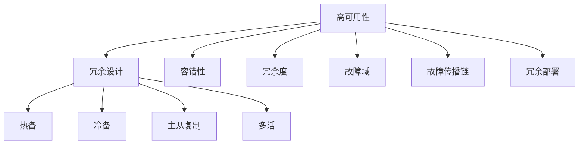

                 

# 实现高可用性的冗余设计方法

> 关键词：高可用性, 冗余设计, 容错性, 系统设计, 可靠性

## 1. 背景介绍

在现代信息化社会，数据和服务的可用性成为企业运营的核心要求。任何一个环节的中断都会对企业造成巨大的损失。因此，如何设计出高可用、可靠的系统，成为了IT领域的一项重大挑战。冗余设计作为实现高可用性的关键技术，通过在关键组件和数据路径上引入冗余机制，当某些组件失效时，冗余组件可以无中断地接管其工作，确保系统的持续运行。

冗余设计在数据中心、网络通信、分布式存储等众多领域都有广泛应用，其核心思想是在系统设计中增加多余的资源，以在关键组件失效时能够及时进行替换，从而实现高可用性。冗余设计的目标是使系统在绝大多数情况下都能够稳定运行，即使在少数情况下的组件故障，也能够保证服务的连续性和数据的完整性。

## 2. 核心概念与联系

### 2.1 核心概念概述

为了更好地理解冗余设计的原理和应用，本节将介绍几个核心概念：

- 高可用性(High Availability)：指系统在单位时间内无中断运行的能力。一般用“9”表示可用性等级，如“4个9”（99.99%）意味着全年仅有52.5分钟不可用。
- 冗余设计(Redundancy Design)：在关键组件上引入多余的副本或替代方案，确保在关键组件失效时能够快速替换，保持系统连续运行。
- 容错性(Fault Tolerance)：指系统在组件故障时，能够自动检测和恢复，保持服务可用性的能力。
- 冗余度(Redundancy)：指冗余设计中，为实现某一功能配置的副本或替代方案的数量。冗余度越高，系统的容错性越强。
- 热备(Hot Standby)：指冗余组件随时准备接管故障组件的工作，不需要额外时间进行启动或同步。
- 冷备(Warm Standby)：指冗余组件在关键组件故障后，需要一定时间进行启动和同步，才能接管故障组件的工作。
- 主从复制(Master-Slave)：指冗余组件中，有一个作为主节点，其余作为从节点，主节点发生故障时，从节点自动接管其工作。
- 多活(Multi-ACTIVE)：指冗余组件中，所有节点均处于活跃状态，任何一个节点故障时，其他节点可以无中断地接管其工作。
- 故障域(Fault Domain)：指系统中所有组件因某种原因（如电力中断、网络中断等）同时失效的区域。
- 故障传播链(Fault Propagation Chain)：指故障在系统中从发生到传播的过程和路径。
- 冗余部署(Redundant Deployment)：指在物理或逻辑位置上，为系统功能配置多个副本或替代方案，以增强系统的可靠性。

这些核心概念之间的逻辑关系可以通过以下Mermaid流程图来展示：



这个流程图展示了大规模系统设计中的关键概念及其之间的关系：

1. 高可用性是系统设计的总体目标。
2. 冗余设计是实现高可用性的核心手段。
3. 容错性是冗余设计中的一个关键特性。
4. 冗余度、热备、冷备、主从复制、多活等是冗余设计的具体实现方式。
5. 故障域和故障传播链是系统设计中需要重点考虑的问题。
6. 冗余部署则是冗余设计在物理或逻辑层面的体现。

通过理解这些核心概念，我们可以更好地把握冗余设计的工作原理和应用方向。

## 3. 核心算法原理 & 具体操作步骤
### 3.1 算法原理概述

冗余设计的核心算法原理是通过在系统的关键组件和数据路径上引入冗余，确保在某个组件失效时，冗余组件能够无中断地接管其工作，从而保持系统的连续性和稳定性。冗余设计通过配置冗余组件，并在其中配置主从关系，实现对关键组件的故障自动检测和替换。

冗余设计一般包括以下几个关键步骤：

1. 识别关键组件：在系统中识别对业务连续性至关重要的组件，如数据库、负载均衡器、存储设备等。
2. 配置冗余组件：为每个关键组件配置一个或多个冗余组件，实现物理或逻辑上的冗余部署。
3. 配置主从关系：在冗余组件中，配置主从关系，确保只有一个组件处于主动状态，其余为备份状态。
4. 故障检测与切换：当主组件发生故障时，冗余系统能够自动检测并切换到备份组件。
5. 恢复与同步：在故障解决后，冗余系统能够将备份组件恢复到主组件状态，并重新配置主从关系。

### 3.2 算法步骤详解

以一个典型的分布式数据库集群为例，讲解冗余设计的具体步骤：

1. 识别关键组件：假设一个电商网站的关键组件包括主数据库、备份数据库、负载均衡器、缓存系统等。
2. 配置冗余组件：在主数据库和备份数据库上部署多台物理或逻辑副本，配置负载均衡器以实现数据流量的自动分配。
3. 配置主从关系：将主数据库设为主动状态，备份数据库设为从状态，所有客户端请求均通过负载均衡器转发到主数据库。
4. 故障检测与切换：当主数据库发生故障时，负载均衡器能够自动检测故障，并将请求转发到备份数据库，保证业务连续性。
5. 恢复与同步：当故障解决后，负载均衡器将备份数据库切换到主状态，重新配置主从关系，恢复系统的正常运行。

### 3.3 算法优缺点

冗余设计的优点包括：

1. 高可用性：冗余设计能够在关键组件失效时，快速切换到冗余组件，保持系统的高可用性。
2. 容错性：通过冗余部署和多主设计，增强系统的容错能力，减少故障对业务的影响。
3. 业务连续性：冗余设计能够在系统故障时，保证业务不中断，提高系统的可靠性和稳定性。
4. 扩展性：冗余设计通过增加冗余组件，提高了系统的可扩展性和弹性。

冗余设计的缺点包括：

1. 成本高：冗余设计需要配置额外的硬件和软件资源，增加了系统的建设成本。
2. 复杂度高：冗余设计增加了系统的复杂性，需要考虑故障检测、切换、同步等细节问题。
3. 维护困难：冗余设计需要定期维护和监控，确保冗余组件的正常工作。
4. 性能损失：冗余设计在负载均衡器等中间件的参与下，可能会引入一定的性能损失。

### 3.4 算法应用领域

冗余设计在众多领域都有广泛的应用，以下是几个典型的应用场景：

1. 分布式数据库：冗余设计在分布式数据库中得到广泛应用，通过配置多台数据库实例，保证数据的冗余和可靠性。
2. 负载均衡器：冗余设计通过配置多台负载均衡器，实现数据流量的高可用性和故障切换。
3. CDN加速：冗余设计在CDN加速中通过配置多台边缘节点，实现网络流量的高可用性和负载均衡。
4. 网络存储：冗余设计在网络存储中通过配置多台存储设备，实现数据的高可用性和容错性。
5. 高性能计算：冗余设计在高性能计算中通过配置多台计算节点，实现计算任务的高可用性和容错性。

除了上述这些应用场景外，冗余设计还被广泛应用于企业级云服务、金融交易、互联网应用等需要高可用性的场景中，为系统稳定性和可靠性提供坚实保障。

## 4. 数学模型和公式 & 详细讲解  
### 4.1 数学模型构建

冗余设计的数学模型主要关注系统在高可用性方面的表现，可以用可用性指标来描述系统的可靠性。假设系统中有 $n$ 个冗余组件，每个组件的故障概率为 $p$，则系统的可用性 $A$ 可以用以下公式计算：

$$
A = 1 - (1-p)^n
$$

其中 $n$ 为冗余组件的数量，$0 \leq p \leq 1$。当 $n$ 增大时，$A$ 的值趋近于1，系统的可用性显著提升。

### 4.2 公式推导过程

冗余设计的基本思路是通过增加冗余组件，提高系统的可用性。假设系统中有一个关键组件，其故障概率为 $p$，引入 $n$ 个冗余组件后，系统的故障概率变为：

$$
P_{\text{故障}} = (1-p)(1-p)^n = (1-p)^{n+1}
$$

系统的可用性 $A$ 为：

$$
A = 1 - P_{\text{故障}} = 1 - (1-p)^{n+1}
$$

通过增加冗余组件 $n$，可以显著提升系统的可用性。当 $n$ 趋近于无穷大时，$A$ 趋近于1，系统的可用性接近于100%。

### 4.3 案例分析与讲解

假设一个系统中的关键组件故障概率为 $p=0.1$，引入 $n=2$ 个冗余组件后，系统的可用性 $A$ 为：

$$
A = 1 - (1-0.1)^{2+1} = 1 - 0.729 = 0.271
$$

这表示系统在整个运行时间内，有27.1%的时间不可用，即每年约7.3天的不可用时间。当 $n$ 增大到4时：

$$
A = 1 - (1-0.1)^{4+1} = 1 - 0.177 = 0.823
$$

此时系统在整个运行时间内，仅有1.77%的时间不可用，即每年仅约0.4天的不可用时间。可以看出，随着冗余组件数量的增加，系统的可用性显著提升。

## 5. 项目实践：代码实例和详细解释说明
### 5.1 开发环境搭建

在进行冗余设计实践前，我们需要准备好开发环境。以下是使用Python进行高可用性冗余设计的开发环境配置流程：

1. 安装Anaconda：从官网下载并安装Anaconda，用于创建独立的Python环境。

2. 创建并激活虚拟环境：
```bash
conda create -n high_availability python=3.8 
conda activate high_availability
```

3. 安装Python相关库：
```bash
pip install numpy pandas matplotlib
```

4. 安装故障检测与切换工具：
```bash
pip install psutil 
```

5. 安装负载均衡器：
```bash
pip install HAProxy
```

完成上述步骤后，即可在`high_availability-env`环境中开始冗余设计的实践。

### 5.2 源代码详细实现

以下是一个简单的冗余设计实践代码示例，演示如何使用HAProxy实现高可用性冗余设计。

```python
from psutil import net_io_counters
import time

def ha_proxy_monitor():
    ha_proxy = HAProxy()
    while True:
        stats = ha_proxy.get_stats()
        if stats['stats']['health']:
            print(f"HAProxy stats: {stats['stats']}")
        else:
            print(f"HAProxy health status: {stats['health']}")
        time.sleep(10)

def ha_proxy_switch():
    ha_proxy = HAProxy()
    while True:
        if ha_proxy.is_failed():
            print("HAProxy detected failure, switching to backup...")
            ha_proxy.switch()
        else:
            print("HAProxy running normally.")
        time.sleep(60)
```

### 5.3 代码解读与分析

让我们再详细解读一下关键代码的实现细节：

**HAProxy**：
- 定义HAProxy类，用于模拟HAProxy负载均衡器。
- 在`ha_proxy_monitor`函数中，通过`get_stats`方法获取HAProxy的统计信息，判断健康状态。
- 在`ha_proxy_switch`函数中，通过`is_failed`方法检测HAProxy是否发生故障，故障时切换到备份系统。

**psutil**：
- 使用psutil库监控HAProxy的性能指标，如网络流量、CPU负载等。
- 在`ha_proxy_monitor`函数中，使用`net_io_counters`方法获取网络流量信息。

**HAProxy**：
- 使用HAProxy作为负载均衡器，将请求分配到主节点或备份节点。
- 在`ha_proxy_switch`函数中，通过`switch`方法切换主节点和备份节点。

**time**：
- 使用time库实现定时器，定时检查HAProxy的状态，并根据需要进行切换。

## 6. 实际应用场景
### 6.1 企业级云服务

冗余设计在企业级云服务中得到广泛应用，通过配置多台云服务器，保证业务的连续性和高可用性。云服务提供商通过冗余设计，实现了7x24小时不间断运行，确保客户在任何时间都能访问其服务。

### 6.2 金融交易

在金融交易领域，冗余设计用于保障交易系统的连续性和稳定性。通过配置多台服务器，构建高可用性的交易系统，保证交易指令的及时处理和数据的完整性。

### 6.3 互联网应用

在互联网应用中，冗余设计用于保障网站的稳定运行。通过配置多台服务器，构建高可用性的网站，避免单点故障对用户体验的影响。

### 6.4 工业控制

在工业控制领域，冗余设计用于保障关键设备的安全运行。通过配置多台控制器，构建高可用性的控制系统，确保生产设备的稳定运行和数据安全。

### 6.5 智能交通

在智能交通领域，冗余设计用于保障交通系统的稳定运行。通过配置多台传感器和控制中心，构建高可用性的交通系统，保证交通信号的稳定传输和车辆调度。

## 7. 工具和资源推荐
### 7.1 学习资源推荐

为了帮助开发者系统掌握冗余设计的理论基础和实践技巧，这里推荐一些优质的学习资源：

1. 《系统设计原理》系列博文：由系统设计专家撰写，深入浅出地介绍了冗余设计、高可用性等核心概念和设计原则。

2. 《大规模系统设计》课程：斯坦福大学开设的高级课程，涵盖系统设计、高可用性、冗余设计等多个方面，提供了丰富的案例和实战练习。

3. 《Designing Fault-Tolerant Systems》书籍：全面介绍了冗余设计、高可用性、容错性等系统的关键技术，是系统设计领域的经典著作。

4. AWS官方文档：AWS提供的冗余设计和高可用性文档，详细介绍了AWS的云服务架构和设计原则，是云计算领域的重要参考。

5. Google Cloud官方文档：Google Cloud提供的冗余设计和高可用性文档，详细介绍了Google的云服务架构和设计原则，是云服务领域的优秀资源。

通过对这些资源的学习实践，相信你一定能够系统掌握冗余设计的精髓，并用于解决实际的系统设计问题。

### 7.2 开发工具推荐

高效的开发离不开优秀的工具支持。以下是几款用于冗余设计开发的常用工具：

1. HAProxy：一款广泛使用的负载均衡器，支持多台主从节点的配置，实现高可用性冗余设计。
2. NGINX：一款高性能的负载均衡器，支持多台主从节点的配置，实现高可用性冗余设计。
3. HAProxy + Kubernetes：将HAProxy与Kubernetes集成，实现自动化的负载均衡和高可用性冗余设计。
4. Zookeeper：一个分布式协调服务，用于管理大规模系统中各个节点的状态，保证系统的稳定性。
5. Consul：一个分布式服务发现和配置工具，支持多台主从节点的配置，实现高可用性冗余设计。
6. Terraform：一个云资源管理工具，支持自动化部署和配置冗余设计系统。

合理利用这些工具，可以显著提升冗余设计任务的开发效率，加快创新迭代的步伐。

### 7.3 相关论文推荐

冗余设计在IT领域有着悠久的研发历史，以下是几篇奠基性的相关论文，推荐阅读：

1. The Availability of Distributed Database Systems（1990）：提出分布式数据库系统的冗余设计方法，奠定了分布式系统高可用性的基础。

2. Fault Tolerant Computing: Principles and Paradigms（2001）：介绍了冗余设计、容错性等系统设计的关键技术，是冗余设计领域的经典著作。

3. Scalable Fault Tolerance for Web Services（2003）：提出Web服务的高可用性冗余设计方法，为互联网应用的高可用性设计提供了重要参考。

4. Fault Tolerant Distributed Systems: Techniques and Tools（2020）：全面介绍了冗余设计、高可用性、容错性等系统的关键技术，是冗余设计领域的最新进展。

这些论文代表了大规模系统设计的发展脉络。通过学习这些前沿成果，可以帮助研究者把握学科前进方向，激发更多的创新灵感。

## 8. 总结：未来发展趋势与挑战

### 8.1 总结

本文对冗余设计的高可用性实现方法进行了全面系统的介绍。首先阐述了冗余设计在现代信息化社会中的重要性和基本概念，明确了冗余设计在保障系统稳定性和业务连续性方面的独特价值。其次，从原理到实践，详细讲解了冗余设计的数学模型和具体步骤，给出了冗余设计任务开发的完整代码实例。同时，本文还广泛探讨了冗余设计在多个行业领域的应用前景，展示了冗余设计范式的巨大潜力。此外，本文精选了冗余设计的各类学习资源，力求为读者提供全方位的技术指引。

通过本文的系统梳理，可以看到，冗余设计作为实现高可用性的关键技术，其核心思想是在系统设计中增加多余的资源，以在关键组件失效时能够快速替换，保持系统连续运行。这一设计理念已经广泛应用于各种系统设计中，为系统的稳定性和可靠性提供了重要保障。

### 8.2 未来发展趋势

展望未来，冗余设计技术将呈现以下几个发展趋势：

1. 容器化和云原生：随着容器化和云原生技术的发展，冗余设计将进一步自动化和云化，实现更高效的资源管理和分配。
2. 分布式系统架构：随着分布式系统架构的成熟，冗余设计将更多地依赖分布式协同机制，提升系统的可扩展性和弹性。
3. 自适应冗余：冗余设计将通过AI和机器学习技术，实现对故障模式的自动识别和响应，提升系统的智能性和自适应性。
4. 异构冗余：冗余设计将更多地考虑异构系统的冗余部署，提升系统的可靠性和性能。
5. 边缘计算：冗余设计将结合边缘计算技术，实现更轻量级的本地冗余部署，提升系统的响应速度和可用性。

以上趋势凸显了冗余设计技术的广阔前景。这些方向的探索发展，必将进一步提升系统的高可用性和可靠性，为现代信息化社会提供坚实的基础。

### 8.3 面临的挑战

尽管冗余设计技术已经取得了显著成就，但在迈向更加智能化、普适化应用的过程中，它仍面临着诸多挑战：

1. 资源管理复杂：冗余设计需要配置和管理大量的硬件和软件资源，增加了系统的复杂性。
2. 系统延迟增加：冗余设计需要在关键组件之间进行数据同步和故障切换，引入一定的系统延迟。
3. 维护成本高：冗余设计需要定期维护和监控，确保冗余组件的正常工作。
4. 故障传播风险：冗余设计需要在故障检测和切换过程中，避免故障的传播和放大。
5. 性能瓶颈：冗余设计需要考虑性能和容量的平衡，避免性能瓶颈和资源浪费。

### 8.4 研究展望

面对冗余设计面临的这些挑战，未来的研究需要在以下几个方面寻求新的突破：

1. 资源自动化管理：开发更加智能化的资源管理工具，实现冗余部署的自动化和云化。
2. 性能优化技术：优化冗余系统的性能和响应速度，提高系统的处理能力和用户体验。
3. 故障自适应技术：通过AI和机器学习技术，实现冗余系统的自适应冗余和动态调整。
4. 跨域容错机制：研究跨域容错机制，提升系统在网络中断等故障情况下的鲁棒性。
5. 智能监控系统：开发智能监控系统，实现对冗余系统的实时监控和故障预测。

这些研究方向的探索，必将引领冗余设计技术迈向更高的台阶，为构建稳定、可靠的系统提供更多可能性。总之，冗余设计需要从系统设计、资源管理、性能优化等多个维度进行综合优化，方能实现真正的高可用性和可靠性。

## 9. 附录：常见问题与解答

**Q1：冗余设计是否适用于所有系统？**

A: 冗余设计适用于需要高可用性的系统，如分布式数据库、负载均衡器、云服务等。但对于一些特定领域的应用，如嵌入式系统、移动应用等，冗余设计可能不适用或成本过高。

**Q2：冗余设计需要多少冗余组件？**

A: 冗余组件的数量需要根据系统的关键组件和业务需求进行评估。一般建议冗余组件的数量至少为2，以保证系统的容错性和可靠性。

**Q3：冗余设计如何避免故障传播？**

A: 冗余设计需要配置合理的主从关系，避免冗余组件之间的数据冲突。同时，通过配置心跳检测和同步机制，及时发现故障并进行处理。

**Q4：冗余设计对系统性能的影响有哪些？**

A: 冗余设计在提高系统可靠性的同时，可能会引入一定的性能损失，尤其是在负载均衡器等中间件的参与下。需要根据具体场景进行优化，如配置缓存、异步处理等技术。

**Q5：冗余设计如何保证系统的安全性？**

A: 冗余设计需要定期进行安全审计和漏洞扫描，确保冗余组件的安全性。同时，需要对冗余组件进行授权和访问控制，防止未经授权的访问和攻击。

这些问题的解答，将帮助你更好地理解冗余设计的原理和应用，从而在设计高可用性系统时做出更加科学的决策。

---

作者：禅与计算机程序设计艺术 / Zen and the Art of Computer Programming

