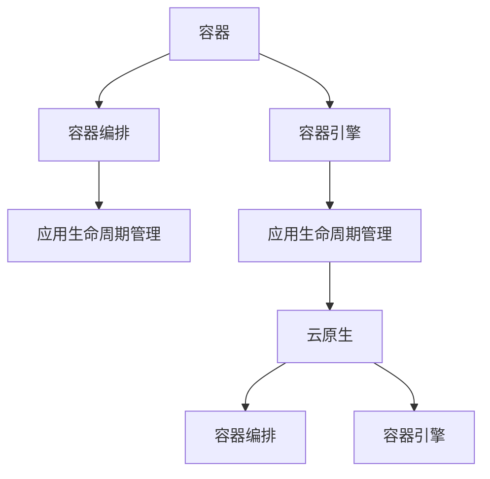

                 

# 容器 原理与代码实例讲解

> 关键词：容器化, 容器引擎, 容器编排, 应用生命周期管理, Docker, Kubernetes, 云原生, 容器化生产环境部署

## 1. 背景介绍

### 1.1 问题由来
容器技术在软件工程中扮演了越来越重要的角色。它通过提供一种轻量级、可移植的运行时环境，使应用程序的构建、部署、扩展和监控更加高效、灵活。然而，容器技术背后所蕴含的原理和实践细节，对于初学者和资深开发者来说，往往存在着不小的挑战。

### 1.2 问题核心关键点
本文将详细讲解容器的核心概念和关键技术，并通过具体的代码实例，帮助读者深入理解容器技术的工作原理和实际应用。我们将从以下几个方面展开：

- **容器化基础**：介绍容器技术的起源、核心优势和基本工作原理。
- **容器引擎详解**：深入探讨Docker、rkt、lxc等容器引擎的实现原理和设计思想。
- **容器编排工具**：介绍Kubernetes、Nomad、Terraform等容器编排工具的设计理念和操作实践。
- **应用生命周期管理**：阐述容器技术在应用生命周期管理中的具体应用场景和最佳实践。
- **云原生与容器化**：探讨云原生应用和容器化部署在云环境中的挑战和解决方案。

这些章节将全面覆盖容器技术的各个方面，既有原理性的讲解，又有实践中的代码实例，旨在让读者能够全面掌握容器技术，并能够在实际应用中灵活运用。

## 2. 核心概念与联系

### 2.1 核心概念概述

为了更好地理解容器技术，本节将介绍几个核心的概念：

- **容器**：容器是一种轻量级的运行环境，它将应用程序及其依赖打包在一个隔离的、可移植的沙盒中，确保应用程序在任意环境中都能稳定运行。
- **容器引擎**：容器引擎负责创建、管理容器实例，提供容器与宿主机之间的接口和通信机制。
- **容器编排**：容器编排工具用于自动化容器的部署、管理、扩缩容等操作，优化容器的生命周期管理。
- **应用生命周期管理**：应用的生命周期管理是容器技术的重要应用领域，包括应用的构建、部署、运行、扩展、回收等环节。
- **云原生**：云原生是指一组技术和思想，用于构建、部署和管理容器化应用，支持服务的弹性扩展、持续交付、自动发现、自我修复等特性。

这些核心概念之间的关系可以通过以下Mermaid流程图来展示：



这个流程图展示了容器技术的核心组成部分及其相互关系：

1. 容器通过容器引擎创建并运行。
2. 容器编排工具管理容器的生命周期，支持自动部署和扩展。
3. 应用的生命周期管理覆盖从构建到回收的全过程。
4. 云原生应用和容器编排工具密切相关，共同实现高可用、弹性扩展等特性。

## 3. 核心算法原理 & 具体操作步骤
### 3.1 算法原理概述

容器技术的核心原理在于将应用程序及其依赖打包在一个隔离的、可移植的环境中，确保应用程序在任意环境中都能稳定运行。这种隔离是通过操作系统级别的沙箱机制实现的，每个容器之间相互独立，共享宿主机的内核资源，但各自有独立的进程空间、文件系统、网络空间等。

形式化地，假设应用程序及其依赖的打包文件为$\textit{app}$，容器引擎为$\textit{engine}$，宿主机为$\textit{host}$，容器为$\textit{container}$。则容器的创建过程可以表示为：

$$
\textit{container} = \textit{engine}(\textit{app}, \textit{host})
$$

其中$\textit{engine}$是容器引擎的实现，$\textit{app}$是应用程序及其依赖，$\textit{host}$是宿主机。容器引擎根据应用程序的描述文件和宿主机的资源状况，创建一个隔离的容器实例。

### 3.2 算法步骤详解

容器化的核心步骤包括创建、启动、管理、销毁等环节。以Docker为例，其典型的容器化流程如下：

1. **创建容器**：在宿主机上使用`docker run`命令创建容器实例。该命令的语法为：
```
docker run <image_id> <command>
```
其中`<image_id>`是Docker镜像的ID或标签，`<command>`是容器的启动命令。

2. **启动容器**：Docker将容器镜像解压缩到宿主机，并启动容器的进程。容器进程通过与宿主机的内核资源进行交互，实现应用程序的运行。

3. **管理容器**：Docker提供了一系列管理容器生命周期的命令，如`docker start`、`docker stop`、`docker kill`、`docker restart`等。

4. **销毁容器**：使用`docker rm`命令可以删除容器实例。该命令的语法为：
```
docker rm <container_id>
```
其中`<container_id>`是容器的ID。

### 3.3 算法优缺点

容器技术的优点包括：

- **轻量级**：容器只包含应用程序及其依赖，体积小巧，启动速度快。
- **隔离性**：每个容器之间相互隔离，避免应用程序之间的干扰。
- **可移植性**：容器可以跨平台运行，确保应用程序在任意环境中都能稳定运行。
- **自动化管理**：容器编排工具能够自动化容器的部署、扩展和管理，优化资源利用率。

容器技术的不足之处包括：

- **资源占用**：容器在创建和运行时会占用一定量的宿主机资源，可能影响性能。
- **网络管理复杂**：容器之间的网络通信需要额外的配置和管理。
- **数据持久化**：容器的数据存储和持久化需要额外的解决方案，如共享卷、绑定挂载等。

### 3.4 算法应用领域

容器技术广泛应用于软件开发、云计算、数据科学、大数据处理等领域，具体包括：

- **软件开发**：容器技术可以方便地构建、部署和扩展软件开发环境，支持敏捷开发和持续集成。
- **云计算**：容器技术可以支持云原生应用的自动化部署和扩展，优化云资源利用率。
- **数据科学**：容器技术可以方便地构建和运行大数据处理、机器学习等应用，支持数据科学家的快速开发和实验。
- **大数据处理**：容器技术可以支持大数据处理的分布式部署和扩展，优化数据处理性能。

## 4. 数学模型和公式 & 详细讲解 & 举例说明

### 4.1 数学模型构建

容器技术的数学模型可以从以下几个方面进行构建：

1. **容器隔离模型**：每个容器是一个独立的沙盒环境，包括进程空间、文件系统、网络空间等。可以用一个二元组$(P,N)$表示容器的隔离状态，其中$P$表示进程空间，$N$表示网络空间。

2. **容器调度模型**：容器引擎负责将应用程序的容器调度到宿主机的物理资源上。可以用一个二元组$(H,R)$表示容器的调度状态，其中$H$表示宿主机的物理资源，$R$表示容器的资源需求。

3. **容器编排模型**：容器编排工具负责容器的自动化部署和管理。可以用一个二元组$(O,P)$表示容器的编排状态，其中$O$表示编排策略，$P$表示容器的生命周期状态。

### 4.2 公式推导过程

假设有一个容器实例$\textit{container}$，其资源需求为$R=\{CPU, Memory\}$。容器引擎根据宿主机的物理资源$H=\{CPU, Memory\}$和容器的资源需求$R$，创建一个隔离的容器实例。假设宿主机的物理资源为$H_0=\{CPU_0, Memory_0\}$，容器的资源需求为$R_0=\{CPU_0, Memory_0\}$，则容器的创建过程可以表示为：

$$
\textit{container} = \textit{engine}(H_0, R_0)
$$

其中$\textit{engine}$是容器引擎的实现。

### 4.3 案例分析与讲解

假设我们有一个Web应用，需要部署到多个服务器上。首先，我们将Web应用的代码和依赖打包到一个Docker镜像中，然后使用Docker容器引擎在每台服务器上创建容器实例。具体步骤如下：

1. 创建Docker镜像：
```
docker build -t web-app .
```

2. 在服务器上创建容器实例：
```
docker run -d -p 80:80 web-app
```

3. 在容器中启动Web应用：
```
cd /app
nohup python app.py &
```

通过上述步骤，我们可以方便地在多台服务器上部署和运行Web应用，确保应用程序在任意环境中都能稳定运行。

## 5. 项目实践：代码实例和详细解释说明
### 5.1 开发环境搭建

在进行容器实践前，我们需要准备好开发环境。以下是使用Docker进行容器开发的配置流程：

1. 安装Docker：从官网下载并安装Docker，创建Docker用户。

2. 配置Docker主机：确保Docker在宿主机上正常运行，可以使用以下命令进行测试：
```
docker run hello-world
```

3. 配置Docker容器网络：使用`docker network create`命令创建Docker容器网络，确保容器之间可以互相通信。

### 5.2 源代码详细实现

下面以一个简单的Web应用为例，演示如何使用Docker进行容器开发。

首先，创建一个名为`app`的Docker镜像：

```dockerfile
# 从Python 3.7官方镜像开始
FROM python:3.7-slim

# 安装依赖
RUN apt-get update && apt-get install -y --no-install-recommends \
        libpq-dev \
        unzip \
        curl \
        git \
        jq \
        && apt-get clean

# 设置环境变量
ENV PYTHONDONTWRITEBYTECODE 1
ENV PYTHONUNBUFFERED 1

# 安装Python依赖
COPY requirements.txt /
RUN pip install --no-cache-dir -r requirements.txt

# 安装应用代码
COPY . /app

# 暴露端口
EXPOSE 80

# 启动应用
CMD ["gunicorn", "-b", ":80", "app:app"]
```

然后，使用Docker构建镜像：

```bash
docker build -t web-app .
```

接着，启动Docker容器：

```bash
docker run -d -p 80:80 web-app
```

最后，在浏览器中访问容器的80端口，即可看到Web应用的运行结果。

### 5.3 代码解读与分析

在上述代码中，我们通过Dockerfile定义了Web应用的容器镜像。其中包含了Python 3.7官方镜像、应用依赖、应用代码、环境变量和启动命令等关键信息。Dockerfile的每一步操作都是通过镜像层来实现的，确保了镜像的稳定性和可移植性。

此外，我们还使用了`docker run`命令启动Docker容器，并在启动时绑定了容器的80端口到宿主机的80端口。这样，我们就可以在浏览器中访问容器的80端口，看到Web应用的运行结果。

## 6. 实际应用场景
### 6.1 容器编排

容器编排工具可以自动化容器的部署、管理、扩展和监控，提高容器管理的效率和可靠性。以Kubernetes为例，其核心组件包括：

- **Master**：负责容器的调度和管理，包括任务调度、资源调度、负载均衡等。
- **Node**：负责容器的运行，包括容器的启动、运行、管理、销毁等。

Kubernetes通过Pod、Service、Deployment等概念，对容器进行管理。Pod是容器的基本单位，包含一组相关的容器；Service是Pod的抽象，用于实现容器之间的负载均衡和通信；Deployment用于管理Pod的生命周期，支持自动扩展和滚动更新。

### 6.2 应用生命周期管理

容器技术在应用的生命周期管理中具有重要应用。通过使用容器编排工具，可以自动化应用的构建、部署、运行、扩展和回收等环节。以Kubernetes为例，其应用生命周期管理的核心流程包括：

1. **构建**：将应用程序及其依赖打包到Docker镜像中。
2. **部署**：将Docker镜像部署到Kubernetes集群中，创建Pod实例。
3. **运行**：Pod实例在Kubernetes集群中运行，实现应用的持续可用。
4. **扩展**：根据应用负载动态扩展Pod实例，确保应用的高可用性和扩展性。
5. **回收**：根据应用的资源使用情况，自动回收不必要的Pod实例，优化资源利用率。

通过容器编排工具，可以大大简化应用的生命周期管理，提高应用的可靠性和可扩展性。

### 6.3 云原生与容器化

云原生是构建、部署和管理容器化应用的思想和技术体系，支持服务的弹性扩展、持续交付、自动发现、自我修复等特性。云原生与容器化的主要区别在于，云原生应用更加关注应用的运行环境和生态系统，支持云平台提供的各种服务和资源，实现应用的自动化部署和扩展。

云原生应用的典型代表包括Kubernetes、Prometheus、Jaeger等。通过使用云原生技术，可以实现应用的弹性扩展、自动恢复、自我诊断等特性，优化应用的性能和可靠性。

## 7. 工具和资源推荐
### 7.1 学习资源推荐

为了帮助开发者深入理解容器技术的原理和实践，这里推荐一些优质的学习资源：

1. **《Docker官方文档》**：Docker官方提供的详细文档，涵盖容器的创建、启动、管理、扩展等各个方面。

2. **《Kubernetes官方文档》**：Kubernetes官方提供的详细文档，涵盖容器编排、部署、管理等各个方面。

3. **《Cloud Native Computing Foundation官方文档》**：云原生计算基金会提供的详细文档，涵盖云原生应用、容器编排、微服务架构等各个方面。

4. **《容器设计与实践》**：由Docker的创始人之一David Skinner所著，全面介绍容器技术的原理、实践和应用场景。

5. **《Docker实战》**：由腾讯云大前端开发工程师林晓峰所著，通过实际案例介绍Docker的创建、管理、扩展等各个方面。

通过对这些资源的学习实践，相信你一定能够全面掌握容器技术，并能够在实际应用中灵活运用。

### 7.2 开发工具推荐

高效的开发离不开优秀的工具支持。以下是几款用于容器开发的工具：

1. **Docker**：Docker是容器技术的核心工具，提供容器创建、启动、管理、扩展等各个方面的功能。

2. **Kubernetes**：Kubernetes是容器编排工具的代表，提供容器编排、部署、管理、扩展等各个方面的功能。

3. **Prometheus**：Prometheus是云原生应用的核心组件，提供应用的监控、告警、日志等功能。

4. **Jaeger**：Jaeger是云原生应用的另一个核心组件，提供应用的诊断、跟踪、性能分析等功能。

5. **Terraform**：Terraform是云原生应用的自动化部署工具，支持云平台的各种服务和资源。

合理利用这些工具，可以显著提升容器开发和管理的效率，加快应用的生命周期管理。

### 7.3 相关论文推荐

容器技术的发展离不开学界的持续研究。以下是几篇奠基性的相关论文，推荐阅读：

1. **《Container: A Flexible Framework for Process Separation》**：文中提出容器的概念，并介绍了容器的基本工作原理。

2. **《Container Image: The Container's ABI》**：文中介绍容器镜像的ABI（Application Binary Interface）标准，确保容器镜像的可移植性和一致性。

3. **《Docker: The Future of Computing in the Cloud》**：Docker创始人之一Docker Cloud的创始人Docker CAP的演讲，全面介绍Docker技术的原理和应用场景。

4. **《Kubernetes: A Platform for Automating the Deployment of Containerized Applications》**：Kubernetes的创建者Brendan Burns的论文，介绍Kubernetes的核心组件和工作原理。

5. **《Cloud-Native Development: The Phased Evolution of a Development Model》**：Cloud Native Computing Foundation（CNCF）的报告，介绍云原生应用的发展历程和应用场景。

这些论文代表了大规模容器技术的核心思想和前沿实践，通过学习这些文献，可以帮助你全面理解容器技术的原理和应用。

## 8. 总结：未来发展趋势与挑战

### 8.1 总结

本文对容器的核心概念和关键技术进行了全面系统的介绍。通过详细讲解容器的创建、启动、管理、扩展等各个环节，并结合具体的代码实例，帮助读者深入理解容器的原理和实践。容器技术通过提供轻量级、隔离的运行环境，大大简化了应用的部署和管理，成为现代软件开发的重要工具。

### 8.2 未来发展趋势

展望未来，容器技术的持续演进将引领软件工程和云计算的发展。以下是几个未来的发展趋势：

1. **云原生应用的普及**：云原生应用和容器编排技术将不断成熟，支持服务的弹性扩展、持续交付、自动发现、自我修复等特性，提升应用的性能和可靠性。

2. **多云环境的集成**：容器技术将更好地支持多云环境的集成，支持应用的跨云部署和管理。

3. **微服务架构的普及**：微服务架构将成为应用设计的主流，通过容器技术实现服务的快速构建、部署和扩展。

4. **容器生态系统的完善**：容器生态系统将不断完善，支持更多的容器编排工具、监控工具、日志工具等，实现应用的全面管理。

5. **DevOps的普及**：DevOps文化将不断普及，支持持续集成、持续交付、持续监控等实践，提升应用的生命周期管理效率。

这些趋势将推动容器技术在软件开发、云计算、大数据处理等领域的应用，提升应用的性能、可靠性和可扩展性。

### 8.3 面临的挑战

尽管容器技术已经取得了广泛应用，但在实际部署和运维过程中，仍面临诸多挑战：

1. **资源管理和优化**：容器在创建和运行时会占用一定量的宿主机资源，需要有效的资源管理和优化，确保应用的高可用性和扩展性。

2. **网络管理和隔离**：容器之间的网络通信需要额外的配置和管理，需要解决网络隔离和通信的问题。

3. **数据持久化和共享**：容器的数据存储和持久化需要额外的解决方案，如共享卷、绑定挂载等。

4. **多平台兼容性**：容器在不同的平台和环境中需要保持一致性，确保应用的跨平台可移植性。

5. **安全性**：容器的安全性问题需要关注，避免容器之间的攻击和数据泄露。

6. **自动化部署和管理**：容器的自动化部署和管理需要进一步优化，确保应用的生命周期管理效率和可靠性。

### 8.4 研究展望

未来的研究需要在以下几个方面寻求新的突破：

1. **资源管理和优化**：开发更高效的资源管理策略，如资源自动调度、资源自动扩缩容等。

2. **网络管理和隔离**：开发更高效的网络管理和隔离策略，如CNI插件、网络策略等。

3. **数据持久化和共享**：开发更高效的数据持久化和共享策略，如状态驱动的卷管理、多卷复制等。

4. **多平台兼容性**：开发更高效的多平台兼容性解决方案，如跨平台容器编排、跨平台容器运行时等。

5. **安全性**：开发更高效的安全性解决方案，如安全容器、网络隔离、安全存储等。

6. **自动化部署和管理**：开发更高效的自动化部署和管理工具，如Terraform、Helm等。

这些研究方向的探索，将推动容器技术的不断演进，为应用的生命周期管理提供更高效、更可靠的解决方案。

## 9. 附录：常见问题与解答

**Q1：容器化的优势和劣势有哪些？**

A: 容器化的优势包括：

- **轻量级**：容器只包含应用程序及其依赖，体积小巧，启动速度快。
- **隔离性**：每个容器之间相互隔离，避免应用程序之间的干扰。
- **可移植性**：容器可以跨平台运行，确保应用程序在任意环境中都能稳定运行。

容器化的劣势包括：

- **资源占用**：容器在创建和运行时会占用一定量的宿主机资源，可能影响性能。
- **网络管理复杂**：容器之间的网络通信需要额外的配置和管理。
- **数据持久化**：容器的数据存储和持久化需要额外的解决方案，如共享卷、绑定挂载等。

**Q2：如何处理容器之间的网络通信？**

A: 容器之间的网络通信可以通过以下方式处理：

- **Docker网络**：Docker提供了一种轻量级的容器网络解决方案，可以通过`docker network create`命令创建Docker网络，确保容器之间可以互相通信。
- **Bridge网络**：桥接网络是一种常用的容器网络解决方案，通过桥接网络，容器与宿主机共享同一个网络空间，实现容器之间的通信。
- **Overlay网络**：Overlay网络是一种更复杂的网络解决方案，通过在容器之间构建虚拟网络，实现容器之间的通信。

**Q3：如何进行容器的自动化部署和管理？**

A: 容器的自动化部署和管理可以使用容器编排工具，如Kubernetes。通过使用Kubernetes，可以实现容器的自动化部署、扩展、管理、监控等操作，优化容器的生命周期管理。

**Q4：如何优化容器编排工具的资源管理？**

A: 容器编排工具的资源管理可以通过以下方式优化：

- **资源自动调度**：通过Kubernetes的资源自动调度功能，可以实现容器的自动部署和扩展。
- **资源自动扩缩容**：通过Kubernetes的资源自动扩缩容功能，可以实现容器的自动扩展和收缩。
- **资源自动监控**：通过Kubernetes的资源自动监控功能，可以实现容器的资源使用情况监控。

**Q5：如何提高容器编排工具的网络管理性能？**

A: 容器编排工具的网络管理可以通过以下方式优化：

- **CNI插件**：使用CNI插件，可以实现容器之间的网络隔离和通信。
- **网络策略**：通过网络策略，可以实现容器之间的网络访问控制和限制。
- **负载均衡**：通过负载均衡，可以实现容器之间的负载均衡和负载分摊。

通过优化容器编排工具的资源管理和网络管理性能，可以进一步提升容器的生命周期管理效率和可靠性。

---

作者：禅与计算机程序设计艺术 / Zen and the Art of Computer Programming

