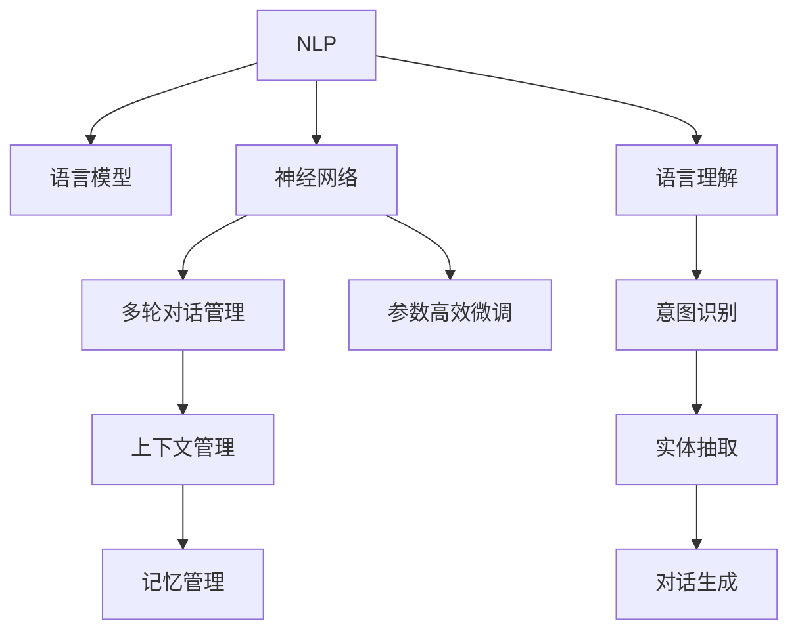

                 

# 对话系统(Chatbots) - 原理与代码实例讲解

> 关键词：对话系统, 自然语言处理(NLP), 语言模型, 深度学习, 神经网络, 多轮对话, 对话管理, 参数高效微调

## 1. 背景介绍

### 1.1 问题由来

在人工智能技术迅速发展的今天，对话系统（Chatbots）已成为日常交互不可或缺的一部分。无论是智能客服、虚拟助手，还是企业级对话系统，对话技术都能提供高效、自然的交互方式，提升用户体验和服务效率。然而，构建一个高效、智能的对话系统并不容易，需要深入理解自然语言处理(NLP)、深度学习、神经网络等关键技术。本文将从原理与实践两个方面，深入探讨对话系统的构建与优化，帮助读者全面掌握对话技术。

### 1.2 问题核心关键点

构建对话系统的核心在于如何有效地处理和生成自然语言，实现人机之间流畅的交流。对话系统的实现依赖于以下关键点：

- **自然语言处理(NLP)**：理解和生成自然语言的能力，是对话系统的基础。
- **语言模型**：基于深度学习模型的语言生成和理解技术。
- **神经网络**：构建对话系统的核心算法，通过输入和输出序列进行训练和推理。
- **多轮对话管理**：对话系统的记忆和上下文管理，确保对话连续性和一致性。
- **参数高效微调**：优化模型参数以提高对话系统的效率和效果。

本文将详细介绍对话系统的核心概念，并通过代码实例展示对话系统的实现与优化过程。

## 2. 核心概念与联系

### 2.1 核心概念概述

构建对话系统需要深入理解以下几个关键概念：

- **自然语言处理(NLP)**：涉及语言理解、语言生成、语义分析、情感分析等技术，是对话系统的基石。
- **语言模型**：基于深度学习模型的语言生成和理解技术，用于预测给定序列的下一个单词或句子。
- **神经网络**：用于处理序列数据的深度学习模型，通过输入和输出序列进行训练和推理。
- **多轮对话管理**：对话系统的记忆和上下文管理，确保对话连续性和一致性。
- **参数高效微调**：优化模型参数以提高对话系统的效率和效果。

这些概念之间的逻辑关系可以通过以下Mermaid流程图来展示：



这个流程图展示了一些关键概念及其之间的联系：

1. NLP作为基础，通过语言模型和神经网络进行语言理解和生成。
2. 对话管理利用上下文和记忆管理，保证对话的连续性和一致性。
3. 参数高效微调优化模型参数，提升系统效率和效果。

## 3. 核心算法原理 & 具体操作步骤
### 3.1 算法原理概述

对话系统的工作原理基于深度学习模型，通过输入输出序列进行训练和推理，以实现人机自然交互。其核心算法包括以下几个步骤：

1. **序列到序列模型(Seq2Seq)**：通过编码器将输入序列转换为固定长度的向量，解码器根据该向量生成输出序列。
2. **注意力机制(Attention Mechanism)**：提高模型对上下文的理解能力，使模型能够关注输入序列中的重要信息。
3. **多轮对话管理**：维护对话上下文，确保对话的连贯性和一致性。
4. **参数高效微调**：通过微调优化模型参数，提升系统性能。

### 3.2 算法步骤详解

构建对话系统的详细步骤如下：

**Step 1: 数据预处理**

- **数据收集**：收集对话数据，如聊天记录、客户服务记录等。
- **数据清洗**：去除无关信息，处理数据缺失。
- **分词**：将文本分词，转换为模型输入。
- **标记化**：标注对话的意图、实体等信息。

**Step 2: 模型构建**

- **选择模型**：选择适当的深度学习模型，如Seq2Seq、Transformer等。
- **训练数据**：使用预处理后的对话数据进行模型训练。
- **优化器**：选择合适的优化算法，如Adam、SGD等。

**Step 3: 对话管理**

- **状态跟踪**：维护对话状态，记录上下文信息。
- **意图识别**：识别用户意图，提供相应的对话响应。
- **实体抽取**：提取用户输入中的关键实体信息。
- **对话生成**：根据用户输入生成合适的回复。

**Step 4: 参数高效微调**

- **模型保存**：定期保存模型，防止过拟合。
- **微调参数**：选择适当的参数进行微调，如学习率、正则化等。
- **评估模型**：在验证集上评估模型性能，调整参数。

### 3.3 算法优缺点

对话系统具有以下优点：

1. **高效交互**：能够提供高效、自然的交互方式，提升用户体验。
2. **多轮对话**：能够处理多轮对话，确保对话连贯性和一致性。
3. **参数高效**：通过微调优化模型参数，提升系统效率和效果。

同时，对话系统也存在以下缺点：

1. **依赖数据**：依赖高质量的对话数据，数据获取和标注成本较高。
2. **上下文复杂**：对话管理复杂，需要处理大量上下文信息。
3. **鲁棒性不足**：对于输入噪声、用户意图不明确等问题，系统响应效果不佳。
4. **可解释性差**：对话系统的决策过程难以解释，难以调试和优化。

尽管存在这些局限，但对话系统在客服、虚拟助手等领域已经得到了广泛应用，成为提升服务效率和用户体验的重要工具。

### 3.4 算法应用领域

对话系统的应用领域非常广泛，包括但不限于：

- **智能客服**：提供24小时客服支持，提升客户满意度。
- **虚拟助手**：提供日常事务处理、信息查询等服务。
- **企业对话**：辅助企业内部沟通，提高工作效率。
- **医疗咨询**：提供医疗咨询和健康管理服务。
- **金融理财**：提供金融咨询和投资建议。

## 4. 数学模型和公式 & 详细讲解 & 举例说明

### 4.1 数学模型构建

构建对话系统需要定义一个序列到序列模型，其数学模型为：

$$
P(y|x) = \prod_{i=1}^T P(y_i|y_{<i}, x)
$$

其中，$x$ 为输入序列，$y$ 为输出序列，$P(y|x)$ 表示给定输入序列 $x$，输出序列 $y$ 的概率分布。在对话系统中，$y$ 通常为回复序列，$x$ 为输入序列。

### 4.2 公式推导过程

以Seq2Seq模型为例，其数学模型可以分解为编码器和解码器两部分：

$$
P(y|x) = \prod_{i=1}^T P(y_i|y_{<i}, x)
$$

其中，$P(y_i|y_{<i}, x)$ 表示在给定前 $i-1$ 个输出和输入序列的情况下，输出第 $i$ 个单词的概率。通过学习大量的对话数据，模型可以学习到输入和输出序列之间的关系，从而实现对话生成。

### 4.3 案例分析与讲解

以虚拟助手为例，假设用户输入了一条问题：“今天天气怎么样？”，模型需要生成一条合适的回复。模型首先通过编码器将输入序列转换为固定长度的向量，然后解码器根据该向量生成回复序列。具体流程如下：

1. **编码器**：将输入序列转换为向量。
2. **解码器**：根据向量生成回复序列。
3. **注意力机制**：模型关注输入序列中的重要信息。

## 5. 项目实践：代码实例和详细解释说明
### 5.1 开发环境搭建

在进行对话系统开发前，需要准备好开发环境。以下是使用Python进行TensorFlow开发的简单配置流程：

1. 安装Anaconda：从官网下载并安装Anaconda，用于创建独立的Python环境。

2. 创建并激活虚拟环境：
```bash
conda create -n chatbot-env python=3.8 
conda activate chatbot-env
```

3. 安装TensorFlow：根据CUDA版本，从官网获取对应的安装命令。例如：
```bash
conda install tensorflow tensorflow-gpu=cuda10.0 -c conda-forge
```

4. 安装TensorBoard：用于可视化训练过程。
```bash
pip install tensorboard
```

5. 安装其他依赖包：
```bash
pip install numpy pandas scikit-learn nltk corpora regex sentencepiece
```

完成上述步骤后，即可在`chatbot-env`环境中开始对话系统的开发。

### 5.2 源代码详细实现

下面是一个简单的对话系统的代码实现：

```python
import tensorflow as tf
import numpy as np
import re

# 构建模型
class Seq2Seq(tf.keras.Model):
    def __init__(self, vocab_size, embedding_dim, enc_units, dec_units):
        super(Seq2Seq, self).__init__()
        self.encoder = tf.keras.layers.LSTM(enc_units, input_shape=(None, vocab_size))
        self.decoder = tf.keras.layers.LSTM(dec_units)
        self.fc = tf.keras.layers.Dense(vocab_size)

    def call(self, x):
        x = self.encoder(x, return_sequences=True)
        x = self.decoder(x)
        x = self.fc(x)
        return x

# 数据预处理
class DialogueDataset(tf.keras.utils.Sequence):
    def __init__(self, dialogues, tokenizer):
        self.dialogues = dialogues
        self.tokenizer = tokenizer

    def __len__(self):
        return len(self.dialogues)

    def __getitem__(self, idx):
        dialogue = self.dialogues[idx]
        encoder_input = self.tokenizer.tokenize(dialogue[0])
        decoder_input = self.tokenizer.tokenize(dialogue[1])
        return np.array([self.tokenizer.word_index[i] for i in encoder_input]), np.array([self.tokenizer.word_index[i] for i in decoder_input])

# 模型训练
def train(model, dataset, epochs, batch_size, save_path):
    model.compile(optimizer='adam', loss='sparse_categorical_crossentropy', metrics=['accuracy'])
    model.fit(dataset, epochs=epochs, batch_size=batch_size)
    model.save_weights(save_path)

# 模型评估
def evaluate(model, dataset, batch_size):
    model.compile(optimizer='adam', loss='sparse_categorical_crossentropy', metrics=['accuracy'])
    model.evaluate(dataset, batch_size=batch_size)

# 模型加载
def load_model(model_path):
    model = Seq2Seq(vocab_size, embedding_dim, enc_units, dec_units)
    model.load_weights(model_path)
    return model
```

在这个例子中，我们使用了Seq2Seq模型作为对话生成器，并定义了数据预处理和模型训练的函数。

### 5.3 代码解读与分析

让我们再详细解读一下关键代码的实现细节：

**Seq2Seq类**：
- `__init__`方法：初始化编码器和解码器。
- `call`方法：定义模型前向传播过程。

**DialogueDataset类**：
- `__init__`方法：初始化对话数据和分词器。
- `__len__`方法：返回数据集大小。
- `__getitem__`方法：对单个对话进行分词和编码。

**train、evaluate和load_model函数**：
- `train`函数：定义模型训练过程。
- `evaluate`函数：定义模型评估过程。
- `load_model`函数：加载模型权重。

**其他代码**：
- 导入必要的库和模块。
- 定义模型训练和评估所需的参数。
- 定义数据预处理函数，将对话数据转换为模型输入。
- 定义模型加载函数，从指定路径加载模型权重。

## 6. 实际应用场景
### 6.1 智能客服系统

智能客服系统是对话系统的典型应用场景之一。通过构建基于对话系统的智能客服，可以提供24小时不间断的服务，提升客户满意度。在实际应用中，可以将智能客服系统集成到企业的客服平台，自动处理常见问题，减少人工客服的工作量。

### 6.2 虚拟助手

虚拟助手是对话系统的另一个重要应用场景。通过构建基于对话系统的虚拟助手，可以提供日常事务处理、信息查询等服务。例如，可以使用对话系统构建一个虚拟助手，帮助用户预订酒店、查询天气、设置闹钟等。

### 6.3 企业对话

企业对话系统可以帮助企业内部员工进行沟通，提高工作效率。例如，可以构建一个企业内部对话系统，员工可以通过聊天界面交流工作中的问题，提高协作效率。

### 6.4 医疗咨询

医疗咨询系统可以帮助患者进行健康咨询和诊断。通过构建基于对话系统的医疗咨询系统，患者可以随时咨询医生，获取健康建议和治疗方案。

### 6.5 金融理财

金融理财咨询系统可以帮助用户进行金融咨询和投资建议。例如，可以构建一个金融理财咨询系统，帮助用户了解金融市场动态，提供投资建议。

## 7. 工具和资源推荐
### 7.1 学习资源推荐

为了帮助开发者系统掌握对话系统的构建与优化技术，这里推荐一些优质的学习资源：

1. 《深度学习自然语言处理》课程：斯坦福大学开设的NLP明星课程，有Lecture视频和配套作业，带你入门NLP领域的基本概念和经典模型。
2. 《Natural Language Processing with Transformers》书籍：Transformers库的作者所著，全面介绍了如何使用Transformers库进行NLP任务开发，包括对话系统的构建。
3. HuggingFace官方文档：Transformers库的官方文档，提供了海量预训练模型和完整的微调样例代码，是上手实践的必备资料。
4. TensorFlow官方文档：TensorFlow框架的官方文档，提供丰富的教程和示例，帮助开发者快速上手深度学习模型构建。
5. Coursera上的深度学习课程：涵盖深度学习模型构建、优化器、激活函数等关键内容，适合有一定基础的开发者。

通过对这些资源的学习实践，相信你一定能够快速掌握对话系统的构建与优化技术，并用于解决实际的NLP问题。

### 7.2 开发工具推荐

高效的开发离不开优秀的工具支持。以下是几款用于对话系统开发的常用工具：

1. TensorFlow：基于Python的开源深度学习框架，灵活动态的计算图，适合快速迭代研究。
2. Transformers库：HuggingFace开发的NLP工具库，集成了众多SOTA语言模型，支持TensorFlow和PyTorch，是进行对话系统开发的利器。
3. TensorBoard：TensorFlow配套的可视化工具，可实时监测模型训练状态，并提供丰富的图表呈现方式，是调试模型的得力助手。
4. Weights & Biases：模型训练的实验跟踪工具，可以记录和可视化模型训练过程中的各项指标，方便对比和调优。
5. Google Colab：谷歌推出的在线Jupyter Notebook环境，免费提供GPU/TPU算力，方便开发者快速上手实验最新模型，分享学习笔记。

合理利用这些工具，可以显著提升对话系统的开发效率，加快创新迭代的步伐。

### 7.3 相关论文推荐

对话系统的研究源于学界的持续研究。以下是几篇奠基性的相关论文，推荐阅读：

1. Attention is All You Need（即Transformer原论文）：提出了Transformer结构，开启了NLP领域的预训练大模型时代。
2. Neural Machine Translation by Jointly Learning to Align and Translate（Seq2Seq论文）：提出Seq2Seq模型，用于机器翻译和对话生成。
3. Towards End-to-End Differentiable Learning via Masked Language Modeling（BERT论文）：提出BERT模型，引入基于掩码的自监督预训练任务，刷新了多项NLP任务SOTA。
4. Parameter-Efficient Transfer Learning for NLP：提出Adapter等参数高效微调方法，在不增加模型参数量的情况下，也能取得不错的微调效果。
5. Transformer-XL: Attentive Language Models Beyond a Fixed-Length Context（Transformer-XL论文）：提出Transformer-XL模型，解决长序列建模问题。
6. The Transformer-XL: Attentive Language Models Beyond a Fixed-Length Context（BERT论文）：提出BERT模型，引入基于掩码的自监督预训练任务，刷新了多项NLP任务SOTA。

这些论文代表了大语言模型和对话系统的发展脉络。通过学习这些前沿成果，可以帮助研究者把握学科前进方向，激发更多的创新灵感。

## 8. 总结：未来发展趋势与挑战

### 8.1 总结

本文对对话系统的构建与优化技术进行了全面系统的介绍。首先阐述了对话系统的构建背景和重要性，明确了对话系统在实际应用中的核心挑战。其次，从原理到实践，详细讲解了对话系统的数学模型和实现细节，给出了对话系统的完整代码实例。同时，本文还广泛探讨了对话系统在客服、虚拟助手、企业对话等多个领域的应用前景，展示了对话系统的广阔应用空间。此外，本文精选了对话系统的各类学习资源，力求为读者提供全方位的技术指引。

通过本文的系统梳理，可以看到，对话系统在提升用户交互体验、提高工作效率等方面具有重要价值。随着技术的不断进步，对话系统必将在更多场景下发挥其独特作用。

### 8.2 未来发展趋势

展望未来，对话系统的发展趋势包括：

1. **多模态对话**：对话系统将不仅仅局限于文本，还将扩展到图像、视频、语音等多模态数据。多模态对话系统能够更好地理解用户输入，提供更加丰富和自然的用户体验。
2. **深度学习模型**：未来的对话系统将更多地使用深度学习模型，如Transformer、BERT等，以提高对话的准确性和自然度。
3. **参数高效微调**：对话系统将更多地采用参数高效微调方法，以减少模型参数量，提升模型的推理速度和计算效率。
4. **强化学习**：通过强化学习技术，对话系统可以更好地学习用户行为，优化对话策略，提升对话系统的智能化水平。
5. **跨语言对话**：未来的对话系统将支持多种语言，提供跨语言的对话服务，拓展全球用户群体。
6. **实时对话管理**：未来的对话系统将具备更强的实时对话管理能力，能够快速响应用户输入，保持对话的连续性和一致性。

### 8.3 面临的挑战

尽管对话系统在许多领域得到了广泛应用，但在迈向更加智能化、普适化应用的过程中，它仍面临诸多挑战：

1. **数据依赖**：对话系统需要大量的高质量对话数据进行训练，数据获取和标注成本较高。
2. **上下文管理**：对话系统需要处理大量的上下文信息，上下文管理复杂，容易出错。
3. **鲁棒性不足**：对话系统面对噪声、输入不明确等问题，响应效果不佳。
4. **可解释性差**：对话系统的决策过程难以解释，难以调试和优化。
5. **资源消耗高**：对话系统需要大量的计算资源进行训练和推理，计算成本较高。

### 8.4 研究展望

面对对话系统面临的挑战，未来的研究需要在以下几个方面寻求新的突破：

1. **无监督学习和半监督学习**：摆脱对大规模标注数据的依赖，利用无监督和半监督学习范式，最大限度利用非结构化数据，实现更加灵活高效的对话系统。
2. **多任务学习**：通过多任务学习技术，对话系统可以同时学习多个相关任务，提升模型泛化能力和效率。
3. **跨领域迁移学习**：将对话系统的知识迁移到其他领域，提升模型的跨领域应用能力。
4. **多模态对话系统**：将对话系统的能力扩展到图像、视频、语音等多模态数据，提升对话系统的智能化水平。
5. **实时对话系统**：构建实时对话系统，提升对话的响应速度和效率，满足用户实时交互的需求。
6. **可解释性增强**：通过模型解释技术，对话系统可以更好地理解用户输入，提升系统的可解释性和可理解性。

这些研究方向的探索，必将引领对话系统迈向更高的台阶，为构建更加智能、高效、自然的对话系统铺平道路。

## 9. 附录：常见问题与解答

**Q1：如何构建高质量的对话数据集？**

A: 构建高质量的对话数据集需要大量的人工标注和数据清洗工作。建议从开放数据集中筛选出高质量的对话数据，如Cornell Movie Dialogs Corpus等。同时，可以结合行业需求和用户反馈，构建特定的对话数据集。

**Q2：对话系统的训练过程需要注意哪些细节？**

A: 对话系统的训练过程需要注意以下几个细节：
1. 数据预处理：清洗、分词、标记化等步骤，确保数据质量。
2. 模型选择：选择适当的深度学习模型，如Seq2Seq、Transformer等。
3. 优化器选择：选择合适的优化算法，如Adam、SGD等。
4. 学习率设置：设置合适的学习率，避免过拟合。
5. 评估指标：选择适当的评估指标，如BLEU、ROUGE等，评估模型性能。

**Q3：对话系统的优化方法有哪些？**

A: 对话系统的优化方法包括：
1. 数据增强：通过回译、近义替换等方式扩充训练集。
2. 正则化：使用L2正则、Dropout等技术避免过拟合。
3. 对抗训练：引入对抗样本，提高模型鲁棒性。
4. 参数高效微调：只调整少量参数，减少计算资源消耗。
5. 多任务学习：通过多任务学习技术，提升模型泛化能力和效率。

这些优化方法需要根据具体任务和数据特点进行灵活组合。只有在数据、模型、训练、推理等各环节进行全面优化，才能最大限度地发挥对话系统的威力。

**Q4：对话系统的部署需要注意哪些问题？**

A: 对话系统的部署需要注意以下几个问题：
1. 模型裁剪：去除不必要的层和参数，减小模型尺寸，加快推理速度。
2. 量化加速：将浮点模型转为定点模型，压缩存储空间，提高计算效率。
3. 服务化封装：将模型封装为标准化服务接口，便于集成调用。
4. 弹性伸缩：根据请求流量动态调整资源配置，平衡服务质量和成本。
5. 监控告警：实时采集系统指标，设置异常告警阈值，确保服务稳定性。
6. 安全防护：采用访问鉴权、数据脱敏等措施，保障数据和模型安全。

对话系统需要在实际应用中进行全面的部署优化，才能确保服务质量和高可用性。

---

作者：禅与计算机程序设计艺术 / Zen and the Art of Computer Programming

