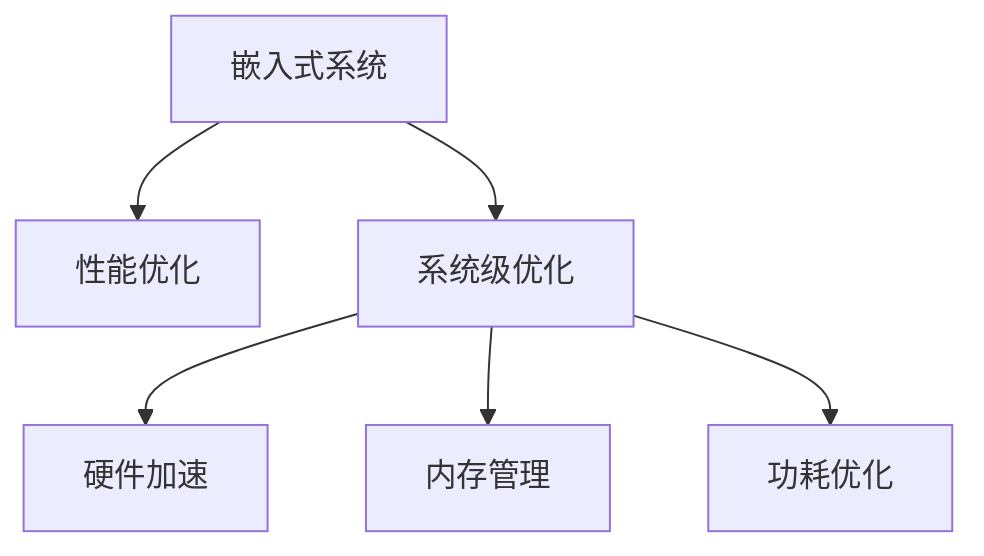

                 

# 嵌入式系统性能优化：提高效率

> 关键词：嵌入式系统,性能优化,系统级优化,硬件加速,内存管理,功耗优化

## 1. 背景介绍

### 1.1 问题由来
嵌入式系统（Embedded Systems）广泛应用于汽车电子、工业控制、医疗设备、智能家居等多个领域。随着物联网（IoT）的发展，嵌入式系统的数量和复杂度都在不断增加，这导致对系统性能的要求也越来越高。然而，在硬件资源有限且成本受限的嵌入式环境中，性能优化始终是一个重要的挑战。

### 1.2 问题核心关键点
在嵌入式系统中，性能优化涉及到硬件加速、内存管理、功耗优化等多个方面。这些问题不仅关系到系统的响应速度和稳定性，还会直接影响设备的续航能力和用户体验。因此，如何在有限资源下实现高效、可靠的性能优化，是嵌入式系统设计中一个关键的问题。

## 2. 核心概念与联系

### 2.1 核心概念概述

为了更好地理解嵌入式系统性能优化，本节将介绍几个密切相关的核心概念：

- **嵌入式系统**：一种特定的计算机系统，用于控制其他设备或系统。与通用计算机相比，嵌入式系统通常具有专门的硬件架构和操作系统。

- **性能优化**：通过优化系统设计、硬件配置和软件实现，提升嵌入式系统的运行速度、稳定性、效率等性能指标的过程。

- **系统级优化**：针对整个嵌入式系统的性能优化，包括硬件和软件的协同优化。

- **硬件加速**：利用专用硬件（如GPU、DSP）加速系统中的计算密集型任务。

- **内存管理**：通过合理分配和回收内存，避免内存泄漏、碎片等问题，提高系统的运行效率。

- **功耗优化**：通过硬件和软件协同设计，降低系统运行时的能耗，延长设备的续航能力。

这些核心概念之间的逻辑关系可以通过以下Mermaid流程图来展示：



这个流程图展示了一个嵌入式系统的优化框架：

1. 嵌入式系统通过性能优化提高整体性能。
2. 系统级优化涉及硬件和软件两个层面的协同优化。
3. 硬件加速通过使用专用硬件提升计算效率。
4. 内存管理通过合理使用内存，避免资源浪费和碎片化。
5. 功耗优化通过多种手段降低系统能耗，延长设备续航。

## 3. 核心算法原理 & 具体操作步骤
### 3.1 算法原理概述

嵌入式系统性能优化是一个多维度、多层次的复杂问题。其核心思想是通过系统设计和工程实践，最大程度地提升嵌入式系统的性能。优化算法一般遵循以下几个基本原则：

1. **硬件加速优先**：优先考虑利用专用硬件加速计算密集型任务，如GPU、DSP等。
2. **内存管理优化**：通过合理分配和回收内存，减少内存碎片，提升内存访问效率。
3. **功耗优化策略**：采取动态功耗管理策略，根据系统负载自动调整能耗。
4. **软硬件协同设计**：在系统设计和实现中充分考虑软硬件的协同优化，避免冗余计算和数据传输。

### 3.2 算法步骤详解

嵌入式系统性能优化一般包括以下几个关键步骤：

**Step 1: 系统需求分析和性能基准测试**

1. 分析系统需求，明确性能指标。
2. 进行基准测试，收集当前系统的性能数据。

**Step 2: 系统性能分析**

1. 根据基准测试结果，识别系统瓶颈和性能瓶颈。
2. 分析系统资源使用情况，包括CPU利用率、内存占用、功耗等。

**Step 3: 硬件加速**

1. 评估计算任务是否适合硬件加速。
2. 选择合适的硬件加速器，如GPU、DSP等。
3. 设计并实现硬件加速算法。

**Step 4: 内存管理**

1. 分析内存使用模式，识别内存泄漏和碎片。
2. 优化内存分配策略，减少内存分配和回收的开销。
3. 实现内存复用技术，提高内存利用率。

**Step 5: 功耗优化**

1. 评估系统功耗来源，包括静态功耗和动态功耗。
2. 设计动态功耗管理策略，如频率和电压调整。
3. 采用节能技术，如空闲模式和节能算法。

**Step 6: 系统级优化**

1. 在硬件和软件两个层面进行协同优化。
2. 设计高效的算法和数据结构。
3. 优化系统架构，减少冗余计算和数据传输。

**Step 7: 性能验证和反馈**

1. 进行性能验证，确保优化措施有效。
2. 收集反馈信息，持续改进优化策略。

以上是嵌入式系统性能优化的基本步骤。在实际应用中，还需要根据具体系统特点，进行有针对性的优化设计。

### 3.3 算法优缺点

嵌入式系统性能优化的优点包括：

1. 提升系统性能：通过优化系统设计，可以显著提升系统的响应速度和稳定性。
2. 降低功耗：优化措施可以有效降低系统能耗，延长设备的续航能力。
3. 降低成本：通过优化内存管理和硬件加速，减少资源浪费和能耗，降低系统开发和维护成本。

同时，该方法也存在一定的局限性：

1. 资源限制：嵌入式系统资源有限，某些优化手段可能受到硬件限制。
2. 开发复杂度：系统级优化涉及硬件和软件多个方面，开发难度较大。
3. 技术门槛：需要具备硬件和软件协同设计的能力，对开发人员要求较高。
4. 验证复杂：优化效果的验证和评估需要大量实验数据和测试工具，难以快速迭代。

尽管存在这些局限性，但就目前而言，嵌入式系统性能优化仍是不可或缺的，通过合理的优化措施，可以有效提升系统的性能和用户体验。

### 3.4 算法应用领域

嵌入式系统性能优化在多个领域都有广泛应用，例如：

- **汽车电子**：如车辆控制、车载娱乐、导航等。通过优化计算和显示，提升驾驶体验和安全性。
- **工业控制**：如自动化生产线、智能家居、机器人等。通过优化控制算法和实时通信，提高生产效率和系统可靠性。
- **医疗设备**：如监护仪、手术机器人等。通过优化算法和数据采集，提升诊断和治疗效果。
- **智能家居**：如智能音箱、智能照明等。通过优化数据处理和用户交互，提升生活便利性。

除了上述这些经典应用外，嵌入式系统性能优化还被创新性地应用到更多场景中，如智能穿戴设备、物联网终端等，为嵌入式技术带来了新的突破。

## 4. 数学模型和公式 & 详细讲解 & 举例说明

### 4.1 数学模型构建

为了更好地进行嵌入式系统性能优化，本文将使用数学语言对优化过程进行更加严格的刻画。

记嵌入式系统为 $S$，其中 $C$ 为计算资源，$M$ 为内存资源，$P$ 为功耗资源。设 $S$ 的初始性能为 $P_0$，优化后的性能为 $P_1$。优化目标是最小化功耗，同时最大化性能。

定义 $S$ 在计算任务 $T$ 上的性能损失函数为 $L(S, T)$，则优化目标为：

$$
\min_{S} \int L(S, T) dT \text{ subject to } C(S) + M(S) + P(S) \leq C_{\text{max}}, M_{\text{max}}, P_{\text{max}}
$$

其中 $C_{\text{max}}$、$M_{\text{max}}$、$P_{\text{max}}$ 分别为计算、内存和功耗的预算限制。

### 4.2 公式推导过程

以下我们以嵌入式系统中的内存管理为例，推导内存优化算法。

假设系统内存大小为 $M$，其中 $M_a$ 为可用内存，$M_f$ 为已分配内存，$M_u$ 为未分配内存。内存优化算法的主要目标是最大化可用内存 $M_a$，同时最小化内存分配和回收的开销。

优化目标为：

$$
\max_{M_a} M_a \text{ subject to } M_a + M_f + M_u = M, M_f \leq M_{\text{max}}
$$

其中 $M_{\text{max}}$ 为最大可分配内存。

引入拉格朗日乘子 $\lambda$ 和 $\mu$，构造拉格朗日函数：

$$
\mathcal{L}(M_a, M_f, \lambda, \mu) = M_a - \lambda (M_a + M_f + M_u - M) + \mu (M_f - M_{\text{max}})
$$

对 $M_a$、$M_f$、$\lambda$ 和 $\mu$ 分别求偏导数，并令其为0：

$$
\begin{cases}
\frac{\partial \mathcal{L}}{\partial M_a} = 1 - \lambda = 0 \\
\frac{\partial \mathcal{L}}{\partial M_f} = -\lambda + \mu = 0 \\
\frac{\partial \mathcal{L}}{\partial \lambda} = M_a + M_f + M_u - M = 0 \\
\frac{\partial \mathcal{L}}{\partial \mu} = M_f - M_{\text{max}} = 0
\end{cases}
$$

解上述方程组，得：

$$
\begin{cases}
M_a = M - M_{\text{max}} \\
M_f = M_{\text{max}} \\
M_u = M - M_{\text{max}}
\end{cases}
$$

这表明，最优的内存管理策略是将内存分配到可用内存和最大可分配内存之间，同时避免频繁的内存分配和回收。

### 4.3 案例分析与讲解

以嵌入式系统中的数据缓存为例，说明如何通过内存管理优化提升系统性能。

假设系统需要从外部存储读取数据，数据大小为 $D$。每次数据读取需要 $t$ 毫秒，内存缓存大小为 $C$。

定义缓存命中率 $h$，即数据从缓存中读取的比例：

$$
h = \frac{C}{D}
$$

则数据读取的总时间为：

$$
T = h \cdot t + (1-h) \cdot t \cdot 2
$$

其中 $(1-h) \cdot t \cdot 2$ 为未命中缓存时，从外部存储读取数据的额外开销。

当 $C = D$ 时，缓存命中率 $h = 1$，数据读取总时间为 $t$ 毫秒。当 $C < D$ 时，缓存命中率 $h < 1$，数据读取总时间增加。因此，合理分配缓存大小，可以显著提高数据读取的效率，提升系统性能。

## 5. 项目实践：代码实例和详细解释说明

### 5.1 开发环境搭建

在进行嵌入式系统性能优化实践前，我们需要准备好开发环境。以下是使用C++和嵌入式操作系统（如Linux、RTOS）进行嵌入式系统优化开发的常用环境配置流程：

1. 安装交叉编译工具链：如arm-linux-gnueabihf-gcc等，用于编译目标系统上的代码。

2. 安装嵌入式操作系统：如Linux、RTOS等，搭建开发环境。

3. 配置开发板：根据开发板硬件规格，进行必要的硬件设置和配置。

4. 安装调试工具：如GDB、JTAG等，用于调试和监控系统。

完成上述步骤后，即可在开发板上进行嵌入式系统性能优化实践。

### 5.2 源代码详细实现

这里我们以嵌入式系统中的内存管理优化为例，给出使用C++实现的代码。

```cpp
#include <iostream>
#include <cstdlib>
#include <vector>

using namespace std;

// 定义内存管理类
class MemoryManager {
public:
    MemoryManager(int maxMemory) {
        maxMemory_ = maxMemory;
        availableMemory_ = maxMemory_;
        allocatedMemory_ = 0;
        unusedMemory_ = 0;
    }

    void allocate(int size) {
        if (availableMemory_ < size) {
            throw "Out of memory";
        }
        allocatedMemory_ += size;
        availableMemory_ -= size;
    }

    void deallocate(int size) {
        if (allocatedMemory_ < size) {
            throw "Invalid memory allocation";
        }
        allocatedMemory_ -= size;
        availableMemory_ += size;
    }

    int getAvailableMemory() {
        return availableMemory_;
    }

private:
    int maxMemory_;
    int availableMemory_;
    int allocatedMemory_;
    int unusedMemory_;
};

// 测试内存管理类的使用
int main() {
    MemoryManager mm(1000);
    mm.allocate(500);
    cout << "Available memory: " << mm.getAvailableMemory() << endl;
    mm.deallocate(300);
    cout << "Available memory: " << mm.getAvailableMemory() << endl;
    return 0;
}
```

在上述代码中，我们定义了一个简单的内存管理类 `MemoryManager`，用于管理系统的可用内存、已分配内存和未分配内存。通过合理分配和回收内存，可以避免内存泄漏和碎片化，提升系统的运行效率。

### 5.3 代码解读与分析

让我们再详细解读一下关键代码的实现细节：

**MemoryManager类**：
- `MemoryManager` 类的构造函数：初始化最大内存、可用内存、已分配内存和未分配内存。
- `allocate` 方法：分配指定大小的内存，更新可用内存和已分配内存。
- `deallocate` 方法：释放指定大小的内存，更新可用内存和已分配内存。
- `getAvailableMemory` 方法：获取当前可用内存大小。

**测试程序**：
- 创建 `MemoryManager` 对象，设置最大内存为 1000。
- 分配 500 个内存块，并输出可用内存大小。
- 释放 300 个内存块，并输出可用内存大小。

通过上述代码的实现和测试，可以看出内存管理优化的基本逻辑：通过合理分配和回收内存，最大化可用内存，避免内存泄漏和碎片化，提升系统的运行效率。

## 6. 实际应用场景

### 6.1 汽车电子

在汽车电子领域，嵌入式系统的性能优化显得尤为重要。汽车的自动驾驶、导航、娱乐等功能都需要实时计算和数据处理，性能优化可以显著提升驾驶体验和安全性。

具体而言，可以通过硬件加速技术，将复杂的图像处理、语音识别等计算任务交给GPU、DSP等专用硬件加速器处理。通过优化内存管理和功耗控制，可以延长车载电池的续航能力，提升设备的稳定性和可靠性。

### 6.2 工业控制

在工业控制领域，嵌入式系统的性能优化可以显著提高生产效率和系统可靠性。工业自动化生产线需要实时控制和数据处理，性能优化可以缩短生产周期，提高产品质量。

具体而言，可以通过优化算法和数据结构，减少冗余计算和数据传输，提升系统的实时响应能力。通过优化功耗管理，可以在低功耗模式下运行系统，延长设备的续航能力。

### 6.3 医疗设备

在医疗设备领域，嵌入式系统的性能优化可以提升诊断和治疗效果。如智能监护仪、手术机器人等设备需要实时数据处理和决策支持，性能优化可以提升系统的响应速度和稳定性。

具体而言，可以通过优化硬件加速和内存管理，提升设备的数据处理能力。通过优化功耗管理，可以延长设备的续航能力，提升设备的便携性和使用灵活性。

### 6.4 未来应用展望

随着嵌入式系统技术的不断进步，性能优化将在更多领域得到应用，为传统行业带来变革性影响。

在智慧城市治理中，嵌入式系统性能优化可以提升城市的智能化水平，构建更安全、高效的未来城市。在智慧家居领域，优化系统性能可以提升用户的体验感，推动智能家居市场的普及和发展。

在智能穿戴设备领域，优化系统性能可以提升设备的便携性和续航能力，推动智能穿戴设备市场的进一步发展。在物联网终端领域，优化系统性能可以提升设备的实时响应能力和数据处理能力，推动物联网应用的进一步拓展。

## 7. 工具和资源推荐

### 7.1 学习资源推荐

为了帮助开发者系统掌握嵌入式系统性能优化的理论基础和实践技巧，这里推荐一些优质的学习资源：

1. 《嵌入式系统设计与优化》系列博文：由嵌入式系统专家撰写，深入浅出地介绍了嵌入式系统设计、优化和测试的基本原理和实践方法。

2. 《嵌入式系统性能优化实践指南》书籍：详细介绍了嵌入式系统性能优化的各种技术手段和案例分析，涵盖硬件加速、内存管理、功耗优化等多个方面。

3. 嵌入式系统课程：如嵌入式系统设计与优化、嵌入式系统性能优化等，提供系统的理论知识和技术实践。

4. 嵌入式系统社区：如嵌入式开发论坛、嵌入式系统博客等，可以交流和学习嵌入式系统优化的经验和教训。

通过对这些资源的学习实践，相信你一定能够快速掌握嵌入式系统性能优化的精髓，并用于解决实际的系统问题。

### 7.2 开发工具推荐

高效的开发离不开优秀的工具支持。以下是几款用于嵌入式系统性能优化开发的常用工具：

1. GCC交叉编译工具链：广泛用于嵌入式系统开发，支持多种嵌入式平台。

2. ARM编译器：专为ARM架构设计，具有高效的优化和调试功能。

3. KEIL MDK：适用于嵌入式系统开发，提供全面的开发环境和调试工具。

4. IAR Embedded Workbench：适用于嵌入式系统开发，支持多种编译器和目标平台。

5. Xcode：适用于iOS和macOS平台的开发，支持多种嵌入式硬件的调试和优化。

合理利用这些工具，可以显著提升嵌入式系统性能优化任务的开发效率，加快创新迭代的步伐。

### 7.3 相关论文推荐

嵌入式系统性能优化技术的发展源于学界的持续研究。以下是几篇奠基性的相关论文，推荐阅读：

1. "An Energy-Efficient GPU Computing Architecture for Embedded Systems"（嵌入式系统中的GPU计算架构）：介绍了嵌入式系统中的GPU计算架构，提出了一系列优化策略，如动态功耗管理、算法优化等。

2. "Memory Management Techniques for Embedded Systems"（嵌入式系统中的内存管理技术）：详细介绍了嵌入式系统中的内存管理技术，包括分配算法、回收策略、缓存优化等。

3. "Hardware Acceleration for Embedded Systems"（嵌入式系统中的硬件加速技术）：介绍了嵌入式系统中的硬件加速技术，包括GPU、DSP等专用硬件加速器的使用，优化策略等。

4. "Performance Optimization Techniques for Embedded Systems"（嵌入式系统性能优化技术）：详细介绍了嵌入式系统中的性能优化技术，包括系统设计、算法优化、功耗管理等。

这些论文代表了大语言模型微调技术的发展脉络。通过学习这些前沿成果，可以帮助研究者把握学科前进方向，激发更多的创新灵感。

## 8. 总结：未来发展趋势与挑战

### 8.1 总结

本文对嵌入式系统性能优化方法进行了全面系统的介绍。首先阐述了嵌入式系统性能优化的背景和意义，明确了系统级优化在嵌入式系统中的重要地位。其次，从原理到实践，详细讲解了嵌入式系统性能优化的数学模型和关键步骤，给出了嵌入式系统优化任务的完整代码实例。同时，本文还广泛探讨了系统级优化在汽车电子、工业控制、医疗设备等多个领域的应用前景，展示了嵌入式系统优化的巨大潜力。此外，本文精选了嵌入式系统优化的各类学习资源，力求为读者提供全方位的技术指引。

通过本文的系统梳理，可以看到，嵌入式系统性能优化技术正在成为嵌入式系统设计中的重要范式，极大地拓展了嵌入式系统的应用边界，催生了更多的落地场景。受益于系统级优化的不断演进，嵌入式系统将在更多领域大放异彩，为人类生产生活方式带来深刻影响。

### 8.2 未来发展趋势

展望未来，嵌入式系统性能优化技术将呈现以下几个发展趋势：

1. **系统级优化全面推广**：嵌入式系统性能优化将从单一硬件和软件优化，向系统级优化全面推广，实现软硬件协同优化。

2. **软硬件协同设计**：在系统设计阶段，充分考虑软硬件协同优化，避免冗余计算和数据传输，提升系统性能。

3. **异构计算应用广泛**：未来嵌入式系统将广泛应用异构计算，结合CPU、GPU、DSP等多种计算资源，提升系统的计算能力。

4. **智能化优化**：通过引入人工智能技术，如强化学习、机器学习等，实现自适应优化，提升系统性能和鲁棒性。

5. **边缘计算普及**：随着5G和物联网技术的发展，嵌入式系统性能优化将向边缘计算方向发展，提升数据处理能力和实时响应能力。

6. **跨平台优化**：嵌入式系统性能优化将不再局限于单一平台，将向跨平台优化方向发展，实现通用化和标准化。

以上趋势凸显了嵌入式系统性能优化技术的广阔前景。这些方向的探索发展，必将进一步提升嵌入式系统的性能和用户体验，推动嵌入式技术在更多领域的落地应用。

### 8.3 面临的挑战

尽管嵌入式系统性能优化技术已经取得了瞩目成就，但在迈向更加智能化、普适化应用的过程中，它仍面临着诸多挑战：

1. **硬件资源限制**：嵌入式系统硬件资源有限，某些优化手段可能受到硬件限制，难以全面实施。

2. **开发复杂度**：嵌入式系统性能优化涉及硬件和软件多个方面，开发难度较大，需要跨学科的知识和技能。

3. **验证复杂**：优化效果的验证和评估需要大量实验数据和测试工具，难以快速迭代，难以快速验证效果。

4. **成本和效率**：性能优化可能增加开发和维护成本，同时可能降低系统性能的提升效果，需要权衡利弊。

5. **安全性**：优化措施可能会引入新的安全风险，需要设计安全策略，确保系统的安全性。

6. **易用性**：优化措施可能会增加系统的复杂度和开发难度，需要设计易用性高的接口和工具。

正视嵌入式系统性能优化面临的这些挑战，积极应对并寻求突破，将是大语言模型微调走向成熟的必由之路。相信随着学界和产业界的共同努力，这些挑战终将一一被克服，嵌入式系统性能优化必将在构建高效、可靠的嵌入式系统方面发挥更大的作用。

### 8.4 研究展望

面对嵌入式系统性能优化所面临的种种挑战，未来的研究需要在以下几个方面寻求新的突破：

1. **跨学科合作**：嵌入式系统性能优化需要跨学科合作，涵盖硬件、软件、系统等多个方面。

2. **优化算法创新**：开发新的优化算法和工具，提高优化效果和效率，降低开发难度和成本。

3. **智能优化**：引入人工智能技术，如强化学习、机器学习等，实现自适应优化，提升系统性能和鲁棒性。

4. **边缘计算优化**：优化边缘计算系统的性能和效率，提升实时数据处理能力和系统可靠性。

5. **跨平台优化**：开发跨平台优化工具和技术，实现通用化和标准化。

6. **安全性保障**：设计安全性高的优化策略和工具，确保系统的安全性。

这些研究方向的探索，必将引领嵌入式系统性能优化技术迈向更高的台阶，为构建高效、可靠的嵌入式系统提供坚实的技术基础。

## 9. 附录：常见问题与解答

**Q1：嵌入式系统性能优化是否适用于所有嵌入式应用？**

A: 嵌入式系统性能优化在大多数嵌入式应用上都能取得显著效果，特别是对于计算密集型和数据密集型的应用。但对于一些实时性要求极高的应用，如自动驾驶等，系统级优化可能会引入额外的延迟，需要谨慎选择。

**Q2：嵌入式系统性能优化对系统硬件有何要求？**

A: 嵌入式系统性能优化对系统硬件有一定的要求，特别是对CPU、内存、存储等关键组件。优化措施需要硬件的支持，如支持硬件加速、支持动态功耗管理等。

**Q3：嵌入式系统性能优化是否需要大量的实验数据？**

A: 嵌入式系统性能优化通常需要大量的实验数据进行验证和调整。优化措施的效果需要在实际应用中测试和评估，以确保其有效性。

**Q4：嵌入式系统性能优化是否可以跨平台应用？**

A: 嵌入式系统性能优化可以跨平台应用，但需要根据不同平台的特点进行优化设计。如嵌入式系统性能优化在ARM平台和x86平台上有不同的优化策略，需要针对平台进行适配。

**Q5：嵌入式系统性能优化是否需要硬件支持？**

A: 嵌入式系统性能优化通常需要硬件支持，如支持硬件加速、支持动态功耗管理等。优化措施需要硬件的支持，才能充分发挥其效果。

通过上述Q&A，可以看到嵌入式系统性能优化的广泛适用性和复杂性。只有充分理解和掌握这些关键问题，才能在实际应用中取得更好的效果。

---

作者：禅与计算机程序设计艺术 / Zen and the Art of Computer Programming

