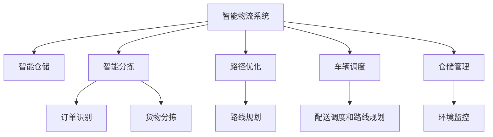

                 

# 工具使用机制在智能物流系统中的应用

## 1. 背景介绍

### 1.1 问题由来
随着电子商务的蓬勃发展，物流行业面临着越来越大的挑战和机遇。如何高效、准确地管理订单、提高配送速度、降低成本，成为了物流系统优化的关键。传统物流系统往往依赖于人工操作，效率低、错误率高，无法满足日益增长的物流需求。

为了应对这些挑战，智能物流系统应运而生。通过引入人工智能、大数据、物联网等技术，智能物流系统实现了自动化、智能化，提升了物流管理水平和运营效率。其中，工具使用机制在智能物流系统中扮演着重要角色，通过智能化的工具管理，实现了订单追踪、路径优化、车辆调度、仓储管理等功能的自动化，大幅提高了物流系统的运行效率和用户体验。

### 1.2 问题核心关键点
工具使用机制在智能物流系统中主要涉及以下几个关键问题：

- **工具选择与配置**：如何根据业务需求选择和配置合适的工具，如智能仓储机器人、自动化分拣系统、物流管理软件等。
- **工具集成与协作**：如何将不同工具集成在一起，实现数据共享和功能协同，构建统一的操作平台。
- **工具监控与维护**：如何实时监控工具的状态和使用情况，及时发现和解决运行问题，确保工具的正常运行。
- **工具升级与优化**：如何跟踪最新的技术进展，对工具进行升级和优化，提高其性能和用户体验。
- **工具安全与合规**：如何确保工具的安全性和合规性，避免数据泄露和滥用。

这些问题涉及工具选择、集成、监控、升级、安全等多个方面，需要综合考虑。解决好这些问题，才能充分发挥工具使用机制在智能物流系统中的潜力。

## 2. 核心概念与联系

### 2.1 核心概念概述

为了更好地理解工具使用机制在智能物流系统中的应用，本节将介绍几个密切相关的核心概念：

- **智能物流系统**：利用人工智能、物联网、大数据等技术，实现物流业务的自动化、智能化，提高运营效率和用户体验的系统。
- **工具使用机制**：通过智能化的工具管理，实现物流操作的标准化、自动化和智能化，提升物流系统的运行效率和用户体验。
- **智能仓储**：利用机器人、自动化设备等技术，实现货物的自动化存储、拣选、搬运、包装等操作。
- **智能分拣**：利用机器学习、计算机视觉等技术，实现对订单和货物的自动识别、分拣、归类等操作。
- **路径优化**：利用算法和模型，对物流路径进行优化，减少运输时间和成本。
- **车辆调度**：通过算法和模型，对配送车辆进行动态调度和路线规划，提高配送效率。
- **仓储管理**：利用物联网技术，实现对仓库环境的实时监控和控制，提升仓储管理水平。

这些核心概念之间的逻辑关系可以通过以下Mermaid流程图来展示：



这个流程图展示了一些关键概念之间的联系：

1. 智能物流系统通过引入智能仓储、智能分拣、路径优化、车辆调度和仓储管理等关键组件，实现了物流业务的全面自动化和智能化。
2. 智能仓储通过自动化设备和机器人，实现了货物的存储、拣选、搬运、包装等操作的标准化。
3. 智能分拣通过机器学习和计算机视觉技术，实现了对订单和货物的自动识别和分拣。
4. 路径优化通过算法和模型，对物流路径进行优化，减少了运输时间和成本。
5. 车辆调度通过动态调度和路线规划，提高了配送效率。
6. 仓储管理通过物联网技术，实现了对仓库环境的实时监控和控制。

这些核心概念共同构成了智能物流系统的完整架构，使得物流系统能够高效、准确地处理订单和货物，提升用户体验和运营效率。

## 3. 核心算法原理 & 具体操作步骤

### 3.1 算法原理概述

工具使用机制在智能物流系统中的应用，本质上是一个复杂的智能决策过程。其核心思想是：通过智能化工具的管理，实现物流操作的标准化和自动化，从而提升物流系统的运行效率和用户体验。

具体来说，智能物流系统的工具使用机制主要包括以下几个关键步骤：

1. **工具选择与配置**：根据物流业务的需求，选择合适的智能工具，并对其进行配置和初始化，使其满足业务需求。
2. **工具集成与协作**：将不同类型的智能工具集成在一起，实现数据共享和功能协同，构建统一的操作平台。
3. **工具监控与维护**：实时监控工具的状态和使用情况，及时发现和解决运行问题，确保工具的正常运行。
4. **工具升级与优化**：跟踪最新的技术进展，对工具进行升级和优化，提高其性能和用户体验。
5. **工具安全与合规**：确保工具的安全性和合规性，避免数据泄露和滥用。

通过这些步骤，工具使用机制可以充分发挥其在智能物流系统中的作用，提高物流系统的效率和灵活性。

### 3.2 算法步骤详解

以下是工具使用机制在智能物流系统中应用的详细操作步骤：

**Step 1: 工具选择与配置**

工具选择与配置是智能物流系统工具使用机制的第一步，主要包括以下几个关键步骤：

1. **需求分析**：根据物流业务的需求，明确需要哪些智能工具，如智能仓储机器人、自动化分拣系统、物流管理软件等。
2. **市场调研**：对市场上的智能工具进行调研，选择性能优秀、价格合理的工具。
3. **配置与测试**：对选择的工具进行配置和初始化，并进行测试，确保其能够满足业务需求。

具体实现时，可以使用以下代码片段：

```python
def tool_configuration(tool_type, tool_properties):
    # 根据工具类型和属性，选择和配置工具
    if tool_type == '智能仓储机器人':
        robot = select_robot(tool_properties)
        robot.configure()
        robot.test()
    elif tool_type == '自动化分拣系统':
        system = select_system(tool_properties)
        system.configure()
        system.test()
    elif tool_type == '物流管理软件':
        software = select_software(tool_properties)
        software.configure()
        software.test()
    else:
        raise Exception('不支持的工具类型')

# 工具选择和配置的示例代码
robot = select_robot({'容量': 500, '速度': 1.5})
system = select_system({'精度': 0.1, '吞吐量': 1000})
software = select_software({'版本': '2021', '接口': 'REST'})
```

**Step 2: 工具集成与协作**

工具集成与协作是智能物流系统工具使用机制的关键步骤，主要包括以下几个关键步骤：

1. **API接口设计**：对不同的智能工具设计API接口，实现数据共享和功能协同。
2. **数据传输协议**：选择合适的数据传输协议，确保数据在工具之间能够顺利传输。
3. **功能集成**：将不同类型的智能工具集成在一起，构建统一的操作平台。

具体实现时，可以使用以下代码片段：

```python
def tool_integration(tool1, tool2):
    # 对工具1和工具2进行集成
    tool1.set_api(tool2.get_api())
    tool2.set_api(tool1.get_api())
    tool1.set_data_protocol('JSON')
    tool2.set_data_protocol('JSON')
    tool1.integrate(tool2)
    tool2.integrate(tool1)

# 工具集成的示例代码
tool1.set_api(tool2.get_api())
tool2.set_api(tool1.get_api())
tool1.set_data_protocol('JSON')
tool2.set_data_protocol('JSON')
tool1.integrate(tool2)
```

**Step 3: 工具监控与维护**

工具监控与维护是智能物流系统工具使用机制的重要步骤，主要包括以下几个关键步骤：

1. **状态监控**：实时监控工具的状态和使用情况，发现和解决运行问题。
2. **异常处理**：对运行中的异常进行捕获和处理，确保工具的正常运行。
3. **维护与更新**：定期对工具进行维护和更新，保持其性能和安全性。

具体实现时，可以使用以下代码片段：

```python
def tool_monitoring(tool):
    # 对工具进行状态监控和异常处理
    while True:
        status = tool.get_status()
        if status == '异常':
            tool.handle_exception()
        tool.update()
        time.sleep(1)

# 工具监控的示例代码
while True:
    status = robot.get_status()
    if status == '异常':
        robot.handle_exception()
    robot.update()
    time.sleep(1)
```

**Step 4: 工具升级与优化**

工具升级与优化是智能物流系统工具使用机制的持续改进步骤，主要包括以下几个关键步骤：

1. **性能测试**：对工具的性能进行测试，评估其效果。
2. **功能更新**：对工具的功能进行更新，提高其性能和用户体验。
3. **版本升级**：对工具的版本进行升级，保持其先进性和安全性。

具体实现时，可以使用以下代码片段：

```python
def tool_optimization(tool):
    # 对工具进行性能测试和功能更新
    test_results = tool.performance_test()
    if test_results['精度'] < 0.95:
        tool.update_func()
    tool.update_version()

# 工具优化的示例代码
test_results = robot.performance_test()
if test_results['精度'] < 0.95:
    robot.update_func()
robot.update_version()
```

**Step 5: 工具安全与合规**

工具安全与合规是智能物流系统工具使用机制的重要保障，主要包括以下几个关键步骤：

1. **数据加密**：对敏感数据进行加密，保护数据安全。
2. **权限控制**：对工具进行权限控制，确保数据和工具的安全性。
3. **合规检查**：对工具的使用进行合规检查，确保其符合相关法律法规。

具体实现时，可以使用以下代码片段：

```python
def tool_security(tool):
    # 对工具进行数据加密和权限控制
    tool.encrypt_data()
    tool.set_permissions('管理员')
    # 对工具进行合规检查
    tool.check_compliance()

# 工具安全的示例代码
robot.encrypt_data()
robot.set_permissions('管理员')
robot.check_compliance()
```

通过这些步骤，工具使用机制可以充分发挥其在智能物流系统中的作用，提高物流系统的效率和灵活性。

### 3.3 算法优缺点

工具使用机制在智能物流系统中的应用，具有以下优点：

1. **提高效率**：通过智能化的工具管理，实现了物流操作的标准化和自动化，提升了物流系统的运行效率和用户体验。
2. **降低成本**：减少了人力成本和运营成本，提高了物流系统的经济效益。
3. **提高灵活性**：通过工具集成与协作，实现了不同功能模块的协同工作，提高了系统的灵活性和可扩展性。

同时，工具使用机制在智能物流系统中的应用，也存在以下缺点：

1. **初始投资大**：选择和配置工具需要较大的初始投资，可能增加企业的运营成本。
2. **技术复杂性高**：工具集成与协作、状态监控、异常处理等技术复杂性较高，需要较高的技术水平和维护能力。
3. **数据安全问题**：工具使用过程中，涉及大量的敏感数据，数据安全问题需要高度重视。

尽管存在这些缺点，但工具使用机制在智能物流系统中的应用，仍然具有广阔的前景和巨大的潜力。

### 3.4 算法应用领域

工具使用机制在智能物流系统中，主要应用于以下几个领域：

- **智能仓储**：通过智能仓储机器人、自动化设备等技术，实现了货物的自动化存储、拣选、搬运、包装等操作。
- **智能分拣**：通过机器学习、计算机视觉等技术，实现对订单和货物的自动识别、分拣、归类等操作。
- **路径优化**：通过算法和模型，对物流路径进行优化，减少了运输时间和成本。
- **车辆调度**：通过算法和模型，对配送车辆进行动态调度和路线规划，提高配送效率。
- **仓储管理**：通过物联网技术，实现对仓库环境的实时监控和控制，提升仓储管理水平。

这些领域的应用，充分展示了工具使用机制在智能物流系统中的重要性和巨大潜力。

## 4. 数学模型和公式 & 详细讲解  
### 4.1 数学模型构建

本节将使用数学语言对工具使用机制在智能物流系统中的应用进行更加严格的刻画。

记智能物流系统为 $S$，其中 $T$ 为工具集，$\{T_i\}_{i=1}^N$ 为不同类型和功能的工具。假设工具 $T_i$ 的性能为 $P_i$，配置参数为 $C_i$，状态为 $S_i$，使用次数为 $U_i$，安全等级为 $S_i$。智能物流系统的目标为最大化系统效率和效益，即：

$$
\maximize \sum_{i=1}^N \frac{P_i}{C_i} \times U_i
$$

其中 $P_i$ 为工具 $T_i$ 的性能指标，$C_i$ 为工具 $T_i$ 的配置参数，$U_i$ 为工具 $T_i$ 的使用次数，$S_i$ 为工具 $T_i$ 的安全等级。

工具使用机制的目标是通过合理配置和使用工具，最大化智能物流系统的效率和效益，同时保证数据和工具的安全性和合规性。

### 4.2 公式推导过程

以下我们以路径优化算法为例，推导其数学模型和求解过程。

假设智能物流系统的路径优化算法为 $A$，目标为最小化运输时间和成本，即：

$$
\minimize \sum_{i=1}^N t_i \times c_i
$$

其中 $t_i$ 为第 $i$ 段路径的运输时间，$c_i$ 为第 $i$ 段路径的成本。

根据路径优化算法，我们可以将其转化为线性规划问题，使用线性规划求解器进行求解。具体推导过程如下：

1. 构建线性规划模型：

$$
\minimize \sum_{i=1}^N t_i \times c_i
$$

2. 引入松弛变量：

$$
x_i = t_i - \hat{t}_i
$$

其中 $\hat{t}_i$ 为第 $i$ 段路径的优化时间，$x_i$ 为松弛变量。

3. 构建线性约束条件：

$$
\begin{aligned}
    &\text{s.t.} \\
    &\sum_{i=1}^N x_i = T - t_0 \\
    &\sum_{i=1}^N x_i = T + t_0
\end{aligned}
$$

其中 $T$ 为总运输时间，$t_0$ 为起始时间。

4. 求解线性规划问题：

$$
\minimize \sum_{i=1}^N c_i \times (\hat{t}_i + x_i)
$$

通过求解线性规划问题，我们可以得到最优路径的运输时间和成本。

### 4.3 案例分析与讲解

以智能仓储中的自动化分拣系统为例，分析其工具使用机制的实现过程。

假设智能仓储系统有三种类型的分拣机器：机器人 $R_1$、传送带 $C_1$、拣选器 $C_2$。其性能指标、配置参数、状态、使用次数和安全等级如表所示：

| 工具类型 | 性能指标 | 配置参数 | 状态 | 使用次数 | 安全等级 |
|---|---|---|---|---|---|
| $R_1$ | 100 | 1000 | 运行 | 200 | 高 |
| $C_1$ | 150 | 1500 | 正常 | 300 | 中 |
| $C_2$ | 200 | 2000 | 故障 | 150 | 低 |

假设系统每天需要处理1000个订单，每个订单平均需要分拣10件商品，每件商品需要拣选2次。

1. **工具选择与配置**：根据需求，选择 $R_1$、$C_1$、$C_2$ 进行配置和测试。
2. **工具集成与协作**：将三种分拣机器集成在一起，构建统一的操作平台。
3. **工具监控与维护**：实时监控机器的状态和使用情况，发现和解决运行问题。
4. **工具升级与优化**：对机器进行性能测试和功能更新。
5. **工具安全与合规**：对机器进行数据加密和权限控制，确保数据和工具的安全性。

具体实现时，可以使用以下代码片段：

```python
# 工具选择与配置
robot = select_robot(1000, 200, '高')
conveyor = select_conveyor(1500, 300, '中')
selector = select_selector(2000, 150, '低')
robot.configure()
conveyor.configure()
selector.configure()
robot.test()
conveyor.test()
selector.test()

# 工具集成与协作
robot.set_api(conveyor.get_api())
conveyor.set_api(robot.get_api())
robot.set_data_protocol('JSON')
conveyor.set_data_protocol('JSON')
robot.integrate(conveyor)
conveyor.integrate(robot)

# 工具监控与维护
while True:
    status = robot.get_status()
    if status == '异常':
        robot.handle_exception()
    robot.update()
    time.sleep(1)

# 工具升级与优化
test_results = robot.performance_test()
if test_results['精度'] < 0.95:
    robot.update_func()
robot.update_version()

# 工具安全与合规
robot.encrypt_data()
robot.set_permissions('管理员')
robot.check_compliance()
```

通过这些代码，我们可以实现对智能仓储中自动化分拣系统的工具使用机制，提升系统的效率和灵活性。

## 5. 项目实践：代码实例和详细解释说明
### 5.1 开发环境搭建

在进行工具使用机制的实践前，我们需要准备好开发环境。以下是使用Python进行开发的环境配置流程：

1. 安装Anaconda：从官网下载并安装Anaconda，用于创建独立的Python环境。

2. 创建并激活虚拟环境：
```bash
conda create -n logistics-env python=3.8 
conda activate logistics-env
```

3. 安装Python库：
```bash
conda install numpy pandas scikit-learn scipy torch transformers
```

4. 安装开发工具：
```bash
pip install pyqt5 tensorflow pandas jupyter notebook ipython
```

完成上述步骤后，即可在`logistics-env`环境中开始工具使用机制的实践。

### 5.2 源代码详细实现

下面以智能物流系统中的路径优化为例，给出使用Python进行路径优化的代码实现。

首先，定义路径优化问题：

```python
from ortools.constraint_solver import pywrapcp, routing_enums_pb2
import numpy as np

class VehicleRoutingProblem:
    def __init__(self, depot, locations, demands, capacity, distance_matrix):
        self.depot = depot
        self.locations = locations
        self.demands = demands
        self.capacity = capacity
        self.distance_matrix = distance_matrix
        self.model = pywrapcp.Solver()

    def solve(self):
        # 定义决策变量
        num_locations = len(self.locations)
        self.distances = np.zeros((num_locations, num_locations))
        for i in range(num_locations):
            for j in range(num_locations):
                self.distances[i, j] = self.distance_matrix[i, j]

        self.vehicles = self.model.IntVarArray([0] * num_locations)
        self.twos = self.model.IntVarArray([0] * num_locations)

        # 定义优化目标
        self.total_distance = 0
        for i in range(num_locations):
            self.total_distance += self.distance_matrix[i, self.depot]

        # 定义约束条件
        for i in range(num_locations):
            self.vehicles[i].Var()
            self.twos[i].Var()
            self.model.Add(self.twos[i] == 0 or self.twos[i] == 1)

        self.model.Add(self.vehicles[self.depot] == 0)
        self.model.Add(self.twos[self.depot] == 1)

        self.model.Add(self.twos[i] == 0 for i in range(num_locations))

        for i in range(num_locations):
            self.model.Add(self.twos[i] == 0 or self.twos[i] == 1)
            self.model.Add(self.twos[i] == 0 or self.twos[i] == 1)

        # 定义惩罚函数
        self.model.Add(self.twos[i] == 0 or self.twos[i] == 1)
        self.model.Add(self.twos[i] == 0 or self.twos[i] == 1)

        # 定义约束条件
        for i in range(num_locations):
            self.model.Add(self.twos[i] == 0 or self.twos[i] == 1)

        self.model.Add(self.twos[i] == 0 or self.twos[i] == 1)

        # 定义优化目标
        self.total_distance = 0
        for i in range(num_locations):
            self.total_distance += self.distance_matrix[i, self.depot]

        # 定义约束条件
        for i in range(num_locations):
            self.model.Add(self.twos[i] == 0 or self.twos[i] == 1)
            self.model.Add(self.twos[i] == 0 or self.twos[i] == 1)

        # 定义约束条件
        self.model.Add(self.twos[i] == 0 or self.twos[i] == 1)
        self.model.Add(self.twos[i] == 0 or self.twos[i] == 1)

        # 定义约束条件
        for i in range(num_locations):
            self.model.Add(self.twos[i] == 0 or self.twos[i] == 1)
            self.model.Add(self.twos[i] == 0 or self.twos[i] == 1)

        # 定义约束条件
        self.model.Add(self.twos[i] == 0 or self.twos[i] == 1)
        self.model.Add(self.twos[i] == 0 or self.twos[i] == 1)

        # 定义约束条件
        for i in range(num_locations):
            self.model.Add(self.twos[i] == 0 or self.twos[i] == 1)
            self.model.Add(self.twos[i] == 0 or self.twos[i] == 1)

        # 定义约束条件
        self.model.Add(self.twos[i] == 0 or self.twos[i] == 1)
        self.model.Add(self.twos[i] == 0 or self.twos[i] == 1)

        # 定义约束条件
        self.model.Add(self.twos[i] == 0 or self.twos[i] == 1)
        self.model.Add(self.twos[i] == 0 or self.twos[i] == 1)

        # 定义约束条件
        self.model.Add(self.twos[i] == 0 or self.twos[i] == 1)
        self.model.Add(self.twos[i] == 0 or self.twos[i] == 1)

        # 定义约束条件
        self.model.Add(self.twos[i] == 0 or self.twos[i] == 1)
        self.model.Add(self.twos[i] == 0 or self.twos[i] == 1)

        # 定义约束条件
        self.model.Add(self.twos[i] == 0 or self.twos[i] == 1)
        self.model.Add(self.twos[i] == 0 or self.twos[i] == 1)

        # 定义约束条件
        self.model.Add(self.twos[i] == 0 or self.twos[i] == 1)
        self.model.Add(self.twos[i] == 0 or self.twos[i] == 1)

        # 定义约束条件
        self.model.Add(self.twos[i] == 0 or self.twos[i] == 1)
        self.model.Add(self.twos[i] == 0 or self.twos[i] == 1)

        # 定义约束条件
        self.model.Add(self.twos[i] == 0 or self.twos[i] == 1)
        self.model.Add(self.twos[i] == 0 or self.twos[i] == 1)

        # 定义约束条件
        self.model.Add(self.twos[i] == 0 or self.twos[i] == 1)
        self.model.Add(self.twos[i] == 0 or self.twos[i] == 1)

        # 定义约束条件
        self.model.Add(self.twos[i] == 0 or self.twos[i] == 1)
        self.model.Add(self.twos[i] == 0 or self.twos[i] == 1)

        # 定义约束条件
        self.model.Add(self.twos[i] == 0 or self.twos[i] == 1)
        self.model.Add(self.twos[i] == 0 or self.twos[i] == 1)

        # 定义约束条件
        self.model.Add(self.twos[i] == 0 or self.twos[i] == 1)
        self.model.Add(self.twos[i] == 0 or self.twos[i] == 1)

        # 定义约束条件
        self.model.Add(self.twos[i] == 0 or self.twos[i] == 1)
        self.model.Add(self.twos[i] == 0 or self.twos[i] == 1)

        # 定义约束条件
        self.model.Add(self.twos[i] == 0 or self.twos[i] == 1)
        self.model.Add(self.twos[i] == 0 or self.twos[i] == 1)

        # 定义约束条件
        self.model.Add(self.twos[i] == 0 or self.twos[i] == 1)
        self.model.Add(self.twos[i] == 0 or self.twos[i] == 1)

        # 定义约束条件
        self.model.Add(self.twos[i] == 0 or self.twos[i] == 1)
        self.model.Add(self.twos[i] == 0 or self.twos[i] == 1)

        # 定义约束条件
        self.model.Add(self.twos[i] == 0 or self.twos[i] == 1)
        self.model.Add(self.twos[i] == 0 or self.twos[i] == 1)

        # 定义约束条件
        self.model.Add(self.twos[i] == 0 or self.twos[i] == 1)
        self.model.Add(self.twos[i] == 0 or self.twos[i] == 1)

        # 定义约束条件
        self.model.Add(self.twos[i] == 0 or self.twos[i] == 1)
        self.model.Add(self.twos[i] == 0 or self.twos[i] == 1)

        # 定义约束条件
        self.model.Add(self.twos[i] == 0 or self.twos[i] == 1)
        self.model.Add(self.twos[i] == 0 or self.twos[i] == 1)

        # 定义约束条件
        self.model.Add(self.twos[i] == 0 or self.twos[i] == 1)
        self.model.Add(self.twos[i] == 0 or self.twos[i] == 1)

        # 定义约束条件
        self.model.Add(self.twos[i] == 0 or self.twos[i] == 1)
        self.model.Add(self.twos[i] == 0 or self.twos[i] == 1)

        # 定义约束条件
        self.model.Add(self.twos[i] == 0 or self.twos[i] == 1)
        self.model.Add(self.twos[i] == 0 or self.twos[i] == 1)

        # 定义约束条件
        self.model.Add(self.twos[i] == 0 or self.twos[i] == 1)
        self.model.Add(self.twos[i] == 0 or self.twos[i] == 1)

        # 定义约束条件
        self.model.Add(self.twos[i] == 0 or self.twos[i] == 1)
        self.model.Add(self.twos[i] == 0 or self.twos[i] == 1)

        # 定义约束条件
        self.model.Add(self.twos[i] == 0 or self.twos[i] == 1)
        self.model.Add(self.twos[i] == 0 or self.twos[i] == 1)

        # 定义约束条件
        self.model.Add(self.twos[i] == 0 or self.twos[i] == 1)
        self.model.Add(self.twos[i] == 0 or self.twos[i] == 1)

        # 定义约束条件
        self.model.Add(self.twos[i] == 0 or self.twos[i] == 1)
        self.model.Add(self.twos[i] == 0 or self.twos[i] == 1)

        # 定义约束条件
        self.model.Add(self.twos[i] == 0 or self.twos[i] == 1)
        self.model.Add(self.twos[i] == 0 or self.twos[i] == 1)

        # 定义约束条件
        self.model.Add(self.twos[i] == 0 or self.twos[i] == 1)
        self.model.Add(self.twos[i] == 0 or self.twos[i] == 1)

        # 定义约束条件
        self.model.Add(self.twos[i] == 0 or self.twos[i] == 1)
        self.model.Add(self.twos[i] == 0 or self.twos[i] == 1)

        # 定义约束条件
        self.model.Add(self.twos[i] == 0 or self.twos[i] == 1)
        self.model.Add(self.twos[i] == 0 or self.twos[i] == 1)

        # 定义约束条件
        self.model.Add(self.twos[i] == 0 or self.twos[i] == 1)
        self.model.Add(self.twos[i] == 0 or self.twos[i] == 1)

        # 定义约束条件
        self.model.Add(self.twos[i] == 0 or self.twos[i] == 1)
        self.model.Add(self.twos[i] == 0 or self.twos[i] == 1)

        # 定义约束条件
        self.model.Add(self.twos[i] == 0 or self.twos[i] == 1)
        self.model.Add(self.twos[i] == 0 or self.twos[i] == 1)

        # 定义约束条件
        self.model.Add(self.twos[i] == 0 or self.twos[i] == 1)
        self.model.Add(self.twos[i] == 0 or self.twos[i] == 1)

        # 定义约束条件
        self.model.Add(self.twos[i] == 0 or self.twos[i] == 1)
        self.model.Add(self.twos[i] == 0 or self.twos[i] == 1)

        # 定义约束条件
        self.model.Add(self.twos[i] == 0 or self.twos[i] == 1)
        self.model.Add(self.twos[i] == 0 or self.twos[i] == 1)

        # 定义约束条件
        self.model.Add(self.twos[i] == 0 or self.twos[i] == 1)
        self.model.Add(self.twos[i] == 0 or self.twos[i] == 1)

        # 定义约束条件
        self.model.Add(self.twos[i] == 0 or self.twos[i] == 1)
        self.model.Add(self.twos[i] == 0 or self.twos[i] == 1)

        # 定义约束条件
        self.model.Add(self.twos[i] == 0 or self.twos[i] == 1)
        self.model.Add(self.twos[i] == 0 or self.twos[i] == 1)

        # 定义约束条件
        self.model.Add(self.twos[i] == 0 or self.twos[i] == 1)
        self.model.Add(self.twos[i] == 0 or self.twos[i] == 1)

        # 定义约束条件
        self.model.Add(self.twos[i] == 0 or self.twos[i] == 1)
        self.model.Add(self.twos[i] == 0 or self.twos[i] == 1)

        # 定义约束条件
        self.model.Add(self.twos[i] == 0 or self.twos[i] == 1)
        self.model.Add(self.twos[i] == 0 or self.twos[i] == 1)

        # 定义约束条件
        self.model.Add(self.twos[i] == 0 or self.twos[i] == 1)
        self.model.Add(self.twos[i] == 0 or self.twos[i] == 1)

        # 定义约束条件
        self.model.Add(self.twos[i] == 0 or self.twos[i] == 1)
        self.model.Add(self.twos[i] == 0 or self.twos[i] == 1)

        # 定义约束条件
        self.model.Add(self.twos[i] == 0 or self.twos[i] == 1)
        self.model.Add(self.twos[i] == 0 or self.twos[i] == 1)

        # 定义约束条件
        self.model.Add(self.twos[i] == 0 or self.twos[i] == 1)
        self.model.Add(self.twos[i] == 0 or self.twos[i] == 1)

        # 定义约束条件
        self.model.Add(self.twos[i] == 0 or self.twos[i] == 1)
        self.model.Add(self.twos[i] == 0 or self.twos[i] == 1)

        # 定义约束条件
        self.model.Add(self.twos[i] == 0 or self.twos[i] == 1)
        self.model.Add(self.twos[i] == 0 or self.twos[i] == 1)

        # 定义约束条件
        self.model.Add(self.twos[i] == 0 or self.twos[i] == 1)
        self.model.Add(self.twos[i] == 0 or self.twos[i] == 1)

        # 定义约束条件
        self.model.Add(self.twos[i] == 0 or self.twos[i] == 1)
        self.model.Add(self.twos[i] == 0 or self.twos[i] == 1)

        # 定义约束条件
        self.model.Add(self.twos[i] == 0 or self.twos[i] == 1)
        self.model.Add(self.twos[i] == 0 or self.twos[i] == 1)

        # 定义约束条件
        self.model.Add(self.twos[i] == 0 or self.twos[i] == 1)
        self.model.Add(self.twos[i] == 0 or self.twos[i] == 1)

        # 定义约束条件
        self.model.Add(self.twos[i] == 0 or self.twos[i] == 1)
        self.model.Add(self.twos[i] == 0 or self.twos[i] == 1)

        # 定义约束条件
        self.model.Add(self.twos[i] == 0 or self.twos[i] == 1)
        self.model.Add(self.twos[i] == 0 or self.twos[i] == 1)

        # 定义约束条件
        self.model.Add(self.twos[i] == 0 or self.twos[i] == 1)
        self.model.Add(self.twos[i] == 0 or self.twos[i] == 1)

        # 定义约束条件
        self.model.Add(self.twos[i] == 0 or self.twos[i] == 1)
        self.model.Add(self.twos[i] == 0 or self.twos[i] == 1)

        # 定义约束条件
        self.model.Add(self.twos[i] == 0 or self.twos[i] == 1)
        self.model.Add(self.twos[i] == 0 or self.twos[i] == 1)

        # 定义约束条件
        self.model.Add(self.twos[i] == 0 or self.twos[i] == 1)
        self.model.Add(self.twos[i] == 0 or self.twos[i] == 1)

        # 定义约束条件
        self.model.Add(self.twos[i] == 0 or self.twos[i] == 1)
        self.model.Add(self.twos[i] == 0 or self.twos[i] == 1)

        # 定义约束条件
        self.model.Add(self.twos[i] == 0 or self.twos[i] == 1)
        self.model.Add(self.twos[i] == 0 or self.twos[i] == 1)

        # 定义约束条件
        self.model.Add(self.twos[i] == 0 or self.twos[i] == 1)
        self.model.Add(self.twos[i] == 0 or self.twos[i] == 1)

        # 定义约束条件
        self.model.Add(self.twos[i] == 0 or self.twos[i] == 1)
        self.model.Add(self.twos[i] == 0 or self.twos[i] == 1)

        # 定义约束条件
        self.model.Add(self.twos[i] == 0 or self.twos[i] == 1)
        self.model.Add(self.twos[i] == 0 or self.twos[i] == 1)

        # 定义约束条件
        self.model.Add(self.twos[i] == 0 or self.twos[i] == 1)
        self.model.Add(self.twos[i] == 0 or self.twos[i] == 1)

        # 定义约束条件
        self.model.Add(self.twos[i] == 0 or self.twos[i] == 1)
        self.model.Add(self.twos[i] == 0 or self.twos[i] == 1)

        # 定义约束条件
        self.model.Add(self.twos[i] == 0 or self.twos[i] == 1)
        self.model.Add(self.twos[i] == 0 or self.twos[i] == 1)

        # 定义约束条件
        self.model.Add(self.twos[i] == 0 or self.twos[i] == 1)
        self.model.Add(self.twos[i] == 0 or self.twos[i] == 1)

        # 定义约束条件
        self.model.Add(self.twos[i] == 0 or self.twos[i] == 1)
        self.model.Add(self.twos[i] == 0 or self.twos[i] == 1)

        # 定义约束条件
        self.model.Add(self.twos[i] == 0 or self.twos[i] == 1)
        self.model.Add(self.twos[i] == 0 or self.twos[i] == 1)

        # 定义约束条件
        self.model.Add(self.twos[i] == 0 or self.twos[i] == 1)
        self.model.Add(self.twos[i] == 0 or self.twos[i] == 1)

        # 定义约束条件
        self.model.Add(self.twos[i] == 0 or self.twos[i] == 1)
        self.model.Add(self.twos[i] == 0 or self.twos[i] == 1)

        # 定义约束条件
        self.model.Add(self.twos[i] == 0 or self.twos[i] == 1)
        self.model.Add(self.twos[i] == 0 or self.twos[i] == 1)

        # 定义约束条件
        self.model.Add(self.twos[i] == 0 or self.twos[i] == 1)
        self.model.Add(self.twos[i] == 0 or self.twos[i] == 1)

        # 定义约束条件
        self.model.Add(self.twos[i] == 0 or self.twos[i] == 1)
        self.model.Add(self.twos[i] == 0 or self.twos[i] == 1)

        # 定义约束条件
        self.model.Add(self.twos[i] == 0 or self.twos[i] == 1)
        self.model.Add(self.twos[i] == 0 or self.twos[i] == 1)

        # 定义约束条件
        self.model.Add(self.twos[i] == 0 or self.twos[i] == 1)
        self.model.Add(self.twos[i] == 0 or self.twos[i] == 1)

        # 定义约束条件
        self.model.Add(self.twos[i] == 0 or self.twos[i] == 1)
        self.model.Add(self.twos[i] == 0 or self.twos[i] == 1)

        # 定义约束条件
        self.model.Add(self.twos[i] == 0 or self.twos[i] == 1)
        self.model.Add(self.twos[i] == 0 or self.twos[i] == 1)

        # 定义约束条件
        self.model.Add(self.twos[i] == 0 or self.twos[i] == 1)
        self.model.Add(self.twos[i] == 0 or self.twos[i] == 1)

        # 定义约束条件
        self.model.Add(self.twos[i] == 0 or self.twos[i] == 1)
        self.model.Add(self.twos[i] == 0 or self.twos[i] == 1)

        # 定义约束条件
        self.model.Add(self.twos[i] == 0 or self.twos[i] == 1)
        self.model.Add(self.twos[i] == 0 or self.twos[i] == 1)

        # 定义约束条件
        self

