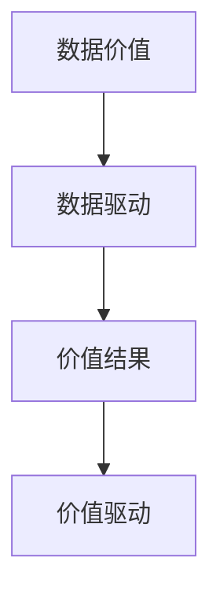

                 

# 平台经济的数据价值评估结果：如何评估价值结果？

> 关键词：平台经济,数据价值评估,价值结果,价值驱动,数据驱动

## 1. 背景介绍

在数字化转型的大背景下，平台经济作为一种新型经济形态迅速崛起。平台经济以数据为核心的运营模式，通过整合多边资源，驱动价值创造和增长。然而，数据价值的评估和管理成为平台经济中一个重要且复杂的议题。如何科学、系统地评估和优化平台经济中的数据价值，已成为业内和学界广泛关注的核心问题。

### 1.1 平台经济概述

平台经济通过构建多边市场，利用数据连接各参与方，实现资源的高效匹配和协同，推动价值的创造和转移。在平台经济中，数据不仅作为中间产品，还与生产要素一样，对平台运营和增长具有重要作用。平台通过数据的收集、处理和利用，能够为用户提供定制化服务，提升用户体验，降低运营成本，提高平台黏性和留存率，从而实现收入的增加和市场份额的扩大。

平台经济的核心特征包括：

- **多边市场**：平台汇集了消费者、商家、物流服务商等多方利益相关者，形成多边互动的生态系统。
- **网络效应**：平台的价值随着用户数量的增加而增强，用户之间通过数据交互增强平台吸引力。
- **数据驱动**：数据是平台决策和优化的重要依据，平台的算法和策略高度依赖于数据。

### 1.2 数据价值评估的重要性

数据价值的评估，不仅仅是技术层面的需求，更是业务战略的必要组成部分。数据价值评估的准确性直接影响平台运营的决策，包括资源配置、市场扩展、产品迭代等关键环节。科学的评估方法可以指导平台在数据获取、存储、处理、应用等方面进行精准投入，避免资源浪费，提升运营效率。

通过评估数据价值，平台可以实现以下目标：

- **优化资源配置**：明确不同数据源和数据集对平台运营的具体贡献，避免资源错配，提升投入产出比。
- **制定数据策略**：根据数据价值的评估结果，制定数据采集、存储、分析和应用策略，提升数据利用效率。
- **驱动业务增长**：基于数据价值评估，识别关键业务驱动因素，指导业务发展方向，实现收入和用户增长的双重目标。

## 2. 核心概念与联系

### 2.1 核心概念概述

为深入理解平台经济中数据价值评估的方法和原理，本节将介绍几个关键概念及其相互之间的联系：

- **数据价值**：指数据在平台运营中创造经济价值的能力，包括但不限于提升用户体验、降低运营成本、增加收入等。
- **数据驱动**：以数据为决策依据，通过数据分析和应用优化业务运营，提高效率和效果。
- **价值结果**：指通过数据价值评估和分析，指导平台运营过程中产生的具体业务结果，如用户增长、收入提升、成本降低等。
- **价值驱动**：通过数据价值评估，驱动平台向高价值业务方向发展，优化资源配置，提升平台竞争力。

这些概念通过以下Mermaid流程图来展示其联系：



该流程图展示了数据价值评估、数据驱动和价值结果之间的逻辑关系：

1. 数据价值评估是数据驱动的基础，通过评估数据在平台运营中的实际贡献，指导数据的应用。
2. 数据驱动是平台决策的重要依据，通过数据分析优化运营策略，实现价值创造。
3. 价值结果是数据驱动的具体表现，是平台通过数据驱动策略所取得的业务成果。
4. 价值驱动是数据价值的反馈机制，通过价值结果的评估，进一步调整和优化数据驱动策略。

### 2.2 核心概念原理和架构

平台经济中的数据价值评估，主要涉及以下几个关键要素：

- **数据采集与存储**：平台通过API接口、数据爬虫等方式收集多源数据，并进行存储和管理。
- **数据清洗与处理**：对原始数据进行去重、清洗、标准化处理，提升数据质量。
- **数据分析与建模**：采用统计分析、机器学习等技术对数据进行建模，提取价值信息。
- **价值评估与驱动**：结合业务场景，通过价值评估模型分析数据对平台运营的具体影响，指导数据驱动策略。

这些要素通过以下框架图来展示其相互关系：


该框架图展示了数据价值评估从数据采集到价值驱动的全流程：

1. 数据采集与存储：是数据价值评估的基础，平台通过多种方式获取高质量数据。
2. 数据清洗与处理：提升数据质量，确保数据分析的准确性和可靠性。
3. 数据分析与建模：采用数据分析和建模技术，提取数据中的有用信息。
4. 价值评估与驱动：通过价值评估，指导数据驱动策略，实现平台的价值创造。

## 3. 核心算法原理 & 具体操作步骤

### 3.1 算法原理概述

平台经济中的数据价值评估，通常基于数据驱动的模型和算法。其核心思想是通过多维度数据分析，量化数据在平台运营中的具体贡献，从而指导平台的决策和运营。

数据价值评估的流程大致如下：

1. **数据采集与存储**：通过API接口、数据爬虫等方式，收集平台业务相关的多源数据，并进行存储和管理。
2. **数据清洗与处理**：对原始数据进行去重、清洗、标准化处理，提升数据质量。
3. **数据分析与建模**：采用统计分析、机器学习等技术对数据进行建模，提取价值信息。
4. **价值评估与驱动**：结合业务场景，通过价值评估模型分析数据对平台运营的具体影响，指导数据驱动策略。

数据价值评估的数学模型通常包括以下几个步骤：

1. **数据特征选择**：选择影响业务结果的关键数据特征。
2. **数据预处理**：对数据进行归一化、标准化等预处理操作。
3. **建模与训练**：采用回归、分类、聚类等算法对数据进行建模，并使用训练数据集训练模型。
4. **价值评估**：通过测试数据集评估模型预测效果，输出数据价值评估结果。
5. **驱动策略优化**：根据评估结果，优化数据驱动策略，提升平台运营效果。

### 3.2 算法步骤详解

#### 3.2.1 数据采集与存储

平台通过API接口、数据爬虫等方式，从多源收集业务相关的数据。这些数据包括但不限于：

- 用户行为数据：如点击率、浏览量、购买记录等。
- 交易数据：如订单量、交易金额、支付渠道等。
- 社交互动数据：如评论、点赞、分享等。
- 设备与环境数据：如设备类型、地理位置、时间等。

数据存储通常采用关系型数据库（如MySQL、PostgreSQL）、非关系型数据库（如NoSQL、MongoDB）或分布式存储系统（如Hadoop、Spark）。

#### 3.2.2 数据清洗与处理

数据清洗与处理是数据价值评估的关键步骤，其目的是提升数据质量，确保后续分析的准确性。数据清洗与处理通常包括：

- **去重**：去除重复数据，保证数据的一致性和完整性。
- **缺失值处理**：处理缺失数据，如填补、删除或插值处理。
- **标准化**：对数据进行归一化、标准化等操作，提升数据的可比性和一致性。
- **异常值检测与处理**：识别和处理异常值，避免异常数据对分析结果的影响。

数据清洗与处理的工具包括Python的Pandas库、R语言等。

#### 3.2.3 数据分析与建模

数据分析与建模是数据价值评估的核心步骤，通过采用数据分析和建模技术，提取数据中的有用信息。具体步骤包括：

1. **特征工程**：选择和构造影响业务结果的关键特征，如用户行为特征、交易特征、社交特征等。
2. **模型选择与训练**：根据业务场景选择合适的算法，如回归、分类、聚类等，并使用训练数据集训练模型。
3. **模型评估与调优**：通过测试数据集评估模型预测效果，优化模型参数和结构，提升模型精度。

数据分析与建模的工具包括Python的Scikit-learn库、TensorFlow、Keras等。

#### 3.2.4 价值评估与驱动

价值评估与驱动是数据价值评估的最终目标，通过量化数据对平台运营的具体贡献，指导数据驱动策略。具体步骤包括：

1. **结果提取**：根据模型预测结果，提取数据对业务结果的具体影响。
2. **价值评估**：将业务结果转化为经济价值，如用户增长、收入提升、成本降低等。
3. **策略优化**：根据评估结果，优化数据驱动策略，提升平台运营效果。

价值评估与驱动的实现通常需要结合业务场景和数据特点进行定制化设计。

### 3.3 算法优缺点

#### 3.3.1 优点

1. **数据驱动**：基于数据价值评估，平台能够以数据为依据，优化运营策略，提升决策效率和效果。
2. **全面覆盖**：数据价值评估覆盖多维度、多场景，能够全面评估数据对平台运营的具体影响。
3. **精准优化**：通过量化数据贡献，指导数据驱动策略，优化资源配置，提升投入产出比。

#### 3.3.2 缺点

1. **数据质量依赖**：数据价值评估的结果高度依赖于数据质量，低质量数据可能导致评估结果不准确。
2. **算法复杂性**：数据分析与建模涉及多种算法，技术复杂性高，需要专业技能和资源。
3. **业务复杂性**：不同业务场景和数据特点需要定制化设计和实施，对业务理解要求高。

### 3.4 算法应用领域

数据价值评估的方法在平台经济中广泛应用于以下领域：

- **用户增长**：评估不同用户数据特征对用户增长的影响，指导用户获取策略优化。
- **收入提升**：分析交易数据、订单数据对收入的影响，优化销售和营销策略。
- **成本控制**：评估不同运营数据对成本的影响，优化成本控制策略。
- **风险管理**：评估风险数据对平台运营的影响，指导风险管理策略。
- **产品迭代**：分析用户反馈数据对产品迭代的影响，指导产品开发和优化。

## 4. 数学模型和公式 & 详细讲解

### 4.1 数学模型构建

平台经济中的数据价值评估模型，通常基于回归分析、分类分析、聚类分析等算法构建。以下以回归模型为例，展示其数学模型构建过程。

设平台运营数据集为 $D=\{(x_i,y_i)\}_{i=1}^N$，其中 $x_i$ 为输入特征向量，$y_i$ 为输出结果（如用户增长、收入提升等）。回归模型的目标是最小化预测误差，即：

$$
\min_{\theta} \frac{1}{N}\sum_{i=1}^N(y_i - \hat{y}_i)^2
$$

其中 $\hat{y}_i = \theta^T \phi(x_i)$，$\phi$ 为特征映射函数，$\theta$ 为模型参数。

### 4.2 公式推导过程

以下以线性回归模型为例，推导其梯度下降算法的具体实现步骤：

1. **模型定义**：
   $$
   \hat{y}_i = \theta^T \phi(x_i) = \theta^T \begin{bmatrix} x_{i1} \\ x_{i2} \\ \vdots \\ x_{ip} \end{bmatrix} = \sum_{j=1}^p \theta_j \phi_j(x_i)
   $$
   其中 $\theta = \begin{bmatrix} \theta_1 \\ \theta_2 \\ \vdots \\ \theta_p \end{bmatrix}$ 为模型参数。

2. **损失函数定义**：
   $$
   L(\theta) = \frac{1}{N}\sum_{i=1}^N(y_i - \hat{y}_i)^2 = \frac{1}{N}\sum_{i=1}^N(y_i - \theta^T \phi(x_i))^2
   $$

3. **梯度下降算法**：
   $$
   \theta \leftarrow \theta - \eta \nabla_{\theta}L(\theta) = \theta - \eta \frac{2}{N}\sum_{i=1}^N (y_i - \hat{y}_i)\phi(x_i)
   $$

4. **参数更新**：
   $$
   \theta \leftarrow \theta - \eta \nabla_{\theta}L(\theta) = \theta - \eta \frac{2}{N}\sum_{i=1}^N (y_i - \hat{y}_i)\phi(x_i)
   $$

### 4.3 案例分析与讲解

以电商平台为例，分析用户购买行为数据对收入的影响。

设电商平台用户购买行为数据为 $x=(\text{click\_rate}, \text{cart\_size}, \text{purchase\_amount})$，收入数据为 $y=\text{revenue}$。

1. **特征工程**：选择用户购买行为数据作为输入特征，设计线性回归模型。
2. **模型训练**：使用历史购买数据训练线性回归模型，最小化预测误差。
3. **模型评估**：使用测试数据集评估模型预测效果，输出模型参数 $\theta$。
4. **价值评估**：根据模型预测结果，计算用户购买行为数据对收入的具体影响，评估数据价值。

通过回归模型，电商平台能够量化用户购买行为数据对收入的贡献，指导销售和营销策略优化。

## 5. 项目实践：代码实例和详细解释说明

### 5.1 开发环境搭建

在进行数据价值评估实践前，我们需要准备好开发环境。以下是使用Python进行Scikit-learn和TensorFlow开发的环境配置流程：

1. 安装Anaconda：从官网下载并安装Anaconda，用于创建独立的Python环境。

2. 创建并激活虚拟环境：
```bash
conda create -n data-analysis-env python=3.8 
conda activate data-analysis-env
```

3. 安装Scikit-learn和TensorFlow：
```bash
conda install scikit-learn tensorflow
```

4. 安装相关工具包：
```bash
pip install numpy pandas matplotlib seaborn jupyter notebook ipython
```

完成上述步骤后，即可在`data-analysis-env`环境中开始数据价值评估实践。

### 5.2 源代码详细实现

下面以电商平台用户购买行为数据为例，给出使用Scikit-learn和TensorFlow进行数据价值评估的PyTorch代码实现。

首先，定义数据处理函数：

```python
from sklearn.model_selection import train_test_split
from sklearn.preprocessing import StandardScaler
from sklearn.linear_model import LinearRegression
from sklearn.metrics import mean_squared_error, r2_score
import tensorflow as tf

def preprocess_data(X, y):
    scaler = StandardScaler()
    X_scaled = scaler.fit_transform(X)
    return X_scaled, y
```

然后，定义模型训练和评估函数：

```python
def train_model(X_train, y_train, X_test, y_test):
    model = LinearRegression()
    model.fit(X_train, y_train)
    y_pred = model.predict(X_test)
    mse = mean_squared_error(y_test, y_pred)
    r2 = r2_score(y_test, y_pred)
    return mse, r2

def evaluate_model(X_train, y_train, X_test, y_test):
    mse, r2 = train_model(X_train, y_train, X_test, y_test)
    print(f"Mean Squared Error: {mse:.2f}")
    print(f"R-squared: {r2:.2f}")
```

最后，启动训练流程并在测试集上评估：

```python
from pandas import read_csv

# 读取数据集
data = read_csv('purchase_data.csv')

# 数据预处理
X = data[['click_rate', 'cart_size', 'purchase_amount']]
y = data['revenue']

# 数据标准化
X_scaled, y = preprocess_data(X, y)

# 分割数据集
X_train, X_test, y_train, y_test = train_test_split(X_scaled, y, test_size=0.2, random_state=42)

# 评估模型
evaluate_model(X_train, y_train, X_test, y_test)
```

以上就是使用Scikit-learn和TensorFlow进行电商平台用户购买行为数据价值评估的完整代码实现。可以看到，使用Python的Scikit-learn和TensorFlow进行数据价值评估的代码实现简洁高效。

### 5.3 代码解读与分析

让我们再详细解读一下关键代码的实现细节：

**preprocess_data函数**：
- 数据标准化：使用`StandardScaler`对数据进行归一化处理，提升数据质量。
- 返回标准化后的特征和标签。

**train_model函数**：
- 定义线性回归模型。
- 使用训练集训练模型，返回模型预测结果和评估指标。

**evaluate_model函数**：
- 调用`train_model`函数，输出评估指标。
- 使用`print`函数将评估结果打印输出。

**训练流程**：
- 加载数据集，并进行数据预处理。
- 分割数据集为训练集和测试集。
- 调用`evaluate_model`函数在测试集上评估模型。

可以看到，Scikit-learn和TensorFlow使得数据价值评估的代码实现变得简洁高效。开发者可以将更多精力放在数据处理、模型改进等高层逻辑上，而不必过多关注底层的实现细节。

## 6. 实际应用场景

### 6.1 智能推荐系统

智能推荐系统是数据价值评估的重要应用场景之一。平台通过用户行为数据和物品属性数据，建立用户和物品之间的关联模型，预测用户对不同物品的兴趣程度，从而进行个性化推荐。

在实际应用中，平台可以通过以下步骤进行数据价值评估：

1. **数据采集与存储**：收集用户浏览、点击、购买等行为数据，以及物品属性数据。
2. **数据清洗与处理**：对数据进行去重、清洗、标准化处理，提升数据质量。
3. **数据分析与建模**：采用协同过滤、矩阵分解等算法，建立用户和物品之间的关联模型。
4. **价值评估与驱动**：通过评估模型预测效果，指导推荐算法优化，提升推荐效果。

通过数据价值评估，智能推荐系统能够更加精准地识别用户兴趣点，提升推荐效果，增加用户满意度和黏性。

### 6.2 客户关系管理系统(CRM)

CRM系统是平台经济中数据价值评估的重要应用场景之一。平台通过客户数据，分析客户行为、价值和潜力，制定个性化营销策略，提升客户满意度和忠诚度。

在实际应用中，平台可以通过以下步骤进行数据价值评估：

1. **数据采集与存储**：收集客户基本信息、行为数据、互动数据等。
2. **数据清洗与处理**：对数据进行去重、清洗、标准化处理，提升数据质量。
3. **数据分析与建模**：采用聚类、分类等算法，分析客户行为、价值和潜力。
4. **价值评估与驱动**：通过评估模型预测效果，指导客户细分和个性化营销策略优化。

通过数据价值评估，CRM系统能够更加精准地识别高价值客户，制定个性化营销策略，提升客户满意度和忠诚度。

### 6.3 金融风控系统

金融风控系统是平台经济中数据价值评估的重要应用场景之一。平台通过用户行为数据和交易数据，分析用户风险水平，进行风险控制和预警。

在实际应用中，平台可以通过以下步骤进行数据价值评估：

1. **数据采集与存储**：收集用户行为数据、交易数据、历史违约记录等。
2. **数据清洗与处理**：对数据进行去重、清洗、标准化处理，提升数据质量。
3. **数据分析与建模**：采用风险评分模型、决策树等算法，分析用户风险水平。
4. **价值评估与驱动**：通过评估模型预测效果，指导风险控制策略优化。

通过数据价值评估，金融风控系统能够更加精准地识别高风险用户，进行风险控制和预警，降低违约率和损失。

### 6.4 未来应用展望

随着数据价值评估技术的不断发展，其在平台经济中的应用将更加广泛和深入。未来，数据价值评估将与更多前沿技术相结合，推动平台经济向更加智能化、普适化方向发展。

1. **多模态数据融合**：将文本、图像、视频等多种模态数据融合，提升数据价值评估的全面性和准确性。
2. **实时数据流处理**：采用实时数据流处理技术，提升数据价值评估的及时性和时效性。
3. **联邦学习**：在保护用户隐私的前提下，通过联邦学习技术，跨平台进行数据价值评估和优化。
4. **对抗性鲁棒性**：采用对抗性鲁棒性技术，提升数据价值评估模型的抗干扰能力和鲁棒性。
5. **模型可解释性**：采用可解释性技术，提升数据价值评估模型的透明度和可信度。

## 7. 工具和资源推荐

### 7.1 学习资源推荐

为帮助开发者系统掌握数据价值评估的理论基础和实践技巧，这里推荐一些优质的学习资源：

1. 《数据科学与机器学习》（Data Science and Machine Learning）：详细介绍了数据科学和机器学习的核心概念、算法和应用，适合初学者入门。
2. 《Python数据科学手册》（Python Data Science Handbook）：系统介绍了Python在数据科学中的应用，包括数据处理、分析、可视化等。
3. 《统计学习方法》（Statistical Learning Methods）：由李航教授撰写，全面介绍了机器学习的基本理论和算法。
4. 《深度学习》（Deep Learning）：由Ian Goodfellow等撰写，介绍了深度学习的基本概念、算法和应用。
5. 《机器学习实战》（Machine Learning in Action）：由Peter Harrington撰写，提供了大量实战项目和案例，适合动手实践。

通过对这些资源的学习实践，相信你一定能够快速掌握数据价值评估的精髓，并用于解决实际的平台经济问题。

### 7.2 开发工具推荐

高效的开发离不开优秀的工具支持。以下是几款用于数据价值评估开发的常用工具：

1. Jupyter Notebook：交互式编程环境，支持Python和R等多种语言，适合开发和调试数据价值评估模型。
2. Google Colab：谷歌推出的在线Jupyter Notebook环境，免费提供GPU/TPU算力，适合开发和测试最新模型，分享学习笔记。
3. TensorFlow：由Google主导开发的深度学习框架，生产部署方便，适合大规模工程应用。
4. PyTorch：基于Python的开源深度学习框架，灵活动态的计算图，适合快速迭代研究。
5. Scikit-learn：Python的机器学习库，提供了大量的预处理、建模和评估工具，适合快速开发和应用。

合理利用这些工具，可以显著提升数据价值评估任务的开发效率，加快创新迭代的步伐。

### 7.3 相关论文推荐

数据价值评估技术的发展源于学界的持续研究。以下是几篇奠基性的相关论文，推荐阅读：

1. "A Survey of Data Mining Algorithms for E-commerce"（《电子商务数据挖掘算法综述》）：由Mana等撰写，综述了多种数据挖掘算法在电子商务中的应用。
2. "Broaden Your Horizons with a Full-Featured, Extensible Open-Source Data Analysis Platform"（《使用全面的、可扩展的开源数据分析平台拓宽视野》）：由O'Dowd等撰写，介绍了Python的数据分析和可视化工具。
3. "The Illustrated Guide to Data Engineering: Extracting, Transforming, and Loading Data for Data Science"（《数据工程指南：数据提取、转换和加载》）：由Zinkevich等撰写，详细介绍了数据工程的核心概念和实践。
4. "Data Science and Statistical Learning: Foundations, Methods, and Software"（《数据科学与统计学习：基础、方法和软件》）：由Deisenroth等撰写，介绍了数据科学和统计学习的基本理论和算法。
5. "Machine Learning Yearning"（《机器学习实践》）：由Andrew Ng撰写，提供了大量的机器学习实践案例和经验，适合实战学习。

这些论文代表了大数据价值评估技术的发展脉络。通过学习这些前沿成果，可以帮助研究者把握学科前进方向，激发更多的创新灵感。

## 8. 总结：未来发展趋势与挑战

### 8.1 总结

本文对平台经济中的数据价值评估方法进行了全面系统的介绍。首先阐述了数据价值评估在平台经济中的重要性，明确了数据价值评估在平台运营中的关键作用。其次，从原理到实践，详细讲解了数据价值评估的数学模型和核心算法，给出了数据价值评估任务开发的完整代码实例。同时，本文还探讨了数据价值评估在智能推荐系统、CRM系统、金融风控系统等多个平台经济场景中的应用，展示了数据价值评估的广泛应用价值。此外，本文精选了数据价值评估的学习资源和开发工具，力求为读者提供全方位的技术指引。

通过本文的系统梳理，可以看到，数据价值评估方法在平台经济中具有重要的理论和实践意义。其能够通过数据驱动策略，优化资源配置，提升平台运营效果，助力平台经济的持续增长和创新。

### 8.2 未来发展趋势

展望未来，数据价值评估技术将呈现以下几个发展趋势：

1. **自动化与智能化**：数据价值评估的自动化水平将进一步提升，结合人工智能和机器学习技术，实现智能化的数据评估和优化。
2. **多模态融合**：将文本、图像、视频等多种模态数据融合，提升数据价值评估的全面性和准确性。
3. **实时与动态**：采用实时数据流处理技术，提升数据价值评估的及时性和时效性。
4. **联邦学习**：在保护用户隐私的前提下，通过联邦学习技术，跨平台进行数据价值评估和优化。
5. **对抗性鲁棒性**：采用对抗性鲁棒性技术，提升数据价值评估模型的抗干扰能力和鲁棒性。
6. **模型可解释性**：采用可解释性技术，提升数据价值评估模型的透明度和可信度。

这些趋势将推动数据价值评估技术向更加智能化、普适化和安全化的方向发展，为平台经济带来更高效、更智能、更可靠的数据驱动策略。

### 8.3 面临的挑战

尽管数据价值评估技术已经取得了显著进展，但在实际应用中仍面临诸多挑战：

1. **数据质量问题**：数据质量对数据价值评估的准确性有重要影响。低质量的数据可能导致评估结果偏差，影响决策效果。
2. **技术复杂性**：数据价值评估涉及多种算法和工具，技术复杂性高，需要专业技能和资源。
3. **隐私与安全**：数据价值评估涉及大量用户数据，需要严格保护用户隐私，防止数据泄露和安全风险。
4. **跨平台融合**：数据价值评估需要在多平台进行融合，不同平台的数据格式和处理方式可能不一致，需要协调优化。
5. **动态变化**：平台经济中的数据分布和用户行为不断变化，需要实时更新模型和策略，保持评估结果的准确性。

面对这些挑战，未来的研究需要在以下几个方面进行突破：

1. **数据治理与质量管理**：建立完善的数据治理体系，确保数据质量，提升数据价值评估的准确性。
2. **技术自动化与智能化**：开发自动化和智能化的评估工具，降低技术复杂性，提升评估效率。
3. **隐私与安全保护**：采用隐私保护技术和安全措施，确保数据价值评估过程中的隐私保护和安全防护。
4. **跨平台数据融合**：构建跨平台数据融合技术，确保数据一致性和兼容性，提升数据价值评估的全面性。
5. **动态评估与优化**：采用动态评估和优化技术，确保数据价值评估的实时性和准确性。

这些突破将推动数据价值评估技术在平台经济中的应用，为平台经济的持续增长和创新提供重要保障。

### 8.4 研究展望

未来的研究需要在以下几个方面进行深入探索：

1. **自动化评估与优化**：开发自动化评估工具，实现数据价值评估的自动化和智能化，提升评估效率。
2. **多模态数据融合**：研究多模态数据融合技术，提升数据价值评估的全面性和准确性。
3. **隐私与安全保护**：开发隐私保护和安全技术，确保数据价值评估过程中的隐私保护和安全防护。
4. **动态评估与优化**：研究动态评估和优化技术，确保数据价值评估的实时性和准确性。
5. **跨平台数据融合**：研究跨平台数据融合技术，确保数据一致性和兼容性，提升数据价值评估的全面性。
6. **模型可解释性**：研究可解释性技术，提升数据价值评估模型的透明度和可信度。

这些研究方向将推动数据价值评估技术在平台经济中的应用，为平台经济的持续增长和创新提供重要保障。相信随着技术的不断进步，数据价值评估方法将更加智能、普适和可靠，为平台经济带来更大的发展动力和机遇。

## 9. 附录：常见问题与解答

**Q1：什么是数据价值评估？**

A: 数据价值评估是指通过数据分析和建模，量化数据在平台运营中的具体贡献，从而指导数据驱动策略，提升平台运营效果的评估方法。

**Q2：数据价值评估的主要步骤有哪些？**

A: 数据价值评估的主要步骤包括：数据采集与存储、数据清洗与处理、数据分析与建模、价值评估与驱动。

**Q3：数据价值评估在平台经济中有哪些应用？**

A: 数据价值评估在平台经济中广泛应用于智能推荐系统、客户关系管理系统、金融风控系统等多个场景，用于指导平台运营策略优化，提升业务效果。

**Q4：如何进行数据价值评估？**

A: 数据价值评估通常采用回归分析、分类分析、聚类分析等算法，通过训练数据集构建模型，并使用测试数据集评估模型预测效果。

**Q5：数据价值评估有哪些优缺点？**

A: 数据价值评估的优点包括数据驱动、全面覆盖和精准优化。缺点包括数据质量依赖、技术复杂性和业务复杂性。

---

作者：禅与计算机程序设计艺术 / Zen and the Art of Computer Programming

