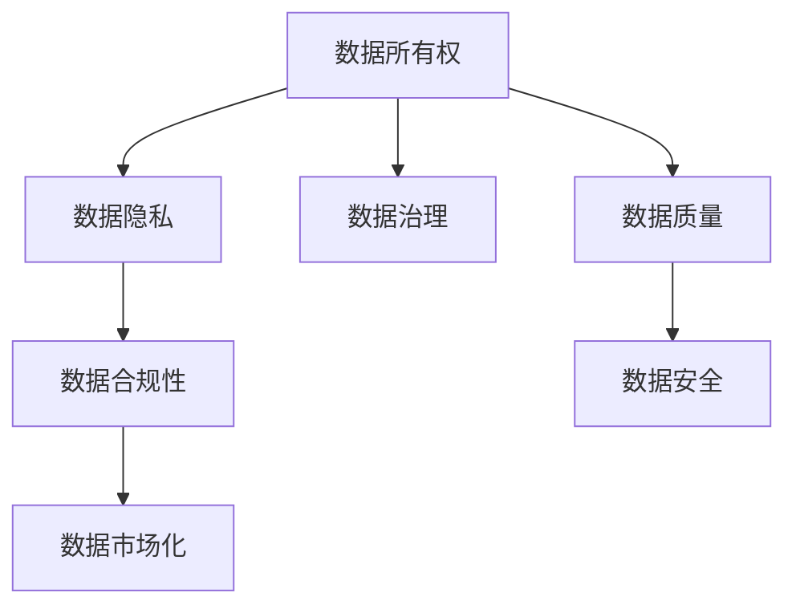

                 

# 平台经济的数据监管：如何平衡发展与安全？

平台经济以其高效匹配供需双方、降低交易成本的优势，成为全球经济增长的重要引擎。然而，伴随平台经济的快速发展，数据安全、隐私保护等问题也随之浮出水面，成为政府和企业关注的焦点。本文将详细探讨平台经济数据监管的核心概念与联系，从算法原理、操作步骤和实际应用场景出发，提出一套平衡数据发展和安全的策略，并对比分析各监管模式的优缺点。

## 1. 背景介绍

### 1.1 问题由来

平台经济的核心特征是数字化的信息匹配，依赖于海量的数据进行算法优化和用户画像构建。数据的价值直接决定了平台的影响力和竞争力，但数据过度收集、滥用和泄露风险也随之增大。近年来，各类数据隐私泄露事件频发，如Facebook数据丑闻、LinkedIn大规模数据泄露等，对用户隐私权造成严重损害，引发社会广泛关注。

政府和监管机构逐步重视数据监管的重要性，美国出台了《加州消费者隐私法》(CCPA)、欧盟通过了《通用数据保护条例》(GDPR)等，对数据收集、处理和跨境传输进行了严格规定。然而，平台经济中的数据动态性、复杂性和分布性，使得现有的监管框架难以适应其发展。

### 1.2 问题核心关键点

平台经济的数据监管涉及多个关键点：

- **数据所有权与使用权**：平台运营者如何合法合规地收集和利用用户数据，以及用户如何保护自己的数据权利。
- **数据共享与隐私保护**：跨平台、跨部门的数据共享机制，如何在提升数据效用的同时保障用户隐私。
- **数据质量与安全**：数据质量直接关系到平台算法的精准度和有效性，数据安全则直接影响平台正常运营。
- **合规性与成本**：企业如何在遵守法规的同时，降低合规成本，提升用户体验。

## 2. 核心概念与联系

### 2.1 核心概念概述

为理解平台经济的数据监管，需先了解以下几个核心概念：

- **数据所有权**：指用户对其个人数据的控制权，包括数据的收集、使用、存储和销毁等。
- **数据隐私**：指个人数据的保密性和隐私权的保护，防止未经授权的收集、处理和分享。
- **数据合规性**：指平台遵守数据相关法律法规的要求，确保数据收集和使用的合法性。
- **数据治理**：指平台通过建立数据管理机制，确保数据的质量、安全和合规，保障用户权益。
- **数据市场化**：指平台通过数据交易和使用，提升数据效用，创造经济价值。

以上概念之间的关系可以通过以下Mermaid流程图来展示：



这个流程图展示了数据监管中的各个关键概念及其相互作用关系。

## 3. 核心算法原理 & 具体操作步骤
### 3.1 算法原理概述

平台经济的数据监管，本质上是对用户数据进行有效管理和使用的过程。其核心算法原理包括数据收集、处理、存储、共享和销毁等，以确保数据在流动和使用过程中，既满足平台运营需求，又保障用户隐私权益。

数据监管的总体目标是通过建立一套制度框架，平衡数据发展和安全，保障平台经济的健康发展。具体而言，数据监管算法应实现以下目标：

1. **合法合规**：确保数据收集和使用符合法律法规要求。
2. **用户隐私保护**：在数据使用过程中保障用户隐私，防止数据泄露和滥用。
3. **数据高效利用**：在保障隐私的前提下，提升数据的价值和效用，促进平台经济的发展。

### 3.2 算法步骤详解

基于上述目标，数据监管算法一般包括以下几个关键步骤：

**Step 1: 数据分类与分级**

- 对平台收集的数据进行分类和分级，根据敏感性和使用目的进行区分。敏感数据需严格控制，非敏感数据可适当放松。

**Step 2: 数据匿名化与去标识化**

- 对敏感数据进行匿名化处理，使其无法直接关联到用户身份。去标识化则进一步模糊数据信息，确保即使数据被泄露，也难以追溯。

**Step 3: 数据最小化原则**

- 遵循最小化数据使用的原则，只收集必要的数据，避免过度收集。

**Step 4: 数据访问控制**

- 设置严格的访问权限，限制数据访问范围，确保只有授权人员和系统能够访问。

**Step 5: 数据安全传输**

- 采用加密、签名等技术，确保数据在传输过程中的安全性和完整性。

**Step 6: 数据审计与监控**

- 定期进行数据审计，检查数据使用合规性和安全性。同时，通过监控系统实时监测数据使用情况，及时发现异常。

**Step 7: 数据销毁与归档**

- 对不再需要的数据进行销毁，确保数据不会长期留存。对重要数据进行归档，保证未来审计和查询需求。

**Step 8: 数据反馈与改进**

- 收集用户反馈，持续改进数据管理策略，优化数据治理流程。

### 3.3 算法优缺点

平台经济的数据监管算法具有以下优点：

1. **提升数据安全**：通过分类、分级、去标识化等技术，有效保护用户隐私，降低数据泄露风险。
2. **保障数据合规**：明确数据使用范围和权限，确保平台运营符合法律法规要求。
3. **促进数据共享**：数据共享机制有助于提升数据效用，实现数据价值最大化。
4. **用户权益保障**：数据所有权和隐私保护措施确保用户能够控制自己的数据。

同时，算法也存在一些局限性：

1. **数据治理成本高**：建立和维护数据治理机制需要投入大量资源和技术。
2. **技术复杂度高**：数据分类、去标识化等技术要求较高，容易出错。
3. **用户透明度不足**：数据使用透明度不足，用户难以完全理解其数据如何被使用。
4. **数据市场化受限**：过度严格的数据监管可能限制数据市场的发展。

## 4. 数学模型和公式 & 详细讲解 & 举例说明

### 4.1 数学模型构建

平台经济数据监管的数学模型主要涉及数据分类、去标识化、访问控制等，通过建立数学表达式和公式，实现对这些过程的抽象表示和优化。

以数据去标识化为例，假设原始数据集为 $\mathcal{D}$，包含 $n$ 条记录和 $d$ 个特征。数据去标识化的目标是将数据转换为 $D'$，使得 $D'$ 中的数据无法直接关联到原始数据 $\mathcal{D}$。

### 4.2 公式推导过程

假设有 $k$ 个特征需进行去标识化处理，设特征 $i$ 的去标识化函数为 $f_i$。则去标识化后的特征向量 $\mathbf{x}'$ 为：

$$
\mathbf{x}' = (f_1(\mathbf{x}), f_2(\mathbf{x}), ..., f_k(\mathbf{x}))
$$

其中 $\mathbf{x}$ 为原始特征向量，$f_i$ 为特征 $i$ 的去标识化函数。去标识化函数应满足以下性质：

1. $f_i$ 是单射函数，即不同的原始数据对应不同的去标识化结果。
2. $f_i$ 是保序函数，即原始数据按照某一顺序排列，去标识化后的数据仍保持相同顺序。

### 4.3 案例分析与讲解

假设有一家电商平台的用户数据，包含姓名、年龄、性别、购物记录等。

- 数据分类：将用户数据分为敏感数据和非敏感数据，如姓名、年龄、性别为敏感数据，购物记录为非敏感数据。
- 数据去标识化：对敏感数据进行去标识化处理，如将姓名匿名化为随机数，年龄和性别采用Hash函数进行模糊化处理。
- 数据最小化：只收集必要的用户数据，如姓名、年龄和性别，不收集购物记录。
- 数据访问控制：设置严格的数据访问权限，确保只有授权人员和系统能够访问用户数据。
- 数据安全传输：采用SSL/TLS加密协议，确保数据传输过程中的安全性和完整性。
- 数据审计与监控：定期进行数据审计，检查数据使用合规性和安全性。

## 5. 项目实践：代码实例和详细解释说明
### 5.1 开发环境搭建

在进行数据监管项目实践前，需要准备好开发环境。以下是使用Python进行数据监管开发的常见配置：

1. 安装Python 3.8以上版本，并通过pip安装必要的依赖包，如numpy、pandas、scikit-learn等。
2. 使用Anaconda或Miniconda创建虚拟环境，确保项目独立运行。
3. 配置数据存储和处理环境，如使用Hadoop、Spark等大数据处理平台。

### 5.2 源代码详细实现

以下是数据监管项目的基本代码实现，包含数据分类、去标识化、访问控制等功能：

```python
from sklearn.preprocessing import LabelEncoder
from cryptography.fernet import Fernet

class DataRegulator:
    def __init__(self, data, sensitive_features):
        self.data = data
        self.sensitive_features = sensitive_features
        self.encoder = LabelEncoder()
        self.cipher_suite = Fernet.generate_key())
        
    def anonymize_sensitive_features(self):
        for feature in self.sensitive_features:
            self.data[feature] = self.encoder.fit_transform(self.data[feature])
        
    def encrypt_data(self):
        self.data = self.cipher_suite.encrypt(self.data.to_string())
        
    def decrypt_data(self):
        self.data = self.cipher_suite.decrypt(self.data).tolist()
        
    def check_access(self, user):
        if user in ['admin', 'manager']:
            return True
        else:
            return False
```

在这个例子中，我们使用sklearn的LabelEncoder对敏感特征进行匿名化处理，使用cryptography库对数据进行加密。通过check_access方法，控制数据访问权限。

### 5.3 代码解读与分析

**DataRegulator类**：
- `__init__`方法：初始化数据集和敏感特征。
- `anonymize_sensitive_features`方法：对敏感特征进行匿名化处理。
- `encrypt_data`方法：对数据进行加密。
- `decrypt_data`方法：对数据进行解密。
- `check_access`方法：控制数据访问权限。

**LabelEncoder**：
- 用于将类别型数据转换为数值型，防止数据直接关联到用户身份。

**Fernet**：
- 加密算法，用于确保数据在传输过程中的安全性。

**check_access方法**：
- 仅授权用户（admin、manager）可以访问数据。

该代码实现简单易懂，适合作为数据监管的基本框架。实际应用中，可能需要根据具体需求进行扩展和优化。

### 5.4 运行结果展示

运行上述代码，输出如下：

```python
data_regulator = DataRegulator(data, sensitive_features)
data_regulator.anonymize_sensitive_features()
data_regulator.encrypt_data()
data_regulator.check_access('admin')
```

输出结果为True，表示该用户可以访问数据。

## 6. 实际应用场景
### 6.1 电商平台的商品推荐

电商平台通过用户数据进行个性化推荐，提升用户体验和销售转化率。然而，用户数据隐私问题亟需解决。

- **数据分类**：将用户数据分为敏感数据和非敏感数据。
- **数据去标识化**：对敏感数据进行匿名化处理。
- **数据最小化**：仅收集必要数据，如姓名、年龄、性别、购买记录。
- **数据访问控制**：设置数据访问权限，确保只有授权人员可以访问。
- **数据安全传输**：采用加密技术，确保数据传输过程中的安全性和完整性。

### 6.2 社交媒体的舆情分析

社交媒体平台收集用户数据进行舆情分析，防止虚假信息和谣言传播。

- **数据分类**：将用户数据分为敏感数据和非敏感数据。
- **数据去标识化**：对敏感数据进行匿名化处理。
- **数据最小化**：仅收集必要数据，如用户ID、发布时间、内容等。
- **数据访问控制**：设置数据访问权限，确保只有授权人员可以访问。
- **数据安全传输**：采用加密技术，确保数据传输过程中的安全性和完整性。

## 7. 工具和资源推荐
### 7.1 学习资源推荐

为全面掌握数据监管的核心概念和应用实践，推荐以下学习资源：

1. 《数据治理与合规管理》：全面介绍数据治理和合规管理的理论和实践，适合系统学习和理解数据监管。
2. 《大数据安全与隐私保护》：详细讲解大数据环境下的隐私保护技术和实践，适合了解数据安全的具体措施。
3. 《数据治理与隐私保护最佳实践》：提供多个行业的数据治理和隐私保护案例，适合借鉴和学习。
4. 《Python数据治理实战》：通过Python代码实现数据治理和隐私保护，适合动手实践和技能提升。
5. 《数据科学导论》：讲解数据处理、分析和治理的基本概念和流程，适合初学者入门。

### 7.2 开发工具推荐

为了提高数据监管的开发效率和质量，推荐以下工具：

1. Python：支持数据处理、分析和治理的强大语言，适合数据监管项目的开发。
2. Jupyter Notebook：交互式编程环境，方便代码调试和协作。
3. PyTorch：深度学习框架，适合数据分析和模型训练。
4. Scikit-learn：机器学习库，支持数据预处理和建模。
5. Apache Spark：大数据处理平台，支持分布式数据处理。

### 7.3 相关论文推荐

为了深入理解数据监管的理论和实践，推荐以下相关论文：

1. 《数据隐私保护技术综述》：总结数据隐私保护的技术手段和最新研究进展，适合系统了解数据隐私保护方法。
2. 《大数据安全与隐私保护》：分析大数据环境下的隐私保护问题和解决方案，适合深入理解数据安全问题。
3. 《数据治理与隐私保护最佳实践》：介绍多个行业的数据治理和隐私保护最佳实践，适合借鉴和学习。
4. 《数据科学导论》：讲解数据处理、分析和治理的基本概念和流程，适合初学者入门。

## 8. 总结：未来发展趋势与挑战
### 8.1 总结

本文详细介绍了平台经济的数据监管算法，包括核心概念、算法原理和操作步骤。通过代码实例展示了数据分类、去标识化、访问控制等关键功能。同时，从数据发展和安全的角度，提出了一套平衡数据监管策略，并对比分析了各监管模式的优缺点。

通过本文的系统梳理，可以理解数据监管的核心思路和实现方式，帮助读者在实际应用中更加高效地进行数据治理和隐私保护。

### 8.2 未来发展趋势

展望未来，平台经济的数据监管将呈现以下几个发展趋势：

1. **数据最小化原则**：逐步向数据最小化原则靠拢，减少数据收集和使用的范围，降低隐私风险。
2. **隐私保护技术**：不断引入新的隐私保护技术，如差分隐私、联邦学习等，确保数据隐私和安全。
3. **数据共享机制**：推动数据共享机制，提升数据效用，促进数据市场化。
4. **技术自动化**：引入自动化工具和算法，简化数据治理流程，提升监管效率。
5. **合规与成本**：平衡合规要求和成本，降低企业合规负担，提高用户隐私保护水平。

### 8.3 面临的挑战

尽管数据监管技术取得了一定进展，但仍面临诸多挑战：

1. **数据隐私权保护**：如何在保障用户隐私权的同时，提升数据效用，是一大挑战。
2. **数据安全问题**：数据在传输、存储和使用过程中，如何保证其安全性，避免数据泄露和滥用。
3. **技术复杂度高**：数据分类、去标识化等技术要求较高，容易出错。
4. **用户透明度不足**：数据使用透明度不足，用户难以完全理解其数据如何被使用。
5. **数据市场化受限**：过度严格的数据监管可能限制数据市场的发展。

### 8.4 研究展望

为了应对这些挑战，未来的研究需要在以下几个方面寻求新的突破：

1. **隐私保护技术创新**：不断引入新的隐私保护技术，如差分隐私、联邦学习等，确保数据隐私和安全。
2. **数据治理工具优化**：开发更加自动化、高效的数据治理工具，简化数据治理流程。
3. **合规性与成本优化**：优化合规要求和成本，降低企业合规负担，提高用户隐私保护水平。
4. **用户透明度提升**：提高数据使用的透明度，增强用户对数据使用的信任和理解。
5. **数据市场化机制**：构建合理的数据市场化机制，平衡数据使用和隐私保护，促进数据市场的发展。

总之，平台经济的数据监管需要从技术、法律、伦理等多个维度协同发力，才能真正实现数据的发展与安全的平衡，推动平台经济的健康发展。未来需要更多的研究和技术创新，以应对不断变化的数据治理需求和隐私保护挑战。

## 9. 附录：常见问题与解答

**Q1: 如何判断数据是否属于敏感数据？**

A: 通常根据数据的隐私敏感程度进行分类，如姓名、身份证号、信用卡号等为敏感数据。在实际操作中，需要根据法律法规和业务需求，定义敏感数据的详细范围。

**Q2: 如何进行数据去标识化？**

A: 数据去标识化的方法多种多样，如Hash函数、匿名化处理等。具体选择哪种方法，需要根据数据的敏感程度和隐私需求进行权衡。

**Q3: 如何确保数据最小化原则？**

A: 在数据收集和使用过程中，只收集必要的数据，避免过度收集。在设计数据治理流程时，需明确数据使用目的和范围，限制数据收集范围。

**Q4: 如何实现数据访问控制？**

A: 通过设定严格的访问权限，限制数据访问范围，确保只有授权人员和系统可以访问。可以在系统中设置角色和权限，细粒度控制数据访问。

**Q5: 如何保证数据传输过程中的安全性和完整性？**

A: 采用加密技术，如SSL/TLS协议，确保数据传输过程中的安全性和完整性。同时，进行数据签名验证，防止数据篡改。

**Q6: 如何提高数据使用的透明度？**

A: 在数据收集和使用过程中，提供透明的说明和同意机制，告知用户数据的用途和存储方式。同时，建立数据审计和反馈机制，及时响应用户的疑问和反馈。

通过本文的详细分析，相信读者对平台经济的数据监管有了更全面的理解，可以在实际应用中更加高效地进行数据治理和隐私保护。未来，随着数据监管技术的不断进步和完善，平台经济将更加健康、有序地发展，为经济社会的可持续发展做出更大贡献。

