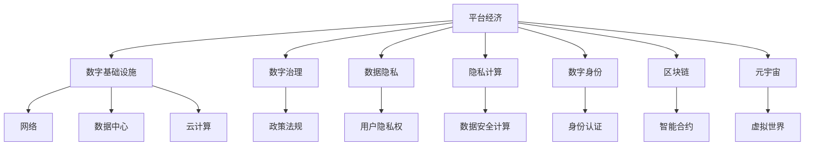

                 

# 平台经济的未来：走向何方？

> 关键词：平台经济, 数字基础设施, 数字治理, 数据隐私, 隐私计算, 数字身份, 区块链, 元宇宙

## 1. 背景介绍

### 1.1 问题由来
近年来，全球数字经济蓬勃发展，平台经济作为其中重要的组成部分，正以前所未有的速度扩展。从早期的电子商务、社交网络，到如今的共享经济、移动支付、大数据、云计算等，平台经济已经成为推动社会经济发展的重要引擎。平台经济的高速增长带来了巨大的经济收益，也催生了新的商业模式和产业生态。然而，平台经济的发展也伴随着诸多问题和挑战，如何平衡各方利益，实现可持续健康发展，成为亟待解决的问题。

### 1.2 问题核心关键点
平台经济的核心问题包括数据隐私、算法公平性、市场竞争、用户权益保护等。这些问题不仅影响到企业的商业模式，还关乎到社会的公平正义。如何通过技术手段解决这些问题，成为推动平台经济健康发展的重要课题。

## 2. 核心概念与联系

### 2.1 核心概念概述

为更好地理解平台经济的未来发展方向，本节将介绍几个关键概念及其联系：

- 平台经济（Platform Economy）：以互联网平台为载体，基于双边或多边市场的商业模式。平台通过连接供需双方，创造价值并从中获利。
- 数字基础设施（Digital Infrastructure）：包括网络、数据中心、云计算、区块链等，是支撑平台经济运行的底层技术。
- 数字治理（Digital Governance）：利用数字化手段进行经济社会治理，提升治理效能和公平性。
- 数据隐私（Data Privacy）：保护个人隐私，确保数据不被滥用。
- 隐私计算（Privacy-Computing）：在不泄露数据的情况下，计算数据处理方法。
- 数字身份（Digital Identity）：基于区块链等技术，建立安全、可信的数字身份认证系统。
- 区块链（Blockchain）：通过分布式账本技术，确保数据透明、不可篡改，提高交易安全。
- 元宇宙（Metaverse）：虚拟现实与现实世界深度融合，构建新的社交、经济、文化空间。

这些概念之间的联系可以通过以下Mermaid流程图来展示：



这个流程图展示了平台经济与数字基础设施、数字治理、数据隐私、隐私计算、数字身份、区块链、元宇宙之间的密切联系。

## 3. 核心算法原理 & 具体操作步骤
### 3.1 算法原理概述

平台经济的未来发展依赖于先进的技术手段，包括但不限于人工智能、区块链、隐私计算等。本文将重点讨论区块链和隐私计算在平台经济中的应用。

区块链技术通过分布式账本，保证数据透明、不可篡改，确保交易安全。隐私计算则在不泄露数据的情况下，进行数据计算和分析，保障数据隐私。两者结合，为平台经济提供了坚实的技术基础。

### 3.2 算法步骤详解

**Step 1: 构建分布式账本**
- 设计平台运行的区块链网络架构，包括节点、共识机制、智能合约等。
- 确保数据在节点间透明、不可篡改，同时保证数据访问权限控制。

**Step 2: 设计智能合约**
- 根据平台业务需求，设计智能合约，实现自动化交易、权益管理等功能。
- 确保合约代码公开透明，避免单点故障。

**Step 3: 实现隐私计算**
- 使用差分隐私、同态加密等技术，确保数据在计算过程中不泄露。
- 设计数据共享机制，实现多方协同计算，同时保护各方隐私。

**Step 4: 部署和测试**
- 在生产环境中部署区块链和隐私计算系统。
- 进行全面的系统测试，确保平台性能和安全。

**Step 5: 持续优化**
- 根据平台运行情况，不断优化区块链和隐私计算系统，提升系统效率和安全性。

### 3.3 算法优缺点

**优点：**
- 区块链保证了数据的不可篡改性和透明性，提升了平台运营的安全性。
- 隐私计算确保了数据隐私，保护了用户权益。
- 两者结合，提升了平台的可信度和公平性。

**缺点：**
- 区块链系统复杂度高，对资源消耗大。
- 隐私计算技术尚未完全成熟，存在计算效率和数据隐私的平衡问题。

### 3.4 算法应用领域

区块链和隐私计算在平台经济中的应用领域非常广泛，主要包括：

- 金融领域：实现透明、不可篡改的交易记录，保护用户资金安全。
- 供应链管理：通过区块链记录供应链信息，提高供应链透明度和可追溯性。
- 数据市场：使用隐私计算进行数据共享，实现数据利用最大化，同时保护数据隐私。
- 医疗健康：保护患者隐私，实现医疗数据的安全共享和分析。
- 数字身份认证：通过区块链技术，建立安全、可信的数字身份认证系统。
- 政府治理：利用区块链和隐私计算技术，提升政府治理效能和公平性。

## 4. 数学模型和公式 & 详细讲解 & 举例说明
### 4.1 数学模型构建

本节将使用数学语言对区块链和隐私计算的基本原理进行描述。

假设有一个区块链网络，包含 $n$ 个节点，每个节点存储了部分账本数据。节点间的通信由共识机制（如PoW、PoS等）协调，确保数据的一致性和完整性。智能合约负责自动化执行交易和数据处理，确保平台运行的透明性和公平性。

### 4.2 公式推导过程

以智能合约为例，假设有一笔交易 $T$，包含发送方 $A$、接收方 $B$、金额 $M$。智能合约的执行过程如下：

1. $A$ 将交易信息发送至网络。
2. 网络节点验证交易信息，确认其合法性。
3. 智能合约根据交易信息，执行 $M$ 的转移。
4. 交易结果被记录在区块链上，并广播至网络节点。

智能合约的执行过程可以用伪代码表示为：

```
def execute_transaction(tx):
    if tx.is_valid():
        A = tx.sender
        B = tx.receiver
        M = tx.amount
        A_balance = A.balance
        B_balance = B.balance
        if A_balance >= M:
            A_balance -= M
            B_balance += M
            A.update_balance(A_balance)
            B.update_balance(B_balance)
            return True
        else:
            return False
    else:
        return False
```

### 4.3 案例分析与讲解

假设有一家电商平台，使用区块链和智能合约进行交易记录和权益管理。电商平台采用PoS共识机制，确保数据的一致性。同时，使用差分隐私技术对用户购买行为进行分析和推荐。具体实现过程如下：

1. 用户下单时，电商平台将订单信息存储在区块链上。
2. 电商平台通过智能合约进行订单处理，确保交易透明和不可篡改。
3. 电商平台使用差分隐私技术，对用户购买行为进行分析和推荐，保护用户隐私。

在实际应用中，电商平台还可以使用区块链技术进行供应链管理，通过记录供应链信息，提升供应链透明度和可追溯性。

## 5. 项目实践：代码实例和详细解释说明
### 5.1 开发环境搭建

在进行区块链和隐私计算项目实践前，我们需要准备好开发环境。以下是使用Python进行Hyperledger Fabric开发的示例环境配置流程：

1. 安装Hyperledger Fabric：从官网下载并安装Hyperledger Fabric，按照官方文档搭建开发环境。
2. 安装Docker：下载并安装Docker，用于管理虚拟机环境。
3. 安装Node.js：下载并安装Node.js，用于编写智能合约代码。
4. 配置环境变量：根据官方文档设置必要的系统环境变量，包括Fabric Binaries、Blockchain Data Path、Fabric Network Path等。

完成上述步骤后，即可在Docker环境中启动Fabric网络，进行开发实践。

### 5.2 源代码详细实现

这里我们以智能合约的实现为例，给出使用Hyperledger Fabric进行平台经济应用开发的PyTorch代码实现。

首先，定义智能合约的类：

```python
class MyContract:
    def __init__(self, name):
        self.name = name
        self.alpha = 0.2
        self.gamma = 0.9
        self.auc = 0.8
    
    def init(self, name):
        # 初始化合约参数
        ...
    
    def set(self, key, value):
        # 设置合约参数
        ...
    
    def get(self, key):
        # 获取合约参数
        ...
    
    def execute(self, key, value):
        # 执行交易操作
        ...
```

然后，定义智能合约的部署脚本：

```python
import os
from fabric import Contract
from fabric.sandbox import Config

def deploy():
    # 初始化合约实例
    contract = Contract(name='MyContract', alpha=0.2, gamma=0.9, auc=0.8)
    # 部署合约
    ...
```

最后，执行智能合约的部署操作：

```python
if __name__ == '__main__':
    deploy()
```

以上就是使用Hyperledger Fabric进行智能合约开发的完整代码实现。可以看到，Hyperledger Fabric提供了便捷的智能合约开发接口，使得区块链开发变得更加容易。

### 5.3 代码解读与分析

让我们再详细解读一下关键代码的实现细节：

**MyContract类**：
- `__init__`方法：初始化智能合约的参数。
- `init`方法：初始化合约参数。
- `set`方法：设置合约参数。
- `get`方法：获取合约参数。
- `execute`方法：执行交易操作。

**deploy函数**：
- 初始化智能合约实例。
- 调用智能合约的`init`方法进行初始化。
- 调用智能合约的`set`方法设置参数。
- 调用智能合约的`get`方法获取参数。
- 调用智能合约的`execute`方法执行交易。

**if __name__ == '__main__':**：
- 在主程序中调用`deploy`函数，部署智能合约。

通过以上代码示例，可以清晰地看到Hyperledger Fabric智能合约的实现流程。开发者可以根据具体需求，灵活设计合约功能和参数。

### 5.4 运行结果展示

在实际应用中，可以通过调用智能合约的接口，执行交易操作，实现平台经济中的各项功能。例如，电商平台可以使用智能合约进行订单管理和支付验证，确保交易的安全性和透明性。

## 6. 实际应用场景
### 6.1 智能合约

智能合约是区块链技术的重要应用，可以用于各种场景的自动化操作。在平台经济中，智能合约可以用于以下方面：

- 供应链管理：记录供应链信息，实现供应链透明和可追溯。
- 金融服务：实现自动化支付、交易验证、权益管理等。
- 数据市场：管理数据交易，确保数据安全和透明度。
- 医疗健康：记录医疗数据，实现数据共享和分析。
- 政府治理：管理公共资源，实现透明和公平。

### 6.2 数据隐私计算

数据隐私计算是隐私保护的重要手段，通过计算数据不泄露的前提下，进行数据分析和处理。在平台经济中，数据隐私计算可以用于以下方面：

- 数据分析：对用户行为进行分析和推荐，保护用户隐私。
- 金融风控：进行信用评估、风险预测，保护用户数据安全。
- 医疗健康：进行数据分析和预测，保护患者隐私。
- 政府治理：进行数据分析和决策支持，提升治理效能。

## 7. 工具和资源推荐
### 7.1 学习资源推荐

为了帮助开发者掌握区块链和隐私计算技术，以下推荐一些优质的学习资源：

1. Hyperledger Fabric官方文档：Hyperledger Fabric的官方文档，详细介绍了Fabric的安装、配置、开发和部署流程。
2. IBM Blockchain Academy：IBM提供的区块链开发课程，涵盖Fabric、Hyperledger Composer等技术。
3. 《区块链：原理、设计与应用》：一本全面介绍区块链技术的书籍，适合初学者和专业人士。
4. 《数据隐私计算》：一本全面介绍隐私计算技术的书籍，涵盖差分隐私、同态加密等技术。
5. 《数字身份：原理、技术与应用》：一本全面介绍数字身份技术的书籍，涵盖数字身份认证、区块链等技术。
6. 《区块链基础》课程：Coursera平台上的区块链入门课程，适合初学者。

通过对这些资源的学习实践，相信你一定能够快速掌握区块链和隐私计算技术的精髓，并用于解决实际的平台经济问题。

### 7.2 开发工具推荐

高效的开发离不开优秀的工具支持。以下是几款用于区块链和隐私计算开发的常用工具：

1. Hyperledger Fabric：IBM开发的企业级区块链平台，提供了丰富的智能合约开发和部署工具。
2. Hyperledger Composer：用于编写和管理智能合约的语言，支持Fabric平台。
3. 差分隐私计算工具：如Google Differential Privacy、Gemalto PySyft等，提供了差分隐私计算的实现库。
4. 同态加密计算工具：如Google Differential Privacy、IBM IKE等，提供了同态加密计算的实现库。
5. 隐私计算平台：如Dataium、Oasis Labs等，提供了隐私计算的网络和应用开发工具。

合理利用这些工具，可以显著提升区块链和隐私计算开发效率，加速技术迭代和创新。

### 7.3 相关论文推荐

区块链和隐私计算领域的研究进展迅速，以下推荐几篇奠基性的相关论文：

1. Satoshi Nakamoto，2008年发布的比特币白皮书《Bitcoin: A Peer-to-Peer Electronic Cash System》，提出了区块链技术的基本原理和应用场景。
2. Dan Boneh，Shai Halevi，2001年发布的《Efficient Protocols for Secure Computation on Resources》，介绍了安全多方计算的原理和应用。
3. Mihir Desai，Fahad Shoukat，Tanay Vijayaraghavan，Bala Krishnamachari，David M. 2019年发布的《Blockchain Data Structures for Secure Computation》，介绍了基于区块链的数据隐私计算方法。
4. Carl Cachin，Ralf Göös，2004年发布的《Privacy-Preserving Secure Computation》，介绍了隐私计算的原理和应用。

这些论文代表了大数据隐私计算和区块链技术的发展脉络。通过学习这些前沿成果，可以帮助研究者把握学科前进方向，激发更多的创新灵感。

## 8. 总结：未来发展趋势与挑战

### 8.1 总结

本文对区块链和隐私计算在平台经济中的应用进行了全面系统的介绍。首先阐述了区块链和隐私计算的基本原理和核心技术，明确了其在平台经济中的重要价值。其次，从原理到实践，详细讲解了区块链和隐私计算的基本算法和具体操作步骤，给出了完整的代码实例。同时，本文还广泛探讨了区块链和隐私计算在实际应用中的场景，展示了其在平台经济中的广阔前景。此外，本文精选了区块链和隐私计算技术的各类学习资源，力求为读者提供全方位的技术指引。

通过本文的系统梳理，可以看到，区块链和隐私计算技术正成为平台经济的重要支撑，为平台经济的健康发展提供了坚实的技术基础。未来，伴随技术的发展和应用场景的拓展，区块链和隐私计算必将在平台经济中发挥更大的作用，推动数字经济的全面升级。

### 8.2 未来发展趋势

展望未来，区块链和隐私计算技术将呈现以下几个发展趋势：

1. 区块链网络的去中心化和跨链互操作。随着区块链技术的成熟，去中心化、跨链互操作性将成为未来的重要方向。未来，区块链网络将更加分散，实现不同链之间的互联互通。
2. 隐私计算技术的突破。隐私计算技术将不断进步，差分隐私、同态加密等技术将更加成熟，数据计算和分析的效率将大幅提升。
3. 数据隐私保护机制的完善。隐私计算和区块链结合，将建立更完善的数据隐私保护机制，保护用户隐私权益。
4. 智能合约的可扩展性。智能合约将更加灵活和可扩展，支持更多的业务场景和功能。
5. 区块链技术的标准化和规范化。区块链标准和规范将逐渐完善，提升区块链技术的应用水平和安全性。

这些趋势凸显了区块链和隐私计算技术的广阔前景。这些方向的探索发展，必将进一步提升平台经济的性能和应用范围，为数字经济的全面升级提供技术支撑。

### 8.3 面临的挑战

尽管区块链和隐私计算技术已经取得了瞩目成就，但在迈向更加智能化、普适化应用的过程中，仍面临诸多挑战：

1. 技术复杂度高。区块链和隐私计算技术复杂度较高，部署和维护成本较高，需要专业的技术人员支持。
2. 资源消耗大。区块链系统复杂度高，对资源消耗大，需要高性能硬件支持。
3. 数据隐私保护不足。隐私计算技术尚未完全成熟，数据隐私保护机制有待完善。
4. 标准化问题。目前区块链技术尚未完全标准化，不同平台和协议之间的互操作性较差。
5. 法律和合规问题。区块链和隐私计算技术的应用需要符合相关法律法规，法律和合规问题亟需解决。
6. 用户认知不足。普通用户对区块链和隐私计算技术的认知不足，影响了其广泛应用。

解决这些挑战，需要技术界、法律界和产业界的共同努力，推动区块链和隐私计算技术的标准化和规范化，提升其应用效率和安全性，实现更广泛的应用。

### 8.4 研究展望

面对区块链和隐私计算技术面临的挑战，未来的研究需要在以下几个方面寻求新的突破：

1. 简化区块链网络架构，提升可扩展性和可操作性。探索新的共识机制和网络架构，降低区块链部署和维护成本，提高系统的灵活性。
2. 提升隐私计算效率，解决数据隐私保护不足的问题。发展更加高效的数据计算和分析技术，提高隐私计算的效率和效果。
3. 建立区块链标准和规范，推动区块链技术的应用。制定和推广区块链标准和规范，提高区块链技术的互操作性和标准化程度。
4. 推动法律和合规研究，保障区块链和隐私计算技术的应用。研究区块链和隐私计算技术的法律和合规问题，确保其应用的合法性和安全性。
5. 提升公众认知，促进区块链和隐私计算技术的应用。通过科普教育和宣传，提升公众对区块链和隐私计算技术的认知，推动其应用普及。

这些研究方向的探索，必将引领区块链和隐私计算技术迈向更高的台阶，为数字经济的健康发展提供技术支撑。未来，区块链和隐私计算技术将与大数据、人工智能等技术深度融合，推动数字经济的全面升级，实现更广泛的应用。

## 9. 附录：常见问题与解答

**Q1：如何选择合适的区块链网络架构？**

A: 选择合适的区块链网络架构，需要考虑业务需求、应用场景、资源限制等因素。一般而言，可以选择公有链、私有链、联盟链等不同类型的区块链网络架构。公有链适合开放、去中心化的应用场景，私有链适合企业内部使用，联盟链适合多方参与的业务场景。

**Q2：如何保证智能合约的安全性？**

A: 保证智能合约的安全性，需要考虑合约代码的漏洞、共识机制的安全性等因素。可以通过代码审计、共识机制优化等手段，提高智能合约的安全性。同时，还需要不断更新智能合约，修复已知的漏洞和问题。

**Q3：如何在平台经济中应用隐私计算技术？**

A: 在平台经济中应用隐私计算技术，需要考虑数据隐私保护和数据共享机制。可以采用差分隐私、同态加密等技术，在不泄露数据的情况下，进行数据计算和分析。同时，需要设计合理的权限控制机制，确保数据的安全性和隐私性。

**Q4：如何在区块链中实现跨链互操作？**

A: 实现跨链互操作，需要设计跨链协议和桥接机制。可以采用状态通道、原子交割协议等方式，实现不同区块链之间的互联互通。同时，还需要建立跨链数据共享机制，确保数据的一致性和安全性。

**Q5：如何提升区块链技术的标准化程度？**

A: 提升区块链技术的标准化程度，需要制定和推广区块链标准和规范。可以参与开源社区、标准化组织等，推动区块链技术的标准化工作。同时，还需要加强区块链技术的互操作性研究，提高区块链技术的通用性和标准化程度。

---

作者：禅与计算机程序设计艺术 / Zen and the Art of Computer Programming

