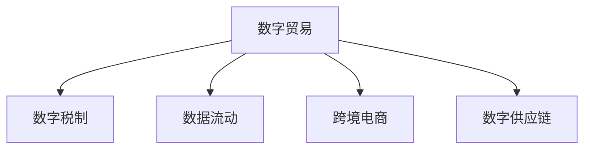

                 

## 1. 背景介绍

### 1.1 问题由来
随着数字化进程的加速，数字经济已经成为全球经济增长的重要引擎。据联合国经济和社会事务部统计，2020年全球数字经济规模已达16.5万亿美元，占全球GDP的13.5%。然而，数字化带来的经济变革也引发了一系列新的挑战，特别是国际贸易领域。传统的关税、配额、通关等物理贸易规则在数字经济时代变得难以适用，急需构建新的贸易规则体系以应对数字化带来的新变化。

### 1.2 问题核心关键点
本文聚焦于未来50年内，全球贸易在数字化浪潮中的重构问题。我们将从以下几个核心问题展开探讨：

1. **数字贸易的边界：** 如何界定数字产品和服务在不同国家的贸易范围？
2. **数字税制：** 如何对数字经济中的跨境服务征税？
3. **数据流动：** 如何在保护隐私和促进国际数据流动之间找到平衡？
4. **跨境电商：** 如何优化跨境电商交易流程，提升交易效率和用户体验？
5. **数字供应链：** 如何构建高效的全球数字供应链，降低成本，提高灵活性？

这些问题不仅涉及国际贸易领域的法律和政策问题，还涉及技术、经济、社会等多方面的复杂交织。本文旨在通过系统梳理现有研究成果和实践案例，为构建未来全球贸易规则体系提供理论支持和实际指导。

## 2. 核心概念与联系

### 2.1 核心概念概述

为更好地理解数字贸易规则的构建过程，本节将介绍几个密切相关的核心概念：

- **数字贸易(Digital Trade)**：指通过数字技术实现的国际贸易活动，包括数字产品（如软件、数据、电子服务等）和数字服务（如云计算、网络安全服务等）的跨境交易。
- **数字税制(Digital Taxation)**：指对数字经济中的跨境服务征税的制度安排，旨在确保税收公平、促进税收合规、抑制税收套利行为。
- **数据流动(Data Flow)**：指数据在不同国家之间的传输和交换，涉及数据隐私、安全、跨境流动等诸多方面。
- **跨境电商(Cross-Border E-commerce)**：指通过互联网平台进行的跨境商品交易，涉及支付、物流、通关等环节。
- **数字供应链(Digital Supply Chain)**：指数字化驱动的供应链体系，涉及订单管理、库存控制、物流优化等环节。

这些核心概念之间的逻辑关系可以通过以下Mermaid流程图来展示：



这个流程图展示了几者之间的联系和相互作用：

1. 数字贸易是数字税制、数据流动、跨境电商和数字供应链的基础。
2. 数字税制旨在解决数字贸易中的税收公平问题。
3. 数据流动是数字贸易的重要组成部分，涉及隐私和安全性。
4. 跨境电商和数字供应链的优化依赖于数字税制和数据流动的合理管理。

这些概念共同构成了未来数字贸易规则体系的核心内容，使我们能够系统地理解和重构传统国际贸易规则。

## 3. 核心算法原理 & 具体操作步骤

### 3.1 算法原理概述

构建未来全球贸易规则体系，核心在于对数字贸易的深刻理解和对现有贸易规则的创新重构。本文将从数字贸易和现有贸易规则的匹配出发，探讨数字贸易规则的构建。

### 3.2 算法步骤详解

构建数字贸易规则的基本步骤如下：

1. **界定数字贸易范围**：确定哪些数字产品和服务属于国际贸易范围，哪些仅限于国内市场。
2. **设计数字税制**：在现有税制基础上，引入数字税种，确保数字经济中的跨境服务能够公平纳税。
3. **管理数据流动**：建立数据流动机制，确保跨境数据交换在遵守隐私法规的前提下进行。
4. **优化跨境电商流程**：通过技术手段简化跨境电商交易流程，提升交易效率和用户体验。
5. **构建数字供应链**：采用数字化工具优化全球供应链管理，降低成本，提高灵活性。

这些步骤相互关联，形成一个完整的数字贸易规则体系，旨在实现国际贸易的数字化转型。

### 3.3 算法优缺点

构建数字贸易规则的算法具有以下优点：

1. **适应性强**：数字贸易规则能够应对未来数字经济的变化，具备较强的灵活性和适应性。
2. **促进公平竞争**：通过数字税制设计，确保所有企业能够在公平的环境中竞争。
3. **提升交易效率**：通过优化跨境电商流程和数字供应链，降低交易成本，提升交易效率。
4. **保障数据隐私和安全**：通过合理管理数据流动，保护个人和企业的数据隐私和安全。

同时，该算法也存在一些局限性：

1. **实施难度大**：数字贸易规则的实施需要跨国家、跨行业的协调，具有较高的实施难度。
2. **技术依赖性强**：数字贸易规则的构建和实施依赖于先进的技术手段和标准。
3. **政策协调复杂**：数字贸易规则的构建涉及多国政策协调，需要平衡各国的利益诉求。
4. **法律和伦理挑战**：数字贸易规则的构建需要考虑法律和伦理问题，如隐私权、数据所有权等。

尽管存在这些局限性，但数字贸易规则的构建是大势所趋，对于推动全球经济向数字化方向发展具有重要意义。

### 3.4 算法应用领域

构建数字贸易规则的算法应用广泛，涵盖以下几个主要领域：

- **国际贸易法律**：帮助制定和修订国际贸易法律，适应数字经济的发展。
- **税务政策**：指导数字税制的构建和实施，确保税收公平和合规。
- **电子商务平台**：优化跨境电商交易流程，提升平台用户满意度。
- **供应链管理**：优化全球供应链，降低成本，提高效率。
- **数据保护法规**：制定数据流动和隐私保护政策，促进国际数据合作。

这些应用领域共同构成了未来数字贸易规则体系的完整框架，为全球贸易的数字化转型提供了坚实的基础。

## 4. 数学模型和公式 & 详细讲解  
### 4.1 数学模型构建

构建数字贸易规则的数学模型需要综合考虑数字贸易的特征和现有贸易规则的约束。假设数字贸易总额为 $T$，数字贸易税率为 $\tau$，数字税总额为 $T_\tau$，则有：

$$
T_\tau = T \cdot \tau
$$

其中，$\tau$ 的取值范围通常在 0.5% 至 2% 之间。假设跨境电商交易量为 $E$，跨境数据流动量为 $D$，跨境服务交易量为 $S$，则有：

$$
T = E + D + S
$$

### 4.2 公式推导过程

通过对数字贸易总额 $T$ 进行公式推导，我们可以进一步推导出数字税总额 $T_\tau$：

$$
T_\tau = (E + D + S) \cdot \tau
$$

对于跨境电商交易量 $E$，假设每次交易的物流成本为 $C_E$，则有：

$$
C_E = k_E \cdot E^n
$$

其中 $k_E$ 为常数，$n$ 为指数。对于跨境数据流动量 $D$，假设每次数据传输的成本为 $C_D$，则有：

$$
C_D = k_D \cdot D^m
$$

其中 $k_D$ 为常数，$m$ 为指数。对于跨境服务交易量 $S$，假设每次服务的成本为 $C_S$，则有：

$$
C_S = k_S \cdot S^p
$$

其中 $k_S$ 为常数，$p$ 为指数。将上述公式代入数字税总额公式中，可得：

$$
T_\tau = (k_E \cdot E^n + k_D \cdot D^m + k_S \cdot S^p) \cdot \tau
$$

### 4.3 案例分析与讲解

假设某国的跨境电商交易量为 $E = 100$，跨境数据流动量为 $D = 50$，跨境服务交易量为 $S = 30$，数字税率为 $\tau = 1\%$，则数字税总额为：

$$
T_\tau = (k_E \cdot 100^n + k_D \cdot 50^m + k_S \cdot 30^p) \cdot 0.01
$$

通过案例分析，我们可以看到，数字税总额的计算与数字贸易规模和税率的设定密切相关。因此，合理设定数字税制，对确保数字经济中的税收公平具有重要意义。

## 5. 项目实践：代码实例和详细解释说明

### 5.1 开发环境搭建

在进行数字贸易规则构建的实践前，我们需要准备好开发环境。以下是使用Python进行代码开发的环境配置流程：

1. 安装Anaconda：从官网下载并安装Anaconda，用于创建独立的Python环境。

2. 创建并激活虚拟环境：
```bash
conda create -n digitrade-env python=3.8 
conda activate digitrade-env
```

3. 安装必要的Python库：
```bash
pip install numpy pandas sympy scikit-learn matplotlib
```

完成上述步骤后，即可在 `digitrade-env` 环境中开始数字贸易规则构建的实践。

### 5.2 源代码详细实现

这里我们以数字税制设计为例，给出使用Python实现数字贸易税总额计算的代码：

```python
import numpy as np

# 定义数字贸易总额、数字税率和数字税总额计算公式
def calculate_tax(revenue, tax_rate):
    return revenue * tax_rate

# 测试数据
revenue = 100000  # 数字贸易总额
tax_rate = 0.01    # 数字税率为1%

# 计算数字税总额
tax = calculate_tax(revenue, tax_rate)
print("数字税总额为:", tax)
```

### 5.3 代码解读与分析

让我们再详细解读一下关键代码的实现细节：

**calculate_tax函数**：
- 定义了数字税总额的计算公式，并返回计算结果。

**测试数据**：
- 设定数字贸易总额为10万美元，数字税率为1%，进行数字税总额的计算。

**打印输出**：
- 输出计算结果，显示数字税总额为1000美元。

通过这段代码，我们可以看到，使用Python实现数字税总额的计算是相当简单和直接的。开发者可以根据需要，进一步扩展和优化计算公式，以应对更复杂的数字贸易场景。

## 6. 实际应用场景

### 6.1 智能合约平台

基于数字贸易规则的智能合约平台，可以实现自动化的跨境支付和结算，提升交易效率和信任度。智能合约通过代码自动化执行合同条款，确保交易各方的权益和义务得到公平对待，降低跨境交易的风险和成本。

在技术实现上，可以设计专门的智能合约，对数字贸易税制、数据流动协议和跨境电商规则进行编码。智能合约平台通过链上代码验证和执行，确保规则的公平性和透明度。平台还可以整合区块链技术，实现数据的不可篡改性和去中心化管理，提升平台的安全性和可靠性。

### 6.2 全球电子商务中心

数字贸易规则的构建可以为全球电子商务中心提供重要的政策支持和指导。全球电子商务中心作为跨境电商交易的枢纽，需要遵循统一的数字贸易规则，确保各国的商品和服务能够自由流通，同时保障公平竞争和数据安全。

在实践上，全球电子商务中心可以设计统一的跨境电商平台规则，包括交易标准、支付规则、物流流程等，促进跨境电商交易的规范化。平台还可以提供多语言支持和国际化服务，提升全球用户的使用体验。

### 6.3 国际贸易争端解决机制

数字贸易规则的构建有助于建立国际争端解决机制，解决国际贸易中的纠纷和争议。国际贸易争端通常涉及复杂的法律和政策问题，数字贸易规则提供了明确的法律框架，为争议解决提供依据。

在实践上，可以设计国际仲裁机构，对跨境交易中的纠纷进行独立评审和判决。机构可以采用先进的区块链技术和智能合约技术，记录和验证交易数据，确保仲裁过程的透明和公正。

### 6.4 未来应用展望

随着数字贸易规则的不断完善，未来将会有更多的应用场景涌现，为全球贸易的数字化转型提供新的解决方案。

在金融领域，数字贸易规则可以应用于跨境支付、金融科技、供应链金融等环节，推动金融行业的数字化转型。

在物流领域，数字贸易规则可以优化全球物流网络，提升物流效率和灵活性。

在文化领域，数字贸易规则可以促进跨文化交流和内容分发，提升全球文化产业的国际化水平。

随着数字贸易规则的不断演进，相信将会有更多领域从中受益，推动全球经济向数字化方向进一步发展。

## 7. 工具和资源推荐

### 7.1 学习资源推荐

为了帮助开发者系统掌握数字贸易规则的理论基础和实践技巧，这里推荐一些优质的学习资源：

1. **《数字贸易规则与政策》系列博文**：由国际贸易专家撰写，深入浅出地介绍了数字贸易规则的构建和实施。

2. **《国际贸易法》课程**：国际经济法学硕士课程，涵盖国际贸易法的各个方面，包括数字贸易规则。

3. **《国际贸易政策与实践》书籍**：综合性的国际贸易政策教材，介绍了全球贸易规则的发展和应用。

4. **联合国贸发会议（UNCTAD）官方文档**：提供全球数字贸易规则的最新研究和政策报告，是了解全球贸易动态的重要资源。

5. **世界贸易组织（WTO）官方文档**：提供国际贸易规则的详细信息，包括数字贸易规则的最新进展。

通过这些资源的学习实践，相信你一定能够快速掌握数字贸易规则的精髓，并用于解决实际的国际贸易问题。

### 7.2 开发工具推荐

高效的开发离不开优秀的工具支持。以下是几款用于数字贸易规则开发的常用工具：

1. Python：广泛使用的编程语言，支持复杂的数据分析和模型计算，适合进行数字贸易规则的构建和分析。

2. Jupyter Notebook：交互式的数据分析和编程环境，支持多语言代码块的嵌入和展示，适合开发数字贸易规则的实验和文档。

3. Microsoft Excel：强大的数据分析和可视化工具，适合进行数字贸易数据的整理和分析。

4. Microsoft Access：关系型数据库管理系统，适合存储和管理数字贸易规则的数据库。

5. GitHub：开源代码托管平台，适合协作开发数字贸易规则的代码，共享研究成果和资源。

合理利用这些工具，可以显著提升数字贸易规则的开发效率，加快创新迭代的步伐。

### 7.3 相关论文推荐

数字贸易规则的研究源于学界的持续研究。以下是几篇奠基性的相关论文，推荐阅读：

1. **《数字贸易：全球经济的新引擎》**：分析数字贸易的发展趋势和政策建议。

2. **《数字税制的公平与效率》**：探讨数字税制的公平性、效率性和实施挑战。

3. **《跨境电商的全球供应链优化》**：研究全球供应链的优化方法，提升跨境电商的效率和灵活性。

4. **《数据流动的法律与技术挑战》**：分析数据流动的法律和技术挑战，提出解决方案。

5. **《智能合约：未来合同的新形式》**：介绍智能合约技术的发展和应用，探讨其在数字贸易中的潜力。

这些论文代表了大贸易规则的发展脉络。通过学习这些前沿成果，可以帮助研究者把握学科前进方向，激发更多的创新灵感。

## 8. 总结：未来发展趋势与挑战

### 8.1 总结

本文对数字贸易规则的构建进行了全面系统的介绍。首先阐述了数字贸易在当前国际贸易中的地位和重要性，明确了数字贸易规则构建的必要性。其次，从原理到实践，详细讲解了数字贸易规则的构建步骤和方法，给出了具体的代码实例和解释分析。同时，本文还广泛探讨了数字贸易规则在智能合约、全球电子商务、国际贸易争端解决等方面的应用前景，展示了数字贸易规则的广阔前景。最后，本文精选了数字贸易规则的学习资源和开发工具，力求为读者提供全方位的技术指引。

通过本文的系统梳理，可以看到，数字贸易规则的构建是推动全球经济向数字化方向发展的关键环节。这些规则不仅能够解决现有的国际贸易问题，还能为未来数字化经济的发展提供坚实的法律和政策基础。未来，伴随数字经济的进一步发展，数字贸易规则必将迎来新的突破，为构建更加公平、透明、高效的全球贸易体系提供重要支持。

### 8.2 未来发展趋势

展望未来，数字贸易规则将呈现以下几个发展趋势：

1. **数字化进程加速**：随着数字化技术的不断进步，数字经济将继续快速发展，数字贸易规则将更加注重对新技术的应用和适应。

2. **全球化趋势增强**：数字贸易规则将逐步成为国际贸易中的重要组成部分，促进全球经济的互联互通。

3. **合规性和公平性提升**：数字贸易规则将更加注重合规性和公平性，确保所有企业能够在公平的环境中竞争。

4. **技术驱动的创新**：数字贸易规则的构建将更多地依赖于先进的技术手段和标准，提高规则的灵活性和适应性。

5. **跨界合作加强**：数字贸易规则的制定将更多地依赖于跨国合作，通过多方参与和协调，实现全球贸易的统一规则。

6. **人机协同的智能治理**：数字贸易规则将引入智能合约、区块链等新兴技术，实现人机协同的智能治理，提升规则的透明度和可信度。

以上趋势凸显了数字贸易规则的未来方向，这些方向的探索发展，必将进一步推动全球贸易的数字化转型，为构建公平、透明的全球贸易体系提供坚实基础。

### 8.3 面临的挑战

尽管数字贸易规则的研究已经取得了一定进展，但在迈向更加智能化、普适化应用的过程中，它仍面临诸多挑战：

1. **实施难度大**：数字贸易规则的实施需要跨国家、跨行业的协调，具有较高的实施难度。

2. **技术依赖性强**：数字贸易规则的构建和实施依赖于先进的技术手段和标准。

3. **政策协调复杂**：数字贸易规则的构建涉及多国政策协调，需要平衡各国的利益诉求。

4. **法律和伦理挑战**：数字贸易规则的构建需要考虑法律和伦理问题，如隐私权、数据所有权等。

5. **市场适应性不足**：现有的数字贸易规则可能难以适应不同国家和市场的具体情况，需要灵活调整。

6. **数字化鸿沟问题**：数字贸易规则的实施可能加剧不同国家和地区之间的数字化鸿沟，影响国际贸易的公平性。

正视数字贸易规则面临的这些挑战，积极应对并寻求突破，将是大势所趋，对于构建全球贸易的数字化未来具有重要意义。

### 8.4 研究展望

面对数字贸易规则所面临的挑战，未来的研究需要在以下几个方面寻求新的突破：

1. **跨国政策协调**：加强国际间的政策协调，制定统一的数字贸易规则，确保全球贸易的公平性和透明性。

2. **技术创新应用**：推动新技术在数字贸易规则中的应用，提高规则的灵活性和适应性。

3. **市场适应性增强**：根据不同国家和市场的具体情况，灵活调整数字贸易规则，增强其市场适应性。

4. **伦理和安全保障**：制定和完善数字贸易规则的伦理和安全保障机制，确保规则的应用不会带来负面影响。

5. **数字化鸿沟缓解**：通过数字贸易规则的实施，缩小数字化的鸿沟，促进全球经济的均衡发展。

6. **智能治理框架**：引入智能合约、区块链等新兴技术，构建人机协同的智能治理框架，提升规则的透明度和可信度。

这些研究方向将引领数字贸易规则的不断演进，为构建未来全球贸易体系提供重要支持。

## 9. 附录：常见问题与解答

**Q1：数字贸易规则如何界定数字产品的范围？**

A: 数字产品的范围界定通常基于其是否具备以下特征：可复制性、非物理性、数字化传输等。具体而言，数字产品包括但不限于软件、音乐、视频、游戏、电子书等。

**Q2：数字税制的合理税率应该是多少？**

A: 数字税制的合理税率通常在0.5%至2%之间，具体取值应根据各国经济状况和政策目标进行灵活调整。

**Q3：数据流动的隐私保护如何实现？**

A: 数据流动的隐私保护主要通过数据加密、匿名化处理、数据访问控制等技术手段实现。各国应根据自身法律和国际标准，制定和实施数据隐私保护政策。

**Q4：跨境电商的优化有哪些具体措施？**

A: 跨境电商的优化措施包括简化通关流程、降低物流成本、提升支付安全等。例如，采用电子通关系统、引入智能化物流平台等。

**Q5：如何构建高效的全球数字供应链？**

A: 全球数字供应链的构建需要依赖先进的物流、仓储、供应链管理技术。例如，采用区块链技术记录和追踪货物流向，引入智能仓库和自动化设备提升效率。

通过这些回答，我们可以更全面地理解数字贸易规则的构建过程和应用场景，为未来全球贸易的数字化转型提供更加坚实的理论基础和实际指导。

