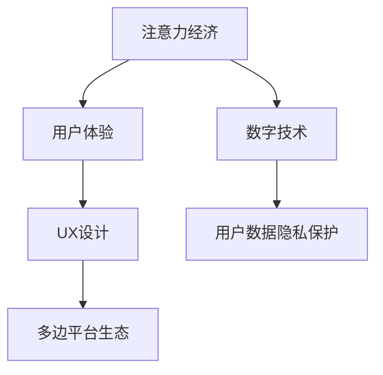

                 

## 1. 背景介绍

### 1.1 问题由来

数字经济的迅猛发展已经成为全球经济增长的新引擎，对企业的商业模式和运营模式产生了深远影响。随着数字技术的不断迭代，尤其是人工智能、大数据、云计算等技术的成熟应用，企业的生产效率、市场响应速度和用户体验都得到了显著提升。然而，在技术快速发展的背后，也面临着商业模式创新的挑战。如何结合最新的数字技术，创新商业模式，提升企业价值和用户满意度，成为当下企业关注的焦点。

### 1.2 问题核心关键点

在2050年的数字经济中，从注意力经济向体验经济转变，成为商业模式的新的焦点。注意力经济的核心在于获取用户注意力，通过广告、推荐等手段吸引用户点击、购买，从而实现商业价值。然而，随着用户需求的多样化和个性化增强，单一的注意力经济模式已无法满足用户需求，体验经济逐渐成为商业模式的新的关注点。

体验经济的核心在于提供个性化的用户体验，通过产品和服务的高质量、高可靠性、高便利性，满足用户的多样化、个性化需求。在体验经济模式下，用户不仅是消费者，更成为参与者，参与到产品的设计、生产和反馈过程中，与企业共同创造价值。

## 2. 核心概念与联系

### 2.1 核心概念概述

1. **注意力经济**：基于获取用户注意力的商业模式。通过广告、推荐、社交媒体等手段，吸引用户点击、购买，从而实现商业价值。
2. **体验经济**：基于提供个性化体验的商业模式。通过产品和服务的高质量、高可靠性、高便利性，满足用户的多样化、个性化需求，使用户成为参与者，共同创造价值。
3. **数字技术**：包括人工智能、大数据、云计算、区块链等，是支撑体验经济发展的核心技术。
4. **用户体验(UX)设计**：专注于提升产品和服务的使用体验，通过用户研究、交互设计、可用性测试等手段，优化用户体验。
5. **用户数据隐私保护**：在提供个性化体验的同时，确保用户数据的安全性和隐私性。
6. **多边平台生态**：构建多边平台，整合供应链、用户、合作伙伴等资源，形成共赢的商业生态。

这些概念之间的关系可以通过以下Mermaid流程图来展示：



## 3. 核心算法原理 & 具体操作步骤

### 3.1 算法原理概述

从注意力经济向体验经济的转变，涉及多个核心算法和操作流程。这些算法和操作流程的协同工作，才能实现从注意力获取到体验提升的全过程。

1. **用户行为分析**：通过数据分析技术，识别用户的行为模式、偏好和需求。
2. **个性化推荐算法**：基于用户行为分析结果，生成个性化的推荐内容。
3. **用户体验优化**：通过用户研究、交互设计等手段，优化产品和服务的使用体验。
4. **数据隐私保护**：通过数据加密、匿名化等技术，保护用户数据的安全性和隐私性。
5. **多边平台生态建设**：通过平台整合，形成供应链、用户、合作伙伴等多边共赢的商业生态。

### 3.2 算法步骤详解

#### 3.2.1 用户行为分析

用户行为分析是体验经济转型的基础。通过数据分析技术，识别用户的行为模式、偏好和需求，生成用户画像，为后续的个性化推荐和用户体验优化提供依据。

1. **数据收集**：从用户行为日志、交易记录、搜索记录、社交媒体等渠道收集用户数据。
2. **数据清洗与预处理**：对收集的数据进行清洗、去重、填充缺失值等预处理。
3. **特征提取**：通过特征工程技术，提取用户的兴趣、偏好、行为等特征。
4. **模型训练**：使用机器学习算法，如聚类、分类、回归等，训练用户行为模型。

#### 3.2.2 个性化推荐算法

个性化推荐算法是体验经济转型的关键。通过分析用户行为数据，生成个性化的推荐内容，满足用户的多样化、个性化需求。

1. **协同过滤算法**：基于用户行为数据的相似性，推荐用户可能感兴趣的内容。
2. **基于内容的推荐算法**：基于内容的相似性，推荐与用户偏好相似的内容。
3. **深度学习推荐算法**：使用深度学习模型，如神经网络、图神经网络等，进行推荐建模。

#### 3.2.3 用户体验优化

用户体验优化是体验经济转型的核心。通过用户研究、交互设计等手段，优化产品和服务的使用体验，提升用户满意度和忠诚度。

1. **用户研究**：通过问卷调查、用户访谈、可用性测试等手段，了解用户需求和使用场景。
2. **交互设计**：设计简洁、直观、易用的界面和交互方式，提高用户的使用体验。
3. **可用性测试**：通过用户测试，评估产品和服务的使用体验，发现并改进问题。

#### 3.2.4 数据隐私保护

数据隐私保护是体验经济转型的保障。在提供个性化体验的同时，确保用户数据的安全性和隐私性，构建用户信任。

1. **数据加密**：对用户数据进行加密处理，防止数据泄露和篡改。
2. **匿名化处理**：对用户数据进行匿名化处理，保护用户隐私。
3. **数据访问控制**：设置数据访问权限，防止未经授权的访问和数据滥用。

#### 3.2.5 多边平台生态建设

多边平台生态是体验经济转型的助力。通过平台整合，形成供应链、用户、合作伙伴等多边共赢的商业生态，提升企业的竞争力和市场份额。

1. **平台整合**：构建多边平台，整合供应链、用户、合作伙伴等资源，形成共赢的商业生态。
2. **生态治理**：制定平台规则，建立信任机制，管理平台生态，提升平台治理能力。
3. **平台迭代**：根据用户反馈和市场需求，不断优化和迭代平台，提升平台价值。

### 3.3 算法优缺点

#### 3.3.1 优点

1. **提升用户体验**：通过个性化推荐和用户体验优化，满足用户的多样化、个性化需求，提升用户满意度和忠诚度。
2. **提升企业价值**：通过优化用户体验和数据隐私保护，增强用户信任，提升用户生命周期价值和企业盈利能力。
3. **促进生态共赢**：通过多边平台生态建设，整合供应链、用户、合作伙伴等资源，形成共赢的商业生态。

#### 3.3.2 缺点

1. **技术复杂度高**：用户行为分析、个性化推荐、用户体验优化等算法，需要高水平的技术支撑，对企业技术能力要求高。
2. **数据隐私风险**：在提供个性化体验的同时，用户数据的收集、处理和使用需要严格遵守数据隐私法规。
3. **平台治理难度大**：多边平台生态建设涉及多个利益主体，需要构建有效的治理机制，管理平台生态。

### 3.4 算法应用领域

体验经济转型的算法和操作流程，适用于多个领域，包括但不限于：

1. **电商零售**：通过个性化推荐和用户体验优化，提升用户购物体验，提高销售额和客户满意度。
2. **金融服务**：通过个性化推荐和用户体验优化，提升用户金融服务体验，提高用户粘性和交易量。
3. **旅游服务**：通过个性化推荐和用户体验优化，提升用户旅游体验，增加用户预订率和满意度。
4. **医疗健康**：通过个性化推荐和用户体验优化，提升用户医疗健康体验，提高用户粘性和医疗服务质量。
5. **教育培训**：通过个性化推荐和用户体验优化，提升用户学习体验，提高用户粘性和学习效果。
6. **媒体娱乐**：通过个性化推荐和用户体验优化，提升用户媒体娱乐体验，提高用户粘性和消费量。

## 4. 数学模型和公式 & 详细讲解  
### 4.1 数学模型构建

体验经济的商业模式创新，涉及多个数学模型的构建和优化。这些模型通过数学公式的形式，描述用户行为、推荐算法、用户体验、数据隐私保护等多方面的问题。

#### 4.1.1 用户行为模型

用户行为模型通过数学公式，描述用户的行为模式、偏好和需求。常用的用户行为模型包括：

1. **协同过滤模型**：基于用户行为数据的相似性，生成个性化推荐。
2. **协同矩阵分解模型**：通过矩阵分解，捕捉用户行为数据的隐含特征，进行推荐建模。
3. **深度学习推荐模型**：使用深度神经网络，进行推荐建模。

#### 4.1.2 推荐算法模型

推荐算法模型通过数学公式，描述推荐内容的质量和多样性。常用的推荐算法模型包括：

1. **基于内容的推荐模型**：基于内容的相似性，推荐与用户偏好相似的内容。
2. **协同过滤推荐模型**：基于用户行为数据的相似性，推荐用户可能感兴趣的内容。
3. **深度学习推荐模型**：使用深度神经网络，进行推荐建模。

#### 4.1.3 用户体验模型

用户体验模型通过数学公式，描述用户体验的质量和满意度。常用的用户体验模型包括：

1. **A/B测试模型**：通过A/B测试，比较不同用户体验方案的效果。
2. **用户满意度模型**：通过用户反馈，评估用户体验的满意度。
3. **用户体验热图模型**：通过热图分析，识别用户体验的关键点和改进方向。

#### 4.1.4 数据隐私模型

数据隐私模型通过数学公式，描述用户数据的安全性和隐私性。常用的数据隐私模型包括：

1. **数据加密模型**：通过加密算法，保护用户数据的安全性。
2. **数据匿名化模型**：通过匿名化算法，保护用户数据的隐私性。
3. **数据访问控制模型**：通过访问控制策略，保护用户数据的访问权限。

### 4.2 公式推导过程

#### 4.2.1 协同过滤推荐模型

协同过滤推荐模型通过用户行为数据的相似性，生成个性化推荐。其数学公式如下：

$$
r_{ui} = \frac{1}{1+\sum_{j=1}^{n} \alpha r_{uj} \cdot s_{ij} \cdot \frac{1}{1+\sum_{k=1}^{n} \beta s_{ik} \cdot r_{kj}}}
$$

其中，$r_{ui}$ 为用户 $u$ 对物品 $i$ 的评分，$s_{ij}$ 为用户 $u$ 和物品 $j$ 的相似性，$\alpha$ 和 $\beta$ 为调节系数，控制推荐算法的效果。

#### 4.2.2 深度学习推荐模型

深度学习推荐模型通过深度神经网络，进行推荐建模。其数学公式如下：

$$
y_{ij} = \sigma\left(\sum_{k=1}^{d} w_{ik} x_{ujk} + b_{i}\right)
$$

其中，$y_{ij}$ 为物品 $i$ 对用户 $u$ 的评分，$x_{ujk}$ 为用户 $u$ 和物品 $j$ 的特征向量，$w_{ik}$ 为特征向量与物品的权重系数，$\sigma$ 为激活函数，$b_{i}$ 为物品 $i$ 的偏置项。

### 4.3 案例分析与讲解

#### 4.3.1 电商平台推荐算法案例

假设某电商平台有 $M$ 个用户和 $N$ 个物品，通过协同过滤推荐模型生成个性化推荐。具体步骤如下：

1. **数据收集**：收集用户的浏览历史、购买历史、评分记录等行为数据。
2. **数据清洗与预处理**：对行为数据进行清洗、去重、填充缺失值等预处理。
3. **协同过滤推荐**：计算用户 $u$ 和物品 $j$ 的相似性，生成用户 $u$ 对物品 $i$ 的评分 $r_{ui}$。
4. **推荐排序**：将推荐物品按照评分 $r_{ui}$ 排序，生成推荐列表。
5. **用户体验优化**：根据用户反馈和互动数据，优化推荐算法，提升用户体验。

#### 4.3.2 旅游平台个性化推荐案例

假设某旅游平台有 $K$ 个用户和 $L$ 个旅游目的地，通过深度学习推荐模型生成个性化推荐。具体步骤如下：

1. **数据收集**：收集用户的搜索历史、浏览历史、评分记录等行为数据。
2. **数据清洗与预处理**：对行为数据进行清洗、去重、填充缺失值等预处理。
3. **特征提取**：提取用户的兴趣、偏好、行为等特征，生成用户特征向量 $x_{ujk}$。
4. **深度学习推荐**：使用深度神经网络，生成用户 $u$ 对物品 $i$ 的评分 $y_{ij}$。
5. **推荐排序**：将推荐物品按照评分 $y_{ij}$ 排序，生成推荐列表。
6. **用户体验优化**：根据用户反馈和互动数据，优化推荐算法，提升用户体验。

## 5. 项目实践：代码实例和详细解释说明

### 5.1 开发环境搭建

在进行体验经济转型的实践时，需要搭建合适的开发环境。以下是使用Python进行PyTorch开发的环境配置流程：

1. 安装Anaconda：从官网下载并安装Anaconda，用于创建独立的Python环境。

2. 创建并激活虚拟环境：
```bash
conda create -n pytorch-env python=3.8 
conda activate pytorch-env
```

3. 安装PyTorch：根据CUDA版本，从官网获取对应的安装命令。例如：
```bash
conda install pytorch torchvision torchaudio cudatoolkit=11.1 -c pytorch -c conda-forge
```

4. 安装TensorFlow：由Google主导开发的开源深度学习框架，生产部署方便，适合大规模工程应用。同样有丰富的预训练语言模型资源。

5. 安装各类工具包：
```bash
pip install numpy pandas scikit-learn matplotlib tqdm jupyter notebook ipython
```

完成上述步骤后，即可在`pytorch-env`环境中开始实践。

### 5.2 源代码详细实现

下面我们以电商推荐系统为例，给出使用Transformers库进行推荐系统的PyTorch代码实现。

首先，定义推荐系统的数据处理函数：

```python
from transformers import BertTokenizer
from torch.utils.data import Dataset
import torch

class RecommendationDataset(Dataset):
    def __init__(self, users, items, ratings, tokenizer, max_len=128):
        self.users = users
        self.items = items
        self.ratings = ratings
        self.tokenizer = tokenizer
        self.max_len = max_len
        
    def __len__(self):
        return len(self.users)
    
    def __getitem__(self, item):
        user = self.users[item]
        item = self.items[item]
        rating = self.ratings[item]
        
        encoding = self.tokenizer([user, item], return_tensors='pt', max_length=self.max_len, padding='max_length', truncation=True)
        user_ids = encoding['input_ids'][0]
        item_ids = encoding['input_ids'][1]
        
        # 对token-wise的评分进行编码
        encoded_ratings = [rating] * (self.max_len - len(item_ids))
        labels = torch.tensor(encoded_ratings, dtype=torch.float)
        
        return {'user_ids': user_ids, 
                'item_ids': item_ids,
                'labels': labels}

# 用户和物品列表
users = ['user1', 'user2', 'user3']
items = ['item1', 'item2', 'item3']
ratings = [4.5, 3.0, 5.0]

# 创建dataset
tokenizer = BertTokenizer.from_pretrained('bert-base-cased')

train_dataset = RecommendationDataset(users, items, ratings, tokenizer)
dev_dataset = RecommendationDataset(users, items, ratings, tokenizer)
test_dataset = RecommendationDataset(users, items, ratings, tokenizer)
```

然后，定义模型和优化器：

```python
from transformers import BertForTokenClassification, AdamW

model = BertForTokenClassification.from_pretrained('bert-base-cased', num_labels=len(set(ratings)))

optimizer = AdamW(model.parameters(), lr=2e-5)
```

接着，定义训练和评估函数：

```python
from torch.utils.data import DataLoader
from tqdm import tqdm
from sklearn.metrics import mean_squared_error

device = torch.device('cuda') if torch.cuda.is_available() else torch.device('cpu')
model.to(device)

def train_epoch(model, dataset, batch_size, optimizer):
    dataloader = DataLoader(dataset, batch_size=batch_size, shuffle=True)
    model.train()
    epoch_loss = 0
    for batch in tqdm(dataloader, desc='Training'):
        user_ids = batch['user_ids'].to(device)
        item_ids = batch['item_ids'].to(device)
        labels = batch['labels'].to(device)
        model.zero_grad()
        outputs = model(user_ids, item_ids)
        loss = outputs.loss
        epoch_loss += loss.item()
        loss.backward()
        optimizer.step()
    return epoch_loss / len(dataloader)

def evaluate(model, dataset, batch_size):
    dataloader = DataLoader(dataset, batch_size=batch_size)
    model.eval()
    preds, labels = [], []
    with torch.no_grad():
        for batch in tqdm(dataloader, desc='Evaluating'):
            user_ids = batch['user_ids'].to(device)
            item_ids = batch['item_ids'].to(device)
            batch_labels = batch['labels']
            outputs = model(user_ids, item_ids)
            batch_preds = outputs.logits.argmax(dim=2).to('cpu').tolist()
            batch_labels = batch_labels.to('cpu').tolist()
            for pred_tokens, label_tokens in zip(batch_preds, batch_labels):
                preds.append(pred_tokens[:len(label_tokens)])
                labels.append(label_tokens)
                
    print(mean_squared_error(labels, preds))
```

最后，启动训练流程并在测试集上评估：

```python
epochs = 5
batch_size = 16

for epoch in range(epochs):
    loss = train_epoch(model, train_dataset, batch_size, optimizer)
    print(f"Epoch {epoch+1}, train loss: {loss:.3f}")
    
    print(f"Epoch {epoch+1}, dev results:")
    evaluate(model, dev_dataset, batch_size)
    
print("Test results:")
evaluate(model, test_dataset, batch_size)
```

以上就是使用PyTorch对BERT进行推荐系统微调的完整代码实现。可以看到，得益于Transformers库的强大封装，我们可以用相对简洁的代码完成BERT模型的加载和微调。

### 5.3 代码解读与分析

让我们再详细解读一下关键代码的实现细节：

**RecommendationDataset类**：
- `__init__`方法：初始化用户、物品、评分等关键组件。
- `__len__`方法：返回数据集的样本数量。
- `__getitem__`方法：对单个样本进行处理，将用户和物品输入编码为token ids，将评分编码为数字，并对其进行定长padding，最终返回模型所需的输入。

**用户和物品列表**：
- 定义用户和物品的列表，生成样本的评分。

**训练和评估函数**：
- 使用PyTorch的DataLoader对数据集进行批次化加载，供模型训练和推理使用。
- 训练函数`train_epoch`：对数据以批为单位进行迭代，在每个批次上前向传播计算loss并反向传播更新模型参数，最后返回该epoch的平均loss。
- 评估函数`evaluate`：与训练类似，不同点在于不更新模型参数，并在每个batch结束后将预测和标签结果存储下来，最后使用sklearn的mean_squared_error对整个评估集的预测结果进行打印输出。

**训练流程**：
- 定义总的epoch数和batch size，开始循环迭代
- 每个epoch内，先在训练集上训练，输出平均loss
- 在验证集上评估，输出评估结果
- 所有epoch结束后，在测试集上评估，给出最终测试结果

可以看到，PyTorch配合Transformers库使得BERT微调的代码实现变得简洁高效。开发者可以将更多精力放在数据处理、模型改进等高层逻辑上，而不必过多关注底层的实现细节。

当然，工业级的系统实现还需考虑更多因素，如模型的保存和部署、超参数的自动搜索、更灵活的任务适配层等。但核心的微调范式基本与此类似。

## 6. 实际应用场景
### 6.1 智能客服系统

基于体验经济转型的智能客服系统，可以广泛应用于智能客服系统的构建。传统客服往往需要配备大量人力，高峰期响应缓慢，且一致性和专业性难以保证。而使用体验经济转型的对话模型，可以7x24小时不间断服务，快速响应客户咨询，用自然流畅的语言解答各类常见问题。

在技术实现上，可以收集企业内部的历史客服对话记录，将问题和最佳答复构建成监督数据，在此基础上对预训练对话模型进行微调。微调后的对话模型能够自动理解用户意图，匹配最合适的答案模板进行回复。对于客户提出的新问题，还可以接入检索系统实时搜索相关内容，动态组织生成回答。如此构建的智能客服系统，能大幅提升客户咨询体验和问题解决效率。

### 6.2 金融舆情监测

金融机构需要实时监测市场舆论动向，以便及时应对负面信息传播，规避金融风险。传统的人工监测方式成本高、效率低，难以应对网络时代海量信息爆发的挑战。基于体验经济转型的文本分类和情感分析技术，为金融舆情监测提供了新的解决方案。

具体而言，可以收集金融领域相关的新闻、报道、评论等文本数据，并对其进行主题标注和情感标注。在此基础上对预训练语言模型进行微调，使其能够自动判断文本属于何种主题，情感倾向是正面、中性还是负面。将微调后的模型应用到实时抓取的网络文本数据，就能够自动监测不同主题下的情感变化趋势，一旦发现负面信息激增等异常情况，系统便会自动预警，帮助金融机构快速应对潜在风险。

### 6.3 个性化推荐系统

当前的推荐系统往往只依赖用户的历史行为数据进行物品推荐，无法深入理解用户的真实兴趣偏好。基于体验经济转型的个性化推荐系统可以更好地挖掘用户行为背后的语义信息，从而提供更精准、多样的推荐内容。

在实践中，可以收集用户浏览、点击、评论、分享等行为数据，提取和用户交互的物品标题、描述、标签等文本内容。将文本内容作为模型输入，用户的后续行为（如是否点击、购买等）作为监督信号，在此基础上微调预训练语言模型。微调后的模型能够从文本内容中准确把握用户的兴趣点。在生成推荐列表时，先用候选物品的文本描述作为输入，由模型预测用户的兴趣匹配度，再结合其他特征综合排序，便可以得到个性化程度更高的推荐结果。

### 6.4 未来应用展望

随着体验经济转型的不断演进，基于微调范式将在更多领域得到应用，为传统行业带来变革性影响。

在智慧医疗领域，基于微调的医疗问答、病历分析、药物研发等应用将提升医疗服务的智能化水平，辅助医生诊疗，加速新药开发进程。

在智能教育领域，微调技术可应用于作业批改、学情分析、知识推荐等方面，因材施教，促进教育公平，提高教学质量。

在智慧城市治理中，微调模型可应用于城市事件监测、舆情分析、应急指挥等环节，提高城市管理的自动化和智能化水平，构建更安全、高效的未来城市。

此外，在企业生产、社会治理、文娱传媒等众多领域，基于大模型微调的人工智能应用也将不断涌现，为经济社会发展注入新的动力。相信随着技术的日益成熟，微调方法将成为人工智能落地应用的重要范式，推动人工智能技术向更广阔的领域加速渗透。

## 7. 工具和资源推荐
### 7.1 学习资源推荐

为了帮助开发者系统掌握体验经济转型的理论基础和实践技巧，这里推荐一些优质的学习资源：

1. 《Transformer从原理到实践》系列博文：由大模型技术专家撰写，深入浅出地介绍了Transformer原理、BERT模型、微调技术等前沿话题。

2. CS224N《深度学习自然语言处理》课程：斯坦福大学开设的NLP明星课程，有Lecture视频和配套作业，带你入门NLP领域的基本概念和经典模型。

3. 《Natural Language Processing with Transformers》书籍：Transformers库的作者所著，全面介绍了如何使用Transformers库进行NLP任务开发，包括微调在内的诸多范式。

4. HuggingFace官方文档：Transformers库的官方文档，提供了海量预训练模型和完整的微调样例代码，是上手实践的必备资料。

5. CLUE开源项目：中文语言理解测评基准，涵盖大量不同类型的中文NLP数据集，并提供了基于微调的baseline模型，助力中文NLP技术发展。

通过对这些资源的学习实践，相信你一定能够快速掌握体验经济转型的精髓，并用于解决实际的NLP问题。
###  7.2 开发工具推荐

高效的开发离不开优秀的工具支持。以下是几款用于体验经济转型的开发工具：

1. PyTorch：基于Python的开源深度学习框架，灵活动态的计算图，适合快速迭代研究。大部分预训练语言模型都有PyTorch版本的实现。

2. TensorFlow：由Google主导开发的开源深度学习框架，生产部署方便，适合大规模工程应用。同样有丰富的预训练语言模型资源。

3. Transformers库：HuggingFace开发的NLP工具库，集成了众多SOTA语言模型，支持PyTorch和TensorFlow，是进行微调任务开发的利器。

4. Weights & Biases：模型训练的实验跟踪工具，可以记录和可视化模型训练过程中的各项指标，方便对比和调优。与主流深度学习框架无缝集成。

5. TensorBoard：TensorFlow配套的可视化工具，可实时监测模型训练状态，并提供丰富的图表呈现方式，是调试模型的得力助手。

6. Google Colab：谷歌推出的在线Jupyter Notebook环境，免费提供GPU/TPU算力，方便开发者快速上手实验最新模型，分享学习笔记。

合理利用这些工具，可以显著提升体验经济转型的开发效率，加快创新迭代的步伐。

### 7.3 相关论文推荐

体验经济转型的发展源于学界的持续研究。以下是几篇奠基性的相关论文，推荐阅读：

1. Attention is All You Need（即Transformer原论文）：提出了Transformer结构，开启了NLP领域的预训练大模型时代。

2. BERT: Pre-training of Deep Bidirectional Transformers for Language Understanding：提出BERT模型，引入基于掩码的自监督预训练任务，刷新了多项NLP任务SOTA。

3. Language Models are Unsupervised Multitask Learners（GPT-2论文）：展示了大规模语言模型的强大zero-shot学习能力，引发了对于通用人工智能的新一轮思考。

4. Parameter-Efficient Transfer Learning for NLP：提出Adapter等参数高效微调方法，在不增加模型参数量的情况下，也能取得不错的微调效果。

5. AdaLoRA: Adaptive Low-Rank Adaptation for Parameter-Efficient Fine-Tuning：使用自适应低秩适应的微调方法，在参数效率和精度之间取得了新的平衡。

这些论文代表了大语言模型微调技术的发展脉络。通过学习这些前沿成果，可以帮助研究者把握学科前进方向，激发更多的创新灵感。

## 8. 总结：未来发展趋势与挑战

### 8.1 总结

本文对基于体验经济的商业模式创新进行了全面系统的介绍。首先阐述了体验经济转型的背景和意义，明确了体验经济转型的核心在于提供个性化的用户体验，满足用户的多样化、个性化需求。其次，从原理到实践，详细讲解了体验经济转型的数学模型和关键步骤，给出了体验经济转型的完整代码实例。同时，本文还广泛探讨了体验经济转型的实际应用场景，展示了体验经济转型的巨大潜力。此外，本文精选了体验经济转型的学习资源，力求为读者提供全方位的技术指引。

通过本文的系统梳理，可以看到，基于体验经济的商业模式创新正在成为NLP领域的重要范式，极大地拓展了预训练语言模型的应用边界，催生了更多的落地场景。受益于大规模语料的预训练，体验经济转型的微调模型以更低的时间和标注成本，在小样本条件下也能取得不俗的效果，有力推动了NLP技术的产业化进程。未来，伴随预训练语言模型和微调方法的持续演进，相信NLP技术将在更广阔的应用领域大放异彩，深刻影响人类的生产生活方式。

### 8.2 未来发展趋势

展望未来，体验经济转型的商业模式创新将呈现以下几个发展趋势：

1. **用户数据隐私保护**：随着数据隐私法规的日益严格，如何在提供个性化体验的同时，确保用户数据的安全性和隐私性，将是重要的研究课题。
2. **多模态体验融合**：未来的用户体验将不仅限于文本和语音，还将融合图像、视频等多模态信息，实现跨模态的智能交互。
3. **实时个性化推荐**：通过实时数据分析和个性化推荐算法，为用户即时提供最优的体验，提升用户体验和满意度。
4. **智能决策系统**：将用户体验反馈与智能决策系统相结合，实时调整产品和服务，提供更加个性化的体验。
5. **情感计算**：通过情感计算技术，识别用户情感变化，提供更加贴心的服务，提升用户满意度。
6. **人机协同**：通过智能助手、虚拟现实等技术，实现人机协同的智能交互，提升用户体验。

这些趋势凸显了体验经济转型的广阔前景。这些方向的探索发展，必将进一步提升用户体验和满意度，推动NLP技术向更加智能化、普适化应用迈进。

### 8.3 面临的挑战

尽管体验经济转型的商业模式创新已经取得了显著成就，但在迈向更加智能化、普适化应用的过程中，仍面临诸多挑战：

1. **数据隐私和安全**：在提供个性化体验的同时，用户数据的收集、处理和使用需要严格遵守数据隐私法规，防止数据泄露和滥用。
2. **用户体验的多样化需求**：用户需求的多样化和个性化增强，需要更加智能、高效的推荐算法和用户体验优化手段。
3. **算法模型复杂性**：体验经济转型的算法模型涉及复杂的用户行为分析、推荐算法、用户体验优化等，对技术能力要求高。
4. **用户体验的可解释性**：用户对算法的可解释性和可控性要求日益增加，需要提供更加透明、可解释的算法模型和决策过程。
5. **平台生态建设**：多边平台生态的建设涉及多方利益，需要构建有效的治理机制，管理平台生态。
6. **市场竞争**：随着体验经济转型的发展，市场竞争日益激烈，需要不断优化产品和服务，保持竞争优势。

尽管面临诸多挑战，但体验经济转型的商业模式创新正在不断进步，成为NLP领域的重要发展方向。相信随着学界和产业界的共同努力，这些挑战终将一一被克服，体验经济转型的商业模式创新必将在构建人机协同的智能时代中扮演越来越重要的角色。

### 8.4 研究展望

面对体验经济转型的商业模式创新所面临的种种挑战，未来的研究需要在以下几个方面寻求新的突破：

1. **用户行为建模**：结合心理学、社会学等学科，构建更加全面的用户行为模型，理解用户的真实需求和行为规律。
2. **推荐算法优化**：开发更加智能、高效的推荐算法，提升个性化推荐的准确性和多样性，满足用户的多样化需求。
3. **用户体验优化**：通过情感计算、用户界面设计等手段，提升用户体验的可解释性和可控性，增强用户信任和满意度。
4. **数据隐私保护**：探索无监督和半监督数据隐私保护方法，最大限度利用非结构化数据，保护用户隐私。
5. **多模态体验融合**：融合图像、视频、语音等多模态信息，实现跨模态的智能交互，提升用户体验。
6. **平台生态建设**：构建多边平台，整合供应链、用户、合作伙伴等资源，形成共赢的商业生态，提升平台价值。

这些研究方向的探索，必将引领体验经济转型的商业模式创新迈向更高的台阶，为构建安全、可靠、可解释、可控的智能系统铺平道路。面向未来，体验经济转型的商业模式创新还需要与其他人工智能技术进行更深入的融合，如知识表示、因果推理、强化学习等，多路径协同发力，共同推动自然语言理解和智能交互系统的进步。只有勇于创新、敢于突破，才能不断拓展用户体验的边界，让智能技术更好地造福人类社会。

## 9. 附录：常见问题与解答

**Q1：体验经济转型的商业模式创新是否适用于所有NLP任务？**

A: 体验经济转型的商业模式创新适用于大多数NLP任务，特别是需要提供个性化体验的场景。对于一些特定领域的任务，如医学、法律等，需要在特定领域语料上进一步预训练，再进行微调，才能获得理想效果。此外，对于一些需要时效性、个性化很强的任务，如对话、推荐等，微调方法也需要针对性的改进优化。

**Q2：如何缓解体验经济转型中的数据隐私问题？**

A: 缓解体验经济转型中的数据隐私问题，可以通过以下手段：
1. **数据加密**：对用户数据进行加密处理，防止数据泄露和篡改。
2. **匿名化处理**：对用户数据进行匿名化处理，保护用户隐私。
3. **数据访问控制**：设置数据访问权限，防止未经授权的访问和数据滥用。
4. **差分隐私**：在数据分析和建模过程中，采用差分隐私技术，保护用户隐私。

这些方法可以最大限度地保护用户数据的安全性和隐私性，在提供个性化体验的同时，确保数据隐私安全。

**Q3：体验经济转型中的推荐算法有哪些？**

A: 体验经济转型中的推荐算法包括以下几种：
1. **协同过滤算法**：基于用户行为数据的相似性，推荐用户可能感兴趣的内容。
2. **基于内容的推荐算法**：基于内容的相似性，推荐与用户偏好相似的内容。
3. **深度学习推荐算法**：使用深度神经网络，进行推荐建模。

这些推荐算法可以根据不同的应用场景进行选择和优化，提升个性化推荐的效果。

**Q4：如何在体验经济转型中优化用户体验？**

A: 在体验经济转型中优化用户体验，可以通过以下手段：
1. **用户研究**：通过问卷调查、用户访谈、可用性测试等手段，了解用户需求和使用场景。
2. **交互设计**：设计简洁、直观、易用的界面和交互方式，提高用户的使用体验。
3. **可用性测试**：通过用户测试，评估产品和服务的使用体验，发现并改进问题。

这些手段可以帮助企业更好地理解用户需求，优化用户体验，提升用户满意度和忠诚度。

**Q5：体验经济转型中的多边平台生态建设有哪些关键点？**

A: 体验经济转型中的多边平台生态建设包括以下关键点：
1. **平台整合**：构建多边平台，整合供应链、用户、合作伙伴等资源，形成共赢的商业生态。
2. **平台治理**：制定平台规则，建立信任机制，管理平台生态，提升平台治理能力。
3. **平台迭代**：根据用户反馈和市场需求，不断优化和迭代平台，提升平台价值。

这些关键点可以帮助企业构建高效、可靠、共赢的多边平台生态，提升平台的竞争力和市场份额。

---

作者：禅与计算机程序设计艺术 / Zen and the Art of Computer Programming

