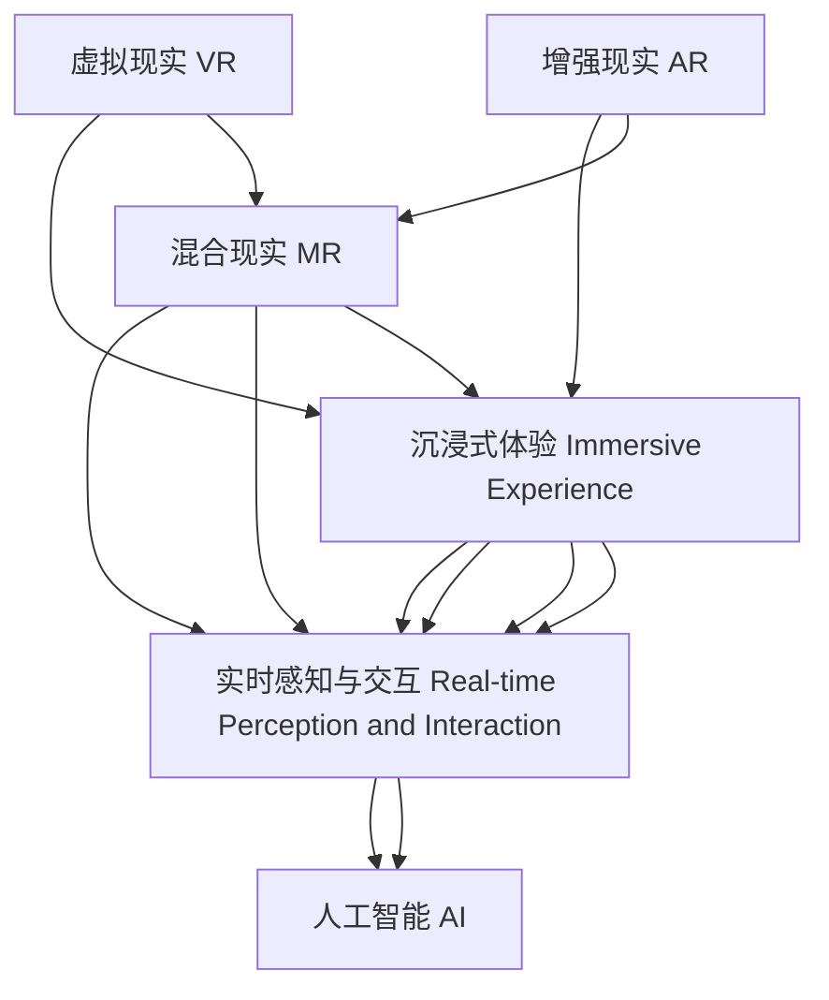

                 

# 2050年的虚拟现实：从沉浸式体验到虚实融合的数字世界

2050年的虚拟现实(Virtual Reality, VR)将远超当今人们的想象，它不仅仅是一种沉浸式的体验，更是一个与现实世界紧密相连、多模态融合的数字世界。本文将深入探讨这一技术变革的脉络，详细阐述其核心概念、算法原理、应用领域，并展望其未来发展趋势与挑战。

## 1. 背景介绍

### 1.1 问题由来
随着人工智能、物联网、脑机接口等技术的发展，虚拟现实从最初的游戏和娱乐应用，逐渐扩展到医疗、教育、设计、军事等众多领域。VR技术不仅提供了沉浸式的视觉和听觉体验，更实现了对用户感官的全面模拟，带来前所未有的感官沉浸感和交互体验。

### 1.2 问题核心关键点
2050年的虚拟现实将成为人类生产、生活、交互的新常态。它不仅提供娱乐和教育，还将改变我们的工作方式、决策模式，甚至社会结构。未来VR的核心关键点包括：
1. 沉浸式体验的极限提升。通过高清、高刷新率、高响应速度的设备，以及先进的算法，实现全方位、多感官的沉浸式体验。
2. 实时感知与交互。通过神经网络、传感技术等手段，捕捉用户细微动作和表情，实现更自然的交互。
3. 虚拟与现实的无缝融合。通过混合现实(Mixed Reality, MR)、增强现实(Augmented Reality, AR)等技术，打破虚拟与现实的边界，提升用户的生活和工作效率。
4. 人工智能的深度融合。AI算法将进一步提升虚拟环境的情境理解、智能决策和个性化推荐能力，提供更加个性化和智能化的服务。
5. 虚拟世界的安全与伦理。随着VR技术的普及，如何保障用户隐私、数据安全和伦理道德，将成为亟待解决的重要问题。

## 2. 核心概念与联系

### 2.1 核心概念概述

为更好地理解2050年的虚拟现实，本文将详细介绍其核心概念：

- **虚拟现实(VR)**：通过计算机生成的3D模拟环境，提供全方位感官沉浸的体验，使用户能够“进入”虚拟世界。

- **增强现实(AR)**：在现实世界中叠加虚拟信息，通过增强用户对现实环境的感知。

- **混合现实(MR)**：将虚拟世界与现实世界融合，实现虚实结合的场景。

- **沉浸式体验(Immersive Experience)**：使用VR/AR/MR技术，提供沉浸式的视觉、听觉、触觉等感官体验，让用户有身临其境的感觉。

- **实时感知与交互(Real-time Perception and Interaction)**：通过传感器、神经网络等技术，捕捉用户行为和环境变化，实现实时响应和交互。

- **人工智能(AI)**：利用深度学习、强化学习等技术，增强虚拟环境的情境理解、智能决策和个性化推荐能力。

这些核心概念之间的逻辑关系可以通过以下Mermaid流程图来展示：



这个流程图展示了大语言模型的工作原理和优化方向：

1. 虚拟现实通过计算机生成的3D模拟环境，提供沉浸式体验。
2. 增强现实在现实世界中叠加虚拟信息，增强用户感知。
3. 混合现实将虚拟与现实融合，提供虚实结合的场景。
4. 沉浸式体验使用VR/AR/MR技术，提供全方位感官沉浸的体验。
5. 实时感知与交互通过传感器、神经网络等技术，捕捉用户行为和环境变化，实现实时响应和交互。
6. 人工智能利用深度学习、强化学习等技术，增强虚拟环境的情境理解、智能决策和个性化推荐能力。

这些概念共同构成了未来虚拟现实的核心框架，使其能够适应不同的应用场景，提供智能化的感官体验。

## 3. 核心算法原理 & 具体操作步骤

### 3.1 算法原理概述

2050年的虚拟现实将广泛采用先进的感知、交互、渲染和仿真算法，以提升用户体验和应用效率。以下是其核心算法原理：

- **感知算法**：使用深度神经网络对用户动作、表情、语音等进行实时感知和分析，捕捉细微变化。
- **交互算法**：通过精确的运动跟踪和手眼协调技术，实现用户与虚拟环境的自然交互。
- **渲染算法**：采用实时高精度渲染技术，生成高质量的虚拟图像和声音，提供沉浸式的感官体验。
- **仿真算法**：通过物理引擎和仿真模型，模拟复杂的物理现象，增强虚拟环境的真实感。

### 3.2 算法步骤详解

2050年的虚拟现实算法主要包括以下几个关键步骤：

**Step 1: 数据采集与预处理**
- 通过摄像头、传感器等设备，实时采集用户的视觉、听觉、触觉等数据。
- 对采集到的数据进行去噪、归一化、特征提取等预处理操作。

**Step 2: 感知与决策**
- 使用深度神经网络对用户数据进行感知和分析，提取关键特征。
- 通过决策算法，判断用户意图，选择相应的交互行为。

**Step 3: 交互控制与渲染**
- 根据用户意图，控制虚拟环境中的对象和场景变化。
- 采用高精度渲染技术，实时生成高质量的虚拟图像和声音。

**Step 4: 仿真与优化**
- 通过物理引擎和仿真模型，模拟复杂的物理现象。
- 采用优化算法，调整渲染参数，提升性能和真实感。

### 3.3 算法优缺点

2050年的虚拟现实算法具有以下优点：
1. 沉浸式体验逼真。通过高精度感知和渲染技术，实现全方位的感官沉浸。
2. 实时交互自然。通过先进传感器和运动跟踪技术，实现自然流畅的交互。
3. 仿真逼真。通过物理引擎和仿真模型，模拟复杂的物理现象，增强虚拟环境的真实感。
4. 个性化推荐。通过人工智能算法，提供个性化的推荐和智能决策，提升用户体验。

同时，该算法也存在一些缺点：
1. 硬件成本高。高精度传感器、高性能渲染设备等硬件成本较高。
2. 计算量大。实时感知与渲染对计算资源需求大，需要强大的计算能力支持。
3. 数据隐私和安全问题。实时感知用户数据，可能带来隐私和安全风险。
4. 伦理道德问题。虚拟现实中的行为和决策，可能带来伦理和道德的挑战。

### 3.4 算法应用领域

2050年的虚拟现实算法将在众多领域得到广泛应用，包括但不限于：

- **娱乐与游戏**：提供沉浸式的游戏体验，实现虚拟世界中的冒险、竞技、社交等。
- **医疗与健康**：模拟手术、康复训练、心理治疗等，帮助医疗实践。
- **教育与培训**：提供虚拟实验室、虚拟教室、虚拟实习等，提升教育培训效果。
- **设计**：在虚拟环境中进行产品设计、室内装潢、虚拟原型测试等。
- **军事**：进行虚拟训练、模拟作战、情报分析等。
- **商业与营销**：创建虚拟展览、虚拟会议、虚拟导购等，提升商业价值。

## 4. 数学模型和公式 & 详细讲解

### 4.1 数学模型构建

本文以一个虚拟现实中的运动跟踪与交互系统为例，给出数学模型构建的详细步骤。

假设虚拟现实系统由一个深度神经网络N、一个动作空间X、一个运动空间Y和一个交互空间Z组成，用户动作x通过感知器P转换为神经网络N的输入。

定义N的输出为f(x)，其与运动空间Y中的运动y的关系为y=f(x)，且y通过控制器C控制虚拟环境E中的对象o。

数学模型构建的目标是：通过感知器P、神经网络N、控制器C等组件，实现用户动作x到虚拟环境E中对象o的映射。

### 4.2 公式推导过程

以下推导基于上述数学模型，展示如何通过神经网络和控制器实现用户动作到虚拟对象的控制。

假设感知器P将用户动作x转换为N的输入向量u，N的输出为f(u)，控制器的输出为y，虚拟环境中的对象o根据y变化。则数学模型构建的过程如下：

$$
y = f(u) = f(P(x))
$$

控制器C根据y控制对象o：

$$
o = C(y)
$$

实际应用中，还需要对模型进行优化，以提升感知与控制的准确性和实时性。常见的优化方法包括：
1. 增加神经网络层数，提升模型精度。
2. 使用迁移学习，提高模型泛化能力。
3. 优化控制器参数，提升控制效率。

### 4.3 案例分析与讲解

以虚拟现实中的飞行模拟系统为例，说明上述模型的应用。

假设用户输入的动作x表示操纵杆的方向和角度，感知器P将其转换为神经网络N的输入向量u，N输出f(u)表示飞机的控制参数，控制器C根据f(u)控制虚拟环境中的飞机o。

通过训练，神经网络N可以学习用户的飞行习惯和飞行环境，控制器C可以学习飞机对控制参数的响应。最终，用户通过操纵杆控制飞机，实现虚拟飞行体验。

## 5. 项目实践：代码实例和详细解释说明

### 5.1 开发环境搭建

在进行虚拟现实项目实践前，我们需要准备好开发环境。以下是使用Python进行PyTorch开发的环境配置流程：

1. 安装Anaconda：从官网下载并安装Anaconda，用于创建独立的Python环境。

2. 创建并激活虚拟环境：
```bash
conda create -n vrt-env python=3.8 
conda activate vrt-env
```

3. 安装PyTorch：根据CUDA版本，从官网获取对应的安装命令。例如：
```bash
conda install pytorch torchvision torchaudio cudatoolkit=11.1 -c pytorch -c conda-forge
```

4. 安装相关库：
```bash
pip install numpy scipy matplotlib opencv-python torchvision tensorboard
```

完成上述步骤后，即可在`vrt-env`环境中开始项目开发。

### 5.2 源代码详细实现

我们以虚拟现实中的增强现实(AR)系统为例，给出使用PyTorch进行深度学习模型的代码实现。

```python
import torch
import torchvision.transforms as transforms
import torchvision.datasets as datasets

# 加载数据集
transform = transforms.Compose([
    transforms.Resize(256),
    transforms.CenterCrop(224),
    transforms.ToTensor(),
    transforms.Normalize(mean=[0.485, 0.456, 0.406], std=[0.229, 0.224, 0.225])
])

train_dataset = datasets.ImageFolder(root='train', transform=transform)
test_dataset = datasets.ImageFolder(root='test', transform=transform)

# 定义模型
class ARNet(nn.Module):
    def __init__(self):
        super(ARNet, self).__init__()
        self.conv1 = nn.Conv2d(3, 32, kernel_size=3, stride=1, padding=1)
        self.conv2 = nn.Conv2d(32, 64, kernel_size=3, stride=1, padding=1)
        self.fc1 = nn.Linear(64 * 14 * 14, 128)
        self.fc2 = nn.Linear(128, 1)

    def forward(self, x):
        x = F.relu(self.conv1(x))
        x = F.relu(self.conv2(x))
        x = x.view(-1, 64 * 14 * 14)
        x = F.relu(self.fc1(x))
        x = torch.sigmoid(self.fc2(x))
        return x

# 定义损失函数和优化器
model = ARNet()
criterion = nn.BCELoss()
optimizer = torch.optim.Adam(model.parameters(), lr=0.001)

# 训练模型
device = torch.device('cuda' if torch.cuda.is_available() else 'cpu')
model.to(device)
for epoch in range(100):
    running_loss = 0.0
    for i, data in enumerate(train_loader, 0):
        inputs, labels = data[0].to(device), data[1].to(device)
        optimizer.zero_grad()
        outputs = model(inputs)
        loss = criterion(outputs, labels)
        loss.backward()
        optimizer.step()
        running_loss += loss.item()
    print('Epoch [%d/%d], loss: %.3f' % (epoch + 1, 100, running_loss / len(train_loader)))

# 测试模型
model.eval()
with torch.no_grad():
    correct = 0
    total = 0
    for data in test_loader:
        inputs, labels = data[0].to(device), data[1].to(device)
        outputs = model(inputs)
        _, predicted = torch.max(outputs.data, 1)
        total += labels.size(0)
        correct += (predicted == labels).sum().item()
    print('Accuracy of the network on the 10000 test images: %d %%' % (100 * correct / total))
```

### 5.3 代码解读与分析

让我们再详细解读一下关键代码的实现细节：

**数据加载模块**：
- 使用PyTorch的`ImageFolder`加载图片数据集，并进行图像预处理。
- `transforms`模块包含各种数据增强和预处理技术，如图像缩放、裁剪、归一化等。

**模型定义模块**：
- 定义了一个简单的卷积神经网络(Convolutional Neural Network, CNN)模型`ARNet`，包括两个卷积层和两个全连接层。
- 输出层使用sigmoid函数，将预测结果映射到[0, 1]的区间，用于二分类任务。

**损失函数和优化器**：
- 使用二元交叉熵损失函数`nn.BCELoss`，适用于二分类问题。
- 采用Adam优化器，学习率设定为0.001。

**模型训练和测试**：
- 将模型迁移到GPU上，加速训练和推理。
- 循环100次，在每个epoch中对训练集进行前向传播和反向传播，更新模型参数。
- 测试集上评估模型准确率，输出最终测试结果。

以上代码实现了基本的增强现实(AR)系统，用于检测图像中的特定物体。开发者可以根据实际需求，进一步优化模型结构、调整超参数、引入更多的数据增强技术，以提升模型性能。

## 6. 实际应用场景

### 6.1 智能制造

虚拟现实技术在智能制造中具有重要应用价值。通过虚拟仿真，可以实现产品设计的虚拟验证、设备操作的模拟训练、生产流程的实时监控和优化等。

具体而言，可以将设计图纸、设备模型和生产工艺导入虚拟现实系统，通过实时仿真和交互，验证设计方案和生产流程的可行性。同时，通过虚拟训练，员工可以掌握设备操作、应急处理等技能，提升生产效率和安全性。

### 6.2 远程医疗

虚拟现实在远程医疗中的应用主要体现在两个方面：
1. **虚拟手术模拟**：通过虚拟现实系统，医生可以在虚拟环境中进行手术操作训练，提升手术技巧。
2. **远程医疗会诊**：通过虚拟现实设备，医生可以远程观察病患情况，进行多学科会诊，提高诊断效率和准确性。

### 6.3 教育与培训

虚拟现实在教育与培训中的应用，主要体现在以下几个方面：
1. **虚拟课堂**：通过虚拟现实系统，构建逼真的虚拟课堂，提升教学效果。
2. **虚拟实习**：在虚拟环境中进行各类实习，如工业设计、工程测试等，减少实物损耗和成本。
3. **虚拟实验室**：在虚拟环境中进行实验操作，提升实验安全和效率。

### 6.4 未来应用展望

随着虚拟现实技术的不断发展，其在各领域的应用将更加广泛和深入。未来，虚拟现实技术将融合更多的新兴技术，如脑机接口、量子计算、边缘计算等，提升用户体验和应用效率。

1. **脑机接口**：通过脑机接口技术，实现虚拟现实与大脑的直接交互，提升沉浸式体验。
2. **量子计算**：利用量子计算的高速处理能力，提升虚拟现实中的计算效率和渲染质量。
3. **边缘计算**：通过边缘计算，降低云端计算压力，提升虚拟现实系统的响应速度和实时性。

## 7. 工具和资源推荐

### 7.1 学习资源推荐

为了帮助开发者系统掌握虚拟现实的核心技术，这里推荐一些优质的学习资源：

1. **《虚拟现实编程基础》书籍**：全面介绍虚拟现实编程的基本概念和技术实现，适合初学者入门。
2. **Coursera《虚拟现实技术与应用》课程**：由虚拟现实专家开设的在线课程，涵盖虚拟现实的基础知识和实践技能。
3. **Unity3D官方文档**：Unity是当前最流行的虚拟现实开发引擎，其官方文档提供了详尽的开发指南和技术支持。
4. **Oculus开发者文档**：Oculus是Facebook旗下的虚拟现实设备品牌，其官方文档提供了丰富的开发资源和案例参考。

### 7.2 开发工具推荐

高效的开发离不开优秀的工具支持。以下是几款用于虚拟现实开发的常用工具：

1. **Unity3D**：由Unity Technologies开发的游戏引擎，支持多种虚拟现实平台，提供丰富的开发资源和插件。
2. **Unreal Engine**：由Epic Games开发的游戏引擎，支持高精度渲染和实时仿真，适用于复杂的虚拟现实应用。
3. **ARKit**：由苹果公司开发的增强现实开发框架，支持iOS平台，提供丰富的AR功能。
4. **ARCore**：由谷歌公司开发的增强现实开发框架，支持Android平台，提供丰富的AR功能。
5. **Amazon Web Services (AWS)**：提供丰富的云计算资源，支持大规模虚拟现实应用，适用于数据存储、处理和渲染等。

### 7.3 相关论文推荐

虚拟现实技术的发展离不开学界的持续研究。以下是几篇奠基性的相关论文，推荐阅读：

1. **《虚拟现实系统综述》**：一篇系统综述论文，全面介绍了虚拟现实系统的基本架构和技术实现。
2. **《增强现实与虚拟现实的最新进展》**：一篇综述论文，介绍了增强现实和虚拟现实技术的最新进展和未来方向。
3. **《虚拟现实中的实时渲染技术》**：一篇技术论文，介绍了实时渲染技术在虚拟现实中的应用和优化。
4. **《基于深度学习的虚拟现实交互技术》**：一篇技术论文，介绍了深度学习在虚拟现实交互中的应用和效果。

这些论文代表了大语言模型微调技术的发展脉络。通过学习这些前沿成果，可以帮助研究者把握学科前进方向，激发更多的创新灵感。

## 8. 总结：未来发展趋势与挑战

### 8.1 总结

本文对2050年的虚拟现实技术进行了全面系统的介绍。首先阐述了虚拟现实的背景和核心关键点，明确了其应用于医疗、制造、教育等领域的重要价值。其次，从原理到实践，详细讲解了虚拟现实的算法原理和具体步骤，给出了虚拟现实项目开发的完整代码实例。同时，本文还广泛探讨了虚拟现实技术在智能制造、远程医疗、教育培训等多个行业领域的应用前景，展示了虚拟现实技术的广阔前景。

通过本文的系统梳理，可以看到，虚拟现实技术将成为未来科技发展的重要方向，极大地拓展人类的生产、生活、交互方式。随着技术的不断进步，虚拟现实必将在更多领域发挥重要作用，带来深远的影响。

### 8.2 未来发展趋势

展望未来，虚拟现实技术将呈现以下几个发展趋势：

1. **沉浸式体验的极致提升**：通过高精度传感器和渲染技术，实现更加逼真的沉浸式体验。
2. **实时感知与交互的自然流畅**：通过先进传感器和运动跟踪技术，实现自然流畅的实时交互。
3. **多模态融合与多感官协同**：将视觉、听觉、触觉等多种感官信息融合，实现更加全面的虚拟体验。
4. **跨平台互操作**：实现不同平台和设备之间的无缝互操作，提升用户体验和应用普及度。
5. **安全与隐私保障**：通过隐私保护技术，保障用户数据安全和隐私，防止滥用。

### 8.3 面临的挑战

尽管虚拟现实技术已经取得了瞩目成就，但在迈向更加智能化、普适化应用的过程中，它仍面临着诸多挑战：

1. **硬件成本高**：高精度传感器、高性能渲染设备等硬件成本较高，限制了技术普及。
2. **计算量大**：实时感知与渲染对计算资源需求大，需要强大的计算能力支持。
3. **数据隐私和安全问题**：实时感知用户数据，可能带来隐私和安全风险。
4. **伦理道德问题**：虚拟现实中的行为和决策，可能带来伦理和道德的挑战。

### 8.4 研究展望

面对虚拟现实面临的挑战，未来的研究需要在以下几个方面寻求新的突破：

1. **硬件创新**：开发更加高性能、低成本的虚拟现实设备，降低技术门槛。
2. **算法优化**：开发更加高效的感知、交互、渲染和仿真算法，提升用户体验。
3. **多模态融合**：实现视觉、听觉、触觉等多种感官信息的融合，提升虚拟体验的真实感。
4. **安全与隐私保护**：开发隐私保护技术，保障用户数据安全和隐私，防止滥用。

这些研究方向将引领虚拟现实技术迈向更高的台阶，为构建安全、可靠、可控的智能系统铺平道路。面向未来，虚拟现实技术还需要与其他人工智能技术进行更深入的融合，如知识表示、因果推理、强化学习等，多路径协同发力，共同推动虚拟现实技术的进步。只有勇于创新、敢于突破，才能不断拓展虚拟现实技术的边界，让智能技术更好地造福人类社会。

## 9. 附录：常见问题与解答

**Q1：虚拟现实技术在医疗领域的应用前景如何？**

A: 虚拟现实技术在医疗领域具有广泛的应用前景，主要包括：
1. **手术模拟**：通过虚拟现实系统，医生可以在虚拟环境中进行手术操作训练，提升手术技巧。
2. **远程医疗**：通过虚拟现实设备，医生可以远程观察病患情况，进行多学科会诊，提高诊断效率和准确性。
3. **心理治疗**：虚拟现实技术可以用于心理治疗，帮助患者缓解焦虑、恐惧等情绪。
4. **康复训练**：通过虚拟现实系统，帮助患者进行运动康复训练，提升康复效果。

**Q2：虚拟现实技术在教育领域的应用如何？**

A: 虚拟现实技术在教育领域具有重要应用价值，主要包括：
1. **虚拟课堂**：通过虚拟现实系统，构建逼真的虚拟课堂，提升教学效果。
2. **虚拟实习**：在虚拟环境中进行各类实习，如工业设计、工程测试等，减少实物损耗和成本。
3. **虚拟实验室**：在虚拟环境中进行实验操作，提升实验安全和效率。
4. **虚拟游学**：通过虚拟现实系统，让学生虚拟游历各地名胜古迹，增强学习兴趣。

**Q3：虚拟现实技术在娱乐与游戏领域的应用前景如何？**

A: 虚拟现实技术在娱乐与游戏领域具有广阔的应用前景，主要包括：
1. **虚拟游戏**：提供沉浸式的游戏体验，实现虚拟世界中的冒险、竞技、社交等。
2. **虚拟演唱会**：通过虚拟现实系统，举办虚拟演唱会，提升用户体验。
3. **虚拟旅游**：通过虚拟现实系统，让用户虚拟游历各地名胜古迹，增强学习兴趣。
4. **虚拟社交**：通过虚拟现实设备，实现多用户交互和沉浸式社交体验。

**Q4：虚拟现实技术在制造领域的应用如何？**

A: 虚拟现实技术在制造领域具有重要应用价值，主要包括：
1. **虚拟验证**：通过虚拟仿真，实现产品设计的虚拟验证，提升设计效率。
2. **设备操作**：在虚拟环境中进行设备操作训练，提升操作技能和安全意识。
3. **生产流程优化**：通过虚拟仿真，优化生产流程，提高生产效率。
4. **员工培训**：通过虚拟现实系统，进行员工培训，提升生产技能和操作水平。

**Q5：虚拟现实技术在商业与营销领域的应用前景如何？**

A: 虚拟现实技术在商业与营销领域具有重要应用价值，主要包括：
1. **虚拟展览**：通过虚拟现实系统，创建虚拟展览，展示产品和技术。
2. **虚拟会议**：通过虚拟现实设备，实现远程会议和协作，提高效率和灵活性。
3. **虚拟导购**：通过虚拟现实系统，提供虚拟导购服务，提升用户体验。
4. **虚拟广告**：通过虚拟现实技术，实现沉浸式广告，增强广告效果。

综上所述，虚拟现实技术将在各领域发挥重要作用，带来深远的影响。面对未来的挑战和机遇，我们必须不断创新和突破，推动虚拟现实技术的持续进步和应用普及。

---

作者：禅与计算机程序设计艺术 / Zen and the Art of Computer Programming

