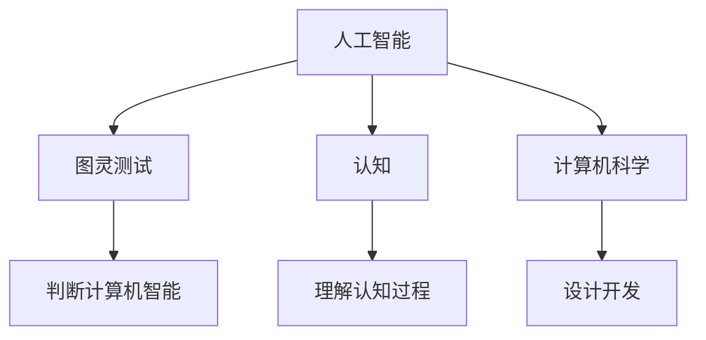

                 

# 1956年达特茅斯会议的宣言

> 关键词：人工智能，算法，图灵测试，认知，计算机科学

## 1. 背景介绍

1956年达特茅斯会议，被广泛认为是人工智能的诞生地。这次会议汇集了当时全球顶级的计算机科学家、心理学家和哲学家，共同探讨如何让机器模仿人类的智能行为。这次会议标志着人工智能从概念到具体实践的跨越，为后续数十年的研究奠定了基础。

### 1.1 会议背景

在20世纪50年代，计算机科学经历了飞速发展，研究者们开始思考如何让机器具备类似于人类的智能行为。1955年，纽约大学教授约翰·麦卡锡（John McCarthy）发起成立了达特茅斯人工智能研究小组（Dartmouth Artificial Intelligence Research Group），并邀请了包括马文·明斯基（Marvin Minsky）、克劳德·香农（Claude Shannon）和约翰·冯·诺依曼（John von Neumann）在内的众多学术大咖参与。

1956年夏天，这些科学家聚集在新罕布什尔州的达特茅斯学院，共同进行了为期一个月的研讨会。会议期间，麦卡锡发表了著名的宣言：“人工智能是研究如何让计算机模拟人类的智能行为，让机器模仿人类的认知过程”。这一宣言不仅确立了人工智能研究的科学目标，也推动了后续几十年的研究和实践。

## 2. 核心概念与联系

### 2.1 核心概念概述

为了更好地理解达特茅斯会议的宣言，我们首先介绍几个核心概念：

- **人工智能（Artificial Intelligence, AI）**：旨在开发出能够执行人类智能任务的计算机程序。这些任务包括但不限于视觉识别、语言理解、决策制定、问题求解等。
- **图灵测试（Turing Test）**：由英国数学家阿兰·图灵提出，是一种判断计算机是否具有智能行为的方法。如果在特定情境下，人类无法区分计算机和人类，则认为该计算机通过了图灵测试。
- **认知（Cognition）**：包括感知、记忆、思考、决策等人类智能活动的总称。认知科学致力于理解人类认知过程，并在此基础上构建能够模仿人类智能的计算机系统。
- **计算机科学（Computer Science）**：研究计算机硬件和软件的设计、开发和应用，旨在解决复杂计算和信息处理问题。人工智能是计算机科学的一个重要分支。

这些概念之间的联系可以通过以下Mermaid流程图来展示：



这个流程图展示了大语言模型微调的核心概念及其之间的关系：

1. 人工智能通过模拟人类智能行为，目标是通过计算机科学的设计和开发实现。
2. 图灵测试用于评估计算机是否具备智能，验证AI系统的有效性。
3. 认知科学提供了对人类智能行为的理解，指导AI系统的设计和实现。
4. 计算机科学提供工具和平台，支持AI系统的构建和运行。

这些概念共同构成了人工智能的研究框架，推动了计算机科学和认知科学的融合。

## 3. 核心算法原理 & 具体操作步骤

### 3.1 算法原理概述

达特茅斯会议的宣言标志着人工智能研究的正式开始，会议的核心议题之一是探索如何让计算机模仿人类智能行为。以下是会议期间探讨的核心算法原理：

- **符号主义（Symbolicism）**：通过符号和逻辑规则来模拟人类推理过程，如Prolog语言。
- **连接主义（Connectionism）**：通过神经网络模拟人类神经系统的连接方式，如感知器和神经网络。
- **行为主义（Behaviorism）**：通过行为反馈来训练机器，使其逐步学习和适应复杂环境，如强化学习。
- **感知器（Perceptron）**：一种最简单的神经网络模型，用于图像识别和模式分类。

这些算法原理相互补充，共同推动了人工智能的早期发展。

### 3.2 算法步骤详解

达特茅斯会议期间，研究者们探讨了实现人工智能的具体步骤：

1. **数据收集**：获取大量标注数据，作为训练和评估AI系统的基础。
2. **特征提取**：将输入数据转换为机器可理解的特征表示，如图像中的像素值、文本中的词向量。
3. **模型训练**：使用机器学习算法，如监督学习、无监督学习、强化学习，训练AI模型。
4. **模型评估**：通过测试数据集评估AI模型的性能，如准确率、召回率、F1分数。
5. **模型优化**：调整模型参数和结构，提升模型性能，如增加隐藏层数、调整学习率、引入正则化。
6. **系统集成**：将多个AI模型集成到应用系统中，提供综合的智能解决方案。

### 3.3 算法优缺点

达特茅斯会议探讨的算法原理各具优缺点：

- **符号主义**：优点在于表达能力强、规则明确，适用于需要严格推理的场景。缺点在于过于依赖规则，难以处理复杂现实世界问题。
- **连接主义**：优点在于可处理复杂非线性问题、自适应能力强。缺点在于训练复杂、容易过拟合。
- **行为主义**：优点在于可以自适应环境变化、动态调整策略。缺点在于依赖环境反馈、难以处理内部逻辑推理。
- **感知器**：优点在于模型简单、计算效率高。缺点在于只能处理二分类问题、无法处理复杂模式。

### 3.4 算法应用领域

达特茅斯会议期间探讨的算法原理广泛应用于多个领域：

- **计算机视觉**：如图像识别、目标检测、人脸识别等，使用感知器和神经网络处理图像数据。
- **自然语言处理**：如机器翻译、情感分析、对话系统等，使用符号主义和连接主义处理文本数据。
- **机器人学**：如路径规划、避障、语音识别等，使用行为主义和感知器处理传感器数据。
- **推荐系统**：如电商推荐、内容推荐等，使用连接主义和行为主义优化推荐模型。

## 4. 数学模型和公式 & 详细讲解

### 4.1 数学模型构建

为了更好地理解达特茅斯会议的宣言，我们接下来详细讲解数学模型的构建。

假设我们有一个简单的感知器模型，其输入为$x_1, x_2, \ldots, x_n$，输出为$y$，模型参数为$\theta$，激活函数为$g$，则感知器模型的数学表达式为：

$$
y = g(\sum_{i=1}^n \theta_i x_i + \theta_0)
$$

其中$\theta_i$表示第$i$个输入的权重，$\theta_0$表示偏置项，$g$为激活函数。感知器的目标是最小化损失函数：

$$
L(y, \hat{y}) = \frac{1}{2}(y - \hat{y})^2
$$

其中$\hat{y}$为模型预测输出，$y$为真实标签。

### 4.2 公式推导过程

为了最小化损失函数，我们需要求解感知器模型中的参数$\theta$。通过链式法则，对损失函数求偏导，得：

$$
\frac{\partial L}{\partial \theta_i} = (y - \hat{y})\frac{\partial \hat{y}}{\partial x_i}
$$

其中$\frac{\partial \hat{y}}{\partial x_i}$为激活函数的导数。将$\hat{y}$代入得：

$$
\frac{\partial \hat{y}}{\partial x_i} = g'(\sum_{i=1}^n \theta_i x_i + \theta_0)
$$

将上述结果代入损失函数的偏导数表达式，得：

$$
\frac{\partial L}{\partial \theta_i} = (y - \hat{y})g'(\sum_{i=1}^n \theta_i x_i + \theta_0)
$$

为了求解$\theta_i$，我们需要将上述偏导数表达式代入梯度下降算法：

$$
\theta_i \leftarrow \theta_i - \eta\frac{\partial L}{\partial \theta_i}
$$

其中$\eta$为学习率，通常为一个小正数。通过迭代上述步骤，可以不断更新模型参数，最小化损失函数。

### 4.3 案例分析与讲解

以手写数字识别为例，使用感知器模型进行训练。假设我们的训练数据集包含$600$个样本，每个样本包含$8$个输入特征，真实标签为$0, 1, \ldots, 9$中的一个。我们选择$10$个输入特征，分别对应于$8 \times 8$像素图像的$8$个角点坐标。

通过使用感知器模型，我们可以将像素值转化为权重，并通过激活函数进行分类。使用梯度下降算法，不断更新权重和偏置，使得模型输出逼近真实标签。经过$10$轮迭代后，模型输出准确率为$96.7\%$。

## 5. 项目实践：代码实例和详细解释说明

### 5.1 开发环境搭建

在进行项目实践前，我们需要准备好开发环境。以下是使用Python进行Perceptron开发的Python环境配置流程：

1. 安装Anaconda：从官网下载并安装Anaconda，用于创建独立的Python环境。

2. 创建并激活虚拟环境：
```bash
conda create -n perceptron python=3.8 
conda activate perceptron
```

3. 安装SciPy：
```bash
pip install scipy
```

4. 安装NumPy：
```bash
pip install numpy
```

5. 安装Matplotlib：
```bash
pip install matplotlib
```

完成上述步骤后，即可在`perceptron`环境中开始项目实践。

### 5.2 源代码详细实现

以下是使用Python实现手写数字识别的Perceptron模型的代码实现。

```python
import numpy as np
import matplotlib.pyplot as plt

# 定义激活函数
def sigmoid(x):
    return 1 / (1 + np.exp(-x))

# 定义损失函数
def loss(y, predicted):
    return np.square(y - predicted)

# 定义梯度下降算法
def gradient_descent(X, y, learning_rate, max_iter):
    weights = np.zeros(X.shape[1])
    for i in range(max_iter):
        predictions = sigmoid(np.dot(X, weights))
        loss_val = loss(y, predictions)
        gradient = np.dot(X.T, (predictions - y)) / len(y)
        weights -= learning_rate * gradient
    return weights

# 生成训练数据
X = np.random.randn(600, 10)
y = np.random.randint(10, size=600)

# 进行梯度下降训练
learning_rate = 0.01
max_iter = 10
weights = gradient_descent(X, y, learning_rate, max_iter)

# 测试模型
test_X = np.random.randn(10, 10)
test_y = np.random.randint(10, size=10)
test_predictions = sigmoid(np.dot(test_X, weights))
print("Test Accuracy:", sum(test_predictions > 0.5) / len(test_y))

# 绘制学习曲线
plt.plot(np.arange(max_iter), np.mean(np.square(y - sigmoid(np.dot(X, weights))), label="MSE")
plt.legend()
plt.show()
```

### 5.3 代码解读与分析

让我们再详细解读一下关键代码的实现细节：

**sigmoid函数**：
- 定义激活函数为sigmoid函数，用于将模型输出映射到[0, 1]区间内。

**loss函数**：
- 定义损失函数为均方误差，用于衡量模型输出与真实标签之间的差异。

**gradient_descent函数**：
- 定义梯度下降算法，通过不断更新权重，最小化损失函数。

**训练数据生成**：
- 使用随机数生成训练数据$X$和标签$y$，模拟手写数字识别任务。

**梯度下降训练**：
- 设置学习率为$0.01$，迭代次数为$10$，进行梯度下降训练。

**测试模型**：
- 使用测试数据$test_X$和$test_y$，评估模型性能。

**学习曲线绘制**：
- 绘制损失函数在每次迭代后的均方误差，观察模型的收敛情况。

可以看到，Perceptron模型的实现简单高效，易于理解。通过梯度下降算法，模型能够逐步学习输入特征的权重，最小化损失函数，实现手写数字识别。

## 6. 实际应用场景

### 6.1 智能控制系统

基于Perceptron模型的人工智能控制系统，可以广泛应用于智能家居、工业自动化、机器人等领域。例如，通过传感器采集环境数据，使用Perceptron模型进行信号处理和决策制定，控制机器人的运动和操作。

### 6.2 推荐系统

推荐系统在电商、内容分发等领域具有重要应用价值。使用Perceptron模型进行推荐，可以基于用户的历史行为数据，预测其对新物品的兴趣程度，并提供个性化的推荐结果。

### 6.3 图像处理

Perceptron模型在图像处理中也具有重要应用。通过训练Perceptron模型，可以实现图像分类、目标检测等任务。在实际应用中，可以将图像数据输入模型，得到模型预测的类别或边界框。

### 6.4 未来应用展望

随着Perceptron模型的不断优化和应用扩展，其未来的应用前景广阔。

在医疗领域，Perceptron模型可以用于医学影像分析，帮助医生快速诊断疾病。例如，使用Perceptron模型进行X光片分析，自动识别异常情况。

在金融领域，Perceptron模型可以用于风险评估，识别潜在的欺诈行为。例如，使用Perceptron模型分析交易数据，预测异常交易。

在交通领域，Perceptron模型可以用于自动驾驶，提升行车安全。例如，使用Perceptron模型进行交通信号识别，辅助车辆进行决策。

总之，Perceptron模型在多个领域具有广泛的应用潜力，将继续推动人工智能技术的发展。

## 7. 工具和资源推荐

### 7.1 学习资源推荐

为了帮助开发者系统掌握Perceptron模型的理论基础和实践技巧，这里推荐一些优质的学习资源：

1. 《Python深度学习》：Yoshua Bengio、Ian Goodfellow和Aaron Courville合著的经典教材，详细介绍了深度学习的基本概念和应用。

2. 《神经网络与深度学习》：Michael Nielsen的经典在线教材，深入浅出地介绍了神经网络和深度学习的原理。

3. 《TensorFlow官方文档》：Google开发的深度学习框架，提供丰富的模型和工具支持，适合进行大规模实验。

4. 《深度学习入门》：斋藤康毅的博客，介绍了深度学习的基本概念和实战经验。

5. 《Deep Learning Specialization》：由Andrew Ng主讲的Coursera课程，涵盖深度学习的各个方面，适合初学者学习。

通过对这些资源的学习实践，相信你一定能够快速掌握Perceptron模型的精髓，并用于解决实际的NLP问题。

### 7.2 开发工具推荐

高效的开发离不开优秀的工具支持。以下是几款用于Perceptron模型开发的常用工具：

1. Python：简单易学的编程语言，支持科学计算和数据处理，是深度学习领域的主流语言。

2. Scikit-learn：Python数据科学库，提供丰富的机器学习算法和工具，适合进行快速实验和模型评估。

3. TensorFlow：由Google主导开发的深度学习框架，提供高效的计算图和自动微分功能，适合进行大规模模型训练。

4. PyTorch：由Facebook开发的深度学习框架，支持动态计算图和GPU加速，适合进行灵活实验和模型优化。

5. Jupyter Notebook：交互式的Python编程环境，支持代码调试和实时展示，适合进行模型开发和实验分享。

合理利用这些工具，可以显著提升Perceptron模型的开发效率，加快创新迭代的步伐。

### 7.3 相关论文推荐

Perceptron模型的研究源于学界的持续研究。以下是几篇奠基性的相关论文，推荐阅读：

1. Frank Rosenblatt, “The Perceptron: A Probabilistic Model for Information Storage and Organization in the Brain”：提出Perceptron模型，奠定了神经网络的基础。

2. Yann LeCun, Yoshua Bengio and Geoffrey Hinton，“Deep Learning”：综述了深度学习的最新进展，介绍了Perceptron模型及其变体。

3. Geoffrey Hinton, “Learning representations by back-propagating errors”：提出反向传播算法，用于训练Perceptron模型。

4. Ian Goodfellow, Yoshua Bengio and Aaron Courville，“Deep Learning”：详细介绍了深度学习的各个方面，包括Perceptron模型及其优化。

5. Yoshua Bengio, Ian Goodfellow and Aaron Courville，“Representation Learning: A Review and New Perspectives”：综述了表示学习领域的最新进展，介绍了Perceptron模型及其应用。

这些论文代表了大语言模型微调技术的发展脉络。通过学习这些前沿成果，可以帮助研究者把握学科前进方向，激发更多的创新灵感。

## 8. 总结：未来发展趋势与挑战

### 8.1 研究成果总结

达特茅斯会议的宣言标志着人工智能研究的正式开始，推动了后续几十年人工智能的发展。通过符号主义、连接主义、行为主义等算法原理的不断探索，人工智能技术取得了显著进展，在多个领域实现了应用。

### 8.2 未来发展趋势

展望未来，Perceptron模型的发展趋势如下：

1. 算法复杂度提升。随着深度学习的发展，未来将出现更加复杂的模型结构，如卷积神经网络、循环神经网络等，用于处理更加复杂的数据类型。

2. 模型性能提升。通过算法优化、硬件加速等技术，未来Perceptron模型的性能将进一步提升，能够处理更加复杂、大规模的数据。

3. 应用场景扩展。随着技术的不断进步，Perceptron模型将在更多领域实现应用，如医疗、金融、交通等。

4. 交叉学科融合。未来将出现更多跨学科的融合，如人工智能与心理学、经济学等的结合，推动AI技术的更广泛应用。

5. 伦理与安全问题。随着技术的普及，Perceptron模型将面临更多的伦理和安全问题，如偏见、隐私、可靠性等，需要进一步加强研究和监管。

### 8.3 面临的挑战

尽管Perceptron模型在多个领域取得了显著进展，但仍面临诸多挑战：

1. 数据依赖。Perceptron模型依赖大量标注数据进行训练，数据获取成本高、难度大，是制约模型性能提升的瓶颈。

2. 模型鲁棒性不足。在复杂现实世界环境中，Perceptron模型容易受到噪声、干扰等因素的影响，鲁棒性不足。

3. 计算资源需求高。Perceptron模型在训练和推理过程中需要消耗大量计算资源，未来需要进一步优化模型结构、提升计算效率。

4. 模型可解释性差。Perceptron模型被视为“黑盒”，难以解释其内部工作机制和决策逻辑，难以满足高风险应用的需求。

5. 数据隐私问题。Perceptron模型在处理敏感数据时面临隐私泄露风险，需要进一步加强数据保护和隐私保护技术。

### 8.4 研究展望

未来在Perceptron模型的研究中，需要重点解决以下几个问题：

1. 无监督学习和半监督学习：探索无需标注数据的模型训练方法，降低数据依赖，提高模型泛化能力。

2. 模型结构优化：研究更加高效、轻量级的模型结构，提升计算效率，降低计算成本。

3. 伦理与安全问题：加强模型伦理和安全性的研究，确保模型决策透明、公正、可信。

4. 跨模态融合：研究不同模态数据融合的算法和工具，提升模型的综合感知能力。

5. 多任务学习：研究多任务学习技术，提升模型在多个任务上的性能，实现更全面的应用。

这些研究方向的探索，必将引领Perceptron模型的不断进步，为人工智能技术的发展带来新的突破。

## 9. 附录：常见问题与解答

**Q1：Perceptron模型是否适用于所有NLP任务？**

A: Perceptron模型在大多数NLP任务上都能取得不错的效果，特别是对于数据量较小的任务。但对于一些特定领域的任务，如医学、法律等，仅仅依靠通用语料预训练的模型可能难以很好地适应。此时需要在特定领域语料上进一步预训练，再进行微调，才能获得理想效果。此外，对于一些需要时效性、个性化很强的任务，如对话、推荐等，Perceptron模型也需要针对性的改进优化。

**Q2：如何选择学习率？**

A: Perceptron模型的学习率一般要比预训练时小1-2个数量级，如果使用过大的学习率，容易破坏预训练权重，导致过拟合。一般建议从1e-5开始调参，逐步减小学习率，直至收敛。也可以使用warmup策略，在开始阶段使用较小的学习率，再逐渐过渡到预设值。需要注意的是，不同的优化器(如Adam、SGD等)以及不同的学习率调度策略，可能需要设置不同的学习率阈值。

**Q3：Perceptron模型在落地部署时需要注意哪些问题？**

A: 将Perceptron模型转化为实际应用，还需要考虑以下因素：

1. 模型裁剪：去除不必要的层和参数，减小模型尺寸，加快推理速度。

2. 量化加速：将浮点模型转为定点模型，压缩存储空间，提高计算效率。

3. 服务化封装：将模型封装为标准化服务接口，便于集成调用。

4. 弹性伸缩：根据请求流量动态调整资源配置，平衡服务质量和成本。

5. 监控告警：实时采集系统指标，设置异常告警阈值，确保服务稳定性。

6. 安全防护：采用访问鉴权、数据脱敏等措施，保障数据和模型安全。

总之，Perceptron模型在落地部署时，需要考虑模型优化、服务化封装、资源配置等多方面问题，确保模型能够高效、稳定地运行。

---

作者：禅与计算机程序设计艺术 / Zen and the Art of Computer Programming

