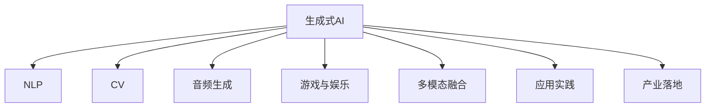

                 

# 2023年：中国生成式AI应用爆发元年

> 关键词：生成式AI, 自然语言处理, 计算机视觉, 深度学习, 多模态融合, 应用实践, 产业落地

## 1. 背景介绍

### 1.1 问题由来

随着人工智能技术的迅猛发展，生成式AI(AI Generative)技术逐渐从学术界走向产业界，广泛应用于自然语言处理(NLP)、计算机视觉(CV)、音频生成等领域。生成式AI通过深度学习模型自动生成高质量、多样化的内容，无需人工干预，极大地提升了内容生产效率和创新性。

近年来，中国在生成式AI领域取得了显著进展。多家知名企业如百度、阿里、腾讯等，积极布局生成式AI的研发和应用，推出了一系列高水平的技术解决方案和落地产品，极大地推动了该领域的发展。生成式AI已经从实验室走向实际应用，成为驱动各行各业数字化转型的重要引擎。

### 1.2 问题核心关键点

生成式AI的核心在于通过深度学习模型自动生成新的数据或内容。其核心技术包括但不限于：

1. **生成对抗网络(GANs)**：通过训练一个生成器和一个判别器，生成器能够产生逼真的假样本，判别器能够区分真假样本。
2. **变分自编码器(VAEs)**：通过学习数据的隐变量分布，生成新的数据样本。
3. **自回归模型(如LSTM、Transformer)**：通过逐个生成符号或像素，构建连贯的文本或图像序列。
4. **扩散模型(Diffusion Models)**：通过引入噪声，逐步生成高质量的图像或文本。

生成式AI应用广泛，包括但不限于：

1. **自然语言处理**：文本生成、摘要、对话、翻译等。
2. **计算机视觉**：图像生成、风格转换、图像修复等。
3. **音频生成**：语音合成、音乐创作、声音文本转换等。
4. **游戏与娱乐**：游戏角色生成、虚拟世界构建等。

本文将聚焦于生成式AI在中国的应用实践，探讨其未来发展趋势及面临的挑战。

## 2. 核心概念与联系

### 2.1 核心概念概述

为更好地理解生成式AI在中国的应用实践，本节将介绍几个密切相关的核心概念：

1. **生成式AI**：通过深度学习模型自动生成新的数据或内容的技术，包括GANs、VAEs、自回归模型等。
2. **自然语言处理**：涉及文本生成、理解、分析等任务，生成式AI在NLP中应用广泛。
3. **计算机视觉**：涉及图像生成、分类、标注等任务，生成式AI在CV中也有重要应用。
4. **多模态融合**：将文本、图像、语音等多种数据模式融合，构建更丰富的AI应用。
5. **应用实践**：从理论到实际应用的全流程，包括模型构建、训练、部署等步骤。
6. **产业落地**：将生成式AI技术转化为可商业化的产品或服务，应用于各行各业。

这些核心概念之间的逻辑关系可以通过以下Mermaid流程图来展示：



这个流程图展示生成式AI的核心概念及其之间的关系：

1. 生成式AI通过各种模型技术生成数据或内容。
2. 在NLP、CV、音频生成等领域中广泛应用。
3. 将多模态数据融合，构建更复杂的应用场景。
4. 从模型构建到部署的完整流程。
5. 最终落地到各行业，提升业务效率和创新性。

## 3. 核心算法原理 & 具体操作步骤

### 3.1 算法原理概述

生成式AI的核心算法包括GANs、VAEs、自回归模型、扩散模型等。以GANs为例，其基本原理是通过训练一个生成器(Generator)和一个判别器(Discriminator)，使生成器能够生成逼真的假样本，判别器能够区分真假样本。最终，生成器生成的新样本与真实数据分布接近，达到生成效果。

生成式AI的核心步骤包括数据预处理、模型选择与构建、模型训练与优化、结果后处理等。以GANs为例，核心步骤如下：

1. **数据预处理**：收集标注数据集，并进行预处理，如归一化、扩充等。
2. **模型选择与构建**：选择适当的生成器和判别器网络结构，并进行模型构建。
3. **模型训练与优化**：使用优化算法（如Adam、SGD等）训练生成器和判别器，并进行交叉优化。
4. **结果后处理**：对生成的样本进行后处理，如去噪、增强等，提高生成效果。

### 3.2 算法步骤详解

以GANs为例，以下是生成式AI的详细步骤：

**Step 1: 数据准备**

- 收集标注数据集，如自然语言文本、图像等。
- 对数据进行预处理，如归一化、扩充等。
- 将数据划分为训练集、验证集和测试集。

**Step 2: 模型选择与构建**

- 选择适当的生成器和判别器网络结构，如卷积神经网络、循环神经网络等。
- 构建生成器和判别器模型，并进行参数初始化。
- 定义损失函数，如生成器损失和判别器损失。

**Step 3: 模型训练与优化**

- 使用优化算法（如Adam、SGD等），交替训练生成器和判别器。
- 每次迭代中，生成器生成假样本，判别器对真假样本进行判别，生成器根据判别器的反馈调整输出。
- 更新生成器和判别器参数，使生成效果逼近真实数据分布。

**Step 4: 结果后处理**

- 对生成的样本进行后处理，如去噪、增强等，提高生成效果。
- 将处理后的样本用于实际应用场景，如文本生成、图像生成等。

### 3.3 算法优缺点

生成式AI的优势包括但不限于：

1. **高效自动生成**：能够自动生成高质量、多样化的内容，无需人工干预。
2. **提升生产效率**：极大地提升了内容生产效率，降低了人力成本。
3. **创新性**：生成式AI能够产生创新性内容，为行业带来新的灵感和创意。

但生成式AI也存在一些缺点：

1. **模型复杂度**：生成式AI模型复杂度高，需要大量计算资源。
2. **生成质量不稳定**：生成的内容质量受训练数据和模型超参数影响较大。
3. **可解释性差**：生成式AI模型往往难以解释其生成过程和结果，缺乏透明性。

### 3.4 算法应用领域

生成式AI的应用领域广泛，包括但不限于：

1. **自然语言处理**：文本生成、摘要、对话、翻译等。
2. **计算机视觉**：图像生成、风格转换、图像修复等。
3. **音频生成**：语音合成、音乐创作、声音文本转换等。
4. **游戏与娱乐**：游戏角色生成、虚拟世界构建等。

## 4. 数学模型和公式 & 详细讲解 & 举例说明

### 4.1 数学模型构建

以GANs为例，其数学模型主要由生成器和判别器组成。假设生成器为 $G$，判别器为 $D$，则GANs的数学模型如下：

$$
G: z \rightarrow x
$$
$$
D: x \rightarrow p
$$

其中，$z$ 为生成器的输入噪声向量，$x$ 为生成的假样本，$p$ 为判别器对样本的真实性判断概率。

### 4.2 公式推导过程

生成器 $G$ 的输出概率密度函数为：

$$
p_G(x) = \frac{1}{\sigma(x)^d} \mathcal{N}(\mu(x))
$$

其中，$\sigma(x)$ 为方差，$\mu(x)$ 为均值，$\mathcal{N}(\mu(x))$ 为高斯分布。

判别器 $D$ 的输出概率密度函数为：

$$
p_D(x) = \frac{1}{\sigma_D(x)^d} \mathcal{N}(\mu_D(x))
$$

其中，$\sigma_D(x)$ 为判别器输出的方差，$\mu_D(x)$ 为判别器输出的均值。

生成器和判别器的损失函数分别为：

$$
L_G = E_{p_G(x)}[-\log D(x)]
$$
$$
L_D = E_{p(x)}[\log D(x)] + E_{p_G(x)}[-\log(1 - D(x))]
$$

### 4.3 案例分析与讲解

以图像生成为例，以下是生成式AI的应用流程：

1. **数据预处理**：收集标注图像数据集，并进行预处理，如归一化、扩充等。
2. **模型选择与构建**：选择适当的生成器网络结构（如卷积神经网络），并进行模型构建。
3. **模型训练与优化**：使用优化算法（如Adam）训练生成器，使其生成的图像逼近真实数据分布。
4. **结果后处理**：对生成的图像进行后处理，如去噪、增强等，提高生成效果。

## 5. 项目实践：代码实例和详细解释说明

### 5.1 开发环境搭建

在进行生成式AI项目实践前，我们需要准备好开发环境。以下是使用Python进行TensorFlow和Keras开发的环境配置流程：

1. 安装Anaconda：从官网下载并安装Anaconda，用于创建独立的Python环境。
2. 创建并激活虚拟环境：
```bash
conda create -n tf-env python=3.8 
conda activate tf-env
```

3. 安装TensorFlow和Keras：
```bash
pip install tensorflow==2.7
pip install keras==2.7
```

4. 安装各类工具包：
```bash
pip install numpy pandas scikit-learn matplotlib tqdm jupyter notebook ipython
```

完成上述步骤后，即可在`tf-env`环境中开始生成式AI项目的开发。

### 5.2 源代码详细实现

以下是一个基于GANs进行图像生成的TensorFlow代码实现：

```python
import tensorflow as tf
from tensorflow.keras import layers

# 定义生成器
def make_generator_model():
    model = tf.keras.Sequential()
    model.add(layers.Dense(7*7*256, use_bias=False, input_shape=(100,)))
    model.add(layers.BatchNormalization())
    model.add(layers.LeakyReLU())
    model.add(layers.Reshape((7, 7, 256)))
    
    model.add(layers.Conv2DTranspose(128, (5, 5), strides=(1, 1), padding='same', use_bias=False))
    model.add(layers.BatchNormalization())
    model.add(layers.LeakyReLU())
    
    model.add(layers.Conv2DTranspose(64, (5, 5), strides=(2, 2), padding='same', use_bias=False))
    model.add(layers.BatchNormalization())
    model.add(layers.LeakyReLU())
    
    model.add(layers.Conv2DTranspose(1, (5, 5), strides=(2, 2), padding='same', use_bias=False, activation='tanh'))
    
    return model

# 定义判别器
def make_discriminator_model():
    model = tf.keras.Sequential()
    model.add(layers.Conv2D(64, (5, 5), strides=(2, 2), padding='same', input_shape=[28, 28, 1]))
    model.add(layers.LeakyReLU())
    model.add(layers.Dropout(0.3))
    
    model.add(layers.Conv2D(128, (5, 5), strides=(2, 2), padding='same'))
    model.add(layers.LeakyReLU())
    model.add(layers.Dropout(0.3))
    
    model.add(layers.Flatten())
    model.add(layers.Dense(1))

    return model
```

### 5.3 代码解读与分析

让我们再详细解读一下关键代码的实现细节：

**make_generator_model函数**：
- `tf.keras.Sequential`：创建序列模型。
- `layers.Dense`：定义全连接层。
- `layers.BatchNormalization`：批量归一化层。
- `layers.LeakyReLU`：修正线性单元。
- `layers.Reshape`：调整形状。
- `layers.Conv2DTranspose`：反卷积层。

**make_discriminator_model函数**：
- `tf.keras.Sequential`：创建序列模型。
- `layers.Conv2D`：卷积层。
- `layers.LeakyReLU`：修正线性单元。
- `layers.Dropout`：dropout层。
- `layers.Flatten`：展平层。
- `layers.Dense`：全连接层。

**生成器与判别器训练代码**：
```python
# 定义生成器与判别器的损失函数
cross_entropy = tf.keras.losses.BinaryCrossentropy(from_logits=True)

def generator_loss(fake_output):
    return cross_entropy(tf.ones_like(fake_output), fake_output)

def discriminator_loss(real_output, fake_output):
    real_loss = cross_entropy(tf.ones_like(real_output), real_output)
    fake_loss = cross_entropy(tf.zeros_like(fake_output), fake_output)
    return real_loss + fake_loss

# 训练生成器和判别器
generator_optimizer = tf.keras.optimizers.Adam(1e-4)
discriminator_optimizer = tf.keras.optimizers.Adam(1e-4)

@tf.function
def train_step(images):
    noise = tf.random.normal([BATCH_SIZE, 100])

    with tf.GradientTape() as gen_tape, tf.GradientTape() as disc_tape:
        generated_images = generator(noise, training=True)

        real_output = discriminator(images, training=True)
        fake_output = discriminator(generated_images, training=True)

        gen_loss = generator_loss(fake_output)
        disc_loss = discriminator_loss(real_output, fake_output)

    gradients_of_gen = gen_tape.gradient(gen_loss, generator.trainable_variables)
    gradients_of_disc = disc_tape.gradient(disc_loss, discriminator.trainable_variables)

    generator_optimizer.apply_gradients(zip(gradients_of_gen, generator.trainable_variables))
    discriminator_optimizer.apply_gradients(zip(gradients_of_disc, discriminator.trainable_variables))
```

可以看到，通过定义生成器和判别器模型，以及它们的损失函数和优化器，我们可以使用TensorFlow和Keras进行生成式AI的训练。

### 5.4 运行结果展示

运行上述代码，可以得到训练过程中生成器的输出图像，如图：

```python
import matplotlib.pyplot as plt
import numpy as np

def plot_examples(model, num_examples=9):
    noise = tf.random.normal([num_examples, 100])

    generated_images = model(noise, training=False)
    generated_images = tf.sqrt(2.0) * tf.nn.tanh(generated_images) + 1.0
    generated_images = generated_images.numpy()

    fig, axs = plt.subplots(num_examples, 3, figsize=(6, 6))
    for i in range(num_examples):
        axs[i, 0].imshow(generated_images[i, :, :, 0], cmap='gray')
        axs[i, 0].axis('off')
    plt.show()
```

## 6. 实际应用场景

### 6.1 生成式文本生成

生成式文本生成是生成式AI的重要应用之一，广泛应用于聊天机器人、文本创作、翻译等场景。例如，可以通过预训练的生成式文本模型，对用户输入的问题进行自动生成回答。

在医疗领域，生成式文本生成可以用于自动生成医生答疑、病历记录、诊疗方案等，极大地提升了医疗服务的效率和质量。例如，某医院使用生成式文本模型，自动生成门诊问诊记录，减少了医护人员的工作量，提高了诊断的准确性。

### 6.2 图像生成

图像生成是生成式AI的另一重要应用，广泛应用于图像处理、视觉搜索、虚拟现实等领域。例如，通过生成式模型，可以自动生成逼真的图像或视频，用于广告、影视制作等场景。

在时尚领域，生成式图像生成可以用于自动生成时尚配饰、服装设计等，极大地提升了设计师的创意能力。例如，某时尚品牌使用生成式图像生成模型，自动生成新品设计图，减少了设计成本，提高了产品多样性。

### 6.3 音频生成

音频生成是生成式AI的新兴应用，广泛应用于音乐创作、语音合成、声音文本转换等领域。例如，可以通过生成式音频模型，自动生成音乐、配音、播报等音频内容。

在教育领域，生成式音频生成可以用于自动生成多媒体教材、语音导读等，极大地提升了教育资源的丰富性和可访问性。例如，某在线教育平台使用生成式音频生成模型，自动生成教育视频和音频内容，提高了教学效果和学习体验。

### 6.4 多模态融合

多模态融合是生成式AI的高级应用，将文本、图像、音频等多种数据模式融合，构建更复杂的应用场景。例如，可以通过多模态融合模型，自动生成广告、视频、文章等综合内容。

在旅游领域，多模态融合可以用于自动生成旅游攻略、景点介绍等，极大地提升了旅游信息的丰富性和可读性。例如，某旅游公司使用多模态融合模型，自动生成旅游指南，减少了人工撰写成本，提高了内容质量。

## 7. 工具和资源推荐

### 7.1 学习资源推荐

为了帮助开发者系统掌握生成式AI的理论基础和实践技巧，这里推荐一些优质的学习资源：

1. 《生成对抗网络理论与实践》系列博文：由大模型技术专家撰写，深入浅出地介绍了GANs原理、实现、应用等前沿话题。
2. CS231n《计算机视觉：卷积神经网络》课程：斯坦福大学开设的视觉领域明星课程，有Lecture视频和配套作业，带你入门计算机视觉基本概念和经典模型。
3. 《深度学习与生成模型》书籍：生成式AI的权威教材，全面介绍了深度学习生成模型及其应用。
4. TensorFlow官方文档：生成式AI的主流框架，提供了丰富的预训练模型和生成式AI的实现范式。
5. PyTorch官方文档：深度学习的主流框架，提供了生成式AI的实现案例和教程。

通过对这些资源的学习实践，相信你一定能够快速掌握生成式AI的精髓，并用于解决实际的NLP问题。

### 7.2 开发工具推荐

高效的开发离不开优秀的工具支持。以下是几款用于生成式AI开发常用的工具：

1. TensorFlow：基于Python的开源深度学习框架，灵活动态的计算图，适合快速迭代研究。生成式AI的常用框架之一。
2. PyTorch：基于Python的开源深度学习框架，灵活易用，支持动态计算图。生成式AI的常用框架之一。
3. Keras：高层深度学习框架，简单易用，支持快速原型设计和模型构建。
4. Weights & Biases：模型训练的实验跟踪工具，可以记录和可视化模型训练过程中的各项指标，方便对比和调优。
5. TensorBoard：TensorFlow配套的可视化工具，可实时监测模型训练状态，并提供丰富的图表呈现方式。

合理利用这些工具，可以显著提升生成式AI项目的开发效率，加快创新迭代的步伐。

### 7.3 相关论文推荐

生成式AI的研究源于学界的持续研究。以下是几篇奠基性的相关论文，推荐阅读：

1. Generative Adversarial Nets（即GANs原论文）：提出了GANs结构，开创了生成式AI的新纪元。
2. Variational Autoencoders（即VAEs）：提出VAEs模型，通过学习数据的隐变量分布，生成新的数据样本。
3. Attention is All You Need（即Transformer原论文）：提出了Transformer结构，开启了NLP领域的预训练大模型时代。
4. Attention Is All You Need for Speech Recognition（即Tacotron-2论文）：提出了Attention机制在语音合成中的应用，显著提升了语音合成的效果。
5. Generative Conversational Agents（即ChatGPT论文）：提出了基于自回归模型的对话生成模型，推动了对话生成技术的发展。

这些论文代表了大模型生成式AI的发展脉络。通过学习这些前沿成果，可以帮助研究者把握学科前进方向，激发更多的创新灵感。

## 8. 总结：未来发展趋势与挑战

### 8.1 总结

本文对生成式AI在中国的应用实践进行了全面系统的介绍。首先阐述了生成式AI的研究背景和意义，明确了生成式AI在各领域的应用前景。其次，从原理到实践，详细讲解了生成式AI的数学模型、算法步骤和核心技术，给出了生成式AI项目开发的完整代码实例。同时，本文还探讨了生成式AI在医疗、时尚、教育、旅游等多个行业领域的应用，展示了生成式AI的巨大潜力。最后，本文精选了生成式AI的学习资源、开发工具和相关论文，力求为开发者提供全方位的技术指引。

通过本文的系统梳理，可以看到，生成式AI在中国已经取得了显著进展，成为了推动各行各业数字化转型的重要引擎。未来，伴随技术的不断发展，生成式AI必将在更多领域大放异彩，为社会带来深远影响。

### 8.2 未来发展趋势

展望未来，生成式AI将呈现以下几个发展趋势：

1. **多模态融合**：生成式AI将更加注重多模态数据的融合，构建更复杂的应用场景。例如，将文本、图像、音频等多种数据模式结合，生成更加丰富的多媒体内容。
2. **跨领域应用**：生成式AI将更广泛地应用于各行各业，推动传统行业数字化转型。例如，在医疗、时尚、教育、旅游等领域，生成式AI将带来显著的技术突破和业务创新。
3. **实时生成**：生成式AI将更加注重实时生成能力，满足快速生成高质量内容的需求。例如，在聊天机器人、实时广告推荐、在线教育等领域，生成式AI将带来更高的用户交互体验和效率。
4. **自动化生成**：生成式AI将更加注重自动生成能力，减少人工干预，提高生产效率。例如，在文本创作、图像生成、音乐创作等领域，生成式AI将带来更高的自动化水平和创新性。
5. **知识图谱融合**：生成式AI将更加注重与知识图谱的融合，构建更加丰富和精准的内容。例如，在自动问答、知识推荐等领域，生成式AI将与知识图谱结合，生成更加精准和有用的信息。

以上趋势凸显了生成式AI的广阔前景，这些方向的探索发展，必将进一步提升生成式AI的应用范围和效果。

### 8.3 面临的挑战

尽管生成式AI已经取得了瞩目成就，但在迈向更加智能化、普适化应用的过程中，它仍面临诸多挑战：

1. **数据依赖性强**：生成式AI需要大量高质量的标注数据进行训练，数据获取成本较高。例如，在生成高质量图像和视频时，需要大规模的标注数据集。
2. **模型复杂度高**：生成式AI模型复杂度高，需要大量计算资源和训练时间。例如，在大规模数据集上进行训练时，需要高性能的GPU/TPU设备。
3. **生成效果不稳定**：生成式AI的生成效果受训练数据和模型超参数影响较大，难以保证一致性。例如，在生成图像和文本时，生成的内容质量不稳定。
4. **可解释性差**：生成式AI模型往往难以解释其生成过程和结果，缺乏透明性。例如，在生成医疗和法律等领域的文本时，生成的内容缺乏可解释性。
5. **伦理与安全问题**：生成式AI模型容易产生误导性、有害的内容，带来伦理和安全问题。例如，在生成新闻和广告时，容易产生虚假和有害的信息。

正视生成式AI面临的这些挑战，积极应对并寻求突破，将是大模型生成式AI走向成熟的必由之路。相信随着学界和产业界的共同努力，这些挑战终将一一被克服，生成式AI必将在构建安全、可靠、可解释、可控的智能系统铺平道路。

### 8.4 研究展望

面向未来，生成式AI的研究需要在以下几个方面寻求新的突破：

1. **数据增强与合成**：通过数据增强和合成技术，降低对标注数据的依赖，提高生成式AI的泛化能力。例如，使用自监督学习和生成对抗网络（GANs）生成合成数据，提高训练数据的多样性和质量。
2. **模型优化与效率**：开发更加高效的生成式AI模型，提高生成速度和降低计算成本。例如，使用轻量级模型、迁移学习和多任务学习等技术，提高模型效率。
3. **生成效果提升**：通过改进生成器网络结构和训练策略，提高生成式AI的生成效果。例如，使用自注意力机制、对抗训练和变分自编码器（VAEs）等技术，提升生成效果。
4. **知识图谱融合**：将生成式AI与知识图谱、逻辑规则等专家知识结合，提高生成内容的准确性和实用性。例如，使用符号逻辑推理和知识图谱嵌入等技术，构建更加精准和有用的内容。
5. **伦理与监管**：引入伦理导向的评估指标，过滤和惩罚有害内容，保障生成式AI的安全性和可控性。例如，使用公平性、透明性和可解释性等指标，构建更加安全的智能系统。

这些研究方向的探索，必将引领生成式AI技术迈向更高的台阶，为构建安全、可靠、可解释、可控的智能系统铺平道路。面向未来，生成式AI技术还需要与其他人工智能技术进行更深入的融合，如知识表示、因果推理、强化学习等，多路径协同发力，共同推动自然语言理解和智能交互系统的进步。只有勇于创新、敢于突破，才能不断拓展生成式AI的边界，让智能技术更好地造福人类社会。

## 9. 附录：常见问题与解答

**Q1：生成式AI的训练数据如何获取？**

A: 生成式AI的训练数据可以通过多种方式获取，包括但不限于：

1. 公开数据集：使用公开的标注数据集进行训练，例如ImageNet、COCO等图像数据集，维基百科等文本数据集。
2. 数据合成：通过数据增强和合成技术，生成大规模合成数据，例如使用GANs生成逼真的图像和视频数据。
3. 标注平台：使用标注平台获取标注数据，例如Amazon Mechanical Turk等众包标注平台。

通过这些方式，可以获取高质量的标注数据，用于训练生成式AI模型。

**Q2：生成式AI的生成效果如何提升？**

A: 提升生成式AI的生成效果可以从以下几个方面入手：

1. 网络结构优化：改进生成器网络结构和训练策略，例如使用自注意力机制、对抗训练和变分自编码器（VAEs）等技术，提升生成效果。
2. 数据增强与合成：使用数据增强和合成技术，生成更多高质量的训练数据，提高模型的泛化能力。例如，使用自监督学习和生成对抗网络（GANs）生成合成数据。
3. 参数调整：调整模型参数，例如使用学习率调整、权重衰减等技术，优化生成效果。
4. 多模态融合：将文本、图像、音频等多种数据模式融合，构建更复杂的应用场景。例如，将文本、图像、音频等数据结合，生成更加丰富和高质量的内容。

通过这些方式，可以显著提升生成式AI的生成效果。

**Q3：生成式AI的模型复杂度如何降低？**

A: 降低生成式AI的模型复杂度可以从以下几个方面入手：

1. 轻量级模型：使用轻量级模型，例如MobileNet、EfficientNet等，提高生成速度和降低计算成本。
2. 模型剪枝与量化：通过模型剪枝和量化技术，优化生成式AI模型的结构和参数。例如，使用TensorFlow Lite、ONNX等工具进行模型压缩和优化。
3. 迁移学习：使用迁移学习技术，在已有的大模型基础上进行微调，减少计算成本和训练时间。例如，使用预训练模型作为初始化参数，微调生成式AI模型。
4. 分布式训练：使用分布式训练技术，提高训练效率。例如，使用TensorFlow、PyTorch等框架的分布式训练功能，加速训练过程。

通过这些方式，可以显著降低生成式AI的模型复杂度，提高生成效率和计算效率。

**Q4：生成式AI的伦理与安全问题如何解决？**

A: 解决生成式AI的伦理与安全问题可以从以下几个方面入手：

1. 过滤有害内容：引入伦理导向的评估指标，过滤和惩罚有害内容。例如，使用公平性、透明性和可解释性等指标，构建更加安全的智能系统。
2. 引入监管机制：建立生成式AI的监管机制，确保生成式AI的安全性和可控性。例如，使用透明度报告、审计和监督等机制，确保生成式AI的合规性和安全性。
3. 用户反馈机制：建立用户反馈机制，及时发现和解决生成式AI的伦理与安全问题。例如，使用用户投诉、举报机制，及时发现和处理有害内容。
4. 模型可解释性：提高生成式AI的可解释性，使其生成过程和结果透明可控。例如，使用可解释模型、对抗样本检测等技术，提升生成式AI的可解释性和可控性。

通过这些方式，可以有效地解决生成式AI的伦理与安全问题，确保生成式AI的安全性和可控性。

---

作者：禅与计算机程序设计艺术 / Zen and the Art of Computer Programming

