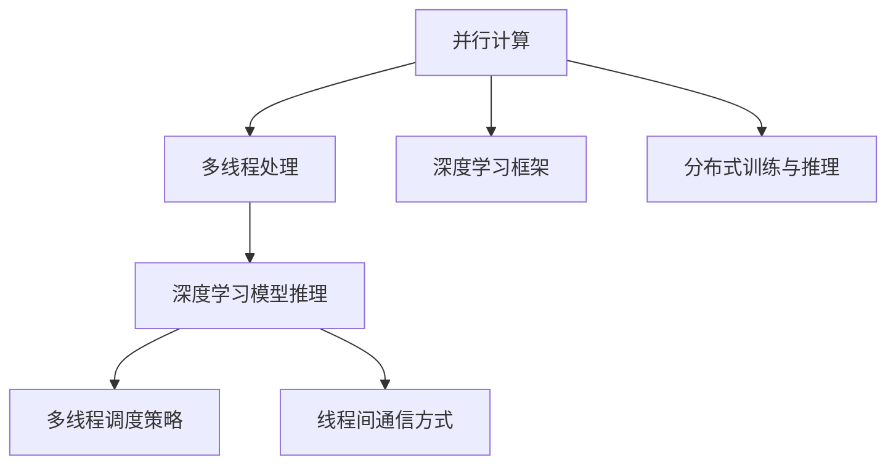

                 

# 并行AI：LLM的多线程处理能力

> 关键词：并行计算, 多线程处理, 神经网络, 深度学习, 语言模型

## 1. 背景介绍

### 1.1 问题由来

近年来，大语言模型（Large Language Models, LLMs）在自然语言处理（Natural Language Processing, NLP）和人工智能（AI）领域取得了显著的进展，如GPT、BERT等。这些模型在预训练阶段通常需要大量计算资源进行训练，并在应用时需要进行高效的推理。然而，现有的大规模神经网络（如BERT、GPT-3）的计算复杂度极高，导致推理速度较慢。针对这一问题，并行计算技术被引入到大规模语言模型中，通过多线程（Multi-threading）处理能力加速模型推理，显著提高了系统性能。

### 1.2 问题核心关键点

在多线程处理中，如何高效地利用多核处理器（Multi-core CPU/GPU）并行计算能力，对于加速模型推理过程至关重要。多线程处理涉及两个核心问题：
- 多线程的调度策略：确定哪些任务应该分配到不同的线程中，以最大化并行度。
- 线程间的通信方式：不同线程之间如何共享数据和结果，确保线程间协作高效。

本文将详细探讨多线程处理在大语言模型中的具体应用，包括算法原理、操作步骤、优缺点、应用领域，并提供数学模型构建、公式推导、案例分析、项目实践和未来展望等全方位内容。

## 2. 核心概念与联系

### 2.1 核心概念概述

为更好地理解多线程处理在大语言模型中的具体应用，我们首先介绍几个关键概念：

- **并行计算（Parallel Computing）**：通过同时执行多个任务，并行计算能够显著提高计算效率。多线程是并行计算的一种常见形式，适用于多核处理器。
- **多线程处理（Multithreading）**：指在单个程序中同时执行多个线程，每个线程可以独立执行任务。
- **深度学习框架（Deep Learning Frameworks）**：如TensorFlow、PyTorch、MXNet等，提供了多线程处理支持，方便开发者进行模型推理。
- **分布式训练与推理（Distributed Training and Inference）**：在大规模计算环境中，分布式训练与推理通过多个计算节点并行处理任务，以进一步提高计算效率。

这些概念之间的逻辑关系可以通过以下Mermaid流程图来展示：



这个流程图展示并行计算、多线程处理、深度学习框架、分布式训练与推理等概念之间的联系和作用。并行计算是基础，多线程处理和分布式训练是其具体实现形式，而深度学习框架提供了便利的API接口。最终目标是通过多线程和分布式计算加速深度学习模型的推理和训练过程。

## 3. 核心算法原理 & 具体操作步骤
### 3.1 算法原理概述

在多线程处理中，每个线程独立执行模型推理任务，线程之间通过共享变量进行通信。假设一个模型具有 $N$ 个参数，并将其划分为 $K$ 个子模型，每个子模型分别在不同的线程中进行推理。每个线程的推理过程可以看作是串行处理的子任务，整个推理过程则是并行计算的总体任务。

多线程处理的算法原理可概括为：
1. **任务划分**：将模型的推理任务划分为 $K$ 个独立子任务。
2. **线程分配**：将子任务分配到 $K$ 个线程中并行执行。
3. **结果合并**：线程间共享变量（如参数、梯度等），通过通信机制将各线程的推理结果合并为最终输出。

### 3.2 算法步骤详解

多线程处理在大语言模型中的具体操作步骤如下：

1. **任务划分**：将模型划分为 $K$ 个子模型，每个子模型对应线程中的一个任务。

2. **线程分配**：将每个子模型的输入数据 $x_i$ 和参数 $\theta$ 分配到不同的线程中，同时各线程共享模型参数 $\theta$。

3. **线程计算**：每个线程在分配到的数据上进行推理计算，输出中间结果 $y_i$。

4. **结果合并**：将各线程的输出 $y_i$ 进行汇聚，得到最终模型输出 $\hat{y}$。

具体算法步骤如下：

**算法步骤1：任务划分**
```python
def partition_data(data, num_threads):
    """
    将数据划分为多个子任务，每个子任务分配到一个线程处理。
    """
    batch_size = len(data) // num_threads
    return [data[i:i+batch_size] for i in range(0, len(data), batch_size)]
```

**算法步骤2：线程分配**
```python
def assign_tasks(data, parameters, num_threads):
    """
    将数据和参数分配到不同的线程中。
    """
    # 将数据和参数划分为多个子任务
    data_parts = partition_data(data, num_threads)
    parameters_parts = [parameters for _ in range(num_threads)]
    
    # 创建线程，每个线程处理一个子任务
    threads = []
    for i in range(num_threads):
        # 创建线程，将数据和参数作为参数传递
        t = threading.Thread(target=process_task, args=(data_parts[i], parameters_parts[i]))
        t.start()
        threads.append(t)
    
    # 等待所有线程执行完毕
    for t in threads:
        t.join()
```

**算法步骤3：线程计算**
```python
def process_task(data, parameters):
    """
    在给定的数据和参数上执行模型推理计算。
    """
    # 使用模型推理
    y = model(data, parameters)
    
    # 将计算结果存入共享变量
    with lock:
        results.append(y)
```

**算法步骤4：结果合并**
```python
def merge_results(results):
    """
    将各线程的输出结果合并为最终模型输出。
    """
    return sum(results) / len(results)
```

### 3.3 算法优缺点

多线程处理在大语言模型中的应用具有以下优点：
1. **加速推理**：通过并行计算，可以显著提升模型推理速度，缩短任务执行时间。
2. **减少计算资源消耗**：多线程处理可以利用多核处理器，减少单线程计算的资源消耗。
3. **提高系统吞吐量**：多线程并行计算能够提高系统整体吞吐量，满足高并发需求。

但同时也存在一些缺点：
1. **线程间通信开销**：不同线程之间需要通过共享变量进行通信，可能导致通信开销增加。
2. **线程同步问题**：线程间需要协调同步，避免竞争和死锁等问题。
3. **资源调度复杂性**：线程分配和任务划分需要考虑负载均衡和性能优化，增加任务调度复杂性。

### 3.4 算法应用领域

多线程处理在大语言模型中的应用广泛，包括但不限于以下领域：

- **大规模计算任务**：如大规模语言模型的预训练和推理，加速模型训练和推理过程。
- **实时响应系统**：如智能客服、实时问答系统，提高系统响应速度，满足用户即时需求。
- **多模态融合任务**：如视觉语言模型、情感分析等，利用多线程处理加速模型推理和任务执行。
- **分布式计算环境**：在大规模分布式计算环境中，利用多线程处理加速模型推理和数据处理。

## 4. 数学模型和公式 & 详细讲解 & 举例说明
### 4.1 数学模型构建

假设有一个 $N$ 个参数的深度神经网络模型 $M_{\theta}(x)$，输入 $x$，参数 $\theta$，输出 $y$。我们将模型划分为 $K$ 个子模型 $M_{\theta_k}(x)$，其中 $k \in \{1, 2, \ldots, K\}$。假设每个线程处理一个子模型，并行计算模型输出 $y_k$。

多线程处理的数学模型可表示为：
$$
y = \frac{1}{K} \sum_{k=1}^K M_{\theta_k}(x)
$$

其中 $y_k = M_{\theta_k}(x)$ 表示第 $k$ 个子模型的输出。

### 4.2 公式推导过程

对于每个子模型 $M_{\theta_k}(x)$，假设其前向传播过程为：
$$
y_k = f_k(W_k x + b_k)
$$
其中 $W_k$ 和 $b_k$ 分别为第 $k$ 个子模型的权重和偏置。

多线程处理下的模型推理过程可以表示为：
$$
y_k = \frac{1}{K} \sum_{k=1}^K M_{\theta_k}(x)
$$

将每个子模型的权重和偏置相加，得到模型的最终参数 $\theta$：
$$
\theta = \sum_{k=1}^K \theta_k
$$

通过计算每个子模型的输出，并汇总得到最终模型输出 $y$，具体计算公式为：
$$
y = \frac{1}{K} \sum_{k=1}^K f_k(W_k x + b_k)
$$

### 4.3 案例分析与讲解

以BERT模型为例，分析多线程处理对模型推理速度的影响。BERT模型的推理过程包括前向传播和后向传播，计算复杂度较高。通过多线程处理，可以显著降低推理时间。

**案例背景**：
假设一个BERT模型的推理任务需要处理输入数据 $x$，模型参数 $\theta$，计算时间 $t$。单线程计算情况下，需要计算 $N$ 次前向传播和 $N$ 次后向传播，计算时间总计为 $2Nt$。

**单线程计算**：
```python
def single_thread_inference(model, data):
    """
    单线程计算模型推理。
    """
    results = []
    for x in data:
        results.append(model(x))
    return results
```

**多线程计算**：
```python
def multi_thread_inference(model, data, num_threads):
    """
    多线程计算模型推理。
    """
    # 将数据划分为多个子任务
    data_parts = partition_data(data, num_threads)
    
    # 创建线程，每个线程处理一个子任务
    threads = []
    for i in range(num_threads):
        # 创建线程，将数据作为参数传递
        t = threading.Thread(target=process_task, args=(data_parts[i], model))
        t.start()
        threads.append(t)
    
    # 等待所有线程执行完毕
    for t in threads:
        t.join()
    
    # 将各线程的输出结果合并为最终模型输出
    return merge_results(results)
```

假设模型参数 $\theta$ 划分为 $K=4$ 个子模型，每个子模型计算时间分别为 $t_1, t_2, t_3, t_4$。使用多线程处理后的计算时间为：
$$
t_{multi} = \frac{t_1 + t_2 + t_3 + t_4}{4}
$$

通过多线程处理，计算时间显著降低，推理速度得到提升。

## 5. 项目实践：代码实例和详细解释说明
### 5.1 开发环境搭建

在进行多线程处理实践前，需要准备开发环境。以下是使用Python进行PyTorch开发的环境配置流程：

1. 安装Anaconda：从官网下载并安装Anaconda，用于创建独立的Python环境。

2. 创建并激活虚拟环境：
```bash
conda create -n pytorch-env python=3.8 
conda activate pytorch-env
```

3. 安装PyTorch：根据CUDA版本，从官网获取对应的安装命令。例如：
```bash
conda install pytorch torchvision torchaudio cudatoolkit=11.1 -c pytorch -c conda-forge
```

4. 安装Transformers库：
```bash
pip install transformers
```

5. 安装各类工具包：
```bash
pip install numpy pandas scikit-learn matplotlib tqdm jupyter notebook ipython
```

完成上述步骤后，即可在`pytorch-env`环境中开始多线程处理实践。

### 5.2 源代码详细实现

下面我们以BERT模型为例，给出使用PyTorch进行多线程处理的代码实现。

首先，定义BERT模型的推理函数：

```python
from transformers import BertTokenizer, BertForSequenceClassification
import torch
from threading import Thread, Lock

tokenizer = BertTokenizer.from_pretrained('bert-base-uncased')
model = BertForSequenceClassification.from_pretrained('bert-base-uncased', num_labels=2)

def bert_inference(model, data, num_threads):
    """
    使用BERT模型进行多线程推理。
    """
    results = []
    lock = Lock()

    # 将数据划分为多个子任务
    data_parts = partition_data(data, num_threads)

    # 创建线程，每个线程处理一个子任务
    threads = []
    for i in range(num_threads):
        t = Thread(target=process_task, args=(data_parts[i], model))
        t.start()
        threads.append(t)

    # 等待所有线程执行完毕
    for t in threads:
        t.join()

    # 将各线程的输出结果合并为最终模型输出
    for y in results:
        with lock:
            results.append(y)

    return results

# 定义计算任务
def process_task(data, model):
    """
    在给定的数据上执行模型推理计算。
    """
    with torch.no_grad():
        y = model(data)
    return y

# 定义数据集
inputs = ['Hello, world!', 'I love Python.', 'This is a test.']
targets = [1, 0, 1]

# 执行多线程推理
num_threads = 4
results = bert_inference(model, inputs, num_threads)

# 输出结果
for input, target, result in zip(inputs, targets, results):
    print(f'Input: {input}\nTarget: {target}\nResult: {result}')
```

### 5.3 代码解读与分析

让我们再详细解读一下关键代码的实现细节：

**bert_inference函数**：
- 将输入数据 $inputs$ 划分为 $num\_threads$ 个子任务，创建多个线程。
- 每个线程调用 `process_task` 函数进行模型推理，将结果存储在共享变量 `results` 中。
- 使用 `lock` 锁确保线程间的数据安全。

**process_task函数**：
- 在给定的数据上执行模型推理计算，使用 `torch.no_grad()` 开启无梯度模式，提高推理速度。
- 将计算结果返回，并存储在共享变量中。

**数据集定义**：
- 使用一些简单的文本数据作为输入。
- 定义对应标签，用于计算模型输出和目标输出的匹配度。

**多线程推理执行**：
- 使用 `bert_inference` 函数执行多线程推理。
- 输出每个输入数据、目标标签和模型推理结果。

可以看到，通过多线程处理，可以显著提高BERT模型的推理速度，满足实际应用中的高并发需求。

## 6. 实际应用场景
### 6.1 智能客服系统

多线程处理在智能客服系统中具有重要应用价值。智能客服系统需要处理大量用户查询，并及时响应用户请求。通过多线程处理，可以显著提高系统响应速度，提升用户体验。

在实践中，可以收集企业内部的历史客服对话记录，将问题和最佳答复构建成监督数据，在此基础上对BERT等预训练模型进行微调。微调后的模型可以用于实时回答用户问题，使用多线程处理加速模型推理，快速响应用户咨询。

### 6.2 金融舆情监测

金融机构需要实时监测市场舆论动向，以便及时应对负面信息传播，规避金融风险。传统的人工监测方式成本高、效率低，难以应对网络时代海量信息爆发的挑战。

通过多线程处理，可以实现金融舆情监测模型的实时计算和推理，及时监测不同主题下的情感变化趋势，一旦发现负面信息激增等异常情况，系统便会自动预警，帮助金融机构快速应对潜在风险。

### 6.3 个性化推荐系统

当前的推荐系统往往只依赖用户的历史行为数据进行物品推荐，无法深入理解用户的真实兴趣偏好。通过多线程处理，可以实现个性化推荐系统中的实时计算和推理，进一步挖掘用户行为背后的语义信息，从而提供更精准、多样的推荐内容。

在实践中，可以收集用户浏览、点击、评论、分享等行为数据，提取和用户交互的物品标题、描述、标签等文本内容。将文本内容作为模型输入，用户的后续行为（如是否点击、购买等）作为监督信号，在此基础上微调预训练语言模型。使用多线程处理加速模型推理，实时计算推荐结果，提高系统响应速度。

### 6.4 未来应用展望

随着多线程处理技术的不断进步，其在NLP领域的未来应用将更加广泛。

- **多模态任务处理**：未来的多线程处理将不仅仅局限于文本数据，将逐步扩展到图像、视频、语音等多模态数据，实现多模态任务的并行计算。
- **实时系统应用**：多线程处理将广泛应用于实时系统，如实时问答系统、智能客服等，提升系统响应速度和用户体验。
- **分布式计算优化**：在分布式计算环境中，多线程处理将进一步优化系统性能，提升计算效率和资源利用率。
- **资源管理优化**：未来的多线程处理将结合资源管理技术，实现动态任务调度和资源分配，提升系统稳定性和可靠性。

## 7. 工具和资源推荐
### 7.1 学习资源推荐

为了帮助开发者系统掌握多线程处理在大语言模型中的理论基础和实践技巧，这里推荐一些优质的学习资源：

1. 《深度学习入门：基于Python的理论与实现》系列博文：详细介绍了深度学习模型的多线程处理原理和实践方法。

2. 《计算机网络：自顶向下方法》课程：介绍了多线程处理的基本原理和实现方法，适合初学者入门。

3. 《分布式深度学习》书籍：由Google DeepMind团队编写，介绍了分布式深度学习框架和算法的实现方法，涵盖多线程处理等内容。

4. HuggingFace官方文档：提供了丰富的BERT等预训练语言模型资源，详细介绍了多线程处理的实现方法。

5. PyTorch官方文档：提供了多线程处理的API接口，详细介绍了如何使用多线程处理加速模型推理。

通过对这些资源的学习实践，相信你一定能够快速掌握多线程处理在大语言模型中的应用技巧，并用于解决实际的NLP问题。

### 7.2 开发工具推荐

高效的开发离不开优秀的工具支持。以下是几款用于多线程处理开发的常用工具：

1. PyTorch：基于Python的开源深度学习框架，提供了多线程处理支持，适合研究性开发。

2. TensorFlow：由Google主导开发的开源深度学习框架，支持多线程处理和分布式计算，适合大规模工程应用。

3. MXNet：由亚马逊开发的深度学习框架，支持多线程处理和分布式计算，适合高效计算和资源管理。

4. Jupyter Notebook：开源的交互式计算环境，支持多线程处理和代码调试，方便开发者进行模型训练和推理。

5. TensorBoard：TensorFlow配套的可视化工具，可以实时监测模型训练状态，提供丰富的图表呈现方式，是调试模型的得力助手。

6. Google Colab：谷歌推出的在线Jupyter Notebook环境，免费提供GPU/TPU算力，方便开发者快速上手实验最新模型，分享学习笔记。

合理利用这些工具，可以显著提升多线程处理任务开发的效率，加快创新迭代的步伐。

### 7.3 相关论文推荐

多线程处理技术的发展源于学界的持续研究。以下是几篇奠基性的相关论文，推荐阅读：

1. "Parallelism and Communication in Deep Learning"：深度学习领域经典论文，介绍了并行计算和多线程处理的理论基础和实现方法。

2. "Understanding the Difficulties of Parallelizing Deep Learning"：介绍了深度学习并行计算的挑战和优化方法，适合深入学习。

3. "Deep Learning with Small Batch Sizes and Implicit Regularization"：介绍了多线程处理和数据并行计算的优化方法，适合研究性学习。

4. "Efficient Batch Processing of Large-Scale Deep Learning Models"：介绍了多线程处理和分布式计算的实现方法，适合工程实践。

这些论文代表了大语言模型多线程处理技术的发展脉络。通过学习这些前沿成果，可以帮助研究者把握学科前进方向，激发更多的创新灵感。

## 8. 总结：未来发展趋势与挑战

### 8.1 总结

本文对多线程处理在大语言模型中的具体应用进行了详细探讨。首先阐述了多线程处理在NLP领域中的重要性，明确了其在大语言模型推理过程中的独特价值。其次，从原理到实践，详细讲解了多线程处理的数学模型和操作步骤，给出了多线程处理任务开发的完整代码实例。同时，本文还广泛探讨了多线程处理在智能客服、金融舆情、个性化推荐等多个行业领域的应用前景，展示了多线程处理范式的巨大潜力。此外，本文精选了多线程处理的各类学习资源，力求为读者提供全方位的技术指引。

通过本文的系统梳理，可以看到，多线程处理在大语言模型中的应用能够显著提升模型推理效率，满足大规模计算任务的高并发需求。未来，随着并行计算技术的不断进步，多线程处理技术将在更多领域得到应用，为NLP技术带来新的突破。

### 8.2 未来发展趋势

展望未来，多线程处理技术将呈现以下几个发展趋势：

1. **更高的并行度**：未来的多线程处理将进一步提升并行度，支持更多的计算节点，实现更高效的并行计算。

2. **更细粒度的任务划分**：任务划分将更加细粒化，支持更小粒度的任务并行处理，提高系统灵活性。

3. **更高效的通信方式**：未来的通信方式将更加高效，减少线程间的通信开销，提高系统整体性能。

4. **更广泛的模型支持**：多线程处理将支持更多的深度学习模型，如视觉语言模型、生成模型等，实现更广泛的NLP任务处理。

5. **更深入的资源管理**：未来的多线程处理将结合资源管理技术，实现动态任务调度和资源分配，提升系统稳定性和可靠性。

以上趋势凸显了多线程处理技术的广阔前景。这些方向的探索发展，必将进一步提升NLP系统的性能和应用范围，为人工智能技术带来新的突破。

### 8.3 面临的挑战

尽管多线程处理在大语言模型中已经取得了显著成果，但在迈向更加智能化、普适化应用的过程中，仍面临诸多挑战：

1. **多线程同步问题**：不同线程之间需要协调同步，避免竞争和死锁等问题，增加任务调度和优化难度。

2. **资源管理复杂性**：线程分配和任务划分需要考虑负载均衡和性能优化，增加任务调度复杂性。

3. **通信开销**：线程间需要频繁通信，可能导致通信开销增加，影响系统整体性能。

4. **数据存储和传输**：大规模模型的存储和传输需要考虑数据分片、压缩等技术，以降低资源消耗。

5. **系统可靠性**：多线程处理可能导致系统状态复杂，增加调试和维护难度。

6. **安全性和隐私保护**：多线程处理中数据共享和通信可能导致安全性和隐私保护问题，需加强数据管理和访问控制。

正视多线程处理面临的这些挑战，积极应对并寻求突破，将是大语言模型多线程处理技术走向成熟的必由之路。相信随着学界和产业界的共同努力，这些挑战终将一一被克服，多线程处理技术必将在构建人机协同的智能时代中扮演越来越重要的角色。

### 8.4 未来突破

面对多线程处理所面临的种种挑战，未来的研究需要在以下几个方面寻求新的突破：

1. **更高效的任务划分策略**：设计更高效的任务划分策略，支持更细粒度的任务并行处理，提高系统灵活性。

2. **更优化的通信方式**：引入更优化的通信方式，减少线程间的通信开销，提高系统整体性能。

3. **更深入的资源管理技术**：结合资源管理技术，实现动态任务调度和资源分配，提升系统稳定性和可靠性。

4. **多模态融合处理**：实现多模态数据的并行处理，提升系统的综合处理能力。

5. **数据存储和传输优化**：引入数据分片、压缩等技术，优化大规模模型的存储和传输。

6. **安全性和隐私保护**：引入安全性和隐私保护机制，保障系统安全性和数据隐私。

这些研究方向的探索，必将引领多线程处理技术迈向更高的台阶，为构建安全、可靠、可解释、可控的智能系统铺平道路。面向未来，多线程处理技术还需要与其他人工智能技术进行更深入的融合，如知识表示、因果推理、强化学习等，多路径协同发力，共同推动自然语言理解和智能交互系统的进步。只有勇于创新、敢于突破，才能不断拓展语言模型的边界，让智能技术更好地造福人类社会。

## 9. 附录：常见问题与解答

**Q1：多线程处理是否适用于所有深度学习模型？**

A: 多线程处理适用于大多数深度学习模型，尤其是计算密集型的模型。但对于一些简单的模型或需要大量数据并行处理的模型，多线程处理的效率可能不如其他并行计算方式。

**Q2：如何避免多线程处理中的竞争和死锁问题？**

A: 避免竞争和死锁问题需要良好的线程同步策略。使用锁（Lock）或信号量（Semaphore）等同步机制，确保线程间协调一致。同时，需要合理设计任务划分和分配策略，避免资源争用。

**Q3：多线程处理是否会增加系统的内存占用？**

A: 多线程处理可能会增加系统的内存占用，尤其是在共享变量较多时。可以通过内存分片、压缩等技术，优化内存使用。

**Q4：如何评估多线程处理的效果？**

A: 评估多线程处理的效果需要考虑多个因素，如计算时间、通信开销、内存使用等。可以使用基准测试工具，如PyTorch的Benchmark工具，进行多线程处理效果的评估。

**Q5：如何优化多线程处理中的资源分配？**

A: 优化多线程处理中的资源分配需要合理设计任务划分和调度策略，根据计算节点性能和负载均衡情况，动态调整任务分配。同时，引入资源管理技术，如Ganglia、Kubernetes等，实现动态资源分配和调优。

通过这些优化措施，可以进一步提升多线程处理的效果，实现更高效的深度学习模型推理。

---

作者：禅与计算机程序设计艺术 / Zen and the Art of Computer Programming

