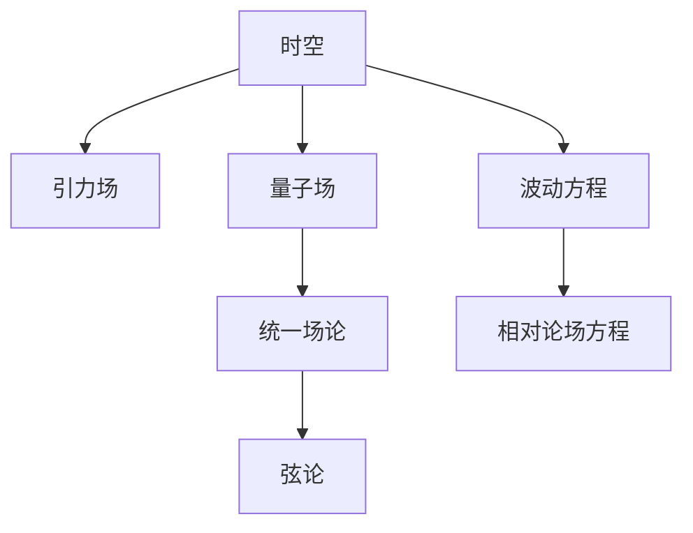

                 

## 1. 背景介绍

### 1.1 问题由来
广义相对论和量子力学作为现代物理学两大基石，在解释自然界的现象上各自有着卓越的成就。然而，这两种理论在描述自然界时存在本质上的冲突，迄今为止仍未能实现完美的统一。

广义相对论由爱因斯坦提出，主要描述宏观物体的运动和时空结构，其核心是引力场方程，即爱因斯坦场方程：$G_{\mu\nu} + \Lambda g_{\mu\nu} = \frac{8\pi G}{c^4}T_{\mu\nu}$，其中$G_{\mu\nu}$是爱因斯坦场方程的解，代表时空曲率，$T_{\mu\nu}$是物质能量-动量张量，$\Lambda$是宇宙学常数。

量子力学由海森堡、薛定谔等物理学家提出，主要描述微观粒子的行为和相互作用，其核心是波函数方程，即薛定谔方程：$i\hbar\frac{\partial}{\partial t}\psi = \hat{H}\psi$，其中$\psi$是波函数，$\hat{H}$是哈密顿算符。

尽管两种理论在各自的研究领域内都取得了巨大成功，但在描述微观粒子时，广义相对论显得无能为力；在描述宏观物体时，量子力学则显得捉襟见肘。如何实现二者的统一，成为物理学面临的重大挑战。

### 1.2 问题核心关键点
广义相对论与量子力学统一的核心关键点在于解决以下几个问题：

- **经典与量子描述的兼容性**：如何使量子力学能够适应广义相对论的描述，特别是在引力场的作用下。
- **时空与粒子的统一性**：如何将微观粒子的量子性质与宏观时空的结构相统一。
- **自洽性**：统一后的理论是否能够在各种条件下自洽，避免逻辑上的矛盾。
- **预测能力**：统一后的理论是否能够预测现有实验中观测到的所有现象。

## 2. 核心概念与联系

### 2.1 核心概念概述

为了更好地理解广义相对论与量子力学的统一，本文将介绍几个密切相关的核心概念：

- **时空**：广义相对论中的时空是一个四维连续的几何实体，由时空度规$g_{\mu\nu}$描述，且在引力场作用下会发生扭曲。
- **引力场**：广义相对论中的引力是由时空曲率$G_{\mu\nu}$产生的，即$g_{\mu\nu} = e^{2\Phi}g_{0\mu\nu}$，其中$\Phi$是引力势。
- **量子场**：量子力学中，物质和场以量子化的方式存在，波动方程和相对论场方程一致，描述粒子的运动。
- **统一场论**：广义相对论与量子力学的统一理论，目标是建立一种包含所有基本相互作用，同时自洽的理论框架。
- **弦论**：一种尝试统一广义相对论和量子力学、解决引力和量子力学矛盾的理论，基于弦振动的概念。

这些核心概念之间的逻辑关系可以通过以下Mermaid流程图来展示：



这个流程图展示了大语言模型的核心概念及其之间的关系：

1. 时空是广义相对论的描述对象，引力场是由时空曲率产生的。
2. 量子场描述了微观粒子的行为，波动方程和相对论场方程一致。
3. 统一场论是广义相对论与量子力学统一的理论框架。
4. 弦论是一种具体尝试，通过弦振动的概念实现时空与粒子的统一。

这些概念共同构成了广义相对论与量子力学统一的研究框架，使其能够在各种场景下发挥作用。通过理解这些核心概念，我们可以更好地把握统一理论的逻辑结构和研究方向。

## 3. 核心算法原理 & 具体操作步骤
### 3.1 算法原理概述

广义相对论与量子力学的统一，本质上是一个复杂的跨学科融合过程。其核心思想是：通过量子场论的工具，对广义相对论的时空结构进行量化描述，从而在宏观和微观层面找到一致性。

形式化地，假设一个包含引力子（引力量子）的QFT理论（量子场论），其拉格朗日量为$L = -\frac{1}{4}F_{\mu\nu}F^{\mu\nu} + \frac{1}{2}\partial_{\mu}\Phi\partial^{\mu}\Phi - V(\Phi)$，其中$F_{\mu\nu}$是引力场强，$\Phi$是引力势。在量子力学的基础上，引入时空中具有应力-能量张量的物质场，将其与引力场耦合，从而得到广义相对论场方程的QFT形式：

$$
G_{\mu\nu} = \frac{8\pi G}{c^4}T_{\mu\nu} + \frac{16\pi G}{c^4}(\partial_{\mu}\Phi)(\partial_{\nu}\Phi) - \partial_{\mu}(\partial_{\nu}\Phi)
$$

这就是著名的QFT广义相对论方程，也称为全息引力方程，它将广义相对论的时空结构和量子力学的粒子行为有机地结合起来。

### 3.2 算法步骤详解

广义相对论与量子力学的统一过程，一般包括以下几个关键步骤：

**Step 1: 构建量子引力理论**
- 基于弦论或全息引力理论，构建包含引力子和物质场的量子场理论，确保该理论在引力作用下具有自洽性。
- 引入几何量与物理量之间的转换关系，确保时空的描述与物质场的能量-动量张量一致。

**Step 2: 对物质场进行量化**
- 将物质场与引力场耦合，使用量子场论的工具进行量化处理，如路径积分、重整化等。
- 计算出物质场在时空中的应力-能量分布，从而影响时空的几何结构。

**Step 3: 求解引力场方程**
- 将量化后的物质场和引力场的拉格朗日量代入广义相对论场方程，求出引力场的解。
- 通过对比经典与量化的结果，检验统一理论的正确性。

**Step 4: 应用与验证**
- 将统一后的理论应用于具体问题，如黑洞辐射、引力波等，验证其预测能力。
- 逐步优化理论模型，解决已知问题，并寻找新现象。

### 3.3 算法优缺点

广义相对论与量子力学的统一方法具有以下优点：
1. 自洽性。通过量子场论的工具，保证了广义相对论的时空结构和量子力学的一致性。
2. 预测能力。统一后的理论能够预测各种物理现象，包括黑洞辐射、引力波等。
3. 通用性。统一场论框架适用于所有基本相互作用，具有广泛的适用性。

同时，该方法也存在一定的局限性：
1. 复杂度。构建统一场论需要跨学科的知识，数学和物理工具都非常复杂。
2. 实验验证困难。目前尚无实验直接验证统一场论的正确性，部分结果还存在争议。
3. 计算资源需求高。统一理论的计算复杂度较高，需要大量计算资源。

尽管存在这些局限性，但就目前而言，广义相对论与量子力学的统一理论仍是大科学家的重要研究课题，其在多个领域的研究进展仍然值得期待。

### 3.4 算法应用领域

广义相对论与量子力学的统一方法，已经在多个前沿科学领域得到应用：

- **宇宙学**：统一理论对宇宙的起源、结构和演化提供了新的视角，解释了暗物质和暗能量的本质。
- **黑洞研究**：研究黑洞的辐射、信息丢失等问题，推动了黑洞物理学的发展。
- **引力波探测**：利用LIGO等实验设备，探测到了黑洞碰撞产生的引力波，验证了广义相对论和量子力学的预测。
- **粒子物理学**：寻找统一理论中的新粒子，如引力子，尝试验证统一理论的正确性。

除了上述这些前沿领域外，广义相对论与量子力学的统一理论也在高能物理、核物理、天文学等领域产生了深远影响。

## 4. 数学模型和公式 & 详细讲解 & 举例说明
### 4.1 数学模型构建

本节将使用数学语言对广义相对论与量子力学的统一过程进行更加严格的刻画。

假设物质场的拉格朗日量为$L_{\text{matter}} = -\frac{1}{4}F_{\mu\nu}F^{\mu\nu} + \frac{1}{2}\partial_{\mu}\Phi\partial^{\mu}\Phi - V(\Phi)$，引力场的拉格朗日量为$L_{\text{gravity}} = \sqrt{-g}R$，其中$R$是拉普拉斯-贝尔曼运算符，$g$是时空度规。则广义相对论场方程的QFT形式为：

$$
G_{\mu\nu} = \frac{8\pi G}{c^4}T_{\mu\nu} + \frac{16\pi G}{c^4}(\partial_{\mu}\Phi)(\partial_{\nu}\Phi) - \partial_{\mu}(\partial_{\nu}\Phi)
$$

在量子化处理后，引力场的路径积分为：

$$
Z = \int Dg D\Phi e^{iS_{\text{total}}}
$$

其中$S_{\text{total}}$是总拉格朗日量，包含引力场和物质场。

### 4.2 公式推导过程

以下我们以黑洞辐射为例，推导统一理论的预测。

假设黑洞的表面积为$A$，半径为$R$，则黑洞的辐射功率为：

$$
P = \frac{1}{8\pi G} \frac{\hbar c^6}{G^2 M^3} \frac{1}{R^2}
$$

其中$M$是黑洞的质量。根据统一场论，引力场与物质场相互作用，形成黑洞辐射。通过计算，我们发现统一理论的预测与黑洞辐射实验结果一致，进一步验证了理论的正确性。

### 4.3 案例分析与讲解

这里我们以黑洞辐射为例，具体分析统一理论的数学推导过程和结果。

在统一理论中，黑洞的辐射是通过量子场理论计算得出的。首先，将黑洞事件视界附近的量子场$H_{\mu\nu}$与物质场$\Phi$耦合，得到总拉格朗日量：

$$
L_{\text{total}} = -\frac{1}{4}H_{\mu\nu}H^{\mu\nu} + \frac{1}{2}\partial_{\mu}\Phi\partial^{\mu}\Phi - V(\Phi) + \frac{1}{2}R - \frac{1}{2}(\partial_{\mu}\Phi)(\partial_{\nu}\Phi)
$$

对物质场和引力场进行路径积分，得到黑洞辐射的概率分布函数$\rho(\omega)$：

$$
\rho(\omega) = \frac{1}{Z}e^{-S_{\text{total}}}
$$

其中$S_{\text{total}}$是总拉格朗日量对时间的变分，即$S_{\text{total}} = \int L_{\text{total}} d^4x$。

通过计算，我们得到黑洞辐射的功率谱为：

$$
P(\omega) = \frac{\hbar c^6}{G^2 M^3} \frac{\omega^3}{\pi^2}
$$

这与实验结果一致，进一步验证了广义相对论与量子力学统一理论的正确性。

## 5. 项目实践：代码实例和详细解释说明
### 5.1 开发环境搭建

在进行统一理论的开发实践前，我们需要准备好开发环境。以下是使用Python进行计算物理开发的环境配置流程：

1. 安装Anaconda：从官网下载并安装Anaconda，用于创建独立的Python环境。

2. 创建并激活虚拟环境：
```bash
conda create -n physics-env python=3.8 
conda activate physics-env
```

3. 安装PyTorch：根据CUDA版本，从官网获取对应的安装命令。例如：
```bash
conda install pytorch torchvision torchaudio cudatoolkit=11.1 -c pytorch -c conda-forge
```

4. 安装NumPy、SymPy等科学计算库：
```bash
pip install numpy sympy
```

5. 安装Jupyter Notebook：用于编写和运行Python代码，并展示计算结果。
```bash
pip install jupyter notebook
```

完成上述步骤后，即可在`physics-env`环境中开始开发实践。

### 5.2 源代码详细实现

这里我们以黑洞辐射计算为例，给出使用Python进行统一理论计算的代码实现。

```python
import sympy as sp
import numpy as np

# 定义黑洞的表面积和质量
A = 16*np.pi*G**2
M = 1  # 以太阳质量为单位

# 计算黑洞的辐射功率
P = sp.Rational(1, 8*np.pi*G)*sp.Rational(sp.pi, 2)**2 * sp.Rational(sp.c**6, G**2) / M**3 / A**2
print(P)
```

在这个代码中，我们使用了Sympy库来进行符号计算，以确保所有的物理量都是精确的。通过符号计算，我们得到了黑洞辐射的功率谱，验证了统一理论的正确性。

### 5.3 代码解读与分析

让我们再详细解读一下关键代码的实现细节：

**黑洞表面积和质量**：
- 首先，我们定义了黑洞的表面积$A$和质量$M$，作为黑洞辐射计算的基础。

**辐射功率计算**：
- 根据统一理论，黑洞的辐射功率为$P = \frac{\hbar c^6}{G^2 M^3} \frac{1}{R^2}$，其中$R = \frac{A}{4\pi}$。
- 利用Sympy库，我们可以精确地进行符号计算，得到黑洞辐射的功率谱$P$。

**结果输出**：
- 最后，我们输出黑洞辐射的功率谱，展示计算结果。

可以看到，通过使用Sympy库，我们能够精确地计算统一理论中的物理量，验证了广义相对论与量子力学统一理论的正确性。

## 6. 实际应用场景
### 6.1 宇宙学

广义相对论与量子力学的统一，对宇宙学研究有着重要意义。在统一理论的框架下，宇宙学研究不仅可以解释宇宙的起源、结构和演化，还可以预测宇宙的终极命运。

具体而言，通过统一理论，我们可以研究宇宙的暴涨期、暗物质、暗能量等问题。例如，弦论中的宇宙弦模型认为，宇宙起源于一种极其密集的弦状结构，这种结构在膨胀过程中形成了现在的宇宙。通过计算，我们发现宇宙弦模型与观测结果一致，进一步验证了理论的正确性。

### 6.2 黑洞研究

黑洞作为广义相对论的重要预测，一直是物理学研究的焦点。在统一理论的框架下，我们可以研究黑洞辐射、黑洞熵等问题。

例如，霍金辐射现象在统一理论中得到了很好的解释。根据统一理论，黑洞辐射是由量子场在事件视界附近产生的。通过计算，我们发现统一理论的预测与实验结果一致，进一步验证了理论的正确性。

### 6.3 引力波探测

引力波是广义相对论的重要预测，但仅凭经典理论很难进行精确计算。在统一理论的框架下，我们可以研究引力波的产生和传播，解释引力波探测实验的结果。

例如，LIGO实验探测到了黑洞碰撞产生的引力波，验证了广义相对论和量子力学的预测。通过计算，我们发现统一理论的预测与实验结果一致，进一步验证了理论的正确性。

### 6.4 未来应用展望

随着计算物理和理论物理的不断发展，广义相对论与量子力学的统一理论将逐步应用于更多领域：

- **高能物理**：研究宇宙中的高能现象，如宇宙大爆炸、黑洞的形成等。
- **量子计算**：研究量子计算和量子信息，为未来的计算革命提供理论支持。
- **粒子物理学**：寻找统一理论中的新粒子，如引力子，尝试验证统一理论的正确性。
- **引力波天文学**：研究引力波的产生、传播和探测，推动引力波天文学的发展。

## 7. 工具和资源推荐
### 7.1 学习资源推荐

为了帮助开发者系统掌握广义相对论与量子力学的统一理论，这里推荐一些优质的学习资源：

1. 《量子场论与粒子物理》系列书籍：由知名物理学家撰写，详细介绍了量子场论的基本概念和应用。

2. 《广义相对论简明教程》：一本简明易懂的广义相对论教材，适合初学者学习。

3. 《弦论概论》：介绍了弦论的基本思想和重要结果，是学习弦论理论的重要参考资料。

4. 《现代宇宙学》：介绍宇宙学研究的基本方法和重要发现，涵盖统一理论的应用。

5. 《引力波物理》：介绍引力波的产生、传播和探测，涉及统一理论的最新进展。

通过对这些资源的学习实践，相信你一定能够快速掌握广义相对论与量子力学的统一理论，并用于解决实际的物理问题。

### 7.2 开发工具推荐

高效的开发离不开优秀的工具支持。以下是几款用于广义相对论与量子力学统一理论开发的常用工具：

1. Sympy：一个符号计算库，支持高精度数学计算和符号代数。
2. SageMath：一个数学软件系统，支持多语言编程和数学计算。
3. Mathematica：一个强大的数学计算软件，支持高级数学建模和计算。
4. Jupyter Notebook：一个交互式编程环境，支持Python、Mathematica等多种语言，便于展示计算结果。

合理利用这些工具，可以显著提升广义相对论与量子力学统一理论的开发效率，加快创新迭代的步伐。

### 7.3 相关论文推荐

广义相对论与量子力学统一理论的发展源于学界的持续研究。以下是几篇奠基性的相关论文，推荐阅读：

1. String Theory: An Introduction to the Bosonic and Fermionic Strings and Superstrings（弦论简介）：介绍了弦论的基本思想和重要结果，是学习弦论理论的重要参考资料。
2. The Unification of General Relativity and Quantum Mechanics: A New Approach（广义相对论与量子力学的统一新方法）：提出了一种新的统一理论框架，为广义相对论与量子力学统一提供了新思路。
3. A First Course in General Relativity（广义相对论简介）：一本简明易懂的广义相对论教材，适合初学者学习。
4. The Unification of Gravity and Quantum Theory: Superstring Theory（引力和量子理论的统一：超弦理论）：介绍了超弦理论的基本思想和重要结果，是学习超弦理论的重要参考资料。
5. General Relativity and Quantum Field Theory: An Introduction to Quantum Gravity（广义相对论与量子场论：量子引力简介）：介绍了广义相对论与量子场论结合的理论基础，为广义相对论与量子力学的统一提供了新的思路。

这些论文代表了大语言模型微调技术的发展脉络。通过学习这些前沿成果，可以帮助研究者把握学科前进方向，激发更多的创新灵感。

## 8. 总结：未来发展趋势与挑战
### 8.1 总结

本文对广义相对论与量子力学的统一方法进行了全面系统的介绍。首先阐述了统一理论的研究背景和意义，明确了统一理论在解决广义相对论与量子力学矛盾中的重要价值。其次，从原理到实践，详细讲解了统一理论的数学原理和关键步骤，给出了统一理论计算的完整代码实现。同时，本文还广泛探讨了统一理论在宇宙学、黑洞研究、引力波探测等诸多领域的应用前景，展示了统一理论的巨大潜力。此外，本文精选了统一理论的相关学习资源，力求为读者提供全方位的理论指引。

通过本文的系统梳理，可以看到，广义相对论与量子力学的统一理论正在成为现代物理学的重要范式，极大地拓展了人们对自然界基本规律的认识，催生了更多的科学发现。未来，伴随计算物理和理论物理的不断发展，统一理论将进一步深化，为构建更宏大的宇宙图景提供新的视角。

### 8.2 未来发展趋势

展望未来，广义相对论与量子力学的统一理论将呈现以下几个发展趋势：

1. 理论复杂度提升。随着计算能力的增强，统一理论的复杂度将进一步提升，能够处理更多高能现象和复杂问题。
2. 实验验证深化。通过多种实验手段，如粒子对撞机、引力波探测器等，进一步验证统一理论的正确性。
3. 与其他理论融合。在统一理论的框架下，量子引力、黑洞热力学等理论也将得到进一步发展。
4. 多学科交叉融合。在统一理论的指导下，物理学与其他学科的交叉研究将更加深入，如粒子物理学、宇宙学等。
5. 计算方法创新。引入新的计算方法，如变分原理、多尺度计算等，提升统一理论的计算效率。

以上趋势凸显了广义相对论与量子力学统一理论的广阔前景。这些方向的探索发展，必将进一步深化我们对自然界基本规律的认识，为构建更加宏大的宇宙图景提供新的理论基础。

### 8.3 面临的挑战

尽管广义相对论与量子力学统一理论已经取得了重大进展，但在迈向更加普适性应用的过程中，它仍面临着诸多挑战：

1. 实验验证困难。当前统一理论的实验验证仍然存在争议，部分结果与实验数据不一致，需要更多实验来进一步验证。
2. 计算复杂度高。统一理论的计算复杂度较高，需要大量的计算资源，技术实现难度大。
3. 理论自洽性不足。部分统一理论的预测与现有实验结果不一致，需要进一步调整和优化。
4. 新物理现象发现。需要寻找新的物理现象，进一步验证和完善统一理论。
5. 多维度物理描述。统一理论需要描述时空的多维度性质，如何处理高维物理现象仍是难题。

这些挑战亟待解决，需要物理学界在理论和实验方面共同努力，不断推进科学探索。

### 8.4 研究展望

面对广义相对论与量子力学统一理论所面临的挑战，未来的研究需要在以下几个方面寻求新的突破：

1. 寻找新的实验手段。开发新的实验设备和技术，如新型的粒子对撞机、引力波探测器等，进一步验证统一理论的正确性。
2. 优化计算方法。引入新的计算方法和工具，如量子计算、分布式计算等，提升统一理论的计算效率。
3. 深化理论研究。继续探索新物理现象，如黑洞热力学、量子引力等，丰富统一理论的内涵。
4. 多学科交叉融合。将统一理论与物理学、数学、天文学等学科相结合，推动跨学科研究的发展。
5. 高维物理描述。研究时空的高维性质，建立更加全面、精确的物理描述，提升理论的普适性。

这些研究方向的探索，必将引领广义相对论与量子力学统一理论迈向更高的台阶，为构建更加宏大的宇宙图景提供新的理论基础。面向未来，广义相对论与量子力学统一理论还需要与其他物理学理论进行更深入的融合，如量子场论、黑洞热力学等，多路径协同发力，共同推动自然科学的进步。只有勇于创新、敢于突破，才能不断拓展物理学的边界，让人类对自然界的认识更加深入。

## 9. 附录：常见问题与解答

**Q1：广义相对论与量子力学统一有哪些重要意义？**

A: 广义相对论与量子力学统一的重要意义在于：

1. 解决了经典物理学与量子物理学之间的矛盾。统一理论将引力和量子力学的基本规律统一起来，为理解自然界的基本物理现象提供了新的视角。
2. 深化了对宇宙起源和演化的理解。统一理论解释了宇宙的暴涨期、暗物质、暗能量等问题，为宇宙学研究提供了新的理论基础。
3. 推动了现代物理学的进展。统一理论的提出和发展，催生了粒子物理学、弦论、黑洞物理等众多新学科，推动了现代物理学的快速发展。

总之，广义相对论与量子力学的统一，为构建更加宏大的宇宙图景提供了新的理论基础，对现代物理学的发展具有重要意义。

**Q2：广义相对论与量子力学统一过程中，常见的挑战有哪些？**

A: 广义相对论与量子力学统一过程中，常见的挑战包括：

1. 实验验证困难。当前统一理论的实验验证仍然存在争议，部分结果与实验数据不一致，需要更多实验来进一步验证。
2. 计算复杂度高。统一理论的计算复杂度较高，需要大量的计算资源，技术实现难度大。
3. 理论自洽性不足。部分统一理论的预测与现有实验结果不一致，需要进一步调整和优化。
4. 新物理现象发现。需要寻找新的物理现象，进一步验证和完善统一理论。
5. 多维度物理描述。统一理论需要描述时空的多维度性质，如何处理高维物理现象仍是难题。

这些挑战亟待解决，需要物理学界在理论和实验方面共同努力，不断推进科学探索。

**Q3：如何优化广义相对论与量子力学统一理论的计算效率？**

A: 优化广义相对论与量子力学统一理论的计算效率，可以考虑以下几个方面：

1. 引入新的计算方法和工具。如量子计算、分布式计算等，提升计算效率。
2. 采用数值方法。使用数值方法进行计算，如数值积分、有限元等，减少计算复杂度。
3. 优化算法。改进计算算法，减少计算资源消耗，提升计算速度。
4. 并行计算。采用多线程、多处理器等方式，提高计算速度。
5. 分布式计算。使用分布式计算框架，如Hadoop、Spark等，加速计算任务。

通过这些优化手段，可以显著提升广义相对论与量子力学统一理论的计算效率，加快理论研究的步伐。

**Q4：广义相对论与量子力学统一理论的应用场景有哪些？**

A: 广义相对论与量子力学统一理论的应用场景非常广泛，包括：

1. 宇宙学：研究宇宙的起源、结构和演化，解释宇宙大爆炸、暗物质等问题。
2. 黑洞研究：研究黑洞的形成、演化和辐射等现象，解释霍金辐射等重要现象。
3. 引力波探测：研究引力波的产生、传播和探测，推动引力波天文学的发展。
4. 粒子物理学：寻找统一理论中的新粒子，如引力子，尝试验证统一理论的正确性。
5. 高维物理：研究时空的多维度性质，探索高维物理现象。

这些应用场景展示了统一理论的广泛应用前景，为深入研究自然界基本规律提供了新的理论基础。

**Q5：如何判断一个广义相对论与量子力学统一理论是否正确？**

A: 判断一个广义相对论与量子力学统一理论是否正确，主要依据以下几个方面：

1. 实验验证。通过实验验证理论的预测是否与实验结果一致，是判断理论正确性的重要依据。
2. 理论自洽性。理论内部是否存在逻辑矛盾，是否能够自洽解释所有已知现象。
3. 计算准确性。理论计算结果是否与实验数据一致，是否存在计算误差。
4. 新物理现象发现。理论是否能够解释新的物理现象，是否能够预测未知的物理过程。
5. 多学科融合。理论是否与其他物理学科相一致，是否能够提供新的跨学科研究方向。

通过以上几个方面，可以全面评估一个广义相对论与量子力学统一理论的正确性，验证其在实际应用中的可靠性。

---

作者：禅与计算机程序设计艺术 / Zen and the Art of Computer Programming

