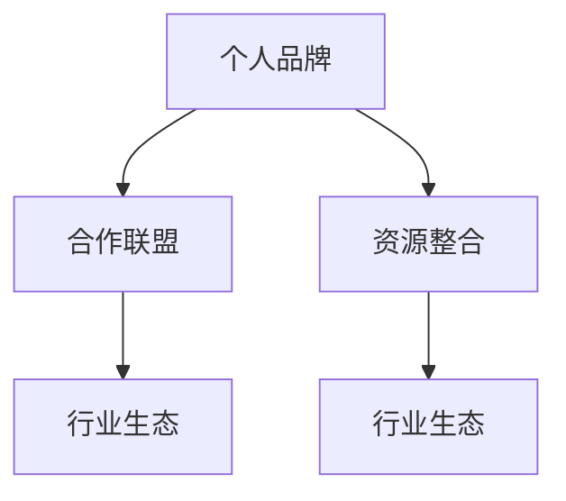

                 

# 建立个人品牌合作联盟：整合行业资源

> 关键词：个人品牌、合作联盟、资源整合、行业生态、数字化转型、云计算、大数据、人工智能

## 1. 背景介绍

### 1.1 问题由来
在当今快速变化的数字化时代，个人品牌和合作联盟在企业发展中扮演着越来越重要的角色。个人品牌可以帮助企业家或员工展示专业技能和行业影响力，吸引更多合作伙伴和客户；而合作联盟则能整合多方资源，提升整体竞争力。尤其是在云计算、大数据、人工智能等新兴领域，资源整合与共享已经成为行业发展的关键驱动力。

### 1.2 问题核心关键点
本文聚焦于如何在数字化转型背景下，建立有效的个人品牌合作联盟，探讨如何通过整合行业资源，实现更高效、更创新的解决方案。重点关注以下几个核心点：
- **个人品牌建设**：如何提升个人在行业内的影响力和权威性。
- **合作联盟构建**：如何选择合作伙伴，并建立长期稳定的合作关系。
- **资源整合机制**：如何优化资源配置，提升资源利用效率。
- **行业生态系统**：如何构建一个更加开放、互惠的行业生态。

### 1.3 问题研究意义
建立个人品牌合作联盟不仅有助于提升企业在行业中的地位，还能促进知识共享和技术创新，推动整个行业的发展。具体意义包括：
1. **增强竞争力**：通过整合行业资源，提升企业的市场竞争力和行业影响力。
2. **加速创新**：合作联盟中的知识交流和技术共享，加速了新技术、新产品的开发和应用。
3. **提升效率**：优化资源配置，降低成本，提高运营效率。
4. **促进生态系统发展**：构建开放、互惠的行业生态，推动整个行业的健康发展。

## 2. 核心概念与联系

### 2.1 核心概念概述

为更好地理解建立个人品牌合作联盟的过程，本节将介绍几个关键概念：

- **个人品牌**：指个人在特定行业内的知名度、专业技能和权威性，是个人在行业内影响力的重要体现。
- **合作联盟**：指多个组织或个人为了共同的商业目标而组成的合作关系，旨在共享资源、共同开发新业务、提升整体竞争力。
- **资源整合**：指将不同来源、不同形式的资源，通过有效的管理、优化和配置，实现最大化的利用价值。
- **行业生态系统**：指由一系列相互关联的组织、企业、个人和技术构成的一个系统，能够促进资源的共享和流动。

这些概念之间的逻辑关系可以通过以下Mermaid流程图来展示：



这个流程图展示了个体与整体之间的相互作用关系：
- **个人品牌**通过在**合作联盟**中发挥影响力，推动资源的**整合**，最终促进整个**行业生态**的繁荣。

## 3. 核心算法原理 & 具体操作步骤
### 3.1 算法原理概述

建立个人品牌合作联盟的核心在于如何通过网络效应、知识共享和资源优化，最大化地提升联盟成员的协同效应。算法原理包括以下几个步骤：

1. **网络效应构建**：通过社交网络分析、合作网络构建等方法，识别和建立关键合作伙伴关系。
2. **知识共享机制**：建立知识库、文档管理系统，促进成员间知识和经验的共享。
3. **资源优化配置**：通过云计算、大数据、人工智能等技术手段，优化资源配置，提升整体效率。
4. **协同效应提升**：通过协同工具、项目管理工具，提升成员间的协作和协同。

### 3.2 算法步骤详解

建立个人品牌合作联盟的具体操作步骤包括以下几个环节：

**Step 1: 识别关键合作伙伴**
- 利用社交网络分析工具（如LinkedIn、GitHub等），识别行业内的关键人物和组织。
- 通过人脉推荐、行业会议、专业论坛等方式，建立初步的联系和关系。

**Step 2: 建立合作协议**
- 制定详细的合作协议，明确各方的权利和义务，包括知识共享、资源分配、收益分配等。
- 设立合作委员会，定期评估合作进展，解决潜在的冲突和问题。

**Step 3: 构建知识共享平台**
- 搭建知识管理系统（如Confluence、SharePoint等），用于存储和管理行业知识。
- 定期组织知识分享会，促进成员间的经验交流和知识共享。

**Step 4: 优化资源配置**
- 利用云计算平台（如AWS、Azure等），提升计算和存储资源的利用效率。
- 通过大数据分析，识别资源瓶颈，进行优化配置。

**Step 5: 提升协同效应**
- 引入协同工具（如Slack、Trello等），提高成员间的沟通和协作效率。
- 设立项目管理平台，实现任务分配、进度跟踪和结果评估。

### 3.3 算法优缺点

建立个人品牌合作联盟的算法具有以下优点：
1. **促进资源共享**：通过合作联盟，成员间能够共享知识、技术和资源，加速创新和知识传播。
2. **增强协同效应**：协同工具和项目管理平台的使用，提升了成员间的协作效率和团队凝聚力。
3. **提升整体效率**：优化资源配置和利用，降低了成本，提高了运营效率。
4. **增强竞争力**：通过整合行业资源，提升整体竞争力，吸引更多合作伙伴和客户。

同时，该算法也存在一定的局限性：
1. **依赖人脉关系**：初始阶段依赖人脉关系的建立，可能导致资源整合的不均衡。
2. **协议复杂性**：合作协议的制定和执行复杂，需要投入大量时间和精力。
3. **知识共享难度**：知识共享平台的使用需要成员间高度的信任和合作意愿。
4. **资源优化难度**：不同来源、不同形式的资源整合复杂，需要精细化的管理。
5. **协同管理挑战**：协同工具和项目管理平台的维护和管理需要持续投入。

尽管存在这些局限性，但就目前而言，建立个人品牌合作联盟的方法已经成为行业发展的重要手段。未来相关研究的重点在于如何进一步简化合作协议，降低资源整合的复杂度，提高知识共享的效率，同时兼顾协同管理的便利性和效果。

### 3.4 算法应用领域

建立个人品牌合作联盟的算法已经在云计算、大数据、人工智能等诸多领域得到了广泛的应用，具体包括：

1. **云计算平台**：通过构建公有云、私有云和混合云平台，实现资源共享和优化配置。
2. **大数据分析**：利用大数据技术进行数据整合、分析和挖掘，提升决策效率和精度。
3. **人工智能应用**：通过知识共享和协同开发，推动AI技术在医疗、金融、零售等领域的应用。
4. **物联网(IoT)**：通过合作联盟，实现设备和数据的互联互通，提升智能化的水平。
5. **区块链技术**：通过建立跨组织的区块链联盟，实现数据透明和安全的共享与合作。

除了上述这些领域，个人品牌合作联盟还在更多场景中得到应用，如智能制造、智慧城市、社交媒体等，为各行各业带来了新的机遇和挑战。

## 4. 数学模型和公式 & 详细讲解 & 举例说明
### 4.1 数学模型构建

本节将使用数学语言对建立个人品牌合作联盟的过程进行更加严格的刻画。

记个人品牌影响力为 $P_i$，合作联盟成员数为 $N$，资源整合效率为 $E$，行业生态系统规模为 $S$。假设各个成员的资源共享程度为 $k$，知识共享效率为 $K$，协同效应为 $C$。则整体合作联盟的效果可以表示为：

$$
\mathcal{E} = P_i \times N \times E \times k \times K \times C
$$

其中 $P_i$ 表示个人品牌在行业内的知名度和影响力；$N$ 表示合作联盟的成员数；$E$ 表示资源整合的效率；$k$ 表示资源共享程度；$K$ 表示知识共享的效率；$C$ 表示协同效应。

### 4.2 公式推导过程

为了方便分析，我们假设各个成员对资源的贡献和获取是均等的，即 $k=1$，并且知识共享效率 $K$ 和协同效应 $C$ 都是固定的。那么合作联盟的效果可以简化为：

$$
\mathcal{E} = P_i \times N \times E \times K
$$

为了最大化 $\mathcal{E}$，我们需要优化 $P_i$、$N$ 和 $E$。优化过程可以分为以下几个步骤：

1. **个人品牌优化**：通过社交媒体、行业会议等方式，提升个人品牌影响力 $P_i$。
2. **合作联盟扩展**：积极寻找新成员，增加 $N$，并通过合理的合作协议，促进资源整合和共享。
3. **资源整合效率提升**：利用云计算和大数据技术，优化资源配置，提升 $E$。

### 4.3 案例分析与讲解

以下通过一个案例来说明建立个人品牌合作联盟的实际应用：

**案例：智能制造合作联盟**

- **背景**：某智能制造企业希望通过建立个人品牌合作联盟，提升其在行业内的竞争力。该企业具有较强的制造能力和技术实力，但缺乏市场推广和品牌影响力。
- **操作步骤**：
  1. **识别关键合作伙伴**：通过行业论坛、专业会议，识别并联系了一批在市场推广、品牌建设领域具有影响力的企业和个人。
  2. **建立合作协议**：制定详细的合作协议，明确资源共享、技术合作、市场推广等事项。
  3. **构建知识共享平台**：搭建内部知识管理系统，用于存储市场推广和品牌建设的相关文档和资料。
  4. **优化资源配置**：利用云计算平台进行计算和存储资源的优化配置。
  5. **提升协同效应**：引入协同工具，实现任务分配、进度跟踪和结果评估。

**结果**：通过建立个人品牌合作联盟，该企业在市场推广和品牌建设方面取得了显著提升，吸引了更多的客户和合作伙伴，提升了市场份额和品牌影响力。

## 5. 项目实践：代码实例和详细解释说明
### 5.1 开发环境搭建

在进行合作联盟的开发实践前，我们需要准备好开发环境。以下是使用Python进行合作联盟开发的常见环境配置流程：

1. 安装Anaconda：从官网下载并安装Anaconda，用于创建独立的Python环境。

2. 创建并激活虚拟环境：
```bash
conda create -n collaboration-env python=3.8 
conda activate collaboration-env
```

3. 安装Python依赖库：
```bash
pip install requests beautifulsoup4 requests-oauthlib
```

4. 安装第三方合作联盟管理工具：
```bash
pip install slackclient trello python-telegram-bot
```

完成上述步骤后，即可在`collaboration-env`环境中开始合作联盟的开发实践。

### 5.2 源代码详细实现

这里我们以Slack合作联盟为例，给出使用Python实现成员管理的代码实现。

首先，定义成员信息类：

```python
class Member:
    def __init__(self, name, email, role):
        self.name = name
        self.email = email
        self.role = role
```

然后，定义合作联盟类，包含添加、删除和查询成员的方法：

```python
class Collaboration:
    def __init__(self):
        self.members = []
    
    def add_member(self, member):
        self.members.append(member)
    
    def remove_member(self, name):
        for m in self.members:
            if m.name == name:
                self.members.remove(m)
    
    def get_member(self, name):
        for m in self.members:
            if m.name == name:
                return m
        return None
```

接着，实现与Slack的集成功能：

```python
from slack_sdk import WebClient
from slack_sdk.errors import SlackApiError

class SlackClient:
    def __init__(self, token):
        self.token = token
        self.client = WebClient(token=token)
    
    def create_channel(self, channel_name):
        try:
            response = self.client.create_channel(channel_name)
            return response['channel']['id']
        except SlackApiError as e:
            print(f"Error creating channel: {e.response['error']}")
    
    def add_member_to_channel(self, channel_id, member_id):
        try:
            response = self.client.add_user_to_channel(channel_id, member_id)
            return response['ok']
        except SlackApiError as e:
            print(f"Error adding member to channel: {e.response['error']}")
```

最后，实现与Trello的集成功能：

```python
from trello import TrelloClient

class TrelloClient:
    def __init__(self, api_key, board_id):
        self.api_key = api_key
        self.board_id = board_id
        self.client = TrelloClient(api_key=api_key)
    
    def create_list(self, list_name):
        try:
            response = self.client.add_list_to_board(board_id=self.board_id, name=list_name)
            return response['id']
        except Exception as e:
            print(f"Error creating list: {e}")
```

### 5.3 代码解读与分析

让我们再详细解读一下关键代码的实现细节：

**Member类**：
- `__init__`方法：初始化成员的基本信息，包括姓名、邮箱和角色。

**Collaboration类**：
- `add_member`方法：将新成员添加到联盟中。
- `remove_member`方法：根据姓名删除成员。
- `get_member`方法：根据姓名获取成员信息。

**SlackClient类**：
- `create_channel`方法：创建Slack频道。
- `add_member_to_channel`方法：将成员添加到频道中。

**TrelloClient类**：
- `create_list`方法：创建Trello列表。

代码中利用了Python的面向对象编程特性，通过定义类和方法，实现了成员管理、Slack和Trello集成的功能。通过具体的代码实例，可以清晰地看到如何利用Python实现合作联盟的日常管理。

## 6. 实际应用场景
### 6.1 智能制造合作联盟

智能制造合作联盟是建立个人品牌合作联盟的重要应用场景之一。通过联盟内的协同效应，企业能够实现资源共享、知识传递和协同创新，提升制造水平和市场竞争力。具体应用包括：

- **资源共享**：利用云计算平台，实现设备和数据的共享和优化配置，提升制造效率。
- **知识传递**：通过知识管理系统，传递最新的生产技术和管理经验，提升员工技能和生产效率。
- **协同创新**：通过协同工具和项目管理平台，实现任务分配和进度跟踪，推动新产品的开发和应用。

### 6.2 智慧医疗合作联盟

智慧医疗合作联盟旨在通过整合医疗资源，提升医疗服务的质量和效率。通过建立个人品牌合作联盟，医生、医院和患者可以共享医疗资源和知识，提升医疗服务的智能化水平。具体应用包括：

- **远程诊疗**：利用互联网和移动设备，实现远程医疗咨询和诊断，提升医疗服务的覆盖面。
- **数据共享**：通过建立医疗数据共享平台，实现患者病历和医疗数据的整合，提升医疗决策的科学性。
- **协同研发**：通过知识共享和协同开发，推动医疗技术的创新和应用，提升医疗服务的精准性和个性化。

### 6.3 数字营销合作联盟

数字营销合作联盟通过整合多渠道的营销资源，提升品牌影响力和市场竞争力。通过建立个人品牌合作联盟，企业能够共享市场推广资源和知识，提升数字营销的效果。具体应用包括：

- **多渠道推广**：利用社交媒体、搜索引擎、电子邮件等渠道，实现多渠道的营销推广。
- **内容营销**：通过知识共享和协同创作，提升内容的质量和覆盖面，提升品牌影响力。
- **效果监测**：通过合作平台，实现营销效果的实时监测和分析，优化营销策略。

### 6.4 未来应用展望

随着数字化转型的不断推进，建立个人品牌合作联盟的应用场景将不断拓展，涵盖更多领域。未来，以下领域将成为合作联盟的重要方向：

- **金融科技**：通过合作联盟，实现金融数据的共享和分析，提升金融服务的智能化和精准化。
- **智慧教育**：通过联盟内的知识共享和协同教学，提升教育质量和个性化教育水平。
- **智能家居**：通过合作联盟，实现智能家居设备的互联互通和协同工作，提升家庭生活智能化水平。
- **绿色能源**：通过联盟内的知识共享和协同研发，推动绿色能源技术的创新和应用，促进可持续发展。

## 7. 工具和资源推荐
### 7.1 学习资源推荐

为了帮助开发者系统掌握建立个人品牌合作联盟的理论基础和实践技巧，这里推荐一些优质的学习资源：

1. **《数字转型：构建数字化商业战略》系列书籍**：介绍了数字转型战略、数字化运营、智能化转型等核心内容，为建立合作联盟提供了理论基础。
2. **《区块链技术与应用》课程**：介绍了区块链技术的基本原理和应用场景，为建立跨组织的合作联盟提供了技术支持。
3. **《云计算基础》课程**：详细讲解了云计算平台的基本概念和使用方法，为优化资源配置提供了实践指导。
4. **《人工智能与大数据分析》书籍**：介绍了人工智能和大数据分析的核心技术和应用场景，为合作联盟中的知识共享和数据分析提供了理论支持。
5. **《协同工作平台工具指南》**：详细介绍了协同工作平台（如Slack、Trello等）的使用方法和最佳实践，为提升协同效应提供了工具支持。

通过对这些资源的学习实践，相信你一定能够快速掌握建立个人品牌合作联盟的精髓，并用于解决实际的业务问题。

### 7.2 开发工具推荐

高效的开发离不开优秀的工具支持。以下是几款用于建立合作联盟开发的常用工具：

1. **Python**：通用的编程语言，灵活性强，适合快速迭代研究和开发。
2. **Django和Flask**：用于开发Web应用，实现合作联盟的管理和协同功能。
3. **JIRA**：项目管理工具，用于任务分配、进度跟踪和结果评估。
4. **Slack**：即时通讯工具，用于成员间的沟通和协作。
5. **Trello**：协同工具，用于任务管理和进度跟踪。

合理利用这些工具，可以显著提升合作联盟开发的效率，加快创新迭代的步伐。

### 7.3 相关论文推荐

建立合作联盟的发展离不开学界的持续研究。以下是几篇奠基性的相关论文，推荐阅读：

1. **《网络效应：社交网络中的连接和影响》**：分析了网络效应在社交网络中的作用和机制，为建立合作联盟提供了理论依据。
2. **《知识共享：企业内部的知识管理与创新》**：介绍了知识共享的基本概念和实践方法，为合作联盟中的知识管理提供了指导。
3. **《协同工作的挑战与机遇》**：分析了协同工作的基本概念和挑战，为提升合作联盟中的协同效应提供了方法论。
4. **《区块链技术在合作联盟中的应用》**：介绍了区块链技术在合作联盟中的基本应用场景和实践案例。
5. **《云计算平台的发展与趋势》**：介绍了云计算平台的基本概念和技术趋势，为优化资源配置提供了技术支持。

这些论文代表了大语言模型微调技术的发展脉络。通过学习这些前沿成果，可以帮助研究者把握学科前进方向，激发更多的创新灵感。

## 8. 总结：未来发展趋势与挑战
### 8.1 总结

本文对建立个人品牌合作联盟的过程进行了全面系统的介绍。首先阐述了建立合作联盟的重要性和当前面临的问题，明确了合作联盟在数字化转型中的关键作用。其次，从原理到实践，详细讲解了建立合作联盟的数学模型和具体操作步骤，给出了实际应用中的代码实现。同时，本文还广泛探讨了合作联盟在智能制造、智慧医疗、数字营销等诸多领域的应用前景，展示了合作联盟的巨大潜力。此外，本文精选了合作联盟技术的各类学习资源，力求为读者提供全方位的技术指引。

通过本文的系统梳理，可以看到，建立个人品牌合作联盟在数字化转型背景下，正在成为企业发展的重要手段。通过整合行业资源，提升整体竞争力，加速创新和知识传播，推动整个行业的发展。未来，伴随技术手段的不断进步，合作联盟的应用场景将不断拓展，为各行各业带来新的机遇和挑战。

### 8.2 未来发展趋势

展望未来，建立个人品牌合作联盟的发展趋势如下：

1. **技术融合加速**：合作联盟将与物联网、区块链、人工智能等新兴技术深度融合，提升协同效能和资源利用效率。
2. **多渠道集成**：通过多渠道的集成和协同，实现资源和知识的全面共享，提升合作联盟的灵活性和适应性。
3. **生态系统开放**：建立更加开放、互惠的行业生态，促进知识共享和资源流动，推动整个行业的发展。
4. **智能化转型**：利用智能算法和大数据分析，提升合作联盟的管理和决策水平，实现智能化转型。
5. **跨地域合作**：打破地域限制，实现跨地域的资源和知识共享，提升合作联盟的全球化水平。

### 8.3 面临的挑战

尽管建立个人品牌合作联盟已经取得了一定的成果，但在迈向更加智能化、普适化应用的过程中，仍面临诸多挑战：

1. **技术壁垒**：合作联盟的建设需要高度的技术集成和协同，对技术能力提出了较高的要求。
2. **资源冲突**：合作联盟中的资源配置和共享需要协调各方利益，避免资源冲突和浪费。
3. **协同管理**：协同工具和项目管理平台的使用需要高度的信任和协作意愿，存在管理难度。
4. **数据隐私**：合作联盟中的数据共享和分析需要严格的数据隐私保护措施，避免信息泄露。
5. **知识壁垒**：合作联盟中的知识共享需要打破组织和地域的壁垒，提升知识传递的效率和效果。

尽管存在这些挑战，但通过不断的技术创新和实践探索，建立个人品牌合作联盟的未来前景仍然广阔。相信随着学界和产业界的共同努力，这些挑战终将逐一克服，合作联盟必将在数字化转型中发挥更大的作用。

### 8.4 研究展望

面向未来，建立个人品牌合作联盟的研究方向包括：

1. **技术集成与优化**：进一步提升技术集成和优化的效率，降低技术壁垒，提升合作联盟的灵活性和适应性。
2. **协同管理优化**：通过智能化管理工具和协同算法，优化合作联盟的协同效应，提升资源利用效率。
3. **知识共享机制**：建立更加高效的知识共享机制，打破组织和地域的壁垒，提升知识传递的效率和效果。
4. **隐私保护与信任机制**：构建数据隐私保护机制和信任机制，确保合作联盟中的数据安全和信任。
5. **智能化转型**：利用智能算法和大数据分析，提升合作联盟的管理和决策水平，实现智能化转型。

这些研究方向的探索，必将引领建立个人品牌合作联盟技术的发展，为数字化转型和知识共享提供新的动力。面向未来，我们期待合作联盟成为连接企业、组织和个人的重要桥梁，推动数字化转型的深入发展。

## 9. 附录：常见问题与解答

**Q1：建立个人品牌合作联盟的流程有哪些关键步骤？**

A: 建立个人品牌合作联盟的流程可以分为以下几个关键步骤：
1. **识别关键合作伙伴**：通过社交网络分析、行业会议、专业论坛等方式，识别并联系了一批在相关领域具有影响力的企业和个人。
2. **建立合作协议**：制定详细的合作协议，明确各方的权利和义务，包括资源共享、技术合作、市场推广等事项。
3. **构建知识共享平台**：搭建知识管理系统，用于存储和管理相关领域的知识。
4. **优化资源配置**：利用云计算平台进行计算和存储资源的优化配置。
5. **提升协同效应**：引入协同工具，实现任务分配、进度跟踪和结果评估。

这些步骤需要精心设计和管理，确保每个环节的顺畅进行。

**Q2：如何评估合作联盟的效果？**

A: 合作联盟的效果评估可以从以下几个方面进行：
1. **资源利用效率**：通过计算和存储资源的利用率，评估合作联盟的资源整合效果。
2. **知识共享程度**：通过知识共享平台的访问和使用情况，评估合作联盟的知识共享效果。
3. **协同效应**：通过任务分配和进度跟踪的数据，评估合作联盟的协同效应。
4. **市场影响**：通过合作联盟带来的市场推广和品牌影响力提升情况，评估合作联盟的市场效果。
5. **经济效益**：通过合作联盟带来的收益和成本变化情况，评估合作联盟的经济效果。

通过综合评估这些指标，可以全面了解合作联盟的效果和价值。

**Q3：建立合作联盟的资源整合策略有哪些？**

A: 建立合作联盟的资源整合策略可以包括以下几个方面：
1. **云计算平台**：利用云计算平台进行计算和存储资源的优化配置，提升资源利用效率。
2. **数据共享与分析**：建立数据共享平台，利用大数据分析技术，优化资源配置和利用。
3. **知识管理系统**：搭建知识管理系统，促进成员间知识和经验的共享，提升知识传递效率。
4. **协同工作平台**：引入协同工具和项目管理平台，提高成员间的沟通和协作效率。
5. **资源互补**：通过资源互补，实现优势互补，提升整体竞争力。

这些策略需要根据具体应用场景和需求，灵活组合和应用。

**Q4：建立合作联盟面临的主要挑战是什么？**

A: 建立合作联盟面临的主要挑战包括：
1. **技术壁垒**：合作联盟的建设需要高度的技术集成和协同，对技术能力提出了较高的要求。
2. **资源冲突**：合作联盟中的资源配置和共享需要协调各方利益，避免资源冲突和浪费。
3. **协同管理**：协同工具和项目管理平台的使用需要高度的信任和协作意愿，存在管理难度。
4. **数据隐私**：合作联盟中的数据共享和分析需要严格的数据隐私保护措施，避免信息泄露。
5. **知识壁垒**：合作联盟中的知识共享需要打破组织和地域的壁垒，提升知识传递的效率和效果。

这些挑战需要多方共同努力，逐步克服。

**Q5：建立合作联盟的后续维护有哪些关键措施？**

A: 建立合作联盟的后续维护可以包括以下几个关键措施：
1. **定期评估**：通过定期的效果评估，了解合作联盟的运行情况和存在的问题。
2. **调整策略**：根据评估结果，及时调整合作协议和资源整合策略，优化合作联盟的运营。
3. **激励机制**：建立激励机制，激发成员的积极性和协作意愿，提升合作联盟的凝聚力。
4. **知识更新**：定期更新知识管理系统，补充新的知识和信息，保持知识共享的活力。
5. **技术迭代**：持续引入新技术和工具，提升合作联盟的技术水平和管理效率。

这些措施需要持续投入和维护，确保合作联盟的健康和可持续发展。

---

作者：禅与计算机程序设计艺术 / Zen and the Art of Computer Programming

