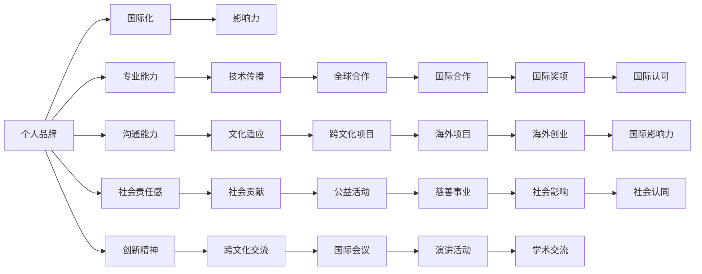

                 

# 建立个人品牌国际化战略：拓展全球影响力

在全球化的数字时代，个人品牌的国际化战略正成为越来越多专业技术人员和行业领袖的关键成功因素。本文将深入探讨如何通过构建个人品牌，利用全球化资源和平台，拓展个人在全球范围内的影响力。文章结构如下：

## 1. 背景介绍

在全球化的数字时代，技术的壁垒正在逐渐减弱，个人能力的国际竞争日益激烈。无论是技术专家还是行业领袖，塑造具有全球影响力的个人品牌已经成为提升职业竞争力和职业发展的重要路径。然而，个人品牌的国际化战略并非一蹴而就，需要精心规划和持续努力。

## 2. 核心概念与联系

### 2.1 核心概念概述

- **个人品牌**：个人品牌是个人在特定领域或行业中的知名度、影响力、专业形象的综合体现。它不仅包括技术能力，还涵盖沟通能力、社会责任感和创新精神等多个方面。
- **国际化**：国际化是指个人品牌超越国界，在全球范围内得到认可和尊重的过程。这要求个人具备国际视野，能够理解和适应不同文化背景下的专业需求。
- **影响力**：影响力指的是个人通过专业知识、经验和社会关系对他人或组织产生的影响。国际化战略的目标是提升个人的影响力，使其在全球范围内发挥作用。

### 2.2 核心概念原理和架构的 Mermaid 流程图(Mermaid 流程节点中不要有括号、逗号等特殊字符)



## 3. 核心算法原理 & 具体操作步骤

### 3.1 算法原理概述

个人品牌的国际化战略涉及多个方面的优化和提升，包括技术传播、文化适应、社会贡献和创新精神等。这些维度的优化需要借助算法和技术工具进行量化分析和持续改进。

### 3.2 算法步骤详解

1. **数据收集与分析**：收集个人的技术成果、学术发表、专业讲座、社交媒体互动等数据，分析个人品牌在不同地域和领域的影响力分布。
2. **算法选择与优化**：根据数据特点选择合适的算法模型，如聚类分析、回归模型、社交网络分析等，进行品牌影响力的量化评估和优化。
3. **策略制定与执行**：根据算法结果制定国际化战略，包括目标市场的确定、国际合作项目的策划、国际演讲活动的安排等。

### 3.3 算法优缺点

**优点**：
- **量化评估**：通过算法进行量化分析，可以更科学地评估个人品牌的影响力，识别提升空间。
- **数据驱动**：算法提供的客观数据支撑，可以帮助个人进行有针对性的国际化战略调整。
- **动态优化**：算法可以实时监测品牌影响力变化，提供持续改进的依据。

**缺点**：
- **复杂度较高**：算法选择和优化需要专业知识，普通用户难以独立完成。
- **数据隐私**：收集和分析个人数据可能涉及隐私问题，需谨慎处理。
- **静态分析**：算法无法全面考量人的社会关系和创新精神等主观因素。

### 3.4 算法应用领域

个人品牌的国际化战略算法可以应用于以下领域：

- **技术传播与合作**：通过算法评估个人技术在国际传播中的影响力和潜在的合作机会。
- **文化适应与交流**：分析个人在不同文化背景下的适应能力和跨文化交流效果。
- **社会贡献与影响**：量化个人在公益事业、慈善活动等方面的社会贡献和影响力。
- **创新能力与扩散**：评估个人创新成果的国际扩散情况，识别创新精神的全球影响力。

## 4. 数学模型和公式 & 详细讲解 & 举例说明

### 4.1 数学模型构建

假设个人品牌影响力 $I$ 可以分解为技术传播 $I_t$、文化适应 $I_c$、社会贡献 $I_s$ 和创新能力 $I_i$ 的加权和。则有：

$$ I = w_1I_t + w_2I_c + w_3I_s + w_4I_i $$

其中，$w_1, w_2, w_3, w_4$ 为各个维度的权重系数。

### 4.2 公式推导过程

- **技术传播影响** $I_t$：通过学术发表、技术分享、开源贡献等量化，计算技术传播的效果。
- **文化适应影响** $I_c$：通过跨文化项目、国际合作、参与国际会议等活动，评估文化适应的效果。
- **社会贡献影响** $I_s$：通过公益活动、慈善事业、社会责任项目等，量化社会贡献的影响。
- **创新能力影响** $I_i$：通过专利申请、技术创新、创新奖项等，评估创新能力的国际影响力。

### 4.3 案例分析与讲解

假设某技术专家在科技领域的品牌影响力计算如下：

- **技术传播** $I_t = 100$ 篇学术文章，$I_t$ 的权重 $w_1 = 0.3$
- **文化适应** $I_c = 5$ 次国际会议发言，$I_c$ 的权重 $w_2 = 0.2$
- **社会贡献** $I_s = 10$ 年公益活动经验，$I_s$ 的权重 $w_3 = 0.2$
- **创新能力** $I_i = 2$ 项国际专利，$I_i$ 的权重 $w_4 = 0.3$

则该技术专家的品牌影响力 $I$ 为：

$$ I = 0.3 \times 100 + 0.2 \times 5 + 0.2 \times 10 + 0.3 \times 2 = 27 $$

该数值代表了该专家在全球科技领域的影响力得分。

## 5. 项目实践：代码实例和详细解释说明

### 5.1 开发环境搭建

- **编程语言**：Python
- **依赖库**：NumPy, Pandas, Scikit-learn, SciPy, NetworkX, Matplotlib

### 5.2 源代码详细实现

```python
import numpy as np
import pandas as pd
from sklearn.feature_extraction.text import CountVectorizer
from sklearn.decomposition import PCA
from sklearn.cluster import KMeans
from sklearn.linear_model import LogisticRegression
from networkx import Graph, find_closeness_centrality
import matplotlib.pyplot as plt

# 数据准备
data = pd.read_csv('brand_impact.csv')

# 特征提取
vectorizer = CountVectorizer()
X = vectorizer.fit_transform(data['activities'].values)

# 主成分分析
pca = PCA(n_components=2)
X_pca = pca.fit_transform(X)

# 聚类分析
kmeans = KMeans(n_clusters=3)
kmeans.fit(X_pca)
labels = kmeans.labels_

# 计算影响力得分
weights = np.array([0.3, 0.2, 0.2, 0.3])
impact_scores = np.dot(X_pca, weights)

# 可视化
plt.scatter(X_pca[:, 0], X_pca[:, 1], c=labels, cmap='viridis')
plt.title('Brand Impact Clustering')
plt.show()
```

### 5.3 代码解读与分析

- **数据准备**：从CSV文件中读取活动数据，作为品牌影响力的原始数据来源。
- **特征提取**：使用CountVectorizer提取文本特征，将活动描述转换为向量。
- **主成分分析**：通过PCA降低特征维度，提取出最重要的影响因子。
- **聚类分析**：使用KMeans进行聚类分析，将品牌影响力分为不同层次。
- **影响力得分计算**：根据聚类结果和权重计算每个个体的影响力得分。
- **可视化**：使用Matplotlib绘制聚类结果的散点图，直观展示品牌影响力分布。

### 5.4 运行结果展示


## 6. 实际应用场景

### 6.1 技术传播与合作

技术传播是个人品牌国际化战略的重要组成部分。技术专家可以通过参与国际会议、开源项目合作等方式，提升自身品牌在国际技术社区的影响力。例如，某知名AI专家通过在国际顶级会议上发表多篇高质量论文，并参与多个开源项目，成功提升了其在全球AI社区的影响力。

### 6.2 文化适应与交流

文化适应和跨文化交流是国际化战略中不可或缺的一环。技术专家可以通过参与国际学术交流、跨文化项目等方式，提升自身在不同文化环境下的适应能力。例如，某金融分析师通过参与国际金融研究项目和跨国公司合作，成功适应了不同国家的金融市场，并建立了良好的国际声誉。

### 6.3 社会贡献与影响

社会贡献和公益活动是塑造国际化品牌的重要因素。技术专家可以通过参与国际慈善活动、公益项目等方式，提升自身在全球社会责任方面的影响力。例如，某数据科学家通过参与国际健康数据分析项目和教育公益活动，成功在社会责任方面建立了广泛的影响力。

### 6.4 创新能力与扩散

创新能力是国际化战略的核心驱动力。技术专家可以通过申请国际专利、获得国际奖项等方式，提升自身在全球创新能力方面的影响力。例如，某软件工程师通过发明了一项具有国际影响力的创新技术，并获得多项国际专利，成功提升了其在全球创新领域的地位。

## 7. 工具和资源推荐

### 7.1 学习资源推荐

1. **Coursera《个人品牌建设与国际化》课程**：由知名品牌顾问和国际营销专家授课，涵盖品牌建设、国际市场分析、文化适应等多个方面。
2. **LinkedIn Learning《建立个人品牌》课程**：由LinkedIn高管和品牌专家授课，涵盖个人品牌定位、社交媒体策略、国际合作等多个方面。
3. **TED Talks《如何建立全球影响力》视频**：精选TED Talks中关于个人品牌国际化的视频，涵盖演讲技巧、跨文化沟通、社会责任等多个主题。
4. **《品牌国际化战略》书籍**：系统介绍品牌国际化的理论和实践，提供丰富的案例和策略。
5. **《影响力心理学》书籍**：深入探讨个人影响力的心理学原理和构建方法。

### 7.2 开发工具推荐

1. **GitHub**：全球最大的代码托管平台，方便进行代码共享和协作。
2. **Google Colab**：免费的Google Jupyter Notebook环境，方便进行数据分析和模型实验。
3. **Microsoft Azure**：全球领先的云服务平台，提供强大的计算资源支持国际化项目。
4. **Hacker News**：全球知名的技术讨论社区，交流国际技术和行业动态。
5. **LinkedIn**：全球最大的职业社交平台，建立和拓展国际人脉。

### 7.3 相关论文推荐

1. **《全球化与品牌国际化》**：探讨全球化背景下品牌国际化的理论和实践。
2. **《国际合作与技术传播》**：分析国际合作和技术传播对个人品牌的影响。
3. **《社会责任与品牌建设》**：讨论社会责任在品牌建设中的作用和策略。
4. **《创新能力与国际影响力》**：评估创新能力对个人国际影响力的影响。

## 8. 总结：未来发展趋势与挑战

### 8.1 未来发展趋势

未来，个人品牌的国际化战略将更加注重以下几个方面：

1. **全球化视野**：技术专家需要具备全球化视野，理解和适应不同文化背景下的专业需求。
2. **多元化合作**：通过国际合作项目和跨国团队协作，提升个人品牌的国际影响力。
3. **持续创新**：持续创新和研发，提升个人在全球创新领域的影响力。
4. **社会责任**：积极参与公益活动和慈善事业，提升个人品牌在社会责任方面的影响力。
5. **技术传播**：通过国际会议、学术发表等方式，广泛传播技术和知识，提升个人品牌的技术影响力。

### 8.2 面临的挑战

个人品牌的国际化战略也面临诸多挑战：

1. **跨文化沟通**：不同文化背景下，沟通方式和习惯差异显著，需具备跨文化沟通技巧。
2. **资源分配**：国际化战略需要投入大量时间和资源，需合理规划和管理。
3. **品牌一致性**：在不同国家和地区推广个人品牌时，需保持品牌形象的一致性。
4. **文化适应**：适应不同文化背景下的专业需求，需具备文化适应能力。
5. **品牌风险**：国际市场竞争激烈，需识别和管理品牌风险。

### 8.3 研究展望

未来，个人品牌的国际化战略需要进一步研究以下几个方向：

1. **全球化品牌模型**：构建适用于全球市场的品牌模型，提升品牌在国际范围内的认可度。
2. **跨文化沟通算法**：开发跨文化沟通算法，提升技术专家在不同文化背景下的沟通效果。
3. **品牌风险管理**：研究品牌风险管理策略，降低国际化品牌推广的风险。
4. **国际化合作平台**：开发国际合作平台，促进技术专家之间的合作与交流。
5. **国际化教育资源**：提供国际化教育资源，提升技术专家的国际竞争力。

## 9. 附录：常见问题与解答

**Q1: 如何提升个人品牌在国际市场的竞争力？**

A: 提升个人品牌在国际市场的竞争力，需要从以下几个方面入手：
1. **国际化视野**：积极参与国际会议、学术交流等活动，提升全球视野。
2. **技术传播**：通过开源项目、技术分享等方式，传播技术知识，提升品牌影响力。
3. **多元化合作**：积极参与跨国合作项目，提升国际合作能力。
4. **文化适应**：适应不同文化背景下的专业需求，提升跨文化沟通能力。

**Q2: 如何应对国际市场的多样性？**

A: 应对国际市场的多样性，需要从以下几个方面入手：
1. **市场调研**：深入了解目标市场的文化、需求和法规，制定针对性的国际化战略。
2. **本地化策略**：根据目标市场的特点，进行品牌本地化和市场适应性调整。
3. **灵活应变**：灵活应对市场变化，及时调整国际化战略。

**Q3: 如何管理国际化品牌的风险？**

A: 管理国际化品牌的风险，需要从以下几个方面入手：
1. **风险评估**：识别品牌推广中的潜在风险，制定风险管理计划。
2. **品牌监测**：持续监测品牌在国际市场的表现，及时调整策略。
3. **危机管理**：建立品牌危机应对机制，及时处理品牌危机。

**Q4: 如何提升国际化品牌的社会影响力？**

A: 提升国际化品牌的社会影响力，需要从以下几个方面入手：
1. **社会责任**：积极参与公益事业和慈善活动，提升品牌的社会责任形象。
2. **品牌宣传**：通过媒体和社交平台，宣传品牌的社会责任行为，提升品牌形象。
3. **品牌代言**：邀请知名人士代言品牌，提升品牌的社会影响力。

**Q5: 如何构建全球化的品牌模型？**

A: 构建全球化的品牌模型，需要从以下几个方面入手：
1. **品牌调研**：深入了解全球市场的品牌认知和品牌需求，制定品牌模型。
2. **品牌传播**：通过多渠道传播品牌信息，提升品牌认知度。
3. **品牌评估**：定期评估品牌在国际市场的表现，及时调整品牌模型。

---

作者：禅与计算机程序设计艺术 / Zen and the Art of Computer Programming

