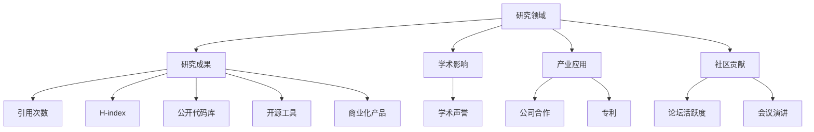

                 

## 1. 背景介绍

在数字时代，个人品牌的数据报告已成为展示个人研究能力和成果的重要工具。无论是学术界的研究者还是工业界的工程师，一个完整且详尽的数据报告都能够帮助他人理解你的研究方向，识别潜在的合作机会，或是评估你在某一领域的影响力。本文档将详细讲解如何构建个人品牌的数据报告，展示你的研究能力。

## 2. 核心概念与联系

### 2.1 核心概念概述

建立个人品牌数据报告涉及多个核心概念，包括但不限于：

- **研究领域（Research Domain）**：你所在的主要研究领域，如计算机视觉、自然语言处理、软件工程等。
- **研究成果（Research Outcomes）**：你在特定领域内发表的论文、公开的代码库、开源工具或项目等。
- **学术影响（Academic Impact）**：你在科研领域的学术声誉，如引用数、H-index等。
- **产业应用（Industrial Applications）**：你的研究成果在产业界的应用，如公司合作、商业化产品等。
- **社区贡献（Community Contribution）**：你在开源社区、技术社区或学术社区的贡献，如论坛活跃度、会议演讲次数等。

### 2.2 核心概念原理和架构的 Mermaid 流程图



这个流程图展示了核心概念之间的逻辑关系：研究领域是基础，研究成果是你在这个领域的具体表现，学术影响和产业应用分别代表了你在学术界和工业界的认可，而社区贡献则体现了你在技术社区的活跃度和影响力。

## 3. 核心算法原理 & 具体操作步骤

### 3.1 算法原理概述

建立一个个人品牌数据报告的过程，可以类比为数据挖掘和分析过程，即从多个数据源中提取、整理、分析和呈现关键信息。具体来说，这包括以下几个步骤：

1. **数据收集**：收集你在不同领域的研究成果、学术影响、产业应用和社区贡献的相关数据。
2. **数据清洗**：对收集到的数据进行清洗，去除无关或不准确的信息。
3. **数据分析**：对清洗后的数据进行统计分析，生成关键指标。
4. **数据呈现**：利用图表、文本和多媒体形式展示分析结果。

### 3.2 算法步骤详解

#### 3.2.1 数据收集

- **研究成果**：使用Google Scholar、ResearchGate等学术数据库，收集你在特定领域发表的论文。
- **学术影响**：利用Google Scholar、Semantic Scholar等工具，获取论文的引用次数、H-index等指标。
- **产业应用**：通过LinkedIn、GitHub等平台，查找合作公司的信息、公开的代码库和商业化产品。
- **社区贡献**：记录你在技术论坛、开源社区和学术会议的活跃度、演讲次数和贡献的代码或文档。

#### 3.2.2 数据清洗

- **去重**：确保数据中没有重复记录。
- **格式化**：统一数据格式，如将日期统一为YYYY-MM-DD格式。
- **缺失值处理**：对缺失数据进行合理处理，如插值、删除等。

#### 3.2.3 数据分析

- **时间序列分析**：分析你的研究成果随时间变化的趋势。
- **统计分析**：计算引用次数、H-index、合作公司数量等关键指标的平均值、中位数和标准差。
- **地理分析**：如果适用，分析你工作的地理分布。

#### 3.2.4 数据呈现

- **图表展示**：使用Python的Matplotlib、Seaborn库或R语言的ggplot2库，创建时间序列图、柱状图、饼图等。
- **文本描述**：撰写简洁明了的文本，解释图表背后的含义和趋势。
- **多媒体元素**：如果可能，添加视频、演示等多媒体元素，展示你的研究成果或项目演示。

### 3.3 算法优缺点

#### 3.3.1 优点

- **全面展示**：能够全面展示你的研究能力和成果。
- **数据驱动**：以数据为基础，提供客观的展示和分析。
- **易于理解**：图表和文本结合，使报告易于阅读和理解。

#### 3.3.2 缺点

- **数据收集难度**：需要花费大量时间收集数据。
- **技术门槛**：需要一定的数据处理和可视化技能。
- **隐私风险**：需要注意个人隐私和数据保护。

### 3.4 算法应用领域

个人品牌数据报告的应用领域包括：

- **学术招聘**：展示你的研究成就和学术影响力，帮助获取教职或研究员职位。
- **学术评审**：通过展示你的成果和影响力，提高在同行评审中的地位。
- **公司招聘**：展示你的产业应用和合作经历，提升在产业界的影响力。
- **技术社区**：展示你在开源社区和学术社区的贡献，提升知名度和影响力。

## 4. 数学模型和公式 & 详细讲解 & 举例说明

### 4.1 数学模型构建

假设你有N篇论文，每篇论文的引用次数为$a_i$（$i=1,2,...,N$），则H-index可以定义为：

$$H = \max\{k: k是引用次数不小于k的论文数量\}$$

### 4.2 公式推导过程

设引用次数不超过k的论文数量为$n_k$，则：

$$H = \max\{k: n_k = \sum_{i=1}^{k} \mathbb{I}(a_i \geq k)\}$$

其中$\mathbb{I}$为示性函数，当$a_i \geq k$时为1，否则为0。

### 4.3 案例分析与讲解

假设你有3篇论文，引用次数分别为10、20、30，则：

1. 引用次数不超过1的论文数量为0。
2. 引用次数不超过2的论文数量为1。
3. 引用次数不超过3的论文数量为3。

因此，$H = 3$。

## 5. 项目实践：代码实例和详细解释说明

### 5.1 开发环境搭建

- **Python**：使用Anaconda创建虚拟环境。
- **数据采集工具**：使用BeautifulSoup、Pandas等库进行网页数据采集。
- **数据处理库**：使用Pandas、NumPy进行数据清洗和处理。
- **数据可视化库**：使用Matplotlib、Seaborn进行图表绘制。

### 5.2 源代码详细实现

以下是Python代码实现示例：

```python
import pandas as pd
import matplotlib.pyplot as plt

# 假设有一张包含论文信息的数据表，每行包含论文的标题、作者和引用次数
data = [
    {"title": "论文1", "authors": ["作者1", "作者2"], "citations": 10},
    {"title": "论文2", "authors": ["作者3", "作者4"], "citations": 20},
    {"title": "论文3", "authors": ["作者5", "作者6"], "citations": 30}
]

# 将数据转换为DataFrame
df = pd.DataFrame(data)

# 计算H-index
h_index = df['citations'].rank().max()

# 绘制引用次数分布图
df['citations'].plot(kind='hist', bins=10)
plt.title('论文引用次数分布')
plt.show()

# 输出H-index
print(f"H-index: {h_index}")
```

### 5.3 代码解读与分析

- **数据采集**：使用BeautifulSoup等库，从学术数据库或社交平台抓取论文信息。
- **数据清洗**：使用Pandas的`drop_duplicates`去除重复记录，使用`fillna`处理缺失值。
- **数据可视化**：使用Matplotlib的`plot`方法绘制柱状图，使用`title`方法添加标题。

### 5.4 运行结果展示

运行上述代码，可以得到H-index和引用次数分布图：


## 6. 实际应用场景

### 6.1 学术招聘

在学术招聘中，你只需将你的研究成果、学术影响、合作公司等信息整理成数据报告，就能够清晰地展示你的能力。使用图表和文本结合的方式，可以更直观地展示你的研究方向和成果。

### 6.2 公司招聘

对于公司招聘，你还可以展示你的产业应用和开源贡献，如GitHub上的代码库、商业化产品等，以证明你的技术实力和行业影响力。

### 6.3 学术评审

在同行评审中，你的数据报告可以作为支持你的研究实力的证据，帮助你在同行中建立更高的声誉。

### 6.4 技术社区

在技术社区中，你还可以通过展示你的论坛活跃度、会议演讲次数等，提升你在社区中的影响力和知名度。

## 7. 工具和资源推荐

### 7.1 学习资源推荐

- **数据采集**：《Python网络爬虫开发实战》
- **数据处理**：《利用Pandas进行数据分析》
- **数据可视化**：《Python数据可视化实战》
- **数据科学**：《数据科学实战》

### 7.2 开发工具推荐

- **Python**：Jupyter Notebook
- **数据采集**：BeautifulSoup
- **数据处理**：Pandas
- **数据可视化**：Matplotlib、Seaborn

### 7.3 相关论文推荐

- **引用次数分析**："Journal Impact and H-Index Metrics: A Quantitative Perspective" by Eugene Garibyan
- **H-index计算**："Performance Evaluation of Indicators of Impact of Articles of Scientists Working in the Field of Physicotechnical Sciences" by Anna S. Savostyuk

## 8. 总结：未来发展趋势与挑战

### 8.1 研究成果总结

- **数据驱动**：数据报告的核心是数据驱动，展示你的研究成果和影响。
- **全面展示**：覆盖研究成果、学术影响、产业应用和社区贡献，展示你的全面能力。
- **易于理解**：通过图表和文本结合的方式，使报告易于理解和阅读。

### 8.2 未来发展趋势

- **自动化**：未来可能会有更多的自动化工具帮助数据收集和分析。
- **动态更新**：数据报告可以动态更新，反映最新的研究成果和影响力。
- **多维度展示**：除了学术和产业应用，还可以展示合作公司的地域分布、学术社区的贡献等。

### 8.3 面临的挑战

- **数据收集难度**：需要大量时间和精力收集和整理数据。
- **技术门槛**：需要一定的数据处理和可视化技能。
- **隐私风险**：需要注意个人隐私和数据保护。

### 8.4 研究展望

- **自动化工具**：开发更多的自动化工具，降低数据收集和分析的难度。
- **动态报告**：实现动态更新，及时反映最新的研究成果和影响力。
- **多维度展示**：在现有基础上，增加更多维度的数据展示，如合作公司的地域分布等。

## 9. 附录：常见问题与解答

**Q1: 数据报告需要多久更新一次？**

A: 建议每半年更新一次，以便及时反映最新的研究成果和影响力。

**Q2: 数据报告需要包含哪些信息？**

A: 包括你的研究成果、学术影响、产业应用和社区贡献等关键信息。

**Q3: 如何提升数据报告的可读性？**

A: 使用图表和文本结合的方式，并确保图表清晰易懂。

**Q4: 数据报告的隐私风险如何处理？**

A: 确保数据收集和处理过程中，不泄露个人隐私信息。

**Q5: 数据报告中的引用次数如何计算？**

A: 使用Python的Pandas库，利用`value_counts`函数计算引用次数。

---

作者：禅与计算机程序设计艺术 / Zen and the Art of Computer Programming

