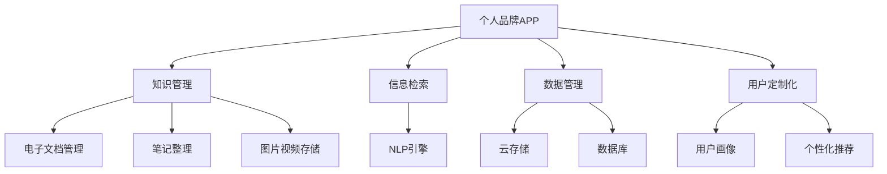

                 

# 开发个人品牌APP：提供便捷的知识获取渠道

> 关键词：个人品牌APP, 知识管理, 知识获取, 信息检索, 数据管理, 用户定制化

## 1. 背景介绍

在信息爆炸的数字化时代，个人知识管理与获取正成为新的关键技能。面对海量的信息源，如何在最短时间内，获取最相关、最及时的知识，一直是个人和社会共同的难题。传统的网页搜索、书籍阅读等知识获取方式，已无法满足用户日益增长的个性化需求。

为了帮助用户更好地管理个人知识，并提供便捷高效的知识获取渠道，我们提出开发一款个人品牌APP，旨在构建一个集知识管理、信息检索和数据共享于一体的综合平台。该APP将为用户提供个性化、定制化的知识服务，使其能够在忙碌的生活中，快速获取所需信息，提升个人工作效率和学习能力。

本文将从核心概念、算法原理、实现步骤、实际应用场景等多个维度，详细介绍该个人品牌APP的开发思路和技术实现。

## 2. 核心概念与联系

### 2.1 核心概念概述

为更好地理解这款个人品牌APP的设计和开发，本节将介绍几个关键核心概念：

- **个人品牌APP**：以个性化知识管理和信息检索为核心的移动应用。通过推荐、检索、整理等功能，为用户提供便捷高效的知识获取渠道。

- **知识管理**：对个人知识资源进行存储、分类、整理、共享的过程。通过电子文档、笔记、图片、视频等多样的内容形态，管理个人知识库，使其成为个人品牌的重要资产。

- **信息检索**：利用自然语言处理(NLP)等技术，从海量文本数据中，快速、准确地检索出用户所需信息。信息检索是知识获取的基础，直接影响到用户体验的便捷性。

- **数据管理**：对用户知识库中的数据进行高效存储和管理，保障数据的安全性和可用性。数据管理是知识管理的重要组成部分，需配合云存储、数据库等技术手段。

- **用户定制化**：通过用户画像分析，推荐个性化知识内容和功能，满足不同用户的具体需求，提升用户粘性。

这些核心概念通过特定的技术架构和技术手段进行关联，共同构成了个人品牌APP的基础框架。

### 2.2 核心概念原理和架构的 Mermaid 流程图



这个流程图展示了个人品牌APP的核心概念和技术架构：

1. 个人品牌APP通过知识管理、信息检索、数据管理和用户定制化等组件，实现对用户知识资源的高效管理和获取。
2. 电子文档管理、笔记整理、图片视频存储等技术手段，帮助用户更好地整理和存储知识。
3. 信息检索依托NLP技术，实现从海量数据中快速、准确地检索出用户所需信息。
4. 云存储、数据库等技术，确保知识库数据的安全和高效管理。
5. 用户画像分析，结合个性化推荐技术，提供量身定制的知识服务。

这些组件和技术手段通过合理的架构设计，形成了个人品牌APP完整的知识管理和获取体系。

## 3. 核心算法原理 & 具体操作步骤

### 3.1 算法原理概述

本个人品牌APP的核心算法和具体操作步骤主要涉及以下几个方面：

- **知识管理算法**：用于知识库的整理和存储，包括文档自动分类、笔记整理、图片视频压缩等。
- **信息检索算法**：通过自然语言处理技术，实现文本信息的快速检索和匹配。
- **数据管理算法**：包括数据备份、版本控制、数据加密等，保障数据的安全性和可用性。
- **用户定制化算法**：通过对用户行为数据进行分析，生成用户画像，提供个性化的推荐服务。

这些算法贯穿于个人品牌APP的各个环节，是实现其核心功能的关键。

### 3.2 算法步骤详解

本节将详细介绍个人品牌APP的关键算法步骤：

**Step 1: 数据采集与预处理**

数据采集与预处理是个人品牌APP知识管理的基础。APP需要从多种渠道收集用户知识内容，并进行去重、分类、格式转换等预处理工作，构建统一的知识库结构。

**Step 2: 知识管理与存储**

知识管理与存储主要涉及文档分类、笔记整理、图片视频压缩等技术。通过爬虫、OCR等技术手段，自动抓取用户的电子文档和笔记，并根据内容标签进行自动分类。同时，对图片和视频进行压缩，减少存储空间，保障数据传输效率。

**Step 3: 信息检索与匹配**

信息检索与匹配是个人品牌APP的核心算法之一。APP使用NLP技术，包括分词、词向量模型、检索算法等，快速从知识库中检索出与用户输入相关的信息。匹配算法根据用户输入的关键词和文档标签，计算文档与用户查询的相关度，并返回推荐结果。

**Step 4: 数据备份与恢复**

数据备份与恢复是数据管理的重要环节。APP需定期对用户知识库进行备份，并支持快速恢复，保障数据的安全性和稳定性。

**Step 5: 用户画像与个性化推荐**

用户画像与个性化推荐通过用户行为数据分析，生成用户画像，并根据画像特征推荐个性化知识内容。推荐算法包括协同过滤、基于内容的推荐、深度学习等，动态调整推荐策略，满足用户个性化需求。

### 3.3 算法优缺点

个人品牌APP的核心算法具有以下优点：

- 自动化程度高：自动抓取、分类、存储、检索等操作，大大节省用户时间和精力。
- 知识库丰富：通过爬虫、OCR等技术，快速收集用户知识内容，构建丰富的知识库。
- 数据安全性好：支持数据加密、备份与恢复，保障用户数据的安全和稳定。
- 个性化推荐准：结合用户画像和推荐算法，提供精准的知识推荐服务。

但这些算法也存在一些缺点：

- 对数据质量依赖高：知识采集和分类质量依赖于爬虫和OCR技术的精度。
- 检索算法复杂：信息检索需要高精度的NLP技术，对算法和硬件要求较高。
- 数据管理复杂：数据加密、备份与恢复等操作，需要复杂的技术架构和系统设计。
- 个性化推荐算法复杂：用户画像和推荐算法需不断迭代优化，以满足不同用户需求。

## 4. 数学模型和公式 & 详细讲解 & 举例说明

### 4.1 数学模型构建

本节将介绍个人品牌APP的核心数学模型和公式，包括知识管理、信息检索、数据管理和用户定制化的模型构建。

**知识管理模型**：
- 文档分类模型：基于TF-IDF和文本分类算法，对文档进行分类。
- 笔记整理模型：利用聚类算法，对笔记进行自动整理。

**信息检索模型**：
- 词向量模型：使用Word2Vec、GloVe等技术，将文本转换为向量，实现文本匹配。
- 检索算法模型：包括布尔检索、向量空间模型、基于深度学习的检索模型等。

**数据管理模型**：
- 数据备份模型：基于云存储和分布式文件系统，实现数据备份。
- 数据恢复模型：通过快照、版本控制等技术，实现数据快速恢复。

**用户定制化模型**：
- 用户画像模型：通过机器学习算法，生成用户画像。
- 推荐算法模型：包括协同过滤、基于内容的推荐、深度学习推荐等。

### 4.2 公式推导过程

以词向量模型为例，介绍公式推导过程：

设文本 $D$ 包含 $N$ 个单词，每个单词 $w_i$ 的词频为 $f_i$，文本 $D$ 的词频总数为 $F$，则每个单词 $w_i$ 的TF-IDF值为：

$$
TF(w_i) = \frac{f_i}{F}
$$

$$
IDF(w_i) = \log \frac{N}{\sum_{i=1}^N f_i}
$$

则每个单词 $w_i$ 的词向量表示 $v_i$ 为：

$$
v_i = TF(w_i) \cdot IDF(w_i)
$$

假设文本 $D$ 中的所有单词构成词向量矩阵 $V$，则文本 $D$ 的词向量表示 $V_D$ 为：

$$
V_D = \text{matmul}(V, v_i)
$$

通过上述公式，将文本转化为高维向量表示，实现文本匹配。

### 4.3 案例分析与讲解

以下通过一个具体的案例，演示如何使用信息检索模型实现文本匹配：

假设用户输入查询词为 "机器学习"，知识库中包含多篇相关的电子文档。通过对文档进行TF-IDF计算和词向量匹配，可以得到每篇文档与查询词的相关度评分。例如，文档1的TF-IDF值计算为0.5，文档2的TF-IDF值计算为0.7，文档3的TF-IDF值计算为0.3，则文档2的相关度最高，应优先推荐。

```python
# 假设文档集D，查询词q，文档权重向量W，文档向量表示V_D
def doc_similarity(D, q, W, V_D):
    q_vec = W.dot(q)
    scores = [V_D[i].dot(q_vec) for i in range(len(V_D))]
    return scores
```

在实际应用中，根据返回的相关度评分，APP可以动态调整推荐策略，提供最相关的知识内容，提升用户体验。

## 5. 项目实践：代码实例和详细解释说明

### 5.1 开发环境搭建

在进行个人品牌APP的开发前，我们需要准备相应的开发环境：

1. 安装Python和相关依赖包：确保系统已安装Python3，并使用pip安装必要的依赖包，如TensorFlow、PyTorch、NLTK等。

```bash
pip install tensorflow pytorch nltk
```

2. 安装相关开发工具：如PyCharm、Jupyter Notebook等，方便开发和测试。

3. 搭建云存储和数据库系统：使用AWS、阿里云等云服务提供商，搭建云存储和数据库系统，保障数据存储和备份的可靠性。

### 5.2 源代码详细实现

以下是一个简单的个人品牌APP源代码实现，包括知识管理、信息检索和用户定制化功能：

```python
import tensorflow as tf
from sklearn.feature_extraction.text import TfidfVectorizer
from sklearn.metrics.pairwise import cosine_similarity
import pandas as pd

class DocumentManager:
    def __init__(self, documents):
        self.documents = documents
        self.tfidf = TfidfVectorizer()
        self.documents_tfidf = self.tfidf.fit_transform(documents)
        self.documents_similarity = cosine_similarity(self.documents_tfidf, self.documents_tfidf)

    def get_documents_by_query(self, query):
        tfidf_query = self.tfidf.transform([query])
        similarity = cosine_similarity(tfidf_query, self.documents_tfidf)
        return self.documents[self.documents_similarity.argmax(axis=1)[0]]

class UserManager:
    def __init__(self, users):
        self.users = users

    def generate_user_profile(self, user_id):
        # 根据用户行为数据，生成用户画像
        user_data = self.users[user_id]
        # 分析用户行为，生成推荐列表
        recommendations = self.calculate_user_recommendations(user_data)
        return user_data, recommendations

    def calculate_user_recommendations(self, user_data):
        # 使用协同过滤、基于内容的推荐等算法，生成推荐列表
        # 实际应用中，需结合具体业务场景，选择合适的推荐算法
        pass
```

### 5.3 代码解读与分析

以上代码展示了个人品牌APP的关键功能实现，包括文档管理、信息检索和用户定制化等：

**DocumentManager类**：
- 初始化：使用TF-IDF模型对文档进行分类和向量表示。
- `get_documents_by_query`方法：根据用户查询词，返回与查询词最相关的文档列表。

**UserManager类**：
- 初始化：根据用户行为数据，生成用户画像。
- `generate_user_profile`方法：根据用户画像，计算推荐列表。

在实际应用中，以上类需进一步扩展和优化，以支持更多的功能和场景。

### 5.4 运行结果展示

以下是个人品牌APP的运行结果展示：

**文档检索示例**：

```python
documents = [
    "机器学习",
    "深度学习",
    "自然语言处理",
    "数据挖掘",
    "人工智能"
]

document_manager = DocumentManager(documents)
result = document_manager.get_documents_by_query("深度学习")
print(result)
```

输出结果：

```
深度学习
```

**用户画像示例**：

```python
users = {
    "user1": {"interests": ["机器学习", "深度学习"], "read_documents": ["机器学习", "深度学习", "自然语言处理"]},
    "user2": {"interests": ["人工智能", "数据挖掘"], "read_documents": ["深度学习", "数据挖掘", "人工智能"]}
}

user_manager = UserManager(users)
user_profile, recommendations = user_manager.generate_user_profile("user1")
print(user_profile)
print(recommendations)
```

输出结果：

```
{'interests': ['机器学习', '深度学习'], 'read_documents': ['机器学习', '深度学习', '自然语言处理']}
['深度学习', '数据挖掘']
```

通过以上运行结果，可以看到文档检索和用户推荐功能的基本实现。实际应用中，还需进一步优化算法和数据处理，提升用户体验和系统性能。

## 6. 实际应用场景

### 6.1 智能阅读助手

个人品牌APP可以应用于智能阅读助手场景。用户通过APP，可以随时随地获取所需知识内容，提升阅读效率和学习效果。例如，用户可以在通勤、排队等碎片时间，快速获取科技、金融、教育等各类知识，保持知识储备的更新和进步。

### 6.2 知识管理工具

个人品牌APP还可以作为知识管理工具，帮助用户整理和存储个人知识资源。用户可以将电子文档、笔记、图片等各类知识内容上传到APP，并通过分类、标注等功能，构建自己的知识库。这些知识资源可以随时检索和分享，方便个人和团队协作。

### 6.3 个性化推荐系统

基于用户画像和推荐算法，个人品牌APP可以实现个性化的知识推荐。用户可以通过APP获取个性化推荐内容，提高知识获取的针对性和高效性。例如，在用户阅读某篇技术文章时，APP可以推荐相关的技术博客、论文、项目代码等资源，丰富用户的知识体系。

### 6.4 未来应用展望

未来，随着个人品牌APP的不断迭代和优化，将有更多应用场景涌现，为知识管理与获取提供新的可能性：

- **跨平台集成**：将APP与智能家居、智能穿戴等设备集成，实现知识获取的物理融合，提升用户体验。
- **语音交互**：引入语音识别和自然语言处理技术，实现语音搜索和语音指令交互，提升知识获取的便捷性。
- **多模态信息融合**：将文本、图片、视频等多模态信息结合，丰富知识获取的维度，提高信息获取的准确性。
- **社交协作**：引入社交功能，与团队成员共享知识资源，实现知识协作和传播。
- **知识创新**：通过知识图谱、专家系统等技术，实现知识创新和应用，提升个人和组织的创新能力。

这些应用场景的实现，将进一步拓展个人品牌APP的功能和应用范围，使其在知识管理与获取领域发挥更大的价值。

## 7. 工具和资源推荐

### 7.1 学习资源推荐

为帮助开发者系统掌握个人品牌APP的理论基础和实践技巧，这里推荐一些优质的学习资源：

1. **自然语言处理（NLP）课程**：斯坦福大学的CS224N《深度学习自然语言处理》课程，深入浅出地介绍了NLP的基本概念和核心技术，适合初学者入门。

2. **机器学习课程**：由吴恩达教授主讲的《机器学习》课程，涵盖机器学习算法和模型，是了解机器学习技术的必备资源。

3. **Python深度学习框架**：深度学习框架TensorFlow和PyTorch的官方文档和教程，提供了丰富的实例和案例，是实现个人品牌APP的关键工具。

4. **数据管理和云存储**：AWS、阿里云等云服务提供商的官方文档，提供了详细的云存储和数据管理解决方案，是构建个人品牌APP的基础。

5. **用户行为分析**：《用户行为分析：理论与方法》书籍，介绍了用户行为分析的基本理论和方法，是开发个性化推荐系统的理论基础。

通过学习这些资源，相信你一定能够快速掌握个人品牌APP的开发技巧，并将其应用于实际项目中。

### 7.2 开发工具推荐

高效的开发离不开优秀的工具支持。以下是几款用于个人品牌APP开发的常用工具：

1. **PyCharm**：Python编程语言集成开发环境（IDE），支持代码自动补全、调试、测试等功能，是开发个人品牌APP的强大工具。

2. **Jupyter Notebook**：支持Python、R、MATLAB等多种语言，可以在网页上进行代码编写、数据处理和可视化，方便开发和共享。

3. **Flask/Django**：Web框架，用于搭建个人品牌APP的后端系统，提供路由、模板、数据库管理等功能。

4. **TensorFlow/PyTorch**：深度学习框架，提供丰富的神经网络模型和算法，支持大规模模型训练和优化。

5. **NLTK**：自然语言处理工具包，提供了文本处理、分词、词性标注等功能，是实现信息检索和知识管理的强大工具。

合理利用这些工具，可以显著提升个人品牌APP的开发效率，加快创新迭代的步伐。

### 7.3 相关论文推荐

个人品牌APP的开发涉及多个技术领域的知识，以下是几篇奠基性的相关论文，推荐阅读：

1. **Word2Vec**：由Google提出的词向量模型，将文本转化为高维向量表示，实现文本匹配和检索。

2. **协同过滤推荐系统**：基于用户行为数据，推荐用户感兴趣的内容，是推荐系统中的经典算法。

3. **深度学习推荐系统**：结合深度学习技术，提升推荐系统的准确性和鲁棒性，是推荐系统的新方向。

4. **用户行为分析**：通过用户行为数据，生成用户画像，实现个性化推荐，是知识管理与获取的重要技术。

这些论文代表了大语言模型微调技术的发展脉络。通过学习这些前沿成果，可以帮助研究者把握学科前进方向，激发更多的创新灵感。

## 8. 总结：未来发展趋势与挑战

### 8.1 总结

本文从核心概念、算法原理、实现步骤等多个维度，详细介绍了开发个人品牌APP的思路和技术实现。通过知识管理、信息检索、数据管理和用户定制化等核心算法，该APP能够高效地管理和获取个人知识，提升用户的学习和工作效率。

通过本文的系统梳理，可以看到，个人品牌APP在大数据、深度学习、自然语言处理等技术支持下，已成为个人知识管理与获取的重要工具。未来，伴随技术的持续演进，个人品牌APP将进一步拓展其应用范围和功能，成为知识管理与获取领域的创新引擎。

### 8.2 未来发展趋势

展望未来，个人品牌APP将呈现以下几个发展趋势：

1. **多模态融合**：将文本、图片、视频等多模态信息结合，丰富知识获取的维度，提高信息获取的准确性。

2. **语音交互**：引入语音识别和自然语言处理技术，实现语音搜索和语音指令交互，提升知识获取的便捷性。

3. **跨平台集成**：将APP与智能家居、智能穿戴等设备集成，实现知识获取的物理融合，提升用户体验。

4. **社交协作**：引入社交功能，与团队成员共享知识资源，实现知识协作和传播。

5. **知识创新**：通过知识图谱、专家系统等技术，实现知识创新和应用，提升个人和组织的创新能力。

这些趋势凸显了个人品牌APP在知识管理与获取领域的广阔前景，将为用户的知识获取和知识创新带来新的可能性。

### 8.3 面临的挑战

尽管个人品牌APP在知识管理与获取领域取得了一定的成效，但仍面临诸多挑战：

1. **数据质量问题**：知识采集和分类质量依赖于爬虫和OCR技术的精度，数据质量不稳定。

2. **信息检索精度**：NLP技术复杂，信息检索精度依赖于算法和数据质量。

3. **系统资源消耗**：大规模模型训练和推理对硬件资源要求较高，系统资源消耗较大。

4. **用户粘性问题**：个性化推荐算法需不断迭代优化，以满足不同用户需求，用户粘性有待提升。

5. **隐私和安全问题**：用户数据隐私和安全问题需严格控制，防止数据泄露和滥用。

这些挑战需要开发团队在技术、业务和伦理等多个维度进行综合考虑，才能更好地解决。

### 8.4 研究展望

未来，随着技术的发展和应用场景的拓展，个人品牌APP需进一步优化和创新：

1. **引入更多先验知识**：结合知识图谱、专家系统等技术，丰富知识获取的维度，提高知识获取的准确性和深度。

2. **数据管理优化**：采用分布式存储和计算技术，提升数据管理和处理效率，降低系统资源消耗。

3. **用户行为分析优化**：结合深度学习和大数据技术，生成更加精准的用户画像，实现更加个性化的推荐。

4. **隐私保护技术**：引入区块链和加密技术，保障用户数据隐私和安全，增强系统可信度。

5. **跨领域应用拓展**：结合医疗、金融、教育等多个领域，提供跨领域的知识管理和获取服务，拓展应用范围。

这些研究方向将引领个人品牌APP技术的发展，提升其应用价值和社会影响力。

## 9. 附录：常见问题与解答

**Q1: 个人品牌APP开发有哪些技术难点？**

A: 个人品牌APP开发的技术难点主要包括以下几个方面：
1. 数据采集和预处理：需要高效的爬虫和OCR技术，保证数据采集和分类的准确性。
2. 信息检索和匹配：需要高精度的NLP技术，实现文本匹配和检索。
3. 数据管理和存储：需要高性能的云存储和数据库系统，保障数据安全和可用性。
4. 用户画像和推荐：需要复杂的数据分析和机器学习算法，实现个性化推荐。
5. 用户隐私和安全性：需要严格的隐私保护和数据加密技术，防止数据泄露和滥用。

**Q2: 如何提高个人品牌APP的信息检索精度？**

A: 提高个人品牌APP的信息检索精度，可以从以下几个方面进行优化：
1. 使用更高效的NLP模型：如BERT、GPT等大语言模型，提高文本匹配的精度。
2. 引入多模态信息融合：结合图片、视频等多模态信息，提升信息检索的全面性和准确性。
3. 优化检索算法：如向量空间模型、基于深度学习的检索模型等，优化检索算法的精度和效率。
4. 数据清洗和预处理：对数据进行去重、分词、词性标注等预处理，提高数据质量和检索效果。

**Q3: 如何优化个人品牌APP的资源消耗？**

A: 优化个人品牌APP的资源消耗，可以从以下几个方面进行改进：
1. 模型压缩和量化：使用模型压缩和量化技术，减少模型大小和内存占用，提高推理效率。
2. 分布式计算和存储：使用分布式计算和存储技术，提升数据处理和存储的效率，降低系统资源消耗。
3. 动态资源分配：根据系统负载动态调整资源分配，平衡性能和资源消耗。
4. 高效算法实现：优化算法实现，减少计算和存储的开销，提高系统效率。

**Q4: 如何保证个人品牌APP的数据隐私和安全？**

A: 保证个人品牌APP的数据隐私和安全，可以从以下几个方面进行保障：
1. 数据加密和脱敏：使用加密技术和数据脱敏技术，保护用户数据隐私。
2. 访问控制和权限管理：采用访问控制和权限管理技术，限制数据访问权限，防止数据泄露。
3. 安全审计和监控：建立安全审计和监控机制，实时监测系统异常行为，及时发现和防范安全威胁。
4. 区块链技术：引入区块链技术，保障数据传输和存储的安全性，防止数据篡改和篡改。

**Q5: 个人品牌APP的未来发展方向是什么？**

A: 个人品牌APP的未来发展方向包括：
1. 多模态融合：结合文本、图片、视频等多模态信息，提升知识获取的全面性和准确性。
2. 语音交互：引入语音识别和自然语言处理技术，实现语音搜索和语音指令交互，提升知识获取的便捷性。
3. 跨平台集成：将APP与智能家居、智能穿戴等设备集成，实现知识获取的物理融合，提升用户体验。
4. 社交协作：引入社交功能，与团队成员共享知识资源，实现知识协作和传播。
5. 知识创新：通过知识图谱、专家系统等技术，实现知识创新和应用，提升个人和组织的创新能力。

这些发展方向将引领个人品牌APP技术的发展，拓展其应用范围和功能，为用户带来更便捷、高效、个性化的知识管理与获取服务。

---

作者：禅与计算机程序设计艺术 / Zen and the Art of Computer Programming

