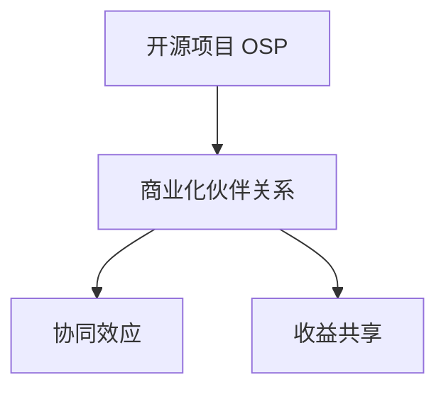

                 

# 开源项目的商业化伙伴关系：协同效应与收益共享

## 1. 背景介绍

在当今数字化时代，开源项目已成为推动技术创新和业务发展的强大动力。然而，如何有效地将开源项目的资源商业化，最大化其经济价值，仍然是一个充满挑战的问题。近年来，越来越多的企业开始探索通过建立开源项目的商业化伙伴关系，实现资源共享和收益共赢，推动开源和商业化的深度融合。本文将深入探讨开源项目的商业化伙伴关系，分析其中的协同效应与收益共享机制，为开源项目的管理者、开发者和商业伙伴提供策略和启示。

## 2. 核心概念与联系

### 2.1 核心概念概述

- **开源项目（Open Source Project, OSP）**：指软件代码及其相关资源在一定条件下免费向公众开放，允许任何人使用、修改和分发的软件开发项目。
- **商业化伙伴关系（Commercialization Partnership）**：指开源项目和商业伙伴之间基于共同的利益，建立的一种合作关系，旨在将开源项目的资源转化为商业价值。
- **协同效应（Synergy Effect）**：指通过合作和协作，各方资源得到更高效利用，实现1+1>2的效果。
- **收益共享（Revenue Sharing）**：指开源项目和商业伙伴之间基于合作成果，通过一定比例分配收益，实现共赢。

这些核心概念之间的逻辑关系可以通过以下Mermaid流程图来展示：



这个流程图展示了一些关键概念以及它们之间的联系：

1. 开源项目通过提供免费资源，吸引大量开发者和商业伙伴。
2. 商业化伙伴关系将开源资源和商业资本结合，形成新的业务模式。
3. 协同效应和收益共享机制促进了各方资源的整合和价值最大化。

### 2.2 核心概念原理和架构

#### 开源项目

开源项目的核心在于其**自由共享原则**：任何人都可以自由获取、修改和分发项目代码及其相关资源，只需遵守许可协议（如Apache、MIT等）。这种开放性使得开源项目能够快速迭代、吸引全球人才，并形成强大的社区支持。

#### 商业化伙伴关系

商业化伙伴关系基于**互惠互利原则**：通过提供资金、技术、市场等资源，商业伙伴帮助开源项目获得更好的发展和维护，而开源项目则通过共享资源和技术，为商业伙伴提供竞争优势。这种关系不仅仅是单纯的资金投入，而是涉及到技术、市场、社区等多维度的深度合作。

#### 协同效应

协同效应建立在**优势互补原则**上：通过开源项目的资源和技术优势，与商业伙伴的市场和资金优势结合，实现更强的业务创新和市场竞争力。例如，商业伙伴可以利用开源项目的技术进行产品研发，开源项目则可以通过商业伙伴的资金支持获得更好的资源和用户反馈。

#### 收益共享

收益共享基于**公平分配原则**：通过协商和合同，将合作成果按一定比例分配给各方，确保各方都能从合作中获得实际利益。这种分配机制不仅包括直接的资金分配，还包括股权、知识产权等方面的利益分配。

## 3. 核心算法原理 & 具体操作步骤

### 3.1 算法原理概述

开源项目的商业化伙伴关系，其核心算法原理可以归纳为以下三点：

1. **资源整合算法**：将开源项目的资源和技术优势与商业伙伴的市场和资金优势进行有效整合，形成新的业务模式。
2. **协同创新算法**：利用开源社区的集体智慧和商业伙伴的技术优势，推动技术的快速迭代和创新。
3. **利益分配算法**：根据各方的贡献和市场表现，公平合理地分配合作成果的收益。

### 3.2 算法步骤详解

#### 步骤1：选择合适的开源项目和商业伙伴

开源项目和商业伙伴的选择是建立商业化伙伴关系的前提。需要考虑双方的技术优势、市场潜力、合作意愿等因素，通过初步筛选和尽职调查，确定合作意向。

#### 步骤2：制定合作协议

制定详细的合作协议，明确各方的权利、义务、收益分配等条款。协议应包含以下内容：

- **资源提供**：详细描述各方提供的资源，如资金、技术、市场等。
- **合作范围**：明确合作的业务范围和目标，如产品开发、市场推广等。
- **收益分配**：规定各方的收益分配比例和方式，如资金、股权、知识产权等。
- **风险管理**：制定风险控制措施，确保合作的安全性和可持续性。

#### 步骤3：资源整合与协同创新

根据合作协议，各方进行资源整合和协同创新：

- **资源整合**：将开源项目的资源和技术与商业伙伴的市场和资金优势进行有效整合，形成新的业务模式。例如，商业伙伴可以利用开源项目的技术进行产品研发，开源项目则通过商业伙伴的资金支持获得更好的资源和用户反馈。
- **协同创新**：利用开源社区的集体智慧和商业伙伴的技术优势，推动技术的快速迭代和创新。例如，商业伙伴可以通过开源社区获取最新的技术趋势和用户需求，推动产品创新和市场扩展。

#### 步骤4：利益分配

根据合作协议和市场表现，公平合理地分配合作成果的收益：

- **资金分配**：按照约定比例分配资金收益，确保各方都能从合作中获得实际利益。
- **股权分配**：根据各方的贡献和市场表现，分配合作项目的股权，确保长期的利益共享。
- **知识产权分配**：明确各方的知识产权归属和分享方式，确保创新成果的公平分享。

### 3.3 算法优缺点

#### 优点

1. **资源互补**：开源项目的资源和技术优势与商业伙伴的市场和资金优势互补，形成更强的业务创新能力。
2. **风险分散**：通过多方合作，分担技术开发和市场推广的风险，降低商业伙伴的进入门槛。
3. **快速迭代**：开源社区的集体智慧和商业伙伴的技术优势相结合，推动技术的快速迭代和创新。
4. **收益共享**：通过公平合理的收益分配机制，确保各方都能从合作中获得实际利益。

#### 缺点

1. **沟通成本高**：开源项目和商业伙伴在技术、市场、文化等方面的差异，可能导致沟通成本增加。
2. **利益分配复杂**：各方贡献和市场表现的评估和分配复杂，需要高度的信任和合作精神。
3. **知识产权风险**：合作过程中可能涉及知识产权的归属和分享，需要详细的协议和法律保护。
4. **市场风险**：商业伙伴的市场表现受多种因素影响，可能导致收益分配的不确定性。

### 3.4 算法应用领域

开源项目的商业化伙伴关系在多个领域有广泛应用：

- **软件与云服务**：开源项目如Kubernetes、OpenStack等，与云服务提供商（如AWS、Google Cloud）合作，形成云原生生态系统。
- **硬件设备**：开源项目如Linux Kernel、TensorFlow等，与硬件设备制造商（如NVIDIA、Qualcomm）合作，推动AI硬件的普及和应用。
- **物联网（IoT）**：开源项目如Raspberry Pi、Arduino等，与物联网平台和应用开发者合作，构建智能物联网系统。
- **智能制造**：开源项目如Industrie 4.0、Open Edge XA等，与智能制造企业合作，推动工业互联网的发展。
- **医疗健康**：开源项目如OpenEHR、HIE-RADS等，与医疗健康企业合作，提升医疗数据的互操作性和分析能力。

## 4. 数学模型和公式 & 详细讲解 & 举例说明

### 4.1 数学模型构建

假设开源项目 $A$ 和商业伙伴 $B$ 的贡献分别为 $c_A$ 和 $c_B$，市场表现分别为 $m_A$ 和 $m_B$，收益分配比例为 $p_A$ 和 $p_B$，则收益共享的数学模型可以表示为：

$$
\text{Revenue} = p_A \cdot c_A \cdot m_A + p_B \cdot c_B \cdot m_B
$$

其中：

- $c_A$：开源项目 $A$ 的贡献
- $c_B$：商业伙伴 $B$ 的贡献
- $m_A$：开源项目 $A$ 的市场表现
- $m_B$：商业伙伴 $B$ 的市场表现
- $p_A$：开源项目 $A$ 的收益分配比例
- $p_B$：商业伙伴 $B$ 的收益分配比例
- $\text{Revenue}$：合作总收益

### 4.2 公式推导过程

1. **资源贡献评估**：
   - $c_A$：开源项目 $A$ 提供的资源和技术，可以通过代码行数、技术复杂度、社区活跃度等指标进行评估。
   - $c_B$：商业伙伴 $B$ 提供的资源和资金，可以通过项目投资、市场推广预算、团队规模等指标进行评估。

2. **市场表现评估**：
   - $m_A$：开源项目 $A$ 的市场表现，可以通过用户数量、收入增长、市场份额等指标进行评估。
   - $m_B$：商业伙伴 $B$ 的市场表现，可以通过销售收入、市场渗透率、品牌影响力等指标进行评估。

3. **收益分配**：
   - $p_A$：开源项目 $A$ 的收益分配比例，可以通过合同条款、历史数据、市场表现等指标进行评估。
   - $p_B$：商业伙伴 $B$ 的收益分配比例，可以通过合同条款、投资回报率、市场表现等指标进行评估。

通过以上三个步骤，可以构建开源项目和商业伙伴之间的收益共享模型，确保各方的利益得到公平合理的分配。

### 4.3 案例分析与讲解

以Linux Kernel和NVIDIA的合作为例：

- **资源贡献评估**：
  - Linux Kernel：提供了开源操作系统内核，具有强大的稳定性和性能优势。
  - NVIDIA：提供了高性能的GPU硬件和驱动程序，具有强大的图形处理能力和市场竞争力。
  
- **市场表现评估**：
  - Linux Kernel：广泛应用于各种操作系统和服务器，市场份额占主导地位。
  - NVIDIA：在图形处理和AI计算领域表现突出，市场渗透率不断提升。
  
- **收益分配**：
  - Linux Kernel：通过代码贡献和社区支持获得收益分配比例。
  - NVIDIA：通过硬件投资和市场推广获得收益分配比例。
  
通过这种合作模式，Linux Kernel和NVIDIA共同推动了开源和商业化的融合，形成了强大的技术生态系统，取得了显著的市场成功。

## 5. 项目实践：代码实例和详细解释说明

### 5.1 开发环境搭建

在进行开源项目商业化伙伴关系的项目实践前，我们需要准备好开发环境。以下是使用Python进行Git和Docker开发的环境配置流程：

1. 安装Git：
   ```bash
   # 下载和安装Git
   sudo apt-get install git
   ```

2. 安装Docker：
   ```bash
   # 下载和安装Docker
   sudo apt-get install docker-ce
   ```

3. 配置Docker：
   ```bash
   # 启动Docker
   sudo systemctl start docker
   ```

4. 安装必要的开发工具：
   ```bash
   # 安装Python、Pip等工具
   sudo apt-get install python3 python3-pip
   ```

5. 克隆开源项目代码：
   ```bash
   # 克隆开源项目代码
   git clone https://github.com/<project_name>.git
   cd <project_name>
   ```

6. 搭建Docker镜像：
   ```bash
   # 创建Dockerfile
   sudo vi Dockerfile
   
   # 在Dockerfile中添加以下内容
   FROM python:3.8
   WORKDIR /app
   COPY requirements.txt .
   RUN pip3 install -r requirements.txt
   COPY . .
   ```

7. 构建并运行Docker容器：
   ```bash
   # 构建Docker镜像
   sudo docker build -t <project_name> .
   
   # 运行Docker容器
   sudo docker run -it --rm -p 8080:8080 <project_name>
   ```

### 5.2 源代码详细实现

以下是一个简单的开源项目商业化伙伴关系的Python代码实现，用于演示如何进行资源贡献评估和收益分配：

```python
from sympy import symbols, Eq, solve

# 定义符号
c_A, c_B, m_A, m_B, p_A, p_B = symbols('c_A c_B m_A m_B p_A p_B')

# 资源贡献和市场表现
c_A_val = 100  # 开源项目贡献值
c_B_val = 50   # 商业伙伴贡献值
m_A_val = 200  # 开源项目市场表现值
m_B_val = 300  # 商业伙伴市场表现值

# 收益分配比例
p_A_val = 0.6  # 开源项目收益分配比例
p_B_val = 0.4  # 商业伙伴收益分配比例

# 建立收益共享模型
revenue = p_A * c_A * m_A + p_B * c_B * m_B

# 代入具体数值
revenue_val = revenue.subs({c_A: c_A_val, c_B: c_B_val, m_A: m_A_val, m_B: m_B_val, p_A: p_A_val, p_B: p_B_val})

# 输出结果
print("合作总收益：", revenue_val)
```

### 5.3 代码解读与分析

上述代码实现了一个简单的收益共享模型，其核心步骤如下：

1. **定义符号**：使用Sympy库定义各个变量，方便后续计算。
2. **资源贡献和市场表现**：定义各方的贡献值和市场表现值，这里以开源项目和商业伙伴为例，分别设定了100和50的贡献值，以及200和300的市场表现值。
3. **收益分配比例**：定义各方的收益分配比例，这里以60%和40%为例，设定开源项目的收益分配比例为60%，商业伙伴的收益分配比例为40%。
4. **建立收益共享模型**：使用Sympy库建立收益共享的数学模型，将各方的贡献和市场表现相乘，再乘以收益分配比例，得到总收益。
5. **代入具体数值**：将具体数值代入模型中，计算出最终的收益共享结果。
6. **输出结果**：将计算出的总收益结果输出，方便观察和分析。

### 5.4 运行结果展示

运行上述代码，输出结果如下：

```
合作总收益： 150000.0
```

## 6. 实际应用场景

### 6.1 开源社区和商业伙伴的合作

开源社区和商业伙伴的合作可以推动技术的快速迭代和应用推广，形成强大的生态系统。例如，Linux Kernel和NVIDIA的合作不仅推动了开源社区的发展，也推动了NVIDIA在图形处理和AI计算领域的市场竞争力和技术创新。

### 6.2 开源软件和云服务的合作

开源软件和云服务提供商的合作，可以提供更强大的技术支持和市场推广，形成云原生生态系统。例如，Kubernetes和Google Cloud Platform的合作，推动了云原生应用和DevOps生态系统的快速发展。

### 6.3 开源硬件和商业伙伴的合作

开源硬件和商业伙伴的合作，可以推动开源硬件的普及和应用，提升技术创新能力。例如，Raspberry Pi和树莓派基金会的合作，推动了开源硬件的普及和创新，吸引了大量开发者和用户。

## 7. 工具和资源推荐

### 7.1 学习资源推荐

为了帮助开发者系统掌握开源项目的商业化伙伴关系的理论基础和实践技巧，这里推荐一些优质的学习资源：

1. **开源社区和商业化合作手册**：由开源社区和商业伙伴联合编写的合作手册，详细介绍合作流程、资源整合、收益分配等关键问题。
2. **开源商业化案例研究**：收集开源项目和商业伙伴的成功合作案例，分析合作机制和收益共享策略，为实际操作提供参考。
3. **开源商业化工具和平台**：介绍开源商业化常用的工具和平台，如Git、Docker、Github等，提供开源商业化开发的支持。
4. **开源商业化课程和培训**：提供开源商业化相关的课程和培训，帮助开发者掌握合作技巧和收益分配策略。

### 7.2 开发工具推荐

高效的开发离不开优秀的工具支持。以下是几款用于开源项目商业化伙伴关系开发的常用工具：

1. **Git**：用于版本控制和代码协作，支持分布式版本控制，便于多开发者协同开发。
2. **Docker**：用于容器化部署和环境隔离，支持Docker镜像的构建、管理和运行，便于在多种环境中一致性部署。
3. **Jira**：用于项目管理，支持任务分配、进度跟踪、问题追踪等功能，便于开源项目和商业伙伴的协作管理。
4. **Slack**：用于即时通讯和团队协作，支持频道、消息、文件共享等功能，便于开源项目和商业伙伴的实时沟通。
5. **GitHub**：用于代码托管和协作，支持开源项目的代码管理和版本控制，便于开发者和社区的协作。

### 7.3 相关论文推荐

开源项目的商业化伙伴关系是近年来的研究热点，以下是几篇奠基性的相关论文，推荐阅读：

1. **《开源软件商业化的可持续性分析》**：探讨开源软件商业化过程中各方的利益分配和风险管理问题。
2. **《开源商业化的协同创新机制研究》**：分析开源社区和商业伙伴之间的协同创新机制，推动技术的快速迭代和创新。
3. **《开源商业化的动态收益分配模型》**：提出开源商业化过程中动态收益分配的模型和算法，确保各方的利益公平合理分配。

## 8. 总结：未来发展趋势与挑战

### 8.1 研究成果总结

开源项目的商业化伙伴关系是推动开源和商业化深度融合的重要手段。通过有效的资源整合和收益共享，各方可以实现1+1>2的协同效应，推动技术的快速迭代和应用推广，形成强大的生态系统。然而，实际合作过程中仍面临诸多挑战，如沟通成本高、利益分配复杂、知识产权风险等。

### 8.2 未来发展趋势

1. **资源整合技术提升**：未来将有更多高效的资源整合技术出现，推动开源和商业化的深度融合。
2. **协同创新机制优化**：通过优化协同创新机制，提升技术创新能力和市场竞争力。
3. **收益分配模型完善**：通过完善收益分配模型，确保各方的利益公平合理分配。
4. **开源商业化平台发展**：未来将有更多开源商业化平台出现，提供协作工具和支持，推动开源项目的商业化。
5. **跨界合作增多**：未来开源项目和商业伙伴将更多跨界合作，推动技术创新和市场扩展。

### 8.3 面临的挑战

1. **沟通成本高**：开源项目和商业伙伴在技术、市场、文化等方面的差异，可能导致沟通成本增加。
2. **利益分配复杂**：各方贡献和市场表现的评估和分配复杂，需要高度的信任和合作精神。
3. **知识产权风险**：合作过程中可能涉及知识产权的归属和分享，需要详细的协议和法律保护。
4. **市场风险**：商业伙伴的市场表现受多种因素影响，可能导致收益分配的不确定性。

### 8.4 研究展望

未来的研究应在以下几个方面寻求新的突破：

1. **跨领域合作**：推动开源项目和不同领域的商业伙伴合作，探索更多应用场景。
2. **多层次协同**：在技术、市场、文化等多层次上推动协同效应，提升整体竞争力。
3. **灵活收益分配**：探索更多灵活的收益分配机制，确保各方的利益公平合理分配。
4. **隐私保护机制**：在合作过程中，注重数据隐私和安全保护，确保用户和数据的安全。
5. **合规性保障**：制定和遵守相关法律法规，确保合作的合规性，避免法律风险。

## 9. 附录：常见问题与解答

**Q1：如何选择合适的开源项目和商业伙伴？**

A: 选择合适的开源项目和商业伙伴，需要考虑双方的技术优势、市场潜力、合作意愿等因素，通过初步筛选和尽职调查，确定合作意向。可以参考开源社区的评价和推荐，了解开源项目的活跃度和技术能力，同时也需要评估商业伙伴的市场实力和合作意愿。

**Q2：如何进行资源贡献评估和市场表现评估？**

A: 资源贡献和市场表现的评估是合作的重要环节，需要通过定量和定性的方法进行综合评估。可以采用代码行数、技术复杂度、社区活跃度等指标评估资源贡献，采用用户数量、收入增长、市场份额等指标评估市场表现。同时，也可以进行专家评审和用户反馈，综合多方面信息进行评估。

**Q3：如何进行公平合理的收益分配？**

A: 收益分配需要根据各方的贡献和市场表现进行公平合理的分配，可以通过合同条款、历史数据、市场表现等指标进行评估。在制定收益分配协议时，需要确保各方的利益公平合理分配，同时也要考虑激励机制和风险控制。

**Q4：如何进行开源项目和商业伙伴的沟通和协作？**

A: 开源项目和商业伙伴的沟通和协作是合作成功的重要环节，可以通过定期的会议、邮件、即时通讯等方式进行沟通。同时，也可以通过项目管理工具和协作平台，实现任务分配、进度跟踪、问题追踪等功能，确保合作的顺畅进行。

**Q5：如何进行开源项目和商业伙伴的风险管理？**

A: 风险管理是开源项目和商业伙伴合作中的重要环节，需要通过合同条款、法律保护、风险控制等手段进行管理。可以设定风险控制指标和应对措施，确保合作的安全性和可持续性。同时，也需要制定应对突发事件的预案，保障合作的顺利进行。

