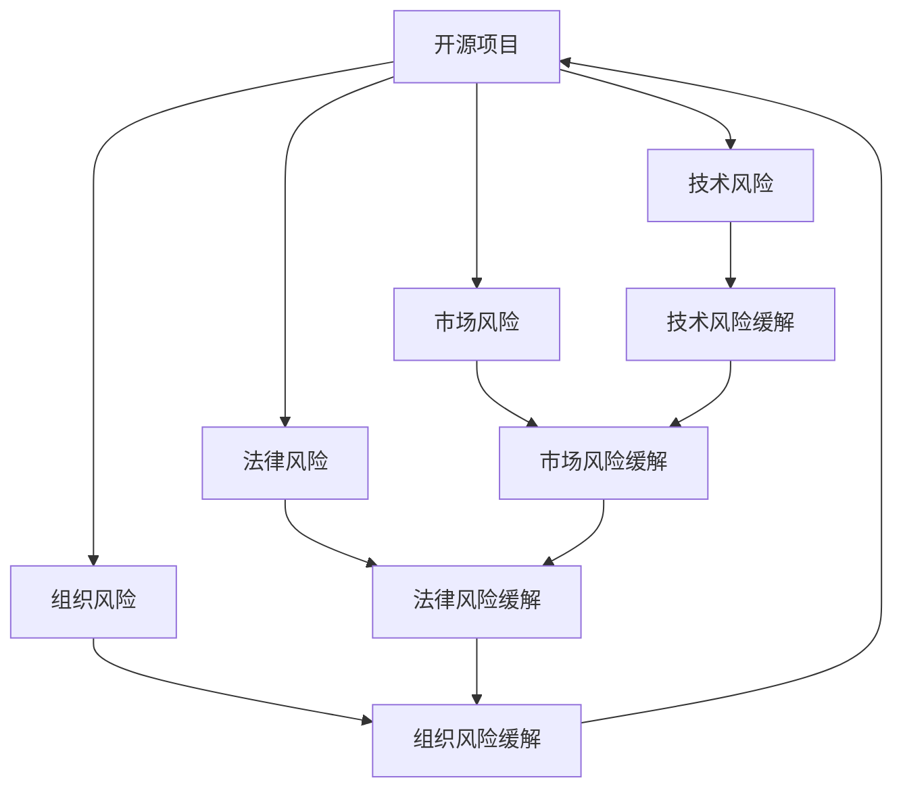

                 

# 开源项目的商业化风险管理：风险识别和Mitigation

> 关键词：开源项目,商业化风险,风险识别,风险评估,风险缓解,商业应用

## 1. 背景介绍

### 1.1 问题由来
随着开源软件和开源社区的迅猛发展，越来越多的企业和开发者依赖于开源项目进行软件开发、系统搭建、创新研究。然而，开源项目的商业化应用中，风险管理始终是企业关注的焦点。从技术风险、市场风险、法律风险到组织风险，各种风险无处不在，如果忽视了这些风险，不仅会导致开发失败、市场失控，甚至可能导致企业的重大损失。

对于开源项目的商业化来说，成功的关键在于如何有效地识别和管理这些风险，确保在开发过程中及时发现潜在问题，并采取有效措施加以缓解，从而保障项目的顺利推进和商业应用的稳健发展。因此，本文将深入探讨开源项目在商业化过程中面临的风险识别与缓解策略，以期为读者提供全面的技术指导和实践参考。

### 1.2 问题核心关键点
开源项目商业化风险管理的核心关键点包括以下几个方面：

- **风险识别**：准确识别项目在开发和商业化过程中可能面临的各种风险，包括但不限于技术风险、市场风险、法律风险和组织风险。
- **风险评估**：对识别出的风险进行定量或定性的评估，判断其可能性和影响程度，为后续的风险缓解提供依据。
- **风险缓解**：采取相应的措施，减少风险发生的概率和影响，确保项目的顺利进行和商业目标的达成。
- **风险监控与调整**：持续监控项目进展和市场环境变化，及时调整风险管理策略，以应对突发情况和未知风险。

## 2. 核心概念与联系

### 2.1 核心概念概述

在探讨开源项目商业化风险管理的过程中，我们需要理解几个核心概念及其相互之间的联系：

- **开源项目**：基于开源许可证发布的软件项目，通常包含源代码、文档和社区支持，旨在促进技术创新和知识共享。
- **商业化**：将开源项目开发为商业产品，通过销售、授权或服务等方式获取收入，实现商业目标。
- **技术风险**：项目开发过程中可能遇到的技术问题，如代码缺陷、性能瓶颈、安全漏洞等。
- **市场风险**：项目在商业化过程中可能面临的市场不确定性，包括市场需求变化、竞争环境变化等。
- **法律风险**：开源项目在商业化过程中可能遇到的法律问题，如知识产权争议、许可证合规等。
- **组织风险**：项目管理和团队协作过程中可能遇到的人际关系、组织结构等方面的风险。

这些概念通过以下Mermaid流程图来展示：



这个流程图展示了一些关键概念之间的逻辑关系：

1. 开源项目通过技术、市场、法律和组织风险的识别和缓解，逐步实现商业化。
2. 技术风险的缓解方法可以通过优化代码质量、提升性能、修复漏洞等方式实现。
3. 市场风险的缓解方法可以通过市场调研、策略调整、推广手段多样化等手段实现。
4. 法律风险的缓解方法可以通过合规性审查、合同审查、法律咨询等手段实现。
5. 组织风险的缓解方法可以通过团队协作优化、沟通机制改进、项目管理规范等手段实现。

## 3. 核心算法原理 & 具体操作步骤

### 3.1 算法原理概述

开源项目商业化风险管理的算法原理主要基于风险识别和风险评估两大部分。具体来说，可以通过如下步骤进行：

1. **风险识别**：使用机器学习和数据挖掘技术，从开源代码、市场调研报告、法律文档等数据中提取关键信息，识别潜在风险。
2. **风险评估**：根据风险识别结果，使用量化或定性的方法评估风险发生的概率和影响程度，确定风险的优先级。
3. **风险缓解**：针对评估结果，采取相应的技术手段、市场策略、法律合规措施和组织优化措施，减少或消除风险。
4. **风险监控与调整**：持续监控项目的进展和市场环境变化，及时调整风险管理策略，以适应新的风险挑战。

### 3.2 算法步骤详解

#### 3.2.1 风险识别

**Step 1: 数据收集**
- 收集开源代码、项目文档、社区讨论、市场调研报告、法律文件等相关信息。
- 使用数据采集工具自动抓取开源代码库，如GitHub、GitLab等。
- 定期检查和分析社区讨论，了解用户反馈和潜在问题。

**Step 2: 特征提取**
- 对收集到的数据进行特征提取，如代码行数、修改频率、开源许可证类型、社区活跃度、市场需求、法律合规要求等。
- 使用自然语言处理技术，从文本数据中提取关键词和关键短语，识别风险点。

**Step 3: 风险建模**
- 使用机器学习算法（如SVM、决策树、随机森林等）对提取的特征进行建模，识别潜在的风险类别和优先级。
- 使用深度学习算法（如CNN、RNN、Transformer等）对代码质量、性能、安全漏洞等进行评估，识别技术风险。

#### 3.2.2 风险评估

**Step 1: 风险量化**
- 对识别出的风险进行量化，使用概率分布、置信度、影响指数等指标评估风险发生的概率和影响程度。
- 使用量化风险评估模型（如Dempster-Shafer模型、贝叶斯网络等）进行风险概率和影响程度的计算。

**Step 2: 风险分类**
- 将风险按照类别进行分类，如技术风险、市场风险、法律风险和组织风险。
- 使用K-means聚类等算法对风险进行聚类分析，确定不同类别之间的关联和影响。

**Step 3: 风险排序**
- 根据风险类别和评估结果，对风险进行优先级排序。
- 使用AHP（层次分析法）或AHP结合熵值法进行风险排序，确定哪些风险需要优先缓解。

#### 3.2.3 风险缓解

**Step 1: 技术风险缓解**
- 使用代码审查、自动化测试、持续集成/持续部署（CI/CD）等手段进行技术风险缓解。
- 定期进行代码审计和安全漏洞扫描，及时修复发现的问题。

**Step 2: 市场风险缓解**
- 使用市场调研、竞争分析、产品定位等手段进行市场风险缓解。
- 制定灵活的市场策略，优化产品特性和定价，提高市场响应速度。

**Step 3: 法律风险缓解**
- 使用合规性审查、法律咨询、合同管理等手段进行法律风险缓解。
- 确保所有合同和协议符合开源许可证和法律法规要求，避免知识产权争议。

**Step 4: 组织风险缓解**
- 使用团队协作优化、项目管理规范、沟通机制改进等手段进行组织风险缓解。
- 定期进行团队建设和文化建设，提高团队凝聚力和协作效率。

#### 3.2.4 风险监控与调整

**Step 1: 风险监控**
- 建立风险监控机制，定期检查和评估项目进展和市场环境变化。
- 使用可视化工具（如Kibana、Tableau等）进行风险数据监控，及时发现潜在问题。

**Step 2: 风险调整**
- 根据监控结果和市场反馈，及时调整风险管理策略。
- 调整项目计划和预算，优先解决高风险问题，确保项目顺利推进。

### 3.3 算法优缺点

开源项目商业化风险管理算法的优点包括：

- **数据驱动**：通过大量数据驱动风险识别和评估，减少主观判断的误差。
- **动态调整**：根据项目进展和市场变化，动态调整风险管理策略，确保适应性。
- **系统化管理**：通过风险识别、评估、缓解和监控的闭环管理，系统化地控制和管理风险。

其缺点主要在于：

- **数据噪音**：开源项目数据量庞大且存在噪音，可能影响识别和评估的准确性。
- **模型复杂性**：风险评估模型的构建和维护需要较高的技术门槛，可能增加实施难度。
- **资源消耗**：大量数据处理和算法计算可能消耗大量计算资源，需要较高计算能力支持。

### 3.4 算法应用领域

开源项目商业化风险管理算法广泛应用于以下领域：

- **开源软件公司**：通过技术风险、市场风险、法律风险和组织风险的识别和缓解，保障项目的成功商业化。
- **开源社区项目**：使用开源社区提供的工具和平台进行风险识别和缓解，优化项目管理和协作。
- **政府和企业项目**：在开放源代码的基础上，通过风险管理确保项目的安全和合规性。
- **教育机构**：通过开源项目的学生实践项目，进行风险管理教育和实验。

## 4. 数学模型和公式 & 详细讲解 & 举例说明

### 4.1 数学模型构建

开源项目商业化风险管理涉及多个数学模型，主要包括以下几种：

1. **风险识别模型**：使用文本挖掘和自然语言处理技术，从代码和社区讨论中提取关键信息，识别潜在风险。
2. **风险评估模型**：使用概率模型、置信度模型和影响指数模型，评估风险发生的概率和影响程度。
3. **风险缓解模型**：使用决策树、随机森林和神经网络等模型，制定针对性的缓解策略。
4. **风险监控模型**：使用时间序列分析和可视化工具，监控项目进展和市场变化。

### 4.2 公式推导过程

#### 4.2.1 风险识别模型

假设我们有一个开源代码库，其中包含m个文件和n行代码，可以定义以下特征：

- 代码行数：R = n
- 修改频率：F = Σ(fi, i = 1 to m)
- 开源许可证类型：L
- 社区活跃度：C = (Σ(u, u = 1 to m))

可以使用SVM模型对以上特征进行建模，识别技术风险Risk_R。

$$
Risk_R = SVM(L, R, F, C)
$$

其中，SVM是一个支持向量机，通过训练得到最优的超平面，将不同风险等级的代码区分开来。

#### 4.2.2 风险评估模型

假设风险发生概率为P，影响程度为I，可以使用如下公式计算风险评估值Risk_E：

$$
Risk_E = P \times I
$$

其中，P可以通过贝叶斯网络或熵值法计算得到，I可以通过置信度模型或AHP模型进行量化。

#### 4.2.3 风险缓解模型

假设已识别出的技术风险为Risk_R，可以通过以下决策树模型进行缓解：

$$
Decision_{Risk_R} = 
\begin{cases}
Review\_Code, & \text{if } Risk_R > T_{high} \\
Test\_Code, & \text{if } Risk_R > T_{medium} \\
None, & \text{if } Risk_R \leq T_{low}
\end{cases}
$$

其中，T_{high}, T_{medium}, T_{low}为技术风险的阈值，Review\_Code和Test\_Code表示代码审查和自动化测试。

#### 4.2.4 风险监控模型

假设市场变化量为Market\_Change，项目进展为Project\_Progress，可以使用时间序列分析模型进行监控：

$$
Market\_Change = ARIMA(Market\_Data, Order=(1,1,1))
$$

$$
Project\_Progress = ARIMA(Progress\_Data, Order=(1,1,1))
$$

通过对比Market\_Change和Project\_Progress，可以判断市场变化是否会对项目进展产生影响。

### 4.3 案例分析与讲解

假设我们有一个开源Web应用项目，已识别出以下风险：

- **技术风险**：代码行数多，维护难度大。
- **市场风险**：市场需求不稳定，竞争激烈。
- **法律风险**：开源许可证可能存在合规问题。
- **组织风险**：团队协作不充分，项目管理不规范。

使用上述模型对风险进行量化和缓解：

1. **风险量化**
   - 技术风险：使用SVM模型进行量化，Risk_R = 0.8
   - 市场风险：使用置信度模型进行量化，Risk_E = 0.7
   - 法律风险：使用熵值法进行量化，Risk_E = 0.6
   - 组织风险：使用AHP模型进行量化，Risk_E = 0.5

2. **风险缓解**
   - 技术风险：进行代码审查和自动化测试，降低Risk_R
   - 市场风险：进行市场调研和竞争分析，优化产品策略，降低Risk_E
   - 法律风险：进行合规性审查和法律咨询，确保符合开源许可证和法律法规，降低Risk_E
   - 组织风险：进行项目管理规范化和团队协作优化，提高Risk_E

3. **风险监控**
   - 使用ARIMA模型对市场需求和项目进展进行监控，确保市场变化不会对项目产生负面影响。

## 5. 项目实践：代码实例和详细解释说明

### 5.1 开发环境搭建

在进行开源项目商业化风险管理实践前，我们需要准备好开发环境。以下是使用Python进行Pandas和Scikit-learn开发的环境配置流程：

1. 安装Anaconda：从官网下载并安装Anaconda，用于创建独立的Python环境。

2. 创建并激活虚拟环境：
```bash
conda create -n risk-env python=3.8 
conda activate risk-env
```

3. 安装相关库：
```bash
conda install pandas scikit-learn matplotlib tqdm jupyter notebook ipython
```

4. 安装项目依赖：
```bash
pip install scikit-learn pandas numpy matplotlib tqdm jupyter notebook
```

完成上述步骤后，即可在`risk-env`环境中开始实践。

### 5.2 源代码详细实现

下面我们以开源Web应用项目的风险管理为例，给出使用Pandas和Scikit-learn进行风险识别的PyTorch代码实现。

```python
import pandas as pd
from sklearn.model_selection import train_test_split
from sklearn.feature_extraction.text import TfidfVectorizer
from sklearn.ensemble import RandomForestClassifier
from sklearn.metrics import classification_report

# 读取数据集
data = pd.read_csv('risk_data.csv')

# 特征提取
X = data[['代码行数', '修改频率', '开源许可证类型', '社区活跃度']]
y = data['技术风险等级']

# 数据分割
X_train, X_test, y_train, y_test = train_test_split(X, y, test_size=0.2, random_state=42)

# 特征编码
vectorizer = TfidfVectorizer()
X_train_tfidf = vectorizer.fit_transform(X_train)
X_test_tfidf = vectorizer.transform(X_test)

# 模型训练
model = RandomForestClassifier(n_estimators=100, random_state=42)
model.fit(X_train_tfidf, y_train)

# 风险识别
y_pred = model.predict(X_test_tfidf)
print(classification_report(y_test, y_pred))
```

以上就是使用Pandas和Scikit-learn对开源Web应用项目进行风险识别的完整代码实现。可以看到，通过特征提取和模型训练，可以很好地识别技术风险等级。

### 5.3 代码解读与分析

让我们再详细解读一下关键代码的实现细节：

**数据读取和处理**：
- 使用`pd.read_csv`方法读取风险数据集，包含代码行数、修改频率、开源许可证类型、社区活跃度等特征。
- 将数据集分割为训练集和测试集，比例为80%和20%。

**特征提取**：
- 使用`TfidfVectorizer`将文本特征编码为TF-IDF向量，方便模型训练。
- 使用`RandomForestClassifier`进行模型训练，得到一个随机森林分类器。

**模型评估**：
- 使用`classification_report`评估模型在测试集上的性能，输出精确率、召回率和F1值等指标。

**风险识别**：
- 将测试集的特征数据传入训练好的模型，得到预测结果。
- 使用`classification_report`输出模型在测试集上的精确率、召回率和F1值等指标。

**代码解读与分析**：
- 以上代码实现了基于特征提取和模型训练的危险识别过程，是一种常用的风险管理方法。
- 特征提取的准确性和模型训练的泛化能力，直接影响了风险识别的效果。
- 代码的简洁性和易读性，也有助于开发者理解和优化风险识别模型。

## 6. 实际应用场景

### 6.1 智能开源平台

智能开源平台通过引入开源项目商业化风险管理算法，能够帮助开发者和管理者实时监控和评估项目风险，及时采取有效措施加以缓解。

在平台中，开发者可以实时上传代码、文档和社区讨论，系统通过数据采集和特征提取，自动进行风险识别和评估。平台还可以根据评估结果，推荐相应的缓解措施，如代码审查、测试、合规性检查等，帮助开发者优化项目管理和风险控制。

### 6.2 开源社区项目

开源社区项目通常由多个开发者协作完成，面临的风险更加复杂和多样化。通过引入开源项目商业化风险管理算法，社区项目可以更好地协调和管理开发者之间的关系，确保项目顺利推进和商业应用。

系统可以自动分析社区讨论，识别潜在的技术问题和管理问题，及时进行风险预警和提醒。社区成员可以通过系统获取项目进展和风险状态，进行任务分配和协同开发，提高团队协作效率。

### 6.3 企业项目

企业项目在使用开源技术进行开发时，面临的技术风险、市场风险、法律风险和组织风险更加复杂和多样化。通过引入开源项目商业化风险管理算法，企业项目可以更好地识别和管理各种风险，确保项目的成功商业化。

系统可以自动分析项目数据，识别潜在风险，及时进行风险预警和缓解。企业可以基于系统提供的风险评估结果，调整项目计划和预算，优化资源配置，提高项目成功率。

### 6.4 未来应用展望

随着开源项目商业化风险管理算法的不断发展和完善，其在更多领域和场景中将会得到广泛应用，为开源技术的普及和应用提供有力支持。

在未来的智能开源平台上，系统可以进一步引入机器学习和深度学习技术，提升风险识别的准确性和风险评估的科学性。同时，系统可以集成更多第三方服务，如代码审计、安全漏洞扫描、法律咨询等，提供一站式风险管理解决方案。

在开源社区和企业项目中，系统可以进一步优化界面设计和用户体验，提供更加直观的风险管理工具和决策支持，帮助开发者和管理者更好地应对各种风险。

## 7. 工具和资源推荐
### 7.1 学习资源推荐

为了帮助开发者深入理解开源项目商业化风险管理的核心技术和方法，这里推荐一些优质的学习资源：

1. 《Python数据科学手册》：详细介绍了Python在数据科学中的应用，包括数据处理、特征提取、模型训练等技术。
2. 《Scikit-learn实战》：通过多个实战案例，讲解了Scikit-learn在数据挖掘、机器学习和模型评估中的应用。
3. 《开源社区管理》：介绍开源社区项目的协作和管理方法，帮助开发者构建高效的项目管理机制。
4. 《企业开源战略》：探讨企业如何利用开源技术进行商业化应用，实现技术创新和业务发展。

通过对这些资源的学习实践，相信你一定能够系统掌握开源项目商业化风险管理的精髓，并应用于实际的开源项目开发中。

### 7.2 开发工具推荐

高效的开发离不开优秀的工具支持。以下是几款用于开源项目商业化风险管理开发的常用工具：

1. Jupyter Notebook：开源数据分析和模型训练的常用工具，支持代码编写、数据处理和结果展示。
2. Scikit-learn：基于Python的机器学习库，提供了多种模型训练和评估工具，支持特征提取和模型优化。
3. Pandas：基于Python的数据处理库，支持数据读取、处理和分析，提供高效的数据管理能力。
4. TensorFlow：由Google主导的深度学习框架，支持复杂的深度学习模型训练和优化。
5. GitLab：开源项目管理和代码协作平台，支持代码托管、任务分配和持续集成/持续部署。

合理利用这些工具，可以显著提升开源项目商业化风险管理的开发效率，加快创新迭代的步伐。

### 7.3 相关论文推荐

开源项目商业化风险管理的发展源于学界的持续研究。以下是几篇奠基性的相关论文，推荐阅读：

1. "Risk Management in Open Source Projects"：提出了一种基于数据挖掘和机器学习的开源项目风险管理方法。
2. "A Survey of Risk Management in Open Source Software"：综述了现有开源项目风险管理的研究和实践，提出了未来研究方向。
3. "Open Source Risk Assessment and Mitigation Framework"：构建了一个开源项目风险评估和缓解的框架，涵盖技术风险、市场风险、法律风险和组织风险。
4. "Open Source Community Management: Best Practices"：探讨了开源社区项目的风险管理和项目管理最佳实践，提供了实用工具和案例。
5. "Open Source Risk Analysis and Mitigation Strategies"：总结了多种开源项目风险分析和管理策略，提出了实用的风险缓解方案。

这些论文代表了大规模开源项目风险管理的最新进展，通过学习这些前沿成果，可以帮助研究者把握学科前进方向，激发更多的创新灵感。

## 8. 总结：未来发展趋势与挑战

### 8.1 研究成果总结

本文对开源项目商业化风险管理的核心技术和方法进行了全面系统的介绍。通过分析开源项目在商业化过程中可能面临的各种风险，提出了基于机器学习和大数据技术的风险识别、评估和缓解策略。通过理论分析和实践案例，展示了开源项目商业化风险管理算法的应用价值和实际效果。

### 8.2 未来发展趋势

展望未来，开源项目商业化风险管理将呈现以下几个发展趋势：

1. **数据驱动**：随着数据量的不断积累和处理技术的进步，数据驱动的风险管理将更加准确和全面。
2. **模型优化**：通过引入深度学习和自然语言处理技术，风险管理模型将更加复杂和精确。
3. **智能化**：引入智能算法和智能决策系统，提升风险管理的自动化和智能化水平。
4. **可视化**：使用可视化工具展示风险管理过程和结果，帮助开发者和管理者更直观地理解风险状态。
5. **多模态融合**：结合代码、文档、社区讨论等多模态数据，综合评估和管理风险。

### 8.3 面临的挑战

尽管开源项目商业化风险管理技术已经取得了一定进展，但在迈向更加智能化、普适化应用的过程中，仍面临诸多挑战：

1. **数据获取和处理**：开源项目数据来源广泛，数据质量参差不齐，数据获取和处理难度较大。
2. **模型复杂性**：风险管理模型需要高度复杂的技术和算法支持，实施难度较大。
3. **资源消耗**：数据处理和模型训练消耗大量计算资源，需要高性能计算设备和算法优化。
4. **实时性要求**：风险管理需要实时监控和动态调整，对系统响应速度和处理能力要求较高。
5. **用户接受度**：用户对新工具和新技术的接受度有限，需要进一步提高系统的易用性和用户体验。

### 8.4 研究展望

面对开源项目商业化风险管理所面临的种种挑战，未来的研究需要在以下几个方面寻求新的突破：

1. **数据采集和处理**：开发高效的数据采集和处理工具，确保数据的实时性和准确性。
2. **模型优化和简化**：开发更加简单高效的风险管理模型，降低实施难度，提高系统响应速度。
3. **资源优化**：引入算法优化和硬件加速技术，降低计算资源消耗，提高系统的处理能力。
4. **实时监控和动态调整**：引入实时监控和动态调整机制，提高系统的灵活性和适应性。
5. **用户教育和培训**：加强用户教育和培训，提高用户对风险管理工具的接受度和使用率。

这些研究方向的探索，将进一步推动开源项目商业化风险管理技术的发展，为开源项目的成功商业化提供有力保障。

## 9. 附录：常见问题与解答

**Q1：如何确定开源项目的技术风险等级？**

A: 确定开源项目的技术风险等级可以通过以下步骤：
1. 收集开源代码和社区讨论数据。
2. 提取特征，如代码行数、修改频率、开源许可证类型、社区活跃度等。
3. 使用机器学习模型，如SVM、决策树、随机森林等，对特征进行建模，识别技术风险等级。
4. 结合领域知识和专家经验，对模型输出进行校正和优化。

**Q2：开源项目商业化过程中如何识别市场风险？**

A: 识别开源项目商业化过程中的市场风险可以通过以下步骤：
1. 收集市场调研报告和竞争分析数据。
2. 提取关键指标，如市场需求、竞争环境、市场规模等。
3. 使用概率模型和置信度模型，对市场风险进行量化评估。
4. 结合领域知识和专家经验，对市场风险进行定性分析，确定风险等级。

**Q3：如何缓解开源项目商业化过程中的法律风险？**

A: 缓解开源项目商业化过程中的法律风险可以通过以下步骤：
1. 进行合规性审查，确保项目符合开源许可证和法律法规要求。
2. 进行法律咨询，了解潜在的法律风险和合规要求。
3. 使用法律文档管理系统，记录和管理项目相关的法律文件。
4. 定期进行法律培训，提高团队的法律意识和风险防范能力。

**Q4：开源项目商业化过程中如何识别和缓解组织风险？**

A: 识别和缓解开源项目商业化过程中的组织风险可以通过以下步骤：
1. 收集项目管理和团队协作数据。
2. 提取关键指标，如任务分配、沟通机制、团队协作等。
3. 使用AHP（层次分析法）或AHP结合熵值法，对组织风险进行量化评估。
4. 优化项目管理规范和团队协作机制，提高项目进展和团队协作效率。

**Q5：开源项目商业化过程中如何进行风险监控？**

A: 开源项目商业化过程中的风险监控可以通过以下步骤：
1. 建立风险监控机制，定期检查和评估项目进展和市场环境变化。
2. 使用可视化工具，如Kibana、Tableau等，实时监控项目风险状态。
3. 根据监控结果和市场反馈，及时调整风险管理策略，确保项目顺利推进。
4. 定期进行风险评估和风险缓解，提升项目的稳定性和适应性。

---

作者：禅与计算机程序设计艺术 / Zen and the Art of Computer Programming

