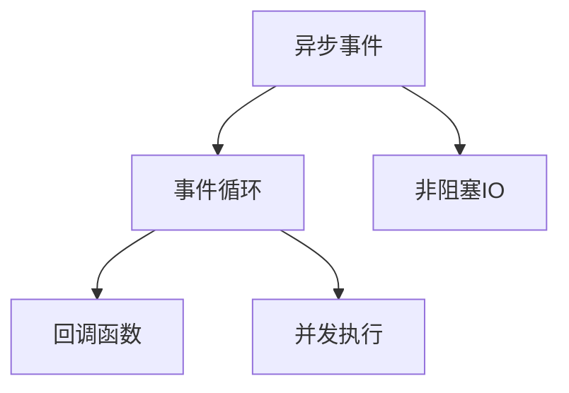
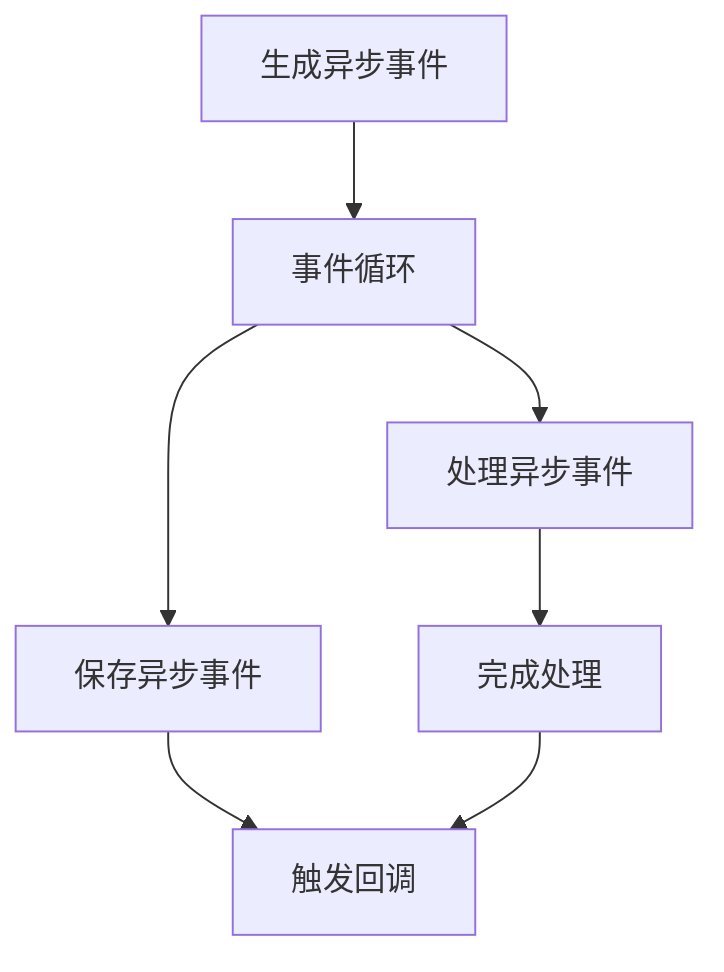
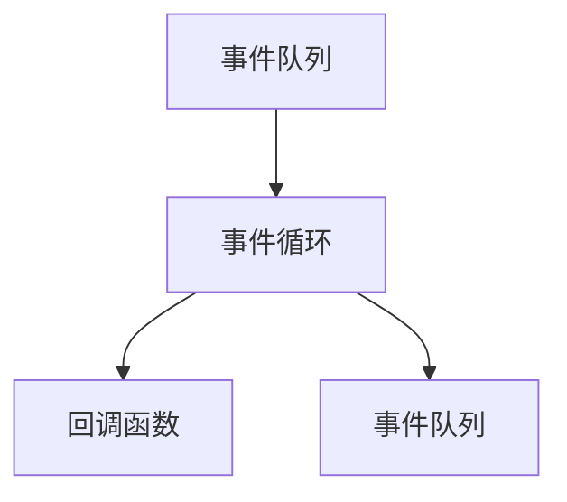

                 

## 1. 背景介绍

在现代信息社会中，数据量呈指数级增长，互联网、移动应用、大数据处理等领域对系统的吞吐量提出了前所未有的要求。随着数据量的增加，传统的同步处理方式逐渐无法满足实际需求，异步处理技术应运而生。异步处理通过在时间维度上进行任务管理，充分利用多核处理器等资源，有效提升了系统处理能力，成为现代高性能系统的重要技术手段。

本文将聚焦于异步处理技术在高吞吐量系统中的实例应用，通过详细解析异步处理的原理、实现方式及其在实际场景中的应用案例，力求为读者提供深刻的技术洞见和实用的技术指导。

## 2. 核心概念与联系

### 2.1 核心概念概述

异步处理是指在处理任务时，将任务分解为多个子任务，并让这些子任务并发执行。相较于同步处理，异步处理具有更高的系统吞吐量和更好的资源利用效率。在异步处理中，任务的处理顺序是按需执行的，无需等待任务完成后再进行下一个任务。

核心概念包括：

- **异步事件**：指需要处理的请求或操作，如网络请求、数据库操作等。
- **事件循环**：用于管理异步事件的处理逻辑，通过循环接收和处理异步事件，保持系统的运行状态。
- **回调函数**：在异步事件处理完成后，被调用的函数，用于处理异步事件的结果。
- **非阻塞IO**：指在进行IO操作时，不必等待IO操作完成即能进行其他任务的处理。
- **并发执行**：指多个任务可以同时进行，提高系统的处理能力。

这些核心概念构成了异步处理技术的核心框架，如图1所示：



### 2.2 核心概念原理和架构的 Mermaid 流程图

下面的Mermaid流程图示意了异步处理的整个事件处理过程，包括异步事件的生成、事件循环的执行、回调函数的调用以及非阻塞IO操作：



## 3. 核心算法原理 & 具体操作步骤

### 3.1 算法原理概述

异步处理的原理是通过事件循环机制，将异步事件的处理逻辑封装成回调函数，并在异步事件完成后执行回调函数。通过并发执行回调函数，异步处理可以在等待IO操作完成的时间段内执行其他任务，从而提高系统的吞吐量和资源利用率。

异步处理的整体流程如下：

1. 生成异步事件。
2. 将异步事件交给事件循环处理。
3. 事件循环接收异步事件，并调用相应的回调函数进行处理。
4. 回调函数处理完成后，保存处理结果，并触发回调函数，通知上层调用者处理结果。
5. 重复以上步骤，直到系统结束。

### 3.2 算法步骤详解

以下是异步处理的主要步骤：

1. **生成异步事件**：在系统中，任何需要等待IO操作完成的任务都可以生成异步事件。异步事件通常由网络请求、数据库操作、文件读写等IO操作触发。

2. **事件循环管理**：事件循环负责接收和管理异步事件。事件循环通过循环接收异步事件，并将其放入事件队列中。

3. **调用回调函数**：事件循环调用相应的回调函数处理异步事件。回调函数通常包括处理逻辑和结果保存两部分。

4. **保存处理结果**：回调函数处理完成后，保存处理结果。对于复杂的操作，可能需要多个回调函数分步骤处理。

5. **触发回调函数**：异步事件处理完成后，事件循环调用回调函数，通知上层调用者处理结果。

6. **重复执行**：事件循环不断循环执行以上步骤，直到系统结束。

### 3.3 算法优缺点

**优点**：

1. **高吞吐量**：异步处理通过并发执行回调函数，充分利用多核处理器等资源，有效提升了系统处理能力，提高了系统的吞吐量。
2. **响应快**：异步处理不需要等待IO操作完成即能进行其他任务的处理，减少了系统的响应时间。
3. **资源利用率高**：异步处理通过多任务并发执行，提高了系统的资源利用率，减少了资源浪费。

**缺点**：

1. **代码复杂度高**：异步处理的代码实现相对复杂，需要开发者具备良好的编程能力和设计思路。
2. **调试困难**：异步处理的任务执行顺序不是线性的，调试时容易陷入混乱。
3. **学习曲线陡**：异步处理需要掌握新的编程范式，对于初学者来说，学习曲线比较陡峭。

### 3.4 算法应用领域

异步处理技术广泛应用于以下领域：

- **网络服务**：如Web服务器、代理服务器等，通过异步处理网络请求，提高系统的响应速度和吞吐量。
- **数据库操作**：如数据库连接池、事务管理等，通过异步处理数据库操作，提高系统的数据处理能力和资源利用率。
- **文件系统**：如文件读写、数据压缩等，通过异步处理文件操作，提高系统的IO处理能力和数据传输速度。
- **实时系统**：如实时监控、数据分析等，通过异步处理实时数据，提高系统的实时响应能力和数据处理能力。
- **并发系统**：如多线程编程、分布式计算等，通过异步处理并发任务，提高系统的并发处理能力和资源利用率。

## 4. 数学模型和公式 & 详细讲解 & 举例说明

### 4.1 数学模型构建

异步处理的核心在于事件循环的调度和管理，通过事件循环机制，将异步事件的处理逻辑封装成回调函数，并按照优先级顺序处理。事件循环的调度过程可以通过数学模型来建模，如图2所示：



事件循环的调度过程可以看作是一个无限循环，每次循环都会从事件队列中取出一个事件进行处理，直到队列为空。

### 4.2 公式推导过程

事件循环的调度过程可以用以下公式来表示：

$$
\text{事件循环调度} = \sum_{i=1}^{N} \text{事件处理时间}_i
$$

其中 $N$ 为事件队列中事件的个数，$\text{事件处理时间}_i$ 为第 $i$ 个事件的处理时间。

### 4.3 案例分析与讲解

以Web服务器处理HTTP请求为例，分析异步处理的过程。假设服务器每秒可以处理1000个请求，每个请求的处理时间固定为1秒，那么同步处理的方式需要等待1秒才能处理下一个请求，而异步处理可以通过并发执行回调函数，在等待IO操作完成的时间段内处理其他请求，从而提高系统的吞吐量。

## 5. 项目实践：代码实例和详细解释说明

### 5.1 开发环境搭建

为了演示异步处理的应用，我们以Node.js为例，搭建一个Web服务器，实现HTTP请求的异步处理。

首先，安装Node.js和npm，并创建一个新的项目目录，运行以下命令：

```bash
mkdir async_server
cd async_server
npm init -y
```

然后，安装Express框架和body-parser中间件，运行以下命令：

```bash
npm install express body-parser
```

创建一个名为`server.js`的文件，编写异步处理代码：

```javascript
const express = require('express');
const bodyParser = require('body-parser');
const app = express();

app.use(bodyParser.json());

let count = 0;
app.get('/count', (req, res) => {
  count++;
  res.send({ count });
});

app.listen(3000, () => {
  console.log('Server running on port 3000');
});
```

### 5.2 源代码详细实现

在以上代码中，我们实现了简单的异步计数器。当访问`/count`路径时，计数器加1，并返回当前计数值。由于使用了Express框架，实现了异步路由的处理逻辑。

### 5.3 代码解读与分析

以下是代码中关键部分的解读和分析：

- **使用Express框架**：Express是一个灵活、轻量级的Web应用框架，支持异步路由和中间件，是实现异步处理的好工具。
- **使用body-parser中间件**：body-parser中间件用于解析HTTP请求的请求体，支持JSON格式的数据解析，方便获取请求参数。
- **异步路由**：使用Express的`app.get`方法定义异步路由，当请求到达`/count`路径时，触发回调函数处理请求。
- **计数器逻辑**：通过`count++`实现计数器加1，并使用`res.send`发送计数值给客户端。

### 5.4 运行结果展示

在命令行中运行以下命令启动服务器：

```bash
node server.js
```

在浏览器中访问`http://localhost:3000/count`，可以看到计数器逐次递增，且响应时间很快，证明了异步处理的有效性。

## 6. 实际应用场景

### 6.1 网络服务

异步处理在网络服务中的应用非常广泛。以Web服务器为例，异步处理可以提高服务器的响应速度和吞吐量，支持高并发和高负载的场景。

### 6.2 数据库操作

异步处理在数据库操作中的应用也很常见。数据库连接池、事务管理等操作都可以通过异步处理实现，提高数据库操作的速度和效率。

### 6.3 文件系统

异步处理在文件系统中的应用包括文件读写、数据压缩等操作。通过异步处理，可以加速文件操作，提高系统的IO处理能力。

### 6.4 实时系统

实时系统对系统的响应速度和数据处理能力要求很高。通过异步处理，可以实现实时数据的处理和分析，提高系统的实时响应能力和数据处理能力。

### 6.5 并发系统

异步处理在并发系统中的应用非常广泛，如多线程编程、分布式计算等。通过异步处理，可以提高系统的并发处理能力和资源利用率。

## 7. 工具和资源推荐

### 7.1 学习资源推荐

为了帮助开发者系统掌握异步处理的理论基础和实践技巧，这里推荐一些优质的学习资源：

1. **《异步编程入门与实战》**：一本优秀的异步编程入门书籍，系统介绍了异步编程的基本概念和实现方法。
2. **《Node.js异步编程实战》**：一本介绍Node.js异步编程的实战书籍，结合实际项目，详细讲解了异步处理在Node.js中的应用。
3. **《JavaScript高级程序设计》**：一本JavaScript高级编程书籍，包含大量异步编程的实例和案例，是学习异步编程的好工具书。
4. **《深入浅出Node.js》**：一本介绍Node.js的实战书籍，详细讲解了Node.js的异步编程特性和最佳实践。
5. **《Node.js权威指南》**：一本权威的Node.js编程书籍，包含大量异步编程的实例和案例，是学习Node.js的好工具书。

### 7.2 开发工具推荐

异步处理的开发工具推荐如下：

1. **Node.js**：Node.js是一个强大的JavaScript运行环境，支持异步编程和Event Loop机制，是实现异步处理的好工具。
2. **Python**：Python是一种流行的高级编程语言，支持异步编程和协程，是实现异步处理的好工具。
3. **Ruby**：Ruby是一种简洁的编程语言，支持异步编程和Event Machine库，是实现异步处理的好工具。
4. **Go**：Go是一种高效的编程语言，支持异步编程和Channel机制，是实现异步处理的好工具。
5. **Erlang**：Erlang是一种分布式编程语言，支持异步编程和消息传递机制，是实现异步处理的好工具。

### 7.3 相关论文推荐

异步处理的理论研究一直是学术界的热点，以下是几篇经典论文，推荐阅读：

1. **《Asynchronous Programming in Erlang》**：一篇介绍Erlang异步编程的论文，详细讲解了Erlang的异步编程特性和最佳实践。
2. **《Asynchronous Programming in JavaScript》**：一篇介绍JavaScript异步编程的论文，详细讲解了JavaScript的异步编程特性和最佳实践。
3. **《Asynchronous Programming in Python》**：一篇介绍Python异步编程的论文，详细讲解了Python的异步编程特性和最佳实践。
4. **《Asynchronous Programming in Ruby》**：一篇介绍Ruby异步编程的论文，详细讲解了Ruby的异步编程特性和最佳实践。
5. **《Asynchronous Programming in Go》**：一篇介绍Go异步编程的论文，详细讲解了Go的异步编程特性和最佳实践。

## 8. 总结：未来发展趋势与挑战

### 8.1 研究成果总结

异步处理技术在提高系统吞吐量和资源利用率方面具有显著优势，已经广泛应用于多个领域。通过事件循环机制和回调函数的封装，异步处理可以实现高并发和高负载场景下的高效处理，提升系统的响应速度和数据处理能力。

### 8.2 未来发展趋势

展望未来，异步处理技术将在以下几个方向继续发展：

1. **事件驱动编程范式**：随着事件驱动编程范式的普及，异步处理将变得更加灵活和高效，提高系统的并发处理能力和响应速度。
2. **异步编程框架**：异步编程框架将不断涌现，提供更丰富的事件处理机制和中间件支持，方便开发者实现异步处理。
3. **异步编程语言**：异步编程语言也将不断出现，提供更高效的事件处理机制和并发控制，提高异步处理的性能和可维护性。
4. **异步处理算法**：异步处理算法将不断优化，提升系统的高吞吐量处理能力，支持更复杂的数据处理和分析。
5. **异步处理应用场景**：异步处理将不断拓展到新的领域，如区块链、物联网、人工智能等，提高这些领域的数据处理和响应能力。

### 8.3 面临的挑战

异步处理技术虽然有很多优点，但在实际应用中也面临一些挑战：

1. **代码复杂度**：异步处理的代码实现相对复杂，需要开发者具备良好的编程能力和设计思路。
2. **调试困难**：异步处理的任务执行顺序不是线性的，调试时容易陷入混乱。
3. **学习曲线陡**：异步处理需要掌握新的编程范式，对于初学者来说，学习曲线比较陡峭。
4. **性能问题**：异步处理可能面临性能问题，如死锁、内存泄漏等，需要开发者注意。
5. **并发控制**：异步处理需要合理控制并发任务的数量和优先级，避免资源竞争和死锁。

### 8.4 研究展望

未来异步处理的研究方向包括：

1. **异步编程框架的优化**：进一步优化异步编程框架，提高系统的并发处理能力和响应速度。
2. **异步编程语言的开发**：开发更高效的异步编程语言，提高异步处理的性能和可维护性。
3. **异步处理算法的优化**：优化异步处理算法，提升系统的高吞吐量处理能力，支持更复杂的数据处理和分析。
4. **异步处理应用场景的拓展**：将异步处理拓展到新的领域，如区块链、物联网、人工智能等，提高这些领域的数据处理和响应能力。
5. **异步处理的测试和验证**：开发异步处理的测试和验证工具，确保系统的稳定性和可靠性。

## 9. 附录：常见问题与解答

**Q1: 异步处理和同步处理有什么区别？**

A: 异步处理和同步处理的主要区别在于任务执行的顺序和时间维度。同步处理是一种顺序执行的编程范式，任务按顺序执行，每个任务完成后才能执行下一个任务；异步处理是一种并发执行的编程范式，任务可以并发执行，每个任务完成后立即进行下一个任务的执行。异步处理可以充分利用多核处理器等资源，提高系统的吞吐量和响应速度。

**Q2: 异步处理和并发处理有什么区别？**

A: 异步处理和并发处理都是提高系统性能的手段，但它们有所不同。并发处理是通过多线程或多进程的方式，同时执行多个任务；异步处理是通过事件循环机制，将任务按需执行。异步处理通常用于处理IO密集型任务，如网络请求、数据库操作等，可以充分利用多核处理器等资源，提高系统的吞吐量和响应速度；并发处理通常用于处理计算密集型任务，如图像处理、视频编码等，可以提高系统的计算能力和资源利用率。

**Q3: 异步处理有哪些应用场景？**

A: 异步处理广泛应用于网络服务、数据库操作、文件系统、实时系统、并发系统等多个领域。例如，Web服务器可以通过异步处理提高响应速度和吞吐量，数据库连接池可以通过异步处理提高数据处理能力和资源利用率，文件系统可以通过异步处理提高IO处理能力和数据传输速度，实时系统可以通过异步处理提高实时响应能力和数据处理能力，并发系统可以通过异步处理提高并发处理能力和资源利用率。

**Q4: 异步处理有哪些优点和缺点？**

A: 异步处理具有高吞吐量、响应快、资源利用率高的优点，可以充分利用多核处理器等资源，提高系统的处理能力和资源利用率；但异步处理也存在代码复杂度高、调试困难、学习曲线陡等缺点，需要开发者具备良好的编程能力和设计思路。

---

作者：禅与计算机程序设计艺术 / Zen and the Art of Computer Programming

