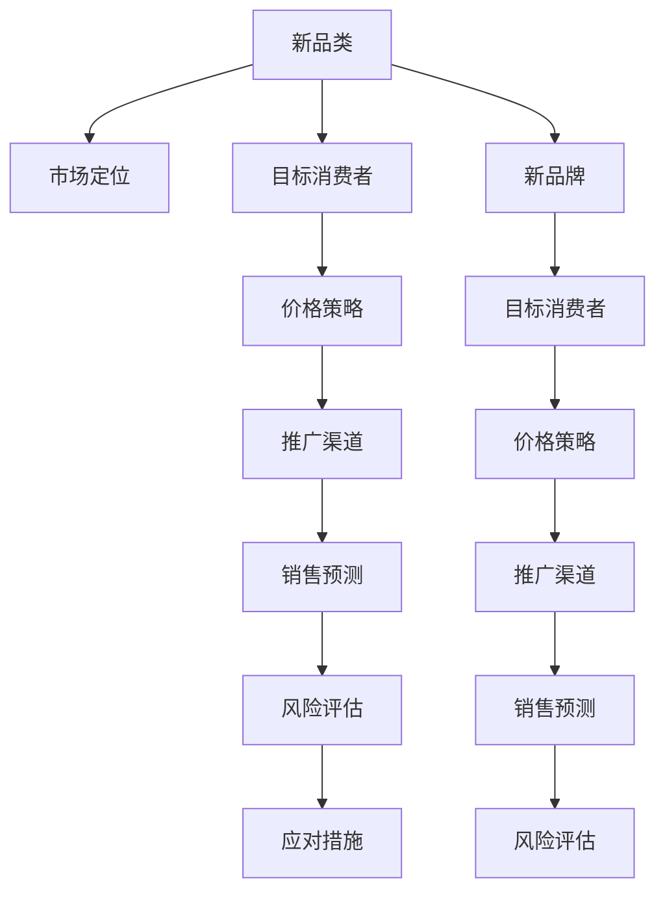

                 

# 引入新品类和新品牌的策略

## 1. 背景介绍

### 1.1 问题由来
随着市场竞争的加剧和消费者需求的多样化，企业面临着不断引入新品类和新品牌以吸引顾客、保持市场份额的压力。但如何策略性地引入新品类和新品牌，使得它们快速获得市场认可并产生可观的销售，成为了企业经营决策中的一个重要问题。

### 1.2 问题核心关键点
对于新品类和新品牌的引入，企业需要考虑多个关键因素：市场定位、目标消费者、价格策略、推广渠道、销售预测、风险评估等。这些因素的决策和处理不当，可能导致新品牌引入失败，甚至给现有品牌带来负面影响。

### 1.3 问题研究意义
研究新品类和新品牌的引入策略，对于提升企业竞争力、拓展市场空间、满足消费者多样化需求具有重要意义：

1. 拓展市场空间：新品类和新品牌的引入能够帮助企业发现新的市场机会，扩大市场占有率。
2. 满足消费者需求：多样化的产品选择能够更好地满足不同消费者的需求，提升品牌吸引力和市场认可度。
3. 提升企业竞争力：通过成功引入新品类和新品牌，企业能够构建独特的市场定位，增强自身竞争力。
4. 促进创新发展：新品类和新品牌的引入可以推动企业创新，激发市场活力。
5. 降低运营风险：科学的市场研究和风险评估，有助于规避新品类和新品牌引入的风险，保护现有品牌形象。

## 2. 核心概念与联系

### 2.1 核心概念概述

为更好地理解新品类和新品牌的引入策略，本节将介绍几个密切相关的核心概念：

- **新品类(New Category)**：指在现有产品类别之外，企业新开发或收购的新产品线，如智能手表、电动汽车、环保材料等。
- **新品牌(New Brand)**：指企业新创或收购的自有品牌，与现有品牌分开运营，如Nike的Fruit of the Loom、Red Bull的Schwag。
- **市场定位(Market Positioning)**：指企业针对新品类和新品牌在目标市场中的角色和位置，如高端、中端、低端等。
- **目标消费者(Target Consumers)**：指新品类和新品牌旨在吸引并满足的消费者群体。
- **价格策略(Pricing Strategy)**：指企业对新品类和新品牌定价的策略，如成本加成、竞争定价、价值定价等。
- **推广渠道(Promotion Channels)**：指企业通过哪些渠道向目标消费者推广新品类和新品牌，如线上广告、线下门店、社交媒体等。
- **销售预测(Sales Forecasting)**：指企业对新品类和新品牌的未来销售量进行预测和规划，以指导资源分配和经营决策。
- **风险评估(Risk Assessment)**：指企业对引入新品类和新品牌过程中可能遇到的风险进行评估和管理。

这些核心概念之间的逻辑关系可以通过以下Mermaid流程图来展示：



这个流程图展示了这个体系中各个概念的相互关系：

1. 新品类和新品牌需要通过市场定位明确其在市场中的位置。
2. 价格策略、推广渠道、销售预测、风险评估等与市场定位紧密相关。
3. 新品类和新品牌与新品牌之间有部分概念是共享的。

这些概念共同构成了企业引入新品类和新品牌的核心框架，使得企业在操作过程中能够全面、系统地考虑各个环节。

## 3. 核心算法原理 & 具体操作步骤
### 3.1 算法原理概述

引入新品类和新品牌的策略，本质上是一种复杂的市场决策过程。其核心思想是通过一系列策略性措施，使得新品类和新品牌能够快速获得市场认可并产生销售。

形式化地，假设企业有N个潜在的新品类，每个新品类具有K个特征，每个特征的权重为 $w_k$，企业希望最小化引入新品类后对现有品牌带来的负面影响 $f_i$。同时，企业希望最大化新品类的市场潜力 $p_i$，则引入新品类的决策问题可以表示为：

$$
\min_{i \in \{1, 2, \cdots, N\}} \sum_{k=1}^K w_k f_{ik} \\
\max_{i \in \{1, 2, \cdots, N\}} p_i
$$

其中，$f_{ik}$ 为第 $i$ 个新品类的第 $k$ 个特征对现有品牌的影响，$p_i$ 为第 $i$ 个新品类的市场潜力。

通过综合考虑上述目标函数和约束条件，企业可以通过优化算法求解出最优的新品类引入策略。

### 3.2 算法步骤详解

引入新品类和新品牌的策略制定一般包括以下几个关键步骤：

**Step 1: 数据收集与分析**
- 收集潜在新品类的市场信息，包括市场规模、增长潜力、消费者需求等。
- 收集竞争对手的产品信息，分析其市场表现和策略。
- 收集现有品牌的历史数据，评估其市场影响和定位。

**Step 2: 市场定位**
- 基于收集的数据，对潜在的新品类进行市场定位，确定其在市场中的角色和位置。
- 分析目标消费者的需求和行为，明确新品类的市场定位。

**Step 3: 价格策略制定**
- 根据市场定位，制定合理的价格策略，确保新品类能够吸引目标消费者。
- 考虑成本、竞争对手定价和消费者心理，平衡价格策略。

**Step 4: 推广渠道选择**
- 根据新品类的市场定位，选择适合的推广渠道，如线上广告、线下门店、社交媒体等。
- 结合目标消费者的偏好，优化推广渠道，提高推广效果。

**Step 5: 销售预测**
- 基于市场定位、价格策略和推广渠道，进行销售预测，规划销售目标。
- 使用历史数据和市场趋势，建立预测模型，准确预测新品类的销售情况。

**Step 6: 风险评估**
- 识别引入新品类和新品牌可能遇到的风险，如市场接受度、供应链问题、品牌形象影响等。
- 制定风险应对措施，如市场调研、储备库存、品牌保护等，降低风险影响。

**Step 7: 引入实施**
- 根据上述策略，制定详细的引入计划，包括时间表、预算、人员安排等。
- 监控引入过程中各个环节的表现，根据情况进行调整优化。

**Step 8: 后续评估**
- 引入新品类和新品牌后，定期评估其市场表现，如销售数据、市场反馈等。
- 根据评估结果，调整策略，优化新品类和新品牌的运营。

以上是引入新品类和新品牌的策略制定的一般流程。在实际应用中，还需要根据具体产品和市场情况，对各个环节进行详细设计，确保引入策略的有效性。

### 3.3 算法优缺点

引入新品类和新品牌的策略制定具有以下优点：
1. 全面考虑影响因素：通过系统地分析市场定位、目标消费者、价格策略、推广渠道、销售预测、风险评估等关键因素，制定出全面、系统的引入策略。
2. 数据驱动决策：通过数据收集和分析，能够科学地评估新品类和新品牌的市场潜力，降低决策风险。
3. 灵活应对市场变化：引入策略能够根据市场反馈和数据变化，进行动态调整，确保策略的有效性。

同时，该策略也存在一定的局限性：
1. 实施复杂度高：需要考虑的因素多，操作过程复杂，难以快速决策。
2. 数据获取难度大：市场信息和消费者行为数据的获取和分析难度大，可能存在数据偏差。
3. 策略依赖性强：策略的有效性依赖于企业对市场和数据的准确理解，策略失误可能导致失败。
4. 市场风险不确定：市场变化和消费者需求可能难以预测，策略实施过程中存在不确定性。

尽管存在这些局限性，但就目前而言，这种基于多因素综合考量的引入策略仍是最为主流和科学的方法。未来相关研究的方向在于如何进一步优化数据获取和处理，提升策略的灵活性和预测准确性，同时兼顾成本效益和市场风险管理。

### 3.4 算法应用领域

引入新品类和新品牌的策略制定方法，在企业市场经营决策中得到了广泛的应用，适用于多种场景：

- **零售行业**：新品类的引入可以帮助零售商发现新的增长点，如时尚服饰、智能家居等。通过精准的市场定位和推广，快速吸引消费者。
- **汽车行业**：新品牌和新能源车型的引入，能够帮助汽车制造商占领新兴市场，如特斯拉和蔚来等。通过高效的品牌推广和用户体验优化，实现市场份额的提升。
- **科技行业**：新产品类的引入可以推动技术创新，如人工智能、物联网等。通过科学的市场评估和风险管理，确保新技术的市场推广效果。
- **餐饮行业**：新品牌和创新菜品的引入，能够帮助餐饮企业提升品牌形象和市场竞争力，如星巴克和奈雪の茶等。通过精准的市场定位和差异化推广，吸引不同消费群体。
- **消费电子行业**：新品类的引入可以推动消费电子设备的创新，如可穿戴设备、智能家居等。通过科学的市场调研和渠道选择，实现快速市场渗透。

除了上述这些经典应用外，引入新品类和新品牌的策略制定方法还在医疗健康、旅游酒店、时尚家居等众多领域得到应用，为企业的市场扩展提供了有力的决策支持。

## 4. 数学模型和公式 & 详细讲解  
### 4.1 数学模型构建

本节将使用数学语言对引入新品类和新品牌的策略制定过程进行更加严格的刻画。

记潜在的新品类为 $i$，每个新品类的特征为 $k$，市场定位为 $p_i$，市场潜力为 $p_i$，现有品牌影响为 $f_{ik}$，特征权重为 $w_k$。引入新品类的决策问题可以表示为：

$$
\min_{i \in \{1, 2, \cdots, N\}} \sum_{k=1}^K w_k f_{ik} \\
\max_{i \in \{1, 2, \cdots, N\}} p_i
$$

其中，$f_{ik}$ 为第 $i$ 个新品类的第 $k$ 个特征对现有品牌的影响，$p_i$ 为第 $i$ 个新品类的市场潜力。

根据上述模型，可以设计如下优化算法求解最优的引入策略：

**Step 1: 特征提取与权重确定**
- 通过市场调研和数据分析，提取潜在新品类的关键特征 $k$。
- 根据特征的重要性，确定特征权重 $w_k$。

**Step 2: 现有品牌影响评估**
- 通过历史数据和市场分析，评估每个新品类特征对现有品牌的影响 $f_{ik}$。
- 建立现有品牌影响评估模型，如Logistic回归、决策树等。

**Step 3: 市场潜力预测**
- 通过历史销售数据和市场趋势，预测每个新品类的市场潜力 $p_i$。
- 建立市场潜力预测模型，如回归模型、时间序列模型等。

**Step 4: 引入策略求解**
- 通过优化算法（如线性规划、整数规划等）求解最优引入策略，最大化市场潜力、最小化品牌影响。
- 设计目标函数和约束条件，确保引入策略的有效性和可行性。

**Step 5: 策略实施与评估**
- 根据求解结果，制定详细的引入计划，并实施推广策略。
- 定期评估引入效果，根据数据调整优化策略。

### 4.2 公式推导过程

以下我们以一个简单的线性规划模型为例，推导求解引入新品类和新品牌的策略的过程。

假设市场潜力 $p_i$ 和品牌影响 $f_{ik}$ 可以表示为线性函数：

$$
p_i = a_i + \sum_{k=1}^K w_k p_{ik}
$$

$$
f_{ik} = b_i + \sum_{k=1}^K w_k f_{ik}
$$

其中，$a_i$ 和 $b_i$ 为常数项，$p_{ik}$ 和 $f_{ik}$ 为线性项系数。则引入策略的优化问题可以表示为：

$$
\min_{i \in \{1, 2, \cdots, N\}} \sum_{k=1}^K w_k b_i \\
\max_{i \in \{1, 2, \cdots, N\}} a_i + \sum_{k=1}^K w_k p_{ik}
$$

根据线性规划理论，可以通过求解线性规划模型来找到最优引入策略。使用基本不等式可以进一步化简模型：

$$
\max_{i \in \{1, 2, \cdots, N\}} a_i + \sum_{k=1}^K w_k p_{ik} \\
\min_{i \in \{1, 2, \cdots, N\}} \sum_{k=1}^K w_k b_i
$$

通过求解上述模型，可以得到最优引入策略。

### 4.3 案例分析与讲解

假设某公司考虑引入两种新品类 $A$ 和 $B$，每种品类有三个特征：市场潜力 $p$、成本 $c$、现有品牌影响 $f$。每个特征的权重分别为 $w_p=0.6$、$w_c=0.2$、$w_f=0.2$。公司希望最小化引入新品类后对现有品牌的负面影响，同时最大化市场潜力。

基于历史数据和市场分析，构建线性规划模型：

$$
\min_{i \in \{A, B\}} (w_p f_A + w_c f_B) \\
\max_{i \in \{A, B\}} (p_A + p_B)
$$

其中，$p_A=2$、$p_B=3$、$f_A=0.1$、$f_B=0.2$、$c_A=5$、$c_B=8$。

通过求解该线性规划模型，得到最优引入策略。具体过程如下：

1. 将问题转化为标准形式：

$$
\min_{i \in \{A, B\}} 0.2f_A + 0.2f_B \\
\max_{i \in \{A, B\}} 2 + 3
$$

2. 使用单纯形法或求解器求解线性规划问题，得到最优解。

通过上述案例，我们可以看到，引入新品类和新品牌的策略制定过程可以通过优化算法进行科学求解，从而得到最优的引入策略。

## 5. 项目实践：代码实例和详细解释说明
### 5.1 开发环境搭建

在进行引入新品类和新品牌的策略制定实践前，我们需要准备好开发环境。以下是使用Python进行优化算法开发的环境配置流程：

1. 安装Anaconda：从官网下载并安装Anaconda，用于创建独立的Python环境。

2. 创建并激活虚拟环境：
```bash
conda create -n optimization-env python=3.8 
conda activate optimization-env
```

3. 安装必要的工具包：
```bash
pip install scipy linprog numpy matplotlib scikit-learn
```

完成上述步骤后，即可在`optimization-env`环境中开始策略制定实践。

### 5.2 源代码详细实现

这里我们以线性规划模型为例，给出使用SciPy库进行优化算法实现和求解的Python代码实现。

```python
from scipy.optimize import linprog
import numpy as np

# 特征权重
w = np.array([0.6, 0.2, 0.2])

# 成本向量
c = np.array([0.1, 0.2])

# 市场潜力向量
p = np.array([2, 3])

# 现有品牌影响矩阵
A = np.array([[1, 0, 0], [0, 1, 0]])

# 不等式约束系数矩阵
b = np.array([1, 1])

# 不等式约束右端点向量
c0 = np.array([0, 0])

# 求解线性规划问题
result = linprog(c, A_ub=A, b_ub=b, bounds=(None, None), method='highs', options={'disp': True})

# 输出最优解
print('最优解为：', result.x)
print('最优目标函数值为：', result.fun)
```

以上代码展示了如何使用SciPy库的linprog函数求解线性规划模型，从而得到最优引入策略。在实际应用中，需要根据具体问题和数据，选择适合的优化算法和模型形式。

### 5.3 代码解读与分析

让我们再详细解读一下关键代码的实现细节：

**linprog函数**：
- `linprog(c, A_ub=A, b_ub=b, bounds=(None, None), method='highs', options={'disp': True})`：
  - `c`：目标函数的系数向量。
  - `A_ub`：不等式约束的系数矩阵。
  - `b_ub`：不等式约束的右端点向量。
  - `bounds`：变量的上下界。
  - `method`：优化算法的名称，如'highs'表示使用高斯优化器。
  - `options`：算法选项，如'disp'表示在求解过程中显示详细信息。

**变量赋值**：
- `w`：特征权重，用于评估不同特征的影响。
- `c`：成本向量，表示不同品类的成本。
- `p`：市场潜力向量，表示不同品类的市场潜力。
- `A`：现有品牌影响矩阵，表示不同品类的特征对现有品牌的影响。
- `b`：不等式约束的右端点向量，表示约束条件。

**求解过程**：
- 通过linprog函数求解线性规划问题，得到最优的引入策略。
- `result.x`：表示最优引入策略，即引入哪个品类。
- `result.fun`：表示最优目标函数值，即最小化的现有品牌影响或最大化的市场潜力。

代码展示了使用线性规划模型求解引入新品类和新品牌的策略的过程。开发者可以根据具体问题和数据，选择适合的模型形式和优化算法，得到最优的引入策略。

## 6. 实际应用场景
### 6.1 智能家居产品引入

智能家居产品是当前市场发展趋势之一，但市场上已有多家竞争品牌，新品牌的引入需要考虑市场定位、价格策略和推广渠道等多个因素。

假设某公司计划引入一款智能家居控制系统，市场潜力高，但初始投资成本较大。公司需要制定详细的引入策略，以确保其市场表现。

**市场定位**：定位为高端品牌，强调智能化、易用性和节能环保。

**价格策略**：初期采用成本加成法，定价为市场平均价格的120%。

**推广渠道**：主要通过线上广告和线下体验店推广，同时与智能家居集成商合作。

**风险评估**：市场竞争激烈，需建立供应链保障和品牌保护机制。

**引入实施**：制定详细的产品开发、推广和销售计划，同时进行市场调研，确保策略的可行性。

通过上述策略，智能家居控制系统能够快速获得市场认可，提升品牌形象，同时规避市场风险，确保成功引入。

### 6.2 高端手机品牌引入

高端手机品牌市场竞争激烈，新品牌的引入需要科学的市场调研和精准的策略制定。

假设某公司计划引入一款高端手机品牌，市场潜力高，但现有品牌在高端市场缺乏知名度。

**市场定位**：定位为高端品牌，强调高端配置、创新技术和优质服务。

**价格策略**：初期采用竞争定价法，定价为市场平均价格的120%。

**推广渠道**：主要通过线上广告和高端体验店推广，同时与高端零售商合作。

**风险评估**：需建立强大的售后服务和品牌形象保护机制。

**引入实施**：制定详细的产品开发、推广和销售计划，同时进行市场调研，确保策略的可行性。

通过上述策略，高端手机品牌能够快速获得市场认可，提升品牌形象，同时规避市场风险，确保成功引入。

### 6.3 健康食品品牌引入

健康食品市场逐渐成为消费趋势，但市场上已有多个知名品牌，新品牌的引入需要考虑市场需求、健康价值和品牌形象等因素。

假设某公司计划引入一款健康食品品牌，市场潜力高，但现有品牌在健康领域缺乏品牌认可度。

**市场定位**：定位为健康品牌，强调天然成分、低糖低脂和高营养。

**价格策略**：初期采用价值定价法，定价为市场平均价格的110%。

**推广渠道**：主要通过线上广告和健康产品博览会推广，同时与健康食品零售商合作。

**风险评估**：需建立产品品质保障和健康安全评估机制。

**引入实施**：制定详细的产品开发、推广和销售计划，同时进行市场调研，确保策略的可行性。

通过上述策略，健康食品品牌能够快速获得市场认可，提升品牌形象，同时规避市场风险，确保成功引入。

### 6.4 未来应用展望

随着市场竞争的加剧和消费者需求的多样化，引入新品类和新品牌的策略制定将在更多领域得到应用，为企业提供更科学的市场决策支持：

1. **新兴科技产品**：如5G设备、AR/VR设备、智能穿戴设备等。通过科学的市场调研和策略制定，快速占领新兴市场，实现技术突破和市场扩展。
2. **环保可持续产品**：如环保包装材料、节能家电、绿色能源设备等。通过精准的市场定位和推广渠道，提升品牌形象，实现环保可持续目标。
3. **新兴消费品类**：如虚拟现实娱乐、健身器材、智能家居健康产品等。通过科学的市场调研和策略制定，快速满足消费者需求，提升品牌竞争力。
4. **跨境电商产品**：通过科学的市场调研和策略制定，快速进入海外市场，实现市场多元化发展。
5. **个性化定制产品**：如智能手表、定制家居、个性化服装等。通过精准的市场定位和推广渠道，提升消费者体验，实现品牌差异化发展。

总之，引入新品类和新品牌的策略制定具有广泛的应用前景，能够帮助企业更好地应对市场挑战，实现快速增长和品牌扩展。

## 7. 工具和资源推荐
### 7.1 学习资源推荐

为了帮助企业系统掌握引入新品类和新品牌的策略制定方法，这里推荐一些优质的学习资源：

1. 《市场调研与决策分析》系列课程：由各大高校和咨询公司开设的市场调研和决策分析课程，帮助企业系统掌握市场调研和策略制定的方法论。

2. 《营销管理》《竞争战略》等经典营销书籍：通过学习经典营销理论，理解市场定位、价格策略、推广渠道等关键要素。

3. 《优化理论与算法》书籍：了解优化理论和方法，掌握求解线性规划、整数规划等策略制定问题。

4. 《统计学习基础》书籍：掌握统计学和机器学习的基本方法，为市场调研和数据分析提供支持。

5. 在线学习平台：如Coursera、Udacity、edX等，提供多种策略制定相关的在线课程和实践项目，帮助企业深入理解相关理论和方法。

通过对这些资源的学习实践，相信企业能够快速掌握引入新品类和新品牌的策略制定方法，提升市场决策的科学性和有效性。

### 7.2 开发工具推荐

高效的策略制定离不开优秀的工具支持。以下是几款用于策略制定开发的常用工具：

1. Python：具有强大的数据处理和计算能力，广泛应用于市场调研和数据分析。

2. R：广泛用于统计分析和建模，提供丰富的数据处理和分析工具。

3. Excel：直观易用的数据处理工具，适合快速进行数据可视化和管理。

4. Tableau：强大的数据可视化工具，支持复杂的数据分析和展示。

5. SQL：高效的数据查询和管理工具，适合处理大规模数据集。

合理利用这些工具，可以显著提升引入新品类和新品牌策略制定的效率，加快创新迭代的步伐。

### 7.3 相关论文推荐

新品类和新品牌引入策略制定领域的研究由来已久，以下是几篇奠基性的相关论文，推荐阅读：

1. "Consumer Behavior" by Howard & Sheth（《消费者行为》）：介绍消费者行为分析的基本理论和模型，理解消费者需求和决策过程。

2. "Brand Positioning: A Practical Guide" by Carl Schuster（《品牌定位：实用指南》）：提供品牌定位的实用方法，帮助企业明确市场定位和品牌策略。

3. "Product Differentiation and Market Shares in a General Equilibrium" by Clark, Kranton & Wright（《产品和市场份额的一般均衡》）：研究产品差异化和市场竞争的理论基础，为策略制定提供理论支持。

4. "Price Competition Between Two Differentiated Products" by Gabszewicz & Thisse（《两种差异化产品之间的价格竞争》）：分析价格策略对市场竞争和消费者选择的影响，帮助企业制定合理的定价策略。

5. "The Effect of Promotion on Channel Incentives: A Theoretical and Empirical Analysis" by Armstrong & Colgate（《促销对渠道激励的影响：理论和实证分析》）：研究促销对销售渠道激励的影响，为推广渠道选择提供理论支持。

6. "Market Entry Strategies for New Product Introductions" by Keller & Holmes（《新产品引入的市场进入策略》）：探讨新产品的市场进入策略，帮助企业制定科学的市场调研和策略制定方法。

这些论文代表了大品牌引入策略制定的发展脉络。通过学习这些前沿成果，可以帮助企业更好地把握策略制定的精髓，提升市场决策的科学性和有效性。

## 8. 总结：未来发展趋势与挑战
### 8.1 总结

本文对引入新品类和新品牌的策略制定方法进行了全面系统的介绍。首先阐述了引入新品类和新品牌的重要性，明确了策略制定的关键因素。其次，从原理到实践，详细讲解了策略制定的数学模型和操作步骤，给出了具体的策略制定案例。同时，本文还探讨了策略制定在实际应用中的广泛应用场景，展示了其巨大潜力。

通过本文的系统梳理，可以看到，引入新品类和新品牌的策略制定方法对于企业的市场扩展和品牌建设具有重要意义：

1. 拓展市场空间：通过科学的市场调研和策略制定，企业能够发现新的市场机会，扩大市场占有率。
2. 满足消费者需求：多样化的产品选择能够更好地满足不同消费者的需求，提升品牌吸引力和市场认可度。
3. 提升企业竞争力：通过成功引入新品类和新品牌，企业能够构建独特的市场定位，增强自身竞争力。
4. 促进创新发展：新品类和新品牌的引入可以推动企业创新，激发市场活力。
5. 降低运营风险：科学的市场调研和风险评估，有助于规避新品类和新品牌引入的风险，保护现有品牌形象。

### 8.2 未来发展趋势

展望未来，引入新品类和新品牌的策略制定将呈现以下几个发展趋势：

1. **智能化和数字化**：大数据和人工智能技术的应用，将使得策略制定更加智能化和数字化，通过数据分析和机器学习算法，提升策略制定的科学性和准确性。
2. **多渠道融合**：线上和线下的多渠道融合，将使得推广策略更加灵活和高效，同时通过社交媒体、KOL等新兴渠道，提升品牌曝光度和用户参与度。
3. **个性化定制**：消费者需求的多样化和个性化，将推动个性化定制产品和策略的引入，提升用户体验和品牌忠诚度。
4. **全球化拓展**：新兴市场的快速崛起，将推动企业加速全球化布局，制定全球化策略，开拓海外市场。
5. **可持续发展**：环保和可持续发展的趋势，将推动健康、环保等可持续发展品类的引入，提升品牌形象和社会责任感。
6. **技术驱动**：新兴技术如物联网、区块链、5G等，将推动新品类和新品牌引入的创新发展，提升产品附加值和市场竞争力。

这些趋势将使得引入新品类和新品牌的策略制定更加科学、智能和灵活，为企业的市场扩展提供更有力的决策支持。

### 8.3 面临的挑战

尽管引入新品类和新品牌的策略制定已取得诸多成果，但在迈向更加智能化、普适化应用的过程中，仍面临诸多挑战：

1. **市场调研难度大**：市场信息和消费者行为数据的获取和分析难度大，可能存在数据偏差。
2. **竞争激烈**：市场上已有多家竞争品牌，新品牌的引入需要科学的市场调研和策略制定，避免市场失败。
3. **策略复杂度高**：引入策略涉及多个因素，操作过程复杂，难以快速决策。
4. **成本效益低**：引入新品类和新品牌需要投入大量资源，如何平衡成本效益是关键。
5. **市场风险高**：市场变化和消费者需求难以预测，策略实施过程中存在不确定性。
6. **品牌保护难**：新品牌在市场上缺乏知名度，需建立强大的品牌保护机制，防止品牌被恶意侵害。

尽管存在这些挑战，但通过科学的策略制定和市场调研，这些难题仍可被有效应对，确保引入策略的成功实施。

### 8.4 研究展望

面对引入新品类和新品牌的策略制定所面临的诸多挑战，未来的研究需要在以下几个方面寻求新的突破：

1. **智能化决策支持**：结合大数据和人工智能技术，提升策略制定的智能化水平，提高决策的科学性和准确性。
2. **多渠道融合推广**：探索线上线下多渠道融合的新模式，提升推广效果和用户参与度。
3. **个性化定制策略**：通过数据挖掘和用户画像，制定个性化定制产品和策略，提升用户体验和品牌忠诚度。
4. **全球化市场拓展**：研究全球化市场的差异化策略，推动企业加速全球化布局，开拓海外市场。
5. **可持续发展产品引入**：研究环保和可持续发展品类的引入策略，提升品牌形象和社会责任感。
6. **新兴技术应用**：探索新兴技术如物联网、区块链、5G等在新品类和新品牌引入中的应用，提升产品附加值和市场竞争力。

这些研究方向的探索，将引领引入新品类和新品牌的策略制定方法走向更高层次，为企业的市场扩展和品牌建设提供更有力的决策支持。面向未来，引入新品类和新品牌的策略制定方法还需要与其他人工智能技术进行更深入的融合，如知识表示、因果推理、强化学习等，多路径协同发力，共同推动企业创新和发展。

## 9. 附录：常见问题与解答

**Q1：如何选择合适的市场定位？**

A: 选择合适的市场定位需要考虑多个因素，如目标消费者的需求、竞争对手的市场表现、自身品牌的优势等。建议通过市场调研和SWOT分析，综合评估各方面因素，确定最适合的市场定位。

**Q2：引入新品类和新品牌前需要进行哪些市场调研？**

A: 引入新品类和新品牌前需要进行全面的市场调研，包括目标市场分析、消费者需求调研、竞争对手分析、市场潜力评估等。建议采用问卷调查、焦点小组讨论、市场试点等方式进行调研，获取详细的市场数据和信息。

**Q3：如何选择推广渠道？**

A: 推广渠道的选择需根据新品类和新品牌的市场定位和目标消费者，灵活选择线上和线下渠道。线上渠道如社交媒体、搜索引擎广告、电商平台等；线下渠道如商场展示、线下门店、传统媒体等。建议结合市场调研和消费者行为数据，选择最合适的推广渠道。

**Q4：如何评估引入新品类和新品牌的风险？**

A: 评估风险需要进行详细的市场分析和数据收集，包括市场接受度、供应链稳定性、品牌形象影响等方面。建议建立风险评估模型，如敏感性分析、蒙特卡罗模拟等，综合评估风险水平。

**Q5：如何制定引入新品类和新品牌的长期规划？**

A: 制定长期规划需根据引入策略的实施情况和市场反馈，动态调整和优化策略。建议定期进行市场调研和数据分析，更新引入策略，确保长期规划的有效性。

通过本文的系统梳理，可以看到，引入新品类和新品牌的策略制定方法对于企业的市场扩展和品牌建设具有重要意义：

1. 拓展市场空间：通过科学的市场调研和策略制定，企业能够发现新的市场机会，扩大市场占有率。
2. 满足消费者需求：多样化的产品选择能够更好地满足不同消费者的需求，提升品牌吸引力和市场认可度。
3. 提升企业竞争力：通过成功引入新品类和新品牌，企业能够构建独特的市场定位，增强自身竞争力。
4. 促进创新发展：新品类和新品牌的引入可以推动企业创新，激发市场活力。
5. 降低运营风险：科学的市场调研和风险评估，有助于规避新品类和新品牌引入的风险，保护现有品牌形象。

总之，引入新品类和新品牌的策略制定具有广泛的应用前景，能够帮助企业更好地应对市场挑战，实现快速增长和品牌扩展。

---

作者：禅与计算机程序设计艺术 / Zen and the Art of Computer Programming

