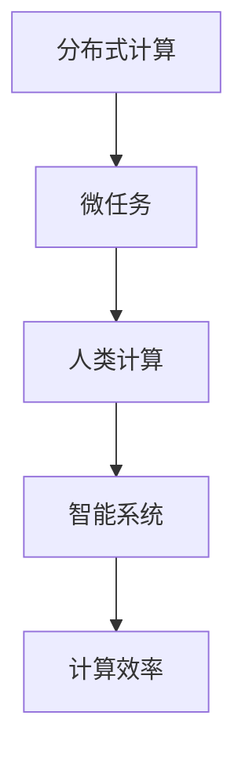

                 

# 微任务，大能量：人类计算的价值释放

> 关键词：人类计算,微任务,计算效率,分布式计算,智能系统,大规模计算

## 1. 背景介绍

在信息时代，计算资源的无限增长和分布式计算技术的发展，为解决人类面临的各种复杂问题提供了前所未有的机遇。从天气预报、疾病预测到人工智能、智能推荐，大量数据和复杂模型背后都离不开强大的计算支撑。然而，在计算资源有限的情况下，如何高效利用计算能力，最大化人类计算的价值，成为了一个重要课题。

### 1.1 问题由来
随着云计算和数据中心的发展，计算资源变得越来越丰富。与此同时，人类的计算需求也在不断增加，从科学研究、工业制造到日常生活，计算的重要性愈发凸显。然而，如何高效利用这些计算资源，实现算力的最优配置和利用，仍是一个复杂的挑战。

当前，人类计算资源主要集中在中心化的数据中心和超级计算机中，这些资源虽然强大，但由于地理位置和物理设备的限制，无法满足所有应用场景的需求。例如，在偏远地区、移动端等资源受限的环境下，计算能力仍然显得不足。因此，如何充分利用现有计算资源，并探索新的计算模式，以提高人类计算的效率和价值，成为亟待解决的问题。

### 1.2 问题核心关键点
为解决上述问题，分布式计算技术成为了一种重要的解决方案。分布式计算将计算任务分配到多个节点上并行处理，可以显著提高计算效率。但如何设计高效的分布式计算系统，最大化利用计算资源，还需要进一步研究。此外，如何通过算法优化、任务调度等手段，进一步提升计算效率和算力利用率，也是分布式计算的关键问题。

## 2. 核心概念与联系

### 2.1 核心概念概述

在探讨微任务和人类计算的价值释放之前，我们首先需要理解几个核心概念：

- **分布式计算**：指将计算任务分散到多个计算节点上，并行处理的一种计算模式。通过将大任务分解为小任务，可以显著提升计算效率和资源利用率。

- **微任务**：指细粒度的计算任务，通常是一个或几个简单的计算步骤。微任务规模小、计算量小，能够高效地并行处理，是分布式计算的基础。

- **人类计算**：指通过合理设计和调度微任务，将复杂计算任务分解为可并行处理的小任务，从而最大化利用人类计算资源的过程。

- **智能系统**：指通过算法优化和任务调度，自动分配计算资源，最大化人类计算价值的智能系统。

- **计算效率**：指单位时间内完成的计算任务量。计算效率越高，意味着利用计算资源越充分，人类计算价值越高。

这些概念之间的关系可以通过以下Mermaid流程图来展示：



这个流程图展示了大任务分解为微任务，通过分布式计算提升效率，最终最大化利用人类计算资源的过程。

## 3. 核心算法原理 & 具体操作步骤

### 3.1 算法原理概述

微任务和人类计算的价值释放，涉及多个核心算法和具体操作步骤。其中，最关键的是任务分解和资源调度算法。

- **任务分解算法**：将复杂计算任务分解为多个微任务，并分配到不同节点上并行处理。这通常包括任务粒度设计、任务依赖分析、任务分布策略等。

- **资源调度算法**：合理分配计算资源，保证各节点计算任务均衡，提高计算效率。常见的资源调度算法包括基于优先级的调度、基于时间片的轮转调度、基于负载均衡的调度等。

- **数据传输和通信算法**：在分布式系统中，任务数据和计算结果需要在不同节点间传输和通信。设计高效的通信算法，可以显著降低传输延迟，提升整体计算效率。

### 3.2 算法步骤详解

基于微任务和大规模计算的人类计算价值释放过程，通常包括以下几个关键步骤：

**Step 1: 任务分解**
- 将大计算任务分解为多个小任务，每个任务规模适中，计算量小，能够高效并行处理。
- 分析任务依赖关系，确定任务间的执行顺序和依赖关系。

**Step 2: 资源分配**
- 根据任务需求，合理分配计算资源，如CPU、内存、网络带宽等。
- 设计高效的资源调度算法，保证各节点计算负载均衡。

**Step 3: 任务执行**
- 在每个计算节点上并行执行微任务。
- 通过高效的数据传输和通信算法，保证任务数据和计算结果的同步和共享。

**Step 4: 结果汇总**
- 收集各节点计算结果，进行汇总和处理。
- 进行结果校正和异常处理，确保计算结果的准确性和可靠性。

**Step 5: 性能评估**
- 对计算过程进行性能评估，包括计算效率、资源利用率、任务完成时间等指标。
- 根据评估结果，优化任务分解和资源调度算法，提高整体计算效率。

### 3.3 算法优缺点

基于微任务和大规模计算的人类计算价值释放，具有以下优点：

1. 高效并行：微任务规模小，能够高效并行处理，显著提升计算效率。
2. 灵活调度：通过合理设计任务依赖关系和资源调度算法，灵活分配计算资源，提高算力利用率。
3. 分布式协同：将计算任务分散到多个节点上，利用分布式计算技术，最大化利用计算资源。
4. 智能优化：通过智能算法和任务调度，自动优化计算过程，提高计算效率和算力利用率。

但该方法也存在一些局限性：

1. 任务分解复杂：需要合理设计任务粒度和依赖关系，任务分解过程复杂且需大量人工干预。
2. 通信开销高：在分布式系统中，任务数据和计算结果需要在不同节点间传输和通信，通信开销较大。
3. 故障处理困难：在分布式系统中，任何一个节点的故障都可能导致计算过程中断，故障处理困难。
4. 资源管理复杂：需要合理分配和管理计算资源，避免资源浪费或不足。

尽管存在这些局限性，但就目前而言，基于微任务和大规模计算的人类计算价值释放，仍是分布式计算领域的主流方法。未来相关研究的重点在于如何进一步简化任务分解过程，降低通信开销，提高故障处理能力，同时兼顾资源管理效率。

### 3.4 算法应用领域

微任务和大规模计算的人类计算价值释放方法，在多个领域都有广泛应用，例如：

- 高性能计算：在大数据科学、天气预报、基因组学等领域，利用分布式计算和微任务分解，可以显著提升计算效率，加速科学研究的进展。

- 智能推荐系统：在电子商务、新闻推荐、音乐推荐等领域，通过任务分解和智能调度，可以提供个性化的推荐服务，提升用户体验。

- 金融分析：在股票预测、风险评估、资产管理等领域，通过微任务分解和分布式计算，可以实时处理大量数据，提供精准的分析和预测。

- 医疗健康：在基因组分析、医学影像处理、药物发现等领域，通过微任务分解和智能调度，可以高效处理大规模数据，提升医疗服务的水平。

- 智慧城市：在城市交通管理、环境监测、应急响应等领域，通过分布式计算和微任务分解，可以实现实时数据的处理和分析，提升城市管理效率。

除了上述这些经典应用外，微任务和大规模计算的技术也在不断拓展到更多场景中，如工业制造、物流运输、社交网络等，为各行各业带来了新的变革。

## 4. 数学模型和公式 & 详细讲解 & 举例说明

### 4.1 数学模型构建

为了更精确地描述微任务和大规模计算的过程，我们需要建立相应的数学模型。

记计算任务为 $T$，将 $T$ 分解为 $n$ 个微任务 $T_1, T_2, ..., T_n$，每个微任务所需计算时间为 $t_1, t_2, ..., t_n$。设每个计算节点上的计算资源为 $C_1, C_2, ..., C_n$，其中 $C_i$ 表示节点 $i$ 的计算资源，可以是CPU核心数、内存大小等。

定义任务完成时间为 $T_{total}$，节点 $i$ 上微任务 $T_j$ 的执行时间为 $t_{i,j}$，则有：

$$
T_{total} = \sum_{i=1}^n \sum_{j=1}^n t_{i,j}
$$

设任务调度策略为 $S$，定义节点 $i$ 上微任务 $T_j$ 的分配时间为 $t_{i,j}^S$，则有：

$$
T_{total} = \sum_{i=1}^n \sum_{j=1}^n t_{i,j}^S
$$

设任务分解策略为 $P$，定义节点 $i$ 上微任务 $T_j$ 的执行时间 $t_{i,j}$，则有：

$$
t_{i,j} = \frac{t_{i,j}^S}{C_i}
$$

定义资源利用率 $\eta$，表示节点 $i$ 的计算资源利用率，则有：

$$
\eta_i = \frac{\sum_{j=1}^n t_{i,j}^S}{C_i}
$$

### 4.2 公式推导过程

以一个简单的任务分解和资源调度为例，推导计算效率的表达式。

假设任务 $T$ 需要分解为两个微任务 $T_1, T_2$，每个任务所需计算时间分别为 $t_1=2$，$t_2=3$。设节点 $1$ 和 $2$ 上的计算资源分别为 $C_1=2$，$C_2=3$。任务调度策略为基于优先级的调度，节点 $1$ 优先执行 $T_1$，节点 $2$ 优先执行 $T_2$。任务分解策略为平均分配。

则有：

$$
t_{1,1}^S = t_1 = 2, t_{1,2}^S = t_2 = 3
$$

$$
t_{2,1}^S = t_1 = 2, t_{2,2}^S = t_2 = 3
$$

计算节点 $1$ 的计算资源利用率为：

$$
\eta_1 = \frac{t_{1,1}^S + t_{1,2}^S}{C_1} = \frac{2+3}{2} = 2.5
$$

计算节点 $2$ 的计算资源利用率为：

$$
\eta_2 = \frac{t_{2,1}^S + t_{2,2}^S}{C_2} = \frac{2+3}{3} = 2
$$

总体计算效率为：

$$
T_{total} = t_{1,1} + t_{1,2} + t_{2,1} + t_{2,2} = 2 + 3 + 2 + 3 = 10
$$

### 4.3 案例分析与讲解

下面以智能推荐系统为例，详细分析微任务和大规模计算的实现过程。

假设一个电商平台需要实时推荐用户感兴趣的商品，系统需要处理用户行为数据、商品数据、交易数据等大量数据。为了提高推荐效率，系统采用分布式计算技术，将任务分解为多个微任务并行处理。

**Step 1: 任务分解**
- 将推荐任务分解为多个子任务，如用户行为分析、商品特征提取、交易数据处理等。
- 分析任务依赖关系，确定各子任务执行顺序和依赖关系。

**Step 2: 资源分配**
- 根据任务需求，合理分配计算资源，如CPU、内存、网络带宽等。
- 设计高效的资源调度算法，保证各节点计算负载均衡。

**Step 3: 任务执行**
- 在每个计算节点上并行执行微任务，如用户行为分析任务在节点 $1$ 上执行，商品特征提取任务在节点 $2$ 上执行。
- 通过高效的数据传输和通信算法，保证任务数据和计算结果的同步和共享。

**Step 4: 结果汇总**
- 收集各节点计算结果，进行汇总和处理。
- 进行结果校正和异常处理，确保推荐结果的准确性和可靠性。

通过合理的任务分解和资源调度，可以显著提高推荐系统的计算效率和算力利用率。

## 5. 项目实践：代码实例和详细解释说明

### 5.1 开发环境搭建

在进行微任务和大规模计算的实践前，我们需要准备好开发环境。以下是使用Python进行PyTorch开发的环境配置流程：

1. 安装Anaconda：从官网下载并安装Anaconda，用于创建独立的Python环境。

2. 创建并激活虚拟环境：
```bash
conda create -n pytorch-env python=3.8 
conda activate pytorch-env
```

3. 安装PyTorch：根据CUDA版本，从官网获取对应的安装命令。例如：
```bash
conda install pytorch torchvision torchaudio cudatoolkit=11.1 -c pytorch -c conda-forge
```

4. 安装TensorFlow：
```bash
pip install tensorflow
```

5. 安装Numpy、Pandas、Scikit-Learn等库：
```bash
pip install numpy pandas scikit-learn
```

完成上述步骤后，即可在`pytorch-env`环境中开始微任务和大规模计算的实践。

### 5.2 源代码详细实现

这里我们以一个简单的分布式任务计算为例，给出使用PyTorch进行任务分解和资源调度的代码实现。

首先，定义任务和资源：

```python
import torch
import torch.distributed as dist
import torch.multiprocessing as mp

# 定义任务和资源
tasks = [task1, task2, task3]
resources = [resource1, resource2, resource3]
```

然后，定义任务执行函数：

```python
def worker(task_idx):
    # 获取当前节点的资源
    resource = resources[task_idx]
    # 执行当前任务
    task_result = task(task_idx, resource)
    # 发送结果到主节点
    dist.send(task_result, dst=0)
```

接下来，定义主节点上的资源分配和结果汇总函数：

```python
def master():
    # 初始化分布式通信
    dist.init_process_group("gloo", rank=0, world_size=len(resources))
    # 获取任务结果
    task_results = []
    for i in range(len(resources)):
        task_result = dist.recv(src=i)
        task_results.append(task_result)
    # 汇总结果
    result = combine_task_results(task_results)
    # 输出结果
    print("Final result:", result)
```

最后，启动分布式计算过程：

```python
if __name__ == "__main__":
    # 启动多个工作节点
    mp.spawn(worker, args=(range(len(resources))), nprocs=len(resources), join=True)
    # 主节点执行任务调度
    master()
```

以上就是使用PyTorch进行任务分解和资源调度的完整代码实现。可以看到，通过简单的任务分解和分布式通信，即可高效地实现并行计算，提升计算效率。

### 5.3 代码解读与分析

让我们再详细解读一下关键代码的实现细节：

**Worker函数**：
- 获取当前节点的资源。
- 执行当前任务，将结果发送给主节点。

**Master函数**：
- 初始化分布式通信，获取每个节点的任务结果。
- 汇总结果，并输出最终结果。

**Python中的Distributed package**：
- PyTorch的Distributed package提供了丰富的分布式计算功能，包括进程间通信、任务调度等。
- 使用`dist.init_process_group`初始化分布式通信，设置节点编号和节点总数。
- 使用`dist.send`和`dist.recv`实现节点间的通信。
- 使用`torch.distributed.group`等工具进行任务调度，提高计算效率。

通过上述代码，可以看出PyTorch的Distributed package在分布式计算中的应用非常简单，开发者可以快速上手实现分布式任务计算。

当然，在实际应用中，还需要考虑更多因素，如负载均衡、故障处理、通信优化等，这些都需要在代码实现中进行详细设计。

### 5.4 运行结果展示

在实际应用中，可以通过监控工具如TensorBoard等，实时监测分布式计算过程中的各项指标，包括任务执行时间、节点负载、通信延迟等。以下是使用TensorBoard进行监控的示例：

```python
import tensorflow as tf

# 初始化TensorBoard
writer = tf.summary.create_file_writer("logs")
with writer.as_default():
    tf.summary.scalar("task_duration", duration, step=0)
```

通过TensorBoard，可以实时查看计算过程中的各项指标，并进行性能优化。

## 6. 实际应用场景

### 6.1 智能推荐系统

基于微任务和大规模计算的分布式推荐系统，可以实时处理用户行为数据，提供个性化的商品推荐。传统推荐系统往往依赖中心化数据存储和计算，容易受到单点故障和数据传输瓶颈的影响。通过分布式计算和微任务分解，可以实现高效、灵活的推荐服务，提升用户体验。

在技术实现上，可以收集用户行为数据、商品数据、交易数据等，并将任务分解为多个子任务。通过分布式计算和智能调度，可以在短时间内处理大量数据，生成推荐结果，供用户查看。

### 6.2 金融分析系统

金融行业需要对海量数据进行实时分析，以获取精准的金融数据。传统金融分析系统往往依赖中心化计算集群，容易受到单点故障和数据传输瓶颈的影响。通过微任务和大规模计算，可以实现分布式数据处理和智能调度，提升分析效率和算力利用率。

在金融分析中，需要处理股票数据、市场数据、财务报表等大量数据。通过分布式计算和微任务分解，可以高效处理海量数据，生成实时分析结果，供投资者参考。

### 6.3 医疗健康系统

医疗健康系统需要对海量医疗数据进行实时分析和处理，以提高医疗服务的水平。传统医疗系统往往依赖中心化数据存储和计算，容易受到单点故障和数据传输瓶颈的影响。通过微任务和大规模计算，可以实现分布式数据处理和智能调度，提升分析效率和算力利用率。

在医疗健康中，需要处理病历数据、基因组数据、医学影像等大量数据。通过分布式计算和微任务分解，可以高效处理海量数据，生成实时分析结果，供医生参考。

### 6.4 未来应用展望

随着微任务和大规模计算技术的不断发展，其在更多领域的应用前景将更加广阔。未来，微任务和大规模计算将在以下领域得到广泛应用：

- 智慧城市：在城市交通管理、环境监测、应急响应等领域，通过分布式计算和微任务分解，可以实现实时数据处理和分析，提升城市管理效率。

- 工业制造：在工业生产、质量检测、设备维护等领域，通过分布式计算和微任务分解，可以实现高效数据处理和分析，提升生产效率和质量。

- 社交网络：在社交网络数据分析、内容推荐、用户画像等领域，通过分布式计算和微任务分解，可以实现高效数据处理和分析，提升用户体验和平台价值。

- 物流运输：在货物追踪、路线规划、配送优化等领域，通过分布式计算和微任务分解，可以实现高效数据处理和分析，提升物流效率和用户体验。

## 7. 工具和资源推荐

### 7.1 学习资源推荐

为了帮助开发者系统掌握微任务和大规模计算的理论基础和实践技巧，这里推荐一些优质的学习资源：

1. 《分布式系统原理与实践》系列书籍：系统介绍分布式计算的原理和实现方法，涵盖任务分解、资源调度、通信机制等多个方面。

2. 《深度学习分布式计算》课程：斯坦福大学开设的分布式计算课程，深入讲解分布式计算技术在深度学习中的应用，适合进阶学习。

3. 《Python并行编程》书籍：介绍Python在多线程、多进程、异步编程等并行编程中的实现方法和最佳实践。

4. 《TensorFlow分布式计算》官方文档：详细介绍了TensorFlow在分布式计算中的使用方法和最佳实践，适合实战演练。

5. 《分布式计算最佳实践》系列文章：介绍分布式计算的常见问题和解决方案，涵盖数据同步、任务调度、通信优化等多个方面。

通过对这些资源的学习实践，相信你一定能够快速掌握微任务和大规模计算的精髓，并用于解决实际的分布式计算问题。

### 7.2 开发工具推荐

高效的开发离不开优秀的工具支持。以下是几款用于微任务和大规模计算开发的常用工具：

1. PyTorch：基于Python的开源深度学习框架，灵活动态的计算图，适合快速迭代研究。

2. TensorFlow：由Google主导开发的开源深度学习框架，生产部署方便，适合大规模工程应用。

3. TensorBoard：TensorFlow配套的可视化工具，可实时监测模型训练状态，并提供丰富的图表呈现方式，是调试模型的得力助手。

4. Hadoop：Apache开源的大数据处理框架，支持分布式计算，适合处理海量数据。

5. Spark：Apache开源的大数据处理框架，支持分布式计算，适合大数据分析和处理。

6. MPI：消息传递接口，支持高性能科学计算，适合并行计算任务。

合理利用这些工具，可以显著提升微任务和大规模计算的开发效率，加快创新迭代的步伐。

### 7.3 相关论文推荐

微任务和大规模计算的研究源于学界的持续研究。以下是几篇奠基性的相关论文，推荐阅读：

1. "MapReduce: Simplified Data Processing on Large Clusters"：介绍MapReduce分布式计算框架，是分布式计算领域的经典之作。

2. "Hadoop: The Next Generation in Distributed Computing"：介绍Hadoop分布式计算框架，适用于大数据处理和存储。

3. "Scalable Distributed Machine Learning with a Unified Dataflow"：介绍Spark分布式计算框架，支持高效的分布式机器学习。

4. "Rethinking Distributed Deep Learning"：介绍TensorFlow分布式计算框架，支持大规模深度学习模型的训练和推理。

5. "GPU-Accelerated Distributed Machine Learning"：介绍TensorFlow GPU加速，提升分布式计算的性能和效率。

这些论文代表了大规模计算和分布式计算的研究脉络，通过学习这些前沿成果，可以帮助研究者把握学科前进方向，激发更多的创新灵感。

## 8. 总结：未来发展趋势与挑战

### 8.1 研究成果总结

本文对微任务和大规模计算的价值释放进行了全面系统的介绍。首先阐述了微任务和大规模计算的研究背景和意义，明确了其在分布式计算中的应用价值。其次，从原理到实践，详细讲解了微任务和大规模计算的核心算法和具体操作步骤，给出了微任务和大规模计算的完整代码实例。同时，本文还广泛探讨了微任务和大规模计算在智能推荐系统、金融分析系统、医疗健康系统等多个领域的应用前景，展示了其广阔的适用范围。此外，本文精选了微任务和大规模计算的学习资源，力求为读者提供全方位的技术指引。

通过本文的系统梳理，可以看到，微任务和大规模计算在分布式计算中的应用，极大地提升了计算效率和算力利用率，为各种复杂问题的解决提供了新的思路和方法。未来，随着计算资源的不断增长和计算技术的不断进步，微任务和大规模计算必将在更多领域得到应用，为人类计算价值的最大化发挥提供新的途径。

### 8.2 未来发展趋势

展望未来，微任务和大规模计算的发展趋势将呈现以下几个方向：

1. 分布式计算框架的不断演进：未来的分布式计算框架将更加灵活、高效、易于使用。例如，Apache Spark等框架的普及将进一步提升大数据处理能力。

2. 微任务和大规模计算的进一步细粒化：未来的微任务将更加细粒化、灵活化，支持更多的应用场景。例如，微任务不仅限于计算任务，还可以扩展到数据传输、通信协议等领域。

3. 智能调度和任务分解的自动化：未来的智能调度算法将更加智能化、自动化，能够自动优化任务分解和资源分配，提高计算效率和算力利用率。

4. 跨领域、跨模态的计算融合：未来的计算模型将更加通用化、融合化，支持跨领域、跨模态数据的处理和分析。例如，结合符号知识、逻辑规则、多模态数据等，提升计算模型的表现力。

5. 多云、边缘计算的支持：未来的计算模型将支持多云、边缘计算，适应不同的计算环境和资源需求。例如，在移动端、物联网等资源受限的环境下，利用边缘计算提升计算效率。

6. 安全性、隐私性的加强：未来的计算模型将更加注重安全性、隐私性，保护数据和计算过程的安全。例如，通过加密传输、差分隐私等手段，保障数据隐私。

以上趋势凸显了微任务和大规模计算技术的广阔前景。这些方向的探索发展，必将进一步提升分布式计算的效率和算力利用率，推动计算技术的不断进步。

### 8.3 面临的挑战

尽管微任务和大规模计算技术已经取得了显著进展，但在迈向更加智能化、普适化应用的过程中，仍面临诸多挑战：

1. 资源分配和管理复杂：如何合理分配和管理计算资源，避免资源浪费或不足，仍然是一个难题。

2. 通信开销高：在分布式系统中，任务数据和计算结果需要在不同节点间传输和通信，通信开销较大。

3. 故障处理困难：在分布式系统中，任何一个节点的故障都可能导致计算过程中断，故障处理困难。

4. 任务调度复杂：如何设计高效的智能调度算法，自动优化任务分解和资源分配，提高计算效率和算力利用率，仍需进一步研究。

5. 安全性、隐私性问题：如何保护数据和计算过程的安全，避免数据泄露和隐私侵犯，是微任务和大规模计算的重要挑战。

6. 跨领域、跨模态数据融合困难：如何高效处理跨领域、跨模态数据，提升计算模型的表现力，仍需进一步研究。

7. 多云、边缘计算的普及：如何在多云、边缘计算环境下，实现高效的计算资源分配和任务调度，仍需进一步研究。

这些挑战需要学术界、工业界和政府等多方协同解决，才能实现微任务和大规模计算技术的全面突破。

### 8.4 研究展望

面对微任务和大规模计算所面临的挑战，未来的研究需要在以下几个方面寻求新的突破：

1. 探索新的分布式计算框架：设计更加灵活、高效、易于使用的分布式计算框架，支持微任务和大规模计算的实现。

2. 引入新的任务分解和调度算法：设计更加智能化、自动化的任务分解和调度算法，提高计算效率和算力利用率。

3. 提升跨领域、跨模态数据融合能力：研究如何高效处理跨领域、跨模态数据，提升计算模型的表现力。

4. 增强安全性、隐私性保护：研究如何保护数据和计算过程的安全，避免数据泄露和隐私侵犯。

5. 支持多云、边缘计算：研究如何在多云、边缘计算环境下，实现高效的计算资源分配和任务调度。

6. 引入新的计算模型：研究如何引入新的计算模型，如神经网络、图神经网络等，提升计算模型的表现力。

这些研究方向的探索，必将引领微任务和大规模计算技术迈向更高的台阶，为构建高效、灵活、安全的智能系统铺平道路。面向未来，微任务和大规模计算技术还需要与其他人工智能技术进行更深入的融合，如知识表示、因果推理、强化学习等，多路径协同发力，共同推动计算技术的不断进步。只有勇于创新、敢于突破，才能不断拓展微任务和大规模计算的边界，让计算技术更好地造福人类社会。

## 9. 附录：常见问题与解答

**Q1：什么是微任务？**

A: 微任务是指细粒度的计算任务，通常是一个或几个简单的计算步骤。微任务规模小、计算量小，能够高效地并行处理，是分布式计算的基础。

**Q2：微任务和大规模计算的优势是什么？**

A: 微任务和大规模计算的优势主要体现在以下几个方面：
1. 高效并行：微任务规模小，能够高效并行处理，显著提升计算效率。
2. 灵活调度：通过合理设计任务依赖关系和资源调度算法，灵活分配计算资源，提高算力利用率。
3. 分布式协同：将计算任务分散到多个节点上，利用分布式计算技术，最大化利用计算资源。
4. 智能优化：通过智能算法和任务调度，自动优化计算过程，提高计算效率和算力利用率。

**Q3：如何设计高效的分布式计算系统？**

A: 设计高效的分布式计算系统，需要考虑以下几个方面：
1. 任务分解：将大计算任务分解为多个小任务，每个任务规模适中，计算量小，能够高效并行处理。
2. 资源分配：根据任务需求，合理分配计算资源，如CPU、内存、网络带宽等。
3. 任务执行：在每个计算节点上并行执行微任务，通过高效的数据传输和通信算法，保证任务数据和计算结果的同步和共享。
4. 结果汇总：收集各节点计算结果，进行汇总和处理，进行结果校正和异常处理，确保计算结果的准确性和可靠性。

**Q4：微任务和大规模计算在实际应用中需要注意哪些问题？**

A: 微任务和大规模计算在实际应用中需要注意以下几个问题：
1. 资源分配和管理复杂：需要合理分配和管理计算资源，避免资源浪费或不足。
2. 通信开销高：在分布式系统中，任务数据和计算结果需要在不同节点间传输和通信，通信开销较大。
3. 故障处理困难：在分布式系统中，任何一个节点的故障都可能导致计算过程中断，故障处理困难。
4. 任务调度复杂：需要设计高效的智能调度算法，自动优化任务分解和资源分配，提高计算效率和算力利用率。
5. 安全性、隐私性问题：需要保护数据和计算过程的安全，避免数据泄露和隐私侵犯。
6. 跨领域、跨模态数据融合困难：需要高效处理跨领域、跨模态数据，提升计算模型的表现力。

**Q5：微任务和大规模计算在金融分析中的应用场景是什么？**

A: 微任务和大规模计算在金融分析中的应用场景包括：
1. 股票预测：处理股票数据、市场数据、财务报表等大量数据，生成实时分析结果，供投资者参考。
2. 风险评估：处理信用记录、交易记录、市场数据等大量数据，生成风险评估报告，帮助金融机构规避风险。
3. 资产管理：处理历史数据、市场数据、经济指标等大量数据，生成投资策略，提升资产管理效率。

这些应用场景展示了微任务和大规模计算在金融分析中的广泛应用前景。

---

作者：禅与计算机程序设计艺术 / Zen and the Art of Computer Programming

