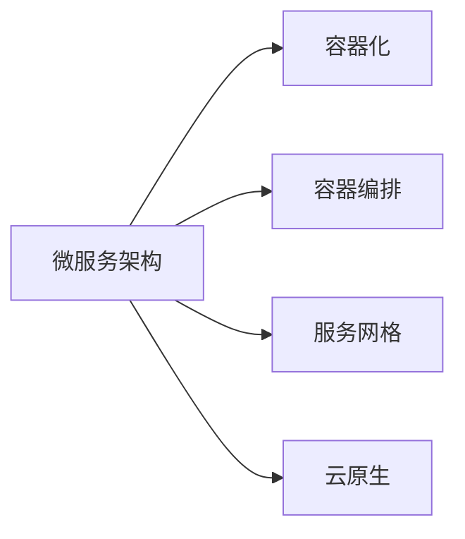

                 

# 微服务架构在高扩展性中的应用

> 关键词：微服务架构, 高扩展性, 分布式系统, 云原生, 容器化, 服务网格, 数据一致性

## 1. 背景介绍

随着互联网应用的不断增长，单个系统的复杂性和规模已经大大超过传统的单体架构所能承载的极限。单体架构的固有缺陷，如维护困难、部署缓慢、扩展性差等，导致许多大型应用逐渐转向微服务架构。微服务架构通过将大型应用拆分为多个独立、自治的微服务，实现了高内聚、低耦合的分布式系统，适应了现代互联网应用的复杂性和多样性。

微服务架构的成功应用，使得各大企业能够更灵活地迭代产品功能，提升系统稳定性和可用性，快速响应市场变化。然而，微服务架构本身也面临诸多挑战，如服务间的通信、数据一致性、部署复杂性等。为了克服这些挑战，本文将探讨微服务架构的高扩展性实现，详细介绍其在分布式系统中的应用和优化策略。

## 2. 核心概念与联系

### 2.1 核心概念概述

为了更好地理解微服务架构，我们需要了解几个核心概念及其之间的联系：

- **微服务架构(Microservices Architecture)**：将大型应用拆分为多个独立、自治的微服务，每个微服务负责独立业务逻辑，可以独立部署、扩展和维护。

- **容器化(Containerization)**：通过Docker等容器技术，将微服务及其依赖打包为独立、可移植的容器，方便管理和部署。

- **容器编排(Container Orchestration)**：使用Kubernetes等工具对容器进行自动化管理，实现服务部署、负载均衡、自动扩缩容等功能。

- **服务网格(Service Mesh)**：使用Istio、Linkerd等工具，为微服务架构提供统一的通信、流量控制、安全性等功能。

- **云原生(Cloud Native)**：指将微服务、容器、服务网格等技术结合云平台，实现高可用、高扩展性的分布式系统。

这些核心概念通过合作为微服务架构提供高扩展性的解决方案，帮助企业应对复杂的分布式系统挑战。

### 2.2 核心概念原理和架构的 Mermaid 流程图(Mermaid 流程节点中不要有括号、逗号等特殊字符)



## 3. 核心算法原理 & 具体操作步骤

### 3.1 算法原理概述

微服务架构的核心思想是将应用拆分为多个服务，每个服务独立运行，通过网络通信协同工作。高扩展性是微服务架构追求的重要目标之一，其关键在于如何灵活、高效地应对不断增长的负载和复杂的应用场景。

算法原理主要包括以下几个方面：

- **服务拆分**：根据业务逻辑和数据访问需求，将应用拆分为多个微服务，每个微服务独立开发、部署和维护。
- **容器化**：使用Docker等容器技术，将微服务及其依赖打包为独立、可移植的容器，方便管理和部署。
- **服务注册与发现**：使用Consul、Eureka等工具，实现服务注册和发现，动态管理服务实例和负载均衡。
- **服务通信**：通过HTTP、gRPC等协议，实现微服务之间的通信和数据交换。
- **负载均衡**：使用Nginx、HAProxy等工具，实现服务流量分配和负载均衡，避免单点故障。
- **自动扩缩容**：使用Kubernetes等容器编排工具，动态管理服务实例，根据负载自动扩展或缩减资源。
- **数据一致性**：使用数据库事务、分布式锁等技术，保证跨服务的数据一致性和原子性。

### 3.2 算法步骤详解

微服务架构的实现步骤通常包括以下几个关键环节：

1. **需求分析**：明确应用需求和业务逻辑，确定微服务的划分边界。

2. **服务设计**：设计每个微服务的接口、数据模型和业务逻辑，确保服务的独立性和自治性。

3. **服务开发**：使用Spring Boot、Node.js等框架开发微服务，并使用Docker打包为容器。

4. **服务注册与发现**：将微服务注册到Consul、Eureka等服务注册中心，动态管理服务实例。

5. **服务通信**：使用HTTP、gRPC等协议，实现微服务之间的通信和数据交换。

6. **负载均衡**：配置Nginx、HAProxy等负载均衡器，实现服务流量分配和负载均衡。

7. **自动扩缩容**：使用Kubernetes等容器编排工具，根据负载动态管理服务实例，实现自动扩缩容。

8. **数据一致性**：设计分布式事务、分布式锁等机制，保证跨服务的数据一致性和原子性。

### 3.3 算法优缺点

微服务架构的优点包括：

- **高扩展性**：通过水平扩展微服务实例，可以有效应对不断增长的负载。
- **高可用性**：通过服务拆分和负载均衡，避免单点故障，提升系统可用性。
- **独立部署**：每个微服务可以独立开发、部署和维护，加快迭代速度。
- **灵活架构**：根据业务变化，灵活调整微服务边界，适应新的需求。

同时，微服务架构也存在一些缺点：

- **复杂性增加**：微服务架构引入了服务间通信、分布式事务等复杂问题，增加了系统复杂度。
- **管理难度提高**：微服务数量增加，服务间通信和数据一致性等问题使得系统管理难度提升。
- **资源消耗增加**：微服务架构需要部署多个服务实例，增加了计算资源和网络带宽的消耗。

### 3.4 算法应用领域

微服务架构的高扩展性已经在诸多领域得到广泛应用，包括：

- **电商系统**：如Amazon、阿里巴巴等电商企业，使用微服务架构实现商品管理、订单处理、用户认证等模块独立开发和部署。

- **金融系统**：如银行、证券等金融领域，使用微服务架构实现交易处理、风险控制、用户管理等模块的独立运行。

- **社交媒体**：如Facebook、Twitter等社交平台，使用微服务架构实现消息推送、用户互动、内容管理等功能。

- **物联网**：如IoT平台，使用微服务架构实现设备管理、数据处理、应用集成等功能。

## 4. 数学模型和公式 & 详细讲解 & 举例说明（备注：数学公式请使用latex格式，latex嵌入文中独立段落使用 $$，段落内使用 $)
### 4.1 数学模型构建

微服务架构的实现依赖于分布式系统理论，以下是微服务架构数学模型的构建过程：

- **服务负载均衡模型**：假设服务 $S_i$ 的请求数量为 $L_i$，每个请求需要的计算资源为 $C_i$，则服务 $S_i$ 的负载 $W_i$ 可以表示为 $W_i = L_i \times C_i$。

- **系统负载均衡模型**：假设系统中共有 $N$ 个服务，每个服务的负载均衡因子为 $W_i$，则系统的总负载 $W$ 可以表示为 $W = \sum_{i=1}^N W_i$。

- **自动扩缩容模型**：假设当前系统负载为 $W$，最大可扩展到 $W_{max}$，最小可缩减到 $W_{min}$，则当前系统中的服务实例数量 $M$ 可以通过以下公式计算：

$$
M = \frac{W}{W_{max}} \times M_{max} + \frac{W_{min} - W}{W_{max} - W_{min}} \times M_{min}
$$

其中 $M_{max}$ 和 $M_{min}$ 分别表示系统的最大和最小服务实例数量。

### 4.2 公式推导过程

服务负载均衡模型的推导过程如下：

假设服务 $S_i$ 的请求数量为 $L_i$，每个请求需要的计算资源为 $C_i$，则服务 $S_i$ 的负载 $W_i$ 可以表示为：

$$
W_i = L_i \times C_i
$$

系统负载均衡模型的推导过程如下：

假设系统中共有 $N$ 个服务，每个服务的负载均衡因子为 $W_i$，则系统的总负载 $W$ 可以表示为：

$$
W = \sum_{i=1}^N W_i = \sum_{i=1}^N L_i \times C_i
$$

自动扩缩容模型的推导过程如下：

假设当前系统负载为 $W$，最大可扩展到 $W_{max}$，最小可缩减到 $W_{min}$，则当前系统中的服务实例数量 $M$ 可以通过以下公式计算：

$$
M = \frac{W}{W_{max}} \times M_{max} + \frac{W_{min} - W}{W_{max} - W_{min}} \times M_{min}
$$

其中 $M_{max}$ 和 $M_{min}$ 分别表示系统的最大和最小服务实例数量。

### 4.3 案例分析与讲解

以电商系统的微服务架构为例，对上述数学模型进行详细讲解：

- **服务负载均衡模型**：假设电商系统中的商品管理服务（S1）每天接收 1000 个请求，每个请求需要 0.1 秒的计算资源，则服务 S1 的负载为 $W_1 = 1000 \times 0.1 = 100$。

- **系统负载均衡模型**：假设电商系统中共有 3 个服务，分别为商品管理服务（S1）、订单处理服务（S2）和用户认证服务（S3），每个服务的负载分别为 $W_1 = 100$、$W_2 = 150$、$W_3 = 50$，则系统的总负载为 $W = 100 + 150 + 50 = 300$。

- **自动扩缩容模型**：假设电商系统的最大可扩展到 5000 个请求，最小可缩减到 1000 个请求，当前系统负载为 2000，则当前系统中的服务实例数量为 $M = \frac{2000}{5000} \times 100 + \frac{1000 - 2000}{5000 - 2000} \times 10 = 20$。

## 5. 项目实践：代码实例和详细解释说明

### 5.1 开发环境搭建

在进行微服务架构开发前，我们需要准备好开发环境。以下是使用Spring Boot和Docker搭建微服务架构的步骤：

1. 安装Java JDK 11及以上版本。

2. 安装Maven开发环境。

3. 创建Spring Boot项目。

4. 编写微服务代码，并打包为JAR包。

5. 编写Dockerfile文件，将微服务打包为Docker镜像。

6. 运行Docker容器，启动微服务实例。

7. 配置Nginx或HAProxy，实现服务负载均衡。

8. 配置Kubernetes，实现服务自动扩缩容。

### 5.2 源代码详细实现

以下是一个简单的Spring Boot微服务代码实现：

```java
import org.springframework.boot.SpringApplication;
import org.springframework.boot.autoconfigure.SpringBootApplication;

@SpringBootApplication
public class MicroserviceApplication {
    public static void main(String[] args) {
        SpringApplication.run(MicroserviceApplication.class, args);
    }
}
```

### 5.3 代码解读与分析

微服务架构的实现关键在于代码设计和容器化管理。以下是代码实现的详细解读：

**Spring Boot微服务代码**：
- `@SpringBootApplication`注解：将Spring Boot应用标记为启动类。
- `main`方法：Spring Boot的启动入口，通过SpringApplication.run方法启动应用。

**Dockerfile代码**：
```dockerfile
FROM openjdk:11
ADD target/microservice.jar /app.jar
EXPOSE 8080
ENTRYPOINT ["java", "-jar", "/app.jar"]
```

**Docker容器启动脚本**：
```bash
docker run -d -p 8080:8080 my-microservice:latest
```

**Nginx配置文件**：
```nginx
upstream my-microservice {
    server microservice1:8080;
    server microservice2:8080;
}

server {
    listen 80;
    server_name my-microservice;
    location / {
        proxy_pass http://my-microservice;
        proxy_set_header Host $host;
        proxy_set_header X-Real-IP $remote_addr;
        proxy_set_header X-Forwarded-For $proxy_add_x_forwarded_for;
        proxy_set_header X-Forwarded-Proto $scheme;
        proxy_set_header X-Forwarded-Server $host;
        proxy_set_header X-Forwarded-Host $host;
        proxy_set_header X-Forwarded-Port $server_port;
    }
}
```

**Kubernetes配置文件**：
```yaml
apiVersion: v1
apiVersion: v1
kind: Pod
metadata:
  name: microservice
spec:
  containers:
  - name: microservice
    image: my-microservice:latest
    ports:
    - containerPort: 8080
```

**Kubernetes启动脚本**：
```bash
kubectl apply -f microservice.yaml
```

### 5.4 运行结果展示

启动微服务实例，访问http://localhost:8080，可以查看微服务是否正常运行。

## 6. 实际应用场景

### 6.1 电商系统

电商系统是一个典型的微服务架构应用场景。电商系统需要处理复杂的订单、库存、用户管理等业务逻辑，涉及多个微服务协同工作。通过将电商系统拆分为商品管理、订单处理、用户认证等微服务，每个微服务独立开发、部署和维护，提升了系统的灵活性和可扩展性。

例如，商品管理微服务可以使用Spring Boot和MySQL数据库，负责商品信息的管理和查询；订单处理微服务可以使用Spring Boot和Redis数据库，负责订单的处理和存储；用户认证微服务可以使用Spring Boot和JWT机制，负责用户的身份验证和授权。通过微服务架构，电商系统能够更灵活地扩展和更新，提升用户体验和服务质量。

### 6.2 金融系统

金融系统是另一个典型的微服务架构应用场景。金融系统需要处理大量的交易、风险控制、用户管理等业务逻辑，涉及多个微服务协同工作。通过将金融系统拆分为交易处理、风险控制、用户管理等微服务，每个微服务独立开发、部署和维护，提升了系统的灵活性和可扩展性。

例如，交易处理微服务可以使用Spring Boot和MySQL数据库，负责交易的记录和处理；风险控制微服务可以使用Spring Boot和Redis数据库，负责风险的监控和控制；用户管理微服务可以使用Spring Boot和JWT机制，负责用户的身份验证和授权。通过微服务架构，金融系统能够更灵活地扩展和更新，提升系统的稳定性和安全性。

## 7. 工具和资源推荐

### 7.1 学习资源推荐

为了帮助开发者系统掌握微服务架构的理论基础和实践技巧，这里推荐一些优质的学习资源：

1. Spring Cloud微服务教程：由Spring官方提供的微服务架构教程，涵盖Spring Cloud的各个模块和实践案例。

2. Docker官方文档：Docker官方提供的Docker容器化教程，涵盖Docker的安装、使用和管理。

3. Kubernetes官方文档：Kubernetes官方提供的容器编排教程，涵盖Kubernetes的安装、使用和管理。

4. Netflix《Microservices in Production》博客：Netflix分享的大规模微服务架构实践经验，涵盖了微服务设计、部署、管理等多个方面。

5. Docker Swarm教程：Docker Swarm官方提供的微服务架构教程，涵盖微服务的设计和部署。

6. Kubernetes StatefulSet教程：Kubernetes StatefulSet官方提供的微服务架构教程，涵盖微服务的稳定性和持久化。

通过对这些资源的学习实践，相信你一定能够快速掌握微服务架构的理论基础和实践技巧，并用于解决实际的业务问题。

### 7.2 开发工具推荐

高效的微服务架构开发离不开优秀的工具支持。以下是几款用于微服务架构开发的常用工具：

1. Spring Boot：由Spring官方提供的微服务框架，支持Java语言的快速开发和部署。

2. Docker：由Docker公司提供的容器化技术，支持跨平台的应用部署和管理。

3. Kubernetes：由谷歌公司提供的容器编排工具，支持大规模的微服务集群管理。

4. Nginx：由IETF组织开发的Web服务器和反向代理软件，支持高并发的应用部署。

5. HAProxy：由NGINX公司开发的负载均衡器，支持高可用和高并发的应用部署。

6. Consul：由Hashicorp公司开发的分布式服务发现和配置工具，支持微服务的注册和发现。

7. Eureka：由Netflix公司开发的分布式服务注册和发现工具，支持微服务的注册和发现。

合理利用这些工具，可以显著提升微服务架构的开发效率，加快创新迭代的步伐。

### 7.3 相关论文推荐

微服务架构的研究源于学界的持续研究。以下是几篇奠基性的相关论文，推荐阅读：

1. "Building Microservices for Cloud-Native Applications"（P. Debruijn等，2017年）：提出微服务架构的基本概念和设计原则，成为微服务架构的奠基之作。

2. "Microservices: A Tutorial"（G. Smith等，2015年）：提供微服务架构的入门教程，涵盖微服务的概念、设计和实践。

3. "Designing and Building Microservices"（A. Goldsawdy等，2018年）：介绍微服务架构的设计和构建过程，涵盖微服务的编排、调度和管理。

4. "Microservices Patterns"（S. Bashter等，2019年）：提出微服务架构的常见模式和最佳实践，涵盖微服务的划分、管理和优化。

5. "The Microservices Charter"（P. Debruijn等，2015年）：制定微服务架构的标准和规范，成为微服务架构的指导性文件。

这些论文代表了大规模微服务架构的研究进展，通过学习这些前沿成果，可以帮助研究者把握学科前进方向，激发更多的创新灵感。

## 8. 总结：未来发展趋势与挑战

### 8.1 总结

本文对微服务架构的高扩展性实现进行了全面系统的介绍。首先阐述了微服务架构的背景和应用价值，明确了高扩展性在微服务架构中的重要地位。其次，从原理到实践，详细讲解了微服务架构的实现步骤和关键技术，提供了微服务架构的完整代码实例。同时，本文还探讨了微服务架构在高扩展性方面的应用场景，展示了其在电商系统、金融系统等领域的广泛应用。

通过本文的系统梳理，可以看到，微服务架构的高扩展性已经得到了广泛应用，成为现代分布式系统的重要范式。微服务架构通过拆分服务、容器化管理、服务网格等技术，提升了系统的灵活性和可扩展性，帮助企业应对复杂的分布式系统挑战。未来，伴随微服务架构的不断演进，相信其将进一步提升系统的稳定性和可用性，实现更高效的分布式系统部署和管理。

### 8.2 未来发展趋势

展望未来，微服务架构的高扩展性将继续发展，主要体现在以下几个方面：

1. **容器化管理**：容器化技术的成熟和普及，将进一步提升微服务架构的灵活性和可扩展性。Docker、Kubernetes等容器化工具将继续发展和完善，为微服务架构提供更高效的管理和调度。

2. **服务网格**：服务网格技术的进步，将进一步提升微服务架构的通信和治理能力。Istio、Linkerd等服务网格工具将继续发展，为微服务架构提供更完善的流量控制、安全性等功能。

3. **自动化运维**：自动化运维工具的涌现，将进一步提升微服务架构的运营效率。Spotify、Netflix等企业将继续推动自动化运维工具的发展，为微服务架构提供更高效的管理和监控。

4. **云原生**：云原生技术的进步，将进一步提升微服务架构的可靠性和性能。云原生技术包括微服务、容器、服务网格等，将为微服务架构提供更强大的支持。

5. **智能化管理**：微服务架构的智能化管理将成为未来趋势。通过引入机器学习、人工智能等技术，提升微服务架构的自我管理和优化能力。

6. **多云管理**：多云管理技术的进步，将进一步提升微服务架构的灵活性和可靠性。微服务架构需要在不同云平台之间无缝切换，多云管理技术将为微服务架构提供更高效的支持。

以上趋势凸显了微服务架构的高扩展性具有广阔的前景。这些方向的探索发展，必将进一步提升微服务架构的性能和应用范围，为构建人机协同的智能系统铺平道路。

### 8.3 面临的挑战

尽管微服务架构的高扩展性已经取得了瞩目成就，但在迈向更加智能化、普适化应用的过程中，它仍面临诸多挑战：

1. **服务间通信**：微服务架构的服务间通信复杂，需要考虑网络延迟、通信协议、数据一致性等问题，增加了系统的复杂度。

2. **数据一致性**：微服务架构中的数据一致性问题难以解决，跨服务的数据访问和更新需要复杂的协调和同步机制。

3. **部署管理**：微服务架构的部署和管理复杂，需要协调多个服务的部署和更新，增加了系统的维护难度。

4. **资源消耗**：微服务架构需要部署多个服务实例，增加了计算资源和网络带宽的消耗，导致系统成本增加。

5. **安全性**：微服务架构的安全性难以保证，需要考虑服务的认证、授权、加密等问题，增加了系统的复杂度。

6. **监控告警**：微服务架构的监控告警复杂，需要实时采集系统的各项指标，设置异常告警阈值，确保系统稳定。

7. **可扩展性**：微服务架构的可扩展性虽然提升了系统的灵活性，但也带来了系统的复杂度和运维成本的增加。

8. **故障处理**：微服务架构的故障处理复杂，需要及时发现和处理服务故障，确保系统的可用性。

面对这些挑战，需要进一步优化微服务架构的设计和管理，提升系统的可靠性和可用性。

### 8.4 研究展望

面对微服务架构的高扩展性所面临的挑战，未来的研究需要在以下几个方面寻求新的突破：

1. **服务网格优化**：优化服务网格技术，提升微服务架构的通信和治理能力，降低系统复杂度。

2. **数据一致性优化**：优化微服务架构的数据一致性机制，提升系统的可靠性和性能。

3. **自动化运维**：推动自动化运维工具的发展，提升微服务架构的运营效率和稳定性。

4. **多云管理**：推动多云管理技术的发展，提升微服务架构的灵活性和可靠性。

5. **智能化管理**：引入机器学习、人工智能等技术，提升微服务架构的自我管理和优化能力。

6. **安全优化**：优化微服务架构的安全机制，提升系统的安全性和可靠性。

7. **可扩展性优化**：优化微服务架构的可扩展性机制，提升系统的灵活性和可用性。

8. **故障处理优化**：优化微服务架构的故障处理机制，提升系统的稳定性和可靠性。

这些研究方向将引领微服务架构的不断演进，为构建高效、可靠、智能的分布式系统提供新的技术路径。

## 9. 附录：常见问题与解答

**Q1：微服务架构与单体架构的区别是什么？**

A: 微服务架构与单体架构的区别在于系统的组织方式和开发方式。单体架构将整个应用作为单个单元开发和部署，而微服务架构将应用拆分为多个独立、自治的微服务，每个微服务独立开发、部署和维护。

**Q2：微服务架构的优势和劣势是什么？**

A: 微服务架构的优势在于系统的灵活性、可扩展性、独立性和可靠性。其劣势在于系统复杂性增加、运维成本提升、服务间通信复杂和资源消耗增加。

**Q3：微服务架构的部署策略有哪些？**

A: 微服务架构的部署策略包括蓝绿部署、滚动部署、灰度部署等。其中，蓝绿部署通过同时部署新旧两个服务实例，进行A/B测试；滚动部署通过逐步更新服务实例，逐步验证新服务；灰度部署通过将新服务部署到部分实例，逐步推广至全部实例。

**Q4：微服务架构如何保证数据一致性？**

A: 微服务架构的数据一致性可以通过分布式事务、分布式锁、事件驱动等方式实现。分布式事务通过事务管理器协调多个服务的事务执行，保证数据的一致性；分布式锁通过锁机制保证数据的一致性和原子性；事件驱动通过异步通信和消息队列等技术，保证数据的可靠性和一致性。

**Q5：微服务架构如何实现服务发现？**

A: 微服务架构的服务发现可以通过Consul、Eureka等工具实现。服务实例在注册中心注册，服务调用者通过注册中心发现服务实例，实现服务的动态管理和负载均衡。

通过本文的系统梳理，可以看到，微服务架构的高扩展性已经在诸多领域得到广泛应用，成为现代分布式系统的重要范式。微服务架构通过拆分服务、容器化管理、服务网格等技术，提升了系统的灵活性和可扩展性，帮助企业应对复杂的分布式系统挑战。未来，伴随微服务架构的不断演进，相信其将进一步提升系统的稳定性和可用性，实现更高效的分布式系统部署和管理。总之，微服务架构需要从设计、开发、部署、管理等多个环节协同发力，才能真正实现高效、可靠、智能的分布式系统构建。

