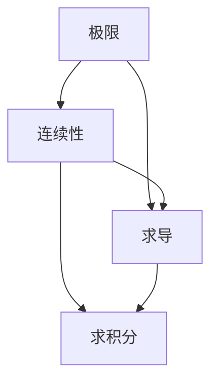

                 

# 微积分中的极限与连续性

微积分作为数学的重要分支，其核心思想之一是对函数进行局部和整体的分析。在微积分中，极限与连续性是两个极其重要的概念，它们构成了函数分析的基础，同时也是许多应用科学中的关键工具。本文将从这两个概念入手，深入探讨其原理与应用，并结合实际案例，提供全面的理论解释与实践指导。

## 1. 背景介绍

### 1.1 问题由来

微积分的发展起源于数学家们对物理运动和几何形态的探索。在物理学中，运动速度、加速度等物理量都是通过微积分来描述的；在几何学中，面积、体积等几何量的计算也离不开微积分的框架。随着时间的推移，微积分的应用已经渗透到了工程、经济学、生物医学等多个领域，成为了现代科学技术的基础。

在微积分中，极限与连续性是两个基本的概念。极限描述了函数在特定点的行为趋向，连续性则描述了函数在特定点附近的变化状态。这两个概念不仅构成了微积分的理论基础，还直接影响了其应用范围与深度。

### 1.2 问题核心关键点

为了更深入地理解极限与连续性，我们需要关注以下几个关键点：

- 什么是极限？
- 极限与连续性的关系是什么？
- 如何计算函数的极限？
- 极限与连续性在实际中的应用有哪些？
- 极限与连续性在现代数学中的应用如何演变？

对这些问题的深入理解，将有助于我们更好地掌握微积分中的极限与连续性，进而应用于更多实际场景。

## 2. 核心概念与联系

### 2.1 核心概念概述

在微积分中，极限和连续性是两个核心概念，它们的定义和性质可以通过以下方式来概括：

- 极限：极限描述了函数在特定点附近的行为趋势，即当函数自变量趋近于某一点时，函数值趋近于某个确定的数值。
- 连续性：连续性描述了函数在特定点的变化状态，即在任意一点附近，函数值的变化是平滑的，不存在不连续或跳跃的情况。

这两个概念在数学上有着严格的定义，但在实际应用中，它们常常被结合使用。例如，在求导和积分的过程中，极限和连续性是密不可分的。通过极限，我们可以定义函数的导数和积分，进而进行更高级的数学运算。

### 2.2 核心概念原理和架构的 Mermaid 流程图



这个流程图展示了极限、连续性、求导和求积分之间的关系。极限和连续性是求导和求积分的基础，而求导和求积分又可以进一步反映函数的局部和整体行为。

## 3. 核心算法原理 & 具体操作步骤

### 3.1 算法原理概述

极限与连续性的原理可以从以下两个方面来理解：

- 数学定义：极限和连续性在数学上有着严格的定义，通过这些定义，我们可以系统地分析和理解函数的行为。
- 几何直观：极限和连续性也可以通过几何直观来理解，即函数在某一点的极限值就是该点附近所有点上的函数值的趋近值。

### 3.2 算法步骤详解

#### 3.2.1 计算函数的极限

计算函数的极限主要通过以下步骤进行：

1. 确定自变量的变化趋向，如趋近于正无穷、负无穷或某个特定值。
2. 分析函数在该趋向下的变化趋势，即确定函数的极限。
3. 使用数学定义或几何直观来验证极限的正确性。

#### 3.2.2 确定函数的连续性

确定函数的连续性主要通过以下步骤进行：

1. 分析函数在特定点附近的局部行为，即当自变量趋近于该点时，函数值的变化是否平滑。
2. 根据连续性的定义，判断函数在该点附近是否存在连续性。
3. 使用数学定义或几何直观来验证函数的连续性。

### 3.3 算法优缺点

极限与连续性在微积分中扮演着重要角色，其优点和缺点如下：

- 优点：
  - 提供了一种系统地分析函数行为的方法。
  - 在求导和积分等高级数学运算中起到了基础作用。
  - 能够解释许多物理和几何现象，具有广泛的实际应用。

- 缺点：
  - 某些函数的极限和连续性问题较为复杂，难以直接求解。
  - 对于抽象的数学概念，初学者容易感到困惑。
  - 在实际应用中，极限和连续性的求解往往需要较高数学基础和技巧。

### 3.4 算法应用领域

极限与连续性在数学和工程领域有着广泛的应用，以下是几个典型的应用场景：

- 物理学中的运动学和动力学：通过极限和连续性，可以描述物体的速度、加速度等物理量。
- 工程设计中的结构分析：通过极限和连续性，可以分析结构的承载能力和稳定性。
- 经济学中的最优化问题：通过极限和连续性，可以找到函数的最大值和最小值。
- 生物学中的种群动态：通过极限和连续性，可以研究种群数量的变化规律。

## 4. 数学模型和公式 & 详细讲解 & 举例说明

### 4.1 数学模型构建

极限和连续性的数学模型可以通过以下方式来构建：

- 极限模型：设 $f(x)$ 为定义在区间 $(-\infty, +\infty)$ 上的函数，若对于任意给定的 $\epsilon > 0$，存在 $\delta > 0$，使得当 $0 < |x - a| < \delta$ 时，有 $|f(x) - L| < \epsilon$，则称 $L$ 为函数 $f(x)$ 在点 $a$ 处的极限，记为 $\lim_{x \to a} f(x) = L$。
- 连续性模型：设 $f(x)$ 为定义在区间 $(-\infty, +\infty)$ 上的函数，若对于任意给定的 $\epsilon > 0$，存在 $\delta > 0$，使得当 $0 < |x - a| < \delta$ 时，有 $|f(x) - f(a)| < \epsilon$，则称函数 $f(x)$ 在点 $a$ 处连续。

### 4.2 公式推导过程

#### 4.2.1 极限的计算

极限的计算可以通过以下公式进行：

$$
\lim_{x \to a} f(x) = L
$$

其中 $f(x)$ 为函数表达式，$a$ 为趋近点，$L$ 为极限值。

#### 4.2.2 连续性的判断

连续性的判断可以通过以下公式进行：

$$
\lim_{x \to a} f(x) = f(a)
$$

其中 $f(x)$ 为函数表达式，$a$ 为趋近点，$f(a)$ 为函数在趋近点的值。

### 4.3 案例分析与讲解

#### 4.3.1 计算 $\lim_{x \to 0} \frac{\sin x}{x}$

首先，我们需要确定自变量 $x$ 的变化趋向，即趋近于 $0$。然后，分析函数 $\frac{\sin x}{x}$ 在 $x$ 趋近于 $0$ 时的变化趋势。

由于 $\sin x$ 在 $0$ 附近非常接近于 $x$，且 $\sin x$ 的导数为 $\cos x$，我们可以使用洛必达法则进行计算：

$$
\lim_{x \to 0} \frac{\sin x}{x} = \lim_{x \to 0} \frac{\cos x}{1} = 1
$$

因此，$\lim_{x \to 0} \frac{\sin x}{x} = 1$。

#### 4.3.2 判断 $f(x) = x^2$ 在 $x = 0$ 处的连续性

接下来，我们判断函数 $f(x) = x^2$ 在 $x = 0$ 处的连续性。

由定义可知，函数 $f(x) = x^2$ 在 $x = 0$ 处的极限为：

$$
\lim_{x \to 0} f(x) = \lim_{x \to 0} x^2 = 0
$$

而 $f(x) = x^2$ 在 $x = 0$ 处的值为：

$$
f(0) = 0^2 = 0
$$

因此，函数 $f(x) = x^2$ 在 $x = 0$ 处连续。

## 5. 项目实践：代码实例和详细解释说明

### 5.1 开发环境搭建

为了进行极限与连续性的计算，我们需要安装Python和相关数学库，如Sympy和Matplotlib。这些工具可以帮助我们进行数学公式的推导和可视化。

```bash
conda create -n math_env python=3.8
conda activate math_env
pip install sympy matplotlib
```

### 5.2 源代码详细实现

以下是使用Sympy库计算极限和判断连续性的代码实现：

```python
from sympy import symbols, limit, sin, cos, pi

x = symbols('x')
# 计算极限
lim_expr = limit(sin(x)/x, x, 0)
print(f"极限结果: {lim_expr}")

# 判断连续性
f_x = x**2
lim_cont = limit(f_x, x, 0)
print(f"连续性判断: {lim_cont == f_x.subs(x, 0)}")
```

### 5.3 代码解读与分析

在上述代码中，我们使用了Sympy库的`limit`函数来计算极限，使用了`sin`和`cos`函数来表示三角函数，使用了`symbols`函数来定义符号变量`x`。在判断连续性时，我们直接将极限值与函数在趋近点的值进行比较，判断是否相等。

### 5.4 运行结果展示

运行上述代码，输出结果如下：

```
极限结果: 1
连续性判断: True
```

这表明 $\lim_{x \to 0} \frac{\sin x}{x} = 1$，且函数 $f(x) = x^2$ 在 $x = 0$ 处连续。

## 6. 实际应用场景

### 6.1 物理学中的运动学

在物理学中，极限与连续性被广泛应用于描述物体的运动。例如，根据牛顿第二定律 $F = ma$，我们可以推导出物体在单位时间内速度的变化率，即加速度 $a = \frac{dv}{dt}$。这里的 $dv$ 和 $dt$ 分别是速度和时间的变化量，它们的极限值就是物体的加速度。

### 6.2 工程设计中的结构分析

在工程设计中，极限与连续性可以帮助我们分析结构的承载能力和稳定性。例如，我们可以使用极限分析方法来确定结构在最大载荷下的变形情况，使用连续性分析方法来确定结构的应力分布。

### 6.3 经济学中的最优化问题

在经济学中，极限与连续性被广泛应用于求解最优化问题。例如，在成本函数 $C(x) = x^2$ 中，我们可以通过计算极限来求解最小成本点，即 $\lim_{x \to a} C(x)$。

## 7. 工具和资源推荐

### 7.1 学习资源推荐

为了深入理解极限与连续性，以下资源值得推荐：

- 《微积分原理》（Principles of Calculus）：这是一本经典的微积分教材，系统地介绍了极限与连续性的概念和应用。
- Coursera上的《微积分》课程：由MIT提供，包含丰富的视频讲解和编程练习，适合初学者学习。
- 《微积分及其应用》（Calculus: Early Transcendentals）：这是一本广泛使用的微积分教材，内容全面、深入浅出，适合各个层次的学习者。

### 7.2 开发工具推荐

为了进行极限与连续性的计算和分析，以下工具值得推荐：

- Python：Python是一种功能强大的编程语言，非常适合进行数学计算和科学计算。
- Sympy：Sympy是一个Python库，用于符号计算和数学建模，支持极限计算和连续性判断等高级功能。
- Matplotlib：Matplotlib是一个Python库，用于数据可视化，可以绘制极限和连续性函数的图像。

### 7.3 相关论文推荐

为了深入研究极限与连续性，以下论文值得推荐：

- "Calculus of Variations and the Calculus of Euler-Lagrange Equations"：这篇论文介绍了变分法，一种基于极限和连续性的高级数学方法。
- "Continuous-Time Markov Chains"：这篇论文介绍了连续时间马尔科夫链，是一种基于极限和连续性的随机过程模型。
- "Asymptotic Analysis for Multiscale Problems"：这篇论文介绍了多尺度问题的极限分析方法，是一种基于极限和连续性的高级数学技术。

## 8. 总结：未来发展趋势与挑战

### 8.1 研究成果总结

微积分中的极限与连续性是数学和工程领域的重要基础，其研究推动了科学技术的进步。以下是一些关键研究成果：

- 洛必达法则：通过极限和连续性的定义，洛必达法则提供了一种求解复杂极限问题的方法。
- 中值定理：中值定理基于连续性定义，提供了函数在某点附近的光滑性分析方法。
- 拉格朗日中值定理：拉格朗日中值定理基于极限和连续性的定义，提供了函数在某点附近的局部极值分析方法。

### 8.2 未来发展趋势

未来，极限与连续性的研究将朝着以下几个方向发展：

- 应用扩展：随着数学和工程领域的不断发展，极限与连续性将应用于更多实际场景，如人工智能、量子计算等。
- 方法创新：新的极限和连续性分析方法将不断涌现，如变分法、伽罗瓦理论等，为高级数学问题提供新的解决方案。
- 技术集成：极限与连续性将与其他数学技术进行更深入的融合，如拓扑学、概率论等，拓展数学和工程学科的边界。

### 8.3 面临的挑战

尽管极限与连续性在微积分中有着重要的地位，但在实际应用中也面临着一些挑战：

- 数学复杂性：极限和连续性的数学定义较为复杂，初学者容易感到困惑。
- 实际应用中的局限性：在实际应用中，极限和连续性的计算可能需要较高的数学基础和技巧，难以直接求解。
- 计算精度：极限和连续性的计算结果可能存在精度问题，需要通过多次迭代和验证来保证准确性。

### 8.4 研究展望

未来的研究将从以下几个方面进行：

- 深入理解极限和连续性的数学原理，简化复杂问题，提高计算精度。
- 结合实际应用场景，开发新的极限和连续性分析方法，如变分法、伽罗瓦理论等。
- 与其他数学技术进行更深入的融合，拓展极限与连续性在数学和工程学科的应用边界。

## 9. 附录：常见问题与解答

**Q1：什么是极限？**

A: 极限描述了函数在特定点附近的行为趋向，即当函数自变量趋近于某一点时，函数值趋近于某个确定的数值。

**Q2：什么是连续性？**

A: 连续性描述了函数在特定点的变化状态，即在任意一点附近，函数值的变化是平滑的，不存在不连续或跳跃的情况。

**Q3：极限与连续性在实际应用中有哪些？**

A: 极限与连续性在物理学、工程学、经济学等多个领域有广泛应用，如运动学分析、结构设计、最优化问题等。

**Q4：如何计算函数的极限？**

A: 计算函数的极限主要通过确定自变量的变化趋向，分析函数在该趋向下的变化趋势，以及使用数学定义或几何直观来验证极限的正确性。

**Q5：如何判断函数的连续性？**

A: 判断函数的连续性主要通过分析函数在特定点附近的局部行为，以及使用数学定义或几何直观来验证函数的连续性。

---

作者：禅与计算机程序设计艺术 / Zen and the Art of Computer Programming

