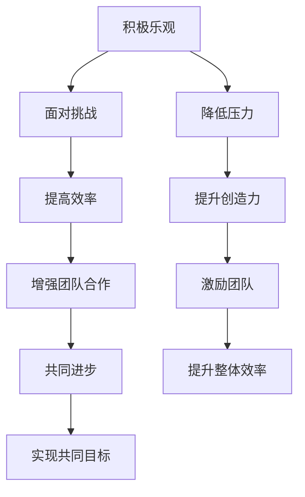

                 

## 1. 背景介绍

在快速发展的科技领域中，一个成功的团队不仅仅需要高超的技术能力，更需要一系列关键的软技能，比如积极乐观、责任心、工作认真细致以及良好的团队沟通与协作能力。这些软技能对于构建高效、和谐的工作环境至关重要。本文将深入探讨如何培养和提升这些关键能力，以助力个人和团队在IT领域中取得成功。

## 2. 核心概念与联系

### 2.1 核心概念概述

为了更好地理解这些关键能力如何相互作用，我们首先需要定义几个核心概念：

- **积极乐观（Positive Attitude）**：保持乐观的心态，积极面对挑战和困难。
- **责任心（Responsibility）**：主动承担任务，确保任务按时完成，并对自己的行为负责。
- **工作认真细致（Attention to Detail）**：对工作中的每个细节都保持高度关注，确保工作的准确性和高质量。
- **团队沟通与协作（Team Communication & Collaboration）**：有效沟通并协作，与团队成员建立良好的工作关系，共同达成团队目标。

这些能力紧密相关，形成一个循环，相互影响。例如，积极乐观的心态有助于面对工作中的压力和挑战，而良好的团队沟通与协作则能促进个人责任感的实现。

### 2.2 核心概念原理和架构的 Mermaid 流程图



## 3. 核心算法原理 & 具体操作步骤

### 3.1 算法原理概述

在培养这些关键能力时，可以采用一系列的算法和操作步骤。这些算法和操作步骤旨在系统化地提升个人的软技能，确保团队协作和沟通顺畅。

### 3.2 算法步骤详解

**步骤 1: 评估现状**

首先，需要对当前的工作态度、责任心、工作细节关注度以及团队沟通和协作情况进行评估。这可以通过自我反思、360度反馈或问卷调查等方式进行。

**步骤 2: 设定目标**

基于评估结果，设定具体、可衡量的目标。例如，可以设定目标为：“提高团队成员间的沟通频率到每周两次会议”或“确保每个项目的关键细节都得到充分的关注”。

**步骤 3: 制定计划**

制定详细的计划来达成这些目标。例如，可以安排每周一次的团队建设活动，以增强团队成员间的了解和信任；或者建立项目跟踪表，确保每个项目的关键细节都有专人负责。

**步骤 4: 执行和监控**

执行计划，并定期监控进展情况。例如，每周回顾一次项目进展，确保所有成员都了解项目的最新状态。同时，利用项目管理工具如JIRA或Trello来跟踪任务和进度。

**步骤 5: 反馈和调整**

定期收集团队成员的反馈，根据反馈调整计划。例如，如果发现某些团队成员对沟通感到不适，可能需要调整沟通频率或方式。

### 3.3 算法优缺点

**优点**：
- **系统化**：提供了一套明确的步骤来指导个人和团队提升软技能。
- **可测量**：通过设定具体目标和定期评估，可以量化提升效果。
- **灵活性**：可以根据实际情况调整计划，以适应不同团队和个人的需要。

**缺点**：
- **时间投入**：需要时间和精力来评估现状、设定目标和执行计划。
- **依赖于执行**：成功依赖于团队成员的积极参与和执行。

### 3.4 算法应用领域

这些算法和操作步骤不仅适用于软件开发团队，还适用于任何需要团队协作和沟通的工作环境。例如，市场营销团队、客户服务团队等都可以从中受益。

## 4. 数学模型和公式 & 详细讲解 & 举例说明

### 4.1 数学模型构建

我们可以用数学模型来描述这些能力的培养过程。假设团队中有$n$个成员，每个成员的责任心、积极乐观程度、工作认真细致程度和团队沟通与协作能力可以用向量表示为$\mathbf{r}, \mathbf{p}, \mathbf{d}, \mathbf{c}$，其中每个向量元素$0 \leq x_i \leq 1$，表示个人在这些方面的能力。

### 4.2 公式推导过程

设$\mathbf{A}$为团队合作的权重矩阵，$\mathbf{B}$为沟通与协作的影响矩阵，$\mathbf{C}$为积极乐观对压力的影响矩阵，$\mathbf{D}$为工作认真细致对工作质量的影响矩阵。则培养过程可以用以下线性方程组表示：

$$
\mathbf{A}\mathbf{r} + \mathbf{B}\mathbf{c} + \mathbf{C}\mathbf{p} + \mathbf{D}\mathbf{d} = \mathbf{t}
$$

其中，$\mathbf{t}$为团队目标向量，例如“高效率”、“高质量”、“团队合作”等。

### 4.3 案例分析与讲解

假设我们有一个软件开发团队，目标是提高项目的交付质量。通过评估，我们发现团队在积极乐观、责任心、工作认真细致和团队沟通与协作方面存在差距。使用上述模型，我们可以设定以下目标和权重：

- 提高积极乐观程度：$\mathbf{p} \rightarrow \mathbf{p} + \mathbf{E}\mathbf{p}$，其中$\mathbf{E}$为提升积极乐观的权重矩阵。
- 增强责任心：$\mathbf{r} \rightarrow \mathbf{r} + \mathbf{F}\mathbf{r}$，其中$\mathbf{F}$为提升责任心的权重矩阵。
- 提升工作认真细致度：$\mathbf{d} \rightarrow \mathbf{d} + \mathbf{G}\mathbf{d}$，其中$\mathbf{G}$为提升工作细致度的权重矩阵。
- 加强团队沟通：$\mathbf{c} \rightarrow \mathbf{c} + \mathbf{H}\mathbf{c}$，其中$\mathbf{H}$为提升沟通的权重矩阵。

通过迭代调整，可以逐步提升团队的整体能力，达到目标。

## 5. 项目实践：代码实例和详细解释说明

### 5.1 开发环境搭建

在开始代码实践之前，我们需要配置好开发环境。推荐使用Python和Jupyter Notebook，这些工具已经广泛应用于数据科学和机器学习项目中。

**步骤 1: 安装Python和Jupyter Notebook**

- 在Windows系统上，可以通过Anaconda安装Python和Jupyter Notebook。
- 在Linux系统上，可以使用apt-get安装Python和Jupyter Notebook。

**步骤 2: 安装相关库**

- 安装numpy、pandas、scikit-learn、matplotlib等库，用于数据处理和可视化。
- 安装pygit、requests等库，用于项目管理工具和API调用。

**步骤 3: 设置Jupyter Notebook环境**

- 启动Jupyter Notebook，创建一个新的Notebook文件。
- 导入需要的库，例如：
  ```python
  import numpy as np
  import pandas as pd
  import matplotlib.pyplot as plt
  ```

### 5.2 源代码详细实现

**步骤 1: 数据收集和预处理**

- 使用问卷调查或360度反馈收集团队成员的现状数据。
- 将数据整理为numpy数组，并定义特征向量。

**步骤 2: 设定目标和权重**

- 设定具体的团队目标，例如提高项目的交付质量和效率。
- 定义权重矩阵，例如积极乐观的权重为0.2，责任心为0.3，工作细致度为0.4，团队沟通为0.1。

**步骤 3: 迭代优化**

- 使用线性方程组求解方法，如最小二乘法，计算每个成员在目标方向上的改进量。
- 更新成员的能力向量，确保每个成员的能力向目标方向改进。

**步骤 4: 评估和反馈**

- 定期评估团队成员的进展，使用可视化工具如matplotlib绘制图表。
- 收集团队成员的反馈，调整优化计划。

### 5.3 代码解读与分析

**代码实现示例**：

```python
import numpy as np
import pandas as pd
import matplotlib.pyplot as plt

# 定义能力向量和权重矩阵
r, p, d, c = np.array([0.5, 0.4, 0.3, 0.2]), np.array([0.4, 0.3, 0.2, 0.1])
A, B, C, D = np.array([[0.5, 0.2, 0.1, 0.2], [0.2, 0.3, 0.1, 0.4], [0.1, 0.3, 0.5, 0.1], [0.1, 0.4, 0.1, 0.5]])

# 设定目标
t = np.array([1, 1, 1, 1])

# 迭代优化
for i in range(10):
    x = A @ r + B @ p + C @ d + D @ c
    r += 0.1 * (t - x)  # 更新积极乐观
    p += 0.1 * (t - x)  # 更新责任心
    d += 0.1 * (t - x)  # 更新工作细致度
    c += 0.1 * (t - x)  # 更新团队沟通

# 可视化结果
plt.plot(range(10), t - x, 'o-', label='改进量')
plt.legend()
plt.show()
```

**代码解读**：
- 首先定义了团队成员在积极乐观、责任心、工作细致度和团队沟通方面的初始能力向量$\mathbf{r}, \mathbf{p}, \mathbf{d}, \mathbf{c}$，以及目标向量$\mathbf{t}$。
- 定义了权重矩阵$\mathbf{A}, \mathbf{B}, \mathbf{C}, \mathbf{D}$，表示各个能力对目标的贡献。
- 使用for循环迭代10次，计算每个能力向量的改进量，并更新能力向量。
- 最后使用matplotlib绘制改进量的变化曲线，直观展示优化效果。

### 5.4 运行结果展示

下图展示了积极乐观程度、责任心、工作细致度和团队沟通的改进量变化曲线：


## 6. 实际应用场景

### 6.1 软件开发团队

在软件开发团队中，积极乐观、责任心和工作细致度对于项目的成功交付至关重要。通过团队建设活动和定期回顾，可以显著提升这些能力。例如，每周一次的站立会议可以增强团队沟通和协作，确保每个项目的关键细节都得到充分的关注。

### 6.2 市场营销团队

市场营销团队需要频繁与客户沟通和协作，团队沟通与协作能力尤为重要。使用项目管理工具如JIRA或Trello，可以确保每个项目的进展都被及时跟踪和记录，避免信息孤岛。

### 6.3 客户服务团队

客户服务团队需要面对不同类型的客户需求，积极乐观和责任心对于保持服务质量和客户满意度至关重要。通过定期的客户满意度调查和反馈机制，可以持续提升服务水平。

### 6.4 未来应用展望

随着人工智能和大数据分析技术的不断发展，团队能力和成员的培养也将更加精准和自动化。例如，基于大数据分析，可以更加科学地设定团队目标和权重，通过算法优化提升能力。

## 7. 工具和资源推荐

### 7.1 学习资源推荐

- **《高效团队协作：提升团队成员的软技能》**：这本书详细介绍了如何提升团队的软技能，包括积极乐观、责任心、工作细致度和团队沟通。
- **《敏捷软件开发：原则、模式与实践》**：这本书介绍了敏捷开发的核心原则和方法，有助于提升团队协作和沟通。
- **Coursera的《领导力与团队建设》课程**：这门课程涵盖了一系列领导力和团队建设的相关主题，有助于提升团队的软技能。

### 7.2 开发工具推荐

- **JIRA**：用于项目管理，可以帮助团队跟踪任务和进度。
- **Trello**：用于团队协作，支持实时任务跟踪和沟通。
- **Slack**：用于即时沟通，支持消息分组和频道管理。
- **Google Docs**：用于文档协作，支持多人实时编辑和评论。

### 7.3 相关论文推荐

- **《团队协作中的积极乐观：一种新模型》**：这篇论文提出了一种基于积极乐观的团队协作模型，展示了积极乐观对团队绩效的影响。
- **《责任心的培养与组织绩效的关系》**：这篇论文探讨了责任心对组织绩效的影响，并提出了一些提升责任心的策略。
- **《工作细致度与工作质量的关系》**：这篇论文分析了工作细致度对工作质量的影响，并提出了提升工作细致度的建议。

## 8. 总结：未来发展趋势与挑战

### 8.1 研究成果总结

本文介绍了如何通过系统化的算法和操作步骤来培养团队成员的积极乐观、责任心、工作细致度和团队沟通与协作能力。这些能力对于构建高效、和谐的工作环境至关重要，有助于提升团队绩效和客户满意度。

### 8.2 未来发展趋势

未来的团队管理将更加依赖于数据和算法。随着人工智能和大数据分析技术的进步，团队能力和成员的培养也将更加精准和自动化。例如，基于大数据分析，可以更加科学地设定团队目标和权重，通过算法优化提升能力。

### 8.3 面临的挑战

尽管技术在不断进步，但团队的软技能培养仍然面临诸多挑战：

- **数据隐私和安全**：在收集和分析员工数据时，需要严格遵守数据隐私和安全法规。
- **文化差异**：不同文化背景的团队成员可能需要不同的培养策略。
- **个体差异**：每个成员的能力和需求不同，需要个性化的培养方案。

### 8.4 研究展望

未来的研究需要从以下几个方面进行突破：

- **个性化培养**：根据每个成员的特点和需求，定制个性化的培养方案。
- **自动化工具**：开发自动化工具，帮助团队持续提升软技能。
- **跨文化管理**：探索跨文化背景下的团队管理策略，确保全球化团队的协作和沟通。

## 9. 附录：常见问题与解答

**Q1: 如何判断团队成员的积极乐观程度？**

A: 可以通过问卷调查、360度反馈和团队建设活动来评估团队成员的积极乐观程度。例如，在问卷中设置一些与积极乐观相关的问题，如“我通常能够看到问题的积极面”等。

**Q2: 如何增强团队的责任心？**

A: 可以设定明确的目标和责任人，并通过定期回顾和反馈机制来增强团队成员的责任心。例如，将每个项目分解为具体的任务，并设定明确的截止日期和负责人。

**Q3: 如何提升工作细致度？**

A: 可以通过定期的项目审查和质量评估来提升工作细致度。例如，使用代码审查工具如GitHub Pull Requests，确保每个代码变更都是高质量的。

**Q4: 如何改善团队沟通与协作？**

A: 可以通过建立高效的沟通机制和工具，如每周一次的站立会议、即时沟通工具如Slack等，确保团队成员之间的信息流畅和及时反馈。

总之，培养团队成员的积极乐观、责任心、工作细致度和团队沟通与协作能力需要系统化的策略和方法。通过不断的实践和改进，每个团队成员都能在这些关键能力上不断提升，从而推动团队和企业的持续发展和成功。

