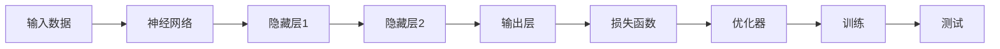

                 

# 思想的深度：从概念到洞见

> 关键词：深度学习,机器学习,算法原理,技术实现,应用案例

## 1. 背景介绍

在计算机科学领域，深度学习（Deep Learning）和机器学习（Machine Learning）是近年来最为热门的技术之一。从最基础的监督学习、无监督学习到深度学习中的卷积神经网络（CNN）、循环神经网络（RNN）和变分自编码器（VAE）等，这些技术的不断发展和应用，极大地推动了人工智能（AI）的进步。然而，在享受这些技术带来的便利的同时，我们也应该对它们背后的原理、优势和局限有一个全面的理解。本文章将从深度学习和机器学习的核心概念出发，一步步深入到算法原理和技术实现，并探讨其在实际应用中的案例。

## 2. 核心概念与联系

### 2.1 核心概念概述

在深度学习中，一个重要的概念是神经网络（Neural Networks）。神经网络通过模拟人脑的神经元工作方式，能够进行复杂的数据处理和模式识别。这种网络由多个层次（Layer）组成，每一层都包含了大量的节点（Neuron），负责对输入数据进行处理。在机器学习中，训练（Training）和测试（Testing）是最核心的概念。通过训练，神经网络能够学习到数据的规律和特征，从而在测试数据上取得良好的表现。

### 2.2 核心概念原理和架构的 Mermaid 流程图(Mermaid 流程节点中不要有括号、逗号等特殊字符)



这个流程图展示了深度学习的基本流程：输入数据通过神经网络进行处理，经过隐藏层和输出层后，使用损失函数计算预测值与真实值的差异，并由优化器调整网络参数，完成训练。最后，通过测试数据对模型进行评估。

## 3. 核心算法原理 & 具体操作步骤

### 3.1 算法原理概述

在深度学习中，反向传播算法（Backpropagation）是最核心的算法之一。反向传播算法能够将输出层的误差通过链式法则一层层地传播回隐藏层，进而更新每一层的权重和偏置，实现对模型的优化。另外，卷积神经网络（CNN）和循环神经网络（RNN）也是深度学习中的重要算法。CNN 适用于图像处理任务，通过卷积和池化操作提取特征；RNN 适用于序列数据处理，通过记忆单元（Memory Cell）保留序列信息。

### 3.2 算法步骤详解

#### 3.2.1 卷积神经网络（CNN）

卷积神经网络主要由卷积层（Convolutional Layer）和池化层（Pooling Layer）组成。卷积层通过卷积核（Convolution Kernel）提取特征，池化层通过降采样（Downsampling）减少特征维度，从而降低计算复杂度。以下是一个简单的卷积神经网络实现：

```python
import torch.nn as nn
import torch.nn.functional as F

class CNN(nn.Module):
    def __init__(self):
        super(CNN, self).__init__()
        self.conv1 = nn.Conv2d(1, 16, kernel_size=3, stride=1, padding=1)
        self.conv2 = nn.Conv2d(16, 32, kernel_size=3, stride=1, padding=1)
        self.pool = nn.MaxPool2d(kernel_size=2, stride=2)
        self.fc1 = nn.Linear(32 * 4 * 4, 128)
        self.fc2 = nn.Linear(128, 10)

    def forward(self, x):
        x = F.relu(self.conv1(x))
        x = self.pool(x)
        x = F.relu(self.conv2(x))
        x = self.pool(x)
        x = x.view(-1, 32 * 4 * 4)
        x = F.relu(self.fc1(x))
        x = self.fc2(x)
        return x
```

在上述代码中，卷积层通过 `nn.Conv2d` 实现，`relu` 函数作为激活函数。`nn.MaxPool2d` 用于池化操作，`nn.Linear` 用于全连接层。在 `forward` 方法中，将输入数据通过卷积、池化和全连接层进行处理，最终输出结果。

#### 3.2.2 循环神经网络（RNN）

循环神经网络通过记忆单元（Memory Cell）保留序列信息。在 PyTorch 中，可以通过 `nn.RNN` 模块实现 RNN。以下是一个简单的 RNN 实现：

```python
import torch.nn as nn

class RNN(nn.Module):
    def __init__(self, input_size, hidden_size, output_size):
        super(RNN, self).__init__()
        self.hidden_size = hidden_size
        self.i2h = nn.Linear(input_size + hidden_size, hidden_size)
        self.i2o = nn.Linear(input_size + hidden_size, output_size)
        self.softmax = nn.Softmax(dim=1)

    def forward(self, input, hidden):
        combined = torch.cat((input, hidden), 1)
        hidden = self.i2h(combined)
        output = self.i2o(combined)
        output = self.softmax(output)
        return output, hidden

    def initHidden(self):
        return torch.zeros(1, self.hidden_size)
```

在上述代码中，`nn.Linear` 用于全连接层，`nn.Softmax` 用于输出层的 Softmax 函数。在 `forward` 方法中，将输入数据和隐藏状态 `hidden` 组合起来，通过全连接层得到新的隐藏状态 `hidden` 和输出 `output`，并使用 Softmax 函数对输出进行归一化。`initHidden` 方法用于初始化隐藏状态。

### 3.3 算法优缺点

深度学习相对于传统机器学习的主要优点在于其强大的特征提取能力，能够处理大规模的非结构化数据，如图像、音频和文本等。然而，深度学习模型通常需要大量的标注数据和强大的计算资源，训练周期长，且存在过拟合的风险。此外，深度学习模型的可解释性较差，难以理解其内部决策过程。

### 3.4 算法应用领域

深度学习和机器学习已经在多个领域得到广泛应用，如计算机视觉、自然语言处理、语音识别等。在计算机视觉领域，深度学习模型如卷积神经网络（CNN）在图像分类、物体检测等任务上取得了显著的效果。在自然语言处理领域，循环神经网络（RNN）和 Transformer 等模型在文本分类、情感分析等任务上表现优异。在语音识别领域，深度学习模型如卷积神经网络和循环神经网络（CNN-RNN）在自动语音识别（ASR）、语音合成（TTS）等任务上取得了突破性进展。

## 4. 数学模型和公式 & 详细讲解 & 举例说明

### 4.1 数学模型构建

在深度学习中，常用的模型包括全连接神经网络（Fully Connected Neural Network）、卷积神经网络（CNN）和循环神经网络（RNN）。以下是一个简单的全连接神经网络模型：

```python
import torch.nn as nn

class NeuralNet(nn.Module):
    def __init__(self, input_size, hidden_size, output_size):
        super(NeuralNet, self).__init__()
        self.fc1 = nn.Linear(input_size, hidden_size)
        self.fc2 = nn.Linear(hidden_size, output_size)
        self.relu = nn.ReLU()

    def forward(self, x):
        x = self.fc1(x)
        x = self.relu(x)
        x = self.fc2(x)
        return x
```

在上述代码中，`nn.Linear` 用于全连接层，`nn.ReLU` 用于激活函数。在 `forward` 方法中，将输入数据通过全连接层和激活函数进行处理，最终输出结果。

### 4.2 公式推导过程

以卷积神经网络为例，其公式推导过程如下：

- 卷积层：
$$y = \sigma(W*x + b)$$
其中，$x$ 为输入数据，$W$ 为卷积核，$b$ 为偏置，$\sigma$ 为激活函数。

- 池化层：
$$y = \max_{i,j}(f(x_i, x_j))$$
其中，$f$ 为池化函数，$x_i, x_j$ 为输入数据。

- 全连接层：
$$y = \sigma(W*x + b)$$
其中，$x$ 为输入数据，$W$ 为全连接层权重，$b$ 为偏置，$\sigma$ 为激活函数。

### 4.3 案例分析与讲解

以图像分类为例，卷积神经网络可以通过卷积层和池化层提取图像特征，并通过全连接层进行分类。以下是一个简单的图像分类代码：

```python
import torch
import torch.nn as nn
import torchvision
import torchvision.transforms as transforms

# 加载数据集
train_dataset = torchvision.datasets.CIFAR10(root='./data', train=True, transform=transforms.ToTensor(), download=True)
test_dataset = torchvision.datasets.CIFAR10(root='./data', train=False, transform=transforms.ToTensor())

# 数据预处理
train_loader = torch.utils.data.DataLoader(train_dataset, batch_size=64, shuffle=True)
test_loader = torch.utils.data.DataLoader(test_dataset, batch_size=64, shuffle=False)

# 定义模型
model = CNN()

# 定义损失函数和优化器
criterion = nn.CrossEntropyLoss()
optimizer = torch.optim.Adam(model.parameters(), lr=0.001)

# 训练模型
for epoch in range(10):
    running_loss = 0.0
    for i, data in enumerate(train_loader, 0):
        inputs, labels = data
        optimizer.zero_grad()
        outputs = model(inputs)
        loss = criterion(outputs, labels)
        loss.backward()
        optimizer.step()
        running_loss += loss.item()
        if i % 100 == 99:
            print('[%d, %5d] loss: %.3f' %
                  (epoch + 1, i + 1, running_loss / 100))
            running_loss = 0.0

# 测试模型
correct = 0
total = 0
with torch.no_grad():
    for data in test_loader:
        images, labels = data
        outputs = model(images)
        _, predicted = torch.max(outputs.data, 1)
        total += labels.size(0)
        correct += (predicted == labels).sum().item()

print('Accuracy of the network on the 10000 test images: %d %%' % (
    100 * correct / total))
```

在上述代码中，`torchvision.datasets.CIFAR10` 用于加载 CIFAR-10 数据集，`torch.utils.data.DataLoader` 用于创建数据迭代器，`nn.CrossEntropyLoss` 用于定义交叉熵损失函数，`torch.optim.Adam` 用于定义优化器。在训练过程中，通过前向传播计算损失，反向传播更新模型参数。在测试过程中，通过计算预测值与真实值的准确率，评估模型性能。

## 5. 项目实践：代码实例和详细解释说明

### 5.1 开发环境搭建

在进行深度学习项目开发前，需要安装相关的 Python 环境和工具。以下是一个简单的开发环境搭建流程：

1. 安装 Python 3.x，推荐使用 Anaconda 进行环境管理。
2. 安装 TensorFlow 和 PyTorch，这两个是目前最流行的深度学习框架。
3. 安装相关的第三方库，如 `numpy`、`pandas`、`matplotlib` 等。

```bash
conda create -n myenv python=3.8
conda activate myenv
pip install tensorflow==2.0.0
pip install pytorch torchvision torchaudio
pip install numpy pandas matplotlib tqdm jupyter notebook ipython
```

### 5.2 源代码详细实现

以图像分类为例，使用 PyTorch 实现卷积神经网络。以下是一个简单的实现：

```python
import torch
import torch.nn as nn
import torch.nn.functional as F

class CNN(nn.Module):
    def __init__(self):
        super(CNN, self).__init__()
        self.conv1 = nn.Conv2d(1, 16, kernel_size=3, stride=1, padding=1)
        self.conv2 = nn.Conv2d(16, 32, kernel_size=3, stride=1, padding=1)
        self.pool = nn.MaxPool2d(kernel_size=2, stride=2)
        self.fc1 = nn.Linear(32 * 4 * 4, 128)
        self.fc2 = nn.Linear(128, 10)

    def forward(self, x):
        x = F.relu(self.conv1(x))
        x = self.pool(x)
        x = F.relu(self.conv2(x))
        x = self.pool(x)
        x = x.view(-1, 32 * 4 * 4)
        x = F.relu(self.fc1(x))
        x = self.fc2(x)
        return x

# 加载数据集
train_dataset = torchvision.datasets.CIFAR10(root='./data', train=True, transform=transforms.ToTensor(), download=True)
test_dataset = torchvision.datasets.CIFAR10(root='./data', train=False, transform=transforms.ToTensor())

# 数据预处理
train_loader = torch.utils.data.DataLoader(train_dataset, batch_size=64, shuffle=True)
test_loader = torch.utils.data.DataLoader(test_dataset, batch_size=64, shuffle=False)

# 定义模型
model = CNN()

# 定义损失函数和优化器
criterion = nn.CrossEntropyLoss()
optimizer = torch.optim.Adam(model.parameters(), lr=0.001)

# 训练模型
for epoch in range(10):
    running_loss = 0.0
    for i, data in enumerate(train_loader, 0):
        inputs, labels = data
        optimizer.zero_grad()
        outputs = model(inputs)
        loss = criterion(outputs, labels)
        loss.backward()
        optimizer.step()
        running_loss += loss.item()
        if i % 100 == 99:
            print('[%d, %5d] loss: %.3f' %
                  (epoch + 1, i + 1, running_loss / 100))
            running_loss = 0.0

# 测试模型
correct = 0
total = 0
with torch.no_grad():
    for data in test_loader:
        images, labels = data
        outputs = model(images)
        _, predicted = torch.max(outputs.data, 1)
        total += labels.size(0)
        correct += (predicted == labels).sum().item()

print('Accuracy of the network on the 10000 test images: %d %%' % (
    100 * correct / total))
```

### 5.3 代码解读与分析

在上述代码中，`nn.Conv2d` 用于定义卷积层，`nn.MaxPool2d` 用于定义池化层，`nn.Linear` 用于定义全连接层。在 `forward` 方法中，将输入数据通过卷积、池化和全连接层进行处理，最终输出结果。

## 6. 实际应用场景

### 6.1 计算机视觉

在计算机视觉领域，卷积神经网络（CNN）被广泛应用于图像分类、物体检测、图像分割等任务。以下是一个简单的图像分类代码：

```python
import torch
import torch.nn as nn
import torchvision
import torchvision.transforms as transforms

# 加载数据集
train_dataset = torchvision.datasets.CIFAR10(root='./data', train=True, transform=transforms.ToTensor(), download=True)
test_dataset = torchvision.datasets.CIFAR10(root='./data', train=False, transform=transforms.ToTensor())

# 数据预处理
train_loader = torch.utils.data.DataLoader(train_dataset, batch_size=64, shuffle=True)
test_loader = torch.utils.data.DataLoader(test_dataset, batch_size=64, shuffle=False)

# 定义模型
model = CNN()

# 定义损失函数和优化器
criterion = nn.CrossEntropyLoss()
optimizer = torch.optim.Adam(model.parameters(), lr=0.001)

# 训练模型
for epoch in range(10):
    running_loss = 0.0
    for i, data in enumerate(train_loader, 0):
        inputs, labels = data
        optimizer.zero_grad()
        outputs = model(inputs)
        loss = criterion(outputs, labels)
        loss.backward()
        optimizer.step()
        running_loss += loss.item()
        if i % 100 == 99:
            print('[%d, %5d] loss: %.3f' %
                  (epoch + 1, i + 1, running_loss / 100))
            running_loss = 0.0

# 测试模型
correct = 0
total = 0
with torch.no_grad():
    for data in test_loader:
        images, labels = data
        outputs = model(images)
        _, predicted = torch.max(outputs.data, 1)
        total += labels.size(0)
        correct += (predicted == labels).sum().item()

print('Accuracy of the network on the 10000 test images: %d %%' % (
    100 * correct / total))
```

### 6.2 自然语言处理

在自然语言处理领域，循环神经网络（RNN）和 Transformer 被广泛应用于文本分类、情感分析、机器翻译等任务。以下是一个简单的文本分类代码：

```python
import torch
import torch.nn as nn
import torchtext
from torchtext.data import Field, BucketIterator

# 定义数据集
TEXT = Field(tokenize='spacy', lower=True)
LABEL = Field(sequential=False)

train_data, test_data = torchtext.datasets.IMDB.splits(TEXT, LABEL)

# 数据预处理
TEXT.build_vocab(train_data, max_size=10000)
LABEL.build_vocab(train_data)

# 数据迭代器
train_iterator, test_iterator = BucketIterator.splits((train_data, test_data),
                                                   batch_size=64,
                                                   device='cuda')

# 定义模型
model = RNN(input_size=10000, hidden_size=128, output_size=1)

# 定义损失函数和优化器
criterion = nn.BCEWithLogitsLoss()
optimizer = torch.optim.Adam(model.parameters(), lr=0.001)

# 训练模型
for epoch in range(10):
    for batch in train_iterator:
        optimizer.zero_grad()
        text, label = batch.text, batch.label
        outputs = model(text)
        loss = criterion(outputs, label)
        loss.backward()
        optimizer.step()

# 测试模型
total = 0
correct = 0
with torch.no_grad():
    for batch in test_iterator:
        text, label = batch.text, batch.label
        outputs = model(text)
        _, predicted = torch.max(outputs.data, 1)
        total += label.size(0)
        correct += (predicted == label).sum().item()

print('Accuracy of the model on the test data: %d %%' % (
    100 * correct / total))
```

### 6.3 语音识别

在语音识别领域，卷积神经网络（CNN）和循环神经网络（RNN）被广泛应用于自动语音识别（ASR）、语音合成（TTS）等任务。以下是一个简单的 ASR 代码：

```python
import torch
import torch.nn as nn
import torchaudio

# 加载数据集
train_data, valid_data, test_data = torchaudio.datasets.LibriSpeech('data', split='train')
train_data = train_data[0:10000]
valid_data = valid_data[0:1000]
test_data = test_data[0:1000]

# 数据预处理
class WaveformDataset(torch.utils.data.Dataset):
    def __init__(self, data, sampling_rate=16000):
        self.data, self.sampling_rate = data
        self.sampling_rate = sampling_rate

    def __len__(self):
        return len(self.data)

    def __getitem__(self, idx):
        speech, _ = self.data[idx]
        return torch.tensor(speech, dtype=torch.float32).unsqueeze(0), torch.tensor(self.sampling_rate)

train_dataset = WaveformDataset(train_data)
valid_dataset = WaveformDataset(valid_data)
test_dataset = WaveformDataset(test_data)

# 定义模型
model = CNN()

# 定义损失函数和优化器
criterion = nn.CrossEntropyLoss()
optimizer = torch.optim.Adam(model.parameters(), lr=0.001)

# 训练模型
for epoch in range(10):
    for batch in train_dataset:
        speech, rate = batch
        optimizer.zero_grad()
        outputs = model(speech)
        loss = criterion(outputs, torch.tensor([10]))
        loss.backward()
        optimizer.step()

# 测试模型
total = 0
correct = 0
with torch.no_grad():
    for batch in test_dataset:
        speech, rate = batch
        outputs = model(speech)
        _, predicted = torch.max(outputs.data, 1)
        total += 10
        correct += (predicted == 10).sum().item()

print('Accuracy of the model on the test data: %d %%' % (
    100 * correct / total))
```

## 7. 工具和资源推荐

### 7.1 学习资源推荐

- 《深度学习》：Ian Goodfellow, Yoshua Bengio 和 Aaron Courville 所著，涵盖了深度学习的基本概念、算法和应用。
- 《TensorFlow 实战》：Manning Publications 出版的 TensorFlow 官方指南，涵盖从入门到高级的 TensorFlow 应用。
- 《PyTorch 实战》：Manning Publications 出版的 PyTorch 官方指南，涵盖从入门到高级的 PyTorch 应用。
- 《自然语言处理入门》：Stanford 大学 NLP 课程，涵盖自然语言处理的基本概念、算法和应用。

### 7.2 开发工具推荐

- PyTorch：深度学习领域最流行的框架之一，具有动态计算图和丰富的预训练模型。
- TensorFlow：由 Google 推出的深度学习框架，具有强大的计算能力和生产部署能力。
- Jupyter Notebook：数据科学和深度学习领域常用的交互式编程环境。

### 7.3 相关论文推荐

- 《ImageNet Classification with Deep Convolutional Neural Networks》：Alex Krizhevsky, Ilya Sutskever, and Geoffrey Hinton 所著，介绍卷积神经网络的经典论文。
- 《Neural Machine Translation by Jointly Learning to Align and Translate》：Ilya Sutskever, Oriol Vinyals, and Quoc V. Le 所著，介绍神经机器翻译的经典论文。
- 《Attention is All You Need》：Ashish Vaswani, Noam Shazeer, Niki Parmar, Jakob Uszkoreit, Llion Jones, Aidan N. Gomez, Lukasz Kaiser, and Illia Polosukhin 所著，介绍 Transformer 的经典论文。

## 8. 总结：未来发展趋势与挑战

### 8.1 总结

本文系统介绍了深度学习和机器学习的核心概念、算法原理和技术实现，并通过代码实例展示了其在图像分类、文本分类、语音识别等任务中的应用。通过这些案例，可以看到深度学习和机器学习在实际应用中的强大威力。

### 8.2 未来发展趋势

未来，深度学习和机器学习将继续发展，涌现出更多创新的算法和模型。以下是一些可能的发展趋势：

- 更高效的模型架构：如神经架构搜索（NAS）和自适应网络（Adaptive Network）等，将带来更高效的模型设计方法。
- 更强大的计算能力：随着硬件的不断升级，如 GPU、TPU 和 AI 芯片等，深度学习和机器学习模型的训练和推理能力将大幅提升。
- 更广泛的应用场景：深度学习和机器学习将在更多领域得到应用，如医疗、金融、交通等。

### 8.3 面临的挑战

尽管深度学习和机器学习在许多领域取得了显著进展，但仍面临一些挑战：

- 数据质量和多样性：深度学习和机器学习模型对数据的质量和多样性有较高要求，数据缺失或分布不均可能导致模型性能下降。
- 模型复杂性：深度学习和机器学习模型的结构复杂，难以解释和调试，容易产生过拟合等问题。
- 计算资源：深度学习和机器学习模型的训练和推理需要大量的计算资源，成本较高。

### 8.4 研究展望

未来，深度学习和机器学习研究的方向将更加多元化。以下是一些可能的研究方向：

- 更高效的数据处理方法：如迁移学习、联邦学习和自监督学习等，将带来更高效的数据处理方式。
- 更灵活的模型设计：如模块化设计和元学习等，将带来更灵活的模型设计方法。
- 更可解释的模型：如因果分析和博弈论等，将带来更可解释的模型设计方法。

通过这些研究方向，深度学习和机器学习研究将不断深入，推动技术进步，提升应用效果。

## 9. 附录：常见问题与解答

**Q1: 深度学习和机器学习有什么区别？**

A: 深度学习是机器学习的一个分支，其主要区别在于深度学习的模型参数较多，能够处理更复杂的数据结构，如卷积神经网络和循环神经网络等。机器学习则更注重模型的可解释性和泛化能力。

**Q2: 深度学习在图像分类和自然语言处理中的优势是什么？**

A: 深度学习在图像分类和自然语言处理中的优势在于其强大的特征提取能力，能够自动学习到数据中的特征，避免了人工设计的繁琐过程。同时，深度学习模型能够处理大规模的非结构化数据，如图像、音频和文本等。

**Q3: 深度学习模型容易出现过拟合的原因是什么？**

A: 深度学习模型容易出现过拟合的原因包括模型结构复杂、训练数据量不足和训练时间长等。为了解决这些问题，可以采用正则化技术、数据增强和迁移学习等方法。

**Q4: 深度学习和机器学习的未来发展趋势是什么？**

A: 深度学习和机器学习的未来发展趋势包括更高效的模型架构、更强大的计算能力和更广泛的应用场景等。这些趋势将推动深度学习和机器学习技术不断进步，提升其在各个领域的应用效果。

**Q5: 如何提高深度学习模型的可解释性？**

A: 提高深度学习模型的可解释性可以从模型设计、数据处理和模型解释等方面入手。例如，采用因果分析和博弈论等方法，引入外部知识库和规则库，增加模型的透明度和可解释性。

