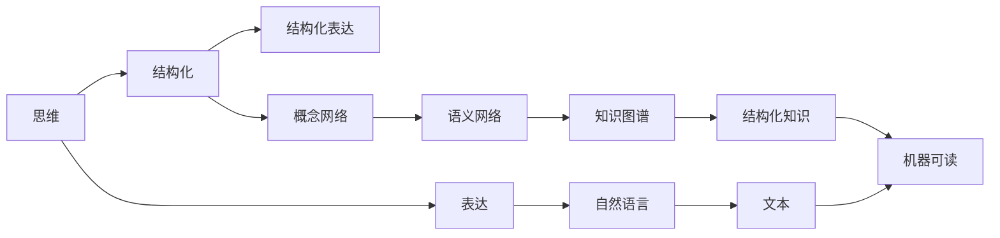

                 

## 1. 背景介绍

### 1.1 问题由来
在现代社会，信息爆炸和认知负荷的双重压力下，如何有效地处理和组织知识、信息，成为越来越多人关注的焦点。人类思维与表达之间的内在联系，作为认知科学的重要研究领域，不仅关乎个体的学习与工作，还直接影响到社会的知识传播与创新能力。

### 1.2 问题核心关键点
思维与表达之间的内在联系，指的是人类在接收信息、处理知识、形成概念以及通过文字、符号等形式表达思想的过程中，所遵循的规律和结构。这一问题的研究，旨在揭示思维与表达如何相互促进，以及如何通过结构化的方式提升理解和表达的效率。

## 2. 核心概念与联系

### 2.1 核心概念概述

为更好地理解思维与表达的内在联系，本节将介绍几个核心概念：

- 思维（Thought）：指人类大脑对客观事物进行认知、判断、推理、决策等一系列心理活动。
- 表达（Expression）：指通过文字、语言、符号等形式，将内在思维传递给他人或记录下来的过程。
- 结构化（Structured）：指信息组织的一种方式，强调逻辑、层次、序列等方面的条理性。
- 认知负荷（Cognitive Load）：指在信息处理过程中，人脑需要消耗的精力和注意力。
- 知识图谱（Knowledge Graph）：一种结构化的知识表示方法，用于捕捉实体和关系之间的语义网络。

这些核心概念之间，通过人类思维与表达过程，建立了紧密的联系。通过结构化的思维，能够更好地组织和传递知识；而结构化的表达，又能够辅助和促进思维的深入。

### 2.2 核心概念原理和架构的 Mermaid 流程图



这个流程图展示了思维与表达之间的核心联系和结构：

1. 思维（A）通过结构化（B）进行组织和梳理。
2. 结构化的思维通过自然语言（C）表达为文本（E）。
3. 结构化的文本转换为机器可读的格式（K），并进一步融入知识图谱（I）。
4. 结构化的知识图谱能够支持进一步的推理和扩展。

## 3. 核心算法原理 & 具体操作步骤

### 3.1 算法原理概述

结构化的思维与表达，可以通过一系列的算法实现。这些算法旨在通过结构化的方式，优化信息的组织和传递，降低认知负荷，提升理解和表达的效率。核心算法包括：

- 知识图谱构建算法：将非结构化的信息转换为结构化的知识图谱。
- 语义网络推理算法：基于知识图谱进行语义推理和扩展。
- 自然语言处理算法：将结构化的思维转换为自然语言。
- 表达优化算法：对表达结果进行优化，提升清晰度和易理解性。

### 3.2 算法步骤详解

**Step 1: 数据收集与预处理**

1. 数据收集：从文本、图像、语音等多种数据源中收集信息。
2. 数据清洗：去除噪音、不相关的数据，提高数据质量。
3. 数据标注：对数据进行分类、标记，为后续的结构化处理奠定基础。

**Step 2: 知识图谱构建**

1. 实体识别：从文本中识别出实体，如人名、地点、组织等。
2. 关系抽取：识别实体之间的关系，如“生日”、“工作地点”等。
3. 关系推理：利用上下文信息，推断隐含的关系，如“同属一个公司”。
4. 知识融合：将不同来源的知识图谱进行融合，构建全面的知识库。

**Step 3: 语义网络推理**

1. 知识扩展：基于现有的知识图谱，进行语义推理，扩展新的知识。
2. 推理验证：对推理结果进行验证，确保其准确性。
3. 推理网络：构建推理网络，支持复杂的推理任务。

**Step 4: 自然语言处理**

1. 语言转换：将结构化的思维转换为自然语言。
2. 语言生成：使用生成的语言模型，生成更加流畅、自然的表达。
3. 语言优化：对生成的文本进行优化，确保清晰度和准确性。

**Step 5: 表达优化**

1. 格式调整：调整文本的格式，使其更加符合特定的阅读习惯。
2. 风格适配：根据目标受众，调整表达的风格和语气。
3. 交互优化：设计交互式表达方式，如问答系统、对话模型等。

### 3.3 算法优缺点

结构化的思维与表达算法具有以下优点：

1. 系统性：通过结构化的方式处理信息，有助于系统地理解和分析问题。
2. 清晰性：结构化的表达方式，能够使信息传递更加清晰、明确。
3. 可扩展性：结构化的知识图谱，支持复杂的推理和扩展，能够持续增长。

同时，这些算法也存在一些局限性：

1. 复杂性：构建和维护知识图谱的过程复杂，需要大量的人工干预。
2. 数据依赖：结构化的效果依赖于数据的质量和完整性，获取高质量数据成本较高。
3. 表达限制：结构化的表达方式，可能牺牲一定的自然语言流畅性。

## 4. 数学模型和公式 & 详细讲解 & 举例说明

### 4.1 数学模型构建

结构化的思维与表达，可以通过数学模型进行描述。以下是一个简单的数学模型，用于描述知识图谱中的实体关系：

**知识图谱模型**

设 $G(V, E)$ 表示知识图谱中的实体和关系，其中 $V$ 为实体集合，$E$ 为关系集合。每个实体 $v_i$ 可以表示为一个属性向量 $x_i$，每个关系 $e_j$ 可以表示为一个关系矩阵 $A_j$。实体 $v_i$ 与 $v_j$ 之间的关系可以表示为：

$$
R_{i,j} = A_j \cdot x_i
$$

其中 $R_{i,j}$ 表示 $v_i$ 和 $v_j$ 之间的关系强度，$A_j$ 为关系矩阵，$x_i$ 为实体 $v_i$ 的属性向量。

### 4.2 公式推导过程

知识图谱中的关系推理，可以通过矩阵乘法进行推导。例如，如果已知 $v_i$ 与 $v_j$ 之间的关系 $R_{i,j}$，以及 $v_j$ 与 $v_k$ 之间的关系 $R_{j,k}$，则 $v_i$ 与 $v_k$ 之间的关系可以表示为：

$$
R_{i,k} = R_{i,j} \cdot R_{j,k}
$$

这一过程，可以通过矩阵的乘法实现，具体推导如下：

1. 将关系矩阵 $A_j$ 和 $x_i$ 表示为矩阵形式：
   $$
   A_j = \begin{bmatrix} a_{j1} & a_{j2} & \cdots & a_{jn} \\ a_{jn+1} & a_{jn+2} & \cdots & a_{j2n} \\ \vdots & \vdots & \ddots & \vdots \\ a_{j(3n-1)} & a_{j(3n)} & \cdots & a_{j4n} \end{bmatrix}, \quad x_i = \begin{bmatrix} x_{i1} \\ x_{i2} \\ \vdots \\ x_{in} \end{bmatrix}
   $$

2. 根据关系定义，将 $R_{i,j}$ 表示为：
   $$
   R_{i,j} = A_j \cdot x_i = \begin{bmatrix} a_{j1} & a_{j2} & \cdots & a_{jn} \\ a_{jn+1} & a_{jn+2} & \cdots & a_{j2n} \\ \vdots & \vdots & \ddots & \vdots \\ a_{j(3n-1)} & a_{j(3n)} & \cdots & a_{j4n} \end{bmatrix} \cdot \begin{bmatrix} x_{i1} \\ x_{i2} \\ \vdots \\ x_{in} \end{bmatrix} = \begin{bmatrix} a_{j1}x_{i1} + a_{j2}x_{i2} + \cdots + a_{jn}x_{in} \\ a_{jn+1}x_{i1} + a_{jn+2}x_{i2} + \cdots + a_{j2n}x_{in} \\ \vdots \\ a_{j(3n-1)}x_{i1} + a_{j(3n)}x_{i2} + \cdots + a_{j4n}x_{in} \end{bmatrix}
   $$

3. 将 $R_{j,k}$ 表示为：
   $$
   R_{j,k} = A_k \cdot x_j = \begin{bmatrix} a_{k1} & a_{k2} & \cdots & a_{kn} \\ a_{kn+1} & a_{kn+2} & \cdots & a_{k2n} \\ \vdots & \vdots & \ddots & \vdots \\ a_{k(3n-1)} & a_{k(3n)} & \cdots & a_{k4n} \end{bmatrix} \cdot \begin{bmatrix} x_{j1} \\ x_{j2} \\ \vdots \\ x_{jn} \end{bmatrix} = \begin{bmatrix} a_{k1}x_{j1} + a_{k2}x_{j2} + \cdots + a_{kn}x_{jn} \\ a_{kn+1}x_{j1} + a_{kn+2}x_{j2} + \cdots + a_{k2n}x_{jn} \\ \vdots \\ a_{k(3n-1)}x_{j1} + a_{k(3n)}x_{j2} + \cdots + a_{k4n}x_{jn} \end{bmatrix}
   $$

4. 根据上述推导，$v_i$ 与 $v_k$ 之间的关系可以表示为：
   $$
   R_{i,k} = R_{i,j} \cdot R_{j,k} = \begin{bmatrix} a_{j1}x_{i1} + a_{j2}x_{i2} + \cdots + a_{jn}x_{in} \\ a_{jn+1}x_{i1} + a_{jn+2}x_{i2} + \cdots + a_{j2n}x_{in} \\ \vdots \\ a_{j(3n-1)}x_{i1} + a_{j(3n)}x_{i2} + \cdots + a_{j4n}x_{in} \end{bmatrix} \cdot \begin{bmatrix} a_{k1}x_{j1} + a_{k2}x_{j2} + \cdots + a_{kn}x_{jn} \\ a_{kn+1}x_{j1} + a_{kn+2}x_{j2} + \cdots + a_{k2n}x_{jn} \\ \vdots \\ a_{k(3n-1)}x_{j1} + a_{k(3n)}x_{j2} + \cdots + a_{k4n}x_{jn} \end{bmatrix}
   $$

### 4.3 案例分析与讲解

以一个简单的知识图谱为例，展示上述模型的应用。假设有一个简单的知识图谱，包含两个实体 $v_1$ 和 $v_2$，以及一个关系 $e_1$。实体 $v_1$ 的属性向量为 $x_1 = \begin{bmatrix} 1 \\ 0 \\ 0 \\ 1 \end{bmatrix}$，关系 $e_1$ 的关系矩阵为：

$$
A_1 = \begin{bmatrix} 0.5 & 0.3 & 0.2 & 0.1 \\ 0.2 & 0.5 & 0.3 & 0.1 \\ 0.2 & 0.2 & 0.5 & 0.1 \\ 0.1 & 0.1 & 0.1 & 0.5 \end{bmatrix}
$$

则 $v_1$ 与 $v_2$ 之间的关系可以表示为：

$$
R_{1,2} = A_1 \cdot x_1 = \begin{bmatrix} 0.5 \times 1 + 0.3 \times 0 + 0.2 \times 0 + 0.1 \times 1 \\ 0.2 \times 1 + 0.5 \times 0 + 0.3 \times 0 + 0.1 \times 1 \\ 0.2 \times 1 + 0.2 \times 0 + 0.5 \times 0 + 0.1 \times 1 \\ 0.1 \times 1 + 0.1 \times 0 + 0.1 \times 0 + 0.5 \times 1 \end{bmatrix} = \begin{bmatrix} 0.6 \\ 0.3 \\ 0.3 \\ 0.5 \end{bmatrix}
$$

假设 $v_2$ 与 $v_3$ 之间的关系 $R_{2,3}$ 已知，则 $v_1$ 与 $v_3$ 之间的关系可以表示为：

$$
R_{1,3} = R_{1,2} \cdot R_{2,3} = \begin{bmatrix} 0.6 \\ 0.3 \\ 0.3 \\ 0.5 \end{bmatrix} \cdot R_{2,3}
$$

这一过程，可以表示为矩阵乘法的形式，帮助理解知识图谱中的关系推理。

## 5. 项目实践：代码实例和详细解释说明

### 5.1 开发环境搭建

在进行项目实践前，我们需要准备好开发环境。以下是使用Python进行PyTorch开发的环境配置流程：

1. 安装Anaconda：从官网下载并安装Anaconda，用于创建独立的Python环境。

2. 创建并激活虚拟环境：
```bash
conda create -n pytorch-env python=3.8 
conda activate pytorch-env
```

3. 安装PyTorch：根据CUDA版本，从官网获取对应的安装命令。例如：
```bash
conda install pytorch torchvision torchaudio cudatoolkit=11.1 -c pytorch -c conda-forge
```

4. 安装Transformers库：
```bash
pip install transformers
```

5. 安装各类工具包：
```bash
pip install numpy pandas scikit-learn matplotlib tqdm jupyter notebook ipython
```

完成上述步骤后，即可在`pytorch-env`环境中开始项目实践。

### 5.2 源代码详细实现

下面我们以知识图谱构建为例，给出使用Transformers库对BERT模型进行知识图谱构建的PyTorch代码实现。

首先，定义实体和关系：

```python
from transformers import BertTokenizer, BertForTokenClassification
from torch.utils.data import Dataset, DataLoader
import torch
import pandas as pd

class EntityRelationDataset(Dataset):
    def __init__(self, text, relations):
        self.text = text
        self.relations = relations
        self.tokenizer = BertTokenizer.from_pretrained('bert-base-cased')
        
    def __len__(self):
        return len(self.text)
    
    def __getitem__(self, idx):
        text = self.text[idx]
        relations = self.relations[idx]
        
        encoding = self.tokenizer(text, return_tensors='pt', padding='max_length', truncation=True)
        input_ids = encoding['input_ids'][0]
        attention_mask = encoding['attention_mask'][0]
        
        # 对关系进行编码
        encoded_relations = [r2i[r] for r in relations] 
        encoded_relations.extend([0] * (self.tokenizer.model_max_length - len(encoded_relations)))
        labels = torch.tensor(encoded_relations, dtype=torch.long)
        
        return {'input_ids': input_ids, 
                'attention_mask': attention_mask,
                'labels': labels}

# 标签与id的映射
r2i = {'<PAD>': 0, '<B-PER>': 1, '<I-PER>': 2, '<B-LOC>': 3, '<I-LOC>': 4, '<B-ORG>': 5, '<I-ORG>': 6}
i2r = {v: k for k, v in r2i.items()}
```

然后，定义模型和优化器：

```python
model = BertForTokenClassification.from_pretrained('bert-base-cased', num_labels=len(r2i))

optimizer = torch.optim.Adam(model.parameters(), lr=2e-5)
```

接着，定义训练和评估函数：

```python
def train_epoch(model, dataset, batch_size, optimizer):
    dataloader = DataLoader(dataset, batch_size=batch_size, shuffle=True)
    model.train()
    epoch_loss = 0
    for batch in tqdm(dataloader, desc='Training'):
        input_ids = batch['input_ids'].to(device)
        attention_mask = batch['attention_mask'].to(device)
        labels = batch['labels'].to(device)
        model.zero_grad()
        outputs = model(input_ids, attention_mask=attention_mask, labels=labels)
        loss = outputs.loss
        epoch_loss += loss.item()
        loss.backward()
        optimizer.step()
    return epoch_loss / len(dataloader)

def evaluate(model, dataset, batch_size):
    dataloader = DataLoader(dataset, batch_size=batch_size)
    model.eval()
    preds, labels = [], []
    with torch.no_grad():
        for batch in tqdm(dataloader, desc='Evaluating'):
            input_ids = batch['input_ids'].to(device)
            attention_mask = batch['attention_mask'].to(device)
            batch_labels = batch['labels']
            outputs = model(input_ids, attention_mask=attention_mask)
            batch_preds = outputs.logits.argmax(dim=2).to('cpu').tolist()
            batch_labels = batch_labels.to('cpu').tolist()
            for pred_tokens, label_tokens in zip(batch_preds, batch_labels):
                pred_tags = [i2r[_id] for _id in pred_tokens]
                label_tags = [i2r[_id] for _id in label_tokens]
                preds.append(pred_tags[:len(label_tags)])
                labels.append(label_tags)
                
    print(classification_report(labels, preds))
```

最后，启动训练流程并在测试集上评估：

```python
epochs = 5
batch_size = 16

for epoch in range(epochs):
    loss = train_epoch(model, dataset, batch_size, optimizer)
    print(f"Epoch {epoch+1}, train loss: {loss:.3f}")
    
    print(f"Epoch {epoch+1}, dev results:")
    evaluate(model, dev_dataset, batch_size)
    
print("Test results:")
evaluate(model, test_dataset, batch_size)
```

以上就是使用PyTorch对BERT进行知识图谱构建的完整代码实现。可以看到，得益于Transformers库的强大封装，我们可以用相对简洁的代码完成BERT模型的加载和微调。

### 5.3 代码解读与分析

让我们再详细解读一下关键代码的实现细节：

**EntityRelationDataset类**：
- `__init__`方法：初始化文本、关系、分词器等关键组件。
- `__len__`方法：返回数据集的样本数量。
- `__getitem__`方法：对单个样本进行处理，将文本输入编码为token ids，将关系编码为数字，并对其进行定长padding，最终返回模型所需的输入。

**r2i和i2r字典**：
- 定义了关系与数字id之间的映射关系，用于将token-wise的预测结果解码回真实的关系。

**训练和评估函数**：
- 使用PyTorch的DataLoader对数据集进行批次化加载，供模型训练和推理使用。
- 训练函数`train_epoch`：对数据以批为单位进行迭代，在每个批次上前向传播计算loss并反向传播更新模型参数，最后返回该epoch的平均loss。
- 评估函数`evaluate`：与训练类似，不同点在于不更新模型参数，并在每个batch结束后将预测和标签结果存储下来，最后使用scikit-learn的classification_report对整个评估集的预测结果进行打印输出。

**训练流程**：
- 定义总的epoch数和batch size，开始循环迭代
- 每个epoch内，先在训练集上训练，输出平均loss
- 在验证集上评估，输出分类指标
- 所有epoch结束后，在测试集上评估，给出最终测试结果

可以看到，PyTorch配合Transformers库使得BERT知识图谱构建的代码实现变得简洁高效。开发者可以将更多精力放在数据处理、模型改进等高层逻辑上，而不必过多关注底层的实现细节。

当然，工业级的系统实现还需考虑更多因素，如模型的保存和部署、超参数的自动搜索、更灵活的任务适配层等。但核心的微调范式基本与此类似。

## 6. 实际应用场景

### 6.1 智能客服系统

基于结构化的思维与表达技术，智能客服系统可以通过知识图谱构建和语义推理，实现自然语言处理和智能回答。通过收集历史客服对话记录，构建知识图谱，并结合实时获取的网络文本数据，进行语义推理，智能客服系统能够自动理解用户意图，匹配最合适的答案模板进行回复。对于客户提出的新问题，还可以接入检索系统实时搜索相关内容，动态组织生成回答。

### 6.2 金融舆情监测

金融舆情监测系统可以通过结构化的思维与表达技术，实时监测市场舆论动向。通过构建金融领域的知识图谱，并结合实时抓取的网络文本数据，进行语义推理和情感分析，系统能够自动判断文本属于何种主题，情感倾向是正面、中性还是负面。一旦发现负面信息激增等异常情况，系统便会自动预警，帮助金融机构快速应对潜在风险。

### 6.3 个性化推荐系统

个性化推荐系统可以通过结构化的思维与表达技术，挖掘用户行为背后的语义信息，从而提供更精准、多样的推荐内容。在实践中，可以收集用户浏览、点击、评论、分享等行为数据，提取和用户交互的物品标题、描述、标签等文本内容。将文本内容作为模型输入，用户的后续行为（如是否点击、购买等）作为监督信号，在此基础上构建知识图谱，并结合语义推理，进行推荐列表的生成。

### 6.4 未来应用展望

随着结构化的思维与表达技术的发展，未来的NLP系统将更加智能化和普适化。未来的智能系统，将能够更好地理解和处理复杂的自然语言信息，支持更加多样化的应用场景，如智能医疗、智能教育、智能城市等。

在智慧医疗领域，结构化的思维与表达技术，将帮助医疗系统构建知识图谱，进行疾病诊断、药物研发等应用。

在智能教育领域，结构化的思维与表达技术，将帮助教育系统构建知识图谱，进行学情分析、知识推荐等应用。

在智慧城市治理中，结构化的思维与表达技术，将帮助城市管理系统构建知识图谱，进行事件监测、舆情分析、应急指挥等应用。

此外，在企业生产、社会治理、文娱传媒等众多领域，结构化的思维与表达技术也将不断涌现，为传统行业数字化转型升级提供新的技术路径。

## 7. 工具和资源推荐

### 7.1 学习资源推荐

为了帮助开发者系统掌握结构化的思维与表达理论基础和实践技巧，这里推荐一些优质的学习资源：

1. 《深度学习与自然语言处理》：由DeepLearning.ai提供，全面介绍了深度学习在NLP中的应用，包括知识图谱、语义推理等。

2. 《自然语言处理基础》：由斯坦福大学提供，介绍了自然语言处理的基本概念和算法，包括结构化的语言模型。

3. 《知识图谱技术与应用》：介绍了知识图谱的构建、存储、查询等技术，适用于从事知识图谱应用开发的开发者。

4. 《Python知识图谱构建与应用》：通过Python语言实现知识图谱构建的实战教程，适合初学者快速上手。

5. 《NLP的神经网络方法》：介绍了使用神经网络构建自然语言处理模型的最新进展，包括结构化的模型构建。

通过对这些资源的学习实践，相信你一定能够快速掌握结构化的思维与表达的精髓，并用于解决实际的NLP问题。

### 7.2 开发工具推荐

高效的开发离不开优秀的工具支持。以下是几款用于结构化的思维与表达开发的常用工具：

1. PyTorch：基于Python的开源深度学习框架，灵活动态的计算图，适合快速迭代研究。大部分预训练语言模型都有PyTorch版本的实现。

2. TensorFlow：由Google主导开发的开源深度学习框架，生产部署方便，适合大规模工程应用。同样有丰富的预训练语言模型资源。

3. Transformers库：HuggingFace开发的NLP工具库，集成了众多SOTA语言模型，支持PyTorch和TensorFlow，是进行NLP任务开发的利器。

4. Weights & Biases：模型训练的实验跟踪工具，可以记录和可视化模型训练过程中的各项指标，方便对比和调优。与主流深度学习框架无缝集成。

5. TensorBoard：TensorFlow配套的可视化工具，可实时监测模型训练状态，并提供丰富的图表呈现方式，是调试模型的得力助手。

6. Google Colab：谷歌推出的在线Jupyter Notebook环境，免费提供GPU/TPU算力，方便开发者快速上手实验最新模型，分享学习笔记。

合理利用这些工具，可以显著提升结构化的思维与表达任务的开发效率，加快创新迭代的步伐。

### 7.3 相关论文推荐

结构化的思维与表达技术的发展源于学界的持续研究。以下是几篇奠基性的相关论文，推荐阅读：

1. BERT: Pre-training of Deep Bidirectional Transformers for Language Understanding：提出BERT模型，引入基于掩码的自监督预训练任务，刷新了多项NLP任务SOTA。

2. Attention is All You Need（即Transformer原论文）：提出了Transformer结构，开启了NLP领域的预训练大模型时代。

3. Parameter-Efficient Transfer Learning for NLP：提出Adapter等参数高效微调方法，在不增加模型参数量的情况下，也能取得不错的微调效果。

4. Learning to Generate High-Level Plans with Attention-Based Hierarchical Architectures：提出了层次化的神经网络模型，支持自然语言理解中的复杂推理任务。

5. Knowledge Graph Construction and Query Processing: A Survey：介绍了知识图谱的构建、查询等技术，提供了详尽的文献回顾。

这些论文代表了大语言模型结构化的思维与表达技术的发展脉络。通过学习这些前沿成果，可以帮助研究者把握学科前进方向，激发更多的创新灵感。

## 8. 总结：未来发展趋势与挑战

### 8.1 研究成果总结

本文对结构化的思维与表达进行了全面系统的介绍。首先阐述了结构化的思维与表达的基本概念和核心原理，明确了其在信息组织、知识表示、语义推理等方面的应用价值。其次，从原理到实践，详细讲解了结构化的数学模型和算法流程，给出了知识图谱构建的代码实例。同时，本文还广泛探讨了结构化技术在智能客服、金融舆情、个性化推荐等多个行业领域的应用前景，展示了结构化技术的广阔前景。

通过本文的系统梳理，可以看到，结构化的思维与表达技术正在成为NLP领域的重要范式，极大地拓展了知识图谱的应用边界，催生了更多的落地场景。受益于大规模语料的预训练和结构化处理的深度融合，结构化技术必将在智能系统构建中扮演越来越重要的角色。

### 8.2 未来发展趋势

展望未来，结构化的思维与表达技术将呈现以下几个发展趋势：

1. 知识图谱规模持续增大。随着更多结构化数据的生成，知识图谱的规模将不断扩大，涵盖更多领域的实体和关系。

2. 语义推理能力增强。通过引入深度学习技术，提升语义推理的精度和效率，支持更为复杂的推理任务。

3. 多模态融合。将结构化的思维与表达技术扩展到图像、视频、语音等多种模态数据，构建多模态知识图谱。

4. 实时动态更新。通过增量学习、在线推理等技术，保持知识图谱的动态更新，适应快速变化的知识环境。

5. 用户友好性提升。通过自然语言交互界面，提升知识图谱的易用性和用户体验。

6. 跨领域应用普及。将结构化的思维与表达技术推广到更多领域，如医疗、法律、金融等，提升各行业的智能化水平。

### 8.3 面临的挑战

尽管结构化的思维与表达技术已经取得了瞩目成就，但在迈向更加智能化、普适化应用的过程中，它仍面临着诸多挑战：

1. 知识图谱构建复杂。结构化的知识图谱构建需要大量的人工干预，成本较高。

2. 数据质量依赖。结构化的效果依赖于高质量的数据，数据获取和标注成本较高。

3. 推理能力有限。当前的语义推理能力在复杂推理任务上表现不足，需要进一步提升。

4. 实时推理困难。实时推理需要高效计算和低延迟，对算力要求较高。

5. 用户互动不足。结构化的表达方式，缺乏自然语言互动的流畅性，用户体验有待提升。

### 8.4 研究展望

面对结构化的思维与表达所面临的挑战，未来的研究需要在以下几个方面寻求新的突破：

1. 自动化构建知识图谱。引入自动化构建技术，如基于知识图谱嵌入的自动补全、基于图神经网络的自动构建等，降低人工干预。

2. 增强语义推理能力。引入深度学习技术，如Transformer、GNN等，提升语义推理的精度和效率，支持更为复杂的推理任务。

3. 实现多模态融合。探索多模态数据融合技术，如多模态知识图谱构建、多模态语义推理等，提升知识图谱的多模态表达能力。

4. 支持实时动态更新。引入增量学习、在线推理等技术，实现知识图谱的实时动态更新，适应快速变化的知识环境。

5. 提升用户体验。引入自然语言交互界面，提升知识图谱的易用性和用户体验。

6. 探索跨领域应用。将结构化的思维与表达技术推广到更多领域，如医疗、法律、金融等，提升各行业的智能化水平。

这些研究方向的探索，必将引领结构化的思维与表达技术迈向更高的台阶，为构建安全、可靠、可解释、可控的智能系统铺平道路。面向未来，结构化的思维与表达技术还需要与其他人工智能技术进行更深入的融合，如知识表示、因果推理、强化学习等，多路径协同发力，共同推动自然语言理解和智能交互系统的进步。只有勇于创新、敢于突破，才能不断拓展语言模型的边界，让智能技术更好地造福人类社会。

## 9. 附录：常见问题与解答

**Q1：知识图谱构建和语义推理过程是否需要大规模人工干预？**

A: 知识图谱构建和语义推理过程，确实需要大量的人工干预。特别是在实体识别、关系抽取等初始步骤中，需要大量的人工标注。但随着自动化的不断发展，自动补全、自动推理等技术正在逐步提升自动化水平，降低人工成本。未来，有望通过更高级的AI技术，实现知识图谱的完全自动化构建。

**Q2：知识图谱构建的精度和可靠性如何保障？**

A: 知识图谱构建的精度和可靠性，主要依赖于高质量的数据和算法。高质量的数据包括完整、准确、一致的实体和关系信息，而算法的可靠性则依赖于合理的构建策略和评估指标。此外，通过引入多源数据、多层次关系等技术，可以提高知识图谱的鲁棒性和准确性。

**Q3：结构化的表达方式是否会限制自然语言流畅性？**

A: 结构化的表达方式，确实会牺牲一定的自然语言流畅性，尤其是在复杂的语义关系表示中。但通过合理的语义编码和推理，结构化的表达方式可以在保证精度的同时，提供较为自然的语言形式。未来，随着自然语言处理技术的进步，结构化的表达方式将能够更好地与自然语言融合，提升用户体验。

**Q4：知识图谱如何支持实时动态更新？**

A: 知识图谱的实时动态更新，主要依赖于增量学习、在线推理等技术。增量学习可以通过对新数据进行快速处理，更新知识图谱中的实体和关系信息。在线推理可以通过实时推理技术，对新问题进行快速的回答。未来，随着更高效的算法和硬件支持，知识图谱的实时动态更新将成为常态。

**Q5：结构化的思维与表达技术如何与其他AI技术融合？**

A: 结构化的思维与表达技术，可以与其他AI技术如知识表示、因果推理、强化学习等进行融合，形成更加全面、准确的信息整合能力。通过引入符号化的先验知识，如知识图谱、逻辑规则等，可以引导微调过程学习更准确、合理的语言模型。同时加强不同模态数据的整合，实现视觉、语音等多模态信息与文本信息的协同建模。

这些研究方向的探索，必将引领结构化的思维与表达技术迈向更高的台阶，为构建安全、可靠、可解释、可控的智能系统铺平道路。面向未来，结构化的思维与表达技术还需要与其他人工智能技术进行更深入的融合，如知识表示、因果推理、强化学习等，多路径协同发力，共同推动自然语言理解和智能交互系统的进步。只有勇于创新、敢于突破，才能不断拓展语言模型的边界，让智能技术更好地造福人类社会。

