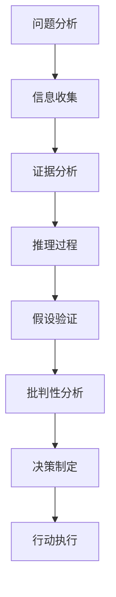

                 

# 批判性思维：基于事实来分析，做出更优的决定或解决问题

> 关键词：批判性思维, 事实驱动, 决策优化, 问题解决, 数据科学, 人工智能

## 1. 背景介绍

### 1.1 问题由来

在当今信息爆炸的时代，我们每天都会接触到大量的数据和信息。面对这些数据，如何从中提取出有用的信息，进行合理的分析，并据此做出明智的决策，是现代社会亟需解决的问题。尤其在工作和学习中，我们需要快速、准确地处理信息，做出高效决策，批判性思维成为了关键技能。

### 1.2 问题核心关键点

批判性思维是指通过理性的判断、分析，评估和选择证据来形成基于事实的决策或解决问题的能力。它包括四个基本步骤：

1. **分析问题**：识别问题核心，明确目标和范围。
2. **收集信息**：寻找和选择相关、可靠的信息来源。
3. **分析证据**：评估信息的准确性、相关性和全面性。
4. **得出结论**：基于分析结果，做出决策或解决问题。

这些步骤构成了批判性思维的核心框架，适用于各种情境下的决策和问题解决。

### 1.3 问题研究意义

批判性思维能力不仅对于个人学习和工作具有重要意义，还能提升组织和社会的整体决策水平，减少信息过载带来的负面影响。尤其在数据驱动的决策过程中，批判性思维能帮助我们从海量数据中提取有价值的信息，避免偏见和误导，做出更加合理和有效的决策。

## 2. 核心概念与联系

### 2.1 核心概念概述

批判性思维强调事实和证据在决策和问题解决中的关键作用。以下是几个核心概念的介绍：

- **事实(Fact)**：客观存在并能被证实的信息。
- **证据(Evidence)**：用来支持或反驳某个观点的信息。
- **推理(Inference)**：从已知信息推断出新信息的过程。
- **假设(Hypothesis)**：基于现有证据提出的解释或预测。
- **批判性分析(Critical Analysis)**：对信息、假设和推理的批判性评估。
- **决策(Decision)**：基于分析和评估做出的选择。

这些概念之间的联系紧密，形成了一个完整的决策或问题解决过程。

### 2.2 核心概念原理和架构的 Mermaid 流程图



这个流程图展示了批判性思维的流程：从问题分析开始，收集相关信息，分析证据，进行推理，验证假设，进行批判性分析，最后制定决策并执行。

## 3. 核心算法原理 & 具体操作步骤

### 3.1 算法原理概述

批判性思维的算法原理主要基于逻辑和统计学，强调事实和证据的重要性。在算法执行过程中，我们通过以下几个步骤进行批判性思维的实施：

1. **问题定义**：明确问题的核心，确定目标和范围。
2. **数据收集**：选择和收集相关的、可靠的数据来源。
3. **数据清洗**：去除噪声和错误数据，确保数据质量。
4. **数据分析**：使用统计方法和数据挖掘技术，分析数据关系和趋势。
5. **模型构建**：根据分析结果，构建模型或框架，支持决策。
6. **模型验证**：使用交叉验证等方法，评估模型性能和稳定性。
7. **决策制定**：根据模型和分析结果，制定最优决策。

### 3.2 算法步骤详解

批判性思维的算法步骤可以分为以下四个阶段：

**阶段一：问题定义与目标设定**

1. **问题定义**：明确问题的核心和范围，避免过度泛化或缩小。
2. **目标设定**：确定决策或问题解决的目标，并细化成具体指标。

**阶段二：信息收集与数据准备**

1. **数据来源选择**：选择可靠的、相关的数据来源，包括文献、数据库、实验数据等。
2. **数据清洗与预处理**：去除噪声、缺失值和异常值，确保数据质量。

**阶段三：数据分析与模型构建**

1. **统计分析**：使用描述性统计、相关性分析等方法，初步了解数据特征。
2. **假设检验**：提出假设，并使用统计方法检验其正确性。
3. **模型构建**：根据数据分析结果，构建合适的统计模型或算法模型。

**阶段四：决策制定与结果评估**

1. **决策制定**：基于模型结果，制定最优决策或解决方案。
2. **结果评估**：使用指标（如准确率、召回率、F1值等）评估模型和决策结果。
3. **反馈迭代**：根据评估结果，反馈调整模型和决策过程。

### 3.3 算法优缺点

**优点**：

1. **基于事实**：通过系统性的数据收集和分析，避免了主观偏见和误导。
2. **科学性**：使用统计学和数据挖掘技术，提高了决策的科学性和准确性。
3. **灵活性**：适用于各种问题的分析和解决，适用范围广。

**缺点**：

1. **数据依赖性**：决策的科学性和可靠性依赖于数据的质量和完整性。
2. **模型复杂性**：模型构建和分析过程较为复杂，需要一定的专业知识和技能。
3. **成本较高**：数据收集和模型构建需要大量时间和资源，成本较高。

### 3.4 算法应用领域

批判性思维的算法原理广泛应用于各个领域，包括但不限于：

- **科学研究**：在科学研究中，通过数据分析和模型构建，验证假设，推动知识进步。
- **商业决策**：在商业决策中，通过数据挖掘和统计分析，制定最优营销策略和运营计划。
- **医疗诊断**：在医疗诊断中，通过数据分析和模型构建，辅助医生进行诊断和治疗方案制定。
- **金融分析**：在金融分析中，通过数据分析和风险模型，评估市场风险和投资机会。
- **教育评估**：在教育评估中，通过数据分析和模型构建，评估教学效果和学习成果。

## 4. 数学模型和公式 & 详细讲解 & 举例说明

### 4.1 数学模型构建

在批判性思维的算法中，数学模型和统计方法是关键工具。以下是几个常用的数学模型：

- **线性回归模型**：用于分析变量之间的关系。
- **逻辑回归模型**：用于分类问题，预测二元变量的取值。
- **决策树模型**：用于分类和回归问题，通过树形结构进行决策。
- **支持向量机(SVM)**：用于分类和回归问题，通过寻找最优超平面进行分类。

### 4.2 公式推导过程

以线性回归模型为例，其基本公式为：

$$
y = \beta_0 + \beta_1 x_1 + \beta_2 x_2 + \cdots + \beta_n x_n + \epsilon
$$

其中，$y$为因变量，$x_1, x_2, \cdots, x_n$为自变量，$\beta_0, \beta_1, \cdots, \beta_n$为模型参数，$\epsilon$为误差项。

线性回归模型的推导过程如下：

1. **最小二乘法**：最小化误差平方和，求解模型参数。
2. **正则化**：加入正则项，避免过拟合，提高模型泛化能力。
3. **模型验证**：使用交叉验证等方法，评估模型性能。

### 4.3 案例分析与讲解

**案例：预测销售额**

某零售公司希望通过历史销售数据预测未来销售额。收集了过去两年的月销售额数据，以及市场调查和季节性因素数据。使用线性回归模型进行预测，步骤如下：

1. **问题定义**：预测未来一个月的销售额。
2. **数据收集**：收集历史销售数据、市场调查数据和季节性因素数据。
3. **数据清洗**：去除异常值和噪声，确保数据质量。
4. **模型构建**：使用线性回归模型，构建销售额预测模型。
5. **模型验证**：使用交叉验证方法评估模型性能，调整参数。
6. **决策制定**：基于模型结果，制定未来一个月的销售策略。

## 5. 项目实践：代码实例和详细解释说明

### 5.1 开发环境搭建

在进行批判性思维的算法实践前，需要准备好开发环境。以下是使用Python和SciPy进行数据分析和模型构建的环境配置流程：

1. 安装Anaconda：从官网下载并安装Anaconda，用于创建独立的Python环境。
2. 创建并激活虚拟环境：
```bash
conda create -n pyenv python=3.8 
conda activate pyenv
```

3. 安装SciPy：
```bash
conda install scipy
```

4. 安装NumPy、Pandas和Matplotlib等工具包：
```bash
pip install numpy pandas matplotlib scipy statsmodels
```

完成上述步骤后，即可在`pyenv`环境中进行批判性思维的算法实践。

### 5.2 源代码详细实现

以下是一个使用SciPy进行线性回归模型构建和分析的Python代码实现：

```python
import numpy as np
from scipy import stats

# 构造数据
x = np.array([1, 2, 3, 4, 5])
y = np.array([2, 4, 5, 6, 8])

# 进行线性回归
slope, intercept, r_value, p_value, std_err = stats.linregress(x, y)

# 打印结果
print(f"Slope: {slope}, Intercept: {intercept}, R-squared: {r_value**2}")
```

### 5.3 代码解读与分析

**数据构造**：使用NumPy构造一个简单的数据集，包含两个变量$x$和$y$。

**线性回归**：使用SciPy的`linregress`函数进行线性回归分析，得到斜率、截距、相关系数、$p$值和标准误差。

**结果输出**：打印线性回归的斜率、截距、决定系数（$R^2$）等关键结果。

## 6. 实际应用场景

### 6.1 科学研究

在科学研究中，批判性思维的算法广泛应用于数据分析和模型构建。例如，在天文学中，通过分析恒星光谱数据，可以使用线性回归模型预测恒星的亮度和运动轨迹。

### 6.2 商业决策

在商业决策中，批判性思维的算法可以帮助企业分析市场趋势、客户行为和竞争对手动态。例如，使用回归分析预测销售趋势，制定销售策略和库存管理计划。

### 6.3 医疗诊断

在医疗诊断中，批判性思维的算法可以帮助医生分析病人数据，制定诊断和治疗方案。例如，使用线性回归模型预测病人的康复概率，辅助医生进行决策。

### 6.4 金融分析

在金融分析中，批判性思维的算法可以评估市场风险和投资机会。例如，使用线性回归模型预测股票价格，进行投资组合优化。

## 7. 工具和资源推荐

### 7.1 学习资源推荐

为了帮助开发者系统掌握批判性思维的算法原理和实践技巧，这里推荐一些优质的学习资源：

1. 《批判性思维与决策科学》：系统介绍批判性思维的基本原理和应用方法。
2. 《统计学习方法》：介绍机器学习中的经典统计方法，如回归分析、分类等。
3. 《Python数据分析与可视化》：使用Python进行数据分析和可视化，支持批判性思维的应用实践。
4. 《数据科学导论》：全面介绍数据科学的基础知识，包括数据收集、清洗、分析和可视化。
5. 《数据挖掘与统计学习》：介绍数据挖掘和统计学习的基本方法和技术，涵盖回归分析、分类、聚类等。

通过对这些资源的学习实践，相信你一定能够快速掌握批判性思维的算法原理和实践技巧，用于解决实际的决策和问题。

### 7.2 开发工具推荐

高效的开发离不开优秀的工具支持。以下是几款用于批判性思维算法开发的常用工具：

1. Python：基于Python的开源语言，具有丰富的数据科学库和分析工具。
2. Scikit-learn：基于Python的机器学习库，提供简单易用的回归分析、分类、聚类等方法。
3. Jupyter Notebook：交互式的笔记本环境，支持代码编写和结果展示。
4. R语言：专门用于统计分析的数据科学语言，拥有丰富的统计函数和图形工具。
5. MATLAB：基于数学语言的计算工具，支持矩阵运算和高级统计分析。

合理利用这些工具，可以显著提升批判性思维的算法开发效率，加快创新迭代的步伐。

### 7.3 相关论文推荐

批判性思维的算法原理源于学界的持续研究。以下是几篇奠基性的相关论文，推荐阅读：

1. "Linear Regression and Correlation"：阐述线性回归模型的基本原理和应用。
2. "The Elements of Statistical Learning"：介绍统计学习的基础理论和算法，涵盖回归分析、分类、聚类等。
3. "Machine Learning Yearning"：介绍机器学习的基本流程和技巧，包括数据收集、模型选择和评估。
4. "Critical Thinking in Data Science"：探讨批判性思维在数据科学中的应用，涵盖问题定义、数据收集、模型构建和决策制定等步骤。
5. "Data Science for Business"：介绍数据科学在商业决策中的应用，涵盖数据收集、分析和应用。

这些论文代表了大语言模型微调技术的发展脉络。通过学习这些前沿成果，可以帮助研究者把握学科前进方向，激发更多的创新灵感。

## 8. 总结：未来发展趋势与挑战

### 8.1 总结

本文对批判性思维的算法原理进行了全面系统的介绍。首先阐述了批判性思维在数据驱动决策中的重要性，明确了事实和证据在决策和问题解决中的关键作用。其次，从原理到实践，详细讲解了批判性思维的数学模型和关键步骤，给出了批判性思维的算法实践实例。同时，本文还广泛探讨了批判性思维在科学研究、商业决策、医疗诊断、金融分析等领域的实际应用，展示了其在各个领域中的巨大潜力。此外，本文精选了批判性思维的相关学习资源，力求为读者提供全方位的技术指引。

通过本文的系统梳理，可以看到，批判性思维的算法原理为数据驱动决策提供了坚实的理论基础和实践工具，广泛应用于各种情境下的决策和问题解决。批判性思维不仅能提高决策的科学性和准确性，还能减少信息过载带来的负面影响，提升组织和社会的整体决策水平。未来，伴随数据分析和机器学习技术的进一步发展，批判性思维的应用将更加广泛和深入。

### 8.2 未来发展趋势

展望未来，批判性思维的算法原理将呈现以下几个发展趋势：

1. **数据驱动决策**：随着数据量的增加，数据驱动决策将越来越普遍，批判性思维在其中的重要性将进一步凸显。
2. **跨领域应用**：批判性思维的算法原理不仅适用于单一领域，还能跨领域应用，解决更复杂的问题。
3. **自动化和智能化**：批判性思维的算法原理将与人工智能技术结合，提高决策的自动化和智能化水平。
4. **数据隐私和安全**：在数据驱动决策过程中，数据隐私和安全问题将受到更多关注，批判性思维的算法原理需要在保护隐私的同时进行决策。
5. **多模态融合**：批判性思维的算法原理将融合多模态数据，提高决策的全面性和准确性。

这些趋势表明，批判性思维的算法原理将不断演变和扩展，为各种复杂问题的解决提供强大的支持。

### 8.3 面临的挑战

尽管批判性思维的算法原理已经取得了重要进展，但在迈向更加智能化、普适化应用的过程中，它仍面临以下挑战：

1. **数据质量问题**：高质量的数据是批判性思维算法的核心，但数据质量往往存在差异，如何提高数据质量是一个重要挑战。
2. **模型复杂性**：随着数据复杂性的增加，模型的构建和分析变得更为复杂，需要更多的时间和技术投入。
3. **计算资源需求**：大规模数据分析和模型构建需要大量的计算资源，如何高效利用计算资源是一个关键问题。
4. **结果解释性**：批判性思维的算法结果往往缺乏可解释性，如何提高模型的透明性和可解释性是一个重要研究方向。
5. **跨学科应用**：批判性思维的算法原理在跨学科应用时，需要结合领域知识，进行定制化设计和优化。

### 8.4 研究展望

面对批判性思维算法原理面临的挑战，未来的研究需要在以下几个方面寻求新的突破：

1. **数据增强与预处理**：开发更多数据增强和预处理方法，提高数据质量。
2. **高效模型构建**：研究高效模型构建算法，降低计算复杂性。
3. **可解释性技术**：开发可解释性技术，提高模型的透明性和可解释性。
4. **跨学科应用**：结合领域知识，开发适用于不同领域的批判性思维算法。
5. **多模态融合**：研究多模态数据的融合技术，提高决策的全面性和准确性。

这些研究方向将为批判性思维的算法原理带来新的突破，推动其在各个领域中的应用。

## 9. 附录：常见问题与解答

**Q1：批判性思维与数据驱动决策有什么区别？**

A: 批判性思维是一种基于事实和证据的决策方法，强调系统性的数据收集和分析，以减少偏见和误导。而数据驱动决策则是利用数据进行决策的一种方法，旨在通过数据分析和模型构建，优化决策过程。批判性思维和数据驱动决策是相辅相成的，前者提供了决策的科学性和准确性，后者提供了数据的驱动性和效率。

**Q2：批判性思维如何应用于复杂问题？**

A: 在复杂问题的解决中，批判性思维需要以下步骤：
1. **问题定义**：明确问题核心和目标。
2. **信息收集**：收集相关、可靠的信息。
3. **数据清洗**：去除噪声和错误数据，确保数据质量。
4. **数据分析**：使用统计方法和数据挖掘技术，分析数据关系和趋势。
5. **模型构建**：根据数据分析结果，构建合适的模型或算法。
6. **决策制定**：基于模型和分析结果，制定最优决策。
7. **结果评估**：使用指标评估模型和决策结果，进行反馈迭代。

**Q3：批判性思维是否适用于所有领域？**

A: 批判性思维适用于各种领域的决策和问题解决，但需要结合领域知识进行定制化设计和优化。例如，在医疗领域，批判性思维需要结合医学知识进行诊断和治疗方案制定；在金融领域，批判性思维需要结合经济学知识进行市场分析和投资策略制定。

**Q4：批判性思维与人工智能技术的关系是什么？**

A: 批判性思维与人工智能技术可以相互促进。批判性思维提供了数据驱动决策的科学性和准确性，而人工智能技术提供了数据的自动化分析和处理能力，两者结合可以实现更加高效和智能的决策。

**Q5：批判性思维在实际应用中需要注意哪些问题？**

A: 在实际应用中，批判性思维需要注意以下问题：
1. **数据质量**：确保数据的可靠性和完整性，避免偏见和误导。
2. **模型复杂性**：选择合适的模型和算法，避免过度拟合和过拟合。
3. **计算资源**：合理利用计算资源，提高效率和降低成本。
4. **结果解释性**：提高模型的透明性和可解释性，增强用户信任。

这些问题的解决需要系统性的思考和实践，才能确保批判性思维的算法原理在实际应用中的有效性和可靠性。

---

作者：禅与计算机程序设计艺术 / Zen and the Art of Computer Programming

