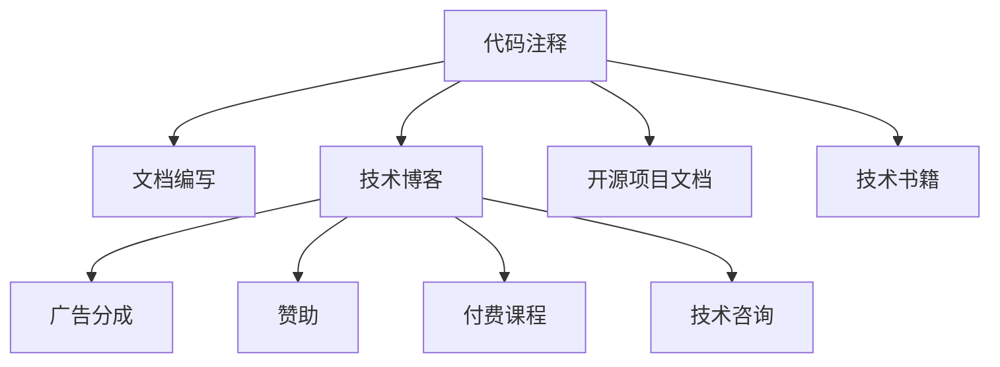

                 

# 技术写作：程序员的副业选择

> 关键词：技术写作, 副业, 编程, 博客, 技术博客, 内容创作, 软件工程, 技术分享, 知识传递

## 1. 背景介绍

### 1.1 问题由来

随着技术的不断进步和互联网的普及，编程已经不再是一个仅仅为公司创造价值的职业，而是一种生活方式。对于许多程序员而言，通过技术写作分享知识，不仅能够扩大自己的影响力和知名度，还能增加额外的收入来源。本文将从背景、定义、目的、内容、工具和应用等方面，对技术写作这一程序员的副业选择进行深入探讨。

### 1.2 问题核心关键点

技术写作是程序员通过撰写技术类文章、博客、教程等方式，将自身的编程经验、知识体系和思考方式分享出去的过程。通过技术写作，程序员不仅能够记录自己的学习心得，还能帮助其他人理解复杂的编程概念和问题。同时，技术写作还能为程序员带来新的收入来源，如广告分成、赞助、付费课程、技术咨询等。

## 2. 核心概念与联系

### 2.1 核心概念概述

技术写作涵盖了从代码注释、文档编写、技术博客、开源项目文档、技术书籍等多种形式。它的核心目标是通过清晰、准确、生动的语言，将复杂的编程知识传递给他人。技术写作不仅是程序员展示自身技术能力的舞台，更是建立个人品牌、拓展职业发展的重要手段。

### 2.2 核心概念原理和架构的 Mermaid 流程图



这个流程图展示了技术写作的多种形式及其带来的不同收入来源。

## 3. 核心算法原理 & 具体操作步骤

### 3.1 算法原理概述

技术写作的原理可以简单概括为“以用户为中心，以内容为王”。即通过深入浅出的讲解，将复杂的编程问题简化，使读者能够快速理解和掌握。以下是技术写作的算法原理概述：

1. **选题与定位**：确定写作主题，并根据受众需求进行内容定位。
2. **资料搜集与整理**：收集相关资料和数据，并根据需要进行整理。
3. **内容创作与撰写**：通过逻辑清晰、语言生动的文字表达，呈现编程知识。
4. **审核与发布**：对写作内容进行校对、审核，确保准确性和可读性，并在合适平台发布。
5. **反馈与迭代**：收集读者反馈，不断优化和改进写作内容。

### 3.2 算法步骤详解

#### 3.2.1 选题与定位

- **市场调研**：分析市场需求，选择有潜力的主题。
- **受众分析**：了解目标读者的背景、知识水平和兴趣点。
- **内容定位**：明确文章的目标，是介绍编程语言、框架、工具，还是解决问题的技巧。

#### 3.2.2 资料搜集与整理

- **收集资料**：包括官方文档、书籍、博客、论文等。
- **整理资料**：分类、归纳、整理，提炼关键点。

#### 3.2.3 内容创作与撰写

- **大纲设计**：制定文章结构，包括引言、正文、结论等。
- **编写草稿**：按照大纲逐步撰写文章，注重逻辑性和可读性。
- **审校修改**：多次校对、修改，确保内容的准确性和可理解性。

#### 3.2.4 审核与发布

- **自审**：对文章进行语言、逻辑、内容的自审。
- **同行评审**：邀请领域内专家或同行评审文章，提出修改意见。
- **平台发布**：选择合适的平台（如Medium、CSDN、GitHub Pages等）进行发布。

#### 3.2.5 反馈与迭代

- **收集反馈**：通过评论、邮件、社交媒体等方式收集读者反馈。
- **分析反馈**：分析反馈内容，找出改进点。
- **迭代改进**：根据反馈进行修改和优化，并发布更新版。

### 3.3 算法优缺点

#### 3.3.1 优点

1. **知识共享**：通过技术写作，程序员能够将自己的知识传递给他人，帮助他人学习和发展。
2. **品牌建设**：通过持续的技术写作，可以建立个人品牌，增加个人影响力。
3. **收入来源**：通过广告分成、赞助、付费课程、技术咨询等方式，增加额外收入。
4. **自我提升**：写作过程本身也是学习和提升的过程，能够加深对编程知识的理解和掌握。

#### 3.3.2 缺点

1. **时间投入**：技术写作需要大量的时间和精力，可能影响本职工作。
2. **写作门槛**：需要具备较强的写作能力和表达能力，对语言和逻辑要求较高。
3. **市场需求**：部分主题可能受众有限，导致写作效果不佳。
4. **竞争激烈**：技术写作市场竞争激烈，需要不断创新和提升。

### 3.4 算法应用领域

技术写作可以应用于以下领域：

- **技术博客**：分享编程经验、技术思考、行业动态等。
- **开源项目文档**：编写项目文档、代码注释、使用指南等。
- **技术书籍**：撰写深入浅出的技术书籍，介绍编程知识和最佳实践。
- **技术培训**：通过在线课程、视频教程等方式，教授编程技能。
- **技术咨询**：提供专业咨询，帮助企业解决技术问题。

## 4. 数学模型和公式 & 详细讲解 & 举例说明

### 4.1 数学模型构建

技术写作的数学模型主要关注如何通过合理的结构和内容布局，使读者能够快速理解和掌握编程知识。以下是数学模型构建的基本步骤：

1. **选题与定位**：$选题 = 市场调研 + 受众分析 + 内容定位$
2. **资料搜集与整理**：$资料 = 官方文档 + 书籍 + 博客 + 论文$
3. **内容创作与撰写**：$内容 = 大纲 + 草稿 + 审校$
4. **审核与发布**：$发布 = 自审 + 同行评审 + 平台发布$
5. **反馈与迭代**：$迭代 = 反馈收集 + 分析 + 修改优化$

### 4.2 公式推导过程

假设有一篇关于Python编程的文章，其数学模型可以表示为：

$$
\text{文章质量} = f(\text{选题与定位}, \text{资料搜集与整理}, \text{内容创作与撰写}, \text{审核与发布}, \text{反馈与迭代})
$$

其中：

- 选题与定位（$a_1$）：确定文章主题和受众，评分$0.5$
- 资料搜集与整理（$a_2$）：搜集相关资料，评分$0.3$
- 内容创作与撰写（$a_3$）：编写文章草稿并多次修改，评分$0.2$
- 审核与发布（$a_4$）：自审和同行评审，评分$0.1$
- 反馈与迭代（$a_5$）：根据反馈进行修改和优化，评分$0.1$

总评分为各部分乘积之和。

### 4.3 案例分析与讲解

#### 案例1：Python进阶指南

某技术博客作者撰写了一篇名为《Python进阶指南》的文章，介绍了Python的高级特性和编程技巧。文章内容分为以下几个部分：

1. **选题与定位**：确定文章主题为Python进阶，受众为有一定编程基础的读者。
2. **资料搜集与整理**：搜集Python官方文档、书籍、博客，并整理成关键点。
3. **内容创作与撰写**：设计文章结构，编写草稿，并进行多次修改。
4. **审核与发布**：自审并通过同行评审，发布在Medium上。
5. **反馈与迭代**：收集读者评论，分析并优化文章内容。

文章发布后，获得了大量点赞和分享，作者也收到了一些付费课程和咨询的邀请。

## 5. 项目实践：代码实例和详细解释说明

### 5.1 开发环境搭建

- **环境搭建**：安装Python、Markdown编辑器、GitHub Pages等工具。
- **版本控制**：使用Git进行版本控制，提交代码和文档。
- **自动化部署**：通过Jekyll或Hugo等工具，自动部署文章到GitHub Pages上。

### 5.2 源代码详细实现

以下是一个简单的技术写作示例，介绍如何撰写一篇关于Python函数式编程的文章。

```python
# 文章标题
title = "Python函数式编程入门"

# 文章内容
content = [
    "函数式编程的基本概念",
    "Python中的函数式编程示例",
    "函数式编程的优缺点",
    "实际应用案例"
]

# 生成Markdown文件
with open("文章.md", "w") as f:
    f.write("# " + title + "\n")
    f.write("\n")
    for item in content:
        f.write("## " + item + "\n")
        f.write("\n")
        # 添加代码示例
        f.write("```python\n")
        f.write(item)
        f.write("```\n")
        f.write("\n")

# 提交到GitHub
!git add .
!git commit -m "添加文章内容"
```

### 5.3 代码解读与分析

该代码示例通过Python脚本，生成了一篇Markdown格式的文章。具体步骤如下：

1. **文章标题**：定义文章标题，并写入文件。
2. **文章内容**：定义文章内容，包括多个小标题和代码示例。
3. **生成Markdown文件**：使用Python脚本生成Markdown文件，包括标题和代码示例。
4. **提交到GitHub**：通过Git命令提交文件到GitHub，进行版本控制。

### 5.4 运行结果展示

运行上述代码后，将生成名为`文章.md`的Markdown文件，文件内容如下：

```markdown
# Python函数式编程入门

## 函数式编程的基本概念

函数式编程是一种编程范式，强调函数的组合和纯函数的使用。在函数式编程中，数据是只读的，函数的输出只依赖于输入，不存在副作用。

## Python中的函数式编程示例

Python支持函数式编程的基本概念，可以通过lambda表达式、map、filter等函数实现。以下是一个简单的示例：

```python
# 定义一个列表
lst = [1, 2, 3, 4, 5]

# 使用map函数进行平方
squared = map(lambda x: x ** 2, lst)

# 输出结果
print(list(squared))
```

输出结果为：`[1, 4, 9, 16, 25]`

## 函数式编程的优缺点

函数式编程的优点包括代码简洁、易于测试、并发性高。缺点包括可读性差、难以理解、性能较低。

## 实际应用案例

函数式编程在实际应用中有很多成功案例，如Spotify的Scala、Facebook的Reason。以下是一个简单的使用函数式编程解决实际问题的例子：

```python
# 定义一个函数，将列表中的偶数取出并平方
def square_even(lst):
    return list(filter(lambda x: x % 2 == 0, lst))

# 测试函数
lst = [1, 2, 3, 4, 5, 6]
print(square_even(lst))
```

输出结果为：`[2, 4, 6]`

## 总结

函数式编程是一种重要的编程范式，Python也支持函数式编程的基本概念。通过实际应用，我们可以看到函数式编程的优点和缺点。希望本文能够帮助读者更好地理解函数式编程，并应用于实际开发中。

```python
```

## 6. 实际应用场景

### 6.1 技术博客

技术博客是程序员分享知识和经验的重要平台。通过博客，程序员可以记录自己的学习心得，分享编程技巧，建立个人品牌。例如，Medium、CSDN等平台提供了丰富的工具和资源，使技术写作变得更加便捷。

### 6.2 开源项目文档

开源项目文档是开发者与用户沟通的重要桥梁。通过详细、易懂的文档，用户可以更好地理解和使用项目。例如，TensorFlow、PyTorch等项目的官方文档，都是由开发者撰写和维护的。

### 6.3 技术书籍

技术书籍是深入学习编程知识的有效途径。通过撰写技术书籍，程序员可以将复杂的知识体系整理成易于理解的形式。例如，《Clean Code》、《Design Patterns》等经典书籍，都是由程序员编写和出版的。

### 6.4 技术培训

技术培训是程序员分享知识的重要方式。通过在线课程、视频教程等方式，程序员可以向更多人传授编程技能。例如，Coursera、Udemy等平台提供了丰富的在线课程资源。

### 6.5 技术咨询

技术咨询是程序员提供专业意见的服务方式。通过技术咨询，程序员可以为企业解决技术问题，提供专业的解决方案。例如，Stack Overflow、Codewars等平台提供技术咨询和问题解答服务。

## 7. 工具和资源推荐

### 7.1 学习资源推荐

- **Medium**：一个面向全球读者的技术写作平台，支持多种语言和主题，可以发布文章并获得读者反馈。
- **CSDN**：国内知名的技术博客和社区平台，提供丰富的编程资源和交流平台。
- **GitHub Pages**：一个免费的静态网站托管服务，可以方便地将Markdown文件部署为博客。
- **Coursera**：提供大量在线课程和专业证书，帮助程序员提升技能。
- **Udemy**：一个面向全球的在线学习平台，提供丰富的编程课程和资源。

### 7.2 开发工具推荐

- **PyTorch**：一个流行的深度学习框架，支持动态图和静态图，适用于各种机器学习和深度学习项目。
- **TensorFlow**：一个广泛使用的深度学习框架，支持分布式计算和模型部署。
- **Jekyll**：一个基于Ruby的静态网站生成器，可以方便地将Markdown文件生成博客。
- **GitHub**：一个版本控制系统，支持代码托管和协作开发。
- **Hugo**：一个基于Go语言的静态网站生成器，性能高，易于扩展。

### 7.3 相关论文推荐

- **《The Art of Technical Writing》**：一本关于技术写作的经典书籍，介绍了技术写作的各个方面，包括选题、撰写、审核等。
- **《Technical Writing in Action》**：一本实用的技术写作指南，提供了大量的写作技巧和实例。
- **《Effective Technical Writing》**：一本关于技术写作的实用书籍，介绍了如何写作易于理解、清晰准确的文章。

## 8. 总结：未来发展趋势与挑战

### 8.1 研究成果总结

技术写作作为程序员的副业选择，已经成为一种广泛认可的职业发展路径。通过技术写作，程序员不仅能够分享知识，还能提升自身技能，增加收入来源。技术写作的应用领域广泛，涵盖技术博客、开源项目文档、技术书籍、技术培训和技术咨询等多种形式。

### 8.2 未来发展趋势

未来技术写作将呈现以下发展趋势：

1. **多样化**：技术写作形式将更加多样化，包括视频、播客、播客笔记等。
2. **个性化**：技术写作将更加个性化，满足不同受众的需求。
3. **全球化**：技术写作将打破地域限制，全球范围内传播和交流。
4. **互动化**：技术写作将更加注重互动和反馈，提升写作效果。
5. **自动化**：技术写作将引入自动化工具，提高写作效率和质量。

### 8.3 面临的挑战

尽管技术写作具有广阔的发展前景，但在实践中仍面临一些挑战：

1. **时间投入**：技术写作需要大量的时间和精力，可能影响本职工作。
2. **写作门槛**：需要具备较强的写作能力和表达能力，对语言和逻辑要求较高。
3. **市场需求**：部分主题可能受众有限，导致写作效果不佳。
4. **竞争激烈**：技术写作市场竞争激烈，需要不断创新和提升。
5. **质量控制**：技术写作需要严格的质量控制，确保文章的准确性和可读性。

### 8.4 研究展望

未来的技术写作研究将关注以下几个方向：

1. **写作辅助工具**：开发更多写作辅助工具，提高写作效率和质量。
2. **写作标准化**：制定技术写作的标准和规范，提升写作水平和效果。
3. **写作社区**：建立技术写作社区，促进知识交流和分享。
4. **写作评估体系**：建立技术写作的评估体系，衡量写作效果和质量。
5. **写作伦理**：研究技术写作的伦理问题，确保写作内容的真实性和准确性。

## 9. 附录：常见问题与解答

**Q1：如何选择适合自己的技术写作主题？**

A: 选择技术写作主题时，可以考虑以下因素：
- 兴趣和热情：选择自己感兴趣和有热情的主题，容易保持动力。
- 受众需求：了解目标受众的需求，选择有潜力的主题。
- 市场需求：选择有市场需求和技术热点的主题。
- 个人优势：发挥自己的优势和专长，选择擅长的主题。

**Q2：如何提高技术写作的质量？**

A: 提高技术写作的质量可以从以下几个方面入手：
- 深入理解：深入理解所写主题，确保内容的准确性和完整性。
- 简洁明了：使用简洁明了的语言，避免冗长和复杂的表达。
- 示例和实例：通过代码示例和实例，帮助读者更好地理解内容。
- 审校和反馈：多次审校文章，并根据读者反馈进行修改和优化。

**Q3：如何平衡技术写作和本职工作？**

A: 平衡技术写作和本职工作可以从以下几个方面入手：
- 时间管理：合理安排时间，将写作时间纳入工作计划。
- 优先级排序：根据重要性和紧急性，优先完成重要的技术写作任务。
- 自动化工具：使用自动化工具，提高写作效率。
- 团队协作：与团队成员协作，分工合作，分担写作负担。

---

作者：禅与计算机程序设计艺术 / Zen and the Art of Computer Programming

