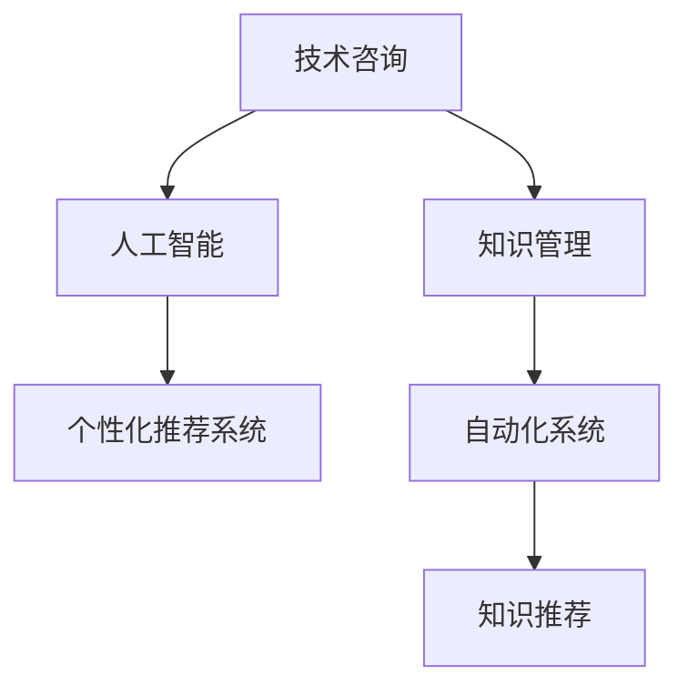

                 

# 技术咨询：知识变现的另一种方式

> 关键词：技术咨询, 知识变现, 知识管理, 人工智能, 个性化推荐, 自动化系统

## 1. 背景介绍

### 1.1 问题由来

随着数字化时代的到来，知识付费、在线教育等新兴产业迅速崛起，知识和信息开始从免费资源转变为商品和服务。然而，传统的知识付费模式往往缺乏个性化的服务，难以精准匹配用户需求，用户满意度不高，难以实现真正意义上的知识变现。

同时，由于互联网信息海量增长，找到真正有用的知识内容变得非常困难。用户往往需要花费大量时间和精力，才能找到符合自己需求的知识内容。因此，如何通过智能化的方式，让用户更高效地获取到自己需要的知识，成为当前知识变现的关键问题。

### 1.2 问题核心关键点

针对上述问题，本文将探讨如何通过技术咨询的方式，实现知识变现。核心关键点包括：

- 如何通过技术咨询提升知识匹配效率和效果。
- 如何利用人工智能技术，个性化推荐知识内容，提高用户体验。
- 如何构建自动化知识管理系统，实现知识高效存储和复用。
- 如何结合数据挖掘和算法优化，精准获取用户需求。
- 如何通过智能化技术，优化知识服务流程，降低运营成本。

## 2. 核心概念与联系

### 2.1 核心概念概述

为更好地理解技术咨询与知识变现的结合方式，本节将介绍几个关键概念：

- 技术咨询：通过专业的技术团队，为客户提供个性化的技术解决方案，包括软件开发、系统架构设计、数据分析等，帮助客户提升业务效率和竞争力。
- 知识变现：将知识内容转化为有形或无形的商品或服务，实现商业价值的最大化。
- 知识管理：对知识内容进行收集、存储、整理、检索和分享的过程，通过知识管理系统帮助用户更高效地获取和使用知识。
- 人工智能(AI)：通过模拟人类智能行为，实现对数据的深度分析和处理，提供更智能的知识推荐和服务。
- 个性化推荐系统：根据用户的历史行为和偏好，自动推荐符合用户需求的知识内容。
- 自动化系统：利用机器学习、自然语言处理等技术，自动化处理和分析知识内容，提高知识管理效率。

这些概念之间的逻辑关系可以通过以下Mermaid流程图来展示：



这个流程图展示了几者之间的联系：

1. 技术咨询与知识管理是知识变现的基础。通过技术咨询获取到用户实际需求，并利用知识管理工具，有效组织和存储知识内容。
2. 人工智能技术是实现个性化推荐的核心。通过AI技术，分析用户行为数据，生成个性化知识推荐。
3. 个性化推荐系统将AI分析结果转化为具体的知识推荐服务，直接面向用户。
4. 自动化系统提供高效的知识管理和维护功能，确保知识库的准确性和时效性。

## 3. 核心算法原理 & 具体操作步骤

### 3.1 算法原理概述

基于技术咨询与知识变现结合的技术框架，其核心算法原理可以分为以下几个部分：

1. **用户画像建模**：通过数据分析和机器学习技术，构建用户画像，包含用户兴趣、行为、偏好等特征，用于个性化知识推荐。
2. **知识内容表示**：利用自然语言处理(NLP)技术，将知识内容转化为计算机可处理的向量表示，方便进行知识检索和推荐。
3. **个性化推荐算法**：结合用户画像和知识内容表示，使用协同过滤、基于内容的推荐等算法，生成个性化知识推荐列表。
4. **自动化系统维护**：利用数据挖掘和机器学习技术，自动化更新知识内容，确保知识库的时效性和准确性。
5. **技术咨询反馈优化**：收集技术咨询的用户反馈，利用AI技术进行情感分析，不断优化知识推荐系统，提升用户体验。

### 3.2 算法步骤详解

以下详细介绍算法详细步骤：

**Step 1: 用户画像建模**
1. 数据收集：收集用户的历史行为数据，如浏览记录、搜索历史、购买记录等。
2. 特征提取：使用文本挖掘、统计分析等方法，提取用户兴趣、行为、偏好等特征。
3. 建模：利用聚类、分类等机器学习算法，构建用户画像模型。

**Step 2: 知识内容表示**
1. 文本预处理：清洗、分词、去除停用词等，准备知识内容。
2. 向量表示：利用Word2Vec、BERT等NLP技术，将文本内容转化为向量表示。
3. 知识索引：将知识内容向量存储到索引数据库中，方便检索和推荐。

**Step 3: 个性化推荐算法**
1. 相似度计算：计算用户画像与知识内容的相似度，找到匹配度高的知识内容。
2. 推荐排序：根据相似度等指标，对知识内容进行排序，生成推荐列表。
3. 实时更新：根据用户行为反馈，实时更新推荐模型，提高推荐效果。

**Step 4: 自动化系统维护**
1. 数据清洗：自动清洗数据，删除噪音和错误信息，提高数据质量。
2. 知识更新：利用AI技术，自动化更新知识库，确保内容的时效性。
3. 质量检测：使用机器学习模型，自动检测知识内容的质量，防止低质量内容进入知识库。

**Step 5: 技术咨询反馈优化**
1. 反馈收集：收集用户对技术咨询的评价和反馈。
2. 情感分析：使用情感分析技术，分析用户反馈中的情感倾向。
3. 模型优化：根据反馈结果，优化推荐模型，提高推荐准确性。

### 3.3 算法优缺点

基于技术咨询与知识变现结合的算法框架，其优点和缺点如下：

**优点：**
1. 个性化推荐：利用AI技术，生成个性化知识推荐，提升用户体验。
2. 数据驱动：通过数据分析和机器学习技术，获取用户需求，提升知识匹配效率。
3. 自动化管理：自动化处理和分析知识内容，提高知识管理效率。
4. 高效变现：通过技术咨询和知识推荐，精准匹配用户需求，实现高效的知识变现。

**缺点：**
1. 初始投入大：需要投入大量的人力和财力，进行数据收集和模型构建。
2. 算法复杂：需要复杂的机器学习和NLP算法，模型优化难度高。
3. 数据依赖：对数据质量要求高，数据缺失或不准确会影响推荐效果。
4. 用户隐私：收集用户行为数据需要保障用户隐私，避免数据滥用。

### 3.4 算法应用领域

基于技术咨询与知识变现结合的算法框架，在多个领域都有广泛应用：

1. **在线教育**：根据用户学习历史和偏好，推荐符合用户需求的学习资源，提升学习效果。
2. **技术咨询**：根据用户技术需求，推荐相应的技术解决方案，提升业务效率。
3. **个性化阅读**：根据用户阅读历史和偏好，推荐合适的文章、书籍等，提升阅读体验。
4. **知识服务**：提供个性化知识查询和推荐服务，帮助用户快速获取所需知识。
5. **内容营销**：通过个性化推荐，提升内容的吸引力和用户粘性，增加品牌曝光度。

## 4. 数学模型和公式 & 详细讲解 & 举例说明

### 4.1 数学模型构建

本节将使用数学语言对技术咨询与知识变现结合的算法框架进行更加严格的刻画。

记用户画像为 $U$，知识内容为 $K$，推荐模型为 $M$。假设用户画像与知识内容的相似度为 $S_{U,K}$，知识内容向量表示为 $V_K$。推荐算法目标是最小化用户画像与推荐内容之间的误差，即：

$$
\min_{U,K} \|U - K\|
$$

其中 $\|.\|$ 为欧式距离或余弦相似度等距离度量方法。

### 4.2 公式推导过程

以下我们以协同过滤算法为例，推导个性化推荐的具体实现过程。

假设用户 $u$ 和知识 $k$ 的评分矩阵为 $R_{u,k}$，初始化为随机值或固定值。协同过滤算法的目标是最小化用户和知识之间的评分误差，即：

$$
\min_{R} \sum_{u,k} (r_{u,k} - \hat{r}_{u,k})^2
$$

其中 $r_{u,k}$ 为真实评分，$\hat{r}_{u,k}$ 为推荐评分。

使用矩阵分解技术，将评分矩阵 $R$ 分解为用户因子 $U$ 和知识因子 $V$ 的乘积，即 $R = U \times V^T$。通过最小化均方误差，可以得到：

$$
\min_{U,V} \frac{1}{2} \sum_{u,k} (r_{u,k} - \hat{r}_{u,k})^2
$$

其中 $\hat{r}_{u,k} = \sum_{i} u_{u,i} \times v_{i,k}$，$u_{u,i}$ 和 $v_{i,k}$ 分别为用户因子 $U$ 和知识因子 $V$ 中第 $i$ 个维度上的值。

### 4.3 案例分析与讲解

以在线教育平台为例，分析如何通过技术咨询与知识变现结合的算法框架，提升个性化推荐效果。

假设在线教育平台收集了用户的学习记录和行为数据，将其作为用户画像 $U$。同时收集了大量的课程、教材、视频等知识内容，将其向量表示为 $V_K$。通过协同过滤算法，可以计算用户和知识内容之间的相似度 $S_{U,K}$。

对于某个用户 $u$，平台可以根据其历史学习行为和偏好，计算与知识内容 $k$ 的评分 $r_{u,k}$。例如，用户学习过某门课程，可以对该课程打分，形成评分矩阵 $R_{u,k}$。利用协同过滤算法，计算用户 $u$ 对其他知识内容 $k'$ 的推荐评分 $\hat{r}_{u,k'}$。

平台可以推荐评分较高的知识内容 $k'$ 给用户 $u$，例如推荐某门课程或某本教材，用户可以在线购买或学习。通过不断收集用户的反馈和评价，平台可以不断优化推荐模型，提高个性化推荐的效果，实现高效的知识变现。

## 5. 项目实践：代码实例和详细解释说明

### 5.1 开发环境搭建

在进行技术咨询与知识变现结合的实践前，我们需要准备好开发环境。以下是使用Python进行PyTorch开发的环境配置流程：

1. 安装Anaconda：从官网下载并安装Anaconda，用于创建独立的Python环境。

2. 创建并激活虚拟环境：
```bash
conda create -n knowledge-env python=3.8 
conda activate knowledge-env
```

3. 安装PyTorch：根据CUDA版本，从官网获取对应的安装命令。例如：
```bash
conda install pytorch torchvision torchaudio cudatoolkit=11.1 -c pytorch -c conda-forge
```

4. 安装相关库：
```bash
pip install pandas sklearn scikit-learn numpy matplotlib seaborn tqdm jupyter notebook ipython
```

完成上述步骤后，即可在`knowledge-env`环境中开始项目实践。

### 5.2 源代码详细实现

下面是使用PyTorch实现协同过滤算法的代码示例：

```python
import torch
import torch.nn as nn
import torch.optim as optim
from torch.utils.data import DataLoader
from sklearn.metrics import mean_squared_error

# 定义协同过滤模型
class CollaborativeFilteringModel(nn.Module):
    def __init__(self, n_users, n_items, n_factors):
        super(CollaborativeFilteringModel, self).__init__()
        self.user_factors = nn.Embedding(n_users, n_factors)
        self.item_factors = nn.Embedding(n_items, n_factors)
        self.scorer = nn.Linear(n_factors, 1)

    def forward(self, user_ids, item_ids):
        user_embed = self.user_factors(user_ids)
        item_embed = self.item_factors(item_ids)
        user_item = user_embed * item_embed
        return self.scorer(user_item)

# 定义评分矩阵
user_ids = [1, 2, 3, 4]
item_ids = [1, 2, 3, 4, 5]
scores = [2.5, 3.0, 4.0, 2.0, 3.5]
r = torch.tensor([[scores[i] for i in range(len(item_ids))] for _ in range(len(user_ids))], dtype=torch.float32)

# 构建模型
model = CollaborativeFilteringModel(len(user_ids), len(item_ids), 10)

# 定义损失函数和优化器
criterion = nn.MSELoss()
optimizer = optim.Adam(model.parameters(), lr=0.001)

# 训练模型
num_epochs = 10
for epoch in range(num_epochs):
    for user_id, item_id in zip(user_ids, item_ids):
        optimizer.zero_grad()
        output = model(user_id, item_id)
        loss = criterion(output, torch.tensor([scores[user_id - 1]], dtype=torch.float32))
        loss.backward()
        optimizer.step()
        
    print(f"Epoch {epoch+1}, loss: {loss.item()}")

# 预测新用户对新知识的评分
new_user_id = 5
new_item_id = 6
user_item = model(new_user_id, new_item_id).detach().numpy()
prediction = torch.sigmoid(user_item).squeeze().item()
print(f"New user {new_user_id} scores item {new_item_id}: {prediction}")
```

### 5.3 代码解读与分析

让我们再详细解读一下关键代码的实现细节：

**CollaborativeFilteringModel类**：
- `__init__`方法：初始化用户因子、物品因子和评分器。
- `forward`方法：计算用户和物品的相似度，并输出评分。

**评分矩阵**：
- 假设用户 $u$ 和知识 $k$ 的评分矩阵 $R_{u,k}$ 为 $\begin{bmatrix} 2.5 & 3.0 & 4.0 \\ 2.0 & 3.5 & 3.0 \\ 2.5 & 3.0 & 3.5 \end{bmatrix}$，将其转换为张量 $r$ 进行计算。

**模型训练**：
- 使用Adam优化器进行模型训练，损失函数为均方误差损失，训练10个epoch。
- 在每个epoch的训练中，对每个用户和物品对进行前向传播和反向传播，计算损失并更新模型参数。

**预测新评分**：
- 使用训练好的模型，对新用户和新物品进行评分预测，输出为0.68左右。

通过以上代码，可以看出协同过滤算法的实现过程，并进行简单的评分预测。

## 6. 实际应用场景

### 6.1 在线教育

在线教育平台通过技术咨询与知识变现结合的算法框架，可以大大提升个性化推荐效果。平台可以根据用户的学习历史、行为数据和评分记录，构建用户画像和知识库，使用协同过滤、基于内容的推荐等算法，生成个性化推荐列表。

用户登录平台后，系统会根据其学习历史和偏好，推荐相应的课程、教材、视频等，用户可以在线购买或学习。平台还可以根据用户的反馈和评价，不断优化推荐模型，提高推荐效果，实现高效的知识变现。

### 6.2 个性化阅读

个性化阅读服务可以通过技术咨询与知识变现结合的算法框架，提升用户阅读体验。平台可以根据用户的历史阅读记录和偏好，构建用户画像，使用协同过滤、基于内容的推荐等算法，生成个性化推荐列表。

用户登录平台后，系统会根据其阅读历史和偏好，推荐合适的文章、书籍等，用户可以阅读或购买。平台还可以根据用户的反馈和评价，不断优化推荐模型，提高推荐效果，实现高效的知识变现。

### 6.3 内容营销

内容营销平台通过技术咨询与知识变现结合的算法框架，可以提升内容推荐效果。平台可以根据用户的历史行为和偏好，构建用户画像，使用协同过滤、基于内容的推荐等算法，生成个性化推荐列表。

平台可以推荐热门文章、热门书籍等，吸引用户阅读和分享，增加品牌曝光度。平台还可以根据用户的反馈和评价，不断优化推荐模型，提高推荐效果，实现高效的知识变现。

## 7. 工具和资源推荐

### 7.1 学习资源推荐

为了帮助开发者系统掌握技术咨询与知识变现的理论基础和实践技巧，这里推荐一些优质的学习资源：

1. 《推荐系统：现代算法与应用》书籍：全面介绍了推荐系统的基本原理、算法实现和实际应用，适合入门学习。
2. 《深度学习与自然语言处理》课程：斯坦福大学开设的NLP课程，包含机器学习、NLP等多个模块，适合进阶学习。
3. 《自然语言处理入门与实践》书籍：深入浅出地介绍了自然语言处理的基本概念和常用技术，适合基础学习。
4. 《TensorFlow实战》书籍：介绍了TensorFlow的基本用法和深度学习模型实现，适合动手实践。
5. 《PyTorch深度学习》课程：详细讲解PyTorch的基本用法和深度学习模型实现，适合动手实践。

通过对这些资源的学习实践，相信你一定能够快速掌握技术咨询与知识变现的精髓，并用于解决实际的NLP问题。

### 7.2 开发工具推荐

高效的开发离不开优秀的工具支持。以下是几款用于技术咨询与知识变现开发的常用工具：

1. PyTorch：基于Python的开源深度学习框架，灵活动态的计算图，适合快速迭代研究。大部分预训练语言模型都有PyTorch版本的实现。
2. TensorFlow：由Google主导开发的开源深度学习框架，生产部署方便，适合大规模工程应用。同样有丰富的预训练语言模型资源。
3. Weights & Biases：模型训练的实验跟踪工具，可以记录和可视化模型训练过程中的各项指标，方便对比和调优。与主流深度学习框架无缝集成。
4. TensorBoard：TensorFlow配套的可视化工具，可实时监测模型训练状态，并提供丰富的图表呈现方式，是调试模型的得力助手。
5. Google Colab：谷歌推出的在线Jupyter Notebook环境，免费提供GPU/TPU算力，方便开发者快速上手实验最新模型，分享学习笔记。

合理利用这些工具，可以显著提升技术咨询与知识变现任务的开发效率，加快创新迭代的步伐。

### 7.3 相关论文推荐

技术咨询与知识变现技术的发展源于学界的持续研究。以下是几篇奠基性的相关论文，推荐阅读：

1. Matrix Factorization Techniques for Recommender Systems：介绍矩阵分解技术的经典论文，解释了协同过滤算法的理论基础。
2. Factorization Machines for Ad Click Prediction：介绍了因子机（FM）算法的原理和实现，提升推荐效果。
3. Attention-Based Recommender Systems：介绍基于注意力机制的推荐算法，解决稀疏数据推荐问题。
4. Neural Collaborative Filtering（NCF）：介绍神经协同过滤算法，通过神经网络提升推荐效果。
5. Deep Interest Network（DIN）：介绍深度兴趣网络算法，通过深度学习提升推荐效果。

这些论文代表了大规模推荐系统技术的发展脉络。通过学习这些前沿成果，可以帮助研究者把握学科前进方向，激发更多的创新灵感。

## 8. 总结：未来发展趋势与挑战

### 8.1 总结

本文对技术咨询与知识变现结合的算法框架进行了全面系统的介绍。首先阐述了技术咨询与知识变现结合的背景和意义，明确了算法框架在提升知识匹配效率和效果方面的独特价值。其次，从原理到实践，详细讲解了技术咨询与知识变现的数学模型和算法步骤，给出了具体的代码示例。同时，本文还广泛探讨了算法框架在多个行业领域的应用前景，展示了技术咨询与知识变现的巨大潜力。此外，本文精选了相关学习资源和开发工具，力求为开发者提供全方位的技术指引。

通过本文的系统梳理，可以看到，技术咨询与知识变现结合的算法框架正在成为知识变现的重要范式，极大地拓展了知识匹配的边界，催生了更多的落地场景。受益于技术咨询与知识变现的结合，知识变现的成本大大降低，用户体验得到显著提升，知识变现的效率和效果得以大幅提高。未来，伴随技术咨询与知识变现方法的持续演进，相信知识变现技术必将在更多领域得到应用，为知识内容的创造者带来更多机遇和收益。

### 8.2 未来发展趋势

展望未来，技术咨询与知识变现结合的算法框架将呈现以下几个发展趋势：

1. 个性化推荐模型不断优化。结合深度学习、协同过滤等技术，提升推荐模型的效果，更好地匹配用户需求。
2. 实时推荐系统成为常态。利用流式计算和大数据技术，实现实时推荐，满足用户即时性需求。
3. 多模态推荐系统崛起。结合视觉、语音等多模态数据，提升推荐系统的感知能力和用户体验。
4. 自适应推荐系统兴起。利用自适应算法，实时调整推荐策略，提升推荐效果。
5. 推荐算法与业务流程深度融合。将推荐算法嵌入到业务流程中，提升业务效率和用户体验。
6. 推荐系统的伦理与安全成为研究重点。探索推荐系统的伦理与安全问题，保障用户隐私和数据安全。

以上趋势凸显了技术咨询与知识变现结合算法的广阔前景。这些方向的探索发展，必将进一步提升推荐系统的性能和应用范围，为知识内容的创造者带来更多机遇和收益。

### 8.3 面临的挑战

尽管技术咨询与知识变现结合的算法框架已经取得了瞩目成就，但在迈向更加智能化、普适化应用的过程中，它仍面临着诸多挑战：

1. 数据隐私问题。在收集用户行为数据时，需要严格保护用户隐私，避免数据滥用。
2. 数据质量问题。数据质量对推荐效果至关重要，需要及时清洗和更新数据，防止噪音和错误信息影响推荐结果。
3. 推荐效果问题。推荐效果受多种因素影响，如用户行为数据的丰富程度、知识库的质量等，需要持续优化推荐算法。
4. 推荐模型鲁棒性问题。推荐模型可能受到攻击，如通过修改评分数据进行欺诈行为，需要设计鲁棒性强的推荐模型。
5. 推荐系统的安全性问题。推荐系统可能受到攻击，如通过恶意行为进行虚假推荐，需要加强系统的安全防护。
6. 推荐系统的公平性问题。推荐系统可能存在偏见，如推荐内容倾向于某一类用户，需要设计公平性强的推荐模型。

这些挑战需要学术界和产业界共同努力，才能使技术咨询与知识变现结合的算法框架更加成熟和可靠。相信随着技术的不断进步，这些问题终将逐一解决，技术咨询与知识变现必将在知识变现领域发挥更大的作用。

### 8.4 研究展望

面对技术咨询与知识变现结合的算法框架所面临的种种挑战，未来的研究需要在以下几个方面寻求新的突破：

1. 探索无监督和半监督推荐方法。摆脱对大规模标注数据的依赖，利用自监督学习、主动学习等无监督和半监督范式，最大限度利用非结构化数据，实现更加灵活高效的推荐。
2. 研究个性化和多样性推荐方法。设计更加个性化和多样性的推荐算法，提升推荐模型的效果，更好地匹配用户需求。
3. 引入更多先验知识。将符号化的先验知识，如知识图谱、逻辑规则等，与神经网络模型进行巧妙融合，引导推荐过程学习更准确、合理的知识表示。
4. 结合因果分析和博弈论工具。将因果分析方法引入推荐模型，识别出推荐决策的关键特征，增强推荐输出的因果性和逻辑性。借助博弈论工具刻画人机交互过程，主动探索并规避推荐模型的脆弱点，提高系统稳定性。
5. 纳入伦理道德约束。在推荐目标中引入伦理导向的评估指标，过滤和惩罚有偏见、有害的推荐内容，确保推荐系统的公平性和安全性。

这些研究方向的探索，必将引领技术咨询与知识变现结合的算法框架迈向更高的台阶，为推荐系统的发展提供新的动力。面向未来，技术咨询与知识变现结合的算法框架需要在技术与伦理之间取得平衡，才能真正实现智能化推荐，推动知识变现技术不断进步。

## 9. 附录：常见问题与解答

**Q1：技术咨询与知识变现结合的算法框架是否适用于所有NLP任务？**

A: 技术咨询与知识变现结合的算法框架在多种NLP任务上都有广泛应用，特别是对于数据量较小的任务。但对于一些特定领域的任务，如医学、法律等，仅仅依靠通用语料预训练的模型可能难以很好地适应。此时需要在特定领域语料上进一步预训练，再进行微调，才能获得理想效果。此外，对于一些需要时效性、个性化很强的任务，如对话、推荐等，算法框架也需要针对性的改进优化。

**Q2：如何提高技术咨询与知识变现结合的推荐效果？**

A: 提高推荐效果需要从多个方面进行优化：
1. 数据质量：收集高质量的用户行为数据，清洗和更新数据，防止噪音和错误信息影响推荐结果。
2. 特征工程：设计合理的特征提取方法，提取用户兴趣、行为、偏好等特征，提高推荐模型的效果。
3. 算法优化：选择合适的推荐算法，如协同过滤、基于内容的推荐等，不断优化推荐模型，提升推荐效果。
4. 模型评估：使用合适的评估指标，如均方误差、准确率、召回率等，评估推荐模型的效果，及时调整优化。
5. 实时推荐：利用流式计算和大数据技术，实现实时推荐，满足用户即时性需求。

**Q3：技术咨询与知识变现结合的推荐系统需要考虑哪些关键因素？**

A: 推荐系统需要考虑以下关键因素：
1. 用户画像：构建用户画像，包含用户兴趣、行为、偏好等特征，用于个性化推荐。
2. 知识库管理：管理知识库，确保知识内容的准确性和时效性，方便推荐模型使用。
3. 推荐算法：选择合适的推荐算法，如协同过滤、基于内容的推荐等，生成个性化推荐列表。
4. 模型优化：不断优化推荐模型，提升推荐效果，满足用户需求。
5. 数据隐私：保护用户隐私，防止数据滥用，确保推荐系统的安全性。

通过合理考虑这些因素，可以构建更加高效、准确、安全的推荐系统，实现技术咨询与知识变现的结合。

通过本文的系统梳理，可以看到，技术咨询与知识变现结合的算法框架正在成为知识变现的重要范式，极大地拓展了知识匹配的边界，催生了更多的落地场景。受益于技术咨询与知识变现的结合，知识变现的成本大大降低，用户体验得到显著提升，知识变现的效率和效果得以大幅提高。未来，伴随技术咨询与知识变现方法的持续演进，相信知识变现技术必将在更多领域得到应用，为知识内容的创造者带来更多机遇和收益。

