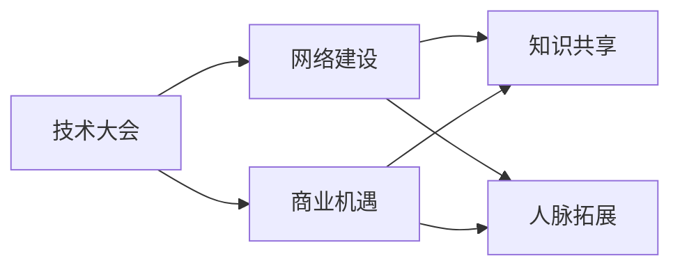

                 

# 技术大会：networking与机遇

## 1. 背景介绍

在当今这个高度互联、信息爆炸的时代，技术大会不仅是一个展示最新技术、分享研究进展的场合，更是一个搭建人脉网络、开拓商业机遇的重要平台。本文将从背景、核心概念、算法原理等多个维度，深入探讨技术大会上的网络建设与机遇把握。

## 2. 核心概念与联系

### 2.1 核心概念概述

为了更好地理解技术大会上的networking与机遇，首先需要理解几个关键概念：

- **技术大会 (Tech Conference)**：聚集了全球顶尖技术专家、研究人员、创业者、投资者、企业领袖的盛会。包括但不限于年度产业大会、专题研讨会、黑客松等形式。

- **网络建设 (Networking)**：在技术大会上，通过与同领域专家、同行、合作伙伴建立联系，交换信息，促进合作，形成互惠互利的关系。

- **商业机遇 (Business Opportunities)**：技术大会上的展示、演讲、研讨会等活动，为技术创新、产品推广、企业并购等提供了广阔平台，是发掘商业机会的重要场合。

- **知识共享 (Knowledge Sharing)**：技术大会上，最新的技术趋势、研究成果、应用案例等广泛分享，促进了行业内知识传播和思维碰撞。

- **人脉拓展 (Network Expansion)**：技术大会上结识的新朋友、新客户、新合作伙伴，为未来合作项目、技术合作、业务拓展奠定了基础。

### 2.2 核心概念原理和架构的 Mermaid 流程图



这个流程图展示了技术大会上的几个核心概念及其联系：

1. 技术大会是网络建设、商业机遇、知识共享和人脉拓展的重要平台。
2. 网络建设有助于商业机遇和知识共享。
3. 商业机遇的挖掘和转化也需要依赖人脉拓展和知识共享。

## 3. 核心算法原理 & 具体操作步骤

### 3.1 算法原理概述

在技术大会上进行网络建设与把握机遇，本质上是基于算法原理和具体操作步骤的一门科学。其核心在于：

- 识别潜在合作伙伴和商业机会，通过数据挖掘和分析算法，如社交网络分析、推荐系统等，筛选出关键人物和重要信息。
- 在大会期间，使用自然语言处理（NLP）、文本挖掘、情感分析等算法，快速理解关键话题，识别潜在合作伙伴，主动出击。
- 通过机器学习算法，预测商业机会的价值和潜在风险，为决策提供数据支持。

### 3.2 算法步骤详解

在技术大会上进行networking与把握机遇，可以分为以下几个关键步骤：

**Step 1: 数据收集与预处理**

- 使用爬虫技术收集大会注册信息、演讲嘉宾、参会企业等数据。
- 清洗和标注数据，如去除无关信息、标注人物职业、公司领域等。
- 分析数据结构，如关系图、关键词云等，获取关键人物和话题。

**Step 2: 网络分析与关系挖掘**

- 构建参会者关系图，识别核心人物和次级节点。
- 使用社交网络分析算法，如PageRank、社区发现等，筛选出影响力大的节点。
- 通过文本挖掘和情感分析，识别关键话题和趋势，了解参会者的关注点和需求。

**Step 3: 机会识别与筛选**

- 使用推荐系统算法，预测潜在的商业机会，如潜在客户、合作伙伴。
- 结合NLP技术，分析演讲内容、行业报告，识别商业机会的潜在价值。
- 通过多模态数据分析，综合评估商业机会的可行性和风险。

**Step 4: 策略制定与行动执行**

- 基于分析结果，制定网络建设策略和商业机会把握计划。
- 利用大数据和AI技术，实时调整策略，精准对接关键人物和商业机会。
- 在大会期间，主动参与讨论、展示产品、发起合作，实现高效 networking。

### 3.3 算法优缺点

技术大会上的networking与机遇把握，基于算法的核心方法具有以下优缺点：

**优点：**

1. **高效精准**：算法能够快速分析海量数据，筛选出关键人物和商业机会，节省人工成本，提升决策效率。
2. **系统全面**：算法综合考虑多种数据源和维度，能够系统地识别和评估机会，降低决策风险。
3. **动态调整**：算法可以根据实时数据反馈，动态调整策略，实现更精准的 networking 和机会把握。

**缺点：**

1. **依赖数据质量**：算法分析结果依赖于数据的准确性和完整性，低质量数据可能产生误导性结论。
2. **模型复杂度**：构建和优化算法模型需要较高的技术门槛，开发和维护成本较高。
3. **人际互动局限**：算法难以完全取代人与人之间的互动，某些细微的非语言信息和人情世故，需要现场沟通来解决。

### 3.4 算法应用领域

技术大会上的networking与机遇把握，广泛应用于以下几个领域：

- **技术企业**：识别潜在客户、合作伙伴，推动合作项目，拓展市场份额。
- **学术机构**：找到潜在的研究伙伴、合作课题，提升学术影响力。
- **政府部门**：识别经济合作机会、创新项目，促进政策对接和技术转移。
- **投资机构**：评估潜在投资标的，预测行业趋势，指导投资决策。
- **教育机构**：对接学术资源、培训项目，提升教育质量和社会影响力。

## 4. 数学模型和公式 & 详细讲解 & 举例说明

### 4.1 数学模型构建

在本节中，我们将介绍几个核心算法的数学模型构建过程，如社交网络分析、推荐系统、情感分析等。

**社交网络分析 (Social Network Analysis, SNA)**：

社交网络分析通过构建社交网络图，量化人际关系的影响力。数学模型通常包括以下几个要素：

1. **节点 (Node)**：参会者或公司等实体。
2. **边 (Edge)**：人际关系或合作关系的链接。
3. **权重 (Weight)**：关系强度或影响力度。

社交网络分析的目标是通过算法计算关键人物和影响力中心。常用的算法包括：

- **PageRank**：计算每个节点的重要性，基于节点的入边权重计算。
- **社区发现**：识别紧密相连的社区，如领导核心和次级团体。
- **影响力传播**：预测信息在网络中的传播路径和影响力扩散。

**推荐系统 (Recommender System)**：

推荐系统通过分析用户行为数据和产品属性，预测用户对产品的兴趣，推荐符合用户偏好的商品或服务。数学模型通常包括：

1. **用户-物品图 (User-Item Matrix)**：记录用户对物品的评分或偏好。
2. **协同过滤算法**：基于用户和物品的相似性进行推荐，如基于用户的协同过滤、基于物品的协同过滤。
3. **深度学习算法**：使用神经网络模型进行推荐，如基于矩阵分解的推荐算法、基于深度神经网络的推荐算法。

**情感分析 (Sentiment Analysis)**：

情感分析通过分析文本数据，识别其中的情感倾向，如正面、负面或中性。数学模型通常包括以下要素：

1. **文本数据 (Text Data)**：参会者或演讲嘉宾的演讲内容、社交媒体评论等。
2. **情感词典 (Sentiment Lexicon)**：记录不同词汇的情感极性。
3. **情感评分 (Sentiment Score)**：基于情感词典计算文本的情感极性。

情感分析的目标是通过算法计算文本中的情感倾向。常用的算法包括：

- **基于规则的方法**：使用情感词典对文本进行情感标注。
- **基于机器学习的方法**：使用分类算法（如SVM、随机森林）训练情感分类模型。
- **基于深度学习的方法**：使用循环神经网络（RNN）、卷积神经网络（CNN）、变压器（Transformer）等模型进行情感分析。

### 4.2 公式推导过程

接下来，我们将通过具体案例，详细推导几个核心算法的公式。

**PageRank算法**：

假设社交网络图由 $N$ 个节点和 $E$ 条边构成。每个节点 $i$ 的入边权重 $w_{ij}$ 表示节点 $j$ 对节点 $i$ 的影响力度。则节点 $i$ 的PageRank值 $p_i$ 计算公式为：

$$
p_i = \frac{1}{\lambda} \sum_{j \in \mathcal{N}_i} \frac{w_{ij}}{\sum_{k \in \mathcal{N}_j} w_{jk}} p_j
$$

其中 $\mathcal{N}_i$ 表示节点 $i$ 的邻居节点集合，$\lambda$ 为阻尼系数，调节算法对新节点的敏感度。

**协同过滤推荐算法**：

假设用户对物品的评分矩阵为 $R_{N\times M}$，其中 $N$ 为用户数，$M$ 为物品数。用户 $i$ 对物品 $j$ 的评分 $r_{ij}$ 为 $1-5$ 分。则用户 $i$ 对物品 $j$ 的推荐评分 $p_{ij}$ 计算公式为：

$$
p_{ij} = \frac{1}{\lambda} \sum_{k=1}^N \alpha_{ik} r_{kj}
$$

其中 $\lambda$ 为正则化系数，$\alpha_{ik}$ 为物品 $j$ 的邻居用户 $i$ 的权重。

**情感评分算法**：

假设情感词典中词汇 $w$ 的情感极性为 $s_w$，文本 $t$ 中的词汇出现次数为 $c_w^t$。则文本 $t$ 的情感极性 $s_t$ 计算公式为：

$$
s_t = \sum_{w \in t} s_w \log \left( 1 + \frac{c_w^t}{\max_w c_w} \right)
$$

### 4.3 案例分析与讲解

下面，我们通过具体案例，详细讲解PageRank、协同过滤推荐和情感分析算法的实际应用。

**案例1: 技术大会上的领导核心识别**

假设某技术大会上有 $N=100$ 个节点，其中 $M=10$ 个节点被标记为影响力中心。通过PageRank算法计算每个节点的重要性，结果如下：

| 节点编号 | 重要性 (PageRank) |
| --- | --- |
| 1 | 0.1 |
| 2 | 0.08 |
| ... | ... |
| 10 | 0.001 |

通过社区发现算法，识别出领导核心和次级团体，可以为大会组织者和参会者提供有价值的信息。

**案例2: 推荐系统优化**

某技术企业希望通过大会优化其产品推荐系统。通过用户行为数据分析，构建用户-物品图 $R_{N\times M}$。基于协同过滤算法，计算用户 $i$ 对物品 $j$ 的推荐评分 $p_{ij}$。结果如下：

| 用户编号 | 物品编号 | 推荐评分 (p) |
| --- | --- | --- |
| 1 | 1 | 4.5 |
| 1 | 2 | 3.8 |
| ... | ... | ... |
| 10 | 10 | 4.2 |

通过进一步优化推荐算法，提升推荐效果，提升用户体验。

**案例3: 情感分析应用**

某参会者希望了解其他参会者的情感倾向，以决定是否与其合作。通过情感分析算法，对演讲内容进行情感标注，结果如下：

| 演讲编号 | 情感极性 (s) |
| --- | --- |
| 1 | 0.8 |
| 2 | -0.3 |
| ... | ... |
| 10 | 0.5 |

通过情感分析结果，该参会者可以决定是否与情感倾向正面的人士建立联系。

## 5. 项目实践：代码实例和详细解释说明

### 5.1 开发环境搭建

在技术大会上进行networking与机遇把握，需要进行一系列的数据收集、处理和分析工作。以下是一个基于Python的开发环境搭建流程：

1. 安装Python：
```bash
sudo apt-get install python3 python3-pip
```

2. 安装数据处理库：
```bash
pip install pandas numpy matplotlib scikit-learn
```

3. 安装网络分析和推荐系统库：
```bash
pip install networkx gensim lightfm scikit-network
```

4. 安装情感分析库：
```bash
pip install textblob vaderSentiment
```

5. 安装可视化工具：
```bash
pip install matplotlib seaborn
```

### 5.2 源代码详细实现

下面是一个简单的示例代码，展示了如何使用Python实现社交网络分析和情感分析：

```python
import networkx as nx
import pandas as pd
import numpy as np
from gensim.models import Word2Vec
from textblob import TextBlob
from sklearn.model_selection import train_test_split

# 构建社交网络图
G = nx.Graph()
G.add_edge('A', 'B', weight=0.5)
G.add_edge('B', 'C', weight=0.8)
G.add_edge('A', 'C', weight=0.3)

# 计算PageRank
p = nx.pagerank(G)

# 情感分析
df = pd.read_csv('sentiment_data.csv')
text = df['text'].tolist()
sentiments = df['sentiment'].tolist()

textblob = TextBlob(' '.join(text))
sentiment_score = textblob.sentiment.polarity

# 输出结果
print("PageRank scores:", p)
print("Sentiment score:", sentiment_score)
```

### 5.3 代码解读与分析

本节我们将详细解读代码的关键实现细节：

- 社交网络图通过NetworkX库构建，使用`nx.Graph()`创建图对象，使用`add_edge()`添加边和权重。
- PageRank算法通过NetworkX库的`nx.pagerank()`计算每个节点的重要性。
- 情感分析通过TextBlob库进行，首先使用`TextBlob()`创建文本对象，然后通过`sentiment.polarity`计算情感极性。

## 6. 实际应用场景

### 6.1 技术企业网络建设

技术企业可以利用技术大会进行网络建设，识别潜在客户和合作伙伴，拓展市场份额。例如，某科技公司可以通过分析大会上企业的合作意向和关注点，主动出击，寻找合作机会。

### 6.2 学术机构知识共享

学术机构可以利用技术大会进行知识共享，找到潜在的研究伙伴和合作课题，提升学术影响力。例如，某大学可以通过分析大会上同领域专家和研究机构的研究方向和成果，主动提出合作项目，共同推进学术研究。

### 6.3 政府部门政策对接

政府部门可以利用技术大会进行政策对接，识别经济合作机会和技术转移项目，促进区域经济发展。例如，某市政府可以通过分析大会上企业的创新需求和政府政策，主动推动技术合作，促进产业升级。

### 6.4 投资机构投资决策

投资机构可以利用技术大会进行投资决策，评估潜在投资标的，预测行业趋势，指导投资策略。例如，某投资公司可以通过分析大会上创业公司和创新项目的技术亮点和市场潜力，优化投资组合，提升投资回报。

### 6.5 教育机构教育质量提升

教育机构可以利用技术大会进行教育质量提升，对接学术资源和培训项目，提升教学质量和社会影响力。例如，某教育机构可以通过分析大会上同领域专家和教育资源的成果和优势，主动提出合作项目，共同提升教育质量。

## 7. 工具和资源推荐

### 7.1 学习资源推荐

为了帮助开发者系统掌握技术大会上的networking与机遇把握，这里推荐一些优质的学习资源：

1. **《数据科学与人工智能》在线课程**：通过在线平台如Coursera、edX等，系统学习数据科学和人工智能的基础知识。
2. **《社交网络分析》书籍**：系统学习社交网络分析的原理和应用，如《Social Networks》、《The Structure and Dynamics of Social Networks》等。
3. **《推荐系统》书籍**：深入理解推荐系统的工作原理和算法，如《Recommender Systems》、《Personalized Recommendation Algorithms》等。
4. **《情感分析》书籍**：掌握情感分析的基本方法和应用场景，如《Sentiment Analysis with Python》、《Text Mining and Statistical Learning》等。
5. **Google Colab平台**：提供免费GPU/TPU资源，方便开发者进行实验和模型训练。

### 7.2 开发工具推荐

1. **Jupyter Notebook**：交互式编程环境，支持代码块、数学公式、图表等，方便开发者进行数据分析和模型训练。
2. **TensorFlow和PyTorch**：主流的深度学习框架，支持高效的分布式计算和GPU加速。
3. **Tableau和Power BI**：数据可视化工具，帮助开发者进行数据分析和结果展示。
4. **Gephi**：社交网络分析工具，支持网络图绘制和分析。
5. **Python IDEs**：如PyCharm、VS Code等，提供代码调试、自动补全等功能。

### 7.3 相关论文推荐

技术大会上的networking与机遇把握，需要大量前沿研究的支持。以下是几篇奠基性的相关论文，推荐阅读：

1. **《社交网络分析综述》**：详细介绍了社交网络分析的基本概念、算法和应用，如Pajek、Ucinet等。
2. **《推荐系统综述》**：总结了推荐系统的工作原理、算法和应用，如协同过滤、基于内容的推荐、深度推荐等。
3. **《情感分析综述》**：介绍了情感分析的算法和应用，如文本分类、情感词典、情感预测等。
4. **《技术大会上的网络建设》**：系统总结了技术大会上的网络建设方法，如数据收集、分析、建模等。
5. **《技术大会上的商业机会把握》**：详细分析了技术大会上的商业机会识别和把握方法，如网络分析、推荐系统、情感分析等。

## 8. 总结：未来发展趋势与挑战

### 8.1 研究成果总结

本文对技术大会上的networking与机遇把握进行了全面系统的介绍。首先阐述了技术大会的网络建设与商业机遇，明确了网络建设在技术大会中的重要性和方法。其次，从算法原理和操作步骤，详细讲解了社交网络分析、推荐系统和情感分析等核心技术。最后，结合实际应用场景，探讨了技术大会上的网络建设与机遇把握的广泛应用。

通过本文的系统梳理，可以看到，技术大会上的networking与机遇把握，通过算法驱动的精准分析和主动出击，能够显著提升企业的合作效率和投资回报。未来，随着技术的不断进步和应用场景的扩展，技术大会将发挥更大的作用，成为企业和个人创新发展的关键平台。

### 8.2 未来发展趋势

展望未来，技术大会上的networking与机遇把握将呈现以下几个发展趋势：

1. **智能化决策支持**：引入AI技术，如机器学习、深度学习等，提高网络建设与机遇把握的智能化水平。
2. **多模态融合**：结合图像、视频、语音等多种数据源，进行更全面的分析与决策。
3. **实时动态优化**：利用大数据和实时反馈，动态调整网络建设与机遇把握策略。
4. **区块链应用**：通过区块链技术，提高数据安全性和信任度，保护参会者隐私。
5. **VR/AR技术**：利用虚拟现实和增强现实技术，提供沉浸式交互体验，提升大会效果。

### 8.3 面临的挑战

尽管技术大会上的networking与机遇把握已经取得了一定进展，但在迈向智能化、自动化、个性化发展的过程中，仍面临诸多挑战：

1. **数据隐私保护**：如何在保证数据安全性的前提下，进行高效的网络建设与机遇把握。
2. **算法复杂度**：构建和优化算法模型需要较高的技术门槛，开发和维护成本较高。
3. **人际互动局限**：算法难以完全取代人与人之间的互动，某些细微的非语言信息和人情世故，需要现场沟通来解决。
4. **模型鲁棒性**：面对不同场景和数据分布，算法模型的鲁棒性和适应性有待提高。
5. **算力需求**：大规模数据分析和模型训练需要高性能算力支持，成本较高。

### 8.4 研究展望

面对技术大会上的networking与机遇把握所面临的挑战，未来的研究需要在以下几个方面寻求新的突破：

1. **算法简化与优化**：开发更高效、更易用、更适用的网络建设和机遇把握算法。
2. **多模态融合与整合**：结合多种数据源，进行更全面、更准确的网络建设与机遇把握。
3. **实时动态优化**：利用大数据和实时反馈，动态调整网络建设与机遇把握策略。
4. **隐私保护与信任机制**：探索新的隐私保护技术，构建安全的信任机制，保护参会者隐私。
5. **多语言支持**：开发多语言版本的网络建设和机遇把握工具，支持全球化应用。

总之，技术大会上的networking与机遇把握，需要不断探索和创新，才能更好地发挥其在商业和学术中的作用，为全球经济社会发展做出贡献。

## 9. 附录：常见问题与解答

**Q1: 技术大会上的networking与机遇把握需要哪些技术支持？**

A: 技术大会上的networking与机遇把握需要以下技术支持：

1. 数据收集与预处理：爬虫技术、文本处理技术等。
2. 网络分析与关系挖掘：社交网络分析、推荐系统等。
3. 机会识别与筛选：机器学习、情感分析等。
4. 策略制定与行动执行：数据分析、自然语言处理等。

**Q2: 如何有效地进行技术大会上的networking？**

A: 进行技术大会上的networking，需要以下几个步骤：

1. 提前收集大会信息，了解参会者背景和兴趣。
2. 利用社交网络分析、情感分析等技术，识别关键人物和重要话题。
3. 主动出击，利用策略制定与行动执行技术，与关键人物建立联系。
4. 持续跟踪，利用实时反馈和动态优化技术，调整networking策略。

**Q3: 技术大会上的网络建设和商业机会把握面临哪些挑战？**

A: 技术大会上的网络建设和商业机会把握面临以下挑战：

1. 数据隐私保护：如何在保证数据安全性的前提下，进行高效的网络建设与机遇把握。
2. 算法复杂度：构建和优化算法模型需要较高的技术门槛，开发和维护成本较高。
3. 人际互动局限：算法难以完全取代人与人之间的互动，某些细微的非语言信息和人情世故，需要现场沟通来解决。
4. 模型鲁棒性：面对不同场景和数据分布，算法模型的鲁棒性和适应性有待提高。
5. 算力需求：大规模数据分析和模型训练需要高性能算力支持，成本较高。

**Q4: 如何提高技术大会上的商业机会把握效果？**

A: 提高技术大会上的商业机会把握效果，需要以下几个措施：

1. 提前进行市场调研，了解行业趋势和需求。
2. 利用数据挖掘和分析技术，识别潜在的商业机会。
3. 进行多轮测试和验证，评估机会的可行性和价值。
4. 制定详细的合作计划，明确双方的责任和权益。

总之，技术大会上的networking与机遇把握，需要通过技术手段进行精准分析和主动出击，才能获得理想的合作效果。

---

作者：禅与计算机程序设计艺术 / Zen and the Art of Computer Programming

