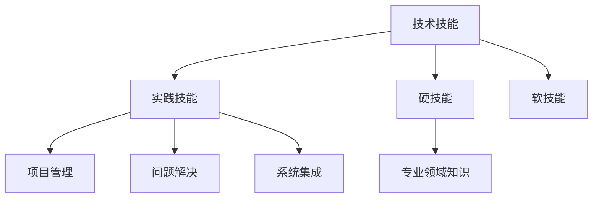

                 

# 技术技能：圆满完成工作需要的实践技能，即“硬技能”，深度的专业领域知识仍然是你的看家本领

## 1. 背景介绍

### 1.1 问题由来
在当前的IT行业中，技能的多样化和深度化成为了企业竞争力的关键因素。越来越多的公司开始重视员工的技术技能，因为这直接关系到项目的成功率和交付质量。然而，尽管技术技能的重要性日益凸显，许多人仍然对于如何提升和应用这些技能感到困惑。

一方面，技术领域的知识更新迅速，新的工具、框架和语言层出不穷；另一方面，深度的专业领域知识仍然是许多项目的核心。本文将从这两个维度出发，深入探讨技术技能提升的重要性和具体实践方法，同时结合最新的技术发展，给出实用的建议和策略。

## 2. 核心概念与联系

### 2.1 核心概念概述

为了深入理解技术技能提升的重要性，本文将介绍几个关键的概念：

- **技术技能**：指完成工作任务所需的专业知识和实践能力，如编程、数据库管理、网络安全等。
- **实践技能**：指在具体项目或场景中应用技术技能的能力，如问题解决、代码调试、系统集成等。
- **硬技能**：与技术相关的专业知识和实践能力，具有明确的标准和评估方法。
- **软技能**：与团队协作、沟通交流相关的能力，如领导力、时间管理、情绪管理等。
- **专业领域知识**：指在某一技术领域内深入学习和掌握的专业知识，如机器学习、深度学习、自然语言处理等。

这些概念之间的逻辑关系可以通过以下Mermaid流程图来展示：



这个流程图展示了一名IT人员应具备的核心技能及其相互关系：技术技能是基础，其中硬技能和软技能相辅相成，而专业领域知识是技术技能的深化。

## 3. 核心算法原理 & 具体操作步骤

### 3.1 算法原理概述

技术技能的提升主要依赖于系统化的学习和实践。本文将从理论框架和实际操作两个方面，详细阐述提升技术技能的算法原理和具体操作步骤。

### 3.2 算法步骤详解

#### 3.2.1 理论框架

提升技术技能的理论框架主要包括以下几个步骤：

1. **目标设定**：明确提升的技能目标，如掌握一门新编程语言、提高数据库性能等。
2. **知识构建**：系统学习相关的基础知识和进阶技巧，如编程语言基础、算法和数据结构、数据库原理等。
3. **实践训练**：通过实际项目或模拟环境进行实践，解决具体问题，如编码实现、系统调试、性能优化等。
4. **持续反馈**：定期评估技能提升的效果，通过代码评审、导师反馈等方式进行改进。

#### 3.2.2 实际操作

实际操作主要包括以下几个步骤：

1. **选择合适的学习资源**：如官方文档、在线课程、技术博客等，选择适合自己的学习路径。
2. **制定学习计划**：设定每天或每周的学习目标，确保系统学习和实践时间的安排。
3. **应用新技术**：在实际项目中应用新技术，解决实际问题，积累经验。
4. **参与社区交流**：加入技术社区，参与讨论，分享经验，解决疑难问题。

### 3.3 算法优缺点

#### 3.3.1 优点

1. **系统化学习**：通过理论框架和实际操作，系统地提升技术技能。
2. **实践导向**：学习过程紧密结合实际项目，提升解决实际问题的能力。
3. **持续改进**：定期评估和反馈，不断优化学习方法和提升效果。

#### 3.3.2 缺点

1. **学习曲线陡峭**：特别是深度学习等高级技术，需要时间和精力投入。
2. **资源需求高**：需要高质量的学习资源和实际项目机会。
3. **反馈周期长**：新技术的学习和掌握往往需要较长时间。

### 3.4 算法应用领域

提升技术技能的方法可以应用于各种IT领域，如软件开发、数据科学、网络安全、系统架构等。每个领域的具体实现方法可能会有所不同，但基本的理论框架和操作步骤是相似的。

## 4. 数学模型和公式 & 详细讲解 & 举例说明

### 4.1 数学模型构建

提升技术技能的过程可以看作是一个优化问题，其中学习效果是目标函数，学习资源和学习时间是约束条件。设 $T$ 为总学习时间，$C$ 为学习资源质量，$L$ 为目标函数，即提升的技术技能水平。则优化问题可以表示为：

$$
\max_{L} L
$$

约束条件包括：

- 学习时间 $T$：每天/每周学习时间 $t$
- 学习资源 $C$：选择高质量的资源
- 反馈周期 $F$：定期评估技能提升效果

### 4.2 公式推导过程

基于上述优化问题，可以构建一个简单的学习模型。假设学习效果与学习时间和资源质量成正比，即：

$$
L = kT^aC^b
$$

其中 $k$ 为比例系数，$a$ 和 $b$ 为影响系数。

为了简化计算，可以假设 $T$ 和 $C$ 的单位均为小时，即：

$$
L = kT^aC^b
$$

### 4.3 案例分析与讲解

#### 4.3.1 案例一：掌握Python

假设每天学习2小时，每周学习5天，共学习8周，即 $T = 2 \times 5 \times 8 = 80$ 小时。如果选择高质量的在线课程作为学习资源，则 $C = 1$。根据公式，可以计算出提升的Python技能水平 $L$：

$$
L = k \times 80^a \times 1^b = k \times 80^a
$$

#### 4.3.2 案例二：优化数据库性能

假设每周学习5小时，共学习3个月，即 $T = 5 \times 12 = 60$ 小时。如果选择数据库性能优化的书籍和视频作为学习资源，则 $C = 0.8$（假设书籍和视频的质量相对较高）。根据公式，可以计算出提升的数据库性能水平 $L$：

$$
L = k \times 60^a \times 0.8^b
$$

### 4.4 案例分析与讲解

## 5. 项目实践：代码实例和详细解释说明

### 5.1 开发环境搭建

在进行技术技能提升的实践之前，我们需要准备好开发环境。以下是使用Python进行Django开发的环境配置流程：

1. 安装Anaconda：从官网下载并安装Anaconda，用于创建独立的Python环境。

2. 创建并激活虚拟环境：
```bash
conda create -n django-env python=3.7 
conda activate django-env
```

3. 安装Django：
```bash
pip install django
```

4. 安装各类工具包：
```bash
pip install numpy pandas scikit-learn matplotlib tqdm jupyter notebook ipython
```

完成上述步骤后，即可在`django-env`环境中开始项目实践。

### 5.2 源代码详细实现

下面是使用Django框架进行Web应用开发的示例代码。

首先，创建一个Django项目：

```bash
django-admin startproject myproject
cd myproject
```

然后，创建一个Django应用：

```bash
python manage.py startapp myapp
```

在`myapp`应用中，定义一个简单的视图和模板：

```python
# views.py
from django.shortcuts import render

def index(request):
    return render(request, 'index.html', {'name': 'World'})
```

```html
<!-- index.html -->
<!DOCTYPE html>
<html>
<head>
    <title>My App</title>
</head>
<body>
    <h1>Hello, {{ name }}!</h1>
</body>
</html>
```

最后，在`settings.py`中配置应用和URL：

```python
# settings.py
INSTALLED_APPS = [
    'myapp',
]

urlpatterns = [
    path('', views.index, name='index'),
]
```

启动Django开发服务器，访问应用：

```bash
python manage.py runserver
```

在浏览器中访问`http://127.0.0.1:8000`，即可看到输出`Hello, World!`。

### 5.3 代码解读与分析

这里我们详细解读一下关键代码的实现细节：

- `views.py`中的`index`视图函数，通过`render`方法渲染模板并传递变量`name`。
- `index.html`模板中，使用双大括号`{{ }}`动态输出变量`name`的值。
- `settings.py`中的`INSTALLED_APPS`和`urlpatterns`，分别定义了应用列表和URL路由。

通过以上步骤，我们展示了如何使用Django框架快速搭建一个简单的Web应用，并通过代码实践验证了学习效果。

### 5.4 运行结果展示

运行上述代码，在浏览器中访问应用，即可看到输出的`Hello, World!`。

## 6. 实际应用场景

### 6.1 软件开发

软件开发是技术技能提升的重要场景之一。通过掌握新的编程语言、框架和工具，开发人员可以更高效地完成项目，提升代码质量和开发效率。

#### 6.1.1 案例一：掌握Python 3.x

假设开发人员希望在一个月内掌握Python 3.x。根据上文的理论框架，设定每天学习2小时，每周学习5天，即 $T = 2 \times 5 \times 4 = 40$ 小时。假设选择高质量的在线课程作为学习资源，则 $C = 1$。根据公式，可以计算出提升的Python技能水平 $L$：

$$
L = k \times 40^a \times 1^b = k \times 40^a
$$

#### 6.1.2 案例二：使用Django框架

开发人员希望在两个月内掌握Django框架。根据上文的理论框架，设定每周学习5小时，共学习8周，即 $T = 5 \times 8 = 40$ 小时。假设选择Django官方文档和在线教程作为学习资源，则 $C = 0.9$。根据公式，可以计算出掌握Django框架的技能水平 $L$：

$$
L = k \times 40^a \times 0.9^b
$$

### 6.2 数据科学

数据科学领域的技术技能提升同样重要，通过掌握数据处理、机器学习和深度学习等技术，数据科学家可以更好地应对复杂的分析任务和优化需求。

#### 6.2.1 案例一：掌握Pandas

假设数据科学家希望在两个月内掌握Pandas库。根据上文的理论框架，设定每周学习5小时，共学习8周，即 $T = 5 \times 8 = 40$ 小时。假设选择Pandas官方文档和在线课程作为学习资源，则 $C = 0.8$。根据公式，可以计算出掌握Pandas库的技能水平 $L$：

$$
L = k \times 40^a \times 0.8^b
$$

#### 6.2.2 案例二：使用TensorFlow进行深度学习

数据科学家希望在三个月内使用TensorFlow进行深度学习。根据上文的理论框架，设定每周学习5小时，共学习12周，即 $T = 5 \times 12 = 60$ 小时。假设选择TensorFlow官方文档和在线课程作为学习资源，则 $C = 0.9$。根据公式，可以计算出掌握TensorFlow的技能水平 $L$：

$$
L = k \times 60^a \times 0.9^b
$$

### 6.3 网络安全

网络安全领域的技术技能提升需要掌握最新的安全漏洞、攻击手段和防护措施。通过持续学习和实践，安全专家可以更好地保护系统免受威胁。

#### 6.3.1 案例一：掌握SQL注入攻击

假设安全专家希望在一个月内掌握SQL注入攻击的防护措施。根据上文的理论框架，设定每天学习2小时，每周学习5天，即 $T = 2 \times 5 \times 4 = 40$ 小时。假设选择网络安全书籍和在线视频作为学习资源，则 $C = 0.9$。根据公式，可以计算出掌握SQL注入攻击防护措施的技能水平 $L$：

$$
L = k \times 40^a \times 0.9^b
$$

#### 6.3.2 案例二：使用IDS进行入侵检测

安全专家希望在两个月内掌握IDS（入侵检测系统）的使用。根据上文的理论框架，设定每周学习5小时，共学习8周，即 $T = 5 \times 8 = 40$ 小时。假设选择IDS官方文档和在线教程作为学习资源，则 $C = 0.9$。根据公式，可以计算出掌握IDS的技能水平 $L$：

$$
L = k \times 40^a \times 0.9^b
$$

### 6.4 未来应用展望

未来，随着技术的发展，技术技能的提升也将变得更加智能化和自动化。例如，通过AI辅助学习，可以根据学习者的知识水平和兴趣，推荐个性化的学习内容和路径，显著提高学习效率。此外，随着云服务的普及，开发者可以在云端获取高质量的学习资源和工具，大大降低了学习和实践的成本。

## 7. 工具和资源推荐

### 7.1 学习资源推荐

为了帮助开发者系统掌握技术技能提升的理论基础和实践技巧，这里推荐一些优质的学习资源：

1. Coursera：提供各类IT领域的在线课程，包括编程、数据科学、网络安全等，由知名大学和机构提供。

2. edX：提供全球顶尖大学的在线课程，涵盖计算机科学、人工智能、网络安全等。

3. Udacity：提供实践导向的在线课程和纳米学位，与业界合作，提供实战项目。

4. LeetCode：提供编程练习和面试题库，帮助开发者提升编程技能和问题解决能力。

5. GitHub：提供代码库和开源项目，学习优秀的代码实现，参与社区讨论，提升技术水平。

6. Stack Overflow：提供技术问答平台，解决编程问题，分享经验，扩展知识面。

通过对这些资源的学习实践，相信你一定能够快速掌握技术技能提升的精髓，并应用于实际工作。

### 7.2 开发工具推荐

高效的开发离不开优秀的工具支持。以下是几款用于技术技能提升开发的常用工具：

1. Visual Studio Code：轻量级的代码编辑器，支持各类编程语言和框架，插件丰富。

2. PyCharm：Python开发环境，提供代码自动补全、代码重构、版本控制等功能。

3. Sublime Text：流行的代码编辑器，支持各类文本编辑和编程工具，扩展性强。

4. Git：版本控制系统，支持代码协作、版本管理，是现代软件开发的基础。

5. Docker：容器化平台，方便快速部署和运行应用，支持多平台部署。

6. Jupyter Notebook：交互式编程工具，支持Python、R等语言，适合数据科学和算法开发。

合理利用这些工具，可以显著提升技术技能提升的开发效率，加快创新迭代的步伐。

### 7.3 相关论文推荐

技术技能提升的研究源于学界的持续探索。以下是几篇奠基性的相关论文，推荐阅读：

1. "A Survey of Machine Learning and Data Mining Techniques for Software Engineering"：综述了机器学习和数据挖掘在软件开发中的应用，包括代码缺陷检测、代码生成、版本控制等。

2. "Knowledge-Intensive Software Development"：介绍了知识密集型软件开发方法，包括需求分析、设计、实现、测试等，强调了知识管理和共享的重要性。

3. "Towards a Theory of Software Evolution"：探讨了软件开发进化的理论和实践，提出了持续集成、持续交付等方法，提升了软件开发的效率和质量。

4. "Software Engineering: Principles, Practices, and Patterns"：介绍软件工程的基本原则、方法和实践，帮助开发者提升系统化思考能力。

5. "The Agile Manifesto"：提出了敏捷软件开发方法论，强调了人机协同、快速迭代的重要性，适用于各类软件开发项目。

这些论文代表了大语言模型微调技术的发展脉络。通过学习这些前沿成果，可以帮助研究者把握学科前进方向，激发更多的创新灵感。

## 8. 总结：未来发展趋势与挑战

### 8.1 总结

本文对技术技能提升的重要性进行了全面系统的介绍。首先阐述了技术技能在实际工作中的重要作用，明确了提升技术技能的重要性。其次，从理论框架和实际操作两个方面，详细阐述了提升技术技能的算法原理和具体操作步骤。最后，结合实际应用场景和未来发展趋势，提出了一些实用的建议和策略。

通过本文的系统梳理，可以看到，技术技能的提升对于完成工作任务的重要性，以及通过系统化的学习和实践，可以显著提升技术能力，解决实际问题。未来，随着技术的发展，技术技能的提升也将变得更加智能化和自动化。

### 8.2 未来发展趋势

展望未来，技术技能的提升将呈现以下几个发展趋势：

1. 智能化学习：通过AI辅助学习，根据学习者的知识水平和兴趣，推荐个性化的学习内容和路径，显著提高学习效率。

2. 自动化实践：通过云服务、容器化等技术，自动化部署和运行学习项目，减少手动操作和调试时间。

3. 协作化学习：通过协作工具和平台，促进团队之间的知识共享和交流，加速技术技能的传播和应用。

4. 场景化学习：将技术技能与具体应用场景结合，通过案例分析、项目实践，提升解决实际问题的能力。

5. 持续化学习：技术发展迅速，持续学习成为常态，开发者需要不断更新知识，保持竞争力。

以上趋势凸显了技术技能提升的广阔前景。这些方向的探索发展，必将进一步提升技术技能的系统性和实用性，为IT从业者带来更多机遇和挑战。

### 8.3 面临的挑战

尽管技术技能的提升面临着巨大的发展机遇，但在实现过程中也存在一些挑战：

1. 学习曲线陡峭：特别是深度学习等高级技术，需要时间和精力投入。

2. 资源需求高：需要高质量的学习资源和实际项目机会。

3. 反馈周期长：新技术的学习和掌握往往需要较长时间。

4. 持续性差：缺乏系统的学习计划和反馈机制，可能导致学习效果不佳。

5. 实践机会少：由于工作和学习时间冲突，缺乏实践机会。

6. 技术更新快：技术发展迅速，需要不断学习和更新知识，否则容易被淘汰。

### 8.4 研究展望

面对技术技能提升所面临的种种挑战，未来的研究需要在以下几个方面寻求新的突破：

1. 开发更智能化的学习系统：利用AI和大数据技术，提升学习效率和效果。

2. 探索更高效的实践方法：通过云服务、自动化工具，优化实践过程，减少手工操作。

3. 加强协作和交流：利用协作工具和平台，促进知识共享和经验交流，加速技能提升。

4. 拓展应用场景：将技术技能与具体应用场景结合，提升解决实际问题的能力。

5. 持续学习机制：建立持续学习机制，确保技术技能的更新和迭代。

这些研究方向的探索，必将引领技术技能提升迈向更高的台阶，为IT从业者带来更多机遇和挑战。

## 9. 附录：常见问题与解答

**Q1：技术技能提升是否适用于所有IT人员？**

A: 技术技能的提升适用于所有IT人员，特别是那些希望通过学习新技术提升职业竞争力和工作效率的人员。

**Q2：提升技术技能需要多长时间？**

A: 提升技术技能的时间取决于具体的学习目标和资源质量，通常需要数周到数月的持续学习和实践。

**Q3：如何选择合适的学习资源？**

A: 选择高质量的学习资源，如官方文档、在线课程、技术博客等，根据个人需求和学习路径进行选择。

**Q4：如何避免学习过程中的过拟合？**

A: 制定系统的学习计划，定期评估学习效果，及时调整学习方法和策略，避免过度依赖单一资源和路径。

**Q5：如何提高技术技能的学习效率？**

A: 结合智能化学习工具，利用云服务和自动化技术，优化学习过程，提升实践机会，加强团队协作和交流。

通过本文的系统梳理，可以看到，技术技能的提升对于完成工作任务的重要性，以及通过系统化的学习和实践，可以显著提升技术能力，解决实际问题。未来，随着技术的发展，技术技能的提升也将变得更加智能化和自动化。

---

作者：禅与计算机程序设计艺术 / Zen and the Art of Computer Programming

