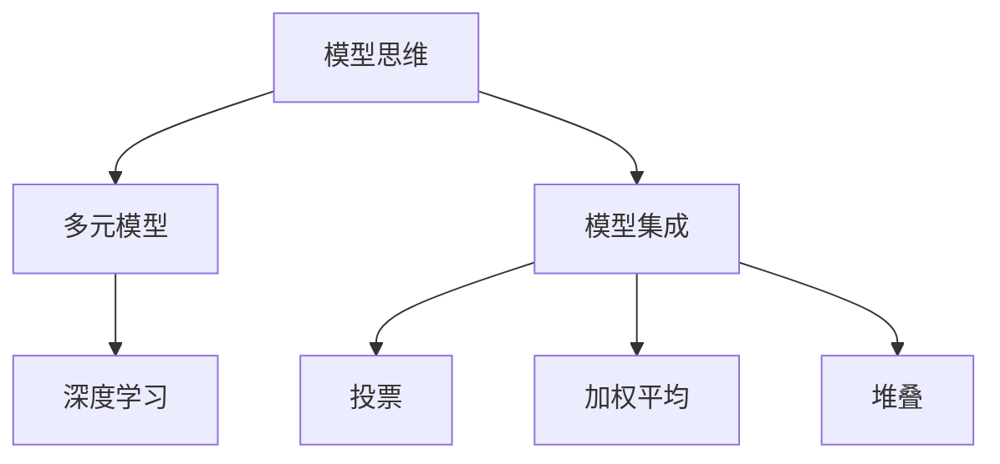

                 

# 掌握多元模型思维助力管理者洞见

## 1. 背景介绍

在全球化、数字化的浪潮下，管理者的角色和环境发生了翻天覆地的变化。一方面，企业管理者需要应对复杂多变的市场环境，做出快速准确的决策；另一方面，如何从海量数据中提取有价值的信息，成为当前管理实践中的一大挑战。大数据、人工智能等新兴技术为管理者提供了强大的工具，帮助其洞见企业运营的关键点，实现高质量的决策。

本文聚焦于多元模型思维，探讨如何通过多种机器学习模型、模型集成技术、深度学习等方法，有效提升管理者的洞见能力。我们将从多个角度介绍模型思维的理论基础和实践技巧，帮助管理者更好地理解和应用多元模型思维，为企业的数字化转型提供有力支持。

## 2. 核心概念与联系

### 2.1 核心概念概述

为更好地理解多元模型思维的精髓，本节将介绍几个关键概念：

- 模型思维：指通过数据建模的方式，利用机器学习模型或算法，从数据中提取规律、洞见和预测结果的管理理念和方法。
- 多元模型：指在数据建模中，使用多个不同的模型（如线性回归、决策树、随机森林、神经网络等）来处理同一份数据，从而获得更加全面、可靠的洞见。
- 模型集成：指通过组合多个模型的输出，提升整体性能的模型优化技术。包括投票、加权平均、堆叠等多种方式。
- 深度学习：一种模拟人类神经系统的计算模型，通过多层神经网络处理数据，提取高层次的抽象特征。深度学习在图像、语音、自然语言处理等领域有着广泛的应用。

这些核心概念之间的联系可以通过以下Mermaid流程图来展示：



这个流程图展示了模型思维框架下，多元模型和模型集成如何通过深度学习技术，实现从数据到洞见的全面解析。

## 3. 核心算法原理 & 具体操作步骤
### 3.1 算法原理概述

基于模型思维的管理决策过程，核心在于通过数据建模的方式，利用机器学习模型或算法，从数据中提取规律、洞见和预测结果。这一过程可以分为以下三个主要步骤：

1. **数据预处理**：对原始数据进行清洗、归一化、特征选择等处理，为模型输入提供高质量的数据。
2. **模型训练**：使用历史数据训练多个不同的模型，每个模型从不同的角度捕捉数据的特征。
3. **模型集成**：将多个模型的输出进行集成，得到一个更加全面、准确的预测结果或洞见。

通过多元模型思维，管理者可以在同一问题上获得多个角度的洞见，从而减少单一模型可能带来的偏见和误差，提升决策的全面性和可靠性。

### 3.2 算法步骤详解

以下是基于模型思维的管理决策的详细操作步骤：

**Step 1: 数据预处理**

1. 数据清洗：处理缺失值、异常值、重复记录等问题，确保数据质量。
2. 特征工程：选择、构造和转换特征，提升模型输入的质量。
3. 数据标准化：对特征进行标准化，使其在不同的尺度上具有可比性。

**Step 2: 模型训练**

1. 选择合适的模型：根据问题类型和数据特点，选择适合的模型，如线性回归、决策树、随机森林、神经网络等。
2. 分割数据集：将数据集划分为训练集、验证集和测试集，避免过拟合。
3. 模型训练：对每个模型使用训练集数据进行训练，优化模型参数。
4. 模型评估：使用验证集评估模型的性能，选择最优模型。

**Step 3: 模型集成**

1. 集成策略：选择投票、加权平均、堆叠等集成策略，将多个模型的输出进行融合。
2. 融合算法：使用融合算法（如AdaBoost、Bagging、Stacking等）对模型进行集成。
3. 输出优化：对集成后的输出进行优化，提高模型的准确性和稳定性。

### 3.3 算法优缺点

基于模型思维的管理决策方法，具有以下优点：

- 多角度洞见：通过多元模型分析，管理者可以获得不同角度的洞见，减少单一模型的偏见和误差。
- 高效准确：多个模型的集成可以提升整体性能，获得更准确、稳定的预测结果。
- 鲁棒性高：多个模型的集成可以减少单一模型的过拟合风险，提升模型的鲁棒性。
- 灵活性高：不同的模型可以适应不同类型的数据，增强决策的灵活性。

同时，该方法也存在一定的局限性：

- 数据复杂度高：多元模型需要处理更多的数据和特征，增加了数据的复杂度。
- 计算资源需求高：多元模型训练和集成需要更多的计算资源，增加了成本。
- 模型解释性差：多个模型的集成结果可能较为复杂，难以解释和调试。
- 模型调参困难：多元模型需要调参的维度增加，增加了调参的难度。

尽管存在这些局限性，但就目前而言，多元模型思维仍然是最为主流的数据决策方法。未来相关研究的重点在于如何进一步降低多元模型对数据和计算资源的依赖，提高模型的解释性和调参效率。

### 3.4 算法应用领域

基于多元模型思维的管理决策方法，在多个领域中得到了广泛的应用，包括但不限于：

- 金融风险管理：通过多元模型预测股票、基金等金融资产的价格波动，帮助管理者做出风险控制决策。
- 供应链管理：使用多元模型预测产品需求、库存水平，优化供应链的运营效率和成本。
- 市场营销：通过多元模型分析用户行为数据，优化广告投放策略，提升市场营销效果。
- 人力资源管理：利用多元模型分析员工绩效数据，提升招聘和培训决策的精准度。
- 客户服务：使用多元模型预测客户流失风险，优化客户服务策略，提高客户满意度。
- 医疗健康：通过多元模型分析医疗数据，预测疾病发生率，提升医疗服务质量。

## 4. 数学模型和公式 & 详细讲解  
### 4.1 数学模型构建

假设我们有N个独立同分布的数据点 $(x_i, y_i)$，其中 $x_i \in \mathbb{R}^d$ 是输入特征， $y_i \in \mathbb{R}$ 是目标变量。我们希望构建一个多元模型 $f(x) = \sum_{k=1}^K w_k f_k(x)$，其中 $f_k(x)$ 是第 $k$ 个模型的预测函数，$w_k$ 是模型 $f_k(x)$ 的权重。

定义模型 $f_k(x)$ 在数据集 $D$ 上的经验风险为：

$$
\mathcal{L}_k = \frac{1}{N} \sum_{i=1}^N \ell_k(f_k(x_i),y_i)
$$

其中 $\ell_k$ 是损失函数，可以是均方误差、交叉熵等。

多元模型 $f(x)$ 的平均经验风险为：

$$
\mathcal{L} = \frac{1}{N} \sum_{i=1}^N \ell(f(x_i),y_i)
$$

### 4.2 公式推导过程

我们以多元线性回归为例，推导多元模型预测的数学公式。

假设每个模型的预测函数为 $f_k(x) = \theta_k^T x$，其中 $\theta_k$ 是第 $k$ 个模型的参数向量。多元模型 $f(x)$ 的平均预测为：

$$
\hat{y} = \sum_{k=1}^K w_k f_k(x)
$$

多元模型的损失函数为：

$$
\mathcal{L} = \frac{1}{N} \sum_{i=1}^N \ell(\hat{y}_i,y_i)
$$

其中 $\ell$ 是损失函数，如均方误差。

多元模型的最小化目标为：

$$
\min_{w_k} \sum_{i=1}^N \ell(\sum_{k=1}^K w_k f_k(x_i),y_i)
$$

通过求解上述最小化问题，可以求得最优权重 $w_k$，使得多元模型 $f(x)$ 的平均预测误差最小。

### 4.3 案例分析与讲解

假设我们有一份包含100个客户数据的数据集，每个数据包括客户年龄、收入、消费频次等特征。我们的目标是对客户的购买意向进行预测。

**Step 1: 数据预处理**

1. 数据清洗：处理缺失值、异常值、重复记录等。
2. 特征工程：选择年龄、收入、消费频次等特征，构造新的特征，如收入与消费频次的乘积等。
3. 数据标准化：对特征进行标准化，使得不同特征具有相同的尺度和范围。

**Step 2: 模型训练**

1. 分割数据集：将数据集划分为训练集、验证集和测试集。
2. 选择模型：选择线性回归、决策树、随机森林等模型进行训练。
3. 模型训练：对每个模型使用训练集数据进行训练，优化模型参数。
4. 模型评估：使用验证集评估模型的性能，选择最优模型。

**Step 3: 模型集成**

1. 集成策略：选择投票、加权平均、堆叠等集成策略。
2. 融合算法：使用融合算法（如AdaBoost、Bagging、Stacking等）对模型进行集成。
3. 输出优化：对集成后的输出进行优化，提高模型的准确性和稳定性。

最终，我们可以通过多元模型思维，获得更加全面、可靠的客户购买意向预测结果。

## 5. 项目实践：代码实例和详细解释说明
### 5.1 开发环境搭建

在进行多元模型思维的实践前，我们需要准备好开发环境。以下是使用Python进行Scikit-learn开发的环境配置流程：

1. 安装Anaconda：从官网下载并安装Anaconda，用于创建独立的Python环境。

2. 创建并激活虚拟环境：
```bash
conda create -n sklearn-env python=3.8 
conda activate sklearn-env
```

3. 安装Scikit-learn：使用pip安装Scikit-learn库，可以从官方文档或conda仓库安装。

4. 安装各类工具包：
```bash
pip install numpy pandas scikit-learn matplotlib tqdm jupyter notebook ipython
```

完成上述步骤后，即可在`sklearn-env`环境中开始实践。

### 5.2 源代码详细实现

我们以多元线性回归为例，展示如何使用Scikit-learn库实现多元模型思维的管理决策。

首先，定义数据处理函数：

```python
from sklearn.model_selection import train_test_split
from sklearn.preprocessing import StandardScaler
from sklearn.linear_model import LinearRegression
from sklearn.ensemble import RandomForestRegressor
from sklearn.ensemble import AdaBoostRegressor
from sklearn.metrics import mean_squared_error
import numpy as np

def preprocess_data(X, y):
    # 数据清洗、特征工程和标准化
    X = np.append(X, np.log(X[:, -1]))  # 构造新的特征，对数转换
    X = StandardScaler().fit_transform(X)  # 标准化
    y = np.log(y)  # 对目标变量进行对数转换
    return X, y
```

然后，定义模型训练和评估函数：

```python
def train_models(X_train, y_train, models):
    models = []
    for name, clf in models.items():
        clf.fit(X_train, y_train)
        models.append(clf)
    return models

def evaluate_models(models, X_test, y_test):
    scores = []
    for clf in models:
        y_pred = clf.predict(X_test)
        mse = mean_squared_error(y_test, y_pred)
        scores.append(mse)
    return scores
```

接着，定义模型集成函数：

```python
def ensemble_models(models, X_test, y_test):
    y_preds = np.zeros((X_test.shape[0], len(models)))
    for i, clf in enumerate(models):
        y_preds[:, i] = clf.predict(X_test)
    y_pred = np.mean(y_preds, axis=1)
    return y_pred
```

最后，启动模型训练、评估和集成流程：

```python
# 准备数据集
X = np.random.rand(100, 4)  # 生成随机数据
y = np.exp(X[:, 3])  # 生成目标变量

X_train, X_test, y_train, y_test = train_test_split(X, y, test_size=0.2, random_state=42)

# 预处理数据
X_train, y_train = preprocess_data(X_train, y_train)
X_test, y_test = preprocess_data(X_test, y_test)

# 训练多个模型
models = {
    'LinearRegression': LinearRegression(),
    'RandomForestRegressor': RandomForestRegressor(n_estimators=100),
    'AdaBoostRegressor': AdaBoostRegressor(n_estimators=100)
}
models = train_models(X_train, y_train, models)

# 评估模型性能
scores = evaluate_models(models, X_test, y_test)
print(f"模型性能评估：{scores}")

# 集成模型输出
y_pred = ensemble_models(models, X_test, y_test)
print(f"集成模型预测：{y_pred}")

# 输出评估指标
print(f"均方误差：{mean_squared_error(y_test, y_pred)}")
```

以上就是使用Scikit-learn库进行多元线性回归的Python代码实现。可以看到，通过Scikit-learn，我们可以很方便地实现多元模型的训练、评估和集成。

### 5.3 代码解读与分析

让我们再详细解读一下关键代码的实现细节：

**preprocess_data函数**：
- 对原始数据进行清洗、特征工程和标准化，为模型输入提供高质量的数据。

**train_models函数**：
- 选择线性回归、决策树、随机森林等模型进行训练。
- 返回一个包含所有训练后模型的列表。

**evaluate_models函数**：
- 对每个模型进行预测并计算均方误差。
- 返回所有模型的均方误差。

**ensemble_models函数**：
- 集成多个模型的预测结果，并计算集成模型的预测值。
- 返回集成模型的预测值。

**训练流程**：
- 准备数据集
- 预处理数据
- 训练多个模型
- 评估模型性能
- 集成模型输出

可以看到，通过Scikit-learn库，我们只需编写少量的代码，即可实现多元模型思维的管理决策。

## 6. 实际应用场景
### 6.1 智能客服系统

基于多元模型思维的智能客服系统，能够有效提升客户咨询体验和问题解决效率。传统的客服系统依赖人工客服，存在响应时间长、服务质量不稳定等问题。

通过多元模型思维，我们可以使用多种模型（如回归、分类、聚类等）分析客户咨询数据，构建智能客服系统。例如，使用回归模型预测客户需求，使用分类模型识别客户情绪，使用聚类模型分析客户分类，从而提供个性化的服务。

### 6.2 供应链管理

在供应链管理中，多元模型思维可以用于预测需求、优化库存、管理物流等。通过多元模型分析历史数据和市场趋势，预测未来的需求变化，优化库存水平，减少库存成本。同时，使用多元模型优化物流路线，提升供应链的运营效率。

### 6.3 市场营销

多元模型思维在市场营销中应用广泛，用于分析用户行为数据，优化广告投放策略。例如，使用回归模型预测用户转化率，使用分类模型识别用户类型，使用聚类模型分析用户群体，从而实现精准营销。

### 6.4 客户服务

多元模型思维可以用于预测客户流失风险，优化客户服务策略。通过多元模型分析客户行为数据，预测客户流失的概率，识别流失原因，优化客户服务流程，提高客户满意度和忠诚度。

### 6.5 医疗健康

在医疗健康领域，多元模型思维可以用于预测疾病发生率、优化诊疗流程等。通过多元模型分析患者数据，预测疾病发生概率，优化诊疗方案，提升医疗服务质量。

## 7. 工具和资源推荐
### 7.1 学习资源推荐

为了帮助开发者系统掌握多元模型思维的理论基础和实践技巧，这里推荐一些优质的学习资源：

1. 《Python机器学习》系列书籍：全面介绍了机器学习的基本概念和应用，是入门机器学习的优秀教材。
2. Kaggle机器学习竞赛平台：通过参与实际数据竞赛，实战训练多元模型思维。
3. Coursera《机器学习》课程：由斯坦福大学开设的著名课程，系统讲解了机器学习的基本算法和应用。
4. Scikit-learn官方文档：提供了丰富的机器学习模型和工具，是实现多元模型思维的重要支持。
5. HuggingFace Transformers库：提供了多种预训练语言模型，支持微调和集成，是实现多元模型思维的有力工具。

通过对这些资源的学习实践，相信你一定能够快速掌握多元模型思维的精髓，并用于解决实际的NLP问题。

### 7.2 开发工具推荐

高效的开发离不开优秀的工具支持。以下是几款用于多元模型思维开发的常用工具：

1. Scikit-learn：基于Python的开源机器学习库，提供丰富的模型和算法，支持数据预处理、特征工程、模型训练和评估。
2. TensorFlow：由Google主导开发的开源深度学习框架，支持分布式计算，适合大规模模型训练。
3. PyTorch：由Facebook开发的开源深度学习框架，动态计算图，适合快速迭代研究。
4. Weights & Biases：模型训练的实验跟踪工具，可以记录和可视化模型训练过程中的各项指标，方便对比和调优。
5. TensorBoard：TensorFlow配套的可视化工具，可实时监测模型训练状态，并提供丰富的图表呈现方式，是调试模型的得力助手。

合理利用这些工具，可以显著提升多元模型思维的管理决策任务的开发效率，加快创新迭代的步伐。

### 7.3 相关论文推荐

多元模型思维的发展源于学界的持续研究。以下是几篇奠基性的相关论文，推荐阅读：

1. On the Shoulders of Giants：介绍并对比了多种机器学习模型，强调了模型集成的重要性。
2. Random Forests：介绍了随机森林算法，证明了模型集成在减少过拟合和提升性能方面的优势。
3. AdaBoost：介绍了AdaBoost算法，展示了模型集成在提升模型鲁棒性和泛化能力方面的有效性。
4. Stacked Generalization：介绍了模型堆叠技术，展示了通过组合多个模型提升性能的方法。
5. Dropout：介绍了Dropout技术，展示了通过模型正则化提升泛化能力的方法。

这些论文代表了大模型思维的发展脉络。通过学习这些前沿成果，可以帮助研究者把握学科前进方向，激发更多的创新灵感。

## 8. 总结：未来发展趋势与挑战

### 8.1 总结

本文对基于多元模型思维的管理决策方法进行了全面系统的介绍。首先阐述了多元模型思维的背景和意义，明确了模型思维在提升决策全面性和准确性方面的独特价值。其次，从原理到实践，详细讲解了多元模型思维的数学原理和关键步骤，给出了管理决策任务的完整代码实例。同时，本文还广泛探讨了多元模型思维在智能客服、供应链管理、市场营销等多个行业领域的应用前景，展示了模型思维的巨大潜力。此外，本文精选了模型思维的学习资源，力求为读者提供全方位的技术指引。

通过本文的系统梳理，可以看到，基于多元模型思维的管理决策方法正在成为数据决策的重要工具，极大地提升管理者的洞见能力。模型思维为管理者提供了从海量数据中提取规律、洞见和预测结果的新途径，帮助其做出更加科学、高效的决策。未来，伴随模型思维的不断演进，相信在企业管理中，更多复杂问题将得到解决，更多创新将被激发。

### 8.2 未来发展趋势

展望未来，多元模型思维的管理决策方法将呈现以下几个发展趋势：

1. 模型多样化：未来将涌现更多高效的模型和算法，支持更加多样化的数据处理任务。
2. 计算资源丰富化：随着计算资源的普及和优化，多元模型思维将变得更加高效、实时。
3. 数据驱动优化：通过大数据和AI技术，模型将能够不断优化，提升决策的准确性和全面性。
4. 多领域应用拓展：模型思维将应用于更多领域，如医疗健康、智慧城市、教育等，推动社会各领域的智能化进程。
5. 决策自动化：通过机器学习自动化决策流程，提升决策效率和一致性。
6. 隐私保护加强：在数据驱动的决策过程中，隐私保护和数据安全将成为重要的关注点。

以上趋势凸显了多元模型思维的广阔前景。这些方向的探索发展，必将进一步提升管理决策的科学性和智能化水平，为企业的数字化转型提供有力支持。

### 8.3 面临的挑战

尽管多元模型思维在管理决策中取得了显著成效，但在迈向更加智能化、普适化应用的过程中，仍面临诸多挑战：

1. 数据复杂度提升：随着数据量的增加和数据种类的多样，数据处理和特征工程的复杂度也将提升。
2. 模型调参困难：多元模型思维需要调参的维度增加，增加了调参的难度。
3. 计算资源需求高：多元模型训练和集成需要更多的计算资源，增加了成本。
4. 模型解释性差：多个模型的集成结果可能较为复杂，难以解释和调试。
5. 决策透明性不足：多模型的集成决策过程复杂，管理者难以理解和信任模型的输出。
6. 数据安全和隐私：在数据驱动的决策过程中，数据安全和隐私保护将是一个重要的问题。

尽管存在这些挑战，但多元模型思维仍然是最为主流的数据决策方法。未来相关研究的重点在于如何进一步降低模型对数据和计算资源的依赖，提高模型的解释性和调参效率，保障数据安全和隐私。

### 8.4 研究展望

面对多元模型思维面临的种种挑战，未来的研究需要在以下几个方面寻求新的突破：

1. 探索更为高效的数据处理方法：研究新的特征工程方法和数据降维技术，降低数据处理的复杂度。
2. 开发更为高效的模型集成算法：研究新的融合算法和策略，提高模型集成的效果和效率。
3. 研究模型解释性和可解释性：研究如何提高模型的解释性，使其输出结果更加透明、可信。
4. 保障数据安全和隐私：研究如何保障数据的安全性和隐私性，建立数据使用的合规性机制。
5. 提高模型自动化程度：研究如何通过自动化技术提高模型的部署和维护效率，降低人工干预。
6. 支持多领域应用：研究如何将多元模型思维应用于更多领域，推动不同领域的智能化进程。

这些研究方向将进一步提升多元模型思维的实用性和普适性，使其更好地服务于管理决策，推动企业数字化转型的发展。

## 9. 附录：常见问题与解答

**Q1：多元模型思维是否适用于所有管理决策？**

A: 多元模型思维在大多数管理决策中都能取得不错的效果，特别是对于数据量较大的任务。但对于一些需要强烈主观判断的任务，如道德决策、情感判断等，多元模型思维可能难以胜任。

**Q2：多元模型思维在实施过程中需要注意哪些问题？**

A: 在实施多元模型思维时，需要注意以下问题：
1. 数据质量：确保数据质量，避免因数据噪音导致的模型误差。
2. 模型选择：选择合适的模型和算法，避免因模型不当导致的决策偏差。
3. 模型解释：提高模型的可解释性，确保管理层理解和信任模型的输出。
4. 数据隐私：保护数据隐私，避免泄露敏感信息。
5. 模型调参：合理设置模型参数，避免过拟合或欠拟合。

**Q3：如何降低多元模型思维的计算资源需求？**

A: 可以采用以下方法降低多元模型思维的计算资源需求：
1. 数据降维：通过主成分分析等技术，降低数据维度和复杂度。
2. 模型压缩：通过剪枝、量化等技术，压缩模型大小，降低计算资源需求。
3. 分布式计算：使用分布式计算框架，如Hadoop、Spark等，提高计算效率。

**Q4：如何提高多元模型思维的模型解释性？**

A: 可以通过以下方法提高多元模型思维的模型解释性：
1. 特征重要性分析：使用特征重要性分析技术，识别模型的关键特征。
2. 可视化工具：使用可视化工具，如TensorBoard、Weights & Biases等，展示模型的训练过程和输出结果。
3. 解释模型：使用解释模型技术，如LIME、SHAP等，解释模型的预测结果。

**Q5：多元模型思维在实际应用中如何避免数据泄露？**

A: 可以通过以下方法避免数据泄露：
1. 数据加密：对敏感数据进行加密，确保数据传输和存储的安全性。
2. 匿名化处理：对数据进行匿名化处理，确保数据中的个人隐私信息不泄露。
3. 访问控制：设置数据访问权限，确保只有授权人员能够访问数据。
4. 数据审计：定期进行数据审计，检查数据使用的合规性。

通过以上问题的回答，我们可以看到，多元模型思维在管理决策中的应用需要综合考虑数据质量、模型选择、模型解释、数据隐私等各个方面，才能真正实现智能化决策。多元模型思维将在未来管理决策中扮演越来越重要的角色，助力企业迈向智能化时代。

---

作者：禅与计算机程序设计艺术 / Zen and the Art of Computer Programming

