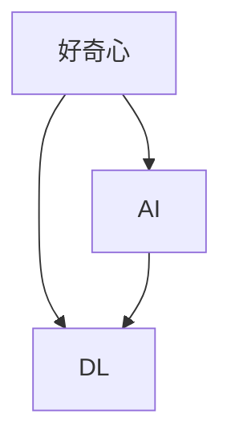

                 

# 探索与理解：好奇心的力量

> 关键词：好奇心, 人工智能, 深度学习, 自我驱动, 创新, 算法优化

## 1. 背景介绍

### 1.1 问题由来

在人类文明的发展史中，好奇心无疑是驱动科学进步的重要力量。从古希腊哲学家对世界的追问，到现代科学对未知世界的探索，好奇心贯穿了人类对知识的不懈追求。而今，在信息爆炸和科技飞跃的时代，好奇心更是成为了推动人工智能(AI)和深度学习(DL)技术发展的关键引擎。

人工智能，尤其是深度学习，依赖于大量的数据和强大的计算能力，同时也需要不断地对新的问题提出探索欲望。好奇心不仅促使研究人员不断攻克技术难题，而且推动着AI技术在医疗、金融、教育等各个领域的广泛应用，带来颠覆性的变革。

### 1.2 问题核心关键点

好奇心作为AI和DL技术发展的催化剂，其核心体现在以下几个方面：

- **知识驱动**：通过好奇心驱使对知识点的不断探索和挖掘，加速了对问题的理解。
- **创新驱动**：好奇心引导研究者探索新颖的算法和模型结构，推动技术的突破性进展。
- **应用驱动**：好奇心激发研究者解决实际问题，不断优化AI模型以应对复杂多变的现实需求。
- **伦理驱动**：好奇心推动研究者关注AI技术的社会影响和伦理问题，确保技术的健康发展。

本文将深入探讨好奇心的力量如何在AI和DL的各个领域发挥作用，从理论到实践，从技术到应用，全面理解好奇心的驱动机制和未来趋势。

## 2. 核心概念与联系

### 2.1 核心概念概述

要理解好奇心在AI和DL中的作用，我们首先需要明确几个核心概念：

- **AI (人工智能)**：旨在使计算机系统具备智能行为的学科，涵盖机器学习、自然语言处理、计算机视觉等多个子领域。
- **DL (深度学习)**：利用多层神经网络进行自动特征提取和学习的技术，是实现AI的核心工具。
- **好奇心**：指对未知事物的兴趣和探索欲，推动科学和技术的不断前进。

好奇心、AI和DL之间的关系，可以通过以下Mermaid流程图来展示：



这个流程图展示了好奇心如何驱动AI和DL技术的发展，以及AI和DL技术在实现好奇心的探索过程中所发挥的作用。

## 3. 核心算法原理 & 具体操作步骤
### 3.1 算法原理概述

好奇心的驱动作用在AI和DL中，主要体现在以下几个算法原理上：

- **自我监督学习**：通过数据的内在结构来引导模型学习，而不是直接监督信号。
- **对抗训练**：通过引入对抗样本，增强模型对异常输入的鲁棒性，推动模型向更复杂的场景扩展。
- **探索性数据分析**：使用数据探索技术来揭示数据内在结构和特征，为模型设计提供灵感。
- **模型结构创新**：不断尝试新的网络结构、优化算法等，以突破现有模型的局限。

这些原理构成了AI和DL算法发展的基石，好奇心正是推动这些算法创新的原动力。

### 3.2 算法步骤详解

一个完整的AI和DL模型开发流程，通常包括以下几个关键步骤：

**Step 1: 数据收集与预处理**

- 收集相关领域的数据集，并进行清洗、归一化等预处理操作。
- 划分数据集为训练集、验证集和测试集，保证模型在未见过的数据上的泛化性能。

**Step 2: 模型设计**

- 设计网络结构，如卷积神经网络(CNN)、循环神经网络(RNN)、Transformer等。
- 选择合适的损失函数和优化器，如交叉熵损失、Adam优化器等。
- 引入正则化技术，如L2正则、Dropout等，防止过拟合。

**Step 3: 训练与优化**

- 使用大量数据对模型进行训练，调整模型参数以最小化损失函数。
- 使用验证集评估模型性能，适时调整模型结构和超参数。
- 引入对抗训练、数据增强等技术提升模型的鲁棒性和泛化能力。

**Step 4: 部署与评估**

- 将训练好的模型部署到实际应用环境中，进行实时推理。
- 使用测试集评估模型在实际场景中的性能，进行优化调整。

### 3.3 算法优缺点

**优点**：
- **高效性**：通过自我监督学习和探索性数据分析，可以高效利用数据信息，避免大量标注成本。
- **鲁棒性**：对抗训练和正则化技术，提升了模型对异常输入的鲁棒性。
- **创新性**：好奇心驱使研究人员不断尝试新的算法和模型结构，推动技术进步。

**缺点**：
- **资源消耗大**：深度学习模型往往需要大量的计算资源，训练成本较高。
- **解释性差**：深度模型被视为“黑箱”，难以解释其内部工作机制。
- **过度拟合风险**：模型在训练过程中容易过拟合，导致泛化性能下降。

## 4. 数学模型和公式 & 详细讲解 & 举例说明

### 4.1 数学模型构建

在AI和DL中，数学模型的构建是其核心环节。以卷积神经网络(CNN)为例，其核心数学模型包括卷积运算、池化操作、全连接层等。

**CNN模型数学公式**：

$$
h(x) = \sigma(Wx + b)
$$

其中，$h(x)$ 表示输入数据 $x$ 经过卷积层和激活函数后的输出。$W$ 为卷积核权重，$b$ 为偏置项，$\sigma$ 为激活函数。

### 4.2 公式推导过程

以多层感知器(MLP)为例，其核心公式如下：

$$
y = f(Wx + b)
$$

其中，$y$ 为输出，$x$ 为输入，$W$ 为权重矩阵，$b$ 为偏置向量，$f$ 为激活函数。

### 4.3 案例分析与讲解

以图像分类为例，CNN模型通过卷积层提取图像特征，池化层降低特征维度，全连接层进行分类。训练过程通过反向传播算法更新模型参数，最小化损失函数。

## 5. 项目实践：代码实例和详细解释说明

### 5.1 开发环境搭建

在进行AI和DL模型开发前，需要配置好开发环境。以下是使用Python进行TensorFlow开发的环境配置流程：

1. 安装Anaconda：从官网下载并安装Anaconda，用于创建独立的Python环境。
2. 创建并激活虚拟环境：
```bash
conda create -n tf-env python=3.7 
conda activate tf-env
```

3. 安装TensorFlow：根据CUDA版本，从官网获取对应的安装命令。例如：
```bash
conda install tensorflow -c tf -c conda-forge
```

4. 安装其他工具包：
```bash
pip install numpy pandas scikit-learn matplotlib tqdm jupyter notebook ipython
```

完成上述步骤后，即可在`tf-env`环境中开始模型开发。

### 5.2 源代码详细实现

下面以图像分类为例，给出使用TensorFlow进行卷积神经网络(CNN)开发的PyTorch代码实现。

```python
import tensorflow as tf
from tensorflow.keras import layers, models

# 构建CNN模型
model = models.Sequential()
model.add(layers.Conv2D(32, (3, 3), activation='relu', input_shape=(28, 28, 1)))
model.add(layers.MaxPooling2D((2, 2)))
model.add(layers.Conv2D(64, (3, 3), activation='relu'))
model.add(layers.MaxPooling2D((2, 2)))
model.add(layers.Conv2D(64, (3, 3), activation='relu'))
model.add(layers.Flatten())
model.add(layers.Dense(64, activation='relu'))
model.add(layers.Dense(10, activation='softmax'))

# 编译模型
model.compile(optimizer='adam',
              loss='sparse_categorical_crossentropy',
              metrics=['accuracy'])

# 加载数据集
(x_train, y_train), (x_test, y_test) = tf.keras.datasets.mnist.load_data()
x_train = x_train.reshape(x_train.shape[0], 28, 28, 1)
x_test = x_test.reshape(x_test.shape[0], 28, 28, 1)
x_train = x_train.astype('float32') / 255
x_test = x_test.astype('float32') / 255

# 训练模型
model.fit(x_train, y_train, epochs=5, batch_size=64, validation_data=(x_test, y_test))
```

### 5.3 代码解读与分析

让我们再详细解读一下关键代码的实现细节：

**构建CNN模型**：
- 使用Sequential模型来串联卷积层、池化层、全连接层等组件。
- 在卷积层使用ReLU激活函数。
- 在全连接层使用Softmax激活函数进行多分类输出。

**编译模型**：
- 选择Adam优化器，交叉熵损失函数。
- 设置模型评估指标为准确率。

**加载数据集**：
- 使用MNIST数据集，并对其进行了预处理和归一化。

**训练模型**：
- 使用训练集进行5个epoch的训练，每个epoch的batch size为64。
- 在验证集上评估模型性能。

## 6. 实际应用场景

### 6.1 自动驾驶

在自动驾驶领域，好奇心驱动了AI技术在环境感知、路径规划、决策控制等环节的应用。通过好奇心驱动的数据探索和模型创新，研究人员开发出高性能的感知网络，提升了驾驶系统的智能化水平。

在实际应用中，自动驾驶系统通过摄像头和传感器采集环境数据，使用卷积神经网络进行图像处理，生成实时环境地图。基于地图和车辆位置，通过循环神经网络进行路径规划。最后，使用强化学习算法进行决策控制，确保车辆在复杂交通环境中的安全行驶。

### 6.2 医疗诊断

好奇心推动了AI在医疗领域的应用，尤其是在图像诊断和基因组分析等任务上。研究人员通过探索性的数据挖掘和模型优化，开发出高精度的医疗诊断系统，大幅提升了诊断效率和准确性。

在实际应用中，医疗影像诊断系统通过好奇心的驱动，利用大规模标注影像数据集，训练深度卷积神经网络模型。模型能够自动分析影像特征，进行肿瘤、病变等疾病的早期诊断。此外，基因组分析系统利用深度学习技术，对基因序列数据进行模式识别，帮助研究人员发现新的基因变异和疾病关联。

### 6.3 智能客服

在智能客服领域，好奇心驱动了自然语言处理技术的应用。通过探索性的数据处理和模型设计，研究人员开发出高效智能客服系统，大幅提升了客户服务体验。

在实际应用中，智能客服系统通过分析用户输入的自然语言，使用循环神经网络进行意图识别和实体抽取。基于上下文信息，通过注意力机制生成回复，进一步提升对话流畅性和准确性。此外，通过好奇心驱动的数据增强和模型优化，系统能够不断学习新问题和用户偏好，提升服务效果。

### 6.4 未来应用展望

随着AI和DL技术的不断进步，好奇心驱动的探索与创新将带来更多颠覆性的应用。

在智慧城市治理中，通过好奇心驱动的数据融合和模型优化，可以实现城市环境的智能监测和应急响应。在金融风险管理中，通过好奇心驱动的金融数据分析和模型构建，可以实时预警市场异常和风险趋势。在教育领域，通过好奇心驱动的个性化推荐和学习路径优化，可以实现因材施教，提升教育质量。

未来，AI和DL技术将在更多领域展现其巨大的潜力，好奇心将持续推动技术的不断进步，为人类社会的可持续发展注入新的动力。

## 7. 工具和资源推荐

### 7.1 学习资源推荐

为了帮助开发者系统掌握AI和DL的理论基础和实践技巧，这里推荐一些优质的学习资源：

1. 《深度学习》（Ian Goodfellow、Yoshua Bengio、Aaron Courville著）：深度学习领域的经典教材，涵盖了从基础到高级的全面内容。
2. CS231n《卷积神经网络》课程：斯坦福大学开设的计算机视觉课程，通过Lecture视频和配套作业，带你深入理解卷积神经网络。
3. DeepLearning.ai：由Andrew Ng教授领衔的深度学习在线课程平台，提供从入门到高级的全面课程体系。
4. TensorFlow官方文档：TensorFlow的官方文档，提供了详尽的API和样例代码，是学习和实践TensorFlow的必备资料。
5. ArXiv论文库：作为全球最大的开放获取论文库，ArXiv收录了大量深度学习领域的最新研究成果，是了解前沿动态的重要来源。

通过对这些资源的学习实践，相信你一定能够快速掌握AI和DL的精髓，并用于解决实际的工程问题。

### 7.2 开发工具推荐

高效的开发离不开优秀的工具支持。以下是几款用于AI和DL开发的常用工具：

1. TensorFlow：由Google主导开发的深度学习框架，生产部署方便，适合大规模工程应用。
2. PyTorch：基于Python的开源深度学习框架，灵活动态的计算图，适合快速迭代研究。
3. Keras：高层次的深度学习框架，封装了TensorFlow和Theano等底层库，易于使用。
4. Jupyter Notebook：开源的交互式计算环境，支持Python代码编写和实时运行，适合科研和开发。
5. Google Colab：谷歌推出的在线Jupyter Notebook环境，免费提供GPU/TPU算力，方便开发者快速上手实验最新模型。

合理利用这些工具，可以显著提升AI和DL模型的开发效率，加快创新迭代的步伐。

### 7.3 相关论文推荐

AI和DL技术的发展源于学界的持续研究。以下是几篇奠基性的相关论文，推荐阅读：

1. AlexNet: ImageNet Classification with Deep Convolutional Neural Networks（ImageNet图像分类）：提出AlexNet模型，开启了深度学习在计算机视觉领域的革命。
2. Deep Residual Learning for Image Recognition（深度残差学习）：提出ResNet模型，解决了深层网络训练中的梯度消失问题。
3. Generative Adversarial Nets（生成对抗网络）：提出GAN模型，推动了生成模型在图像生成、数据增强等领域的应用。
4. Attention is All You Need（注意力机制）：提出Transformer模型，开启了自注意力机制在深度学习中的应用。
5. BERT: Pre-training of Deep Bidirectional Transformers for Language Understanding（BERT语言理解）：提出BERT模型，显著提升了自然语言处理任务的效果。
6. YOLO: Real-Time Object Detection（实时物体检测）：提出YOLO模型，提升了物体检测的速度和准确性。

这些论文代表了大数据和DL技术的发展脉络。通过学习这些前沿成果，可以帮助研究者把握学科前进方向，激发更多的创新灵感。

## 8. 总结：未来发展趋势与挑战

### 8.1 总结

本文对好奇心在AI和DL中的作用进行了全面系统的介绍。首先阐述了好奇心作为驱动力，如何促进AI和DL技术的不断进步和发展。其次，从理论到实践，详细讲解了AI和DL模型的开发流程和核心算法，提供了完整的代码实例和分析解读。同时，本文还探讨了AI和DL技术在实际应用中的广泛场景，展示了其巨大的潜力和应用前景。此外，本文精选了AI和DL学习的各类资源，力求为读者提供全方位的技术指引。

通过本文的系统梳理，可以看到，好奇心作为AI和DL技术的驱动力，在其发展的各个阶段都发挥了关键作用。好奇心不仅促进了技术的不断创新，而且推动了AI技术在各个领域的广泛应用，为人类社会的可持续发展注入新的动力。

### 8.2 未来发展趋势

展望未来，AI和DL技术将在更多领域展现其巨大的潜力，好奇心将持续推动技术的不断进步。

1. **模型规模持续增大**：随着算力成本的下降和数据规模的扩张，预训练模型和神经网络的结构将不断扩展，参数量将进一步增加。超大规模模型蕴含的丰富知识，有望支撑更加复杂多变的下游任务。

2. **好奇心驱动的自我监督学习**：未来的AI模型将更加依赖于自我监督学习，通过数据的内在结构和模式来引导模型学习，避免大量标注数据的依赖。

3. **跨领域知识融合**：AI和DL技术将更加注重跨领域知识融合，通过好奇心驱动的探索性数据分析，揭示不同领域之间的内在联系，提升模型的泛化能力和创新性。

4. **数据增强和对抗训练**：为了应对复杂多变的现实场景，AI和DL模型将引入更多的数据增强和对抗训练技术，提升模型的鲁棒性和泛化能力。

5. **伦理和可解释性**：随着AI和DL技术的应用场景不断扩大，其伦理和可解释性问题将愈发重要。未来AI模型将更加注重模型的透明性和可解释性，确保技术的安全和可靠。

### 8.3 面临的挑战

尽管AI和DL技术已经取得了显著进展，但在迈向更加智能化、普适化应用的过程中，仍面临诸多挑战：

1. **计算资源消耗大**：深度学习模型往往需要大量的计算资源，训练成本较高。如何降低计算成本，提升模型训练和推理的效率，仍是一个重要问题。

2. **数据质量和标注成本**：大规模数据集和高质量标注数据的获取成本较高，如何通过好奇心驱动的数据探索，降低对标注数据的依赖，将是一个重要研究方向。

3. **模型鲁棒性和泛化能力**：AI和DL模型在面对未知数据和复杂场景时，鲁棒性和泛化能力仍有待提升，如何通过对抗训练和正则化技术，提升模型的稳定性和适应性，是一个关键挑战。

4. **模型可解释性**：深度学习模型被视为“黑箱”，难以解释其内部工作机制。如何通过好奇心驱动的探索性数据分析和模型优化，提升模型的透明性和可解释性，是一个重要课题。

5. **伦理和安全性**：AI和DL技术的应用场景涉及医疗、金融等高风险领域，其伦理和安全性问题将愈发重要。如何通过好奇心驱动的探索性数据分析和模型优化，确保技术的安全和可靠，是一个关键挑战。

### 8.4 研究展望

面对AI和DL技术所面临的种种挑战，未来的研究需要在以下几个方面寻求新的突破：

1. **数据高效探索技术**：通过好奇心驱动的数据探索和利用技术，降低对大规模标注数据的依赖，实现数据的高效利用和生成。

2. **模型高效优化算法**：开发更加高效和鲁棒的优化算法，提升模型训练和推理的效率，降低计算资源消耗。

3. **跨领域知识融合方法**：通过好奇心驱动的探索性数据分析，揭示不同领域之间的内在联系，提升模型的泛化能力和创新性。

4. **模型透明性和可解释性**：通过好奇心驱动的探索性数据分析和模型优化，提升模型的透明性和可解释性，确保技术的安全和可靠。

5. **跨学科协同创新**：AI和DL技术将更加注重跨学科协同创新，通过跨领域的知识融合和探索，推动技术的不断进步。

这些研究方向的探索，必将引领AI和DL技术迈向更高的台阶，为构建安全、可靠、可解释、可控的智能系统铺平道路。面向未来，AI和DL技术还需要与其他人工智能技术进行更深入的融合，如知识表示、因果推理、强化学习等，多路径协同发力，共同推动自然语言理解和智能交互系统的进步。只有勇于创新、敢于突破，才能不断拓展AI和DL的边界，让智能技术更好地造福人类社会。

## 9. 附录：常见问题与解答

**Q1：AI和DL模型如何实现自我监督学习？**

A: AI和DL模型通过数据的内在结构和模式进行自我监督学习，而不是直接依赖于监督信号。常见的自我监督学习任务包括数据生成、掩码语言模型、对比学习等。

**Q2：对抗训练和正则化技术如何提升模型鲁棒性？**

A: 对抗训练通过引入对抗样本，训练模型对异常输入的鲁棒性。正则化技术如L2正则和Dropout，可以防止模型在训练过程中过拟合，提升模型的泛化能力。

**Q3：数据增强技术如何提高模型泛化能力？**

A: 数据增强技术通过对训练数据进行扩充和变换，提升模型的泛化能力。常见的方法包括数据裁剪、旋转、镜像、回译等。

**Q4：如何提升AI和DL模型的透明性和可解释性？**

A: 通过好奇心驱动的探索性数据分析和模型优化，可以提升模型的透明性和可解释性。使用可解释性技术如SHAP、LIME等，可以帮助理解模型的决策过程。

**Q5：AI和DL技术在伦理和安全方面需要注意哪些问题？**

A: AI和DL技术的应用场景涉及医疗、金融等高风险领域，其伦理和安全问题将愈发重要。需要关注模型偏见的消除、隐私保护、算法透明性等问题，确保技术的安全和可靠。

通过这些问题的解答，可以看到，AI和DL技术在实际应用中仍然面临许多挑战，但好奇心作为驱动力，将不断推动技术进步和创新。相信随着学界和产业界的共同努力，这些挑战终将一一被克服，AI和DL技术必将为人类社会的可持续发展注入新的动力。

