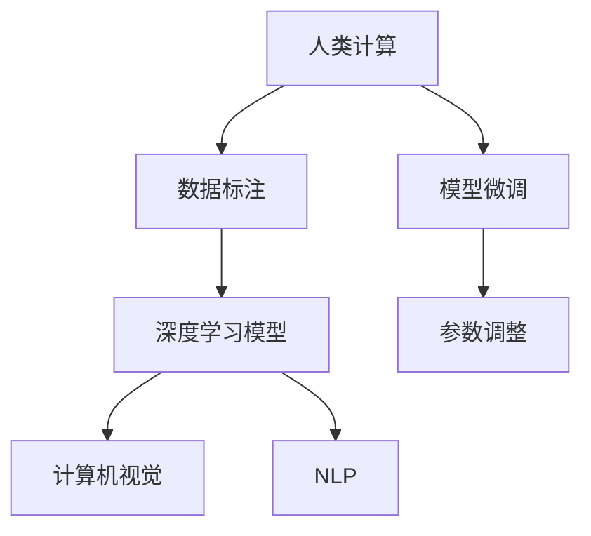

                 

# 探索人类思维的奥秘：人类计算的认知价值

在人工智能(AI)迅猛发展的今天，人类计算与人工智能的关系日益紧密。人类计算（Human Computation），作为人与机器交互的一种新范式，正在赋予AI更深刻的认知价值，探索人类思维的奥秘，为AI的智能化演进开辟了新的道路。本文将从背景、核心概念、算法原理、实际应用和未来展望等多方面，探讨人类计算在AI领域的认知价值和潜力。

## 1. 背景介绍

### 1.1 问题由来
在深度学习技术蓬勃发展的背景下，AI的智能化水平得到了空前提升。从语音识别到图像识别，从自然语言处理到机器翻译，AI已经渗透到众多领域，深刻影响着人们的生活和工作。然而，AI技术的智能化并非一蹴而就，它需要深度学习模型在大量数据上进行训练，并在此基础上不断迭代优化。这一过程，在很大程度上依赖于人类计算，即人脑对数据的理解、分析与决策。

人类计算（Human Computation），是指利用人的认知能力，通过阅读、标注、推理等形式，为机器学习模型提供高质量的训练数据。它不仅在机器学习模型预训练阶段发挥着重要作用，更在模型微调、参数调整等方面起着不可或缺的作用。

### 1.2 问题核心关键点
人类计算的核心在于如何更好地将人的认知能力和AI算法相融合，以提高模型的精度和泛化能力。关键点包括：
- 数据质量：高质量的标注数据是模型训练的基础。
- 认知结构：如何利用人脑的记忆、推理等能力，优化模型的训练过程。
- 交互机制：人机交互的方式和效率，直接影响着计算的效率和效果。

## 2. 核心概念与联系

### 2.1 核心概念概述

为了更好地理解人类计算的认知价值，本节将介绍几个核心概念：

- 人类计算（Human Computation）：利用人类的认知能力，为AI模型提供高质量的数据和计算过程。包括数据标注、模型训练、参数调整等环节。
- 人工智能（AI）：一种通过模拟人类智能行为，实现自主决策和学习的技术。AI的核心在于强大的算法和数据驱动。
- 深度学习（Deep Learning）：一种基于神经网络的多层算法，通过反向传播等机制，实现对数据的复杂映射和特征提取。
- 计算机视觉（CV）：AI的一个重要分支，通过算法实现图像的识别、分类、分割等任务。
- 自然语言处理（NLP）：AI的另一重要分支，通过算法实现文本的语义理解、生成、翻译等任务。

这些概念之间存在密切的联系，如图示：



这个流程图展示了人类计算在AI系统中的关键作用：

1. 通过数据标注，为深度学习模型提供高质量的训练数据。
2. 利用深度学习算法，对数据进行特征提取和模式识别。
3. 计算机视觉和自然语言处理，分别应用于图像和文本数据的处理。
4. 在模型训练过程中，利用人类计算对模型进行微调和参数调整，提高其性能。

## 3. 核心算法原理 & 具体操作步骤
### 3.1 算法原理概述

人类计算的核心在于通过人类认知能力对数据进行标注和处理，为AI模型提供高质量的输入。其基本原理可以概括为：

1. **数据标注**：人类通过阅读、理解和标注，为模型提供监督信号，使模型能够学习到正确的特征和规律。
2. **认知推理**：利用人脑的记忆、推理能力，对数据进行更深入的理解和分析，为模型提供更丰富的信息。
3. **人机交互**：通过自然语言界面、图形界面等形式，提高人机交互的效率和准确性，减少计算成本。

### 3.2 算法步骤详解

人类计算的具体操作步骤包括：

1. **数据收集**：收集大量原始数据，包括图像、文本、音频等。
2. **数据标注**：由人工对数据进行标注，如分类、检测、生成等。
3. **模型训练**：将标注数据输入到深度学习模型中，进行参数调整和优化。
4. **模型微调**：在模型训练完成后，利用新数据对其进行微调，以提高模型的泛化能力。
5. **参数调整**：根据模型在实际应用中的表现，对模型的参数进行优化，提升模型性能。

### 3.3 算法优缺点

人类计算具有以下优点：

- **数据质量高**：人工标注数据质量高，可以有效提高模型的训练效果。
- **认知复杂度**：利用人脑的复杂推理能力，可以发现数据中的复杂模式和规律。
- **灵活性**：可以根据实际需求，灵活调整标注规则和算法策略。

同时，人类计算也存在一些缺点：

- **成本高**：人工标注成本较高，尤其是在大规模数据集上。
- **效率低**：人工标注速度慢，无法满足大规模数据处理的需要。
- **主观性**：人工标注存在主观性，可能影响模型的泛化能力。

### 3.4 算法应用领域

人类计算广泛应用于以下几个领域：

- **计算机视觉**：在图像识别、分类、检测等任务中，通过人工标注数据，训练深度学习模型。
- **自然语言处理**：在文本分类、情感分析、机器翻译等任务中，利用人工标注数据，训练自然语言处理模型。
- **医疗诊断**：在医学影像分析、病理诊断等任务中，通过人工标注数据，训练医疗AI模型。
- **金融预测**：在股票价格预测、风险评估等任务中，利用人工标注数据，训练金融AI模型。
- **智能推荐**：在个性化推荐、广告投放等任务中，通过人工标注数据，训练推荐系统。

## 4. 数学模型和公式 & 详细讲解

### 4.1 数学模型构建

本节将使用数学语言，对人类计算的模型构建进行详细讲解。

设原始数据集为 $D=\{(x_i,y_i)\}_{i=1}^N$，其中 $x_i$ 为输入，$y_i$ 为标签。假设深度学习模型为 $M$，其参数为 $\theta$，则模型的预测函数为：

$$
\hat{y} = M(x; \theta)
$$

模型的损失函数为：

$$
\mathcal{L}(\theta) = \frac{1}{N} \sum_{i=1}^N \ell(\hat{y_i},y_i)
$$

其中 $\ell$ 为损失函数，可以是交叉熵损失、均方误差损失等。

### 4.2 公式推导过程

以交叉熵损失函数为例，进行详细推导：

1. **预测函数**：
$$
\hat{y} = M(x; \theta)
$$

2. **损失函数**：
$$
\mathcal{L}(\theta) = -\frac{1}{N} \sum_{i=1}^N y_i \log \hat{y_i} + (1-y_i) \log(1-\hat{y_i})
$$

3. **梯度更新**：
$$
\theta \leftarrow \theta - \eta \nabla_{\theta} \mathcal{L}(\theta)
$$

其中 $\eta$ 为学习率，$\nabla_{\theta} \mathcal{L}(\theta)$ 为损失函数对参数 $\theta$ 的梯度。

### 4.3 案例分析与讲解

以图像分类任务为例，进行详细分析：

假设原始数据集为 $D=\{(x_i,y_i)\}_{i=1}^N$，其中 $x_i$ 为图像，$y_i$ 为标签。深度学习模型为 $M$，其参数为 $\theta$，则模型的预测函数为：

$$
\hat{y} = M(x; \theta)
$$

损失函数为交叉熵损失：

$$
\mathcal{L}(\theta) = -\frac{1}{N} \sum_{i=1}^N y_i \log \hat{y_i} + (1-y_i) \log(1-\hat{y_i})
$$

模型的优化过程为：

1. **数据标注**：人工对图像进行标注，如猫、狗、鸟等。
2. **模型训练**：将标注数据输入到深度学习模型中，进行参数调整和优化。
3. **模型微调**：在模型训练完成后，利用新数据对其进行微调，以提高模型的泛化能力。
4. **参数调整**：根据模型在实际应用中的表现，对模型的参数进行优化，提升模型性能。

## 5. 项目实践：代码实例和详细解释说明
### 5.1 开发环境搭建

在进行人类计算实践前，我们需要准备好开发环境。以下是使用Python进行TensorFlow开发的环境配置流程：

1. 安装Anaconda：从官网下载并安装Anaconda，用于创建独立的Python环境。

2. 创建并激活虚拟环境：
```bash
conda create -n tf-env python=3.8 
conda activate tf-env
```

3. 安装TensorFlow：根据CUDA版本，从官网获取对应的安装命令。例如：
```bash
conda install tensorflow=2.7 cudatoolkit=11.1 -c conda-forge
```

4. 安装各类工具包：
```bash
pip install numpy pandas scikit-learn matplotlib tqdm jupyter notebook ipython
```

完成上述步骤后，即可在`tf-env`环境中开始人类计算的实践。

### 5.2 源代码详细实现

这里我们以图像分类任务为例，给出使用TensorFlow进行人类计算的PyTorch代码实现。

首先，定义数据处理函数：

```python
import tensorflow as tf
import numpy as np

def load_and_preprocess_data(data_dir, batch_size=64):
    class_names = ['cat', 'dog', 'bird']
    class_indices = {class_names[i]: i for i in range(len(class_names))}
    
    image_dir = os.path.join(data_dir, 'train')
    labels_file = os.path.join(data_dir, 'labels.txt')
    
    with open(labels_file, 'r') as f:
        labels = f.read().splitlines()
    
    image_data = []
    for label in labels:
        label_path = os.path.join(image_dir, label + '/*.jpg')
        for image_file in glob.glob(label_path):
            image = tf.io.read_file(image_file)
            image = tf.image.decode_jpeg(image, channels=3)
            image = tf.image.resize(image, (224, 224))
            image = tf.image.per_image_standardization(image)
            image_data.append(image)
    
    labels = [class_indices[label] for label in labels]
    
    image_data = tf.stack(image_data)
    labels = tf.stack(labels)
    
    dataset = tf.data.Dataset.from_tensor_slices((image_data, labels))
    dataset = dataset.shuffle(buffer_size=10000)
    dataset = dataset.batch(batch_size)
    
    return dataset
```

然后，定义模型和优化器：

```python
from tensorflow.keras.applications import ResNet50
from tensorflow.keras.optimizers import Adam

model = ResNet50(weights='imagenet', include_top=False)
for layer in model.layers:
    layer.trainable = False

x = tf.keras.layers.Input(shape=(224, 224, 3))
x = tf.keras.layers.Conv2D(32, 3, activation='relu')(x)
x = tf.keras.layers.MaxPooling2D(pool_size=(2, 2))(x)
x = tf.keras.layers.Flatten()(x)
x = tf.keras.layers.Dense(128, activation='relu')(x)
x = tf.keras.layers.Dropout(0.5)(x)
x = tf.keras.layers.Dense(len(class_names), activation='softmax')(x)
model = tf.keras.Model(x, outputs=x)

optimizer = Adam(lr=1e-4)
```

接着，定义训练和评估函数：

```python
import numpy as np

def train_epoch(model, dataset, batch_size, optimizer):
    dataset = dataset.shuffle(buffer_size=10000)
    model.compile(optimizer=optimizer, loss='sparse_categorical_crossentropy', metrics=['accuracy'])
    model.fit(dataset, epochs=1, verbose=0)
    
    return model
```

最后，启动训练流程并在测试集上评估：

```python
epochs = 10
batch_size = 64

for epoch in range(epochs):
    model = train_epoch(model, train_dataset, batch_size, optimizer)
    
    print(f'Epoch {epoch+1}, train loss: {model.loss}, train accuracy: {model.metrics[1]}')
    
    test_dataset = load_and_preprocess_data(test_data_dir)
    test_loss, test_acc = model.evaluate(test_dataset)
    print(f'Epoch {epoch+1}, test loss: {test_loss}, test accuracy: {test_acc}')
```

以上就是使用TensorFlow进行图像分类任务的人类计算的完整代码实现。可以看到，通过TensorFlow的强大封装，我们可以用相对简洁的代码完成模型的训练和评估。

### 5.3 代码解读与分析

让我们再详细解读一下关键代码的实现细节：

**load_and_preprocess_data函数**：
- 定义了数据加载和预处理流程，包括读取标签文件、解析图像文件、标准化图像等步骤。

**train_epoch函数**：
- 定义了模型训练的过程，包括模型编译、数据加载、模型训练、模型评估等步骤。

**模型定义**：
- 通过继承Keras的Model类，定义了包含卷积层、池化层、全连接层的深度学习模型。

**模型训练**：
- 在每个epoch中，通过调用train_epoch函数对模型进行训练。
- 在训练过程中，通过调用optimizer对象的update方法更新模型参数。

**模型评估**：
- 在每个epoch结束后，通过调用evaluate方法在测试集上评估模型性能。

可以看到，TensorFlow配合Keras的强大封装，使得图像分类任务的人类计算代码实现变得简洁高效。开发者可以将更多精力放在数据处理、模型改进等高层逻辑上，而不必过多关注底层的实现细节。

当然，工业级的系统实现还需考虑更多因素，如模型的保存和部署、超参数的自动搜索、更灵活的任务适配层等。但核心的计算流程基本与此类似。

## 6. 实际应用场景

### 6.1 智能推荐系统

智能推荐系统是人工智能的重要应用之一。它通过分析用户的历史行为数据，推荐符合用户兴趣的商品或内容。人类计算在此过程中起着关键作用，主要体现在以下几个方面：

- **数据标注**：收集用户的历史行为数据，对其进行标注，如点击、购买、浏览等。
- **认知推理**：利用人脑的记忆、推理能力，分析用户行为数据，发现用户兴趣和偏好。
- **人机交互**：通过自然语言界面、图形界面等形式，收集用户反馈，优化推荐算法。

通过人类计算，智能推荐系统能够更准确地理解用户需求，提供个性化的推荐服务，提升用户体验和满意度。

### 6.2 医疗诊断系统

医疗诊断是人工智能的另一个重要应用领域。在医学影像分析、病理诊断等任务中，人类计算起着关键作用。

- **数据标注**：人工对医学影像进行标注，如肿瘤、器官、病变等。
- **认知推理**：利用人脑的记忆、推理能力，分析医学影像，发现异常病变。
- **人机交互**：通过自然语言界面、图形界面等形式，收集医生反馈，优化诊断算法。

通过人类计算，医疗诊断系统能够更准确地识别病变，提供更可靠的诊断结果，提升医疗服务质量。

### 6.3 金融预测系统

金融预测是人工智能的另一个重要应用领域。在股票价格预测、风险评估等任务中，人类计算起着关键作用。

- **数据标注**：人工对历史金融数据进行标注，如开盘价、收盘价、成交量等。
- **认知推理**：利用人脑的记忆、推理能力，分析金融数据，发现市场趋势和规律。
- **人机交互**：通过自然语言界面、图形界面等形式，收集分析师反馈，优化预测算法。

通过人类计算，金融预测系统能够更准确地预测市场走势，提供更可靠的投资建议，提升投资收益。

## 7. 工具和资源推荐

### 7.1 学习资源推荐

为了帮助开发者系统掌握人类计算的理论基础和实践技巧，这里推荐一些优质的学习资源：

1. 《深度学习》系列书籍：由深度学习领域权威人士撰写，全面介绍了深度学习的基本概念、算法原理和应用案例。
2. 《计算机视觉：基础与前沿》课程：斯坦福大学开设的计算机视觉课程，讲解了图像处理、特征提取、目标检测等关键技术。
3. 《自然语言处理》课程：MIT开设的自然语言处理课程，讲解了文本分类、情感分析、机器翻译等经典模型。
4. Kaggle平台：一个开源数据集和机器学习竞赛平台，提供大量高质量的标注数据和模型训练环境，方便开发者实践和交流。
5. TensorFlow官方文档：TensorFlow的官方文档，提供了全面的API和使用指南，是学习TensorFlow的重要资源。

通过对这些资源的学习实践，相信你一定能够快速掌握人类计算的精髓，并用于解决实际的AI问题。

### 7.2 开发工具推荐

高效的开发离不开优秀的工具支持。以下是几款用于人类计算开发的常用工具：

1. TensorFlow：由Google主导开发的开源深度学习框架，生产部署方便，适合大规模工程应用。
2. PyTorch：基于Python的开源深度学习框架，灵活动态的计算图，适合快速迭代研究。
3. Keras：基于TensorFlow和Theano的高级API，适合快速搭建深度学习模型。
4. Jupyter Notebook：一个交互式编程环境，方便开发者快速编写和测试代码。
5. GitHub：一个代码托管和协作平台，方便开发者版本控制和代码共享。

合理利用这些工具，可以显著提升人类计算任务的开发效率，加快创新迭代的步伐。

### 7.3 相关论文推荐

人类计算的研究源于学界的持续研究。以下是几篇奠基性的相关论文，推荐阅读：

1. "Human-in-the-loop Machine Learning"：探讨了人机协同的机器学习范式，强调了人类计算的重要性。
2. "Improving Deep Neural Networks by Means of Self-Training with Synthetic Data"：提出了通过人机协同生成合成数据，提高深度学习模型性能的方法。
3. "Human-Computer Interaction"：介绍了人机交互的理论和实践，为人类计算提供了理论基础。
4. "The Anatomy of a Large-Scale AI System"：介绍了AI系统的构建过程，强调了人类计算在其中的作用。
5. "Human Computing"：探讨了人类计算的多种应用场景，为实际应用提供了理论指导。

这些论文代表了大语言模型微调技术的发展脉络。通过学习这些前沿成果，可以帮助研究者把握学科前进方向，激发更多的创新灵感。

## 8. 总结：未来发展趋势与挑战

### 8.1 总结

本文对人类计算在AI领域的认知价值进行了全面系统的介绍。首先阐述了人类计算的研究背景和意义，明确了人类计算在AI模型训练、优化过程中的重要作用。其次，从原理到实践，详细讲解了人类计算的数学模型和具体步骤，给出了实际应用中的代码实现。同时，本文还广泛探讨了人类计算在多个行业领域的应用前景，展示了其广阔的发展潜力。此外，本文精选了人类计算技术的各类学习资源，力求为读者提供全方位的技术指引。

通过本文的系统梳理，可以看到，人类计算作为人与机器交互的新范式，正在为AI的智能化演进赋予更深刻的认知价值，探索人类思维的奥秘。人类计算在提升模型精度、泛化能力、认知推理等方面，具有不可替代的重要作用。未来，伴随技术的不断进步，人类计算必将在更多的领域得到应用，为人工智能的智能化发展带来新的突破。

### 8.2 未来发展趋势

展望未来，人类计算在AI领域的发展将呈现以下几个趋势：

1. **多模态融合**：人类计算将融合视觉、语音、文本等多模态数据，提升AI模型的认知能力。
2. **跨领域协作**：人类计算将突破行业界限，实现跨领域的协同计算，提升AI模型的应用范围。
3. **个性化定制**：人类计算将结合用户个性化需求，优化AI模型，提供更贴合用户需求的智能化服务。
4. **自动化优化**：人类计算将引入自动化优化算法，提高AI模型的训练效率，降低人工成本。
5. **增强现实交互**：人类计算将结合增强现实技术，提升人机交互的沉浸感和自然性，提供更自然的交互体验。
6. **边缘计算**：人类计算将结合边缘计算技术，实现本地化计算和推理，提升AI模型的实时性和效率。

以上趋势凸显了人类计算在AI领域的广阔前景。这些方向的探索发展，必将进一步提升AI系统的智能化水平，为人类认知智能的进化带来深远影响。

### 8.3 面临的挑战

尽管人类计算在AI领域已经取得了显著进展，但在迈向更加智能化、普适化应用的过程中，它仍面临着诸多挑战：

1. **数据依赖性**：人类计算高度依赖高质量的标注数据，标注成本高，获取难度大。
2. **可解释性不足**：人类计算的过程缺乏透明度，模型决策的依据难以解释，影响系统可信度。
3. **人机交互复杂性**：人机交互过程中，任务复杂性高，效率低下，影响系统性能。
4. **安全性和隐私性**：人类计算涉及大量敏感数据，数据安全和隐私保护成为重要问题。
5. **算法局限性**：人类计算的算法依赖于人的认知能力，受限于人的知识水平和经验，存在局限性。
6. **成本高昂**：人类计算需要大量人力资源，成本高昂，难以大规模推广应用。

正视这些挑战，积极应对并寻求突破，将是大语言模型微调技术迈向成熟的必由之路。相信随着学界和产业界的共同努力，这些挑战终将一一被克服，人类计算必将在构建智能系统的智能化演进中发挥更加重要的作用。

### 8.4 研究展望

面对人类计算面临的种种挑战，未来的研究需要在以下几个方面寻求新的突破：

1. **多模态数据融合**：探索多模态数据的融合算法，提升AI模型的认知能力。
2. **自动化优化**：研究自动化优化算法，提高人类计算的效率和效果。
3. **增强现实交互**：结合增强现实技术，提升人机交互的自然性和沉浸感。
4. **算法鲁棒性**：提高人类计算算法的鲁棒性和可解释性，提升系统的可信度。
5. **数据安全和隐私保护**：研究数据安全和隐私保护技术，确保数据安全。
6. **跨领域协作**：探索跨领域的协同计算方法，提升AI模型的应用范围。

这些研究方向的探索，必将引领人类计算技术迈向更高的台阶，为人工智能的智能化发展带来新的突破。面向未来，人类计算需要与其他AI技术进行更深入的融合，共同推动人工智能的智能化演进，实现人机协同的智能系统。只有勇于创新、敢于突破，才能不断拓展人类计算的边界，为智能系统的智能化演进带来新的突破。

## 9. 附录：常见问题与解答

**Q1：人类计算与深度学习有什么区别？**

A: 深度学习是一种基于神经网络的技术，通过反向传播等机制，实现对数据的复杂映射和特征提取。而人类计算则是利用人的认知能力，为AI模型提供高质量的数据和计算过程。人类计算的目的是通过人机协同，提升AI模型的性能和泛化能力。

**Q2：人类计算在实际应用中有哪些成功案例？**

A: 人类计算在实际应用中有很多成功案例，如：
1. **智能推荐系统**：通过人类计算，智能推荐系统能够更准确地理解用户需求，提供个性化的推荐服务，提升用户体验和满意度。
2. **医疗诊断系统**：通过人类计算，医疗诊断系统能够更准确地识别病变，提供更可靠的诊断结果，提升医疗服务质量。
3. **金融预测系统**：通过人类计算，金融预测系统能够更准确地预测市场走势，提供更可靠的投资建议，提升投资收益。

**Q3：如何提高人类计算的效率？**

A: 提高人类计算的效率，可以从以下几个方面入手：
1. **自动化标注**：引入自动化标注工具，减少人工标注工作量。
2. **众包平台**：利用众包平台，快速获取大量标注数据。
3. **智能助手**：引入智能助手，辅助人工进行标注和计算，提高效率。
4. **优化算法**：研究更高效的算法，提高人机协同的效率。

**Q4：人类计算有哪些应用场景？**

A: 人类计算在多个领域都有广泛应用，如：
1. **计算机视觉**：在图像识别、分类、检测等任务中，利用人类计算，训练深度学习模型。
2. **自然语言处理**：在文本分类、情感分析、机器翻译等任务中，利用人类计算，训练自然语言处理模型。
3. **医疗诊断**：在医学影像分析、病理诊断等任务中，利用人类计算，训练医疗AI模型。
4. **金融预测**：在股票价格预测、风险评估等任务中，利用人类计算，训练金融AI模型。
5. **智能推荐**：在个性化推荐、广告投放等任务中，利用人类计算，训练推荐系统。

通过本文的系统梳理，可以看到，人类计算作为人与机器交互的新范式，正在为AI的智能化演进赋予更深刻的认知价值，探索人类思维的奥秘。人类计算在提升模型精度、泛化能力、认知推理等方面，具有不可替代的重要作用。未来，伴随技术的不断进步，人类计算必将在更多的领域得到应用，为人工智能的智能化发展带来新的突破。

