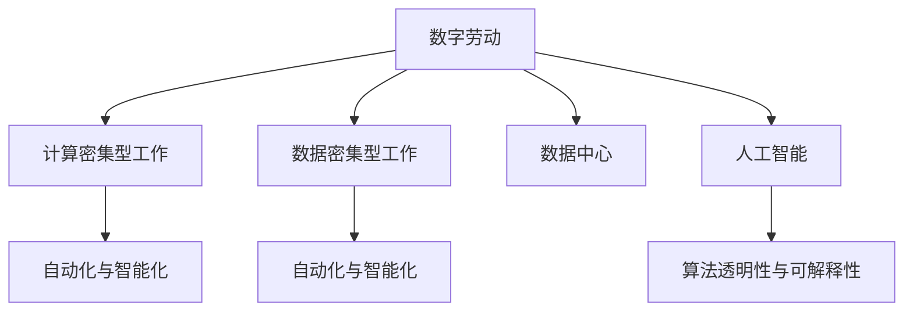

                 

# 数字劳动与未来工作：人类计算的社会影响

> 关键词：数字劳动, 未来工作, 计算密集型工作, 数据密集型工作, 自动化与智能化, 数据中心, 人工智能, 算法透明性

## 1. 背景介绍

### 1.1 问题的由来
随着信息技术的高速发展，尤其是互联网、大数据、云计算和人工智能等技术领域的迅猛进步，人类社会正逐步从传统的工业社会向数字化社会转型。在这一过程中，数字劳动作为一种新兴劳动形式，悄然渗透到社会生产、分配、交换、消费等各个环节，改变了传统劳动的形态和组织方式。

数字劳动主要指借助数字技术、数据资源、网络平台等手段，通过数字化生产方式所进行的劳动活动。与传统劳动形式相比，数字劳动具有更高的知识密集度、更快的劳动速度、更强的交互性和更广的劳动空间。数字劳动不仅极大地推动了生产力的发展，也对就业结构、社会关系和人类工作方式产生了深远影响。

### 1.2 问题核心关键点
数字劳动的本质是计算密集型劳动。在数字化时代，计算能力成为了关键的生产力，大量的数据处理、算法优化、模型训练等工作，都需要依靠计算资源来完成。因此，数字劳动在很大程度上依赖于计算机系统、数据中心、云计算平台等基础设施。

这一转变带来了两个核心问题：

1. **计算密集型工作的崛起**：随着计算能力的提升，越来越多的工作需要依赖计算机系统来完成，如软件开发、数据分析、算法优化、人工智能训练等。这些计算密集型工作的技术门槛较高，要求从业者具备一定的技术背景和专业技能。

2. **数据密集型工作的出现**：随着数据资源的广泛应用，数据采集、数据清洗、数据标注、数据挖掘等工作成为了数字劳动的重要组成部分。这些数据密集型工作对数据的依赖度极高，需要大量的数据资源和强大的数据处理能力。

### 1.3 问题研究意义
研究数字劳动与未来工作，对于理解数字化转型对人类社会的深远影响，探索未来工作形态的演变路径，具有重要意义：

1. **揭示计算密集型工作的趋势**：研究计算密集型工作的崛起，有助于把握未来技术发展方向，为政策制定提供依据，引导教育和职业培训体系适应新技术需求。

2. **探索数据密集型工作的潜力**：研究数据密集型工作的应用，有助于挖掘数据资源的巨大价值，推动数据科学、人工智能等领域的快速发展。

3. **分析自动化与智能化的影响**：研究自动化与智能化技术对就业结构的影响，有助于构建合理的工作分配机制，促进社会公平和谐。

4. **探索数据中心的角色**：研究数据中心在数字劳动中的作用，有助于优化数据基础设施布局，提升计算资源利用效率。

5. **增强算法的透明性与可解释性**：研究算法透明性与可解释性问题，有助于提升人工智能系统的可信度和安全性，推动算法伦理与法律规范的建立。

## 2. 核心概念与联系

### 2.1 核心概念概述

为更好地理解数字劳动与未来工作，本节将介绍几个密切相关的核心概念：

- **数字劳动**：指通过数字化手段进行的劳动活动，依赖计算机系统、数据资源、网络平台等基础设施完成。
- **计算密集型工作**：指需要大量计算资源和算法优化能力才能完成的工作，如软件开发、数据分析、模型训练等。
- **数据密集型工作**：指需要处理和分析大量数据资源的工作，如数据清洗、数据标注、数据挖掘等。
- **自动化与智能化**：指通过算法优化、模型训练等方式，实现工作任务的自动化与智能化处理。
- **数据中心**：指提供大规模计算资源和数据存储能力的设施，如Google Cloud、Amazon AWS、Microsoft Azure等。
- **人工智能**：指利用算法和大数据进行智能决策和任务执行的技术，涵盖了机器学习、深度学习、自然语言处理等多个领域。
- **算法透明性与可解释性**：指算法决策过程的可理解性和可解释性，对于保障人工智能系统的公平性与可信度至关重要。

这些核心概念之间的逻辑关系可以通过以下Mermaid流程图来展示：



这个流程图展示了大劳动与未来工作的主要组成部分及其相互关系：

1. 数字劳动通过数字化手段进行劳动，主要依赖计算密集型工作和数据密集型工作。
2. 计算密集型工作如软件开发、数据分析等，依赖大规模计算资源和算法优化能力。
3. 数据密集型工作如数据清洗、数据标注等，依赖大量的数据资源和强大的数据处理能力。
4. 自动化与智能化技术通过算法优化、模型训练等方式，实现计算密集型和数据密集型工作的自动化和智能化。
5. 数据中心提供大规模计算资源和数据存储能力，支持数字劳动的基础设施。
6. 人工智能技术涵盖机器学习、深度学习、自然语言处理等，通过算法优化和模型训练，实现智能决策和任务执行。
7. 算法透明性与可解释性是保障人工智能系统可信度的重要因素，对于推动算法伦理与法律规范的建立具有重要意义。

## 3. 核心算法原理 & 具体操作步骤
### 3.1 算法原理概述

数字劳动的核心是计算密集型劳动，其算法原理主要围绕以下几个方面展开：

- **计算能力需求**：计算密集型工作依赖于强大的计算能力和高性能计算机系统，如CPU、GPU、TPU等。
- **数据资源需求**：数据密集型工作依赖于大量的数据资源，数据采集、存储、处理和分析都是其重要组成部分。
- **算法优化需求**：通过算法优化和模型训练，实现工作任务的自动化与智能化处理，提升工作效率和质量。
- **网络平台需求**：数字化劳动离不开网络平台的支持，如云计算平台、大数据平台、AI平台等。

### 3.2 算法步骤详解

数字劳动与未来工作的算法实现一般包括以下几个关键步骤：

**Step 1: 数据收集与预处理**
- 收集与任务相关的数据集，并进行数据清洗、去重、标注等预处理。
- 对数据进行分批次处理，确保内存和存储资源的使用效率。

**Step 2: 模型训练与优化**
- 选择合适的算法和模型结构，进行训练。
- 根据训练结果，进行超参数调优和模型优化。
- 通过交叉验证等方法，评估模型性能，确保其在不同数据集上的泛化能力。

**Step 3: 自动化与智能化部署**
- 将训练好的模型部署到实际应用环境中。
- 设计自动化流程，实现模型的在线推理与更新。
- 通过监控系统，实时评估模型性能，进行动态优化。

**Step 4: 数据中心与云计算**
- 在数据中心中存储和管理大规模计算资源和数据存储设备。
- 通过云计算平台，提供计算资源按需分配和动态扩展能力。
- 优化计算资源利用率，提升系统的响应速度和稳定性和效率。

**Step 5: 算法透明性与可解释性**
- 设计可解释的算法模型，提升算法的透明性。
- 使用可解释性工具和技术，对算法进行可视化分析。
- 定期更新算法，提升其公平性和安全性。

### 3.3 算法优缺点

数字劳动的算法具有以下优点：

1. **高效性**：计算密集型工作通过算法优化和模型训练，可以大幅提升工作效率和质量。
2. **灵活性**：数据密集型工作可以根据数据资源的变化进行调整和优化。
3. **可扩展性**：算法和模型的可扩展性，使其能够应对不同规模和复杂度的任务。
4. **自动化**：自动化和智能化的部署，可以显著降低人工干预的需求，提升系统响应速度。

同时，这些算法也存在以下局限性：

1. **数据依赖**：计算密集型和数据密集型工作对数据资源的依赖度极高，数据质量和数据量决定了算法的效果。
2. **算法复杂性**：复杂的算法模型需要大量的计算资源和专业技能，增加了技术门槛。
3. **透明性不足**：部分算法的黑箱特性，导致其决策过程难以解释，影响算法的可信度。
4. **安全风险**：算法的透明度不足和数据依赖度高的特点，使其容易受到攻击和滥用。

### 3.4 算法应用领域

数字劳动的算法在多个领域得到了广泛应用，例如：

- **金融科技**：通过算法优化和模型训练，实现风险评估、信用评分、投资决策等任务。
- **医疗健康**：通过算法和大数据，实现疾病预测、基因分析、精准医疗等任务。
- **制造业**：通过算法优化和模型训练，实现生产计划、供应链管理、质量控制等任务。
- **智能交通**：通过算法优化和模型训练，实现交通流量预测、路径规划、智能驾驶等任务。
- **环境保护**：通过算法和大数据，实现环境监测、污染预测、资源管理等任务。

此外，数字劳动的算法还在科学研究、社交媒体分析、广告推荐等多个领域得到了应用。随着算法技术的不断发展，其在更多领域的应用前景也将愈加广阔。

## 4. 数学模型和公式 & 详细讲解  
### 4.1 数学模型构建

数字劳动与未来工作的算法实现，通常使用机器学习、深度学习等数学模型进行建模。以下以机器学习为例，介绍其数学模型的构建。

假设我们有一组训练数据集 $D=\{(x_i, y_i)\}_{i=1}^N$，其中 $x_i$ 为输入特征，$y_i$ 为输出标签。机器学习算法的目标是找到一个最优的函数 $f(x; \theta)$，使得 $f(x; \theta)$ 能够准确地映射输入特征 $x$ 到输出标签 $y$。

我们常用的回归模型和分类模型如下：

- **回归模型**：$y = f(x; \theta) = \sum_{i=1}^d \theta_i x_i$，其中 $\theta_i$ 为模型参数。
- **分类模型**：$y = f(x; \theta) = \frac{1}{1 + e^{-\sum_{i=1}^d \theta_i x_i}}$，其中 $e$ 为自然常数，$-\theta_i x_i$ 为线性模型，$1/(1 + e^{-\cdot})$ 为Sigmoid函数，将其转化为概率输出。

**公式推导过程**

对于回归模型，其损失函数为：

$$
\mathcal{L}(\theta) = \frac{1}{N} \sum_{i=1}^N (y_i - f(x_i; \theta))^2
$$

通过梯度下降等优化算法，求解最小化损失函数：

$$
\theta \leftarrow \theta - \eta \nabla_{\theta} \mathcal{L}(\theta)
$$

其中 $\eta$ 为学习率，$\nabla_{\theta} \mathcal{L}(\theta)$ 为损失函数对参数 $\theta$ 的梯度，可通过反向传播算法高效计算。

对于分类模型，其交叉熵损失函数为：

$$
\mathcal{L}(\theta) = -\frac{1}{N} \sum_{i=1}^N (y_i \log f(x_i; \theta) + (1-y_i) \log (1-f(x_i; \theta)))
$$

通过梯度下降等优化算法，求解最小化损失函数：

$$
\theta \leftarrow \theta - \eta \nabla_{\theta} \mathcal{L}(\theta)
$$

以上公式展示了回归和分类模型的数学模型构建和损失函数推导过程。通过这些数学模型，数字劳动与未来工作的算法实现了高效、灵活的计算和预测能力。

### 4.3 案例分析与讲解

以下以机器学习在金融风险评估中的应用为例，详细讲解其算法原理和实现步骤：

**数据准备**

假设我们有一组历史交易数据 $D=\{(x_i, y_i)\}_{i=1}^N$，其中 $x_i$ 为交易数据特征（如交易时间、金额、地点等），$y_i$ 为交易风险标签（如是否欺诈）。我们首先将数据集划分为训练集和测试集，并对其进行特征预处理和标注。

**模型训练**

我们选择一个简单的线性回归模型 $y = f(x; \theta) = \sum_{i=1}^d \theta_i x_i$，并通过梯度下降算法进行训练。

首先，我们定义损失函数：

$$
\mathcal{L}(\theta) = \frac{1}{N} \sum_{i=1}^N (y_i - f(x_i; \theta))^2
$$

然后，通过反向传播算法计算梯度，并更新模型参数：

$$
\theta \leftarrow \theta - \eta \nabla_{\theta} \mathcal{L}(\theta)
$$

经过多轮训练后，我们得到一个风险评估模型 $f(x; \theta)$，该模型能够根据新的交易数据 $x$ 预测其风险 $y$。

**模型评估与优化**

在模型训练完成后，我们使用测试集对模型进行评估，计算其精度、召回率等指标。根据评估结果，我们发现模型在某些类别上表现不佳，需要进行超参数调优和模型优化。

我们通过调整模型参数和特征选择，进一步优化模型性能，直到满足实际需求。

## 5. 项目实践：代码实例和详细解释说明
### 5.1 开发环境搭建

在进行数字劳动与未来工作的算法实现前，我们需要准备好开发环境。以下是使用Python进行机器学习算法开发的环境配置流程：

1. 安装Anaconda：从官网下载并安装Anaconda，用于创建独立的Python环境。

2. 创建并激活虚拟环境：
```bash
conda create -n pytorch-env python=3.8 
conda activate pytorch-env
```

3. 安装PyTorch：根据CUDA版本，从官网获取对应的安装命令。例如：
```bash
conda install pytorch torchvision torchaudio cudatoolkit=11.1 -c pytorch -c conda-forge
```

4. 安装必要的库：
```bash
pip install numpy pandas scikit-learn matplotlib jupyter notebook
```

5. 安装TensorBoard：
```bash
pip install tensorboard
```

完成上述步骤后，即可在`pytorch-env`环境中开始项目实践。

### 5.2 源代码详细实现

下面我们以机器学习在金融风险评估中的应用为例，给出完整的代码实现。

首先，定义数据准备函数：

```python
import numpy as np
import pandas as pd

def load_data(path):
    data = pd.read_csv(path)
    return data.dropna(), data['risk_label']
```

然后，定义模型训练函数：

```python
import torch
from sklearn.linear_model import LogisticRegression
from sklearn.metrics import accuracy_score

def train_model(X_train, y_train, X_test, y_test):
    model = LogisticRegression()
    model.fit(X_train, y_train)
    y_pred = model.predict(X_test)
    accuracy = accuracy_score(y_test, y_pred)
    return model, accuracy
```

接着，定义模型评估函数：

```python
def evaluate_model(model, X_test, y_test):
    y_pred = model.predict(X_test)
    accuracy = accuracy_score(y_test, y_pred)
    print(f"Accuracy: {accuracy:.2f}")
```

最后，启动训练流程并在测试集上评估：

```python
# 加载数据集
X_train, y_train = load_data('train.csv')
X_test, y_test = load_data('test.csv')

# 训练模型
model, accuracy = train_model(X_train, y_train, X_test, y_test)

# 评估模型
evaluate_model(model, X_test, y_test)

# 使用模型进行风险评估
risk_data = pd.read_csv('risk_data.csv')
risk_labels = model.predict(risk_data)
print(risk_labels)
```

以上就是使用PyTorch和Scikit-learn对金融风险评估模型进行训练和评估的完整代码实现。可以看到，得益于PyTorch和Scikit-learn的强大封装，我们可以用相对简洁的代码完成机器学习模型的开发。

### 5.3 代码解读与分析

让我们再详细解读一下关键代码的实现细节：

**load_data函数**：
- 加载CSV格式的数据文件，并删除缺失数据。

**train_model函数**：
- 定义Logistic Regression模型，并使用训练集进行训练。
- 计算模型在测试集上的精度，并返回训练好的模型。

**evaluate_model函数**：
- 在测试集上评估模型性能，并输出精度指标。

**启动训练流程**：
- 加载训练集和测试集，定义模型，并使用训练集进行训练。
- 在测试集上评估模型性能。
- 使用训练好的模型对新的风险数据进行风险评估。

可以看到，PyTorch和Scikit-learn的结合使用，使得机器学习模型的开发变得简洁高效。开发者可以将更多精力放在数据处理、模型改进等高层逻辑上，而不必过多关注底层的实现细节。

当然，工业级的系统实现还需考虑更多因素，如模型的保存和部署、超参数的自动搜索、更灵活的任务适配层等。但核心的算法实现基本与此类似。

## 6. 实际应用场景
### 6.1 金融科技

金融科技领域广泛应用了数字劳动与未来工作的算法。通过算法优化和模型训练，金融机构能够实现风险评估、信用评分、投资决策等任务。例如：

- **信用评分**：金融机构利用机器学习算法，对客户的个人信息、消费记录、社交网络等数据进行分析和建模，生成信用评分，用于评估客户的还款能力和信用风险。
- **风险评估**：通过算法和大数据分析，金融机构能够实时监测市场风险，预测股票、债券等金融资产的风险变化趋势，帮助投资者做出明智的投资决策。
- **智能投顾**：利用机器学习和自然语言处理技术，金融机构开发智能投顾系统，根据客户的风险偏好、投资目标等个性化需求，提供定制化的投资建议和资产配置方案。

这些应用极大地提升了金融机构的运营效率和决策质量，降低了金融风险。

### 6.2 医疗健康

医疗健康领域也广泛应用了数字劳动与未来工作的算法。通过算法优化和模型训练，医疗机构能够实现疾病预测、基因分析、精准医疗等任务。例如：

- **疾病预测**：医疗机构利用机器学习算法，对患者的病历、基因数据、生活方式等数据进行分析和建模，预测其患病的概率和风险。
- **基因分析**：通过算法和大数据分析，医疗机构能够挖掘基因序列中的关键信息，用于疾病诊断和治疗方案设计。
- **精准医疗**：利用机器学习和自然语言处理技术，医疗机构开发精准医疗系统，根据患者的基因数据和生活习惯，制定个性化的治疗方案和康复计划。

这些应用极大地提升了医疗机构的诊断和治疗水平，推动了医疗技术的进步。

### 6.3 制造业

制造业领域也广泛应用了数字劳动与未来工作的算法。通过算法优化和模型训练，制造企业能够实现生产计划、供应链管理、质量控制等任务。例如：

- **生产计划优化**：制造企业利用机器学习算法，对市场需求、库存、生产能力等数据进行分析和建模，优化生产计划，提升生产效率和资源利用率。
- **供应链管理**：通过算法和大数据分析，制造企业能够实时监测供应链中的各项指标，预测供应风险，优化供应链管理策略。
- **质量控制**：利用机器学习和图像处理技术，制造企业能够实时监测产品质量，预测缺陷率，提升产品质量和客户满意度。

这些应用极大地提升了制造企业的生产效率和产品品质，降低了生产成本。

## 7. 工具和资源推荐
### 7.1 学习资源推荐

为了帮助开发者系统掌握数字劳动与未来工作的理论基础和实践技巧，这里推荐一些优质的学习资源：

1. 《深度学习》系列博文：由深度学习领域专家撰写，涵盖深度学习的基本概念、算法原理和应用案例，是入门深度学习的必备资料。

2. 《机器学习实战》系列书籍：通过大量的代码实例和案例分析，详细讲解了机器学习算法的实现过程和应用场景，适合有一定编程基础的读者。

3. 《自然语言处理综论》系列书籍：涵盖了自然语言处理的基本原理和算法实现，适合对NLP感兴趣的读者。

4. 《Python数据科学手册》系列书籍：全面介绍了Python在数据科学领域的应用，包括数据处理、机器学习、数据分析等，适合Python开发者学习。

5. 《深度学习与Python》课程：由深度学习领域专家开设的线上课程，通过视频和代码实践，讲解深度学习算法的实现过程。

通过对这些资源的学习实践，相信你一定能够快速掌握数字劳动与未来工作的精髓，并用于解决实际的业务问题。

### 7.2 开发工具推荐

高效的开发离不开优秀的工具支持。以下是几款用于数字劳动与未来工作的开发工具：

1. PyTorch：基于Python的开源深度学习框架，灵活动态的计算图，适合快速迭代研究。

2. TensorFlow：由Google主导开发的开源深度学习框架，生产部署方便，适合大规模工程应用。

3. Scikit-learn：开源的机器学习库，提供了大量的机器学习算法和工具，适合快速开发和实验。

4. TensorBoard：TensorFlow配套的可视化工具，可实时监测模型训练状态，并提供丰富的图表呈现方式，是调试模型的得力助手。

5. Jupyter Notebook：强大的交互式编程环境，支持Python、R、MATLAB等多种编程语言，适合进行代码实验和文档记录。

6. Anaconda：Python环境的统一管理工具，提供虚拟环境、包管理、版本控制等功能，适合快速搭建和维护Python开发环境。

合理利用这些工具，可以显著提升数字劳动与未来工作的开发效率，加快创新迭代的步伐。

### 7.3 相关论文推荐

数字劳动与未来工作的研究源于学界的持续研究。以下是几篇奠基性的相关论文，推荐阅读：

1. "Data Mining in Databases: Concepts and Techniques"（数据库中的数据挖掘：概念与技术）：涵盖了数据挖掘的基本概念和算法原理，是数据科学领域的经典教材。

2. "A Survey of Deep Learning Techniques in Finance"（金融领域的深度学习技术综述）：综述了深度学习在金融领域的各类应用，包括风险评估、信用评分、投资决策等。

3. "Machine Learning in Healthcare: A Review"（医疗健康领域的机器学习综述）：综述了机器学习在医疗健康领域的应用，包括疾病预测、基因分析、精准医疗等。

4. "Industrial Digitalization and Its Challenges"（工业数字化的挑战）：探讨了工业数字化的发展趋势和面临的挑战，提出了相关的技术和政策建议。

5. "Towards General AI: Survey of Recent Advances in AI Modeling"（走向通用AI：近期AI模型综述）：综述了近年来AI模型的发展，包括深度学习、自然语言处理、计算机视觉等。

这些论文代表了大劳动与未来工作的研究进展，通过学习这些前沿成果，可以帮助研究者把握学科前进方向，激发更多的创新灵感。

## 8. 总结：未来发展趋势与挑战

### 8.1 研究成果总结

数字劳动与未来工作是数字化转型中的重要组成部分，其算法实现涉及数据收集、预处理、模型训练、自动化部署等多个环节。通过算法的优化和模型的训练，数字劳动能够高效、灵活地完成各种复杂任务，极大地提升了生产力和工作效率。

数字劳动与未来工作的算法主要集中在计算密集型工作和数据密集型工作两个领域，涵盖了金融科技、医疗健康、制造业等多个行业。这些算法在实际应用中取得了显著的成效，极大地推动了相关行业的数字化转型。

### 8.2 未来发展趋势

展望未来，数字劳动与未来工作的算法将呈现以下几个发展趋势：

1. **算法的智能化与自动化**：未来的数字劳动将更多地依赖于智能化算法和自动化流程，提升工作效率和决策质量。
2. **数据驱动与跨领域融合**：未来的数字劳动将更多地利用多领域数据进行建模和优化，推动跨领域融合，提升算法的泛化能力和应用范围。
3. **模型的透明性与可解释性**：未来的数字劳动将更多地注重算法的透明性与可解释性，提升系统的可信度和安全性。
4. **算法的伦理与安全**：未来的数字劳动将更多地考虑算法的伦理与安全问题，确保算法的公平性、公正性和安全性。

### 8.3 面临的挑战

尽管数字劳动与未来工作的算法已经取得了显著的成效，但在迈向更加智能化和普适化的过程中，仍面临诸多挑战：

1. **数据质量与数据隐私**：高质量的数据是算法实现的基础，但数据的获取与处理往往存在隐私和伦理问题。
2. **算法的透明性与公平性**：算法的黑箱特性和数据偏见，可能导致决策的不透明和公平性问题。
3. **计算资源的限制**：大模型和大规模数据的应用，需要强大的计算资源和存储资源，如何优化资源使用，是未来的一个重要研究方向。
4. **算法的可解释性**：算法的复杂性和不确定性，导致其可解释性不足，难以理解和调试。
5. **算法的伦理与安全**：算法的伦理与安全问题，如算法偏见、滥用等，需要进一步研究和规范。

### 8.4 研究展望

面对数字劳动与未来工作所面临的挑战，未来的研究需要在以下几个方面寻求新的突破：

1. **数据治理与隐私保护**：加强数据治理和隐私保护，确保数据的合法使用和隐私安全。
2. **算法的透明性与公平性**：研究算法的透明性与公平性问题，提升算法的可信度和安全性。
3. **计算资源的优化**：研究计算资源的优化方法，提升算法的效率和资源利用率。
4. **算法的可解释性**：研究算法的可解释性技术，提升算法的可理解和调试性。
5. **算法的伦理与安全**：研究算法的伦理与安全问题，确保算法的公平性、公正性和安全性。

## 9. 附录：常见问题与解答

**Q1：如何理解数字劳动与未来工作的本质？**

A: 数字劳动与未来工作的本质是计算密集型劳动，依赖于强大的计算能力和算法优化能力。通过算法优化和模型训练，数字劳动能够高效、灵活地完成各种复杂任务，极大地提升了生产力和工作效率。

**Q2：数字劳动与未来工作的主要应用场景有哪些？**

A: 数字劳动与未来工作在金融科技、医疗健康、制造业等多个领域得到了广泛应用。通过算法优化和模型训练，这些领域的企业能够实现风险评估、信用评分、疾病预测、精准医疗、生产计划优化、供应链管理、质量控制等任务。

**Q3：如何处理数字劳动中的数据质量与隐私问题？**

A: 在数字劳动中，数据质量与隐私保护至关重要。为确保数据质量，需要进行数据清洗、去重、标注等预处理步骤。为保护隐私，可以采用数据加密、匿名化、差分隐私等技术手段。同时，需要制定明确的数据使用规范和伦理准则，确保数据的合法使用和隐私安全。

**Q4：如何提升数字劳动中算法的透明性与公平性？**

A: 算法的透明性与公平性是数字劳动中重要的研究方向。可以通过引入可解释性技术，如LIME、SHAP等，提升算法的透明性。同时，需要对算法进行公平性评估，确保其在不同群体上的公平性。此外，可以引入多样性约束、对抗训练等方法，提升算法的公平性。

**Q5：如何优化数字劳动中的计算资源使用？**

A: 在数字劳动中，计算资源的优化是一个重要研究方向。可以通过模型裁剪、模型并行、混合精度训练等方法，优化计算资源的使用。同时，可以采用多级计算、分布式计算等技术，提升计算资源的利用率。

---

作者：禅与计算机程序设计艺术 / Zen and the Art of Computer Programming

