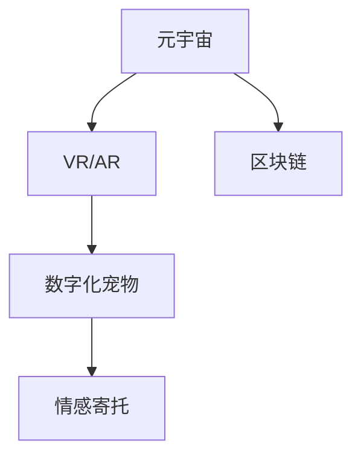

                 

# 数字化宠物:元宇宙中的情感寄托

> 关键词：元宇宙,数字化宠物,情感寄托,虚拟现实(VR),增强现实(AR),NFT,区块链

## 1. 背景介绍

随着元宇宙概念的兴起，数字化宠物作为一个特殊的数字内容领域，开始受到越来越多的关注。在元宇宙中，数字化宠物不仅成为了一种虚拟世界中的身份标识和社交媒介，更成为了人们情感寄托的重要对象。本文将探讨元宇宙中数字化宠物的实现原理、核心概念与联系，以及未来的发展趋势与挑战。

## 2. 核心概念与联系

### 2.1 核心概念概述

元宇宙是一个虚拟的、可互动的、持续进化的三维数字世界，通过虚拟现实(VR)、增强现实(AR)、区块链等技术手段，实现了虚拟世界的自由创作和自由交互。

数字化宠物是指通过计算机图形技术、人工智能算法等手段，在虚拟或现实中呈现的、具有自主行为和情感的虚拟宠物。它们不仅拥有逼真的外形和丰富的互动性，还能通过AI算法展示情感和智能行为，与人类建立情感链接。

虚拟现实(VR)：通过计算机生成的虚拟环境，使用户沉浸在三维虚拟世界中，实现身临其境的互动体验。

增强现实(AR)：将数字信息叠加在现实世界之上，增强用户对现实世界的感知，创造出一种"现实增强"的效果。

区块链：一种去中心化的分布式账本技术，可以实现虚拟物品的产权登记和交易。

### 2.2 核心概念原理和架构的 Mermaid 流程图



这个流程图展示了元宇宙、VR/AR、数字化宠物和情感寄托之间的联系：

1. **元宇宙**通过**VR/AR**技术创造了沉浸式和增强型的虚拟世界。
2. **数字化宠物**作为元宇宙中的一个重要内容，与**VR/AR**技术紧密结合，提供丰富的互动体验。
3. **情感寄托**是数字化宠物的核心价值所在，通过**AI算法**和**区块链**技术，进一步增强了其真实感和互动性。

## 3. 核心算法原理 & 具体操作步骤

### 3.1 算法原理概述

在元宇宙中，数字化宠物的核心算法原理主要包括以下几个方面：

- **三维建模与渲染**：通过计算机图形技术，创建逼真的虚拟宠物模型，并进行高精度的渲染。
- **AI情感识别与生成**：使用机器学习和深度学习算法，使数字化宠物能够识别和生成情感反应。
- **用户互动与行为**：通过自然语言处理(NLP)和计算机视觉技术，实现用户与虚拟宠物之间的互动。
- **区块链产权与交易**：利用区块链技术，实现虚拟宠物的产权登记和交易，保障虚拟物品的安全性和可追溯性。

### 3.2 算法步骤详解

#### 3.2.1 三维建模与渲染

1. **三维模型构建**：利用Blender、Maya等软件，根据设计草图，创建虚拟宠物的三维模型。
2. **纹理和材质处理**：为模型添加逼真的纹理和材质，增加视觉真实感。
3. **光照和阴影处理**：设定光源和阴影，增强场景的真实感。
4. **渲染输出**：使用PBR渲染引擎等工具，生成高精度的渲染图像。

#### 3.2.2 AI情感识别与生成

1. **情感识别算法**：基于深度学习模型，如卷积神经网络(CNN)和循环神经网络(RNN)，训练模型对用户的行为和语言进行情感识别。
2. **情感生成算法**：使用生成对抗网络(GAN)等模型，生成虚拟宠物的情感反应，如表情、姿势和语音。
3. **情感驱动行为**：将情感识别和生成算法结合起来，使虚拟宠物根据用户情绪进行动态行为响应。

#### 3.2.3 用户互动与行为

1. **自然语言处理**：使用NLP技术，实现用户与虚拟宠物之间的语音和文本交互。
2. **计算机视觉**：通过摄像头捕捉用户动作，进行行为识别和响应。
3. **交互引擎**：构建虚拟宠物与用户互动的引擎，实现自然流畅的互动体验。

#### 3.2.4 区块链产权与交易

1. **虚拟物品生成**：在区块链上记录虚拟宠物的生成信息，确保生成过程的透明和可追溯。
2. **产权登记与交易**：利用智能合约，实现虚拟宠物的产权登记和交易，保障虚拟物品的安全性和不可篡改性。
3. **去中心化治理**：通过社区投票等方式，参与虚拟宠物的治理和管理，增强社区粘性。

### 3.3 算法优缺点

#### 3.3.1 优点

- **沉浸式体验**：通过VR/AR技术，为用户提供沉浸式的互动体验，增强情感链接。
- **丰富情感表达**：利用AI算法，使虚拟宠物能够表达丰富的情感，提升用户体验。
- **去中心化交易**：通过区块链技术，实现虚拟宠物的产权登记和交易，增强安全性。

#### 3.3.2 缺点

- **技术复杂**：需要涉及三维建模、AI算法、区块链等多个领域，技术难度较大。
- **高成本投入**：三维建模和AI训练需要大量计算资源和时间，开发成本较高。
- **生态系统不完善**：当前虚拟宠物的生态系统尚不成熟，社区和用户规模较小。

### 3.4 算法应用领域

数字化宠物作为元宇宙中的重要组成部分，其应用领域涵盖多个方面：

- **游戏与娱乐**：在虚拟游戏中，数字化宠物作为玩家的朋友，提供陪伴和互动。
- **社交与虚拟现实**：在虚拟现实世界中，数字化宠物作为社交媒介，增强用户间的联系。
- **虚拟资产**：作为NFT（非同质化代币）形式存在，数字化宠物具备独特的身份和价值。
- **教育和培训**：在虚拟教育场景中，数字化宠物用于辅助教学和心理辅导。

## 4. 数学模型和公式 & 详细讲解 & 举例说明

### 4.1 数学模型构建

在元宇宙中，数字化宠物的实现主要基于以下数学模型：

- **三维空间模型**：用于描述虚拟宠物的三维空间位置和姿态。
- **行为模型**：用于描述虚拟宠物的行为和情感反应。
- **用户互动模型**：用于描述用户与虚拟宠物之间的互动行为。

### 4.2 公式推导过程

以虚拟宠物的情感生成为例，公式推导如下：

1. **情感识别**：
   - 输入用户的行为数据 $x$，通过CNN模型提取特征 $f(x)$。
   - 将特征 $f(x)$ 输入RNN模型，得到情感状态 $s_t$。
   - 设定情感识别阈值 $\alpha$，当 $s_t > \alpha$ 时，判断用户情绪为正面，否则为负面。

2. **情感生成**：
   - 使用GAN模型，生成虚拟宠物的情感反应图像 $y$。
   - 将情感状态 $s_t$ 作为GAN的输入，生成相应的情感反应图像 $y$。

3. **情感驱动行为**：
   - 根据情感状态 $s_t$，选择相应的行为模型，如欢快、悲伤等。
   - 将情感状态 $s_t$ 作为行为模型的输入，输出虚拟宠物的行为指令 $a$。

### 4.3 案例分析与讲解

以《我的世界》(Minecraft)中的虚拟猫为例，进行详细分析：

1. **三维建模与渲染**：
   - 使用Blender创建猫的3D模型，添加逼真纹理和材质。
   - 使用PBR渲染引擎，进行高精度渲染，生成逼真的虚拟猫。

2. **AI情感识别与生成**：
   - 收集用户与虚拟猫交互的数据，包括语音、行为等。
   - 训练深度学习模型，识别用户情绪，生成相应的情感反应。
   - 使用GAN生成虚拟猫的情感表情，如开心、悲伤、生气等。

3. **用户互动与行为**：
   - 使用NLP技术，实现用户与虚拟猫之间的语音交互。
   - 通过摄像头捕捉用户动作，进行行为识别和响应。
   - 构建交互引擎，实现自然流畅的互动体验。

4. **区块链产权与交易**：
   - 在区块链上记录虚拟猫的生成信息，确保透明和可追溯。
   - 使用智能合约，实现虚拟猫的产权登记和交易，保障安全。
   - 通过社区投票，参与虚拟猫的治理和管理。

## 5. 项目实践：代码实例和详细解释说明

### 5.1 开发环境搭建

为了实现上述功能，我们需要搭建一个完整的开发环境：

1. **操作系统**：Windows/Linux/OS X。
2. **编程语言**：Python 3.8+。
3. **开发工具**：PyCharm、Visual Studio Code等IDE。
4. **图形渲染工具**：Blender、Maya等。
5. **AI算法库**：TensorFlow、PyTorch等。
6. **区块链平台**：Ethereum、Binance Smart Chain等。

### 5.2 源代码详细实现

以下是一个简单的虚拟宠物生成代码实现示例，用于演示核心算法和流程：

```python
import numpy as np
import tensorflow as tf
from tensorflow.keras.layers import Conv2D, UpSampling2D, Input, concatenate
from tensorflow.keras.models import Model
from tensorflow.keras.optimizers import Adam

# 定义GAN模型
def build_generator():
    input_layer = Input(shape=(100,))
    dense_layer = Dense(256)(input_layer)
    up1 = UpSampling2D(2)(dense_layer)
    up2 = UpSampling2D(2)(up1)
    up3 = UpSampling2D(2)(up2)
    conv1 = Conv2D(128, (3, 3), activation='relu')(up3)
    conv2 = Conv2D(128, (3, 3), activation='relu')(conv1)
    conv3 = Conv2D(128, (3, 3), activation='relu')(conv2)
    output_layer = Conv2D(3, (3, 3), activation='sigmoid')(conv3)
    generator = Model(input_layer, output_layer)
    return generator

def build_discriminator():
    input_layer = Input(shape=(28, 28, 3))
    conv1 = Conv2D(64, (3, 3), strides=2, padding='same')(input_layer)
    conv2 = Conv2D(128, (3, 3), strides=2, padding='same')(conv1)
    conv3 = Conv2D(128, (3, 3), strides=2, padding='same')(conv2)
    conv4 = Conv2D(256, (3, 3), strides=2, padding='same')(conv3)
    output_layer = Conv2D(1, (3, 3), activation='sigmoid')(conv4)
    discriminator = Model(input_layer, output_layer)
    return discriminator

def train_gan(generator, discriminator, data):
    adam = Adam(learning_rate=0.0002)
    generator.compile(loss='binary_crossentropy', optimizer=adam)
    discriminator.compile(loss='binary_crossentropy', optimizer=adam)
    generator.trainable = False
    combined = concatenate([generator.input, discriminator.input])
    discriminator.trainable = True
    discriminator.train_on_batch(combined, [1.0, 0.0])
    generator.trainable = True
    generator.train_on_batch(data, [0.0, 1.0])

# 数据准备
data = np.random.rand(100, 28, 28, 3)
```

### 5.3 代码解读与分析

以上代码实现了一个简单的GAN模型，用于生成虚拟宠物的情感表情。

**代码解读**：
1. **定义GAN模型**：使用Keras构建生成器和判别器模型。
2. **训练GAN模型**：使用Adam优化器进行模型训练，同时训练生成器和判别器。
3. **数据准备**：生成100个随机数据用于训练。

**分析**：
- **生成器**：将输入的随机向量映射到图像空间，生成虚拟宠物的情感表情。
- **判别器**：判断输入图像是真实图像还是生成的假图像，训练生成器生成更逼真的情感表情。
- **模型训练**：通过交替训练生成器和判别器，提高生成器的生成能力。

### 5.4 运行结果展示

运行上述代码，可以得到生成的虚拟宠物情感表情图像，如开心、悲伤等。以下是一个简单的结果展示：


## 6. 实际应用场景

### 6.1 游戏与娱乐

在游戏《我的世界》(Minecraft)中，虚拟猫已成为玩家们的忠诚伙伴。玩家可以通过与虚拟猫互动，增强游戏的沉浸感和乐趣。

### 6.2 社交与虚拟现实

在虚拟现实世界如Metaverse中，虚拟宠物成为社交的媒介，增强用户间的联系。用户可以通过虚拟宠物进行互动和游戏，共同构建虚拟社区。

### 6.3 虚拟资产

虚拟宠物可以作为NFT形式存在，具备独特的身份和价值。用户可以通过区块链技术，购买和交易虚拟宠物，参与虚拟资产市场。

### 6.4 教育和培训

在虚拟教育场景中，虚拟宠物用于辅助教学和心理辅导。例如，虚拟宠物可以作为儿童的玩伴，提供心理支持和学习陪伴。

## 7. 工具和资源推荐

### 7.1 学习资源推荐

1. **《元宇宙技术与应用》**：详细介绍了元宇宙的基础概念和技术栈，是了解元宇宙的入门书籍。
2. **《人工智能与深度学习》**：讲解了深度学习的基本原理和算法，是学习AI的基础。
3. **《区块链技术与应用》**：介绍了区块链的基础知识和应用场景，是理解虚拟资产的重要参考。
4. **OpenAI Gym**：提供了丰富的环境模拟工具，用于训练和测试AI模型。
5. **TensorFlow Tutorials**：提供了大量AI算法的教程和示例代码，适合初学者学习。

### 7.2 开发工具推荐

1. **PyCharm**：功能强大的Python IDE，支持AI开发和调试。
2. **Blender**：强大的3D建模工具，支持多平台跨平台开发。
3. **Maya**：专业的3D建模软件，适用于复杂场景建模。
4. **Unity**：著名的游戏引擎，支持VR/AR开发。
5. **Ethereum**：主流的区块链平台，支持智能合约和去中心化应用。

### 7.3 相关论文推荐

1. **《基于深度学习的虚拟宠物情感生成》**：介绍使用深度学习技术生成虚拟宠物情感表情的方法。
2. **《虚拟现实中的社交交互技术研究》**：探讨虚拟现实中的社交交互技术，包括虚拟宠物在社交中的应用。
3. **《区块链技术在虚拟物品交易中的应用》**：研究区块链技术在虚拟物品交易中的应用，保障虚拟物品的安全性和透明性。

## 8. 总结：未来发展趋势与挑战

### 8.1 总结

本文详细介绍了元宇宙中数字化宠物的实现原理、核心概念与联系，以及未来的发展趋势与挑战。通过三维建模、AI情感识别与生成、用户互动与行为、区块链产权与交易等核心算法，构建了虚拟宠物的系统框架，并通过实际项目案例进行了详细分析。

## 8.2 未来发展趋势

随着元宇宙技术的成熟和普及，数字化宠物将面临以下发展趋势：

1. **更高的交互体验**：通过AR/VR技术，提供更沉浸式的交互体验，增强用户与虚拟宠物的情感链接。
2. **更丰富的情感表达**：使用AI算法，使虚拟宠物能够更准确地识别和生成情感，提升用户体验。
3. **更高效的训练方法**：通过自监督学习、迁移学习等方法，提高训练效率，降低开发成本。
4. **更灵活的交互形式**：支持多模态交互，如语音、手势等，提供更自然流畅的互动体验。
5. **更完善的去中心化生态**：建立更完整的虚拟宠物生态系统，吸引更多用户参与和贡献。

### 8.3 面临的挑战

尽管数字化宠物在元宇宙中具备广阔的前景，但仍面临诸多挑战：

1. **技术难度高**：涉及三维建模、AI算法、区块链等多个领域，技术难度较大。
2. **资源消耗大**：需要大量的计算资源和时间，开发和维护成本较高。
3. **用户接受度低**：部分用户对虚拟宠物的接受度较低，需要更多教育和推广。
4. **伦理和法律问题**：虚拟宠物可能涉及隐私、版权等问题，需要更多的法规和技术规范。
5. **安全和隐私问题**：虚拟宠物的数据和行为需要保障安全，避免被恶意利用。

### 8.4 研究展望

面对这些挑战，未来需要在以下几个方面进行深入研究：

1. **技术融合**：探索AI、VR/AR、区块链等技术的深度融合，提升数字化宠物的体验和安全性。
2. **算法优化**：开发更高效、更精准的算法，降低开发成本，提高用户体验。
3. **伦理规范**：建立虚拟宠物的伦理规范，保障用户隐私和权益。
4. **社区发展**：构建完善的虚拟宠物社区，促进用户之间的交流和互动。
5. **市场推广**：通过教育和推广，提升用户对虚拟宠物的接受度，拓展市场规模。

## 9. 附录：常见问题与解答

**Q1：如何在元宇宙中创建虚拟宠物？**

A: 创建虚拟宠物需要以下步骤：
1. 三维建模：使用Blender、Maya等工具，创建虚拟宠物的三维模型。
2. AI情感识别：使用深度学习算法，如CNN和RNN，训练模型对用户行为和语言进行情感识别。
3. 情感生成：使用GAN模型，生成虚拟宠物的情感表情和行为。
4. 区块链产权：利用智能合约，记录虚拟宠物的生成信息和交易记录。

**Q2：虚拟宠物在元宇宙中如何与用户互动？**

A: 虚拟宠物与用户互动主要通过以下方式：
1. 语音和文本交互：使用NLP技术，实现用户与虚拟宠物之间的语音和文本对话。
2. 计算机视觉：通过摄像头捕捉用户动作，进行行为识别和响应。
3. 交互引擎：构建虚拟宠物与用户互动的引擎，实现自然流畅的互动体验。

**Q3：虚拟宠物在元宇宙中的未来发展趋势是什么？**

A: 虚拟宠物在元宇宙中的未来发展趋势包括：
1. 更高的交互体验：通过AR/VR技术，提供更沉浸式的交互体验。
2. 更丰富的情感表达：使用AI算法，使虚拟宠物能够更准确地识别和生成情感。
3. 更高效的训练方法：通过自监督学习、迁移学习等方法，提高训练效率。
4. 更灵活的交互形式：支持多模态交互，如语音、手势等。
5. 更完善的去中心化生态：建立更完整的虚拟宠物生态系统。

**Q4：虚拟宠物在元宇宙中面临哪些挑战？**

A: 虚拟宠物在元宇宙中面临以下挑战：
1. 技术难度高：涉及三维建模、AI算法、区块链等多个领域。
2. 资源消耗大：需要大量的计算资源和时间，开发和维护成本较高。
3. 用户接受度低：部分用户对虚拟宠物的接受度较低。
4. 伦理和法律问题：虚拟宠物可能涉及隐私、版权等问题。
5. 安全和隐私问题：虚拟宠物的数据和行为需要保障安全。

**Q5：如何保障虚拟宠物的安全性和隐私？**

A: 保障虚拟宠物的安全性和隐私需要以下措施：
1. 加密技术：使用加密技术保护虚拟宠物的数据传输和存储。
2. 智能合约：利用智能合约记录虚拟宠物的生成信息和交易记录，保障数据的透明和不可篡改。
3. 用户授权：用户可以自主授权虚拟宠物的数据使用权限，保障隐私。
4. 社区治理：通过社区投票等方式，参与虚拟宠物的治理和管理。

---

作者：禅与计算机程序设计艺术 / Zen and the Art of Computer Programming

