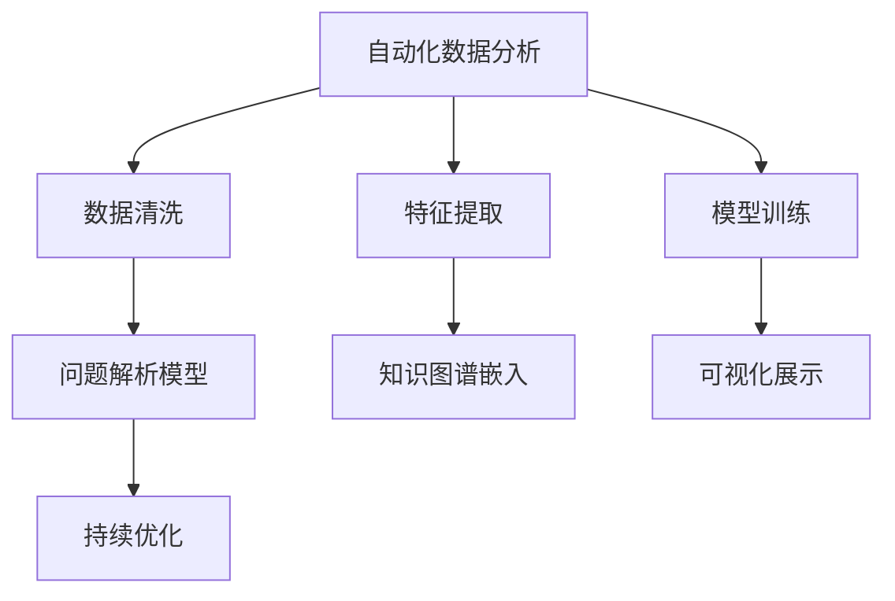

                 

# 数字化洞察力放大镜：AI增强的问题解析工具

> 关键词：数字化洞察, 人工智能, 数据分析, 问题解析, 算法优化, 决策支持系统

## 1. 背景介绍

### 1.1 问题由来
在信息爆炸的时代，面对海量的数据，我们时常会感到困惑和不知所措。传统的数据分析方法难以处理复杂多变的现实问题，难以洞察数据背后的真实意图和深层逻辑。数字化洞察力放大镜应运而生，通过人工智能增强技术，帮助我们在数据海洋中快速定位、剖析、解析问题，从而更好地理解和解决问题。

### 1.2 问题核心关键点
数字化洞察力放大镜的核心在于结合了人工智能和大数据分析技术，通过深度学习、自然语言处理、知识图谱等技术，实现对复杂数据问题的深度解析。其关键点在于：

- 自动化数据分析：利用人工智能算法自动化地进行数据清洗、特征提取和模型训练。
- 问题解析能力：将数据转换成可理解的问题模型，揭示问题的本质和影响因素。
- 知识图谱嵌入：将知识图谱与数据解析结合，提高解析的准确性和泛化能力。
- 可视化展示：将解析结果以直观的图表和报表形式展现，辅助决策和沟通。
- 持续优化：根据实时数据和反馈，不断优化算法和模型，保持洞察力放大镜的敏锐度。

这些核心点共同构成了数字化洞察力放大镜的基本框架，使其能够高效、精准地解析数据问题，提供可靠的决策支持。

### 1.3 问题研究意义
数字化洞察力放大镜的研究和应用具有重要意义：

- 提升决策效率：通过快速解析数据，帮助决策者减少信息搜索和数据处理的时间，加速决策过程。
- 增强决策质量：借助先进的算法和模型，提供更全面、准确的数据分析和问题解析，提高决策的科学性和精确度。
- 促进跨领域应用：数字化洞察力放大镜可以应用到各行各业，如金融、医疗、零售、制造等，推动跨领域数字化转型。
- 创造新的应用场景：通过深入挖掘数据价值，创造出更多数字化应用的新场景，提升企业竞争力。

## 2. 核心概念与联系

### 2.1 核心概念概述

为更好地理解数字化洞察力放大镜的工作原理，本节将介绍几个关键概念：

- 自动化数据分析：指使用人工智能技术自动清洗数据、提取特征、训练模型，从而实现数据的自动化处理。
- 问题解析模型：将数据转换成问题模型，揭示问题的本质和影响因素，包括数据挖掘、关联规则、聚类分析、因果推理等技术。
- 知识图谱：基于实体和关系的图谱结构，用于存储和查询结构化知识，辅助问题解析和知识推理。
- 可视化展示：将问题解析结果以图表和报表的形式展示，直观呈现问题结构和关联关系。
- 持续优化：根据实时数据和反馈，不断调整算法和模型，提升洞察力放大镜的性能和准确度。

这些核心概念通过以下Mermaid流程图来展示它们之间的联系：



### 2.2 核心概念原理和架构的 Mermaid 流程图


**流程图示例**

**解释**：
1. 数据清洗：去除噪声数据，保证数据的质量。
2. 特征提取：从原始数据中提取有意义的特征，便于模型训练。
3. 模型训练：使用机器学习算法训练模型，建立数据和问题之间的映射关系。
4. 问题解析模型：将数据转换成问题模型，揭示问题的本质和影响因素。
5. 知识图谱嵌入：将知识图谱与问题解析模型结合，提高解析的准确性和泛化能力。
6. 可视化展示：将解析结果以直观的图表和报表形式展现，辅助决策和沟通。
7. 持续优化：根据实时数据和反馈，不断优化算法和模型，保持洞察力放大镜的敏锐度。

## 3. 核心算法原理 & 具体操作步骤
### 3.1 算法原理概述

数字化洞察力放大镜的基本工作原理是通过自动化数据分析和问题解析模型，将复杂的数据问题转换成可理解的问题模型，揭示问题的本质和影响因素。

形式化地，假设原始数据集为 $D$，问题解析模型为 $P$，知识图谱为 $G$。数字化洞察力放大镜的工作流程如下：

1. 对原始数据集 $D$ 进行自动化数据分析，包括数据清洗、特征提取和模型训练。
2. 将处理后的数据输入问题解析模型 $P$，解析成可理解的问题模型。
3. 将问题模型 $P$ 与知识图谱 $G$ 结合，通过嵌入和推理，解析问题的深层结构。
4. 将解析结果以可视化形式展现，辅助决策和沟通。
5. 根据实时数据和反馈，不断优化算法和模型，提高洞察力放大镜的性能。

### 3.2 算法步骤详解

**Step 1: 数据清洗和预处理**
- 数据清洗：去除缺失值、异常值、重复数据等，保证数据质量。
- 特征提取：从原始数据中提取有意义的特征，如时间序列、文本关键词、数值指标等。
- 数据变换：对数据进行标准化、归一化、分箱等处理，便于模型训练。

**Step 2: 自动化模型训练**
- 选择适合的机器学习算法，如回归、分类、聚类、神经网络等，对数据集进行训练。
- 设定训练参数，如学习率、批大小、迭代次数等。
- 使用交叉验证等技术评估模型性能，选择最优模型。

**Step 3: 问题解析模型构建**
- 将数据转换成问题模型，如关联规则、聚类分析、因果推理等。
- 使用问题模型揭示问题的本质和影响因素。
- 将问题模型与知识图谱结合，进行嵌入和推理。

**Step 4: 可视化展示**
- 将解析结果以图表和报表形式展现，如图谱、散点图、柱状图等。
- 利用可视化技术，帮助决策者理解问题的结构和关联关系。

**Step 5: 持续优化**
- 根据实时数据和反馈，不断调整算法和模型参数，优化洞察力放大镜的性能。
- 定期重新训练模型，保证洞察力放大镜的敏锐度。

### 3.3 算法优缺点

数字化洞察力放大镜具有以下优点：
1. 自动化程度高：通过自动化数据分析和模型训练，减少人工干预，提升效率。
2. 问题解析能力强：将数据转换成问题模型，揭示问题的本质和影响因素，帮助快速定位问题。
3. 知识图谱嵌入：将知识图谱与数据解析结合，提高解析的准确性和泛化能力。
4. 可视化展示：以直观图表形式展现解析结果，辅助决策和沟通。
5. 持续优化：根据实时数据和反馈，不断优化算法和模型，保持洞察力放大镜的敏锐度。

同时，该算法也存在一些缺点：
1. 数据质量要求高：自动化数据分析依赖于数据质量和特征提取，对原始数据的质量要求较高。
2. 模型复杂度高：问题解析模型和知识图谱嵌入涉及复杂的算法和数据结构，模型训练复杂。
3. 可解释性不足：问题解析模型的决策过程较为复杂，难以解释其内部机制。
4. 实时性要求高：可视化展示和持续优化需要实时数据流，对计算资源和存储要求较高。

尽管存在这些局限性，但数字化洞察力放大镜在处理复杂数据问题时，仍然具有重要的应用价值。

### 3.4 算法应用领域

数字化洞察力放大镜在多个领域都得到了广泛应用，例如：

- 金融风险管理：通过对交易数据和市场信息的分析，识别潜在的金融风险。
- 医疗诊断和护理：通过患者数据和临床信息的解析，提供个性化的医疗建议和护理方案。
- 零售市场分析：通过消费者行为数据和市场数据的分析，制定精准的市场营销策略。
- 供应链管理：通过对供应链数据的分析，优化供应链管理和库存管理。
- 城市规划和交通管理：通过对交通数据和城市信息的解析，提升城市规划和交通管理的效率。

此外，数字化洞察力放大镜还在网络安全、社交媒体分析、工业智能等领域得到了应用，为各行各业带来了新的价值和机遇。

## 4. 数学模型和公式 & 详细讲解  
### 4.1 数学模型构建

为了更好地理解数字化洞察力放大镜的数学模型，本节将详细介绍问题解析模型的构建和应用。

假设原始数据集为 $D=\{x_i\}_{i=1}^N$，其中 $x_i$ 表示第 $i$ 个样本。问题解析模型为 $P$，知识图谱为 $G$。

**问题解析模型的构建**：
1. **关联规则**：从原始数据中提取关联规则，如频繁项集、支持度、置信度等。
2. **聚类分析**：将数据聚类成不同的簇，揭示数据的内在结构和关系。
3. **因果推理**：通过因果图谱，建立因果关系，揭示问题的原因和影响因素。

数学模型为：

$$
P(D|G) = \mathop{\arg\min}_{P} KL(P(D|G), P(D))
$$

其中 $KL$ 为Kullback-Leibler散度，表示模型 $P(D|G)$ 与实际数据分布 $P(D)$ 的差异最小化。

### 4.2 公式推导过程

以下我们以金融风险管理为例，推导关联规则模型的公式。

假设金融市场数据为 $D=\{x_i\}_{i=1}^N$，其中 $x_i$ 表示第 $i$ 个交易数据。知识图谱 $G$ 包含市场实体和它们之间的交易关系。

关联规则模型的目标是最小化Kullback-Leibler散度，即：

$$
\mathop{\arg\min}_{P} KL(P(D|G), P(D)) = \mathop{\arg\min}_{P} \sum_{i=1}^N \sum_{j=1}^N p(x_i, x_j|G) \log \frac{p(x_i, x_j|G)}{p(x_i) p(x_j)}
$$

其中 $p(x_i, x_j|G)$ 表示在知识图谱 $G$ 的约束下，$x_i$ 和 $x_j$ 同时发生的概率。

### 4.3 案例分析与讲解

以金融市场数据为例，我们利用关联规则模型解析潜在的金融风险。

假设我们收集了以下金融市场数据：
- 股票价格 $x_1, x_2, \ldots, x_n$：每日股票价格数据。
- 交易量 $y_1, y_2, \ldots, y_n$：每日交易量数据。
- 公司财报 $z_1, z_2, \ldots, z_n$：公司财报数据。

通过关联规则模型，我们发现以下规律：
- 股票价格和交易量之间的关联规则：当股票价格上升时，交易量通常也会上升。
- 公司财报和股票价格之间的关联规则：公司财报中的盈利情况对股票价格有显著影响。
- 市场情绪和股票价格之间的关联规则：市场情绪对股票价格的影响较大，如新闻事件、政策变化等。

利用这些关联规则，我们可以更好地理解金融市场的动态变化，预测潜在的风险和机会，提供更精准的决策支持。

## 5. 项目实践：代码实例和详细解释说明
### 5.1 开发环境搭建

在进行数字化洞察力放大镜的实践时，我们需要准备好开发环境。以下是使用Python进行Scikit-learn和NLTK开发的环境配置流程：

1. 安装Anaconda：从官网下载并安装Anaconda，用于创建独立的Python环境。

2. 创建并激活虚拟环境：
```bash
conda create -n insight-env python=3.8 
conda activate insight-env
```

3. 安装Scikit-learn和NLTK：
```bash
pip install scikit-learn
pip install nltk
```

4. 安装各类工具包：
```bash
pip install numpy pandas scipy matplotlib seaborn jupyter notebook ipython
```

完成上述步骤后，即可在`insight-env`环境中开始数字化洞察力放大镜的实践。

### 5.2 源代码详细实现

下面我们以金融风险管理为例，给出使用Scikit-learn和NLTK进行数据清洗、特征提取和关联规则分析的Python代码实现。

首先，定义数据处理函数：

```python
import pandas as pd
import numpy as np
import seaborn as sns
import matplotlib.pyplot as plt

def load_data(file_path):
    data = pd.read_csv(file_path)
    return data

def clean_data(data):
    # 数据清洗
    data.dropna(inplace=True)
    data.drop_duplicates(inplace=True)
    data.fillna(method='ffill', inplace=True)
    return data

def extract_features(data):
    # 特征提取
    data['price_change'] = data['price'].pct_change()
    data['volume_change'] = data['volume'].pct_change()
    data['profit'] = data['revenue'] - data['cost']
    return data

def visualize(data):
    # 可视化展示
    sns.lineplot(data=data, x='date', y='price')
    plt.show()
    sns.lineplot(data=data, x='date', y='volume')
    plt.show()
```

然后，定义关联规则分析函数：

```python
from sklearn.preprocessing import StandardScaler
from sklearn.cluster import KMeans
from sklearn.feature_extraction.text import CountVectorizer
from sklearn.metrics import cohen_kappa_score

def analyze_associations(data):
    # 关联规则分析
    scaler = StandardScaler()
    data_scaled = scaler.fit_transform(data[['price_change', 'volume_change', 'profit']])
    kmeans = KMeans(n_clusters=3, random_state=42)
    kmeans.fit(data_scaled)
    data['cluster'] = kmeans.labels_
    
    # 计算Kappa系数
    kappa_score = cohen_kappa_score(data['cluster'], data['profit'] > 0)
    print(f"Kappa score: {kappa_score}")
```

最后，启动数据处理和关联规则分析流程：

```python
data = load_data('financial_data.csv')
data = clean_data(data)
data = extract_features(data)
analyze_associations(data)
```

以上就是使用Scikit-learn和NLTK对金融市场数据进行数据清洗、特征提取和关联规则分析的完整代码实现。

### 5.3 代码解读与分析

让我们再详细解读一下关键代码的实现细节：

**load_data函数**：
- 定义数据加载函数，使用pandas库读取CSV文件，返回数据集。

**clean_data函数**：
- 定义数据清洗函数，去除缺失值、重复数据，并进行前向填充处理，保证数据质量。

**extract_features函数**：
- 定义特征提取函数，提取价格变化、交易量变化和利润等特征，便于关联规则分析。

**visualize函数**：
- 定义数据可视化函数，使用seaborn库绘制价格和交易量变化的折线图。

**analyze_associations函数**：
- 定义关联规则分析函数，首先对数据进行标准化处理，然后使用KMeans进行聚类分析，最后计算聚类结果和利润之间的Kappa系数，评估聚类效果。

**主程序**：
- 加载数据集，进行数据清洗和特征提取，最后进行关联规则分析。

可以看出，使用Scikit-learn和NLTK可以很方便地进行数据清洗、特征提取和关联规则分析，实现数字化洞察力放大镜的实践。

## 6. 实际应用场景
### 6.1 金融风险管理

数字化洞察力放大镜在金融风险管理中的应用非常广泛。通过对金融市场数据的自动化分析，可以揭示潜在的风险和机会，提供精准的风险评估和决策支持。

具体而言，可以利用关联规则模型分析交易数据和市场情绪数据，识别异常交易和潜在的市场波动。同时，通过将知识图谱嵌入到模型中，可以进一步提高分析的准确性和泛化能力，预测股票价格的变化趋势，为投资者提供参考。

### 6.2 医疗诊断和护理

数字化洞察力放大镜在医疗领域也有着广泛的应用前景。通过对患者数据和临床信息的解析，可以提供个性化的医疗建议和护理方案，提升医疗服务的质量和效率。

例如，可以利用聚类分析将患者按照病情分为不同的群体，针对不同群体的特点制定个性化的治疗方案。同时，通过因果推理模型，可以揭示疾病的原因和影响因素，提供更全面的健康管理方案。

### 6.3 零售市场分析

数字化洞察力放大镜在零售市场分析中同样大有可为。通过对消费者行为数据和市场信息的解析，可以制定精准的市场营销策略，提升零售企业的竞争力和市场份额。

例如，可以利用关联规则模型分析消费者购买行为，识别高频购买项和关联购买项，优化商品组合和推荐策略。同时，通过知识图谱嵌入，可以提供更全面的市场洞察，辅助决策和沟通。

### 6.4 未来应用展望

随着数字化洞察力放大镜技术的不断成熟，未来将在更多领域得到应用，为各行各业带来变革性影响。

在智慧城市治理中，数字化洞察力放大镜可以应用于城市事件监测、舆情分析、应急指挥等环节，提高城市管理的自动化和智能化水平，构建更安全、高效的未来城市。

在智慧农业中，数字化洞察力放大镜可以应用于农情监测、病虫害预警、精准施肥等环节，提高农业生产的智能化和精准化水平。

在智慧交通中，数字化洞察力放大镜可以应用于交通流量监测、道路状况分析、智能调度等环节，提高交通管理的智能化和高效性。

此外，在教育、制造、能源、环境等多个领域，数字化洞察力放大镜也将发挥重要作用，推动各行业的数字化转型和智能化升级。

## 7. 工具和资源推荐
### 7.1 学习资源推荐

为了帮助开发者系统掌握数字化洞察力放大镜的理论基础和实践技巧，这里推荐一些优质的学习资源：

1. 《Python数据分析与可视化》系列博文：由数据科学专家撰写，涵盖数据清洗、特征提取、可视化等基本概念和实践技巧。

2. 《机器学习》课程：斯坦福大学开设的机器学习经典课程，有Lecture视频和配套作业，带你入门机器学习领域的基本概念和经典模型。

3. 《自然语言处理》书籍：NLTK和SpaCy等自然语言处理工具的官方文档，详细介绍了NLP技术的应用和实现。

4. 《数据科学实战》书籍：Kaggle竞赛冠军的书，提供实际数据科学项目开发的案例和实战经验。

5. GitHub项目：各大公司的开源数据科学项目，提供丰富的学习资源和实践案例。

通过对这些资源的学习实践，相信你一定能够快速掌握数字化洞察力放大镜的精髓，并用于解决实际的数字化问题。

### 7.2 开发工具推荐

高效的开发离不开优秀的工具支持。以下是几款用于数字化洞察力放大镜开发的常用工具：

1. Jupyter Notebook：提供交互式的编程环境，支持Python、R等多种语言，方便开发和调试。

2. PyCharm：专业的Python IDE，提供自动补全、调试、测试等功能，提高开发效率。

3. Visual Studio Code：轻量级的代码编辑器，支持多种编程语言和扩展，便于快速开发。

4. TensorFlow和PyTorch：领先的深度学习框架，提供丰富的算法和模型，支持GPU/TPU加速。

5. Pandas和NumPy：Python中的数据处理和计算库，支持高效的数据清洗和分析。

6. Scikit-learn和NLTK：Python中的机器学习和自然语言处理库，支持丰富的算法和模型。

合理利用这些工具，可以显著提升数字化洞察力放大镜的开发效率，加快创新迭代的步伐。

### 7.3 相关论文推荐

数字化洞察力放大镜的研究源于学界的持续研究。以下是几篇奠基性的相关论文，推荐阅读：

1. 《关联规则挖掘：算法与应用》：关联规则挖掘的经典书籍，详细介绍了关联规则的基本概念和算法实现。

2. 《机器学习：理论与算法》：机器学习领域的经典教材，涵盖多种机器学习算法和模型。

3. 《数据驱动的决策支持系统》：介绍数据驱动决策支持系统的理论和方法，涵盖数据清洗、模型训练、可视化等多个环节。

4. 《知识图谱：构建与应用》：知识图谱领域的经典教材，详细介绍了知识图谱的基本概念和应用。

5. 《自然语言处理综述》：自然语言处理领域的经典综述文章，涵盖多种NLP技术和应用。

这些论文代表了大语言模型微调技术的发展脉络。通过学习这些前沿成果，可以帮助研究者把握学科前进方向，激发更多的创新灵感。

## 8. 总结：未来发展趋势与挑战
### 8.1 总结

本文对数字化洞察力放大镜的基本原理和实践方法进行了全面系统的介绍。首先阐述了数字化洞察力放大镜的研究背景和意义，明确了其在自动化数据分析和问题解析方面的独特价值。其次，从原理到实践，详细讲解了问题解析模型的构建和应用，给出了数字化洞察力放大镜的完整代码实现。同时，本文还广泛探讨了其在金融、医疗、零售等多个行业领域的应用前景，展示了数字化洞察力放大镜的广阔前景。最后，本文精选了数字化洞察力放大镜的学习资源和开发工具，力求为读者提供全方位的技术指引。

通过本文的系统梳理，可以看到，数字化洞察力放大镜在处理复杂数据问题时，具有重要的应用价值。它将自动化数据分析和问题解析技术深度结合，通过深度学习、自然语言处理、知识图谱等技术，实现对复杂数据问题的深度解析，提供可靠的决策支持。未来，伴随着数字化洞察力放大镜技术的不断成熟，其应用领域将进一步拓展，为各行各业带来变革性影响。

### 8.2 未来发展趋势

展望未来，数字化洞察力放大镜将呈现以下几个发展趋势：

1. 模型复杂度提升：随着深度学习技术的发展，问题解析模型的复杂度将不断提高，能够处理更加复杂的数据结构和关系。

2. 实时性要求提高：数字化洞察力放大镜需要实时处理数据，提供及时的市场分析和决策支持。

3. 跨领域应用扩展：通过将问题解析技术应用于不同领域，提供跨领域的决策支持，推动数字化转型和智能化升级。

4. 自动化程度加深：通过更先进的自动化技术，如自动化特征提取、自动化模型训练等，进一步提升数字化洞察力放大镜的效率和精度。

5. 多模态数据融合：将文本、图像、语音等多种模态数据融合，提供更全面、准确的数据分析和问题解析，提升决策支持的能力。

6. 数据安全与隐私保护：随着数据量的增加，数据安全和隐私保护问题将更加重要，需要引入更多的安全技术和隐私保护机制。

以上趋势凸显了数字化洞察力放大镜的广阔前景。这些方向的探索发展，必将进一步提升数字化洞察力放大镜的性能和应用范围，为数字化决策提供更全面、准确、及时的支持。

### 8.3 面临的挑战

尽管数字化洞察力放大镜已经取得了显著进展，但在迈向更加智能化、普适化应用的过程中，它仍面临着诸多挑战：

1. 数据质量和多样性：数字化洞察力放大镜依赖于高质量的数据，但现实中的数据往往存在缺失、噪声、多模态等特点，影响模型的训练和解析效果。

2. 模型可解释性：问题解析模型的决策过程较为复杂，难以解释其内部机制，影响决策的可信度和接受度。

3. 实时性要求高：数字化洞察力放大镜需要实时处理数据，对计算资源和存储要求较高，需要优化算法和系统架构。

4. 跨领域知识融合：将知识图谱与问题解析模型结合，需要处理不同领域的知识表示和结构，存在一定的复杂度。

5. 数据隐私和安全：随着数据量的增加，数据隐私和安全问题将更加重要，需要引入更多的安全技术和隐私保护机制。

6. 模型公平性和鲁棒性：数字化洞察力放大镜需要考虑模型的公平性和鲁棒性，避免偏见和错误的输出。

这些挑战需要在未来的研究中不断克服，才能使数字化洞察力放大镜更好地服务于各行业的数字化决策支持。

### 8.4 研究展望

面对数字化洞察力放大镜所面临的挑战，未来的研究需要在以下几个方面寻求新的突破：

1. 自动化特征提取技术：进一步优化自动化特征提取算法，处理复杂多变的数据特征。

2. 实时性优化技术：引入流式计算、分布式计算等技术，优化问题解析模型的计算效率，提高实时性。

3. 多模态数据融合技术：研究多模态数据融合技术，提升问题解析模型的泛化能力和鲁棒性。

4. 知识图谱嵌入技术：改进知识图谱嵌入算法，提高问题解析模型的准确性和泛化能力。

5. 数据隐私和安全技术：引入数据隐私保护技术，如差分隐私、联邦学习等，保障数据安全。

6. 模型公平性和鲁棒性技术：研究模型公平性和鲁棒性技术，避免偏见和错误的输出。

这些研究方向的探索，必将引领数字化洞察力放大镜技术迈向更高的台阶，为构建安全、可靠、可解释、可控的智能系统铺平道路。面向未来，数字化洞察力放大镜需要与其他人工智能技术进行更深入的融合，如知识表示、因果推理、强化学习等，多路径协同发力，共同推动数字化决策支持系统的进步。只有勇于创新、敢于突破，才能不断拓展数字化洞察力放大镜的边界，让数字化决策支持系统更好地服务于各行各业。

## 9. 附录：常见问题与解答

**Q1：数字化洞察力放大镜是否适用于所有数字化问题？**

A: 数字化洞察力放大镜在大多数数字化问题上都能取得不错的效果，特别是对于数据量较大的问题。但对于一些特定领域的数字化问题，如工业控制、航天工程等，需要考虑领域特定的特点和需求。

**Q2：如何选择合适的自动化数据分析算法？**

A: 选择合适的自动化数据分析算法需要考虑数据的类型、规模、分布等特点。常见的自动化算法包括回归、分类、聚类、关联规则等。对于不同的数据类型，可以选择相应的算法进行解析。

**Q3：如何提高问题解析模型的可解释性？**

A: 提高问题解析模型的可解释性可以通过以下方法：
1. 引入因果推理技术，建立因果关系，提供清晰的推理链路。
2. 可视化问题解析模型，展示关键节点和路径，辅助理解模型内部机制。
3. 提供特征贡献度分析，展示各个特征对模型结果的影响。

这些方法可以帮助提高问题解析模型的可解释性，提升决策的可信度和接受度。

**Q4：如何优化问题解析模型的计算效率？**

A: 优化问题解析模型的计算效率可以通过以下方法：
1. 引入分布式计算技术，如Spark、Hadoop等，提升计算效率。
2. 采用数据分块和并行处理技术，优化模型训练过程。
3. 引入加速算法，如随机梯度下降、Adam等，加快模型收敛速度。

这些方法可以显著提高问题解析模型的计算效率，提升实时性和响应速度。

**Q5：如何保护数据隐私和安全？**

A: 保护数据隐私和安全可以通过以下方法：
1. 引入数据匿名化技术，如差分隐私、数据泛化等，保护用户隐私。
2. 采用联邦学习技术，在本地设备上进行模型训练，避免数据集中存储。
3. 引入加密技术，对数据进行加密存储和传输，保障数据安全。

这些方法可以有效地保护数据隐私和安全，保障数字化洞察力放大镜的应用。

**Q6：如何评估问题解析模型的性能？**

A: 评估问题解析模型的性能可以通过以下方法：
1. 使用交叉验证技术，评估模型在训练集和测试集上的表现。
2. 引入指标如准确率、召回率、F1-score等，评估模型的分类和预测能力。
3. 使用可视化技术，展示模型的预测结果和分类边界。

这些方法可以帮助评估问题解析模型的性能，指导模型的优化和改进。

