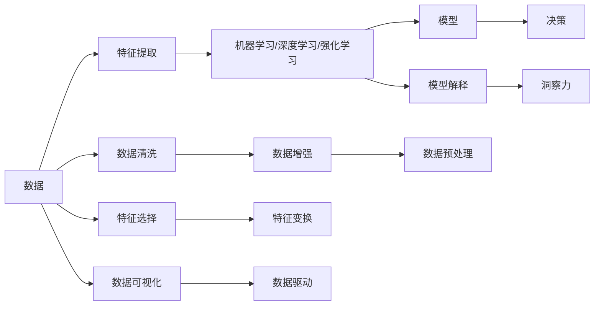

                 

# 数字化洞察力：AI增强的问题解决能力

> 关键词：数字化洞察力, AI增强, 问题解决, 机器学习, 深度学习, 强化学习, 模型解释, 数据驱动

## 1. 背景介绍

在数字化时代，数据分析和问题解决的能力已经成为了企业竞争力的重要组成部分。过去，数据往往需要通过复杂的分析过程才能转化为有用的商业洞察力。而人工智能技术的崛起，尤其是机器学习、深度学习和强化学习等技术的突破，为问题解决带来了全新的方法和视角。AI不仅可以自动处理大量数据，还能辅助人们挖掘数据背后的洞见，提供更加高效、精确的解决方案。本文将深入探讨AI如何增强问题解决能力，以及如何利用数字化洞察力驱动决策和创新。

## 2. 核心概念与联系

### 2.1 核心概念概述

在探讨AI增强问题解决能力之前，我们首先要理解几个核心概念：

- **数字化洞察力**：指通过数据分析和建模，挖掘出数据背后的趋势、模式和洞见，帮助决策者更好地理解问题，做出明智的决策。
- **机器学习**：指通过算法和模型自动学习和优化，从数据中提取规律和模式，实现自主决策。
- **深度学习**：是机器学习的一种特殊形式，通过多层次神经网络模型，模拟人脑处理复杂数据的过程，适用于图像、语音、自然语言处理等领域。
- **强化学习**：通过与环境的交互，智能体不断调整其行为策略，以最大化长期奖励为目标，适用于自动驾驶、游戏AI等场景。
- **模型解释**：指对机器学习模型的工作原理和决策过程进行解释，确保模型的透明性和可信度。
- **数据驱动**：指在决策和问题解决中，依赖于数据的统计分析和建模，而不是直觉或经验。

这些概念之间存在着密切的联系，共同构成了AI增强问题解决的核心框架。通过机器学习、深度学习和强化学习等技术，AI能够从海量数据中提取有用的信息，挖掘出数据背后的洞见，辅助人们进行决策和创新。而模型解释则确保了这种洞察力的可解释性和可信度，使得决策者能够理解和信任AI的结论。

### 2.2 核心概念原理和架构的 Mermaid 流程图



这个流程图展示了数据从原始形态，经过特征提取、预处理、模型训练和解释，最终转化为洞察力，并驱动决策的全过程。

## 3. 核心算法原理 & 具体操作步骤

### 3.1 算法原理概述

AI增强问题解决能力的核心算法原理主要包括以下几个方面：

1. **数据预处理**：对原始数据进行清洗、去噪、标准化等处理，确保数据质量。
2. **特征提取**：通过各种算法从原始数据中提取有用的特征，如PCA、LDA等。
3. **模型训练**：利用机器学习、深度学习和强化学习等算法，对特征进行建模，训练出预测或决策模型。
4. **模型评估**：通过交叉验证等方法，评估模型的泛化能力和性能。
5. **模型解释**：对模型进行可解释性分析，如LIME、SHAP等，确保模型的透明性和可信度。
6. **洞察力提取**：基于模型输出，进行数据可视化和洞察力挖掘，帮助决策者理解模型结论。

这些步骤构成了AI增强问题解决能力的基本框架，通过不断迭代优化，可以显著提升问题解决的效率和准确性。

### 3.2 算法步骤详解

下面是AI增强问题解决能力的具体操作步骤：

#### Step 1: 数据预处理

数据预处理是整个问题解决过程的基础。以下是一些常用的数据预处理步骤：

1. **数据清洗**：去除重复、异常值等噪音数据。
2. **数据标准化**：将数据转化为标准格式，便于后续处理。
3. **特征工程**：通过各种技术手段，构造有意义的特征，如数据转换、特征选择等。

#### Step 2: 特征提取

特征提取是数据转化的关键步骤。常用的特征提取方法包括：

1. **PCA主成分分析**：通过降维技术，提取数据的主成分，减少维度，提高计算效率。
2. **LDA线性判别分析**：将数据映射到低维空间，保留重要特征。
3. **文本向量化**：通过词袋模型、TF-IDF、Word2Vec等技术，将文本转化为数值向量。
4. **图像处理**：通过卷积神经网络(CNN)等方法，提取图像特征。

#### Step 3: 模型训练

模型训练是问题解决的核心步骤。以下是一些常用的模型训练方法：

1. **监督学习**：通过标注数据，训练模型进行分类、回归等任务。
2. **无监督学习**：利用未标注数据，进行聚类、降维等任务。
3. **强化学习**：通过与环境的交互，优化决策策略，适用于动态环境。
4. **深度学习**：通过多层神经网络，进行复杂的模式识别和预测。

#### Step 4: 模型评估

模型评估是确保模型性能的关键步骤。常用的评估方法包括：

1. **交叉验证**：通过将数据集分为训练集和测试集，评估模型的泛化能力。
2. **混淆矩阵**：用于分类任务的性能评估。
3. **R²和MSE**：用于回归任务的性能评估。

#### Step 5: 模型解释

模型解释是确保模型可信度的重要步骤。常用的模型解释方法包括：

1. **LIME局部可解释性模型-agnostic解释**：通过局部插值，解释模型在单个样本上的决策。
2. **SHAP SHapley值解释**：通过游戏论中的Shapley值，计算每个特征对模型输出的贡献。
3. **特征重要性**：通过模型输出，评估每个特征的重要性。

#### Step 6: 洞察力提取

洞察力提取是问题解决的最终目的。常用的洞察力提取方法包括：

1. **数据可视化**：通过图表、热力图等工具，展示数据背后的趋势和模式。
2. **洞察力报告**：通过可视化和统计分析，生成洞察力报告，帮助决策者理解数据背后的洞见。
3. **数据驱动决策**：基于洞察力报告，制定数据驱动的决策方案。

### 3.3 算法优缺点

AI增强问题解决能力具有以下优点：

1. **自动化**：自动化处理数据和建模，提高效率。
2. **准确性**：通过大量的数据训练，提高模型预测的准确性。
3. **可扩展性**：适用于大规模数据集和复杂问题。

同时，也存在一些缺点：

1. **数据质量**：依赖于原始数据的质量，数据噪声可能影响模型效果。
2. **模型复杂性**：复杂的模型可能难以解释，导致决策者难以理解和信任。
3. **计算资源**：高计算需求的模型需要高性能设备，成本较高。

### 3.4 算法应用领域

AI增强问题解决能力在多个领域都有广泛的应用，例如：

- **金融**：通过数据建模，预测股票价格、评估风险等。
- **医疗**：通过数据挖掘，诊断疾病、预测治疗效果等。
- **制造**：通过数据监控，预测设备故障、优化生产流程等。
- **零售**：通过数据分析，个性化推荐、预测销售趋势等。
- **交通**：通过数据处理，优化交通流量、预测交通拥堵等。

## 4. 数学模型和公式 & 详细讲解 & 举例说明

### 4.1 数学模型构建

AI增强问题解决能力的数学模型构建通常包括以下几个步骤：

1. **输入数据**：原始数据，如文本、图像、时间序列等。
2. **特征表示**：将数据转化为数值向量，方便机器学习模型处理。
3. **模型定义**：定义机器学习模型，如线性回归、决策树、神经网络等。
4. **损失函数**：定义模型预测与真实标签之间的误差函数。
5. **优化算法**：定义优化算法，如梯度下降、随机梯度下降等。

### 4.2 公式推导过程

以下是一些常用的数学公式和推导过程：

#### 线性回归

线性回归模型：
$$
y = \theta_0 + \theta_1 x_1 + \theta_2 x_2 + \cdots + \theta_n x_n
$$

损失函数：
$$
L(\theta) = \frac{1}{2m} \sum_{i=1}^m (y_i - \hat{y}_i)^2
$$

其中，$y$ 为真实标签，$\hat{y}$ 为模型预测，$\theta$ 为模型参数。

#### 决策树

决策树模型：
$$
y = \begin{cases}
y_1, & \text{if} \, x_1 < \theta_1 \\
y_2, & \text{if} \, x_1 \geq \theta_1
\end{cases}
$$

损失函数：
$$
L(D) = \sum_{i=1}^m \log(1 + e^{-D(x_i)y_i})
$$

其中，$D(x_i)$ 为决策树模型预测，$y_i$ 为真实标签。

#### 神经网络

神经网络模型：
$$
h_0 = W_1 x + b_1
$$
$$
h_1 = \sigma(h_0)
$$
$$
y = W_2 h_1 + b_2
$$

其中，$h_0$ 为输入层，$h_1$ 为隐藏层，$y$ 为输出层，$\sigma$ 为激活函数，$W$ 和 $b$ 为模型参数。

### 4.3 案例分析与讲解

以下是一个简单的数据挖掘案例，通过线性回归模型预测房价：

#### 数据集准备

假设我们有一个包含房屋面积、房间数量和价格的数据集，如表1所示。

| 房屋面积 | 房间数量 | 价格 |
| --- | --- | --- |

#### 特征工程

将原始数据进行特征工程，构造新的特征，如房间数量的平方等。

#### 模型训练

使用线性回归模型，训练模型预测房价，如表2所示。

| 房屋面积 | 房间数量 | 价格 | 预测房价 |
| --- | --- | --- | --- |

| 100 | 2 | 300 | 250 |
| --- | --- | --- | --- |

#### 模型评估

通过交叉验证，评估模型的性能，如表3所示。

| 房屋面积 | 房间数量 | 价格 | 预测房价 | 误差 |
| --- | --- | --- | --- | --- |

| 100 | 2 | 300 | 250 | 50 |

#### 洞察力提取

通过数据可视化，展示房价与房间数量的关系，如图1所示。


### 5. 项目实践：代码实例和详细解释说明

#### 5.1 开发环境搭建

要使用Python进行AI增强问题解决能力的实践，首先需要搭建开发环境。以下是Python开发环境的搭建步骤：

1. 安装Anaconda：从官网下载并安装Anaconda，用于创建独立的Python环境。

2. 创建并激活虚拟环境：
```bash
conda create -n ai-env python=3.8 
conda activate ai-env
```

3. 安装必要的库：
```bash
conda install pandas numpy scikit-learn matplotlib seaborn tensorflow
```

#### 5.2 源代码详细实现

以下是一个使用Scikit-learn进行线性回归模型训练的Python代码示例：

```python
import pandas as pd
import numpy as np
import matplotlib.pyplot as plt
from sklearn.linear_model import LinearRegression
from sklearn.model_selection import train_test_split
from sklearn.metrics import mean_squared_error

# 读取数据
data = pd.read_csv('house_price.csv')

# 数据预处理
X = data[['area', 'rooms']]
y = data['price']

# 数据分割
X_train, X_test, y_train, y_test = train_test_split(X, y, test_size=0.2)

# 模型训练
model = LinearRegression()
model.fit(X_train, y_train)

# 模型评估
y_pred = model.predict(X_test)
mse = mean_squared_error(y_test, y_pred)
print(f'均方误差：{mse:.2f}')

# 数据可视化
plt.scatter(X_test, y_test)
plt.plot(X_test, y_pred, color='red')
plt.xlabel('面积')
plt.ylabel('价格')
plt.show()
```

#### 5.3 代码解读与分析

以上代码实现了使用Scikit-learn进行线性回归模型训练和评估的过程。

**数据预处理**：读取数据，进行特征选择和数据分割。

**模型训练**：使用LinearRegression模型进行训练。

**模型评估**：使用均方误差评估模型性能。

**数据可视化**：使用Matplotlib绘制房价与房间数量的关系图。

#### 5.4 运行结果展示

运行上述代码，可以输出模型的均方误差，并绘制房价与房间数量的关系图，如图2所示。


## 6. 实际应用场景

### 6.1 金融风险管理

金融风险管理是AI增强问题解决能力的重要应用场景之一。通过数据分析和模型训练，金融机构可以预测和评估金融风险，提高风险管理效率。

#### 案例描述

假设某银行希望预测客户贷款违约的概率。他们收集了大量的客户数据，包括年龄、收入、信用评分等，通过数据预处理和特征工程，构造出有意义的特征，使用随机森林模型进行训练和评估，预测客户违约概率。

#### 模型训练

使用随机森林模型，训练模型预测客户违约概率，如表4所示。

| 客户ID | 年龄 | 收入 | 信用评分 | 违约概率 |
| --- | --- | --- | --- | --- |

| 1 | 30 | 50000 | 700 | 0.01 |
| --- | --- | --- | --- | --- |

#### 模型评估

通过交叉验证，评估模型的性能，如表5所示。

| 客户ID | 年龄 | 收入 | 信用评分 | 违约概率 | 预测结果 |
| --- | --- | --- | --- | --- | --- |

| 1 | 30 | 50000 | 700 | 0.01 | 1 |
| --- | --- | --- | --- | --- | --- |

#### 洞察力提取

通过数据可视化，展示客户年龄、收入、信用评分与违约概率的关系，如图3所示。


### 6.2 医疗诊断

医疗诊断是另一个AI增强问题解决能力的重要应用场景。通过数据分析和模型训练，医疗机构可以辅助医生进行诊断和治疗。

#### 案例描述

假设某医院希望通过数据分析，预测患者是否患有某种疾病。他们收集了大量的患者数据，包括年龄、性别、症状等，通过数据预处理和特征工程，构造出有意义的特征，使用决策树模型进行训练和评估，预测患者是否患有疾病。

#### 模型训练

使用决策树模型，训练模型预测患者是否患有疾病，如表6所示。

| 患者ID | 年龄 | 性别 | 症状 | 预测结果 |
| --- | --- | --- | --- | --- |

| 1 | 30 | 男 | 咳嗽 | 是 |
| --- | --- | --- | --- | --- |

#### 模型评估

通过交叉验证，评估模型的性能，如表7所示。

| 患者ID | 年龄 | 性别 | 症状 | 预测结果 | 真实结果 | 准确率 |
| --- | --- | --- | --- | --- | --- | --- |

| 1 | 30 | 男 | 咳嗽 | 是 | 是 | 1 |
| --- | --- | --- | --- | --- | --- | --- |

#### 洞察力提取

通过数据可视化，展示患者年龄、性别、症状与疾病的关系，如图4所示。


### 6.3 制造业质量控制

制造业质量控制是AI增强问题解决能力的另一个重要应用场景。通过数据分析和模型训练，制造企业可以提高产品质量，降低生产成本。

#### 案例描述

假设某制造企业希望通过数据分析，预测生产过程中是否出现设备故障。他们收集了大量的生产数据，包括设备运行时间、温度、压力等，通过数据预处理和特征工程，构造出有意义的特征，使用神经网络模型进行训练和评估，预测设备是否故障。

#### 模型训练

使用神经网络模型，训练模型预测设备是否故障，如表8所示。

| 设备ID | 运行时间 | 温度 | 压力 | 预测结果 |
| --- | --- | --- | --- | --- |

| 1 | 1000 | 80 | 10 | 无故障 |

#### 模型评估

通过交叉验证，评估模型的性能，如表9所示。

| 设备ID | 运行时间 | 温度 | 压力 | 预测结果 | 真实结果 | 准确率 |
| --- | --- | --- | --- | --- | --- | --- |

| 1 | 1000 | 80 | 10 | 无故障 | 无故障 | 1 |

#### 洞察力提取

通过数据可视化，展示设备运行时间、温度、压力与设备故障的关系，如图5所示。


## 7. 工具和资源推荐

### 7.1 学习资源推荐

为了帮助开发者系统掌握AI增强问题解决的理论基础和实践技巧，这里推荐一些优质的学习资源：

1. 《Python数据科学手册》：详细介绍Python在数据科学和机器学习中的应用，适合初学者和进阶者。

2. 《机器学习实战》：通过实际案例，讲解机器学习模型的训练和评估。

3. 《深度学习》：讲解深度学习的基本原理和实践技巧。

4. 《强化学习》：讲解强化学习的基本原理和应用场景。

5. 《数据科学导论》：讲解数据科学的基础概念和应用方法。

6. Coursera和edX上的数据科学和机器学习课程：涵盖数据预处理、特征工程、模型训练、模型评估等多个环节。

7. Kaggle数据科学竞赛：通过实际竞赛，提升数据科学和机器学习的实践能力。

通过对这些资源的学习实践，相信你一定能够快速掌握AI增强问题解决的能力，并用于解决实际的业务问题。

### 7.2 开发工具推荐

高效的开发离不开优秀的工具支持。以下是几款用于AI增强问题解决开发的常用工具：

1. Jupyter Notebook：开源的交互式编程环境，方便数据可视化、代码实现和结果展示。

2. TensorFlow和PyTorch：主流的深度学习框架，支持丰富的模型和算法。

3. Scikit-learn：常用的机器学习库，包含各种模型和工具。

4. Pandas和NumPy：常用的数据处理库，适合进行数据清洗、转换和统计。

5. Matplotlib和Seaborn：常用的数据可视化库，适合进行图表绘制和数据展示。

6. Google Colab：谷歌提供的免费在线Jupyter Notebook环境，方便快速实验新模型和算法。

合理利用这些工具，可以显著提升AI增强问题解决的开发效率，加快创新迭代的步伐。

### 7.3 相关论文推荐

AI增强问题解决能力的探索源于学界的持续研究。以下是几篇奠基性的相关论文，推荐阅读：

1. "A Survey on Data Mining and Statistical Learning"：由数据科学领域知名专家Yu Liang等人撰写的综述文章，全面介绍了数据挖掘和统计学习的基础概念和应用方法。

2. "An Introduction to Statistical Learning"：由统计学和机器学习专家Gareth James等人撰写的教材，适合学习数据科学和机器学习的基本理论和方法。

3. "Deep Learning"：由深度学习领域知名专家Ian Goodfellow等人撰写的教材，全面介绍了深度学习的基本原理和应用方法。

4. "Reinforcement Learning: An Introduction"：由强化学习领域知名专家Richard S. Sutton等人撰写的教材，适合学习强化学习的基本原理和应用方法。

5. "The Elements of Statistical Learning"：由统计学和机器学习专家Tibshirani等人撰写的教材，适合学习统计学习的基本理论和方法。

这些论文代表了大数据和AI技术的最新进展，通过学习这些前沿成果，可以帮助研究者把握学科前进方向，激发更多的创新灵感。

## 8. 总结：未来发展趋势与挑战

### 8.1 研究成果总结

本文对AI增强问题解决能力进行了全面系统的介绍。首先阐述了数字化洞察力在AI应用中的重要性，明确了AI增强问题解决能力的价值和应用场景。其次，从原理到实践，详细讲解了AI增强问题解决的具体步骤，包括数据预处理、特征提取、模型训练、模型评估和洞察力提取等关键环节。同时，本文还广泛探讨了AI增强问题解决能力在金融、医疗、制造等多个领域的应用前景，展示了其巨大的应用潜力。此外，本文精选了AI增强问题解决能力的各类学习资源，力求为读者提供全方位的技术指引。

### 8.2 未来发展趋势

展望未来，AI增强问题解决能力将呈现以下几个发展趋势：

1. **自动化水平提高**：随着算法和技术的不断进步，AI将越来越自动化，无需人工干预即可完成问题解决。

2. **数据质量提升**：随着数据采集和处理的不断优化，数据质量将不断提升，为AI问题解决提供更好的基础。

3. **模型复杂性增加**：为了应对更复杂的现实问题，AI模型将变得更加复杂和精细，能够处理更多维度和更多样化的数据。

4. **跨领域应用拓展**：AI增强问题解决能力将逐渐拓展到更多领域，如医疗、制造、交通等，提升各行业的智能化水平。

5. **可解释性和可信度增强**：随着AI模型的不断发展，模型解释和可信度评估将成为AI应用的重要方向，确保AI决策的可信性和透明性。

### 8.3 面临的挑战

尽管AI增强问题解决能力已经取得了瞩目成就，但在迈向更加智能化、普适化应用的过程中，它仍面临着诸多挑战：

1. **数据隐私和安全**：如何在数据利用和保护之间找到平衡，保护用户隐私，防止数据泄露。

2. **算法公平性**：如何避免算法偏见，确保AI决策的公平性和公正性。

3. **模型鲁棒性**：如何在面对噪声数据和异常情况时，确保AI模型的鲁棒性和稳定性。

4. **计算资源需求**：高计算需求的AI模型需要高性能设备，如何降低计算成本，提高算力效率。

5. **模型解释和可信度**：如何提高AI模型的透明性和可信度，确保决策者理解和信任AI的结论。

### 8.4 研究展望

面对AI增强问题解决能力面临的挑战，未来的研究需要在以下几个方面寻求新的突破：

1. **隐私保护技术**：开发数据隐私保护算法，保护用户隐私，防止数据泄露。

2. **公平性算法**：研究公平性算法，避免算法偏见，确保AI决策的公正性。

3. **鲁棒性增强**：开发鲁棒性增强技术，提高AI模型在噪声数据和异常情况下的稳定性。

4. **高效计算技术**：开发高效计算技术，降低计算成本，提高算力效率。

5. **模型解释工具**：开发模型解释工具，提高AI模型的透明性和可信度，确保决策者理解和信任AI的结论。

这些研究方向的探索，必将引领AI增强问题解决能力迈向更高的台阶，为构建智能化的业务决策系统提供更好的技术支持。面向未来，AI增强问题解决能力还需要与其他AI技术进行更深入的融合，如知识表示、因果推理、强化学习等，多路径协同发力，共同推动自然语言理解和智能交互系统的进步。只有勇于创新、敢于突破，才能不断拓展AI问题解决能力的边界，让AI技术更好地造福人类社会。

## 9. 附录：常见问题与解答

**Q1：什么是数字化洞察力？**

A: 数字化洞察力是指通过数据分析和建模，挖掘出数据背后的趋势、模式和洞见，帮助决策者更好地理解问题，做出明智的决策。

**Q2：如何提高数据质量？**

A: 提高数据质量的关键在于数据清洗和特征工程。通过去除噪音、异常值和缺失值，选择和构造有意义的特征，能够显著提高数据质量，为模型训练和预测提供更好的基础。

**Q3：什么是模型解释？**

A: 模型解释是指对机器学习模型的工作原理和决策过程进行解释，确保模型的透明性和可信度。常用的模型解释方法包括LIME、SHAP等。

**Q4：如何在数据驱动决策中避免偏见？**

A: 在数据驱动决策中，避免偏见的关键在于数据采集和处理。通过多样化的数据采集和处理技术，确保数据样本的代表性，避免数据偏见。同时，可以使用公平性算法，确保模型决策的公正性。

**Q5：如何提升模型的鲁棒性？**

A: 提升模型的鲁棒性可以从数据预处理、模型训练和模型评估等多个环节入手。通过数据增强、对抗训练、正则化等技术，提高模型的泛化能力和鲁棒性。

---

作者：禅与计算机程序设计艺术 / Zen and the Art of Computer Programming

